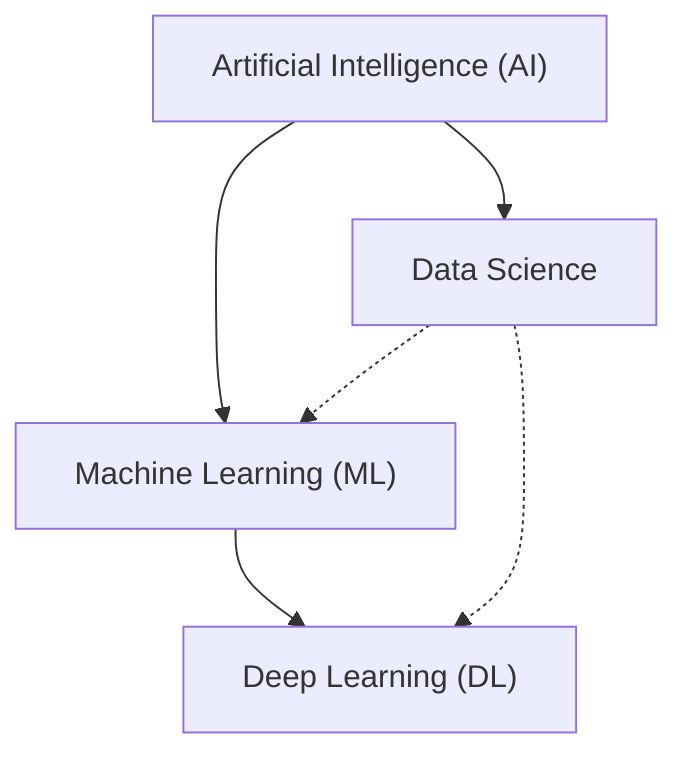
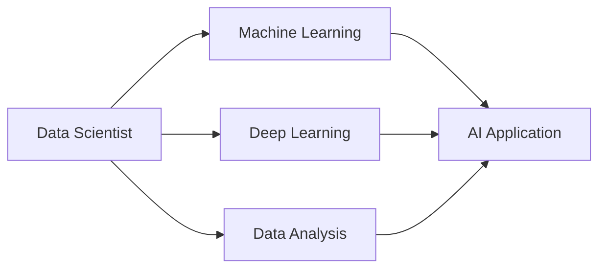
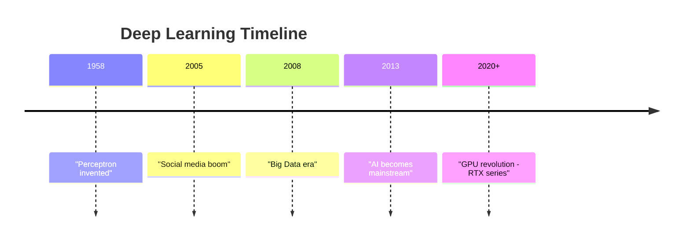

# Chapter 1: Deep Learning Introduction

## 🎯 Learning Objectives
- Understand the relationship between AI, ML, DL, and Data Science
- Learn why Deep Learning is becoming popular
- Understand the historical context and evolution of DL
- Know the key differences and applications

## 📚 Key Concepts

### AI vs ML vs DL vs Data Science



#### 1. Artificial Intelligence (AI)
- **Definition**: Applications that perform tasks without human intervention
- **Goal**: Create applications that can make decisions based on user behavior automatically

**Examples:**
- Netflix: Automatic movie recommendations
- Tesla: Self-driving cars (autopilot)
- Amazon: Product recommendations
- Chatbots: Conversational AI (Sofia, ChatGPT)
- Twitter/Instagram: Content recommendation algorithms

**Key Point**: AI module is integrated with existing software to enhance user experience

#### 2. Machine Learning (ML)
- **Definition**: Subset of AI that provides statistical tools to analyze, visualize, and predict data
- **Position**: ML ⊂ AI (Machine Learning is a subset of Artificial Intelligence)

**What ML Does:**
- Analyze data
- Visualize data
- Make predictions
- Perform forecasting
- Clustering (grouping similar data)

**Note**: Programming languages like Python + Stats tools = ML implementation

#### 3. Deep Learning (DL)
- **Definition**: Subset of ML that mimics the human brain using neural networks
- **Position**: DL ⊂ ML ⊂ AI
- **History**: Research started in **1958** (not a recent field!)
- **First Neural Network**: Perceptron

**Main Aim**: Mimic human brain learning processes

**Why DL Works Now:**
- Multi-layered neural networks
- Massive data availability
- Advanced GPU hardware (NVIDIA)

#### 4. Data Science (DS)
- **Position**: Overlaps with AI, ML, and DL
- **Role**: Data Scientists work across all three domains
- **Goal**: Create AI applications using ML/DL techniques



### Why Deep Learning is Becoming Popular

#### 1. Exponential Data Growth
**Timeline:**
- **2005**: Facebook launched (Web 2.0 revolution)
- **Post-2005**: Instagram, WhatsApp, LinkedIn, Twitter emerged
- **Result**: Exponential data generation from social media

**Web 2.0 Features:**
- User login and data storage
- Social interaction
- Image/video sharing
- Real-time communication

**Impact:**
- **2008-2010**: Big Data became popular (storing massive data efficiently)
- **2013-2014**: AI/Data Science became mainstream (utilizing stored data)

#### 2. Hardware Advancement (GPUs)
- **Company**: NVIDIA leading the revolution
- **GPU**: Graphic Processing Units

**Why GPUs Matter:**
- Multi-layered neural networks have millions of parameters
- Training requires multiple epochs (iterations)
- GPUs train models **significantly faster** than CPUs
- GPU costs are reducing continuously

**Example Evolution:**
- RTX Titan → RTX 3090 (more efficient, better performance)
- NVIDIA provides optimized libraries for DL training

#### 3. Better Product Experience
**Company Motivation:**
- Companies have petabytes of data
- Want to make products better using data
- Increase user engagement
- Generate more revenue

**Real Example - Panasonic ACs:**
- Collected user AC usage data
- Created model to optimize temperature settings
- **Result**: Reduced electricity bills for users
- **Business Model**: Sold as subscription service

**Benefits:**
- Seamless user experience
- Revenue generation
- Better decision making
- Competitive advantage

### Deep Learning Research Evolution



## ❓ Interview Questions & Answers

**Q1: What is the difference between AI, ML, and DL?**
- **AI**: Applications performing tasks without human intervention (e.g., Netflix recommendations)
- **ML**: Subset of AI using statistical tools for predictions and analysis
- **DL**: Subset of ML that mimics human brain using multi-layered neural networks

**Q2: Why is Deep Learning becoming so popular now if research started in 1958?**
Three main reasons:
1. **Massive Data**: Social media (post-2005) created exponential data growth
2. **GPU Hardware**: NVIDIA's GPUs enable fast training of complex models
3. **Business Need**: Companies want to utilize data to improve products and generate revenue

**Q3: Where does Data Science fit in AI/ML/DL?**
- Data Science overlaps with all three domains
- Data Scientists may work on ML algorithms, DL models, or data analysis
- Final goal is always to create an AI application

**Q4: What is the main aim of Deep Learning?**
To mimic the human brain's learning process - how humans learn from experience and training.

**Q5: Give real-world examples of AI applications.**
- Netflix: Movie recommendations based on viewing history
- Tesla: Self-driving cars using computer vision
- Amazon: Product recommendations based on shopping behavior
- Chatbots: Customer service automation
- Social Media: Content recommendation algorithms

**Q6: Why do companies invest heavily in AI/ML/DL?**
- Utilize massive stored data effectively
- Improve product experience for users
- Generate additional revenue streams (subscriptions)
- Make better business decisions
- Competitive advantage in the market

**Q7: What role did social media play in DL popularity?**
- Created exponential data growth (images, videos, user interactions)
- Generated need for Big Data storage (2008-2010)
- Provided massive datasets for training DL models
- Created business need to analyze user behavior

## 💡 Key Takeaways

- **Hierarchy**: DL ⊂ ML ⊂ AI, with Data Science overlapping all three
- **DL Research**: Started in 1958, mainstream adoption happened post-2013
- **Three Pillars of DL Success**: Massive data + GPU hardware + Business need
- **AI Goal**: Applications without human intervention
- **DL Goal**: Mimic human brain learning
- **All paths lead to**: Creating AI applications

## ⚠️ Common Mistakes

**Mistake 1**: "Deep Learning is a new field"
- **Reality**: Research started in 1958, recent popularity due to data + GPUs

**Mistake 2**: "Data Science is separate from AI/ML/DL"
- **Reality**: Data Science overlaps and utilizes all three domains

**Mistake 3**: "AI applications work independently"
- **Reality**: AI modules are integrated with existing software (Netflix app + recommendation AI)

**Mistake 4**: "Only tech companies use Deep Learning"
- **Reality**: Manufacturing (Panasonic), automotive (Tesla), retail (Amazon) all use DL

## 📝 Quick Revision Points

### Definitions
- **AI**: Applications performing tasks without human intervention
- **ML**: Statistical tools for data analysis, visualization, and prediction
- **DL**: Multi-layered neural networks mimicking human brain (started 1958)
- **DS**: Overlaps AI/ML/DL to create intelligent applications

### Why DL is Popular (3 Reasons)
1. **Data**: Exponential growth from social media (post-2005)
2. **Hardware**: GPU advancement (NVIDIA - RTX series)
3. **Business**: Companies need to utilize data for better products

### Timeline to Remember
- **1958**: Perceptron (first neural network)
- **2005**: Facebook/social media boom
- **2008-2010**: Big Data era
- **2013-2014**: AI/Data Science mainstream adoption
- **2020+**: GPU revolution enabling complex DL models

### Real-World Examples
- Netflix → Recommendations
- Tesla → Self-driving
- Amazon → Product suggestions
- Panasonic → Smart AC optimization
- Twitter → Content recommendations (Elon Musk making algorithm open-source)

### Key Relationship
```
AI (Universe)
  └─ ML (Statistical tools)
      └─ DL (Neural Networks - Mimic Brain)
  └─ Data Science (Overlaps all)
```
