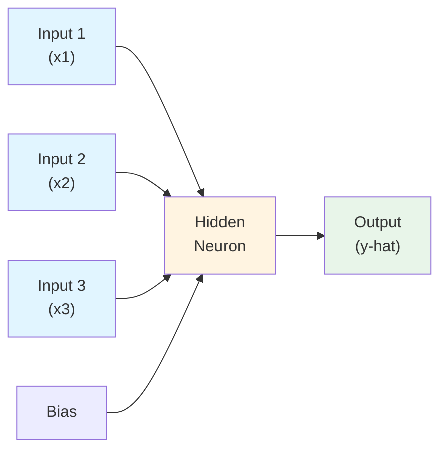
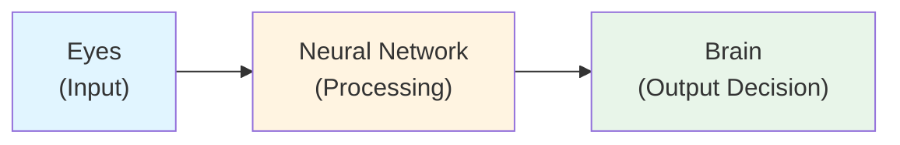
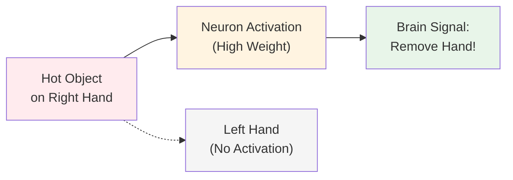
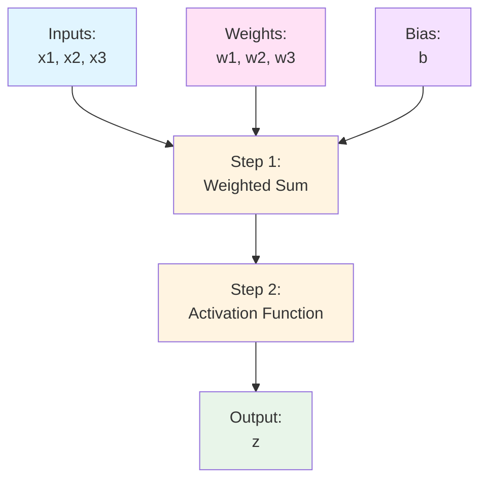
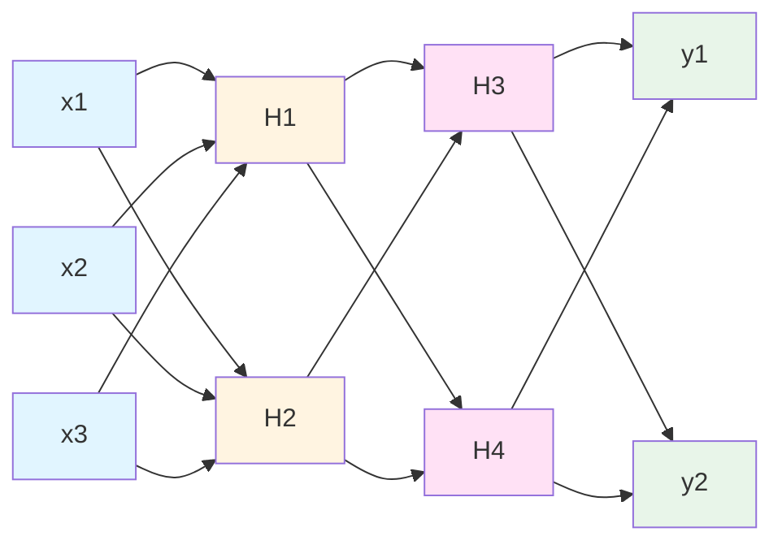

# Chapter 2: Perceptron and Neural Network Basics

## 🎯 Learning Objectives
- Understand the structure of a neural network (input, hidden, output layers)
- Learn about perceptron - the first neural network
- Grasp the concept of weights, bias, and neurons
- Understand how signals flow through a network
- Learn the analogy between human brain and artificial neural networks

## 📚 Key Concepts

### Neural Network Structure

#### Basic Components



**Three Main Layers:**
1. **Input Layer**: Receives input features (data)
2. **Hidden Layer**: Processes signals through neurons
3. **Output Layer**: Produces final prediction

### Perceptron: The First Neural Network

**Definition**: Single-layer neural network invented in 1958

**Real-World Example - Student Pass/Fail Prediction:**

| Study Hours (x1) | Play Hours (x2) | Sleep Hours (x3) | Pass/Fail (y) |
|------------------|-----------------|------------------|---------------|
| 7 | 3 | 7 | 1 (Pass) |
| 2 | 5 | 8 | 0 (Fail) |
| 4 | 3 | 7 | 1 (Pass) |

**How it Works:**
- Each record passes through the network one at a time
- First record: `[7, 3, 7]` → Network → Predicts `1` (Pass)
- Inputs: x₁ (Study), x₂ (Play), x₃ (Sleep)

### Understanding Neurons

#### Biological Analogy: How Human Brain Works



**Human Learning Process:**
1. **Input**: Eyes see a camera (visual signal)
2. **Processing**: Neurons in brain process the signal
3. **Output**: Brain recognizes "This is a camera"

**Baby Learning Example:**
- Show mobile phone → Tell "This is mobile" → Repeat multiple times
- After training (6 months), baby says "Papa" when sees father
- Similarly, neural networks need training to recognize patterns

**Key Insight**: Just like babies, neural networks learn through repeated training!

### Weights: The Learning Parameters

**Definition**: Values that determine how much each neuron should activate

#### Real-Life Analogy: Hot Object Detection

**Scenario**: Place hot object in right hand



**What Happens:**
- Right hand neurons: **Activated** (high weight) → Signal sent → Hand moves away
- Left hand neurons: **Not activated** (zero/low weight) → No movement

**Weights Purpose:**
- Determine **activation level** of each neuron
- Control **signal strength** passing through network
- **Updated during training** to improve predictions

### Bias: The Constant Term

**Problem**: What if all weights are initialized to zero?

$$\text{Result} = (x_1 \times 0) + (x_2 \times 0) + (x_3 \times 0) = 0$$

**Solution**: Add bias (constant value)

$$\text{Result} = (x_1 \times w_1) + (x_2 \times w_2) + (x_3 \times w_3) + b$$

**Purpose:**
- Ensures output is not zero even if weights are zero initially
- Acts as an **intercept** (similar to 'c' in $y = mx + c$)
- Required in **every hidden layer**

### Operations Inside a Neuron



#### Step 1: Weighted Sum

$$y = \sum_{i=1}^{n} x_i \times w_i + b$$

**Expanded Form:**
$$y = (x_1 \times w_1) + (x_2 \times w_2) + (x_3 \times w_3) + b$$

**Matrix Form:**
$$y = w^T x + b$$

**Similar to Linear Regression:**
- Linear Regression: $y = \beta_0 + \beta_1 x$ or $y = mx + c$
- Neural Network: $y = w^T x + b$

#### Step 2: Activation Function

**Purpose**: Introduce non-linearity, decide neuron activation

**Example - Sigmoid Activation:**
$$\sigma(y) = \frac{1}{1 + e^{-y}}$$

**For Binary Classification:**
- If $\sigma(y) \geq 0.5$ → Output = 1 (Pass)
- If $\sigma(y) < 0.5$ → Output = 0 (Fail)

### Complete Forward Flow Example

**Data Point**: Study=7, Play=3, Sleep=7, Expected Output=1 (Pass)

**Step-by-Step:**

1. **Input Layer**: $x_1=7, x_2=3, x_3=7$

2. **Weighted Sum** (assume weights: $w_1=0.5, w_2=-0.3, w_3=0.2, b=1$):
   $$y = (7 \times 0.5) + (3 \times -0.3) + (7 \times 0.2) + 1$$
   $$y = 3.5 - 0.9 + 1.4 + 1 = 5$$

3. **Activation Function** (Sigmoid):
   $$z = \frac{1}{1 + e^{-5}} = 0.993$$

4. **Output**: $0.993 \geq 0.5$ → Predict **1 (Pass)** ✓

### Multi-Layer Neural Network



**Characteristics:**
- **Multiple hidden layers** (not limited to 1 or 2)
- **Any number of neurons** per layer
- **Every neuron connects** to all neurons in next layer
- **Multi-class classification** possible (multiple outputs)
- **Same process**: Weighted sum → Activation → Next layer

**Difference from Perceptron:**
- **Perceptron**: Single hidden layer
- **Multi-layer**: 2+ hidden layers (also called Deep Neural Network)

### Training Analogy: Baby vs Neural Network

| Baby Learning | Neural Network Training |
|---------------|-------------------------|
| Show flower → Say "Black Rose" | Input data → Expected output |
| Repeat 3-4 times | Multiple epochs |
| Baby remembers | Weights updated |
| Baby recognizes flower | Network predicts correctly |

**Key Point**: Both need repeated exposure to learn!

## ❓ Interview Questions & Answers

**Q1: What is a perceptron?**
The first neural network (1958) with a single hidden layer. It consists of input layer, one hidden layer with neurons, and an output layer.

**Q2: What are the three main components of a neural network?**
1. **Input Layer**: Receives features/data
2. **Hidden Layer**: Processes data through neurons (can be multiple layers)
3. **Output Layer**: Produces final prediction

**Q3: What is the purpose of weights in a neural network?**
Weights determine the activation level of neurons. They control how much signal passes from one neuron to another, similar to how our brain decides which neurons to activate when we touch a hot object.

**Q4: Why do we need bias in neural networks?**
Bias ensures the output is not zero even if all weights are initialized to zero. It acts as a constant term (intercept) that shifts the activation function, allowing the network to fit data better.

**Q5: What are the two operations that happen inside a neuron?**
1. **Weighted Sum**: $y = \sum (x_i \times w_i) + b$
2. **Activation Function**: $z = \sigma(y)$ (e.g., sigmoid, ReLU)

**Q6: How is a neural network similar to the human brain?**
- **Input Layer** = Sensory organs (eyes, ears)
- **Hidden Layers** = Neural processing in brain
- **Output Layer** = Decision/recognition
- **Training** = Learning through repetition

**Q7: What is the difference between single-layer and multi-layer neural networks?**
- **Single-layer (Perceptron)**: One hidden layer, simpler problems
- **Multi-layer (Deep NN)**: Multiple hidden layers, can solve complex non-linear problems

**Q8: Can you write the equation for what happens inside a neuron?**
$$z = \sigma \left( \sum_{i=1}^{n} w_i x_i + b \right)$$
Where: $x_i$ = inputs, $w_i$ = weights, $b$ = bias, $\sigma$ = activation function

**Q9: Why can't we just use linear equations in neural networks?**
Without activation functions, stacking multiple layers would still result in a linear transformation. Activation functions introduce **non-linearity**, allowing networks to learn complex patterns.

**Q10: How does sigmoid activation function work for binary classification?**
$$\sigma(y) = \frac{1}{1 + e^{-y}}$$
- Output range: (0, 1)
- If output ≥ 0.5 → Class 1
- If output < 0.5 → Class 0

## 💡 Key Takeaways

- **Perceptron**: First neural network (1958), single hidden layer
- **Three Layers**: Input → Hidden (processing) → Output (prediction)
- **Weights**: Control neuron activation, updated during training
- **Bias**: Constant term preventing zero output, required in every layer
- **Two Steps in Neuron**: (1) Weighted sum, (2) Activation function
- **Multi-layer NN**: Multiple hidden layers for complex problems
- **Training Process**: Like teaching a baby - repetition until learning happens

## ⚠️ Common Mistakes

**Mistake 1**: "Bias is optional"
- **Reality**: Bias is essential; without it, if weights initialize to zero, network won't learn

**Mistake 2**: "Weights remain constant"
- **Reality**: Weights are updated during training (backward propagation)

**Mistake 3**: "One training example is enough"
- **Reality**: Networks need multiple epochs (repetitions) to learn, just like humans

**Mistake 4**: "All neurons in a layer have the same weight"
- **Reality**: Each connection has its own unique weight value

**Mistake 5**: "Activation function is optional"
- **Reality**: Without activation, network becomes a simple linear regression (can't learn complex patterns)

**Mistake 6**: "Input layer has weights"
- **Reality**: Weights exist on **connections between layers**, not in the input layer itself

## 📝 Quick Revision Points

### Neural Network Layers
- **Input Layer**: Receives data (x₁, x₂, ..., xₙ)
- **Hidden Layer**: Neurons process data (can have multiple layers)
- **Output Layer**: Final prediction (ŷ)

### Key Components
- **Weights (w)**: Control activation strength, updated during training
- **Bias (b)**: Constant term, one per layer, prevents zero output
- **Neurons**: Processing units that perform weighted sum + activation

### Neuron Operations
1. **Weighted Sum**: $y = w_1x_1 + w_2x_2 + ... + w_nx_n + b = w^Tx + b$
2. **Activation**: $z = \sigma(y)$

### Activation Function (Sigmoid Example)
$$\sigma(y) = \frac{1}{1 + e^{-y}}$$
- Binary classification: ≥ 0.5 → 1, < 0.5 → 0

### Perceptron vs Multi-layer NN
| Feature | Perceptron | Multi-layer NN |
|---------|-----------|----------------|
| Hidden Layers | 1 | 2+ |
| Complexity | Simple | Complex |
| Problems | Linear | Non-linear |

### Brain Analogy
```
Eyes (Input) → Neurons (Processing) → Brain (Output Decision)
    ↓              ↓                      ↓
Input Layer → Hidden Layers → Output Layer
```

### Remember
- Training = Repeated exposure (like teaching a baby)
- Weights control "how much to activate"
- Bias ensures "never completely zero"
- Formula similar to linear regression, but with activation for non-linearity
