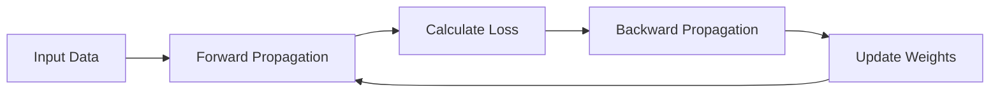
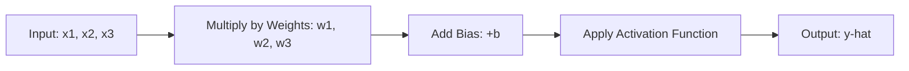
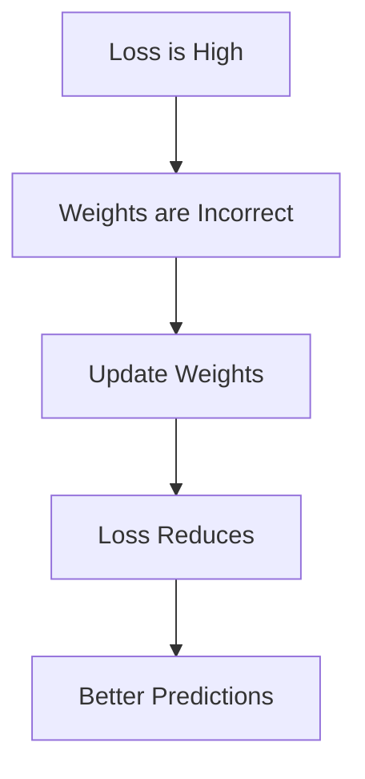
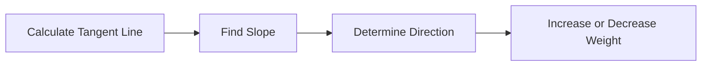
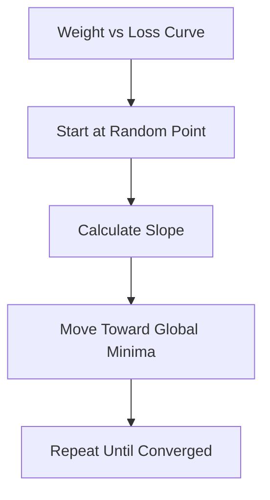
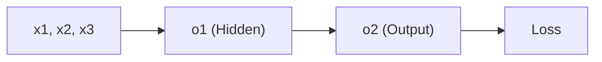
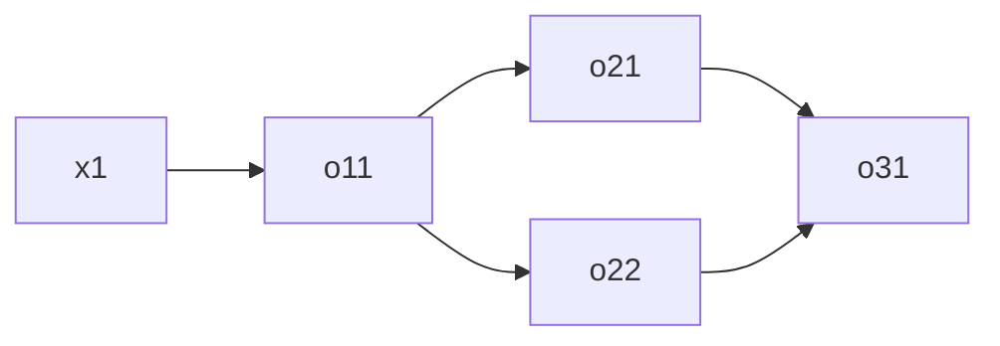

# Chapter 3: Forward Propagation and Backward Propagation

## 🎯 Learning Objectives
- Understand the complete training process of neural networks
- Learn forward propagation: input to output flow
- Master backward propagation: weight update mechanism
- Grasp loss functions and their role in training
- Understand optimizers and gradient descent
- Learn the weight updation formula and chain rule of differentiation

## 📚 Key Concepts

### The Training Process Overview

**Training = Forward Propagation + Backward Propagation**

One complete cycle (forward + backward) = **1 Epoch**



**Training Loop:**
- Repeat epochs 10-1000+ times
- Just like training a baby: repetition leads to learning!

### Forward Propagation

**Definition**: Process of passing inputs through the network to get output prediction

#### Step-by-Step Process



**Formula Chain:**
1. **Weighted Sum**: $y = \sum (w_i \times x_i) + b$
2. **Activation**: $z = \sigma(y)$
3. **Output**: $\hat{y} = z$

**What Happens:**
- Input → Multiply weights → Add bias → Activate → Output
- This happens at **every layer**
- From input layer → through all hidden layers → to output layer

**Example - Student Pass/Fail:**
- Input: Study=7, Play=3, Sleep=7
- Weights: w₁=0.5, w₂=-0.3, w₃=0.2, b=1
- Weighted Sum: $y = (7 \times 0.5) + (3 \times -0.3) + (7 \times 0.2) + 1 = 5$
- Sigmoid: $\sigma(5) = 0.993$
- Output: $\hat{y} = 1$ (Pass)

### Loss Function

**Definition**: Measures the difference between predicted output ($\hat{y}$) and actual output ($y$)

**Formula (example - MSE):**
$$\text{Loss} = y - \hat{y}$$

**Example:**
- Actual output: $y = 1$ (Pass)
- Predicted output: $\hat{y} = 0$ (Fail)
- Loss: $1 - 0 = 1$ (High error!)

**Goal**: Minimize loss → Make $\hat{y}$ close to $y$

**Main Aim:**
$$\text{Loss} \rightarrow 0$$

The difference should be **very near to zero** for accurate predictions.

### Backward Propagation

**Definition**: Process of updating weights to reduce loss

**Main Aim**: Update weights so predicted output matches actual output

#### Why Update Weights?



**Key Point**: Only by updating weights can we minimize loss!

### Weight Updation Formula

**Generic Formula:**
$$w_{\text{new}} = w_{\text{old}} - \alpha \frac{\partial L}{\partial w_{\text{old}}}$$

**Where:**
- $w_{\text{new}}$ = Updated weight
- $w_{\text{old}}$ = Previous weight (from forward propagation)
- $\alpha$ = Learning rate (step size)
- $\frac{\partial L}{\partial w_{\text{old}}}$ = Derivative of loss with respect to weight (slope)

**Bias Update Formula (same structure):**
$$b_{\text{new}} = b_{\text{old}} - \alpha \frac{\partial L}{\partial b_{\text{old}}}$$

### Understanding the Derivative: Slope Calculation

**What is** $\frac{\partial L}{\partial w}$?

It's the **slope** at a point on the loss curve!



**Two Cases:**

#### Case 1: Negative Slope (line points downward →)
- Slope = Negative value
- Formula: $w_{\text{new}} = w_{\text{old}} - \alpha \times (\text{negative})$
- Result: $w_{\text{new}} = w_{\text{old}} + \alpha \times \text{positive}$
- Action: **Increase weight** ✓ (Move right toward global minima)

#### Case 2: Positive Slope (line points upward ↗)
- Slope = Positive value
- Formula: $w_{\text{new}} = w_{\text{old}} - \alpha \times (\text{positive})$
- Result: $w_{\text{new}} = w_{\text{old}} - \alpha \times \text{positive}$
- Action: **Decrease weight** ✓ (Move left toward global minima)

**Conclusion**: Formula automatically adjusts weights in the correct direction!

### Gradient Descent

**Definition**: Optimization algorithm that updates weights to reach global minima

**Visualization:**



**Key Concept:**
- X-axis: Weights (w)
- Y-axis: Loss function
- **Global Minima**: Point where loss is minimum
- Goal: Reach global minima by updating weights

**Analogy**: Imagine an inverted mountain (3D curve)
- You're at a random point on the slope
- Goal: Reach the bottom (global minima)
- Method: Take steps in the direction of steepest descent

### Learning Rate (α)

**Definition**: Step size for weight updates

**Importance:**

| Learning Rate | Effect | Result |
|---------------|--------|--------|
| **Too Large** | Big jumps | May never reach minima (oscillates) |
| **Too Small** | Tiny steps | Slow convergence (takes forever) |
| **Optimal** | Balanced steps | Smooth convergence ✓ |

**Common Values:**
- α = 0.001 (very common)
- α = 0.01 (also used)
- α = 0.0001 (for sensitive models)

**Best Practice**: Start with small learning rate (0.001) for steady convergence

### Optimizers

**Definition**: Algorithms that update weights using the weight updation formula

**Role of Optimizers:**
- Calculate derivatives ($\frac{\partial L}{\partial w}$)
- Apply weight updation formula
- Ensure all weights are updated efficiently

**Example - Gradient Descent:**
- Simplest optimizer
- Uses the formula: $w_{\text{new}} = w_{\text{old}} - \alpha \frac{\partial L}{\partial w}$
- Updates weights to minimize loss

**Note**: More advanced optimizers (SGD, Adam, RMSProp) will be covered later

### Chain Rule of Differentiation

**Purpose**: Calculate derivatives for multi-layer networks

**Problem**: How to find $\frac{\partial L}{\partial w_1}$ when loss depends on multiple layers?

**Solution**: Use chain rule to trace dependencies!

#### Example 1: Simple Network (Input → Hidden → Output)



**Update w₄** (weight between hidden and output):

$$\frac{\partial L}{\partial w_4} = \frac{\partial L}{\partial o_2} \times \frac{\partial o_2}{\partial w_4}$$

**Explanation:**
- Loss depends on $o_2$
- $o_2$ depends on $w_4$
- Chain them: $L \rightarrow o_2 \rightarrow w_4$

#### Example 2: Update w₁ (weight at input layer)

$$\frac{\partial L}{\partial w_1} = \frac{\partial L}{\partial o_2} \times \frac{\partial o_2}{\partial o_1} \times \frac{\partial o_1}{\partial w_1}$$

**Chain:**
- Loss depends on $o_2$
- $o_2$ depends on $o_1$
- $o_1$ depends on $w_1$
- Chain: $L \rightarrow o_2 \rightarrow o_1 \rightarrow w_1$

#### Example 3: Network with Multiple Paths



**Update w₁** (two paths exist):

**Path 1:** $L \rightarrow o_{31} \rightarrow o_{21} \rightarrow o_{11} \rightarrow w_1$

**Path 2:** $L \rightarrow o_{31} \rightarrow o_{22} \rightarrow o_{11} \rightarrow w_1$

**Combined Formula:**

$$\frac{\partial L}{\partial w_1} = \left(\frac{\partial L}{\partial o_{31}} \times \frac{\partial o_{31}}{\partial o_{21}} \times \frac{\partial o_{21}}{\partial o_{11}} \times \frac{\partial o_{11}}{\partial w_1}\right) + \left(\frac{\partial L}{\partial o_{31}} \times \frac{\partial o_{31}}{\partial o_{22}} \times \frac{\partial o_{22}}{\partial o_{11}} \times \frac{\partial o_{11}}{\partial w_1}\right)$$

**Key Point**: When multiple paths exist, **add all paths** together!

### Complete Training Summary

**Step-by-Step Training Process:**

1. **Forward Propagation**
   - Pass input through network
   - Calculate weighted sum at each layer
   - Apply activation function
   - Get output $\hat{y}$

2. **Calculate Loss**
   - Compare $\hat{y}$ with actual $y$
   - Loss = $y - \hat{y}$

3. **Backward Propagation**
   - Use chain rule to calculate $\frac{\partial L}{\partial w}$ for all weights
   - Apply weight updation formula
   - Update all weights: $w_{\text{new}} = w_{\text{old}} - \alpha \frac{\partial L}{\partial w}$

4. **Repeat**
   - Do steps 1-3 for 10-1000+ epochs
   - Network learns, loss decreases
   - Predictions become accurate!

**Analogy - Teaching a Baby:**
| Baby Learning | Neural Network |
|---------------|----------------|
| Show flower 1st time | Forward prop → Wrong prediction |
| Say "This is Black Rose" | Calculate loss (baby is confused) |
| Baby tries to remember | Backward prop → Update weights |
| Show again 2nd time | Forward prop again |
| Baby still confused | Loss still high |
| Repeat 3-4 times | Multiple epochs |
| Baby learns! | Loss → 0, accurate predictions ✓ |

## ❓ Interview Questions & Answers

**Q1: What is forward propagation?**
The process of passing input data through the network (input → hidden layers → output) by calculating weighted sums and applying activation functions at each layer to get the final prediction $\hat{y}$.

**Q2: What is backward propagation?**
The process of updating weights to minimize loss by calculating gradients using the chain rule and applying the weight updation formula: $w_{\text{new}} = w_{\text{old}} - \alpha \frac{\partial L}{\partial w}$.

**Q3: What is the weight updation formula?**
$$w_{\text{new}} = w_{\text{old}} - \alpha \frac{\partial L}{\partial w_{\text{old}}}$$
Where $\alpha$ is learning rate and $\frac{\partial L}{\partial w}$ is the derivative of loss with respect to weight.

**Q4: Why do we need backward propagation?**
To update weights and minimize loss. Without updating weights, the network cannot learn from its mistakes and predictions will remain inaccurate.

**Q5: What is the role of learning rate?**
Learning rate ($\alpha$) controls the step size for weight updates. Too large → oscillates and may never converge. Too small → very slow convergence. Optimal values: 0.001 or 0.01.

**Q6: What is gradient descent?**
An optimization algorithm that updates weights iteratively to reach the global minima (minimum loss) by moving in the direction of the negative gradient (steepest descent).

**Q7: What is the chain rule of differentiation and why is it needed?**
A mathematical technique to calculate derivatives in multi-layer networks by chaining dependencies. Needed because loss depends on output, output depends on hidden layers, hidden layers depend on weights - we trace this chain backward.

**Q8: How does the weight updation formula know whether to increase or decrease weights?**
Through the derivative (slope):
- Negative slope → Formula adds positive value → Weight increases
- Positive slope → Formula subtracts positive value → Weight decreases
It automatically moves toward global minima!

**Q9: What is an optimizer?**
An algorithm that implements the weight updation formula and calculates derivatives. Examples: Gradient Descent, SGD, Adam, RMSProp. They ensure all weights are updated efficiently during backward propagation.

**Q10: What happens if we don't update weights?**
The network won't learn! Predictions will remain random/inaccurate, and loss will stay high. Training requires weight updates through backward propagation.

**Q11: Can we train a network in less than 1000 epochs?**
Yes! If the network learns quickly, even 10-100 epochs may be sufficient. It depends on:
- Problem complexity
- Network architecture
- Learning rate
- Quality of data

**Q12: What is one epoch?**
One complete forward propagation + backward propagation cycle through the entire dataset.

## 💡 Key Takeaways

- **Training = Forward Prop + Backward Prop** (repeated many times)
- **Forward Prop**: Input → Weights → Bias → Activation → Output
- **Backward Prop**: Calculate loss → Find gradients → Update weights
- **Weight Update**: $w_{\text{new}} = w_{\text{old}} - \alpha \frac{\partial L}{\partial w}$
- **Goal**: Minimize loss to make $\hat{y} \approx y$
- **Gradient Descent**: Moves weights toward global minima (minimum loss)
- **Learning Rate**: Step size (0.001 or 0.01 are common)
- **Chain Rule**: Traces dependencies to calculate gradients in multi-layer networks
- **Optimizers**: Implement weight updates (Gradient Descent is the simplest)
- **Epochs**: Repetition count (like teaching a baby - more repetition = better learning)

## ⚠️ Common Mistakes

**Mistake 1**: "Forward propagation updates weights"
- **Reality**: Forward prop only calculates output. Backward prop updates weights.

**Mistake 2**: "Loss function updates weights"
- **Reality**: Loss function only measures error. Optimizers update weights using loss gradients.

**Mistake 3**: "Large learning rate trains faster"
- **Reality**: Too large learning rate causes oscillation and may never converge. Small learning rate is safer.

**Mistake 4**: "Chain rule only for deep networks"
- **Reality**: Chain rule needed for any network with 2+ layers (even simple perceptron with hidden layer).

**Mistake 5**: "One epoch is enough for training"
- **Reality**: Networks need multiple epochs (10-1000+) to learn, just like humans need repetition.

**Mistake 6**: "Gradient descent is the only optimizer"
- **Reality**: Gradient descent is the simplest. Advanced optimizers (SGD, Adam, RMSProp) work better for complex problems.

**Mistake 7**: "We manually update each weight"
- **Reality**: Optimizers automatically update all weights using the chain rule and weight updation formula.

## 📝 Quick Revision Points

### Training Process
```
1 Epoch = Forward Prop + Backward Prop
Repeat epochs → Network learns → Loss ↓
```

### Forward Propagation Steps
1. Input × Weights
2. Add Bias
3. Apply Activation
4. Get Output $\hat{y}$

### Backward Propagation Steps
1. Calculate Loss: $L = y - \hat{y}$
2. Find Gradients: $\frac{\partial L}{\partial w}$ (using chain rule)
3. Update Weights: $w_{\text{new}} = w_{\text{old}} - \alpha \frac{\partial L}{\partial w}$

### Weight Updation Formula
$$w_{\text{new}} = w_{\text{old}} - \alpha \frac{\partial L}{\partial w_{\text{old}}}$$

**Components:**
- $w_{\text{old}}$: Previous weight
- $\alpha$: Learning rate (0.001 or 0.01)
- $\frac{\partial L}{\partial w}$: Slope (gradient)

### Learning Rate Guidelines
- **0.001**: Very safe, slow convergence
- **0.01**: Balanced, commonly used
- **0.1**: Risky, may oscillate

### Chain Rule Formula (Example)
For weight $w_1$ in 3-layer network:
$$\frac{\partial L}{\partial w_1} = \frac{\partial L}{\partial o_3} \times \frac{\partial o_3}{\partial o_2} \times \frac{\partial o_2}{\partial w_1}$$

**Remember:** Trace dependencies backward: $L \rightarrow o_3 \rightarrow o_2 \rightarrow w_1$

### Gradient Descent
- **Graph**: Weight (x-axis) vs Loss (y-axis)
- **Goal**: Reach global minima (bottom of curve)
- **Method**: Follow negative gradient (slope)

### Key Relationships
- Forward Prop: Data → Output
- Backward Prop: Loss → Weight Updates
- Optimizer: Implements weight updation
- Chain Rule: Calculates gradients for multi-layer networks
- Epochs: Repetitions for learning (like training a baby!)

### Remember
- Training requires **both** forward and backward propagation
- Weights updated **only in backward propagation**
- Learning rate controls **step size** (not speed!)
- Multiple epochs needed for convergence (10-1000+)
