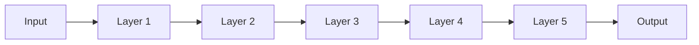
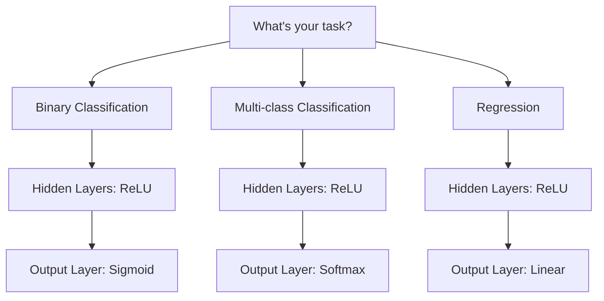

# Chapter 4: Activation Functions and Vanishing Gradient Problem

## 🎯 Learning Objectives
- Understand the vanishing gradient problem and its causes
- Learn different activation functions and their properties
- Know when to use which activation function
- Master the formulas, ranges, and derivatives of each activation
- Solve the dead neuron problem

## 📚 Key Concepts

### The Vanishing Gradient Problem

#### Problem Statement

**Scenario**: Deep neural network with many layers

**Weight Update Formula** (for w₁ at first layer):

$$\frac{\partial L}{\partial w_1} = \frac{\partial L}{\partial o_5} \times \frac{\partial o_5}{\partial o_4} \times \frac{\partial o_4}{\partial o_3} \times \frac{\partial o_3}{\partial o_2} \times \frac{\partial o_2}{\partial w_1}$$

**Problem with Sigmoid:**
- Derivative of sigmoid: $0 \leq \sigma'(y) \leq 0.25$
- Example derivatives: 0.25 × 0.10 × 0.05 × 0.02 × 0.01 = **0.0000000025** (tiny!)

**Result:**
$$w_{\text{new}} = w_{\text{old}} - \alpha \times \text{(very small number)}$$
$$w_{\text{new}} \approx w_{\text{old}}$$

**Consequence**: Weights barely change → Network doesn't learn!

**Definition**: Vanishing gradient problem occurs when gradients become extremely small during backpropagation in deep networks, preventing weight updates.

**Solution**: Use better activation functions (ReLU, Leaky ReLU, etc.)

### Activation Functions Overview

| Activation | Range | Derivative Range | Zero-Centered | Vanishing Gradient |
|------------|-------|------------------|---------------|-------------------|
| Sigmoid | (0, 1) | (0, 0.25) | ❌ | ✓ Yes |
| Tanh | (-1, 1) | (0, 1) | ✓ Yes | ✓ Yes (in deep networks) |
| ReLU | [0, ∞) | {0, 1} | ❌ | ❌ No |
| Leaky ReLU | (-∞, ∞) | {0.01, 1} | ❌ | ❌ No |
| PReLU | (-∞, ∞) | {α, 1} | ❌ | ❌ No |
| ELU | (-α, ∞) | (0, 1) | ~✓ | ❌ No |
| Swish | (-∞, ∞) | Smooth | ❌ | ❌ No |

### 1. Sigmoid Activation Function

**Formula:**
$$\sigma(x) = \frac{1}{1 + e^{-x}}$$

**Range**: $(0, 1)$

**Derivative Range**: $(0, 0.25)$

**Derivative Formula:**
$$\sigma'(x) = \sigma(x) \times (1 - \sigma(x))$$

**Graph Representation:**
- S-shaped curve
- Output between 0 and 1
- Smooth gradient

**Advantages:**
- Smooth gradient (prevents jumps in output)
- Output normalized between 0 and 1
- Clear predictions (close to 0 or 1)
- Good for binary classification output layer

**Disadvantages:**
- **Vanishing Gradient Problem**: Derivative range (0, 0.25) causes tiny gradients in deep networks
- **Not Zero-Centered**: Reduces weight update efficiency
- **Computationally Expensive**: Exponential operation ($e^{-x}$) is slow

**Use Case:**
- **Output layer** for binary classification only
- Never use in hidden layers of deep networks

### 2. Tanh (Hyperbolic Tangent)

**Formula:**
$$\tanh(x) = \frac{e^x - e^{-x}}{e^x + e^{-x}}$$

**Range**: $(-1, 1)$

**Derivative Range**: $(0, 1)$

**Derivative Formula:**
$$\tanh'(x) = 1 - \tanh^2(x)$$

**Advantages:**
- **Zero-Centered**: Better than sigmoid for weight updates
- **Stronger Gradients**: Derivative range (0, 1) vs sigmoid's (0, 0.25)
- Smooth gradient

**Disadvantages:**
- **Still Suffers from Vanishing Gradient**: In very deep networks
- **Computationally Expensive**: Exponential operations

**Use Case:**
- Hidden layers in shallow networks
- Better than sigmoid for hidden layers
- Binary classification: Tanh (hidden) + Sigmoid (output)

### 3. ReLU (Rectified Linear Unit)

**Formula:**

$$\text{ReLU}(x) = \max(0, x)$$

$$\text{ReLU}(x) = \begin{cases} 0 & \text{if } x < 0 \\\ x & \text{if } x \geq 0 \end{cases}$$

**Range**: $[0, \infty)$

**Derivative:**

$$\text{ReLU}'(x) = \begin{cases} 0 & \text{if } x < 0 \\\ 1 & \text{if } x > 0 \end{cases}$$

**Graph:**
- Flat at 0 for negative values
- Linear for positive values (45° line)

**Advantages:**
- **Solves Vanishing Gradient**: Derivative is 1 (not shrinking!)
- **Computationally Efficient**: Simple max operation (no exponentials)
- **Sparse Activation**: Only some neurons activate (efficiency)
- **Fast Convergence**: Much faster than sigmoid/tanh

**Disadvantages:**
- **Dead Neuron Problem**: If input < 0, neuron outputs 0 forever (gradient = 0, no learning)
- **Not Zero-Centered**: Only outputs positive values

**Use Case:**
- **Default choice** for hidden layers in deep networks
- Most popular activation function
- Works for most problems

### 4. Leaky ReLU

**Formula:**

$$\text{Leaky ReLU}(x) = \max(0.01x, x)$$

$$\text{Leaky ReLU}(x) = \begin{cases} 0.01x & \text{if } x < 0 \\\ x & \text{if } x \geq 0 \end{cases}$$

**Range**: $(-\infty, \infty)$

**Derivative:**

$$\text{Leaky ReLU}'(x) = \begin{cases} 0.01 & \text{if } x < 0 \\\ 1 & \text{if } x > 0 \end{cases}$$

**Advantages:**
- **Solves Dead Neuron Problem**: Small gradient (0.01) for negative values
- Prevents neurons from dying completely
- All benefits of ReLU + no dead neurons

**Disadvantages:**
- Not fully proven to be better than ReLU in all cases
- Slightly more computation than ReLU

**Use Case:**
- When ReLU causes too many dead neurons
- Alternative to ReLU in deep networks

### 5. PReLU (Parametric ReLU)

**Formula:**

$$\text{PReLU}(x) = \begin{cases} \alpha x & \text{if } x < 0 \\\ x & \text{if } x \geq 0 \end{cases}$$

**Where**: $\alpha$ is a **learnable parameter** (not fixed like 0.01)

**Range**: $(-\infty, \infty)$

**Key Point:**
- If $\alpha = 0$ → ReLU
- If $\alpha = 0.01$ → Leaky ReLU
- If $\alpha$ is learnable → PReLU

**Advantages:**
- Network learns optimal $\alpha$ value during training
- More flexible than Leaky ReLU
- Adapts to data

**Use Case:**
- When you want network to learn the best negative slope
- Advanced deep learning models

### 6. ELU (Exponential Linear Unit)

**Formula:**

$$\text{ELU}(x) = \begin{cases} \alpha(e^x - 1) & \text{if } x < 0 \\\ x & \text{if } x \geq 0 \end{cases}$$

**Range**: $(-\alpha, \infty)$

**Derivative Range**: $(0, 1)$

**Advantages:**
- Output close to zero-centered
- Smooth gradient for negative values
- No dead neurons

**Disadvantages:**
- **Computationally Expensive**: Exponential operation for $x < 0$

**Use Case:**
- When zero-centering is important
- Advanced architectures

### 7. Swish Activation Function

**Formula:**

$$\text{Swish}(x) = x \times \sigma(x) = \frac{x}{1 + e^{-x}}$$

**Range**: $(-\infty, \infty)$

**Properties:**
- Self-gated activation function
- Developed by Google
- Smooth, non-monotonic function

**Advantages:**
- Better than ReLU for deeper networks
- Smooth gradient (unlike ReLU's sharp corner at 0)
- No upper bound (like ReLU)

**Disadvantages:**
- **Computationally expensive**: Uses sigmoid internally (exponential operation)
- Derivative at zero not well-defined (though differentiable everywhere else)

**Use Case:**
- Deep networks where performance matters more than speed
- When ReLU/Leaky ReLU underperform
- Research and advanced architectures

### 8. Softmax Activation Function

**Formula** (for multi-class with K classes):
$$\text{Softmax}(z_i) = \frac{e^{z_i}}{\sum_{j=1}^{K} e^{z_j}}$$

**Range**: $(0, 1)$ for each class, and $\sum \text{Softmax}(z_i) = 1$

**Properties:**
- Converts logits to probabilities
- Sum of all outputs = 1
- Highest value gets highest probability

**Example:**
- Logits: [10, 20, 30, 40, 50]
- After Softmax: [~0, ~0, ~0, ~0, ~1]
- Class with value 50 gets probability ≈ 1

**Use Case:**
- **Output layer for multi-class classification**
- Converts scores to probability distribution

### 9. Linear Activation Function

**Formula:**
$$f(x) = x$$

**Range**: $(-\infty, \infty)$

**Derivative**: 1

**Use Case:**
- **Output layer for regression problems**
- When you need continuous unbounded output

### Which Activation Function to Use?

#### Decision Tree:

#### Quick Reference Table

| Problem Type | Hidden Layers | Output Layer |
|--------------|---------------|--------------|
| **Binary Classification** | ReLU (or Leaky ReLU, PReLU) | **Sigmoid** |
| **Multi-class Classification** | ReLU (or Leaky ReLU, PReLU) | **Softmax** |
| **Regression** | ReLU (or Leaky ReLU, PReLU) | **Linear** |

#### Hidden Layer Guidelines

**Default Choice**: **ReLU**
- Start with ReLU in all hidden layers
- Fast, efficient, solves vanishing gradient

**If ReLU doesn't converge**:
1. Try **Leaky ReLU** (fixes dead neurons)
2. Try **PReLU** (learnable parameter)
3. Try **ELU** (smooth, zero-centered)

**Never Use in Hidden Layers**:
- ❌ Sigmoid (vanishing gradient in deep networks)
- ❌ Tanh (vanishing gradient in deep networks)

## ❓ Interview Questions & Answers

**Q1: What is the vanishing gradient problem?**

When gradients become extremely small during backpropagation in deep networks, weights barely update, and the network stops learning. Caused by activation functions (like sigmoid) with derivatives < 1 that multiply in chain rule.

**Q2: Why does sigmoid cause vanishing gradient?**

Sigmoid's derivative range is (0, 0.25). In deep networks, multiplying many small derivatives (e.g., 0.25 × 0.1 × 0.05) results in extremely tiny gradients, making weight updates negligible.

**Q3: How does ReLU solve vanishing gradient?**

ReLU's derivative is either 0 or 1. For positive inputs, derivative = 1, so gradients don't shrink during backpropagation. This allows deep networks to train effectively.

**Q4: What is the dead neuron problem in ReLU?**

When input is negative, ReLU outputs 0 and derivative = 0. If a neuron consistently receives negative inputs, it stays "dead" (always outputs 0, never learns). Weight updates become: $w_{\text{new}} = w_{\text{old}} - \alpha \times 0 = w_{\text{old}}$.

**Q5: How does Leaky ReLU solve the dead neuron problem?**

Leaky ReLU uses $f(x) = 0.01x$ for negative inputs instead of 0. This gives a small gradient (0.01) for negative values, allowing neurons to recover from "death."

**Q6: What does "zero-centered" mean and why does it matter?**

Zero-centered means the activation function outputs both positive and negative values around 0. It improves weight update efficiency. Sigmoid (0, 1) is not zero-centered; Tanh (-1, 1) is.

**Q7: Which activation function should you use for binary classification?**
- **Hidden Layers**: ReLU
- **Output Layer**: Sigmoid (outputs probability between 0 and 1)

**Q8: Which activation function for multi-class classification?**
- **Hidden Layers**: ReLU
- **Output Layer**: Softmax (converts to probability distribution, sum = 1)

**Q9: Which activation function for regression?**
- **Hidden Layers**: ReLU
- **Output Layer**: Linear (unbounded continuous output)

**Q10: Why is ReLU computationally efficient?**

ReLU uses simple $\max(0, x)$ operation. Sigmoid/Tanh use expensive exponential operations ($e^x$). ReLU is just comparison and multiplication - much faster!

**Q11: What's the difference between Leaky ReLU and PReLU?**

- **Leaky ReLU**: Fixed slope (0.01) for negative values
- **PReLU**: Learnable slope (α parameter) optimized during training

**Q12: When should you use Tanh instead of ReLU?**

In shallow networks where zero-centering is important and vanishing gradient is not a major issue. Generally, ReLU is preferred for deep learning.

**Q13: Can you use sigmoid in hidden layers of a deep network?**

No! It causes vanishing gradient problem. Use ReLU or its variants in hidden layers. Sigmoid only in output layer for binary classification.

## 💡 Key Takeaways

- **Vanishing Gradient**: Gradients shrink in deep networks when using sigmoid/tanh (derivatives < 1)
- **ReLU is King**: Default choice for hidden layers (solves vanishing gradient)
- **Dead Neurons**: ReLU problem where neurons output 0 forever (Leaky ReLU fixes this)
- **Sigmoid**: Only for binary classification output layer
- **Softmax**: Only for multi-class classification output layer
- **Linear**: Only for regression output layer
- **Zero-Centered**: Tanh is zero-centered (-1, 1), sigmoid is not (0, 1)
- **Computational Cost**: ReLU << Tanh < Sigmoid < ELU (in terms of speed)

## ⚠️ Common Mistakes

**Mistake 1**: "Use sigmoid in hidden layers"
- **Reality**: Causes vanishing gradient. Use ReLU in hidden layers.

**Mistake 2**: "ReLU is always better than Leaky ReLU"
- **Reality**: If you have many dead neurons, Leaky ReLU performs better.

**Mistake 3**: "Softmax for binary classification"
- **Reality**: Use sigmoid for binary, softmax for multi-class.

**Mistake 4**: "Tanh solves vanishing gradient"
- **Reality**: Tanh has better gradients than sigmoid, but still suffers in very deep networks. Use ReLU.

**Mistake 5**: "Linear activation in hidden layers"
- **Reality**: Linear activation loses ability to learn non-linear patterns. Use ReLU in hidden layers, linear only in regression output.

**Mistake 6**: "All activation functions are zero-centered"
- **Reality**: Only Tanh and ELU are approximately zero-centered. Sigmoid and ReLU are not.

## 📝 Quick Revision Points

### Formulas

**Sigmoid:**
$$\sigma(x) = \frac{1}{1 + e^{-x}}, \quad \sigma'(x) = \sigma(x)(1 - \sigma(x))$$
Range: (0, 1), Derivative: (0, 0.25)

**Tanh:**
$$\tanh(x) = \frac{e^x - e^{-x}}{e^x + e^{-x}}, \quad \tanh'(x) = 1 - \tanh^2(x)$$
Range: (-1, 1), Derivative: (0, 1)

**ReLU:**
$$\text{ReLU}(x) = \max(0, x)$$
Range: [0, ∞), Derivative: {0, 1}

**Leaky ReLU:**
$$\text{Leaky ReLU}(x) = \max(0.01x, x)$$
Derivative: {0.01, 1}

**PReLU:**
$$\text{PReLU}(x) = \max(\alpha x, x)$$
α is learnable

**Softmax:**
$$\text{Softmax}(z_i) = \frac{e^{z_i}}{\sum_{j=1}^{K} e^{z_j}}$$

### When to Use What

| Task | Hidden | Output |
|------|--------|--------|
| Binary Classification | ReLU | Sigmoid |
| Multi-class Classification | ReLU | Softmax |
| Regression | ReLU | Linear |

### Problem-Solution Map

| Problem | Solution |
|---------|----------|
| Vanishing Gradient | Use ReLU instead of Sigmoid/Tanh |
| Dead Neurons (ReLU) | Use Leaky ReLU or PReLU |
| Slow Training | Use ReLU (avoid Sigmoid/Tanh exponentials) |
| Need Zero-Centering | Use Tanh or ELU |
| ReLU not converging | Try Leaky ReLU → PReLU → ELU |

### Remember

- **Default**: Always start with ReLU in hidden layers
- **Never**: Sigmoid/Tanh in hidden layers of deep networks
- **Output**: Sigmoid (binary), Softmax (multi-class), Linear (regression)
- **Vanishing Gradient**: Caused by derivatives < 1 multiplying in chain rule
- **Dead Neuron**: ReLU outputs 0 forever, fixed by Leaky ReLU (0.01x for negatives)
