# Chapter 5: Loss Functions

## 🎯 Learning Objectives
- Understand the difference between loss function and cost function
- Learn regression loss functions: MSE, MAE, Huber Loss
- Master classification loss functions: Binary and Categorical Cross Entropy
- Know when to use which loss function
- Understand one-hot encoding and softmax for multi-class problems

## 📚 Key Concepts

### Loss Function vs Cost Function

#### Loss Function
**Definition**: Error calculated for a **single data point**

**Formula:**
$$\text{Loss} = \frac{1}{2}(y - \hat{y})^2$$

**Usage**: One record at a time in forward propagation

#### Cost Function
**Definition**: Average error calculated for a **batch of data points**

**Formula:**
$$\text{Cost} = \frac{1}{2} \sum_{i=1}^{n} (y_i - \hat{y}_i)^2$$

**Where**: $n$ = batch size

**Key Difference:**

| Aspect | Loss Function | Cost Function |
|--------|---------------|---------------|
| Data Points | Single record | Batch of records |
| When Used | Per-sample error | Per-batch error |
| Training | Pass 1 record | Pass batch (e.g., 10, 32, 64 records) |

**Why Use Batches?**
- More efficient than processing one record at a time
- Provides more stable gradient estimates
- Common batch sizes: 16, 32, 64, 128

### Problem Types and Their Loss Functions


## Regression Loss Functions

### 1. Mean Squared Error (MSE)

**Loss Function:**
$$\text{MSE Loss} = \frac{1}{2}(y - \hat{y})^2$$

**Cost Function:**
$$\text{MSE Cost} = \frac{1}{2n} \sum_{i=1}^{n} (y_i - \hat{y}_i)^2$$

#### Why This Formula?

**Quadratic Equation**: $ax^2 + bx + c$

**Example**: $(y - \hat{y})^2 = y^2 - 2y\hat{y} + \hat{y}^2$

**This Creates a Parabola** (gradient descent curve):
- Smooth, differentiable curve
- Single global/local minima
- Easy to optimize

#### Advantages

**1. Differentiable**
- Smooth gradient → Weight updates work perfectly
- Chain rule applies easily in backpropagation

**2. Single Global Minima**
- Only one optimal point
- Guaranteed to find the best solution

**3. Converges Faster**
- Quadratic nature accelerates convergence
- Gradient descent works efficiently

#### Disadvantages

**1. NOT Robust to Outliers** (Major Issue!)

**Example:**

Data: [1, 2, 3, 4, 100] (100 is outlier)

**Without Outlier:**
- Best fit line: ~2.5 (reasonable)

**With Outlier:**
- Best fit line shifts significantly toward 100
- Why? Because error is **squared**: $(100 - 2.5)^2 = 9506.25$ (huge penalty!)

**Effect**: Outliers dominate the loss, shifting the model significantly

**Visual:**
- Line without outlier: ──────
- Line with outlier: ────── ╱ (major shift!)

**Why Squaring Causes This:**
- Small error: $(2)^2 = 4$
- Large error (outlier): $(100)^2 = 10000$ (penalized heavily!)

#### When to Use MSE

✓ Regression problems
✓ When data has **no outliers**
✓ When you want faster convergence
✗ Avoid when outliers are present

### 2. Mean Absolute Error (MAE)

**Loss Function:**
$$\text{MAE Loss} = \frac{1}{2}|y - \hat{y}|$$

**Cost Function:**
$$\text{MAE Cost} = \frac{1}{2n} \sum_{i=1}^{n} |y_i - \hat{y}_i|$$

**Key Difference**: Uses **absolute value** instead of squaring

#### Advantages

**1. Robust to Outliers** (Major Advantage!)

**Example:**

Data: [1, 2, 3, 4, 100]

**Error Calculation:**
- Small error: $|2| = 2$
- Large error (outlier): $|100| = 100$ (not squared!)

**Effect**: Outliers cause minor shift (not major like MSE)

**Visual:**
- Line with outlier in MAE: ────── ╲ (minor shift)
- Line with outlier in MSE: ────── ╱ (major shift)

**Why Absolute Value Helps:**
- No squaring → No excessive penalty for outliers
- Linear penalty instead of quadratic

#### Disadvantages

**1. Derivative Not Simple**
- Curve has sharp corner at zero (not smooth)
- Need **sub-gradient** method

**Sub-gradient**: Divide curve into parts, calculate slope for each part

**Visual of MAE Curve:**
```
Loss
  |    /
  |   /
  |  /
  | /______
  |/
  +--------- Prediction Error
```

**2. Time-Consuming**
- Sub-gradient calculation takes longer than MSE
- Slower convergence

#### When to Use MAE

✓ Regression problems
✓ When data has **outliers**
✓ When robustness is more important than speed
✗ Avoid when you need fast convergence

### 3. Huber Loss

**Definition**: Combination of MSE and MAE

**Formula:**

$$\text{Huber Loss} = \begin{cases}
\frac{1}{2}(y - \hat{y})^2 & \text{if } |y - \hat{y}| \leq \delta \\\
\delta |y - \hat{y}| - \frac{1}{2}\delta^2 & \text{otherwise}
\end{cases}$$

**Where**: $\delta$ = hyperparameter (threshold)

**How It Works:**

```mermaid
graph TB
    A["Calculate Error:<br/>|y - y-hat|"] --> B{"Error ≤ δ?"}
    B -->|Yes| C["Use MSE<br/>(No Outlier)"]
    B -->|No| D["Use MAE<br/>(Outlier Present)"]
```



**Logic:**
- **Small errors** ($\leq \delta$): Use MSE (fast convergence)
- **Large errors** ($> \delta$): Use MAE (robust to outliers)

#### Advantages

✓ **Best of Both Worlds**: Fast convergence + Robust to outliers
✓ Adaptive: Automatically switches based on error magnitude
✓ Controlled by hyperparameter $\delta$

#### When to Use Huber Loss

✓ Regression with potential outliers
✓ When you want both speed and robustness
✓ General-purpose regression loss

## Classification Loss Functions

### 1. Binary Cross Entropy (Log Loss)

**Definition**: Loss function for **binary classification** (2 classes: 0 or 1)

**Loss Function:**
$$\text{BCE} = -[y \log(\hat{y}) + (1-y) \log(1-\hat{y})]$$

**Alternative Form:**

$$\text{BCE} = \begin{cases}
-\log(1 - \hat{y}) & \text{if } y = 0 \\\
-\log(\hat{y}) & \text{if } y = 1
\end{cases}$$

**Cost Function:**
$$\text{BCE Cost} = -\frac{1}{n} \sum_{i=1}^{n} [y_i \log(\hat{y}_i) + (1-y_i) \log(1-\hat{y}_i)]$$

#### How It Works

**Example:**

| Actual ($y$) | Predicted ($\hat{y}$) | BCE Loss |
|--------------|----------------------|----------|
| 1 | 0.9 | $-\log(0.9) = 0.105$ (small loss ✓) |
| 1 | 0.1 | $-\log(0.1) = 2.303$ (large loss ✗) |
| 0 | 0.1 | $-\log(0.9) = 0.105$ (small loss ✓) |
| 0 | 0.9 | $-\log(0.1) = 2.303$ (large loss ✗) |

**Key Insight**: Loss is small when prediction matches actual, large when they differ

#### Calculating $\hat{y}$ for Binary Classification

**Method**: Use **Sigmoid** activation in output layer

$$\hat{y} = \sigma(z) = \frac{1}{1 + e^{-z}}$$

**Output Range**: $(0, 1)$ → Interpreted as probability

**Decision Rule:**
- If $\hat{y} \geq 0.5$ → Predict Class 1
- If $\hat{y} < 0.5$ → Predict Class 0

#### When to Use Binary Cross Entropy

✓ Binary classification problems (Pass/Fail, Yes/No, Spam/Not Spam)
✓ With **Sigmoid** activation in output layer
✓ Same as logistic regression loss

### 2. Categorical Cross Entropy

**Definition**: Loss function for **multi-class classification** (3+ classes)

**Loss Function:**
$$\text{CCE} = -\sum_{j=1}^{C} y_{ij} \log(\hat{y}_{ij})$$

**Where**:
- $C$ = Number of classes
- $y_{ij}$ = Actual label (one-hot encoded)
- $\hat{y}_{ij}$ = Predicted probability (from Softmax)

#### Step 1: One-Hot Encoding

**Example Dataset:**

| Feature 1 | Feature 2 | Output |
|-----------|-----------|--------|
| 2 | 3 | Good |
| 4 | 5 | Bad |
| 6 | 7 | Neutral |
| 8 | 9 | Good |

**After One-Hot Encoding:**

| Feature 1 | Feature 2 | Good | Bad | Neutral |
|-----------|-----------|------|-----|---------|
| 2 | 3 | **1** | 0 | 0 |
| 4 | 5 | 0 | **1** | 0 |
| 6 | 7 | 0 | 0 | **1** |
| 8 | 9 | **1** | 0 | 0 |

**Rule:**
- Class present → 1
- Class absent → 0

**Representation**: $y_i = [y_{i1}, y_{i2}, y_{i3}]$

For row 1: $y_1 = [1, 0, 0]$ (Good class)

#### Step 2: Softmax Activation

**Definition**: Converts logits (raw scores) to probability distribution

**Formula:**
$$\text{Softmax}(z_i) = \frac{e^{z_i}}{\sum_{j=1}^{K} e^{z_j}}$$

**Example:**


**Calculation:**

Network outputs (logits): $z = [10, 20, 30]$

**Softmax:**
$$\hat{y}_1 = \frac{e^{10}}{e^{10} + e^{20} + e^{30}} \approx 0.0000$$
$$\hat{y}_2 = \frac{e^{20}}{e^{10} + e^{20} + e^{30}} \approx 0.0000$$
$$\hat{y}_3 = \frac{e^{30}}{e^{10} + e^{20} + e^{30}} \approx 1.0000$$

**Properties:**
- All outputs in $(0, 1)$
- $\sum \hat{y}_i = 1$ (probability distribution)
- Highest logit → Highest probability

**Prediction**: Choose class with maximum probability

#### Complete Example

**Actual (one-hot)**: $y = [0, 0, 1]$ (Class 3: Neutral)

**Predicted (softmax)**: $\hat{y} = [0.1, 0.2, 0.7]$

**Loss Calculation:**
$$\text{CCE} = -[0 \times \log(0.1) + 0 \times \log(0.2) + 1 \times \log(0.7)]$$
$$= -\log(0.7) = 0.357$$

**Interpretation**: Model predicts Class 3 with 70% confidence (correct class!) → Moderate loss

#### When to Use Categorical Cross Entropy

✓ Multi-class classification (3+ classes)
✓ With **Softmax** activation in output layer
✓ With **one-hot encoded** labels

## Summary: Which Loss for Which Problem?

### Quick Decision Guide

| Problem Type | Loss Function | Output Activation | Example |
|--------------|---------------|-------------------|---------|
| **Regression** | MSE (no outliers) | Linear | House price prediction |
| **Regression** | MAE (with outliers) | Linear | Salary prediction (outliers exist) |
| **Regression** | Huber (robust general) | Linear | Stock price prediction |
| **Binary Classification** | Binary Cross Entropy | Sigmoid | Spam detection (Spam/Not Spam) |
| **Multi-class Classification** | Categorical Cross Entropy | Softmax | Image classification (Cat/Dog/Bird) |

### Complete Architecture Examples

#### Example 1: Binary Classification (Pass/Fail)


#### Example 2: Multi-class Classification (Good/Bad/Neutral)


#### Example 3: Regression (Salary Prediction)


## ❓ Interview Questions & Answers

**Q1: What is the difference between loss function and cost function?**
- **Loss Function**: Error for a single data point: $\frac{1}{2}(y - \hat{y})^2$
- **Cost Function**: Average error for a batch: $\frac{1}{2n}\sum(y_i - \hat{y}_i)^2$

**Q2: Why is MSE not robust to outliers?**

MSE squares the error: $(y - \hat{y})^2$. Outliers have large errors, and squaring makes them enormous (e.g., $100^2 = 10000$), causing the model to shift significantly toward outliers to minimize this huge loss.

**Q3: When should you use MAE over MSE?**

Use MAE when your dataset has outliers. MAE uses absolute value $|y - \hat{y}|$ instead of squaring, so outliers don't get excessively penalized.

**Q4: What is Huber Loss and when is it useful?**

Huber Loss combines MSE and MAE. It uses MSE for small errors (fast convergence) and MAE for large errors (robust to outliers). Use it when you want both speed and robustness.

**Q5: What loss function for binary classification?**

Binary Cross Entropy (Log Loss): $-[y\log(\hat{y}) + (1-y)\log(1-\hat{y})]$ with Sigmoid activation in output layer.

**Q6: What loss function for multi-class classification?**

Categorical Cross Entropy: $-\sum y_{ij} \log(\hat{y}_{ij})$ with Softmax activation in output layer and one-hot encoded labels.

**Q7: What is one-hot encoding and why is it needed?**
Converting categorical labels to binary vectors:
- "Good" → [1, 0, 0]
- "Bad" → [0, 1, 0]
- "Neutral" → [0, 0, 1]

Needed for multi-class classification to represent labels numerically for categorical cross entropy.

**Q8: What does Softmax do?**
Softmax converts raw logits to a probability distribution:
- All outputs in (0, 1)
- Sum of all outputs = 1
- Used in output layer for multi-class classification

**Q9: Can you use Binary Cross Entropy for multi-class?**

No! Binary Cross Entropy is only for 2 classes. For 3+ classes, use Categorical Cross Entropy with Softmax.

**Q10: What activation function with each loss?**
- **MSE/MAE/Huber**: Linear activation (regression)
- **Binary Cross Entropy**: Sigmoid activation (binary classification)
- **Categorical Cross Entropy**: Softmax activation (multi-class)

## 💡 Key Takeaways

- **Loss vs Cost**: Loss = single sample, Cost = batch average
- **MSE**: Fast but not robust to outliers (squaring penalty)
- **MAE**: Robust to outliers but slower (absolute value, sub-gradient)
- **Huber**: Best of both (MSE for small errors, MAE for large)
- **Binary Cross Entropy**: For binary classification + Sigmoid
- **Categorical Cross Entropy**: For multi-class + Softmax + One-hot encoding
- **One-Hot Encoding**: Converts categories to binary vectors
- **Softmax**: Converts logits to probabilities (sum = 1)

## ⚠️ Common Mistakes

**Mistake 1**: "Use MSE for all regression problems"
- **Reality**: MSE fails with outliers. Use MAE or Huber for robust regression.

**Mistake 2**: "Binary Cross Entropy for multi-class"
- **Reality**: Use Categorical Cross Entropy for 3+ classes.

**Mistake 3**: "Softmax for binary classification"
- **Reality**: Use Sigmoid for binary, Softmax for multi-class.

**Mistake 4**: "Forget one-hot encoding for multi-class"
- **Reality**: Categorical Cross Entropy requires one-hot encoded labels.

**Mistake 5**: "Loss and cost are the same"
- **Reality**: Loss = per sample, Cost = per batch.

**Mistake 6**: "Use wrong activation with loss function"
- **Reality**:
  - Regression → Linear activation
  - Binary → Sigmoid activation
  - Multi-class → Softmax activation

## 📝 Quick Revision Points

### Loss vs Cost
- **Loss**: Single data point: $\frac{1}{2}(y - \hat{y})^2$
- **Cost**: Batch average: $\frac{1}{2n}\sum(y_i - \hat{y}_i)^2$

### Regression Losses

**MSE (Mean Squared Error):**
$$\frac{1}{2}(y - \hat{y})^2$$
- Quadratic, fast convergence
- NOT robust to outliers

**MAE (Mean Absolute Error):**
$$\frac{1}{2}|y - \hat{y}|$$
- Robust to outliers
- Slower (sub-gradient)

**Huber Loss:**
$$\begin{cases} \frac{1}{2}(y - \hat{y})^2 & |error| \leq \delta \\\ \delta|y - \hat{y}| - \frac{1}{2}\delta^2 & \text{otherwise} \end{cases}$$
- Combines MSE + MAE
- Best of both worlds

### Classification Losses

**Binary Cross Entropy:**
$$-[y \log(\hat{y}) + (1-y) \log(1-\hat{y})]$$
- For 2 classes
- Use Sigmoid output

**Categorical Cross Entropy:**
$$-\sum_{j=1}^{C} y_{ij} \log(\hat{y}_{ij})$$
- For 3+ classes
- Use Softmax output
- Requires one-hot encoding

### Softmax Formula
$$\text{Softmax}(z_i) = \frac{e^{z_i}}{\sum_{j=1}^{K} e^{z_j}}$$
- Outputs sum to 1
- Probability distribution

### Decision Table

| Problem | Loss | Activation |
|---------|------|------------|
| Regression (no outliers) | MSE | Linear |
| Regression (with outliers) | MAE | Linear |
| Regression (robust) | Huber | Linear |
| Binary Classification | Binary Cross Entropy | Sigmoid |
| Multi-class Classification | Categorical Cross Entropy | Softmax |

### Remember
- **Outliers** → Use MAE or Huber, not MSE
- **Binary** → Sigmoid + Binary Cross Entropy
- **Multi-class** → Softmax + Categorical Cross Entropy + One-hot
- **Batch training** → Cost function (not loss function)
