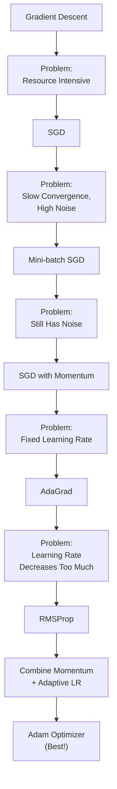
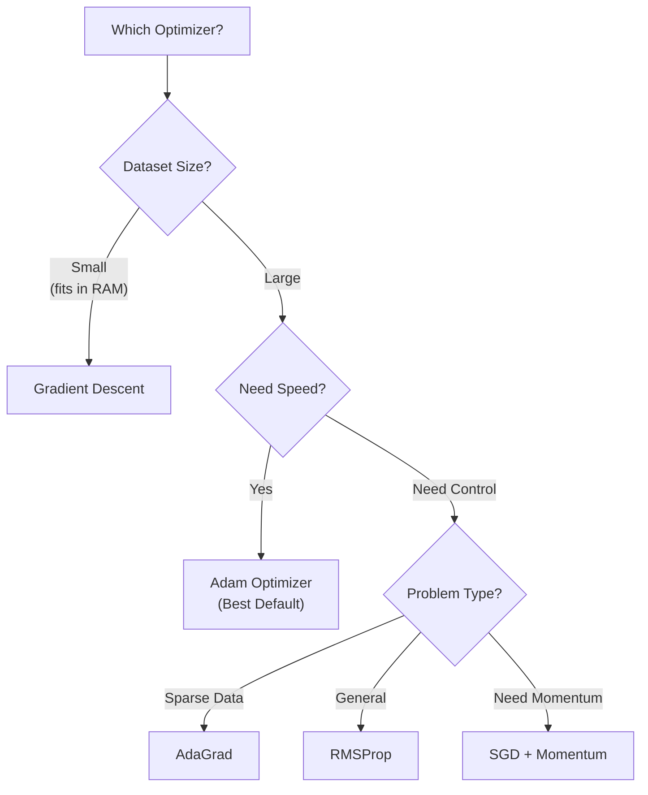

# Chapter 6: Optimizers

## 🎯 Learning Objectives
- Understand batch, epochs, and iterations
- Master all major optimizers: GD, SGD, Mini-batch SGD, Momentum, AdaGrad, RMSProp, Adam
- Learn exponential weighted average for smoothening
- Understand adaptive learning rates
- Know which optimizer to use when

## 📚 Key Concepts

### Training Terminology

#### Batch, Epoch, and Iteration

**Dataset**: 1 million records

**Epoch**: One complete forward + backward propagation through the **entire dataset**

**Batch Size**: Number of records processed together in one forward propagation

**Iteration**: Number of batches needed to complete one epoch

**Formula:**
$$\text{Iterations per Epoch} = \frac{\text{Total Records}}{\text{Batch Size}}$$

**Example:**

| Total Records | Batch Size | Iterations per Epoch |
|---------------|------------|---------------------|
| 1,000,000 | 1,000,000 (all) | 1 (Gradient Descent) |
| 1,000,000 | 1 | 1,000,000 (SGD) |
| 1,000,000 | 1,000 | 1,000 (Mini-batch) |

**Complete Training:**
- Run for **multiple epochs** (e.g., 100 epochs)
- Total iterations = Iterations per epoch × Number of epochs

### Weight Updation Formula (Generic)

$$w_{\text{new}} = w_{\text{old}} - \alpha \frac{\partial L}{\partial w_{\text{old}}}$$

**Where:**
- $w_{\text{new}}$ = Updated weight
- $w_{\text{old}}$ = Previous weight
- $\alpha$ = Learning rate
- $\frac{\partial L}{\partial w}$ = Gradient (slope)

**Same for Bias:**
$$b_{\text{new}} = b_{\text{old}} - \alpha \frac{\partial L}{\partial b_{\text{old}}}$$

### Optimizer Progression



## Optimizers

### 1. Gradient Descent (GD)

**Batch Size**: Entire dataset (e.g., 1 million records)

**How It Works:**
1. Pass **all** records in one forward propagation
2. Calculate cost function for entire dataset:
   $$\text{Cost} = \frac{1}{2n} \sum_{i=1}^{n} (y_i - \hat{y}_i)^2$$
3. Backward propagation: Update all weights once
4. One epoch = 1 iteration

**Advantages:**
- **Fast convergence** to global minima
- **Smooth path** (no noise)
- Guaranteed to reach global minima (for convex functions)

**Disadvantages:**
- **Resource Intensive**: Requires huge RAM to load all records
- **Expensive**: Need powerful hardware (GPUs) for large datasets
- **Not scalable**: Cannot handle datasets > RAM capacity

**Convergence Path:**

Smooth, direct path to global minima (yellow line):
```
Loss
  |    *
  |   /
  |  /_____ (smooth descent)
  |/
  +--------- Weight
```

**When to Use:**
- Small datasets that fit in memory
- When you have powerful hardware
- When you need guaranteed convergence

### 2. Stochastic Gradient Descent (SGD)

**Batch Size**: 1 record

**How It Works:**
1. Pass **1** record in forward propagation
2. Calculate loss for that single record
3. Backward propagation: Update weights
4. Repeat for next record

**Iterations:**
- 1 million records → 1 million iterations per epoch
- 100 epochs → 100 million total iterations!

**Advantages:**
- **Low memory**: Only 1 record in RAM at a time
- **Can escape local minima**: Noise helps exploration

**Disadvantages:**
- **Very slow convergence**: Too many iterations
- **High noise**: Zigzag path to global minima
- **High time complexity**: Takes forever to train

**Convergence Path:**

Zigzag, noisy path (green line):
```
Loss
  |  *\  /\
  | /  \/  \  /\
  |/     \__\/  \
  |         \____\
  +-------------- Weight
```

**When to Use:**
- Rarely used in practice (too slow)
- Online learning (data arrives one at a time)

### 3. Mini-batch SGD

**Batch Size**: Fixed size (e.g., 32, 64, 128, 256, 512, 1024)

**How It Works:**
1. Pass **batch** of records (e.g., 1000) in forward propagation
2. Calculate cost for batch
3. Backward propagation: Update weights
4. Move to next batch

**Iterations:**
- 1 million records, batch=1000 → 1000 iterations per epoch
- Much better than SGD!

**Advantages:**
- **Balanced**: Not too resource intensive, not too slow
- **Better convergence** than SGD
- **Lower noise** than SGD
- **Parallelizable**: GPUs can process batches efficiently

**Disadvantages:**
- **Still has noise** (but less than SGD)
- Zigzag path (but smoother than SGD)

**Convergence Path:**

Moderate noise (white line):
```
Loss
  |  *
  | / \ /\
  |/   \/  \
  |      \__\
  +---------- Weight
```

**When to Use:**
- **Most common choice** in practice
- Standard batch sizes: 32, 64, 128, 256
- Good balance of speed and convergence

**Noise Comparison:**

| Optimizer | Noise Level |
|-----------|-------------|
| Gradient Descent | None (smooth) |
| SGD | **Highest** (very zigzag) |
| Mini-batch SGD | **Moderate** (some zigzag) |

### 4. SGD with Momentum

**Problem Solved**: Reduces noise, smoothens convergence path

**Key Concept**: Exponential Weighted Average (EWA)

#### Exponential Weighted Average

**Idea**: Combine current value with previous values (weighted)

**Formula:**
$$v_t = \beta v_{t-1} + (1 - \beta) a_t$$

**Where:**
- $v_t$ = Weighted average at time $t$
- $\beta$ = Momentum hyperparameter (e.g., 0.9, 0.95, 0.99)
- $a_t$ = Current value at time $t$

**Example:**

| Time | Value ($a_t$) | $\beta = 0.9$ | Weighted Avg ($v_t$) |
|------|---------------|---------------|----------------------|
| $t_1$ | 10 | - | $v_1 = 10$ |
| $t_2$ | 5 | $0.9 \times 10 + 0.1 \times 5$ | $v_2 = 9.5$ |
| $t_3$ | 8 | $0.9 \times 9.5 + 0.1 \times 8$ | $v_3 = 9.35$ |

**Effect:**
- High $\beta$ (e.g., 0.95): More weight to **past** values (smooth)
- Low $\beta$ (e.g., 0.5): More weight to **current** value (responsive)

#### SGD with Momentum Formula

**Step 1: Calculate Momentum** (EWA on gradients)

$$v_{dw}^{(t)} = \beta v_{dw}^{(t-1)} + (1 - \beta) \frac{\partial L}{\partial w_{t-1}}$$

**Initialize**: $v_{dw}^{(0)} = 0$

**Step 2: Update Weights**

$$w_t = w_{t-1} - \alpha v_{dw}^{(t)}$$

**For Bias:**

$$v_{db}^{(t)} = \beta v_{db}^{(t-1)} + (1 - \beta) \frac{\partial L}{\partial b_{t-1}}$$

$$b_t = b_{t-1} - \alpha v_{db}^{(t)}$$

**Advantages:**
- **Smoothens path**: Reduces zigzag (noise)
- **Faster convergence**: Accelerates in consistent direction
- **Can escape local minima**: Momentum carries through

**Convergence Path:**

Smooth, accelerated path:
```
Loss
  |  *
  | /
  |/______ (smoother curve)
  |
  +--------- Weight
```

**Typical $\beta$ values**: 0.9, 0.95, 0.99

### 5. AdaGrad (Adaptive Gradient)

**Problem Solved**: Adaptive learning rate (changes over time)

**Key Idea**: Decrease learning rate as we approach global minima

**Formula:**

**Step 1: Accumulate Squared Gradients**

$$\alpha_t = \sum_{i=1}^{t} \left(\frac{\partial L}{\partial w_i}\right)^2$$

**Step 2: Adaptive Learning Rate**

$$\eta_t = \frac{\alpha}{\sqrt{\alpha_t} + \epsilon}$$

**Where:**
- $\alpha$ = Initial learning rate (e.g., 0.01)
- $\epsilon$ = Small constant (e.g., $10^{-8}$) to avoid division by zero
- $\alpha_t$ = Sum of squared gradients up to time $t$

**Step 3: Update Weights**

$$w_t = w_{t-1} - \eta_t \frac{\partial L}{\partial w_{t-1}}$$

**How It Works:**
- As training progresses, $\alpha_t$ increases (sum of squares)
- $\eta_t$ decreases (dividing by larger number)
- Learning rate adapts: **High initially, Low near minima**

**Example:**

| Time | $\alpha_t$ | $\eta_t$ (if $\alpha=0.01$) |
|------|-----------|----------------------------|
| $t=1$ | 0.04 | $\frac{0.01}{\sqrt{0.04}} = 0.05$ |
| $t=2$ | 0.08 | $\frac{0.01}{\sqrt{0.08}} = 0.035$ |
| $t=3$ | 0.12 | $\frac{0.01}{\sqrt{0.12}} = 0.029$ |

**Advantages:**
- **Adaptive learning rate**: Automatically adjusts
- **No manual tuning** of learning rate schedule

**Disadvantages:**
- **Learning rate can become too small**: $\alpha_t$ grows unbounded
- **May stop learning** before reaching minima

### 6. RMSProp (Root Mean Square Propagation)

**Problem Solved**: Controls AdaGrad's aggressive learning rate decay

**Key Idea**: Use EWA to control gradient accumulation

**Formula:**

**Step 1: EWA on Squared Gradients**

$$s_{dw}^{(t)} = \beta s_{dw}^{(t-1)} + (1 - \beta) \left(\frac{\partial L}{\partial w_{t-1}}\right)^2$$

**Initialize**: $s_{dw}^{(0)} = 0$

**Step 2: Adaptive Learning Rate**

$$\eta_t = \frac{\alpha}{\sqrt{s_{dw}^{(t)}} + \epsilon}$$

**Step 3: Update Weights**

$$w_t = w_{t-1} - \eta_t \frac{\partial L}{\partial w_{t-1}}$$

**Difference from AdaGrad:**
- AdaGrad: $\alpha_t$ grows **unbounded** (sum of all past gradients)
- RMSProp: $s_{dw}^{(t)}$ is **controlled** by $\beta$ (weighted average)

**Advantages:**
- **Controlled learning rate decay**: Doesn't decrease too aggressively
- **Better than AdaGrad** for deep networks

**Typical $\beta$ values**: 0.9, 0.99

### 7. Adam Optimizer (Adaptive Moment Estimation)

**Definition**: **Best optimizer** - Combines Momentum + RMSProp

**Formula:**

**Step 1: Momentum** (EWA on gradients)

$$v_{dw}^{(t)} = \beta_1 v_{dw}^{(t-1)} + (1 - \beta_1) \frac{\partial L}{\partial w_{t-1}}$$

**Step 2: RMSProp** (EWA on squared gradients)

$$s_{dw}^{(t)} = \beta_2 s_{dw}^{(t-1)} + (1 - \beta_2) \left(\frac{\partial L}{\partial w_{t-1}}\right)^2$$

**Step 3: Adaptive Learning Rate**

$$\eta_t = \frac{\alpha}{\sqrt{s_{dw}^{(t)}} + \epsilon}$$

**Step 4: Update Weights**

$$w_t = w_{t-1} - \eta_t v_{dw}^{(t)}$$

**Initialize**: $v_{dw}^{(0)} = 0$, $s_{dw}^{(0)} = 0$

**Same for Bias:**

$$v_{db}^{(t)} = \beta_1 v_{db}^{(t-1)} + (1 - \beta_1) \frac{\partial L}{\partial b_{t-1}}$$

$$s_{db}^{(t)} = \beta_2 s_{db}^{(t-1)} + (1 - \beta_2) \left(\frac{\partial L}{\partial b_{t-1}}\right)^2$$

$$b_t = b_{t-1} - \frac{\alpha}{\sqrt{s_{db}^{(t)}} + \epsilon} v_{db}^{(t)}$$

**Hyperparameters:**
- $\beta_1 = 0.9$ (momentum)
- $\beta_2 = 0.999$ (RMSProp)
- $\alpha = 0.001$ (learning rate)
- $\epsilon = 10^{-8}$

**Advantages:**
- ✓ **Smoothens convergence** (Momentum)
- ✓ **Adaptive learning rate** (RMSProp)
- ✓ **Fast convergence**
- ✓ **Robust to hyperparameters**
- ✓ **Works well for most problems**

**Why Adam is Best:**
1. Combines benefits of Momentum + RMSProp
2. Handles sparse gradients well
3. Works for various problem types
4. Requires minimal tuning

## Optimizer Comparison

### Summary Table

| Optimizer | Batch Size | Noise | Learning Rate | Speed | Memory |
|-----------|-----------|-------|---------------|-------|--------|
| **Gradient Descent** | All data | None | Fixed | Fast | **High** |
| **SGD** | 1 | **Highest** | Fixed | **Slowest** | Low |
| **Mini-batch SGD** | 32-512 | Moderate | Fixed | Moderate | Moderate |
| **SGD + Momentum** | 32-512 | **Low** | Fixed | **Fast** | Moderate |
| **AdaGrad** | 32-512 | Low | **Adaptive** | Moderate | Moderate |
| **RMSProp** | 32-512 | Low | **Adaptive** | **Fast** | Moderate |
| **Adam** | 32-512 | **Lowest** | **Adaptive** | **Fastest** | Moderate |

### Formula Comparison

| Optimizer | Weight Update Formula |
|-----------|----------------------|
| **GD / SGD** | $w_t = w_{t-1} - \alpha \frac{\partial L}{\partial w}$ |
| **Momentum** | $w_t = w_{t-1} - \alpha v_{dw}^{(t)}$ <br/> $v_{dw}^{(t)} = \beta v_{dw}^{(t-1)} + (1-\beta)\frac{\partial L}{\partial w}$ |
| **AdaGrad** | $w_t = w_{t-1} - \frac{\alpha}{\sqrt{\alpha_t} + \epsilon} \frac{\partial L}{\partial w}$ |
| **RMSProp** | $w_t = w_{t-1} - \frac{\alpha}{\sqrt{s_{dw}^{(t)}} + \epsilon} \frac{\partial L}{\partial w}$ |
| **Adam** | $w_t = w_{t-1} - \frac{\alpha}{\sqrt{s_{dw}^{(t)}} + \epsilon} v_{dw}^{(t)}$ |

### When to Use Which Optimizer



**Practical Recommendations:**

**1. Default Choice:** **Adam Optimizer**
- Works for 90% of problems
- Fast, adaptive, robust

**2. If Adam doesn't work:**
- Try **RMSProp** (similar but simpler)
- Try **SGD + Momentum** (more control)

**3. For specific cases:**
- **Sparse data** (NLP): AdaGrad
- **Small dataset**: Gradient Descent
- **Online learning**: SGD

**4. Batch size recommendations:**
- **Start with**: 32 or 64
- **GPU memory limited**: 16 or 32
- **Large dataset**: 128, 256, or 512

## ❓ Interview Questions & Answers

**Q1: What is the difference between batch, epoch, and iteration?**

- **Batch**: Number of samples processed together
- **Epoch**: One complete pass through entire dataset
- **Iteration**: Number of batches to complete one epoch
- Formula: Iterations = Total Samples / Batch Size

**Q2: What are the problems with Gradient Descent?**

- **Resource intensive**: Needs huge RAM to load all data
- **Not scalable**: Cannot handle datasets larger than memory
- **Expensive**: Requires powerful hardware for large datasets

**Q3: Why is SGD slow?**

SGD processes one sample at a time. For 1 million records and 100 epochs:
- Iterations = 1M × 100 = **100 million iterations**
- Too many weight updates slow down training significantly

**Q4: What is the sweet spot between GD and SGD?**

**Mini-batch SGD** with batch sizes 32-512. It balances:
- Memory efficiency (not all data in RAM)
- Speed (fewer iterations than SGD)
- Convergence (less noise than SGD)

**Q5: What is momentum and why do we need it?**

Momentum uses exponential weighted average to smoothen the gradient updates:
$$v_{dw}^{(t)} = \beta v_{dw}^{(t-1)} + (1-\beta)\frac{\partial L}{\partial w}$$

**Why:** Reduces noise/zigzag in convergence path, accelerates training.

**Q6: What is exponential weighted average?**

A method to combine current value with past values using weights:
$$v_t = \beta v_{t-1} + (1-\beta) a_t$$
- $\beta$ controls how much past matters (typical: 0.9, 0.95)
- High $\beta$ → More smoothing (more past influence)

**Q7: What does adaptive learning rate mean?**

Learning rate that **changes during training**:
- **High** initially (large steps toward minima)
- **Low** near minima (small steps for precision)

Implemented in: AdaGrad, RMSProp, Adam

**Q8: What's the problem with AdaGrad?**

AdaGrad's learning rate can decrease **too aggressively**:
- Accumulates all past squared gradients: $\alpha_t = \sum (\frac{\partial L}{\partial w})^2$
- As $\alpha_t$ grows unbounded, $\eta_t = \frac{\alpha}{\sqrt{\alpha_t}}$ becomes tiny
- Network may **stop learning** before reaching minima

**Q9: How does RMSProp fix AdaGrad's problem?**

Uses **exponential weighted average** instead of sum:
$$s_{dw}^{(t)} = \beta s_{dw}^{(t-1)} + (1-\beta)(\frac{\partial L}{\partial w})^2$$
- Controlled by $\beta$ (not unbounded)
- Learning rate decreases **gradually**, not aggressively

**Q10: Why is Adam the best optimizer?**

Adam combines **best of both worlds**:
1. **Momentum**: Smoothens path (from SGD + Momentum)
2. **Adaptive LR**: Adjusts learning rate (from RMSProp)
3. **Fast convergence**: Benefits from both features
4. **Robust**: Works well with default hyperparameters

**Q11: What are typical hyperparameters for Adam?**

- $\beta_1 = 0.9$ (momentum parameter)
- $\beta_2 = 0.999$ (RMSProp parameter)
- $\alpha = 0.001$ (learning rate)
- $\epsilon = 10^{-8}$ (numerical stability)

**Q12: What batch size should I use?**

**Common choices:** 32, 64, 128, 256
- **Start with**: 32 or 64
- **Limited GPU memory**: 16 or 32
- **Large dataset + GPU**: 128 or 256

**Q13: Can you explain the noise in SGD visualizations?**

- **GD**: Smooth path (no noise) - processes all data
- **SGD**: Highest noise (zigzag) - one sample at a time, high variance
- **Mini-batch**: Moderate noise - averages over batch, less variance

## 💡 Key Takeaways

- **Batch/Epoch/Iteration**: Batch = samples together, Epoch = full dataset pass, Iteration = batches per epoch
- **GD**: Fast but resource intensive (all data at once)
- **SGD**: Low memory but very slow (1 sample at a time)
- **Mini-batch SGD**: Best balance (32-512 samples per batch)
- **Momentum**: Smoothens path using EWA ($\beta \approx 0.9$)
- **AdaGrad**: Adaptive LR, but decreases too much
- **RMSProp**: Controls AdaGrad's decay using EWA
- **Adam**: **Best optimizer** (Momentum + RMSProp)

## ⚠️ Common Mistakes

**Mistake 1**: "Use full dataset for training"
- **Reality**: Use mini-batches (32-512) for efficiency

**Mistake 2**: "SGD is better than mini-batch"
- **Reality**: Mini-batch SGD is almost always better (less noise, faster)

**Mistake 3**: "Learning rate should be constant"
- **Reality**: Adaptive optimizers (Adam, RMSProp) adjust LR automatically

**Mistake 4**: "Always use Gradient Descent"
- **Reality**: Only for small datasets; use Adam for most cases

**Mistake 5**: "Momentum and adaptive LR are the same"
- **Reality**: Momentum smoothens gradients, adaptive LR changes step size

**Mistake 6**: "Higher batch size is always better"
- **Reality**: Too high → poor generalization; too low → high noise. Sweet spot: 32-256

## 📝 Quick Revision Points

### Definitions
- **Epoch**: 1 complete pass through entire dataset
- **Batch**: Samples processed together in one iteration
- **Iteration**: Forward + backward prop for one batch

### Optimizer Evolution
```
GD → SGD → Mini-batch SGD → Momentum → AdaGrad → RMSProp → Adam
```

### Key Formulas

**Momentum:**
$$v_{dw}^{(t)} = \beta v_{dw}^{(t-1)} + (1-\beta)\frac{\partial L}{\partial w}$$

**RMSProp:**
$$s_{dw}^{(t)} = \beta s_{dw}^{(t-1)} + (1-\beta)\left(\frac{\partial L}{\partial w}\right)^2$$
$$\eta_t = \frac{\alpha}{\sqrt{s_{dw}^{(t)}} + \epsilon}$$

**Adam:** Combines both above

### Default Recommendations
- **Optimizer**: Adam
- **Batch size**: 32 or 64
- **Learning rate**: 0.001 (for Adam)
- **Momentum** ($\beta_1$): 0.9
- **RMSProp** ($\beta_2$): 0.999

### Remember
- **Adam = Momentum + RMSProp** (Best!)
- **EWA** smoothens values: $v_t = \beta v_{t-1} + (1-\beta)a_t$
- **Adaptive LR**: High initially, low near minima
- **Batch size**: 32-256 (sweet spot for most problems)
