# Chapter 7: Convolutional Neural Networks (CNN)

## 🎯 Learning Objectives
- Understand CNN vs Human Brain (Visual Cortex)
- Learn image fundamentals: pixels, channels, RGB
- Master convolution operation with filters/kernels
- Understand padding, stride, and pooling
- Learn complete CNN architecture
- Know when to use CNN

## 📚 Key Concepts

### CNN vs Human Brain

#### Visual Cortex

**Human Brain Processing:**
- **Visual Cortex**: Back part of brain, responsible for seeing objects
- **Layered Processing**: V1 → V2 → V3 → V4 → V5 → V6 → V7

**Each Layer Extracts Different Information:**
- **V1**: Moving objects
- **V2**: Animals (cats, dogs)
- **V3**: Environment mapping
- **V4-V7**: Progressive refinement
- **Final Layer**: Complete visualization

**CNN Mimics This:**
- Multiple layers extract different features
- Early layers: Edges, textures
- Middle layers: Shapes, patterns
- Deep layers: Complete objects

### Image Fundamentals

#### 1. Black & White Images (Grayscale)

**Structure:**
- **Channels**: 1 (single channel)
- **Pixel Values**: 0 to 255
  - 0 = Black
  - 255 = White
  - In between = Shades of gray

**Example: 5×5 Image**

```
[  0   40  128  240  255]
[ 10   50  130  235  250]
[ 20   60  140  230  245]
[ 30   70  150  225  240]
[ 40   80  160  220  235]
```

**Representation**: 5 × 5 × 1 (width × height × channels)

#### 2. RGB Images (Color)

**Structure:**
- **Channels**: 3 (Red, Green, Blue)
- **Each Channel**: 0 to 255 pixel values

**Representation**: 5 × 5 × 3

```mermaid
graph LR
    A["RGB Image"] --> B["Red Channel<br/>5×5"]
    A --> C["Green Channel<br/>5×5"]
    A --> D["Blue Channel<br/>5×5"]
```



**Example:**

| Channel | Purpose | Values |
|---------|---------|--------|
| **Red** | Red intensity | 0-255 per pixel |
| **Green** | Green intensity | 0-255 per pixel |
| **Blue** | Blue intensity | 0-255 per pixel |

**Color Mixing:**
- Red + Green + Blue → Any color
- (255, 0, 0) → Pure Red
- (0, 255, 0) → Pure Green
- (0, 0, 255) → Pure Blue
- (255, 255, 255) → White
- (0, 0, 0) → Black

### Convolution Operation

#### Step 1: Min-Max Scaling

**Convert pixel values 0-255 to 0-1:**

$$\text{Normalized Pixel} = \frac{\text{Pixel Value}}{255}$$

**Why?**
- Standardizes input range
- Faster convergence
- Prevents numerical instability

#### Step 2: Apply Filter/Kernel

**Filter (Kernel)**: Small matrix (e.g., 3×3) that slides over image

**Example Setup:**

**Input Image** (6×6):
```
[0  0  0  1  1  0]
[0  0  0  1  1  0]
[0  0  0  1  1  0]
[0  0  0  1  1  0]
[0  0  0  1  1  0]
[0  0  0  1  1  0]
```

**Vertical Edge Filter** (3×3):
```
[-1  0  1]
[-2  0  2]
[-1  0  1]
```

#### How Convolution Works

**Step-by-Step:**

1. **Place filter** on top-left of image (3×3 region)
2. **Element-wise multiply** filter values with image pixels
3. **Sum all products** → Single output value
4. **Slide filter** right by stride (e.g., 1 pixel)
5. **Repeat** until entire image covered

**Output Calculation:**

$$\text{Output}[i,j] = \sum_{m} \sum_{n} \text{Image}[i+m, j+n] \times \text{Filter}[m, n]$$

**After one convolution pass:**
- Input: 6×6
- Filter: 3×3
- Output: 4×4

**Output Size Formula:**

$$\text{Output Size} = \frac{n - f + 1}{1}$$

Where:
- $n$ = Input size (6)
- $f$ = Filter size (3)
- Output = $6 - 3 + 1 = 4$

#### Common Filters

**1. Vertical Edge Detector:**
```
[-1  0  1]
[-2  0  2]
[-1  0  1]
```

**2. Horizontal Edge Detector:**
```
[ 1  2  1]
[ 0  0  0]
[-1 -2 -1]
```

**3. Custom Filters:**
- Filters are **learned during training** (not hardcoded!)
- Backpropagation updates filter values
- Different filters detect different features

#### After Convolution: ReLU Activation

**Applied element-wise to output:**

$$\text{Output}_{\text{ReLU}} = \max(0, \text{Output}_{\text{conv}})$$

**Why?**
- Introduces non-linearity
- Enables backpropagation (derivatives exist)
- Allows gradient-based learning

### Padding

**Problem**: Convolution reduces image size (6×6 → 4×4)
**Solution**: Add border around image

#### Zero Padding

**Add zeros around image border:**

**Original** (6×6) → **Padded** (8×8):
```
[0  0  0  0  0  0  0  0]
[0 |Image content here| 0]
[0 |     6×6         | 0]
[0 |                 | 0]
[0  0  0  0  0  0  0  0]
```

**With Padding:**

$$\text{Output Size} = \frac{n + 2p - f + 1}{s}$$

Where:
- $n$ = Original size (6)
- $p$ = Padding (1)
- $f$ = Filter size (3)
- $s$ = Stride (1)

**Example:**
$$\text{Output} = \frac{6 + 2(1) - 3 + 1}{1} = \frac{8 - 3 + 1}{1} = 6$$

**Result**: Input 6×6 → Output 6×6 (same size!)

**Types of Padding:**
1. **Zero Padding**: Fill with 0
2. **Same Padding**: Fill with nearest pixel value
3. **Valid Padding**: No padding (default)

### Stride

**Definition**: Number of pixels filter moves at each step

**Stride = 1:**
- Move 1 pixel at a time
- More overlap
- Larger output

**Stride = 2:**
- Move 2 pixels at a time
- Less overlap
- Smaller output

**Formula with Stride:**

$$\text{Output Size} = \frac{n + 2p - f}{s} + 1$$

**Example:**
- Input: 6×6
- Filter: 3×3
- Stride: 2
- Padding: 0

$$\text{Output} = \frac{6 - 3}{2} + 1 = \frac{3}{2} + 1 = 2.5$$

(Round down → Output: 2×2)

### Pooling Layers

**Purpose**: Reduce spatial dimensions while retaining important features

**Concept**: Location Invariance
- Objects can appear anywhere in image
- Pooling extracts most relevant information
- Reduces computation

#### Max Pooling

**Most Common Type**

**How It Works:**
- Apply filter (e.g., 2×2) to input
- Take **maximum** value in each region
- Move by stride (usually 2)

**Example:**

**Input** (4×4):
```
[1  2  3  7]
[4  0  5  9]
[3  5  1  2]
[6  3  8  1]
```

**Max Pooling (2×2, stride=2):**

**Output** (2×2):
```
[4  9]
[6  8]
```

**Calculation:**
- Top-left 2×2: max(1,2,4,0) = 4
- Top-right 2×2: max(3,7,5,9) = 9
- Bottom-left 2×2: max(3,5,6,3) = 6
- Bottom-right 2×2: max(1,2,8,1) = 8

**Benefits:**
- **Reduces size**: 4×4 → 2×2
- **Retains important features**: Highest values (clearest information)
- **Translation invariance**: Object position doesn't matter

#### Other Pooling Types

**1. Average Pooling:**
- Take **average** of region
- Smoother output

**2. Min Pooling:**
- Take **minimum** of region
- Less common

**Typical Configuration:**
- **Filter**: 2×2
- **Stride**: 2
- **Result**: Halves dimensions

### Flattening Layer

**Purpose**: Convert 2D feature maps to 1D vector for fully connected layers

**Example:**

**Input** (Multiple filters output):
```
Filter 1:    Filter 2:    Filter 3:
[5  7]       [7  9]       [6  5]
[3  5]       [2  1]       [3  1]
```

**After Flattening:**
```
[5, 7, 3, 5, 7, 9, 2, 1, 6, 5, 3, 1]
```

**Process:**
1. Take each filter output
2. Convert to single row
3. Concatenate all filters

**Result**: Ready for Dense (Fully Connected) layers

### Complete CNN Architecture

```mermaid
graph LR
    A["Input Image<br/>32×32×3"] --> B["Conv Layer<br/>+ReLU"]
    B --> C["Pooling"]
    C --> D["Conv Layer<br/>+ReLU"]
    D --> E["Pooling"]
    E --> F["Conv Layer<br/>+ReLU"]
    F --> G["Flatten"]
    G --> H["Dense Layer<br/>+ReLU"]
    H --> I["Output<br/>Softmax"]
```



#### Layer-by-Layer Breakdown

**1. Convolutional Layer:**
- Apply filters (e.g., 32 filters of 3×3)
- Extract features (edges, textures)
- Apply ReLU activation

**2. Pooling Layer:**
- Reduce spatial dimensions
- Retain important features
- Usually Max Pooling (2×2, stride=2)

**3. Repeat Conv + Pooling:**
- Multiple times (2-5+ blocks)
- Filters increase in depth: 32 → 64 → 128 → 256
- Spatial size decreases: 32×32 → 16×16 → 8×8 → 4×4

**4. Flatten:**
- Convert 2D to 1D

**5. Dense Layers (Fully Connected):**
- Standard ANN layers
- ReLU activation in hidden layers

**6. Output Layer:**
- **Binary Classification**: 1 neuron + Sigmoid
- **Multi-class**: N neurons + Softmax

### Hyperparameters in CNN

| Hyperparameter | Typical Values | Purpose |
|----------------|----------------|---------|
| **Number of Filters** | 32, 64, 128, 256 | Features to extract |
| **Filter Size** | 3×3, 5×5, 7×7 | Receptive field |
| **Padding** | "same", "valid" | Maintain/reduce size |
| **Stride** | 1, 2 | Step size |
| **Pooling Size** | 2×2 | Downsampling factor |
| **Pooling Stride** | 2 | Usually same as pool size |

### Key Formulas

**1. Output Size (No Padding, Stride=1):**

$$\text{Output} = n - f + 1$$

**2. Output Size (With Padding):**

$$\text{Output} = \frac{n + 2p - f}{s} + 1$$

**3. Total Parameters in Conv Layer:**

$$\text{Params} = (f \times f \times c_{\text{in}} + 1) \times c_{\text{out}}$$

Where:
- $f$ = Filter size
- $c_{\text{in}}$ = Input channels
- $c_{\text{out}}$ = Output channels (number of filters)
- +1 = Bias term

**Example:**
- Input: 32×32×3
- Filter: 3×3
- Filters: 32

$$\text{Params} = (3 \times 3 \times 3 + 1) \times 32 = 28 \times 32 = 896$$

## ❓ Interview Questions & Answers

**Q1: What is a CNN and how is it different from ANN?**

- **CNN**: Specialized for spatial data (images, videos)
  - Uses convolutional layers with filters
  - Preserves spatial relationships
  - Fewer parameters (weight sharing)

- **ANN**: General-purpose, fully connected
  - Every neuron connected to all previous neurons
  - More parameters
  - Doesn't preserve spatial structure

**Q2: What are the main components of a CNN?**

1. **Convolutional Layer**: Feature extraction using filters
2. **Activation (ReLU)**: Non-linearity
3. **Pooling Layer**: Dimensionality reduction
4. **Flatten Layer**: Convert 2D to 1D
5. **Dense Layers**: Classification

**Q3: What is a filter/kernel in CNN?**

A small matrix (e.g., 3×3, 5×5) that slides over the input image to extract features. Filters are **learned during training** through backpropagation, not manually defined.

**Q4: Why do we need padding?**

- **Problem**: Convolution reduces image size
- **Solution**: Add border (usually zeros) around image
- **Benefit**: Maintains spatial dimensions, prevents information loss at edges

**Q5: What is the difference between "same" and "valid" padding?**

- **Valid Padding**: No padding (default)
  - Output smaller than input

- **Same Padding**: Add padding to maintain size
  - Output same as input (with stride=1)

**Q6: What is stride and how does it affect output size?**

Stride = number of pixels filter moves at each step
- **Stride=1**: Output larger (more overlap)
- **Stride=2**: Output smaller (less overlap, faster)

**Q7: What is max pooling and why is it used?**

Max pooling takes the maximum value from each pooling region.

**Benefits:**
- Reduces spatial dimensions (computational efficiency)
- Retains most important features
- Provides translation invariance (location doesn't matter)

**Q8: Why do we use ReLU after convolution?**

- Introduces non-linearity (CNNs can learn complex patterns)
- Enables backpropagation (derivatives computable)
- Allows filter weights to be updated during training

**Q9: Are filters manually designed or learned?**

**Learned during training!**
- Initially: Random values
- During training: Backpropagation updates filter weights
- Final filters: Automatically optimized for the task

**Q10: What is location invariance in CNNs?**

The ability to recognize objects regardless of their position in the image. Achieved through:
- Convolution (shared weights)
- Pooling (extracts dominant features)

**Q11: How does CNN architecture typically progress?**

```
Input → Conv+Pool → Conv+Pool → ... → Flatten → Dense → Output
Depth:  32        → 64        → 128   → 1D     → FC   → Classes
Size:   Large     → Medium    → Small → Vector → -    → -
```

**Depth increases, spatial size decreases**

**Q12: What is the purpose of the flatten layer?**

Converts 2D feature maps from convolution/pooling layers into a 1D vector that can be fed into fully connected (Dense) layers for classification.

**Q13: When should you use CNN vs ANN?**

**Use CNN:**
- Images (classification, detection, segmentation)
- Videos (action recognition)
- Any spatial data

**Use ANN:**
- Tabular data
- Text (though RNN/Transformers better)
- General non-spatial data

## 💡 Key Takeaways

- **CNN**: Specialized for spatial data (images/videos)
- **Filters**: Learned automatically, extract features (edges → shapes → objects)
- **Convolution**: Sliding filter over image, extracting features
- **Padding**: Maintains spatial dimensions, prevents information loss
- **Stride**: Controls filter movement (1=small steps, 2=large steps)
- **Pooling**: Reduces dimensions, retains important features (max pooling most common)
- **Architecture**: Conv+ReLU → Pool → ... → Flatten → Dense → Output
- **Formula**: Output = $\frac{n + 2p - f}{s} + 1$

## ⚠️ Common Mistakes

**Mistake 1**: "Filters are manually designed"
- **Reality**: Filters are **learned** during training via backpropagation

**Mistake 2**: "Padding adds more information"
- **Reality**: Padding (usually zeros) just maintains size, doesn't add real information

**Mistake 3**: "Larger stride is always better"
- **Reality**: Larger stride reduces output size, may lose information. Balance needed.

**Mistake 4**: "Pooling layer has trainable parameters"
- **Reality**: Pooling has **no** trainable parameters (just takes max/average)

**Mistake 5**: "CNN only for image classification"
- **Reality**: CNN also for object detection, segmentation, video analysis, even some NLP tasks

**Mistake 6**: "More filters always better"
- **Reality**: More filters = more parameters = risk of overfitting. Balance needed.

## 📝 Quick Revision Points

### Image Basics
- **Grayscale**: 1 channel, 0-255
- **RGB**: 3 channels (R,G,B), 0-255 each
- **Representation**: Width × Height × Channels

### Min-Max Scaling
$$\text{Normalized} = \frac{\text{Pixel}}{255}$$
Converts 0-255 → 0-1

### Convolution
- **Filter**: Small matrix (3×3, 5×5) slides over image
- **Output**: Feature map
- **ReLU**: Applied after convolution

### Formulas

**Output Size:**
$$\text{Output} = \frac{n + 2p - f}{s} + 1$$

Where:
- $n$ = Input size
- $p$ = Padding
- $f$ = Filter size
- $s$ = Stride

**Example:**
- Input: 6×6, Filter: 3×3, Padding: 0, Stride: 1
- Output: $\frac{6 + 0 - 3}{1} + 1 = 4$

### Pooling
- **Max Pooling**: Take maximum (most common)
- **Typical**: 2×2 filter, stride=2
- **Effect**: Halves dimensions

### CNN Architecture Pattern
```
Input Image (32×32×3)
  ↓
Conv (32 filters) + ReLU
  ↓
Max Pool (2×2)
  ↓
Conv (64 filters) + ReLU
  ↓
Max Pool (2×2)
  ↓
Flatten
  ↓
Dense (128) + ReLU
  ↓
Output (Softmax/Sigmoid)
```

### Hyperparameters
- **Filters**: 32, 64, 128, 256
- **Filter Size**: 3×3 (most common)
- **Padding**: "same" or "valid"
- **Stride**: 1 or 2
- **Pooling**: 2×2, stride=2

### Remember
- **Filters are learned** (not manually designed)
- **ReLU after convolution** (non-linearity + backprop)
- **Padding preserves size**
- **Pooling reduces size** (no trainable parameters)
- **Flatten before Dense** layers
- **Progressive depth increase**: 32 → 64 → 128 filters
- **Progressive size decrease**: 32×32 → 16×16 → 8×8
