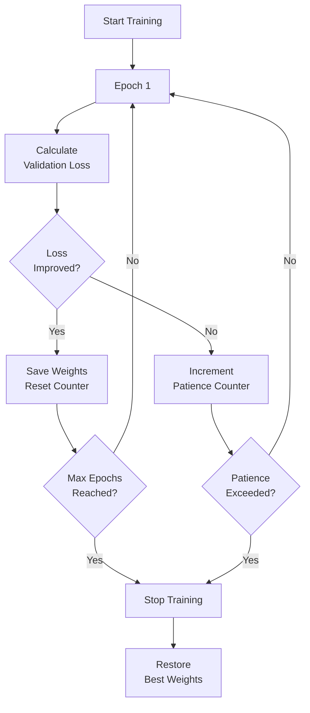

# Chapter 8: Advanced Training Concepts

## 🎯 Learning Objectives
- Understand early stopping and when to stop training
- Learn black box vs white box models
- Know which algorithms require feature scaling
- Master overfitting prevention techniques
- Understand model interpretability

## 📚 Key Concepts

### Early Stopping

#### The Problem

**Question**: How many epochs should we train a neural network?

**Scenario:**
- Train for too few epochs → Underfitting
- Train for too many epochs → Overfitting

**Need**: Automatic stopping mechanism

#### What is Early Stopping?

**Definition**: Stop training when validation performance stops improving

**Mechanism:**
- Monitor validation loss (or metric)
- If no improvement for N epochs → Stop training
- Restore best weights from earlier epoch



#### Key Parameters

**1. Monitor Metric:**
- `val_loss` (most common)
- `val_accuracy`
- Custom metrics

**2. Patience:**
- Number of epochs to wait for improvement
- **Low patience** (e.g., 3-5): Stops quickly
- **High patience** (e.g., 10-20): More tolerant

**3. Min Delta:**
- Minimum change to qualify as improvement
- Example: `min_delta=0.001`
- If improvement < min_delta → Counted as no improvement

**4. Restore Best Weights:**
- `True`: Use weights from best epoch
- `False`: Use weights from last epoch

#### Example Configuration

**Typical Early Stopping Setup:**
```
Monitor: val_loss
Min Delta: 0.001
Patience: 10
Restore Best Weights: True
```

**What Happens:**
- **Epoch 1-30**: Validation loss decreasing → Training continues
- **Epoch 30**: Best val_loss = 0.25 → Weights saved
- **Epoch 31-40**: Val_loss = 0.26, 0.27, 0.26, ... (no improvement)
- **Epoch 40**: Patience exceeded → Training stops
- **Final**: Restore weights from Epoch 30

#### Benefits

✓ **Prevents Overfitting**: Stops before model memorizes training data
✓ **Saves Time**: No need to train 1000 epochs if converging at 50
✓ **Automatic**: No manual monitoring required
✓ **Optimal Weights**: Restores best performing model

#### Training Curve Example

**Without Early Stopping:**
```
Loss
  |
  |  Train \_____
  |            \_____
  |  Val     /
  |        /  (overfitting)
  +------------------ Epochs
     50   100  200
```

**With Early Stopping:**
```
Loss
  |
  |  Train \_____
  |            X (stopped)
  |  Val     /
  |        ↓ (best)
  +------------------ Epochs
     50   100
```

### Black Box vs White Box Models

#### Definitions

**White Box Model:**
- **Interpretable**: Can see and understand decision process
- **Transparent**: Know how input affects output
- **Explainable**: Can explain predictions to humans

**Black Box Model:**
- **Non-interpretable**: Cannot easily see decision process
- **Opaque**: Complex internal workings
- **Hard to explain**: Difficult to justify predictions

#### Model Classification

**White Box Models:**

| Algorithm | Why White Box |
|-----------|---------------|
| **Linear Regression** | Simple equation: $y = mx + c$ |
| **Logistic Regression** | Clear coefficient interpretation |
| **Decision Tree** | Visual tree, rule-based |
| **K-Nearest Neighbors** | Distance-based, can see neighbors |

**Black Box Models:**

| Algorithm | Why Black Box |
|-----------|---------------|
| **Random Forest** | 100+ trees, cannot track all |
| **XGBoost** | Multiple boosted trees |
| **Neural Networks** | Millions of parameters |
| **Deep Learning (CNN, RNN)** | Complex multi-layer processing |
| **SVM (with kernel)** | Kernel transformations opaque |

#### Degree of Interpretability


#### Why It Matters

**When White Box Preferred:**
- **Healthcare**: Need to explain diagnosis to doctors
- **Finance**: Regulatory compliance (loan decisions)
- **Legal**: Must justify decisions (credit scoring)
- **Research**: Understanding relationships between variables

**When Black Box Acceptable:**
- **Image Recognition**: Accuracy more important than explanation
- **Recommendation Systems**: Performance over interpretability
- **Games**: Results matter, not process
- **Internal Tools**: No regulatory requirements

#### Explainable AI (XAI)

**Problem**: Need to use black box models but require interpretability

**Solutions:**
- **SHAP**: Explains individual predictions
- **LIME**: Local interpretable model approximations
- **Feature Importance**: Which features matter most
- **Attention Mechanisms**: What model "looks at"
- **Grad-CAM**: Visualize CNN activations

**Trend**: Explainable AI becoming critical research area

### Feature Scaling Requirements

#### Which Algorithms Require Feature Scaling?

**Feature Scaling = Standardizing feature ranges (e.g., 0-1 or mean=0, std=1)**

#### Algorithms That NEED Feature Scaling

**1. Distance-Based Algorithms:**

| Algorithm | Why? |
|-----------|------|
| **K-Nearest Neighbors (KNN)** | Uses Euclidean distance |
| **K-Means Clustering** | Distance-based centroids |
| **Hierarchical Clustering** | Distance metrics |
| **DBSCAN** | Density = distance-based |
| **SVM** | Distance to hyperplane |

**Reason**: Large feature values dominate distance calculations

**Example:**
- Feature 1: Age (20-80)
- Feature 2: Income (20,000-200,000)

Without scaling, income dominates distance!

**2. Gradient Descent-Based Algorithms:**

| Algorithm | Why? |
|-----------|------|
| **Linear Regression** | Uses gradient descent |
| **Logistic Regression** | Gradient descent optimization |
| **Neural Networks** | Gradient descent/optimizers |
| **Deep Learning** | All DL uses optimizers |

**Reason**:
- Different scales → Different gradient magnitudes
- Causes slow/unstable convergence
- Learning rate hard to tune

**Convergence Without Scaling:**
```
Loss
  |    *
  |   /\  /\  (zigzag)
  |  /  \/  \
  | /        \
  +------------- Epochs
   Slow convergence
```

**Convergence With Scaling:**
```
Loss
  |  *
  | /
  |/_____ (smooth)
  |
  +------------- Epochs
   Fast convergence
```

**3. Deep Learning (Always!):**

| Model Type | Scaling Type |
|------------|--------------|
| **ANN** | StandardScaler (z-score) |
| **CNN** | Min-Max (0-1) for images |
| **RNN** | StandardScaler |

#### Algorithms That DON'T Need Feature Scaling

**Tree-Based Algorithms:**

| Algorithm | Why No Scaling Needed? |
|-----------|------------------------|
| **Decision Tree** | Splits based on thresholds (scale-invariant) |
| **Random Forest** | Ensemble of decision trees |
| **Gradient Boosting (XGBoost, LightGBM, CatBoost)** | Tree-based splits |
| **AdaBoost** | Tree-based |

**Reason**: Trees split on "Is feature > threshold?" → Scale doesn't matter

**Naive Bayes:**
- Uses probability distributions
- Scale-invariant

#### Scaling Methods

**1. Min-Max Scaling (Normalization):**

$$X_{\text{scaled}} = \frac{X - X_{\text{min}}}{X_{\text{max}} - X_{\text{min}}}$$

**Range**: [0, 1]

**Use When:**
- **Neural Networks** (bounded activation functions)
- **Images** (pixel values 0-255 → 0-1)
- **Know min/max bounds**

**2. Standard Scaling (Standardization):**

$$X_{\text{scaled}} = \frac{X - \mu}{\sigma}$$

**Range**: Mean=0, Std=1 (unbounded)

**Use When:**
- **Gaussian distribution** expected
- **Outliers present** (less sensitive than Min-Max)
- **General ML** (Linear/Logistic Regression, SVM)

#### Quick Reference Table

| Algorithm | Feature Scaling | Type |
|-----------|----------------|------|
| **Linear Regression** | ✓ Required | Standard |
| **Logistic Regression** | ✓ Required | Standard |
| **Decision Tree** | ✗ Not needed | - |
| **Random Forest** | ✗ Not needed | - |
| **XGBoost** | ✗ Not needed | - |
| **KNN** | ✓ Required | Standard/Min-Max |
| **K-Means** | ✓ Required | Standard/Min-Max |
| **SVM** | ✓ Required | Standard |
| **Neural Networks** | ✓ Required | Standard |
| **CNN (images)** | ✓ Required | Min-Max (0-1) |
| **Naive Bayes** | ✗ Not needed | - |

### Overfitting Prevention Techniques

#### 1. Early Stopping
- Stop training when validation performance degrades
- Covered above

#### 2. Dropout
- Randomly deactivate neurons during training
- Example: `dropout=0.3` → 30% neurons turned off
- Prevents co-adaptation of neurons

#### 3. Regularization
- **L1 (Lasso)**: Sparse weights (some become zero)
- **L2 (Ridge)**: Small weights (penalize large values)

#### 4. Data Augmentation
- **Images**: Rotation, flip, crop, zoom
- **Text**: Synonym replacement, back-translation
- Increases effective training data

#### 5. More Data
- Best solution if possible
- More diverse training examples

#### 6. Simpler Model
- Reduce layers/neurons
- Less capacity to overfit

#### 7. Cross-Validation
- K-fold cross-validation
- Ensures model generalizes

## ❓ Interview Questions & Answers

**Q1: What is early stopping and why is it important?**

Early stopping monitors validation loss and stops training when it stops improving for N epochs (patience). It prevents overfitting and saves training time.

**Q2: What parameters are important for early stopping?**

- **Monitor**: Metric to track (val_loss, val_accuracy)
- **Patience**: Epochs to wait for improvement
- **Min Delta**: Minimum improvement threshold
- **Restore Best Weights**: Whether to restore best epoch weights

**Q3: What's the difference between black box and white box models?**

- **White Box**: Interpretable (Linear Regression, Decision Tree) - can explain decisions
- **Black Box**: Non-interpretable (Neural Networks, Random Forest) - complex internal workings

**Q4: Which algorithms require feature scaling?**

**Require Scaling:**
- Distance-based: KNN, K-Means, SVM
- Gradient descent-based: Linear/Logistic Regression, Neural Networks, Deep Learning

**Don't Require:**
- Tree-based: Decision Tree, Random Forest, XGBoost
- Naive Bayes

**Q5: Why do neural networks need feature scaling?**

Different feature scales cause:
- Different gradient magnitudes
- Slow/unstable convergence
- Difficulty tuning learning rate

Scaling ensures all features contribute equally to gradient updates.

**Q6: When should you use StandardScaler vs MinMaxScaler?**

- **StandardScaler (z-score)**: General ML, Gaussian distributions, when outliers present
- **MinMaxScaler (0-1)**: Neural networks (bounded activations), images, when min/max known

**Q7: Why don't decision trees need feature scaling?**

Decision trees split based on thresholds ("Is feature > value?"). The scale doesn't affect which split is optimal - only the threshold value changes.

**Q8: How does dropout prevent overfitting?**

Dropout randomly deactivates neurons during training, preventing them from co-adapting. The network can't rely on specific neurons, forcing it to learn robust features.

**Q9: What is the difference between interpretability and accuracy?**

- **Interpretability**: How easily humans understand model decisions
- **Accuracy**: How correct predictions are

Trade-off: Complex models (black box) often more accurate but less interpretable.

**Q10: What is Explainable AI (XAI)?**

Techniques to make black box models interpretable:
- SHAP: Explains individual predictions
- LIME: Local interpretability
- Feature importance
- Attention visualization

## 💡 Key Takeaways

- **Early Stopping**: Automatic prevention of overfitting by monitoring validation loss
- **Patience**: Number of epochs to tolerate no improvement (typical: 5-20)
- **White Box**: Interpretable (Linear, Decision Tree, KNN)
- **Black Box**: Non-interpretable (Neural Networks, Random Forest, XGBoost)
- **Feature Scaling Required**: Distance-based + Gradient descent-based algorithms
- **Feature Scaling NOT Required**: Tree-based algorithms
- **CNN Scaling**: Always use Min-Max (0-1) for images
- **ANN Scaling**: StandardScaler for general data
- **XAI**: Growing field to explain black box models

## ⚠️ Common Mistakes

**Mistake 1**: "Train for fixed number of epochs (e.g., 100)"
- **Reality**: Use early stopping to find optimal epochs automatically

**Mistake 2**: "All ML algorithms need feature scaling"
- **Reality**: Tree-based algorithms (Decision Tree, XGBoost) don't need scaling

**Mistake 3**: "Always use MinMaxScaler"
- **Reality**: StandardScaler better for most cases; MinMaxScaler for images/bounded data

**Mistake 4**: "Black box models are bad"
- **Reality**: Often more accurate; use XAI when interpretability needed

**Mistake 5**: "Set patience=1 for fast training"
- **Reality**: Too low patience stops too early; typical: 5-20

**Mistake 6**: "Feature scaling on test data before train data"
- **Reality**: Fit on train, transform on test (prevents data leakage)

## 📝 Quick Revision Points

### Early Stopping

**Parameters:**
```
monitor: val_loss
patience: 10
min_delta: 0.001
restore_best_weights: True
```

**Benefits:**
- Prevents overfitting
- Saves time
- Automatic

### Model Interpretability

**White Box (Interpretable):**
- Linear/Logistic Regression
- Decision Tree
- KNN

**Black Box (Non-interpretable):**
- Neural Networks
- Random Forest
- XGBoost
- Deep Learning

### Feature Scaling

**Required:**
- Distance-based: KNN, K-Means, SVM
- Gradient descent: Linear/Logistic, ANN, CNN, RNN

**Not Required:**
- Tree-based: Decision Tree, Random Forest, XGBoost
- Naive Bayes

### Scaling Types

**StandardScaler:**
$$X_{\text{scaled}} = \frac{X - \mu}{\sigma}$$
Use for: General ML, Gaussian data

**MinMaxScaler:**
$$X_{\text{scaled}} = \frac{X - X_{\min}}{X_{\max} - X_{\min}}$$
Use for: Images, Neural Networks

### Overfitting Prevention
1. Early Stopping
2. Dropout
3. Regularization (L1, L2)
4. Data Augmentation
5. More Data
6. Simpler Model
7. Cross-Validation

### Remember
- **Early stopping** = Monitor val_loss + patience
- **Black box** ≠ Bad (accuracy vs interpretability trade-off)
- **Feature scaling** = Required for distance/gradient-based algorithms
- **Tree algorithms** = Scale-invariant (no scaling needed)
- **Images** = Always MinMaxScaler (0-1)
- **XAI** = Making black boxes explainable
