# Chapter 09: Regularization Techniques in Deep Learning

## 🎯 Learning Objectives

By the end of this chapter, you will be able to:
1. Understand and implement various regularization techniques (Dropout, L1/L2, Batch Normalization)
2. Apply appropriate regularization methods for different neural network architectures
3. Tune hyperparameters for regularization techniques effectively
4. Combine multiple regularization strategies for optimal model performance
5. Implement regularization in modern deep learning frameworks (TensorFlow/Keras, PyTorch)
6. Recognize when and why to use specific regularization techniques
7. Debug and optimize regularization in production models

---

## 📚 Key Concepts

### 1. Why Regularization?


**Overfitting in Deep Learning:**
- Deep networks have millions of parameters
- Can memorize training data perfectly
- Poor generalization to unseen data
- Regularization reduces model complexity and improves generalization

---

### 2. Dropout

**Core Idea:** Randomly "drop" (set to zero) neurons during training with probability $p$.

**Mathematical Formulation:**

During training:
$$
y = \text{Dropout}(x, p) = \begin{cases}
0 & \text{with probability } p \\
\frac{x}{1-p} & \text{with probability } 1-p
\end{cases}
$$

During inference: $y = x$ (no dropout)


**Inverted Dropout (Standard Implementation):**
- Scale activations during training by $\frac{1}{1-p}$
- No scaling needed during inference
- More efficient for production

**Implementation:**

```python
import tensorflow as tf
from tensorflow import keras

# Keras/TensorFlow
model = keras.Sequential([
    keras.layers.Dense(256, activation='relu'),
    keras.layers.Dropout(0.5),  # Drop 50% of neurons
    keras.layers.Dense(128, activation='relu'),
    keras.layers.Dropout(0.3),  # Drop 30% of neurons
    keras.layers.Dense(10, activation='softmax')
])

# PyTorch
import torch.nn as nn

class Net(nn.Module):
    def __init__(self):
        super(Net, self).__init__()
        self.fc1 = nn.Linear(784, 256)
        self.dropout1 = nn.Dropout(0.5)
        self.fc2 = nn.Linear(256, 128)
        self.dropout2 = nn.Dropout(0.3)
        self.fc3 = nn.Linear(128, 10)

    def forward(self, x):
        x = torch.relu(self.fc1(x))
        x = self.dropout1(x)
        x = torch.relu(self.fc2(x))
        x = self.dropout2(x)
        x = self.fc3(x)
        return x
```

**Dropout Variants:**

1. **Spatial Dropout** (for CNNs):
```python
# Drop entire feature maps instead of individual neurons
keras.layers.SpatialDropout2D(0.2)
```

2. **DropConnect:**
- Drop connections (weights) instead of neurons
- More aggressive regularization

---

### 3. L1 and L2 Regularization

**L2 Regularization (Ridge, Weight Decay):**

Loss function with L2 penalty:
$$
\mathcal{L}_{\text{total}} = \mathcal{L}_{\text{data}} + \lambda \sum_{i} w_i^2
$$

Gradient update:
$$
w_i \leftarrow w_i - \eta \left( \frac{\partial \mathcal{L}_{\text{data}}}{\partial w_i} + 2\lambda w_i \right)
$$

**L1 Regularization (Lasso):**

Loss function with L1 penalty:
$$
\mathcal{L}_{\text{total}} = \mathcal{L}_{\text{data}} + \lambda \sum_{i} |w_i|
$$

Gradient update:
$$
w_i \leftarrow w_i - \eta \left( \frac{\partial \mathcal{L}_{\text{data}}}{\partial w_i} + \lambda \cdot \text{sign}(w_i) \right)
$$

**Key Differences:**

| Aspect | L1 | L2 |
|--------|----|----|
| **Penalty** | $\lambda \|w\|$ | $\lambda w^2$ |
| **Gradient** | $\lambda \cdot \text{sign}(w)$ | $2\lambda w$ |
| **Effect** | Sparse weights (many zeros) | Small weights |
| **Feature Selection** | Yes | No |
| **Stability** | Less stable | More stable |

**Implementation:**

```python
# Keras/TensorFlow
from tensorflow.keras import regularizers

model = keras.Sequential([
    keras.layers.Dense(256, activation='relu',
                      kernel_regularizer=regularizers.l2(0.001)),  # L2
    keras.layers.Dense(128, activation='relu',
                      kernel_regularizer=regularizers.l1(0.001)),  # L1
    keras.layers.Dense(64, activation='relu',
                      kernel_regularizer=regularizers.l1_l2(l1=0.001, l2=0.001)),  # Elastic Net
    keras.layers.Dense(10, activation='softmax')
])

# PyTorch (using weight_decay in optimizer for L2)
optimizer = torch.optim.Adam(model.parameters(), lr=0.001, weight_decay=0.01)

# For L1, add manually in training loop
l1_lambda = 0.001
l1_norm = sum(p.abs().sum() for p in model.parameters())
loss = criterion(output, target) + l1_lambda * l1_norm
```

---

### 4. Batch Normalization

**Core Idea:** Normalize layer inputs to have mean 0 and variance 1, then scale and shift.

**Mathematical Formulation:**

For a mini-batch $\mathcal{B} = \{x_1, \ldots, x_m\}$:

1. **Compute batch statistics:**
$$
\mu_{\mathcal{B}} = \frac{1}{m} \sum_{i=1}^{m} x_i
$$
$$
\sigma_{\mathcal{B}}^2 = \frac{1}{m} \sum_{i=1}^{m} (x_i - \mu_{\mathcal{B}})^2
$$

2. **Normalize:**
$$
\hat{x}_i = \frac{x_i - \mu_{\mathcal{B}}}{\sqrt{\sigma_{\mathcal{B}}^2 + \epsilon}}
$$

3. **Scale and shift (learnable parameters):**
$$
y_i = \gamma \hat{x}_i + \beta
$$

**Benefits:**
- Reduces internal covariate shift
- Allows higher learning rates
- Acts as regularization (due to noise from batch statistics)
- Reduces dependence on initialization

```mermaid
graph LR
    A["Input x"] --> B["Normalize<br/>μ=0, σ=1"]
    B --> C["Scale & Shift<br/>γ, β"]
    C --> D["Output y"]
    E["Batch Statistics<br/>μ_batch, σ_batch"] --> B
```



**Implementation:**

```python
# Keras/TensorFlow
model = keras.Sequential([
    keras.layers.Dense(256),
    keras.layers.BatchNormalization(),  # Before or after activation
    keras.layers.Activation('relu'),
    keras.layers.Dense(128),
    keras.layers.BatchNormalization(),
    keras.layers.Activation('relu'),
    keras.layers.Dense(10, activation='softmax')
])

# PyTorch
class NetWithBN(nn.Module):
    def __init__(self):
        super(NetWithBN, self).__init__()
        self.fc1 = nn.Linear(784, 256)
        self.bn1 = nn.BatchNorm1d(256)
        self.fc2 = nn.Linear(256, 128)
        self.bn2 = nn.BatchNorm1d(128)
        self.fc3 = nn.Linear(128, 10)

    def forward(self, x):
        x = self.fc1(x)
        x = self.bn1(x)
        x = torch.relu(x)
        x = self.fc2(x)
        x = self.bn2(x)
        x = torch.relu(x)
        x = self.fc3(x)
        return x

# For CNNs
keras.layers.Conv2D(64, (3, 3))
keras.layers.BatchNormalization()  # Normalizes across channels
```

**Inference Mode:**
- Use running mean/variance computed during training
- No batch statistics computed

---

### 5. Layer Normalization

**Difference from Batch Norm:**
- Normalizes across features (not batch dimension)
- Independent of batch size
- Better for RNNs and small batch sizes

**Formulation:**

For a single sample $x$ with $d$ features:
$$
\mu = \frac{1}{d} \sum_{i=1}^{d} x_i
$$
$$
\sigma^2 = \frac{1}{d} \sum_{i=1}^{d} (x_i - \mu)^2
$$
$$
\hat{x}_i = \frac{x_i - \mu}{\sqrt{\sigma^2 + \epsilon}}
$$
$$
y_i = \gamma \hat{x}_i + \beta
$$

**Comparison:**

| Aspect | Batch Norm | Layer Norm |
|--------|-----------|------------|
| **Normalization** | Across batch | Across features |
| **Batch Size Dependency** | Yes | No |
| **Use Case** | CNNs, large batches | RNNs, Transformers, small batches |
| **Inference** | Uses running stats | Same as training |

```python
# Keras/TensorFlow
keras.layers.LayerNormalization()

# PyTorch
nn.LayerNorm(normalized_shape)
```

---

### 6. Early Stopping

**Core Idea:** Stop training when validation performance stops improving.


**Implementation:**

```python
# Keras/TensorFlow
from tensorflow.keras.callbacks import EarlyStopping

early_stop = EarlyStopping(
    monitor='val_loss',      # Metric to monitor
    patience=10,             # Number of epochs with no improvement
    restore_best_weights=True,  # Restore weights from best epoch
    mode='min',              # 'min' for loss, 'max' for accuracy
    verbose=1
)

history = model.fit(
    X_train, y_train,
    validation_data=(X_val, y_val),
    epochs=1000,
    callbacks=[early_stop]
)

# PyTorch (manual implementation)
class EarlyStopping:
    def __init__(self, patience=7, min_delta=0, mode='min'):
        self.patience = patience
        self.min_delta = min_delta
        self.counter = 0
        self.best_score = None
        self.early_stop = False
        self.mode = mode

    def __call__(self, val_loss):
        score = -val_loss if self.mode == 'min' else val_loss

        if self.best_score is None:
            self.best_score = score
        elif score < self.best_score + self.min_delta:
            self.counter += 1
            if self.counter >= self.patience:
                self.early_stop = True
        else:
            self.best_score = score
            self.counter = 0

# Usage
early_stopping = EarlyStopping(patience=10)
for epoch in range(max_epochs):
    train_loss = train_one_epoch()
    val_loss = validate()
    early_stopping(val_loss)
    if early_stopping.early_stop:
        break
```

---

### 7. Data Augmentation

**Core Idea:** Artificially expand training dataset with label-preserving transformations.

**Image Augmentation:**

```python
# Keras/TensorFlow
from tensorflow.keras.preprocessing.image import ImageDataGenerator

datagen = ImageDataGenerator(
    rotation_range=20,           # Rotate ±20 degrees
    width_shift_range=0.2,       # Shift horizontally ±20%
    height_shift_range=0.2,      # Shift vertically ±20%
    horizontal_flip=True,        # Random horizontal flip
    zoom_range=0.2,              # Random zoom
    shear_range=0.2,             # Shear transformation
    fill_mode='nearest'          # Fill strategy for new pixels
)

# Fit on training data
datagen.fit(X_train)

# Train with augmented data
model.fit(datagen.flow(X_train, y_train, batch_size=32),
          epochs=50)

# PyTorch
from torchvision import transforms

transform = transforms.Compose([
    transforms.RandomRotation(20),
    transforms.RandomHorizontalFlip(),
    transforms.RandomResizedCrop(224),
    transforms.ColorJitter(brightness=0.2, contrast=0.2),
    transforms.ToTensor(),
    transforms.Normalize(mean=[0.485, 0.456, 0.406],
                        std=[0.229, 0.224, 0.225])
])

train_dataset = torchvision.datasets.ImageFolder(
    root='data/train',
    transform=transform
)
```

**Advanced Augmentation Techniques:**

1. **Cutout:** Randomly mask square regions
2. **Mixup:** Mix two images and their labels
3. **CutMix:** Cut and paste patches between images
4. **AutoAugment:** Learned augmentation policies

```python
# Mixup implementation
def mixup_data(x, y, alpha=1.0):
    lam = np.random.beta(alpha, alpha)
    batch_size = x.size()[0]
    index = torch.randperm(batch_size)

    mixed_x = lam * x + (1 - lam) * x[index]
    y_a, y_b = y, y[index]
    return mixed_x, y_a, y_b, lam

# Training with Mixup
inputs, targets = data
inputs, targets_a, targets_b, lam = mixup_data(inputs, targets)
outputs = model(inputs)
loss = lam * criterion(outputs, targets_a) + (1 - lam) * criterion(outputs, targets_b)
```

---

### 8. Weight Constraints

**Max Norm Constraint:**

Constrain the L2 norm of incoming weight vectors:
$$
\|\mathbf{w}\|_2 \leq c
$$

If $\|\mathbf{w}\|_2 > c$, rescale: $\mathbf{w} \leftarrow c \cdot \frac{\mathbf{w}}{\|\mathbf{w}\|_2}$

```python
# Keras/TensorFlow
from tensorflow.keras.constraints import max_norm

model = keras.Sequential([
    keras.layers.Dense(256, activation='relu',
                      kernel_constraint=max_norm(3.0)),  # Max L2 norm = 3
    keras.layers.Dense(128, activation='relu',
                      kernel_constraint=max_norm(3.0)),
    keras.layers.Dense(10, activation='softmax')
])

# PyTorch (manual implementation)
def apply_weight_constraints(model, max_norm=3.0):
    for module in model.modules():
        if isinstance(module, nn.Linear):
            w = module.weight.data
            norm = w.norm(2, dim=1, keepdim=True)
            desired = torch.clamp(norm, 0, max_norm)
            module.weight.data = w * (desired / (norm + 1e-7))
```

---

### 9. Label Smoothing

**Core Idea:** Soften hard labels to prevent overconfidence.

Hard labels: $y = [0, 0, 1, 0]$

Soft labels with $\epsilon = 0.1$:
$$
y_{\text{smooth}} = (1 - \epsilon) \cdot y + \frac{\epsilon}{K}
$$

For 4 classes: $y_{\text{smooth}} = [0.025, 0.025, 0.925, 0.025]$

```python
# Keras/TensorFlow
def label_smoothing_loss(y_true, y_pred, epsilon=0.1):
    K = y_pred.shape[-1]
    y_true_smooth = (1 - epsilon) * y_true + epsilon / K
    return keras.losses.categorical_crossentropy(y_true_smooth, y_pred)

# PyTorch
class LabelSmoothingLoss(nn.Module):
    def __init__(self, classes, smoothing=0.1):
        super(LabelSmoothingLoss, self).__init__()
        self.confidence = 1.0 - smoothing
        self.smoothing = smoothing
        self.classes = classes

    def forward(self, pred, target):
        pred = pred.log_softmax(dim=-1)
        with torch.no_grad():
            true_dist = torch.zeros_like(pred)
            true_dist.fill_(self.smoothing / (self.classes - 1))
            true_dist.scatter_(1, target.unsqueeze(1), self.confidence)
        return torch.mean(torch.sum(-true_dist * pred, dim=-1))
```

---

### 10. Combining Regularization Techniques

**Best Practices:**

```python
# Comprehensive regularization strategy
def build_regularized_model(input_shape, num_classes):
    model = keras.Sequential([
        # Input
        keras.layers.Input(shape=input_shape),

        # Block 1: Conv + BN + Dropout
        keras.layers.Conv2D(64, (3, 3), padding='same',
                           kernel_regularizer=regularizers.l2(0.0001)),
        keras.layers.BatchNormalization(),
        keras.layers.Activation('relu'),
        keras.layers.SpatialDropout2D(0.2),

        # Block 2
        keras.layers.Conv2D(128, (3, 3), padding='same',
                           kernel_regularizer=regularizers.l2(0.0001)),
        keras.layers.BatchNormalization(),
        keras.layers.Activation('relu'),
        keras.layers.MaxPooling2D((2, 2)),
        keras.layers.SpatialDropout2D(0.3),

        # Dense layers
        keras.layers.Flatten(),
        keras.layers.Dense(256, activation='relu',
                          kernel_regularizer=regularizers.l2(0.001),
                          kernel_constraint=max_norm(3.0)),
        keras.layers.Dropout(0.5),
        keras.layers.Dense(num_classes, activation='softmax')
    ])

    # Compile with label smoothing
    model.compile(
        optimizer=keras.optimizers.Adam(learning_rate=0.001),
        loss=lambda y_true, y_pred: label_smoothing_loss(y_true, y_pred, 0.1),
        metrics=['accuracy']
    )

    return model

# Training with multiple regularization strategies
model = build_regularized_model(input_shape=(32, 32, 3), num_classes=10)

# Data augmentation
datagen = ImageDataGenerator(
    rotation_range=15,
    width_shift_range=0.1,
    height_shift_range=0.1,
    horizontal_flip=True
)

# Early stopping
early_stop = EarlyStopping(monitor='val_loss', patience=15,
                          restore_best_weights=True)

# Learning rate reduction
reduce_lr = keras.callbacks.ReduceLROnPlateau(monitor='val_loss',
                                             factor=0.5, patience=5)

# Train
history = model.fit(
    datagen.flow(X_train, y_train, batch_size=64),
    validation_data=(X_val, y_val),
    epochs=200,
    callbacks=[early_stop, reduce_lr]
)
```

---

## 🎤 Interview Questions and Answers

### Q1: Explain how Dropout works and why it prevents overfitting. What is inverted dropout?

**Answer:**

**How Dropout Works:**

Dropout randomly sets a fraction $p$ of neurons to zero during each training iteration:
- Each neuron has probability $p$ of being dropped
- Creates an ensemble effect by training multiple "thinned" networks
- Forces network to learn redundant representations

**Why It Prevents Overfitting:**

1. **Reduces co-adaptation:** Neurons can't rely on specific other neurons
2. **Ensemble effect:** Approximates training exponentially many networks
3. **Adds noise:** Makes model more robust

**Inverted Dropout:**

Standard dropout scales at inference:
$$
\text{Test time: } y = (1-p) \cdot f(x)
$$

Inverted dropout scales during training:
$$
\text{Training: } y = \frac{1}{1-p} \cdot \text{mask} \cdot f(x)
$$
$$
\text{Test time: } y = f(x)
$$

**Benefits of inverted dropout:**
- No modification needed at inference (more efficient)
- Cleaner production code
- Standard in modern frameworks

**Example:**
```python
# Standard dropout (old approach)
def dropout_forward_old(x, p):
    if training:
        mask = (np.random.rand(*x.shape) > p)
        return x * mask
    else:
        return x * (1 - p)  # Scaling at test time

# Inverted dropout (modern approach)
def dropout_forward_inverted(x, p):
    if training:
        mask = (np.random.rand(*x.shape) > p) / (1 - p)
        return x * mask
    else:
        return x  # No scaling needed!
```

---

### Q2: Compare L1 and L2 regularization. When would you use each?

**Answer:**

**Mathematical Comparison:**

| Aspect | L1 (Lasso) | L2 (Ridge) |
|--------|-----------|-----------|
| **Penalty** | $\lambda \sum \|w_i\|$ | $\lambda \sum w_i^2$ |
| **Gradient** | $\lambda \cdot \text{sign}(w_i)$ | $2\lambda w_i$ |
| **Effect on weights** | Sparse (many zeros) | Small (distributed) |
| **Feature selection** | Yes (zeroes out features) | No (shrinks all) |
| **Solution** | Non-differentiable at 0 | Smooth everywhere |

**When to Use L1:**

1. **Feature selection needed:**
   - High-dimensional data (e.g., genomics, text)
   - Want interpretable model with few features
   - Believe many features are irrelevant

2. **Example scenarios:**
   - Text classification with 10,000+ features
   - Gene expression data
   - Sparse signal recovery

```python
# L1 for feature selection
model = keras.Sequential([
    keras.layers.Dense(100, kernel_regularizer=regularizers.l1(0.01)),
    keras.layers.Dense(1)
])
# Many weights will be exactly zero
```

**When to Use L2:**

1. **All features potentially useful:**
   - Features are curated/engineered
   - Want to keep all information
   - Prevent any single feature from dominating

2. **Numerical stability:**
   - Prevents weights from exploding
   - Smoother optimization

3. **Example scenarios:**
   - Image classification (all pixels matter)
   - Well-curated feature sets
   - Deep neural networks (weight decay)

```python
# L2 for general regularization
model = keras.Sequential([
    keras.layers.Dense(100, kernel_regularizer=regularizers.l2(0.001)),
    keras.layers.Dense(1)
])
# All weights small but non-zero
```

**Elastic Net (Combined):**

When uncertain, combine both:
$$
\mathcal{L} = \mathcal{L}_{\text{data}} + \lambda_1 \sum |w_i| + \lambda_2 \sum w_i^2
$$

```python
keras.layers.Dense(100,
    kernel_regularizer=regularizers.l1_l2(l1=0.01, l2=0.01))
```

**Practical tip:** L2 is more common in deep learning (as weight decay in optimizers).

---

### Q3: Explain Batch Normalization in detail. Where should it be placed: before or after activation functions?

**Answer:**

**How Batch Normalization Works:**

For mini-batch $\mathcal{B} = \{x_1, \ldots, x_m\}$:

1. **Compute statistics:**
   - Mean: $\mu_{\mathcal{B}} = \frac{1}{m} \sum_{i=1}^{m} x_i$
   - Variance: $\sigma_{\mathcal{B}}^2 = \frac{1}{m} \sum_{i=1}^{m} (x_i - \mu_{\mathcal{B}})^2$

2. **Normalize:**
   $$\hat{x}_i = \frac{x_i - \mu_{\mathcal{B}}}{\sqrt{\sigma_{\mathcal{B}}^2 + \epsilon}}$$

3. **Scale and shift (learnable):**
   $$y_i = \gamma \hat{x}_i + \beta$$

**Benefits:**

1. **Reduces internal covariate shift:** Stabilizes distribution of layer inputs
2. **Higher learning rates:** Less sensitive to initialization
3. **Regularization effect:** Batch statistics add noise
4. **Faster convergence:** More stable gradients

**Placement: Before vs After Activation:**

**Original paper (2015):** Before activation
```python
x = Dense(100)(x)
x = BatchNormalization()(x)
x = Activation('relu')(x)
```

**Modern practice:** Both work, but after is often preferred
```python
x = Dense(100)(x)
x = Activation('relu')(x)
x = BatchNormalization()(x)
```

**Reasoning:**

- **Before activation:**
  - Normalizes inputs to activation
  - Original paper's recommendation
  - Ensures activation receives standardized inputs

- **After activation:**
  - Works well empirically
  - More intuitive: normalize the output
  - Especially good for ReLU (already outputs positive values)

**Practical recommendation:**
- Try both, validate empirically
- After ReLU often works better
- Before activation for other activations (tanh, sigmoid)

**Inference Mode:**

During inference, use exponential moving averages from training:
```python
# Computed during training
running_mean = momentum * running_mean + (1 - momentum) * batch_mean
running_var = momentum * running_var + (1 - momentum) * batch_var

# Used at inference
y = gamma * (x - running_mean) / sqrt(running_var + epsilon) + beta
```

---

### Q4: What is the difference between Batch Normalization and Layer Normalization? When to use each?

**Answer:**

**Key Differences:**

| Aspect | Batch Normalization | Layer Normalization |
|--------|-------------------|-------------------|
| **Normalization dimension** | Across batch (same feature) | Across features (same sample) |
| **Formula** | $\mu = \frac{1}{N}\sum_{i=1}^{N} x_i^{(j)}$ | $\mu = \frac{1}{D}\sum_{j=1}^{D} x^{(i)}_j$ |
| **Batch size dependency** | Sensitive to batch size | Independent |
| **Training vs inference** | Different (uses running stats) | Same |
| **Primary use** | CNNs, large batch MLPs | RNNs, Transformers |

**Visual Comparison:**

```
Batch Norm (across batch dimension):
[Sample1, Feature1] [Sample2, Feature1] [Sample3, Feature1] → μ₁, σ₁
[Sample1, Feature2] [Sample2, Feature2] [Sample3, Feature2] → μ₂, σ₂

Layer Norm (across feature dimension):
[Sample1, Feature1] [Sample1, Feature2] [Sample1, Feature3] → μ₁, σ₁
[Sample2, Feature1] [Sample2, Feature2] [Sample2, Feature3] → μ₂, σ₂
```

**When to Use Batch Normalization:**

1. **Feedforward networks with large batches**
   - CNNs for image classification
   - Batch size ≥ 16 (preferably 32+)

2. **Spatially structured data**
   - Images, videos
   - Feature statistics similar across samples

```python
# CNN with Batch Norm
model = keras.Sequential([
    keras.layers.Conv2D(64, (3, 3)),
    keras.layers.BatchNormalization(),  # Normalizes across batch
    keras.layers.Activation('relu'),
    # ...
])
```

**When to Use Layer Normalization:**

1. **Recurrent networks (RNNs, LSTMs)**
   - Variable sequence lengths
   - Batch statistics unreliable

2. **Transformers and attention models**
   - Standard in BERT, GPT, etc.

3. **Small batch sizes**
   - Batch size = 1 or very small
   - Online learning

4. **Reinforcement learning**
   - Single samples often processed

```python
# RNN with Layer Norm
class LSTMWithLayerNorm(nn.Module):
    def __init__(self, input_size, hidden_size):
        super().__init__()
        self.lstm = nn.LSTM(input_size, hidden_size)
        self.layer_norm = nn.LayerNorm(hidden_size)

    def forward(self, x):
        output, (h, c) = self.lstm(x)
        output = self.layer_norm(output)
        return output, (h, c)
```

**Practical Guidelines:**

- **CNNs:** Batch Norm (if batch size > 16)
- **RNNs/Transformers:** Layer Norm
- **Small batches (<8):** Layer Norm or Group Norm
- **Large batches (32+):** Batch Norm

---

### Q5: Explain Early Stopping. How do you implement it properly to avoid data leakage?

**Answer:**

**Early Stopping Mechanism:**

1. Monitor validation loss during training
2. Save model when validation loss improves
3. Stop training after `patience` epochs without improvement
4. Restore best weights


**Proper Implementation (Avoiding Data Leakage):**

**Correct approach:**
```
Data → Train/Val/Test split
    → Train on train set
    → Monitor val set for early stopping
    → Final evaluation on test set (once!)
```

**WRONG (data leakage):**
```
Data → Train/Test split
    → Monitor test set for early stopping ❌
    → This leaks test information into training!
```

**Implementation:**

```python
# Correct: Three-way split
from sklearn.model_selection import train_test_split

# First split: separate test set
X_temp, X_test, y_temp, y_test = train_test_split(
    X, y, test_size=0.15, random_state=42
)

# Second split: separate validation set
X_train, X_val, y_train, y_val = train_test_split(
    X_temp, y_temp, test_size=0.15/0.85, random_state=42
)

# Early stopping monitors validation set
early_stop = EarlyStopping(
    monitor='val_loss',
    patience=10,
    restore_best_weights=True
)

# Train
history = model.fit(
    X_train, y_train,
    validation_data=(X_val, y_val),  # NOT test data!
    epochs=200,
    callbacks=[early_stop]
)

# Final evaluation on test set (only once)
test_loss, test_acc = model.evaluate(X_test, y_test)
print(f"Final test accuracy: {test_acc}")
```

**Key Parameters:**

1. **patience:** Number of epochs to wait
   - Too small: Stop too early (underfitting)
   - Too large: Overfit before stopping
   - Typical: 5-20 epochs

2. **min_delta:** Minimum change to qualify as improvement
   ```python
   EarlyStopping(patience=10, min_delta=0.001)
   ```

3. **restore_best_weights:** Always use `True`
   - Returns model from best epoch
   - Not the last epoch

**Advanced: Multiple metrics**

```python
# Monitor multiple metrics
early_stop_loss = EarlyStopping(
    monitor='val_loss',
    patience=15,
    mode='min'
)

early_stop_acc = EarlyStopping(
    monitor='val_accuracy',
    patience=15,
    mode='max'
)

# Use both
callbacks = [early_stop_loss, early_stop_acc]
```

---

### Q6: Describe common data augmentation techniques for images. How does augmentation act as regularization?

**Answer:**

**Common Image Augmentation Techniques:**

1. **Geometric transformations:**
   - Rotation: ±15-30 degrees
   - Flipping: horizontal (common), vertical (less common)
   - Translation: shift ±10-20%
   - Scaling/Zoom: ±10-20%
   - Shearing

2. **Color transformations:**
   - Brightness adjustment
   - Contrast adjustment
   - Saturation adjustment
   - Hue rotation

3. **Advanced techniques:**
   - **Cutout:** Randomly mask rectangular regions
   - **Mixup:** Blend two images
   - **CutMix:** Cut and paste patches
   - **AutoAugment:** Learned policies

**Implementation Examples:**

```python
# Basic augmentation
from tensorflow.keras.preprocessing.image import ImageDataGenerator

basic_aug = ImageDataGenerator(
    rotation_range=20,
    width_shift_range=0.2,
    height_shift_range=0.2,
    horizontal_flip=True,
    zoom_range=0.2,
    shear_range=0.15,
    fill_mode='reflect'
)

# Advanced: Albumentations library
import albumentations as A

advanced_aug = A.Compose([
    A.Rotate(limit=30, p=0.5),
    A.HorizontalFlip(p=0.5),
    A.RandomBrightnessContrast(p=0.3),
    A.GaussNoise(p=0.2),
    A.OneOf([
        A.MotionBlur(p=0.2),
        A.MedianBlur(blur_limit=3, p=0.1),
        A.Blur(blur_limit=3, p=0.1),
    ], p=0.2),
    A.Cutout(num_holes=8, max_h_size=16, max_w_size=16, p=0.3)
])

# Apply augmentation
augmented = advanced_aug(image=image)
```

**How Augmentation Acts as Regularization:**

1. **Expands training set virtually:**
   - Original: 10,000 images
   - With augmentation: Infinite variations
   - Prevents memorization

2. **Forces invariance:**
   - Model must recognize object regardless of:
     - Position
     - Orientation
     - Lighting
     - Color variations

3. **Reduces overfitting:**
   - Model sees different version each epoch
   - Can't memorize specific images

**Mathematical view:**

Without augmentation:
$$
\min_{\theta} \frac{1}{N} \sum_{i=1}^{N} \mathcal{L}(f_\theta(x_i), y_i)
$$

With augmentation:
$$
\min_{\theta} \frac{1}{N} \sum_{i=1}^{N} \mathbb{E}_{T \sim \mathcal{T}} [\mathcal{L}(f_\theta(T(x_i)), y_i)]
$$

where $\mathcal{T}$ is distribution of transformations.

**Best Practices:**

1. **Domain-appropriate:** Don't flip medical images if orientation matters
2. **Preserve labels:** Transformations shouldn't change class
3. **Not at test time:** Only augment training data
4. **Combine with other regularization:** Dropout, weight decay, etc.

```python
# Training pipeline with augmentation
def train_with_augmentation():
    train_datagen = ImageDataGenerator(
        rotation_range=20,
        width_shift_range=0.2,
        height_shift_range=0.2,
        horizontal_flip=True,
        preprocessing_function=preprocess_input
    )

    # No augmentation for validation/test
    val_datagen = ImageDataGenerator(
        preprocessing_function=preprocess_input
    )

    train_gen = train_datagen.flow(X_train, y_train, batch_size=32)
    val_gen = val_datagen.flow(X_val, y_val, batch_size=32)

    model.fit(train_gen, validation_data=val_gen, epochs=100)
```

---

### Q7: What are the best practices for combining multiple regularization techniques?

**Answer:**

**General Principles:**

1. **Start simple, add complexity gradually**
2. **Different techniques address different issues**
3. **Monitor validation performance carefully**
4. **Some combinations are redundant**

**Recommended Combinations:**

**1. CNN Architecture:**

```python
def build_regularized_cnn():
    model = keras.Sequential([
        # Block 1
        keras.layers.Conv2D(64, (3, 3), padding='same',
                           kernel_regularizer=regularizers.l2(1e-4)),  # L2
        keras.layers.BatchNormalization(),  # Batch Norm
        keras.layers.Activation('relu'),
        keras.layers.SpatialDropout2D(0.2),  # Spatial Dropout

        # Block 2
        keras.layers.Conv2D(128, (3, 3), padding='same',
                           kernel_regularizer=regularizers.l2(1e-4)),
        keras.layers.BatchNormalization(),
        keras.layers.Activation('relu'),
        keras.layers.MaxPooling2D((2, 2)),
        keras.layers.SpatialDropout2D(0.3),

        # Dense layers
        keras.layers.Flatten(),
        keras.layers.Dense(256, activation='relu',
                          kernel_regularizer=regularizers.l2(1e-3),
                          kernel_constraint=max_norm(3.0)),  # Weight constraint
        keras.layers.Dropout(0.5),  # Regular dropout
        keras.layers.Dense(10, activation='softmax')
    ])
    return model

# Training with multiple strategies
model = build_regularized_cnn()

# Data augmentation
datagen = ImageDataGenerator(
    rotation_range=15,
    width_shift_range=0.1,
    height_shift_range=0.1,
    horizontal_flip=True
)

# Early stopping
early_stop = EarlyStopping(
    monitor='val_loss',
    patience=15,
    restore_best_weights=True
)

# Learning rate reduction
reduce_lr = ReduceLROnPlateau(
    monitor='val_loss',
    factor=0.5,
    patience=5,
    min_lr=1e-7
)

# Label smoothing
def label_smooth_loss(y_true, y_pred):
    return categorical_crossentropy(y_true, y_pred, label_smoothing=0.1)

model.compile(
    optimizer=Adam(lr=1e-3),
    loss=label_smooth_loss,
    metrics=['accuracy']
)

# Train
history = model.fit(
    datagen.flow(X_train, y_train, batch_size=64),
    validation_data=(X_val, y_val),
    epochs=200,
    callbacks=[early_stop, reduce_lr]
)
```

**2. MLP Architecture:**

```python
# L2 + Dropout + Batch Norm + Early Stopping
model = keras.Sequential([
    keras.layers.Dense(512, kernel_regularizer=regularizers.l2(1e-4)),
    keras.layers.BatchNormalization(),
    keras.layers.Activation('relu'),
    keras.layers.Dropout(0.4),

    keras.layers.Dense(256, kernel_regularizer=regularizers.l2(1e-4)),
    keras.layers.BatchNormalization(),
    keras.layers.Activation('relu'),
    keras.layers.Dropout(0.3),

    keras.layers.Dense(10, activation='softmax')
])
```

**Combination Guidelines:**

| Technique | Use with CNNs | Use with RNNs | Use with Transformers |
|-----------|--------------|--------------|---------------------|
| **Dropout** | ✓ (after pooling, in dense) | ✓ (recurrent dropout) | ✓ (attention dropout) |
| **Batch Norm** | ✓ (after conv) | ✗ (use Layer Norm) | ✗ (use Layer Norm) |
| **Layer Norm** | ✗ (use Batch Norm) | ✓ | ✓ |
| **L2 Regularization** | ✓ (small λ: 1e-4 to 1e-3) | ✓ | ✓ |
| **Data Augmentation** | ✓ (essential) | Sometimes | Sometimes |
| **Early Stopping** | ✓ | ✓ | ✓ |

**Avoid Redundant Combinations:**

1. **Batch Norm + Layer Norm:** Redundant, choose one
2. **Heavy dropout + Heavy L2:** Too much regularization
3. **Batch Norm + High dropout:** Batch norm already regularizes

**Hyperparameter Guidelines:**

```python
# Conservative (less regularization)
conservative = {
    'l2': 1e-5,
    'dropout': 0.2,
    'batch_norm': True,
    'early_stopping_patience': 20
}

# Moderate (balanced)
moderate = {
    'l2': 1e-4,
    'dropout': 0.3,
    'batch_norm': True,
    'early_stopping_patience': 15,
    'data_augmentation': 'moderate'
}

# Aggressive (heavy regularization)
aggressive = {
    'l2': 1e-3,
    'dropout': 0.5,
    'batch_norm': True,
    'early_stopping_patience': 10,
    'data_augmentation': 'heavy',
    'label_smoothing': 0.1
}
```

**Decision Process:**


---

### Q8: How does Dropout behave differently in training vs inference? Why is this important?

**Answer:**

**Dropout Behavior:**

**During Training:**
- Randomly drop neurons with probability $p$
- Scale remaining activations by $\frac{1}{1-p}$ (inverted dropout)
- Different mask each forward pass

**During Inference:**
- No neurons dropped (all active)
- No scaling applied
- Deterministic output

**Mathematical Formulation:**

Training:
$$
y = \frac{1}{1-p} \cdot \text{mask} \cdot f(x)
$$
where mask $\sim \text{Bernoulli}(1-p)$

Inference:
$$
y = f(x)
$$

**Why This Matters:**

1. **Ensemble effect:**
   - Training: Approximates training $2^n$ different networks
   - Inference: Uses average of all possible networks

2. **Output consistency:**
   - Without inverted dropout: Need to scale at inference
   - With inverted dropout: No modification needed

3. **Production implications:**
   - Must set model to evaluation mode
   - Forgetting this causes serious bugs!

**Common Bug:**

```python
# WRONG: Forgot to set evaluation mode
model.eval()  # ← Must call this!
predictions = model(test_data)

# Without eval(), dropout still active during inference
# → Random, inconsistent predictions!
```

**Correct Implementation:**

```python
# PyTorch
model.train()  # Training mode (dropout active)
for batch in train_loader:
    output = model(batch)
    # ...

model.eval()  # Evaluation mode (dropout inactive)
with torch.no_grad():
    for batch in test_loader:
        output = model(batch)
        # ...

# Keras/TensorFlow (automatic)
model.fit(X_train, y_train)  # Dropout active
predictions = model.predict(X_test)  # Dropout inactive (automatic)

# But for manual training loop:
model(X_train, training=True)   # Dropout active
model(X_test, training=False)   # Dropout inactive
```

**Comparison Table:**

| Aspect | Training | Inference |
|--------|----------|-----------|
| **Dropout active?** | Yes | No |
| **Randomness** | Different each pass | Deterministic |
| **Scaling** | $\frac{1}{1-p}$ | None (already scaled) |
| **Output** | Varies | Consistent |
| **Purpose** | Regularization | Prediction |

**MC Dropout (Special Case):**

Keep dropout active at inference for uncertainty estimation:
```python
# Bayesian approximation
def predict_with_uncertainty(model, x, n_iter=100):
    model.train()  # Keep dropout active!
    predictions = []
    for _ in range(n_iter):
        pred = model(x)
        predictions.append(pred)

    mean = np.mean(predictions, axis=0)
    uncertainty = np.std(predictions, axis=0)
    return mean, uncertainty
```

---

### Q9: Explain weight decay and its relationship to L2 regularization. Are they always equivalent?

**Answer:**

**Weight Decay:**

Direct shrinking of weights at each update:
$$
w_t = w_{t-1} - \eta \nabla \mathcal{L}(w_{t-1}) - \eta \lambda w_{t-1}
$$

**L2 Regularization:**

Adding penalty term to loss:
$$
\mathcal{L}_{\text{total}} = \mathcal{L}_{\text{data}} + \frac{\lambda}{2} \|w\|^2
$$

Gradient:
$$
\nabla \mathcal{L}_{\text{total}} = \nabla \mathcal{L}_{\text{data}} + \lambda w
$$

**Equivalence with SGD:**

For standard SGD, weight decay and L2 regularization are **identical**:

```python
# L2 regularization
loss = data_loss + lambda_l2 * sum(w**2 for w in weights)
w = w - lr * gradient(loss)

# Weight decay
w = w - lr * gradient(data_loss) - lr * lambda_wd * w

# Identical when lambda_wd = lambda_l2
```

**Difference with Adaptive Optimizers (Adam, RMSprop):**

They are **NOT equivalent** with adaptive learning rates!

**Example with Adam:**

L2 regularization:
$$
m_t = \beta_1 m_{t-1} + (1-\beta_1)(\nabla \mathcal{L}_{\text{data}} + \lambda w)
$$
$$
v_t = \beta_2 v_{t-1} + (1-\beta_2)(\nabla \mathcal{L}_{\text{data}} + \lambda w)^2
$$
$$
w_t = w_{t-1} - \eta \frac{m_t}{\sqrt{v_t} + \epsilon}
$$

Weight decay (decoupled):
$$
m_t = \beta_1 m_{t-1} + (1-\beta_1)\nabla \mathcal{L}_{\text{data}}
$$
$$
v_t = \beta_2 v_{t-1} + (1-\beta_2)(\nabla \mathcal{L}_{\text{data}})^2
$$
$$
w_t = w_{t-1} - \eta \frac{m_t}{\sqrt{v_t} + \epsilon} - \eta \lambda w_{t-1}
$$

**Key Difference:**
- L2 reg: Penalty term goes through adaptive learning rate
- Weight decay: Applied directly to weights

**Implementation:**

```python
# PyTorch: Proper weight decay with Adam
optimizer = torch.optim.AdamW(
    model.parameters(),
    lr=0.001,
    weight_decay=0.01  # Decoupled weight decay
)

# WRONG: L2 regularization masquerading as weight decay
optimizer = torch.optim.Adam(
    model.parameters(),
    lr=0.001,
    weight_decay=0.01  # Actually L2, not true weight decay!
)

# Keras: True weight decay (newer versions)
optimizer = keras.optimizers.AdamW(
    learning_rate=0.001,
    weight_decay=0.01
)

# Keras: L2 regularization (old way)
keras.layers.Dense(100, kernel_regularizer=regularizers.l2(0.01))
```

**When Does It Matter?**

**Large impact:**
- Adam, RMSprop, other adaptive optimizers
- Modern architectures (ResNet, Transformers)
- Use AdamW for proper weight decay

**Small impact:**
- SGD, SGD with momentum
- L2 reg ≈ weight decay

**Best Practice:**

```python
# Modern deep learning: Use AdamW
optimizer = torch.optim.AdamW(params, lr=1e-3, weight_decay=1e-2)

# Classical ML or simple networks: L2 reg fine
model.add(Dense(100, kernel_regularizer=regularizers.l2(0.01)))
```

**Summary Table:**

| Optimizer | L2 = Weight Decay? | Recommended |
|-----------|-------------------|-------------|
| **SGD** | ✓ Yes | Either |
| **SGD + Momentum** | ✓ Yes | Either |
| **Adam** | ✗ No | Use AdamW |
| **RMSprop** | ✗ No | Use weight decay |

---

### Q10: What is the curse of dimensionality in the context of regularization? How do different techniques address it?

**Answer:**

**Curse of Dimensionality:**

As dimensions increase:
1. **Volume explosion:** Space grows exponentially ($2^d$)
2. **Data sparsity:** Samples become sparse
3. **Overfitting risk:** Model has too much freedom
4. **Distance becomes meaningless:** All points equidistant

**Example:**

```python
import numpy as np

# Distance in high dimensions
def avg_distance_ratio(n_samples=1000, dims=[2, 10, 50, 100, 1000]):
    for d in dims:
        points = np.random.randn(n_samples, d)
        distances = np.linalg.norm(points - points[0], axis=1)
        ratio = distances.min() / distances.max()
        print(f"Dim {d}: min/max distance ratio = {ratio:.4f}")

# Output:
# Dim 2: min/max distance ratio = 0.0523
# Dim 10: min/max distance ratio = 0.3521
# Dim 50: min/max distance ratio = 0.6843
# Dim 100: min/max distance ratio = 0.7892
# Dim 1000: min/max distance ratio = 0.9234
# → All points become equally far apart!
```

**How Regularization Techniques Address It:**

**1. L1 Regularization (Feature Selection):**

Reduces effective dimensionality by zeroing out features:

$$
\min_w \mathcal{L}(w) + \lambda \|w\|_1
$$

```python
# High-dimensional data (10,000 features)
X_high_dim = np.random.randn(1000, 10000)

# L1 forces many weights to exactly zero
model = LogisticRegression(penalty='l1', C=0.1, solver='saga')
model.fit(X_high_dim, y)

# Result: Only ~100 features actually used
num_nonzero = np.sum(model.coef_ != 0)
print(f"Active features: {num_nonzero} / 10000")
```

**2. L2 Regularization (Shrinkage):**

Prevents any single dimension from dominating:

$$
\min_w \mathcal{L}(w) + \lambda \|w\|_2^2
$$

All weights shrunk, none eliminated:
```python
# L2 keeps all features but shrinks weights
model = LogisticRegression(penalty='l2', C=1.0)
model.fit(X_high_dim, y)

# All weights small and similar magnitude
print(f"Weight range: [{model.coef_.min():.4f}, {model.coef_.max():.4f}]")
```

**3. Dropout (Implicit Dimensionality Reduction):**

Forces network to work with random subsets of features:
- Effective dimensions: $d \times (1-p)$
- Example: 1000 neurons, $p=0.5$ → 500 active

**4. Dimensionality Reduction + Regularization:**

Explicitly reduce dimensions first:

```python
from sklearn.decomposition import PCA

# Reduce from 10,000 to 100 dimensions
pca = PCA(n_components=100)
X_reduced = pca.fit_transform(X_high_dim)

# Then apply regularization
model = keras.Sequential([
    keras.layers.Dense(256, activation='relu',
                      kernel_regularizer=regularizers.l2(0.001)),
    keras.layers.Dropout(0.3),
    keras.layers.Dense(10, activation='softmax')
])
model.fit(X_reduced, y)
```

**5. Early Stopping (Implicit Regularization):**

Limits model capacity to memorize high-dimensional patterns:
- Fewer epochs → Simpler functions learned
- Prevents fitting noise in sparse high-D space

**Comparison:**

| Technique | Dimensionality Reduction | Mechanism |
|-----------|-------------------------|-----------|
| **L1** | ✓ Explicit (zeros) | Feature selection |
| **L2** | ✓ Implicit (shrinkage) | Keeps all, reduces magnitude |
| **Dropout** | ✓ Implicit (random subsets) | Ensemble of low-D models |
| **PCA/Autoencoders** | ✓ Explicit | Linear/nonlinear projection |
| **Early Stopping** | ✓ Implicit | Limits complexity |

**Combined Strategy for High-D Data:**

```python
def handle_high_dimensional_data(X, y):
    # Step 1: Remove low-variance features
    from sklearn.feature_selection import VarianceThreshold
    selector = VarianceThreshold(threshold=0.01)
    X = selector.fit_transform(X)

    # Step 2: PCA for further reduction
    pca = PCA(n_components=0.95)  # Keep 95% variance
    X = pca.fit_transform(X)

    # Step 3: Model with multiple regularizations
    model = keras.Sequential([
        keras.layers.Dense(256, activation='relu',
                          kernel_regularizer=regularizers.l2(1e-3)),
        keras.layers.Dropout(0.4),
        keras.layers.Dense(128, activation='relu',
                          kernel_regularizer=regularizers.l2(1e-3)),
        keras.layers.Dropout(0.3),
        keras.layers.Dense(num_classes, activation='softmax')
    ])

    # Step 4: Early stopping
    early_stop = EarlyStopping(patience=10, restore_best_weights=True)

    model.fit(X, y, validation_split=0.2,
              epochs=200, callbacks=[early_stop])

    return model
```

---

### Q11: How do you choose dropout rates? What are typical values for different layer types?

**Answer:**

**General Guidelines:**

| Layer Type | Typical Dropout Rate | Reasoning |
|-----------|---------------------|-----------|
| **Input layer** | 0.1 - 0.2 | Light: preserve input information |
| **Hidden layers (dense)** | 0.3 - 0.5 | Moderate to heavy |
| **Output layer** | 0.0 | Never drop output |
| **Convolutional layers** | 0.1 - 0.3 | Light: spatial structure important |
| **After pooling** | 0.25 - 0.5 | Can be higher |
| **Recurrent connections** | 0.2 - 0.3 | Careful: affects memory |

**Rule of Thumb:**

$$
p_{\text{dropout}} = \begin{cases}
0.5 & \text{dense/fully-connected layers} \\
0.2\text{-}0.3 & \text{convolutional layers} \\
0.1\text{-}0.2 & \text{input layer} \\
0 & \text{output layer}
\end{cases}
$$

**Progressive Dropout (Deep Networks):**

Increase dropout rate in deeper layers:
```python
model = keras.Sequential([
    # Early layers: low dropout
    keras.layers.Dense(512, activation='relu'),
    keras.layers.Dropout(0.2),

    # Middle layers: moderate dropout
    keras.layers.Dense(256, activation='relu'),
    keras.layers.Dropout(0.3),

    # Later layers: higher dropout
    keras.layers.Dense(128, activation='relu'),
    keras.layers.Dropout(0.5),

    # Output: no dropout
    keras.layers.Dense(10, activation='softmax')
])
```

**For CNNs:**

```python
# CNN-specific dropout strategy
model = keras.Sequential([
    # Convolutional blocks: light spatial dropout
    keras.layers.Conv2D(64, (3, 3), activation='relu'),
    keras.layers.SpatialDropout2D(0.1),  # Light

    keras.layers.Conv2D(128, (3, 3), activation='relu'),
    keras.layers.MaxPooling2D((2, 2)),
    keras.layers.SpatialDropout2D(0.2),  # Moderate after pooling

    # Dense layers: heavier dropout
    keras.layers.Flatten(),
    keras.layers.Dense(512, activation='relu'),
    keras.layers.Dropout(0.5),  # Heavy

    keras.layers.Dense(10, activation='softmax')
])
```

**For RNNs:**

```python
# RNN: Different dropout for inputs vs recurrent connections
model = keras.Sequential([
    keras.layers.LSTM(128,
                     dropout=0.2,          # Input dropout
                     recurrent_dropout=0.2, # Recurrent connection dropout
                     return_sequences=True),
    keras.layers.LSTM(64,
                     dropout=0.2,
                     recurrent_dropout=0.2),
    keras.layers.Dense(10, activation='softmax')
])
```

**Hyperparameter Search:**

```python
from sklearn.model_selection import RandomizedSearchCV
from keras.wrappers.scikit_learn import KerasClassifier

def create_model(dropout_rate=0.5):
    model = keras.Sequential([
        keras.layers.Dense(256, activation='relu'),
        keras.layers.Dropout(dropout_rate),
        keras.layers.Dense(128, activation='relu'),
        keras.layers.Dropout(dropout_rate),
        keras.layers.Dense(10, activation='softmax')
    ])
    model.compile(optimizer='adam', loss='sparse_categorical_crossentropy')
    return model

# Search space
param_dist = {
    'dropout_rate': [0.1, 0.2, 0.3, 0.4, 0.5, 0.6],
    'epochs': [50],
    'batch_size': [32, 64, 128]
}

# Search
model = KerasClassifier(build_fn=create_model)
search = RandomizedSearchCV(model, param_dist, cv=3)
search.fit(X_train, y_train)

print(f"Best dropout rate: {search.best_params_['dropout_rate']}")
```

**Factors Affecting Dropout Rate:**

1. **Model capacity:**
   - Larger model → Higher dropout
   - Smaller model → Lower dropout

2. **Dataset size:**
   - Small dataset → Higher dropout (more regularization)
   - Large dataset → Lower dropout (less needed)

3. **Layer width:**
   - Wide layers (1024+ units) → Higher dropout (0.5-0.6)
   - Narrow layers (64-128 units) → Lower dropout (0.2-0.3)

**Adaptive Dropout Strategy:**

```python
def calculate_dropout_rate(layer_size, dataset_size):
    """
    Heuristic for dropout rate based on layer size and data.
    """
    base_rate = 0.5

    # Adjust for layer size
    if layer_size < 128:
        base_rate *= 0.6
    elif layer_size > 512:
        base_rate *= 1.2

    # Adjust for dataset size
    if dataset_size < 1000:
        base_rate *= 1.3
    elif dataset_size > 100000:
        base_rate *= 0.7

    # Clip to reasonable range
    return np.clip(base_rate, 0.1, 0.7)

# Example usage
for layer_size in [64, 256, 512, 1024]:
    dropout = calculate_dropout_rate(layer_size, dataset_size=5000)
    print(f"Layer size {layer_size}: dropout = {dropout:.2f}")
```

**Common Mistakes:**

❌ Using same dropout rate for all layers
❌ Dropout rate > 0.7 (too aggressive)
❌ Dropout on output layer
❌ High dropout + small layer size
❌ Forgetting to disable at inference

✓ Progressive dropout (increase in deeper layers)
✓ 0.5 for dense, 0.2 for conv, 0 for output
✓ Always call `model.eval()` at inference
✓ Use SpatialDropout for CNNs

---

### Q12: Explain the concept of Monte Carlo (MC) Dropout for uncertainty estimation.

**Answer:**

**Standard Dropout:**
- Training: Dropout active
- Inference: Dropout disabled → Deterministic predictions

**MC Dropout:**
- Training: Dropout active
- Inference: **Keep dropout active** → Stochastic predictions

**Core Idea:**

By keeping dropout active at inference and running multiple forward passes, we get:
1. Multiple different predictions
2. Variance in predictions = Uncertainty estimate
3. Bayesian approximation of posterior

**Mathematical Justification:**

MC Dropout approximates Bayesian inference:

Posterior predictive distribution:
$$
p(y^* | x^*, \mathcal{D}) = \int p(y^* | x^*, w) p(w | \mathcal{D}) dw
$$

MC Dropout approximation:
$$
p(y^* | x^*, \mathcal{D}) \approx \frac{1}{T} \sum_{t=1}^{T} p(y^* | x^*, \hat{w}_t)
$$

where $\hat{w}_t$ are weights sampled by dropout.

**Implementation:**

```python
import numpy as np
import torch

def mc_dropout_prediction(model, x, n_iter=100):
    """
    Monte Carlo Dropout for uncertainty estimation.

    Args:
        model: Neural network with dropout layers
        x: Input data
        n_iter: Number of forward passes

    Returns:
        mean: Mean prediction
        std: Standard deviation (uncertainty)
        predictions: All predictions
    """
    model.train()  # Keep dropout active!

    predictions = []
    with torch.no_grad():
        for _ in range(n_iter):
            pred = model(x)
            predictions.append(pred.cpu().numpy())

    predictions = np.array(predictions)  # Shape: (n_iter, batch_size, num_classes)

    # Compute statistics
    mean = predictions.mean(axis=0)
    std = predictions.std(axis=0)

    return mean, std, predictions

# Example usage
model = keras.Sequential([
    keras.layers.Dense(256, activation='relu'),
    keras.layers.Dropout(0.3),
    keras.layers.Dense(128, activation='relu'),
    keras.layers.Dropout(0.3),
    keras.layers.Dense(10, activation='softmax')
])

# Single deterministic prediction
model.eval()
pred_deterministic = model(x_test)

# MC Dropout prediction with uncertainty
mean_pred, uncertainty, all_preds = mc_dropout_prediction(model, x_test, n_iter=100)
```

**Visualization:**

```python
import matplotlib.pyplot as plt

# Regression example
x_test = np.linspace(-5, 5, 200).reshape(-1, 1)
mean, std, predictions = mc_dropout_prediction(model, x_test, n_iter=100)

plt.figure(figsize=(10, 6))
plt.plot(x_test, mean, 'b-', label='Mean prediction')
plt.fill_between(x_test.flatten(),
                 mean.flatten() - 2*std.flatten(),
                 mean.flatten() + 2*std.flatten(),
                 alpha=0.3, label='±2 std (95% confidence)')
plt.scatter(X_train, y_train, c='red', s=20, label='Training data')
plt.legend()
plt.title('MC Dropout Uncertainty Estimation')
plt.show()
```

**Classification with Uncertainty:**

```python
def classify_with_uncertainty(model, x, n_iter=100, threshold=0.1):
    """
    Classify with confidence threshold.
    """
    mean_pred, uncertainty, _ = mc_dropout_prediction(model, x, n_iter)

    # Get predicted class and its probability
    predicted_class = mean_pred.argmax(axis=1)
    predicted_prob = mean_pred.max(axis=1)

    # Uncertainty in predicted class
    class_uncertainty = uncertainty[np.arange(len(x)), predicted_class]

    # Flag low-confidence predictions
    low_confidence = class_uncertainty > threshold

    return {
        'predicted_class': predicted_class,
        'probability': predicted_prob,
        'uncertainty': class_uncertainty,
        'low_confidence': low_confidence
    }

# Usage
results = classify_with_uncertainty(model, X_test, n_iter=100, threshold=0.1)

print(f"High uncertainty samples: {results['low_confidence'].sum()}")
print(f"Average uncertainty: {results['uncertainty'].mean():.4f}")
```

**Applications:**

1. **Active Learning:**
   - Query labels for high-uncertainty samples
   - Efficient data labeling

2. **Out-of-Distribution Detection:**
   - High uncertainty → Unusual input
   - Reject or flag for review

3. **Safety-Critical Systems:**
   - Medical diagnosis
   - Autonomous vehicles
   - Only act when confident

**Example: Medical Diagnosis with MC Dropout:**

```python
def diagnose_with_confidence(model, patient_data, confidence_threshold=0.9):
    mean_pred, uncertainty, _ = mc_dropout_prediction(model, patient_data, n_iter=100)

    predicted_disease = mean_pred.argmax()
    probability = mean_pred.max()
    uncertainty_value = uncertainty[predicted_disease]

    # Decision logic
    if probability > confidence_threshold and uncertainty_value < 0.05:
        decision = "High confidence diagnosis"
        action = "Proceed with treatment"
    elif probability > 0.7:
        decision = "Moderate confidence"
        action = "Request additional tests"
    else:
        decision = "Low confidence"
        action = "Refer to specialist"

    return {
        'predicted_disease': predicted_disease,
        'probability': probability,
        'uncertainty': uncertainty_value,
        'decision': decision,
        'recommended_action': action
    }
```

**Hyperparameters:**

| Parameter | Typical Value | Effect |
|-----------|--------------|--------|
| **n_iter** | 50-100 | More iterations → Better uncertainty estimate, slower |
| **Dropout rate** | 0.3-0.5 | Higher → More uncertainty, but may hurt accuracy |
| **Confidence threshold** | 0.1-0.2 | Application-dependent |

**Advantages:**

✓ No training changes needed (just keep dropout on)
✓ Works with any dropout-based model
✓ Provides uncertainty estimates for free

**Limitations:**

✗ Slower inference (T forward passes)
✗ Only approximates Bayesian posterior
✗ Requires dropout in model

**Advanced: Concrete Dropout:**

Learns optimal dropout rate:
```python
# Automatic dropout rate optimization
class ConcreteDropout(keras.layers.Layer):
    def __init__(self, weight_regularizer, dropout_regularizer):
        super().__init__()
        self.weight_regularizer = weight_regularizer
        self.dropout_regularizer = dropout_regularizer

    def build(self, input_shape):
        # Learnable dropout parameter
        self.p_logit = self.add_weight(
            name='p_logit',
            shape=(1,),
            initializer='zeros',
            trainable=True
        )

    def call(self, inputs, training=None):
        p = tf.nn.sigmoid(self.p_logit)

        if training:
            # Apply dropout with learned rate
            return tf.nn.dropout(inputs, rate=p)
        return inputs
```

---

### Q13: How does regularization interact with learning rate and optimizer choice?

**Answer:**

**Key Interactions:**

**1. Learning Rate × L2 Regularization:**

Effective learning rate reduced by regularization:

$$
w_{t+1} = w_t - \eta \nabla \mathcal{L}_{\text{data}} - \eta \lambda w_t
$$
$$
w_{t+1} = (1 - \eta \lambda) w_t - \eta \nabla \mathcal{L}_{\text{data}}
$$

The term $(1 - \eta \lambda)$ acts as weight decay.

**Impact:**
- Higher $\eta$ + Higher $\lambda$ → Aggressive weight decay
- Need to balance both

**Example:**

```python
# Configuration 1: High LR, low regularization
optimizer1 = Adam(lr=0.01)
l2_lambda1 = 1e-5

# Configuration 2: Low LR, high regularization (similar effect)
optimizer2 = Adam(lr=0.001)
l2_lambda2 = 1e-3

# Approximately similar regularization effect
```

**2. Optimizer × Weight Decay:**

**SGD:** L2 reg = Weight decay
```python
# These are equivalent with SGD
optimizer = SGD(lr=0.01)
loss = data_loss + 0.001 * sum(w**2)

# Same as
optimizer = SGD(lr=0.01, weight_decay=0.001)
```

**Adam:** L2 reg ≠ Weight decay
```python
# L2 regularization (WRONG way with Adam)
optimizer = Adam(lr=0.001, weight_decay=0.01)  # Actually L2, not weight decay!

# True weight decay (CORRECT way)
optimizer = AdamW(lr=0.001, weight_decay=0.01)  # Decoupled weight decay
```

**3. Learning Rate Schedule × Regularization:**

```python
def adjust_regularization_with_lr(epoch, initial_lr, initial_lambda):
    """
    Adjust regularization when learning rate changes.
    """
    current_lr = initial_lr * (0.1 ** (epoch // 30))

    # Keep regularization strength constant
    current_lambda = initial_lambda * (initial_lr / current_lr)

    return current_lr, current_lambda

# Usage
for epoch in range(100):
    lr, lambda_reg = adjust_regularization_with_lr(epoch, 0.01, 1e-4)
    optimizer.lr = lr
    # Update L2 penalty
```

**4. Batch Normalization × Learning Rate:**

Batch norm allows higher learning rates:

```python
# Without batch norm: Need small LR
model_no_bn = keras.Sequential([
    keras.layers.Dense(256, activation='relu'),
    keras.layers.Dense(10)
])
optimizer_no_bn = Adam(lr=0.001)  # Small LR

# With batch norm: Can use larger LR
model_with_bn = keras.Sequential([
    keras.layers.Dense(256),
    keras.layers.BatchNormalization(),
    keras.layers.Activation('relu'),
    keras.layers.Dense(10)
])
optimizer_with_bn = Adam(lr=0.01)  # 10x larger!
```

**5. Dropout × Batch Size:**

Smaller batch size → More noise → Less dropout needed:

| Batch Size | Recommended Dropout |
|------------|-------------------|
| 32 | 0.5 |
| 64 | 0.4-0.5 |
| 128 | 0.4 |
| 256+ | 0.3-0.4 |

**Comprehensive Interaction Table:**

| Regularization | Optimizer | Learning Rate | Interaction |
|----------------|-----------|---------------|-------------|
| **L2** | SGD | Any | Equivalent to weight decay |
| **L2** | Adam/AdamW | Any | Use AdamW for true weight decay |
| **Dropout** | Any | Higher | Can use higher LR (ensemble effect) |
| **Batch Norm** | Any | Higher | Enables higher LR (10x) |
| **Early Stopping** | Any | Higher | Can converge faster with high LR |

**Practical Guidelines:**

**Configuration 1: No Batch Norm**
```python
model = Sequential([
    Dense(256, activation='relu', kernel_regularizer=regularizers.l2(1e-3)),
    Dropout(0.5),
    Dense(10)
])
optimizer = Adam(lr=0.001)  # Conservative LR
```

**Configuration 2: With Batch Norm**
```python
model = Sequential([
    Dense(256),
    BatchNormalization(),
    Activation('relu'),
    Dropout(0.3),  # Less dropout
    Dense(10)
])
optimizer = Adam(lr=0.01)  # Higher LR OK
```

**Configuration 3: Heavy Regularization**
```python
model = Sequential([
    Dense(256, activation='relu',
          kernel_regularizer=regularizers.l2(1e-2)),  # High L2
    Dropout(0.6),  # High dropout
    Dense(10)
])
optimizer = SGD(lr=0.01, momentum=0.9)  # Lower LR to compensate
```

**Tuning Strategy:**

```python
def tune_lr_and_regularization():
    # Grid search over both
    lr_values = [0.001, 0.003, 0.01, 0.03]
    l2_values = [0, 1e-5, 1e-4, 1e-3, 1e-2]
    dropout_values = [0, 0.2, 0.3, 0.5]

    best_val_acc = 0
    best_config = None

    for lr in lr_values:
        for l2 in l2_values:
            for dropout in dropout_values:
                model = build_model(l2=l2, dropout=dropout)
                optimizer = Adam(lr=lr)

                model.compile(optimizer=optimizer, loss='categorical_crossentropy')
                history = model.fit(X_train, y_train,
                                   validation_data=(X_val, y_val),
                                   epochs=30, verbose=0)

                val_acc = max(history.history['val_accuracy'])

                if val_acc > best_val_acc:
                    best_val_acc = val_acc
                    best_config = {'lr': lr, 'l2': l2, 'dropout': dropout}

    return best_config
```

**Common Patterns:**

1. **High LR + Low regularization:**
   - Fast convergence
   - Risk of overfitting
   - Use early stopping

2. **Low LR + High regularization:**
   - Slow convergence
   - Good generalization
   - May underfit

3. **Balanced (Recommended):**
   - Moderate LR (0.001-0.01)
   - Moderate L2 (1e-4 to 1e-3)
   - Moderate dropout (0.3-0.5)
   - Batch norm enabled

---

### Q14: How do you diagnose when your model needs more or less regularization?

**Answer:**

**Training Dynamics Analysis:**

```mermaid
graph TD
    A["Training Model"] --> B["Monitor train/val loss"]
    B --> C{"Train loss<br/>vs Val loss"}
    C -->|"Train << Val"| D["Overfitting:<br/>More regularization"]
    C -->|"Train ≈ Val (both high)"| E["Underfitting:<br/>Less regularization"]
    C -->|"Train ≈ Val (both low)"| F["Good fit:<br/>Current regularization OK"]
```



**Diagnostic Checklist:**

**1. Loss Curves:**

```python
import matplotlib.pyplot as plt

def plot_training_diagnostics(history):
    fig, axes = plt.subplots(1, 2, figsize=(15, 5))

    # Loss curves
    axes[0].plot(history['train_loss'], label='Train Loss')
    axes[0].plot(history['val_loss'], label='Val Loss')
    axes[0].axhline(y=history['val_loss'][-1], color='r',
                    linestyle='--', label='Final Val Loss')
    axes[0].set_xlabel('Epoch')
    axes[0].set_ylabel('Loss')
    axes[0].legend()
    axes[0].set_title('Loss Curves')

    # Accuracy curves
    axes[1].plot(history['train_acc'], label='Train Acc')
    axes[1].plot(history['val_acc'], label='Val Acc')
    axes[1].set_xlabel('Epoch')
    axes[1].set_ylabel('Accuracy')
    axes[1].legend()
    axes[1].set_title('Accuracy Curves')

    # Compute gap
    final_gap = history['train_acc'][-1] - history['val_acc'][-1]
    print(f"Train-Val Gap: {final_gap:.4f}")

    if final_gap > 0.1:
        print("⚠️ OVERFITTING: Increase regularization")
    elif history['val_acc'][-1] < 0.7:
        print("⚠️ UNDERFITTING: Decrease regularization or increase capacity")
    else:
        print("✓ Good fit")

    plt.tight_layout()
    plt.show()

# Usage
plot_training_diagnostics(history.history)
```

**2. Symptoms and Solutions:**

| Symptom | Diagnosis | Solution |
|---------|-----------|----------|
| Train loss ↓, Val loss ↑ | Overfitting | ↑ Regularization |
| Train acc >> Val acc (>10%) | Overfitting | ↑ Regularization |
| Both train & val loss high | Underfitting | ↓ Regularization or ↑ capacity |
| Val loss plateaus early | Need regularization | Add dropout, L2, or data aug |
| Train loss doesn't decrease | Too much regularization | ↓ Regularization |
| Weights very small (~0) | Over-regularized | ↓ L1/L2 penalty |

**3. Quantitative Metrics:**

```python
def regularization_diagnosis(model, X_train, y_train, X_val, y_val):
    """
    Comprehensive regularization diagnosis.
    """
    # Evaluate on both sets
    train_loss, train_acc = model.evaluate(X_train, y_train, verbose=0)
    val_loss, val_acc = model.evaluate(X_val, y_val, verbose=0)

    # Compute gaps
    loss_gap = val_loss - train_loss
    acc_gap = train_acc - val_acc

    # Weight analysis
    weights = []
    for layer in model.layers:
        if hasattr(layer, 'get_weights') and len(layer.get_weights()) > 0:
            w = layer.get_weights()[0]
            weights.append(w.flatten())

    all_weights = np.concatenate(weights)
    weight_mean = np.abs(all_weights).mean()
    weight_std = np.abs(all_weights).std()
    zero_fraction = (np.abs(all_weights) < 1e-6).mean()

    # Diagnosis
    print(f"Train Loss: {train_loss:.4f} | Val Loss: {val_loss:.4f} | Gap: {loss_gap:.4f}")
    print(f"Train Acc:  {train_acc:.4f} | Val Acc:  {val_acc:.4f} | Gap: {acc_gap:.4f}")
    print(f"Weight Stats: Mean={weight_mean:.4f}, Std={weight_std:.4f}")
    print(f"Near-zero weights: {zero_fraction*100:.2f}%\n")

    # Recommendations
    if acc_gap > 0.15:
        print("❌ SEVERE OVERFITTING")
        print("  → Increase dropout by 0.1-0.2")
        print("  → Increase L2 by 10x")
        print("  → Add data augmentation")
        print("  → Reduce model size")
    elif acc_gap > 0.08:
        print("⚠️ MODERATE OVERFITTING")
        print("  → Increase dropout by 0.1")
        print("  → Increase L2 penalty")
        print("  → Add batch normalization")
    elif acc_gap < 0.02 and val_acc < 0.75:
        print("⚠️ UNDERFITTING")
        print("  → Decrease dropout")
        print("  → Decrease L2 penalty")
        print("  → Increase model capacity")
    elif zero_fraction > 0.5:
        print("⚠️ OVER-REGULARIZED (too many zero weights)")
        print("  → Decrease L1/L2 penalty")
        print("  → Decrease dropout")
    else:
        print("✓ GOOD BALANCE")
        print("  → Current regularization is appropriate")

    return {
        'loss_gap': loss_gap,
        'acc_gap': acc_gap,
        'weight_mean': weight_mean,
        'zero_fraction': zero_fraction
    }

# Usage
diagnosis = regularization_diagnosis(model, X_train, y_train, X_val, y_val)
```

**4. Progressive Regularization Strategy:**

```python
def progressive_regularization_search(X_train, y_train, X_val, y_val):
    """
    Start light, add regularization as needed.
    """
    configs = [
        {'name': 'No regularization', 'l2': 0, 'dropout': 0},
        {'name': 'Light', 'l2': 1e-5, 'dropout': 0.1},
        {'name': 'Moderate', 'l2': 1e-4, 'dropout': 0.3},
        {'name': 'Heavy', 'l2': 1e-3, 'dropout': 0.5},
        {'name': 'Very heavy', 'l2': 1e-2, 'dropout': 0.6},
    ]

    results = []

    for config in configs:
        print(f"\nTesting: {config['name']}")

        model = keras.Sequential([
            keras.layers.Dense(256, activation='relu',
                              kernel_regularizer=regularizers.l2(config['l2'])),
            keras.layers.Dropout(config['dropout']),
            keras.layers.Dense(128, activation='relu',
                              kernel_regularizer=regularizers.l2(config['l2'])),
            keras.layers.Dropout(config['dropout']),
            keras.layers.Dense(10, activation='softmax')
        ])

        model.compile(optimizer='adam', loss='sparse_categorical_crossentropy',
                     metrics=['accuracy'])

        history = model.fit(X_train, y_train,
                          validation_data=(X_val, y_val),
                          epochs=50, verbose=0,
                          callbacks=[EarlyStopping(patience=5)])

        train_acc = max(history.history['accuracy'])
        val_acc = max(history.history['val_accuracy'])
        gap = train_acc - val_acc

        results.append({
            'config': config['name'],
            'train_acc': train_acc,
            'val_acc': val_acc,
            'gap': gap
        })

        print(f"  Train: {train_acc:.4f} | Val: {val_acc:.4f} | Gap: {gap:.4f}")

    # Find best
    best = min(results, key=lambda x: x['gap'] if x['val_acc'] > 0.7 else float('inf'))
    print(f"\nBest configuration: {best['config']}")

    return results

# Run diagnostic search
results = progressive_regularization_search(X_train, y_train, X_val, y_val)
```

**5. Learning Curve Analysis:**

```python
from sklearn.model_selection import learning_curve

def plot_learning_curves(model, X, y):
    """
    Analyze how performance scales with training set size.
    """
    train_sizes, train_scores, val_scores = learning_curve(
        model, X, y,
        train_sizes=np.linspace(0.1, 1.0, 10),
        cv=5, scoring='accuracy'
    )

    train_mean = train_scores.mean(axis=1)
    train_std = train_scores.std(axis=1)
    val_mean = val_scores.mean(axis=1)
    val_std = val_scores.std(axis=1)

    plt.figure(figsize=(10, 6))
    plt.plot(train_sizes, train_mean, label='Train Score')
    plt.plot(train_sizes, val_mean, label='Val Score')
    plt.fill_between(train_sizes, train_mean - train_std,
                     train_mean + train_std, alpha=0.1)
    plt.fill_between(train_sizes, val_mean - val_std,
                     val_mean + val_std, alpha=0.1)
    plt.xlabel('Training Set Size')
    plt.ylabel('Accuracy')
    plt.legend()
    plt.title('Learning Curves')

    # Diagnosis
    final_gap = train_mean[-1] - val_mean[-1]
    if final_gap > 0.1:
        plt.text(0.5, 0.5, 'Overfitting: More data or regularization',
                transform=plt.gca().transAxes, fontsize=12,
                bbox=dict(boxstyle='round', facecolor='red', alpha=0.3))
    elif val_mean[-1] < 0.7:
        plt.text(0.5, 0.5, 'Underfitting: More capacity or less regularization',
                transform=plt.gca().transAxes, fontsize=12,
                bbox=dict(boxstyle='round', facecolor='yellow', alpha=0.3))

    plt.show()

plot_learning_curves(model, X, y)
```

**6. Quick Decision Tree:**

```python
def quick_regularization_advice(train_acc, val_acc, train_loss, val_loss):
    """
    Quick decision tree for regularization adjustment.
    """
    acc_gap = train_acc - val_acc
    loss_gap = val_loss - train_loss

    if acc_gap > 0.15 or loss_gap > 0.5:
        return "❌ SEVERE OVERFITTING: Double regularization (dropout +0.2, L2 ×10)"
    elif acc_gap > 0.08 or loss_gap > 0.3:
        return "⚠️ OVERFITTING: Increase regularization (dropout +0.1, L2 ×3)"
    elif train_acc < 0.7 and val_acc < 0.7:
        return "⚠️ UNDERFITTING: Reduce regularization or increase capacity"
    elif abs(acc_gap) < 0.05 and val_acc > 0.8:
        return "✓ PERFECT: Keep current regularization"
    else:
        return "⚠️ UNCLEAR: Need more epochs or analysis"

# Quick check
advice = quick_regularization_advice(
    train_acc=0.95, val_acc=0.78,
    train_loss=0.15, val_loss=0.68
)
print(advice)
# Output: ❌ SEVERE OVERFITTING: Double regularization
```

---

### Q15: Describe a complete regularization strategy for a production deep learning model.

**Answer:**

**Production-Ready Regularization Pipeline:**

```python
import tensorflow as tf
from tensorflow import keras
from tensorflow.keras import layers, regularizers, callbacks
import numpy as np

class ProductionModelBuilder:
    """
    Complete regularization strategy for production models.
    """

    def __init__(self, input_shape, num_classes, model_capacity='medium'):
        self.input_shape = input_shape
        self.num_classes = num_classes
        self.model_capacity = model_capacity

        # Regularization hyperparameters
        self.reg_config = self._get_regularization_config(model_capacity)

    def _get_regularization_config(self, capacity):
        """
        Capacity-dependent regularization configurations.
        """
        configs = {
            'small': {
                'l2': 1e-5,
                'dropout_dense': 0.2,
                'dropout_conv': 0.1,
                'batch_norm': True,
                'early_stopping_patience': 20,
                'label_smoothing': 0.0
            },
            'medium': {
                'l2': 1e-4,
                'dropout_dense': 0.4,
                'dropout_conv': 0.2,
                'batch_norm': True,
                'early_stopping_patience': 15,
                'label_smoothing': 0.05
            },
            'large': {
                'l2': 1e-3,
                'dropout_dense': 0.5,
                'dropout_conv': 0.3,
                'batch_norm': True,
                'early_stopping_patience': 10,
                'label_smoothing': 0.1
            }
        }
        return configs.get(capacity, configs['medium'])

    def build_model(self, architecture='cnn'):
        """
        Build model with comprehensive regularization.
        """
        if architecture == 'cnn':
            return self._build_cnn()
        elif architecture == 'mlp':
            return self._build_mlp()
        else:
            raise ValueError(f"Unknown architecture: {architecture}")

    def _build_cnn(self):
        """
        CNN with best-practice regularization.
        """
        reg = self.reg_config

        model = keras.Sequential([
            # Block 1
            layers.Conv2D(64, (3, 3), padding='same',
                         kernel_regularizer=regularizers.l2(reg['l2']),
                         input_shape=self.input_shape),
            layers.BatchNormalization() if reg['batch_norm'] else layers.Layer(),
            layers.Activation('relu'),
            layers.SpatialDropout2D(reg['dropout_conv']),

            layers.Conv2D(64, (3, 3), padding='same',
                         kernel_regularizer=regularizers.l2(reg['l2'])),
            layers.BatchNormalization() if reg['batch_norm'] else layers.Layer(),
            layers.Activation('relu'),
            layers.MaxPooling2D((2, 2)),
            layers.SpatialDropout2D(reg['dropout_conv']),

            # Block 2
            layers.Conv2D(128, (3, 3), padding='same',
                         kernel_regularizer=regularizers.l2(reg['l2'])),
            layers.BatchNormalization() if reg['batch_norm'] else layers.Layer(),
            layers.Activation('relu'),
            layers.SpatialDropout2D(reg['dropout_conv'] * 1.5),

            layers.Conv2D(128, (3, 3), padding='same',
                         kernel_regularizer=regularizers.l2(reg['l2'])),
            layers.BatchNormalization() if reg['batch_norm'] else layers.Layer(),
            layers.Activation('relu'),
            layers.MaxPooling2D((2, 2)),
            layers.SpatialDropout2D(reg['dropout_conv'] * 1.5),

            # Dense layers
            layers.Flatten(),
            layers.Dense(512, kernel_regularizer=regularizers.l2(reg['l2'] * 10),
                        kernel_constraint=keras.constraints.max_norm(3.0)),
            layers.BatchNormalization() if reg['batch_norm'] else layers.Layer(),
            layers.Activation('relu'),
            layers.Dropout(reg['dropout_dense']),

            layers.Dense(256, kernel_regularizer=regularizers.l2(reg['l2'] * 10),
                        kernel_constraint=keras.constraints.max_norm(3.0)),
            layers.BatchNormalization() if reg['batch_norm'] else layers.Layer(),
            layers.Activation('relu'),
            layers.Dropout(reg['dropout_dense']),

            # Output
            layers.Dense(self.num_classes, activation='softmax')
        ])

        return model

    def get_callbacks(self, log_dir='./logs'):
        """
        Production callbacks with regularization.
        """
        reg = self.reg_config

        return [
            # Early stopping
            callbacks.EarlyStopping(
                monitor='val_loss',
                patience=reg['early_stopping_patience'],
                restore_best_weights=True,
                verbose=1
            ),

            # Learning rate reduction
            callbacks.ReduceLROnPlateau(
                monitor='val_loss',
                factor=0.5,
                patience=reg['early_stopping_patience'] // 3,
                min_lr=1e-7,
                verbose=1
            ),

            # Model checkpoint
            callbacks.ModelCheckpoint(
                filepath='best_model.h5',
                monitor='val_accuracy',
                save_best_only=True,
                verbose=1
            ),

            # TensorBoard
            callbacks.TensorBoard(log_dir=log_dir),

            # Custom: Overfitting detector
            OverfittingDetector(threshold=0.15)
        ]

    def get_data_augmentation(self):
        """
        Data augmentation for training.
        """
        return keras.Sequential([
            layers.RandomFlip('horizontal'),
            layers.RandomRotation(0.1),
            layers.RandomZoom(0.1),
            layers.RandomTranslation(0.1, 0.1),
            layers.RandomContrast(0.1)
        ])

    def compile_model(self, model, learning_rate=0.001):
        """
        Compile with label smoothing.
        """
        reg = self.reg_config

        # Label smoothing loss
        loss = keras.losses.CategoricalCrossentropy(
            label_smoothing=reg['label_smoothing']
        )

        # Optimizer: Use AdamW for proper weight decay
        optimizer = keras.optimizers.AdamW(
            learning_rate=learning_rate,
            weight_decay=reg['l2']
        )

        model.compile(
            optimizer=optimizer,
            loss=loss,
            metrics=['accuracy', 'top_k_categorical_accuracy']
        )

        return model

    def train(self, X_train, y_train, X_val, y_val,
              epochs=200, batch_size=64):
        """
        Complete training pipeline with all regularization.
        """
        # Build and compile model
        model = self.build_model(architecture='cnn')
        model = self.compile_model(model)

        # Data augmentation
        aug = self.get_data_augmentation()
        X_train_aug = aug(X_train, training=True)

        # Callbacks
        cbs = self.get_callbacks()

        # Train
        history = model.fit(
            X_train_aug, y_train,
            validation_data=(X_val, y_val),
            epochs=epochs,
            batch_size=batch_size,
            callbacks=cbs,
            verbose=1
        )

        return model, history


# Custom callback: Overfitting detector
class OverfittingDetector(callbacks.Callback):
    """
    Detect and warn about overfitting during training.
    """
    def __init__(self, threshold=0.1):
        super().__init__()
        self.threshold = threshold

    def on_epoch_end(self, epoch, logs=None):
        train_loss = logs.get('loss')
        val_loss = logs.get('val_loss')
        train_acc = logs.get('accuracy')
        val_acc = logs.get('val_accuracy')

        if val_loss > train_loss * (1 + self.threshold):
            print(f"\n⚠️ WARNING: Potential overfitting detected at epoch {epoch+1}")
            print(f"   Train Loss: {train_loss:.4f} | Val Loss: {val_loss:.4f}")
            print(f"   Train Acc:  {train_acc:.4f} | Val Acc:  {val_acc:.4f}")


# Usage example
def main():
    # Load data
    (X_train, y_train), (X_test, y_test) = keras.datasets.cifar10.load_data()
    X_train = X_train.astype('float32') / 255.0
    X_test = X_test.astype('float32') / 255.0
    y_train = keras.utils.to_categorical(y_train, 10)
    y_test = keras.utils.to_categorical(y_test, 10)

    # Split validation set
    split = int(0.9 * len(X_train))
    X_val = X_train[split:]
    y_val = y_train[split:]
    X_train = X_train[:split]
    y_train = y_train[:split]

    # Build production model
    builder = ProductionModelBuilder(
        input_shape=(32, 32, 3),
        num_classes=10,
        model_capacity='medium'  # or 'small', 'large'
    )

    # Train with all regularization
    model, history = builder.train(
        X_train, y_train,
        X_val, y_val,
        epochs=200,
        batch_size=64
    )

    # Final evaluation
    test_loss, test_acc, test_top5 = model.evaluate(X_test, y_test)
    print(f"\nFinal Test Accuracy: {test_acc:.4f}")
    print(f"Final Test Top-5 Accuracy: {test_top5:.4f}")

    # Save model
    model.save('production_model.h5')

    return model, history

if __name__ == '__main__':
    model, history = main()
```

**Key Production Considerations:**

1. **Modular design:** Easy to adjust regularization per layer
2. **Configurable:** Different settings for different model sizes
3. **Monitoring:** Custom callbacks for overfitting detection
4. **Comprehensive:** Combines all regularization techniques
5. **Label smoothing:** Prevents overconfidence
6. **Weight constraints:** Max-norm for stability
7. **Proper weight decay:** Uses AdamW optimizer
8. **Data augmentation:** Integrated into pipeline
9. **Early stopping:** Prevents overfitting automatically
10. **Checkpointing:** Saves best model

**Deployment Checklist:**

✓ Model compiled with label smoothing
✓ Batch normalization included
✓ Dropout rates appropriate for layer types
✓ L2 regularization on all weight layers
✓ Weight constraints on dense layers
✓ Early stopping with validation monitoring
✓ Learning rate schedule implemented
✓ Data augmentation for training only
✓ Model checkpointing enabled
✓ Overfitting monitoring active
✓ Test on held-out data before deployment
✓ Model saved in production format

---

## 🔑 Key Takeaways

1. **Dropout** is the most widely used regularization in deep learning; use 0.5 for dense layers, 0.2-0.3 for CNNs
2. **Batch Normalization** acts as regularization and enables higher learning rates; use after linear layers
3. **L2 regularization** (weight decay) should be used with proper AdamW optimizer, not standard Adam
4. **Early stopping** is essential; monitor validation loss and restore best weights
5. **Data augmentation** is the first line of defense against overfitting for image data
6. **Combine multiple techniques** for best results: Batch Norm + Dropout + L2 + Early Stopping
7. **Layer Normalization** for RNNs and Transformers; Batch Norm for CNNs
8. **Progressive dropout**: Lower rates in early layers, higher in later layers
9. **Inverted dropout** is standard implementation; no scaling needed at inference
10. **Regularization strength** depends on model capacity, dataset size, and overfitting severity

---

## ⚠️ Common Mistakes to Avoid

1. ❌ Using **dropout at test time** without setting `model.eval()` → Random, inconsistent predictions
2. ❌ **Same dropout rate for all layers** → Use progressive rates
3. ❌ **L2 regularization with standard Adam** instead of AdamW → Ineffective weight decay
4. ❌ **Batch normalization with very small batches** (<8) → Use Layer Norm instead
5. ❌ **Monitoring test set** for early stopping → Data leakage! Use validation set
6. ❌ **Too much regularization** causing underfitting → Balance is key
7. ❌ **Forgetting to disable data augmentation** at test time → Inconsistent results
8. ❌ **Batch norm before activation** in all cases → Try after for ReLU
9. ❌ **High dropout + small model** → Model has no capacity left to learn
10. ❌ **Not combining techniques** → Use multiple strategies together

---

## 📝 Quick Revision Points

### Formulas

**Dropout:**
$$
y_{\text{train}} = \frac{1}{1-p} \cdot \text{mask} \cdot x, \quad y_{\text{test}} = x
$$

**L2 Regularization:**
$$
\mathcal{L}_{\text{total}} = \mathcal{L}_{\text{data}} + \lambda \sum w_i^2
$$

**Batch Normalization:**
$$
\hat{x} = \frac{x - \mu_{\mathcal{B}}}{\sqrt{\sigma_{\mathcal{B}}^2 + \epsilon}}, \quad y = \gamma \hat{x} + \beta
$$

**Label Smoothing:**
$$
y_{\text{smooth}} = (1-\epsilon) \cdot y_{\text{hard}} + \frac{\epsilon}{K}
$$

### Code Templates

**Basic Regularized Model:**
```python
model = keras.Sequential([
    layers.Dense(256, kernel_regularizer=regularizers.l2(1e-4)),
    layers.BatchNormalization(),
    layers.Activation('relu'),
    layers.Dropout(0.4),
    layers.Dense(10, activation='softmax')
])

early_stop = EarlyStopping(patience=15, restore_best_weights=True)
model.fit(X, y, validation_split=0.2, epochs=200, callbacks=[early_stop])
```

**MC Dropout:**
```python
model.train()  # Keep dropout active
predictions = [model(x) for _ in range(100)]
mean = np.mean(predictions, axis=0)
uncertainty = np.std(predictions, axis=0)
```

### Decision Guide

| Scenario | Recommended Regularization |
|----------|---------------------------|
| **CNN, large batch** | Batch Norm + Dropout (0.3) + L2 (1e-4) |
| **RNN/Transformer** | Layer Norm + Dropout (0.2) + L2 (1e-4) |
| **Small dataset** | Heavy: Dropout (0.5) + L2 (1e-3) + Data Aug |
| **Large dataset** | Light: Dropout (0.2) + L2 (1e-5) + Early Stop |
| **Overfitting** | Increase dropout, L2; Add data augmentation |
| **Underfitting** | Decrease dropout, L2; Increase capacity |

### Hyperparameter Ranges

- **Dropout:** 0.1-0.2 (input), 0.3-0.5 (hidden), 0 (output)
- **L2 (λ):** 1e-5 (light) to 1e-2 (heavy)
- **Early stopping patience:** 10-20 epochs
- **Label smoothing (ε):** 0.05-0.1
- **Batch size (for Batch Norm):** ≥16, preferably 32+

---

**Next Chapter Preview:** Transfer Learning - Leveraging pre-trained models and fine-tuning strategies

