# Chapter 10: Transfer Learning

## 🎯 Learning Objectives

By the end of this chapter, you will be able to:
1. Understand the principles and motivation behind transfer learning
2. Implement transfer learning using pre-trained models (VGG, ResNet, EfficientNet, etc.)
3. Apply different fine-tuning strategies for various dataset sizes
4. Use feature extraction vs fine-tuning appropriately
5. Implement domain adaptation techniques
6. Handle common transfer learning challenges (domain shift, catastrophic forgetting)
7. Build production-ready transfer learning pipelines

---

## 📚 Key Concepts

### 1. What is Transfer Learning?

**Definition:** Using knowledge learned from one task (source) to improve learning on a related task (target).


**Why Transfer Learning?**

1. **Limited data:** Don't need millions of images
2. **Faster training:** Start with good features
3. **Better performance:** Pre-trained features are powerful
4. **Lower compute cost:** Don't train from scratch

**Key Insight:** Lower layers learn general features (edges, colors), higher layers learn task-specific features.

---

### 2. Transfer Learning Strategies


**Strategy 1: Feature Extraction (Frozen Base)**
- Freeze all pre-trained layers
- Replace and train only the classifier
- Use when: Very small dataset, similar domain

**Strategy 2: Fine-tuning (Partial Unfreezing)**
- Freeze early layers
- Fine-tune later layers + classifier
- Use when: Medium dataset, somewhat related domain

**Strategy 3: Full Fine-tuning**
- Unfreeze entire model
- Train end-to-end with small learning rate
- Use when: Large dataset, different domain

---

### 3. Feature Extraction Implementation

**Keras/TensorFlow:**

```python
from tensorflow.keras.applications import ResNet50
from tensorflow.keras import layers, models

# Load pre-trained model (without top classifier)
base_model = ResNet50(
    weights='imagenet',
    include_top=False,
    input_shape=(224, 224, 3)
)

# Freeze base model
base_model.trainable = False

# Add custom classifier
model = models.Sequential([
    base_model,
    layers.GlobalAveragePooling2D(),
    layers.Dense(256, activation='relu'),
    layers.Dropout(0.5),
    layers.Dense(num_classes, activation='softmax')
])

# Compile and train
model.compile(
    optimizer='adam',
    loss='categorical_crossentropy',
    metrics=['accuracy']
)

model.fit(X_train, y_train, epochs=10, validation_data=(X_val, y_val))
```

**PyTorch:**

```python
import torch
import torch.nn as nn
from torchvision import models

# Load pre-trained model
base_model = models.resnet50(pretrained=True)

# Freeze all layers
for param in base_model.parameters():
    param.requires_grad = False

# Replace classifier
num_features = base_model.fc.in_features
base_model.fc = nn.Sequential(
    nn.Linear(num_features, 256),
    nn.ReLU(),
    nn.Dropout(0.5),
    nn.Linear(256, num_classes)
)

# Only classifier parameters require gradients
optimizer = torch.optim.Adam(base_model.fc.parameters(), lr=0.001)

# Training loop
for epoch in range(num_epochs):
    for inputs, labels in train_loader:
        outputs = base_model(inputs)
        loss = criterion(outputs, labels)

        optimizer.zero_grad()
        loss.backward()
        optimizer.step()
```

---

### 4. Fine-tuning Implementation

**Two-Stage Fine-tuning (Recommended):**

```python
# Stage 1: Train classifier with frozen base
base_model = ResNet50(weights='imagenet', include_top=False,
                     input_shape=(224, 224, 3))
base_model.trainable = False

model = models.Sequential([
    base_model,
    layers.GlobalAveragePooling2D(),
    layers.Dense(256, activation='relu'),
    layers.Dropout(0.5),
    layers.Dense(num_classes, activation='softmax')
])

model.compile(optimizer='adam', loss='categorical_crossentropy', metrics=['accuracy'])
model.fit(X_train, y_train, epochs=10, validation_data=(X_val, y_val))

# Stage 2: Unfreeze and fine-tune top layers
base_model.trainable = True

# Freeze early layers (first 80%)
for layer in base_model.layers[:int(len(base_model.layers) * 0.8)]:
    layer.trainable = False

# Compile with smaller learning rate
model.compile(
    optimizer=tf.keras.optimizers.Adam(1e-5),  # Very small LR!
    loss='categorical_crossentropy',
    metrics=['accuracy']
)

# Fine-tune
model.fit(X_train, y_train, epochs=20, validation_data=(X_val, y_val))
```

**Discriminative Learning Rates:**

Different learning rates for different layers:

```python
# PyTorch: Different LR for different layers
base_params = []
classifier_params = []

for name, param in model.named_parameters():
    if 'fc' in name:  # Classifier layers
        classifier_params.append(param)
    else:  # Base model layers
        base_params.append(param)

optimizer = torch.optim.Adam([
    {'params': base_params, 'lr': 1e-5},       # Very small for base
    {'params': classifier_params, 'lr': 1e-3}  # Larger for classifier
])
```

---

### 5. Popular Pre-trained Models

| Model | Parameters | Top-1 Acc | Use Case |
|-------|-----------|-----------|----------|
| **VGG16** | 138M | 71.3% | Simple, interpretable |
| **ResNet50** | 25.6M | 76.1% | General purpose |
| **InceptionV3** | 23.8M | 77.9% | Multi-scale features |
| **EfficientNetB0** | 5.3M | 77.1% | Efficient, modern |
| **MobileNetV2** | 3.5M | 71.8% | Mobile, edge devices |

**Choosing a Pre-trained Model:**

```python
# Keras: Easy model selection
from tensorflow.keras.applications import (
    VGG16, VGG19,
    ResNet50, ResNet101,
    InceptionV3,
    EfficientNetB0, EfficientNetB7,
    MobileNetV2
)

# For accuracy: EfficientNetB7, ResNet101
model = EfficientNetB7(weights='imagenet', include_top=False)

# For speed: MobileNetV2, EfficientNetB0
model = MobileNetV2(weights='imagenet', include_top=False)

# For interpretability: VGG16
model = VGG16(weights='imagenet', include_top=False)

# General purpose: ResNet50
model = ResNet50(weights='imagenet', include_top=False)
```

---

### 6. Data Preprocessing for Transfer Learning

**Important:** Use same preprocessing as pre-trained model!

```python
from tensorflow.keras.applications.resnet50 import preprocess_input

# Load and preprocess images
def load_and_preprocess_image(image_path, target_size=(224, 224)):
    img = tf.keras.preprocessing.image.load_img(
        image_path, target_size=target_size
    )
    img_array = tf.keras.preprocessing.image.img_to_array(img)

    # CRITICAL: Use model-specific preprocessing
    img_array = preprocess_input(img_array)

    return img_array

# Different models, different preprocessing
from tensorflow.keras.applications.vgg16 import preprocess_input as vgg_preprocess
from tensorflow.keras.applications.inception_v3 import preprocess_input as inception_preprocess
from tensorflow.keras.applications.efficientnet import preprocess_input as efficientnet_preprocess

# VGG: Subtracts mean RGB values
# ResNet: Subtracts mean, no normalization
# Inception: Scales to [-1, 1]
# EfficientNet: Scales to [0, 1]
```

---

### 7. Domain Adaptation

**Scenario:** Source and target domains are different (e.g., ImageNet → Medical images)


**Progressive Fine-tuning:**

```python
def progressive_unfreezing(model, base_model, X_train, y_train, X_val, y_val):
    """
    Gradually unfreeze layers from top to bottom.
    """
    num_layers = len(base_model.layers)
    epochs_per_stage = 5

    # Stage 1: Only classifier
    for layer in base_model.layers:
        layer.trainable = False

    model.compile(optimizer=Adam(1e-3), loss='categorical_crossentropy',
                 metrics=['accuracy'])
    print("Stage 1: Training classifier only")
    model.fit(X_train, y_train, epochs=epochs_per_stage,
             validation_data=(X_val, y_val))

    # Stage 2: Unfreeze top 25%
    for layer in base_model.layers[int(0.75 * num_layers):]:
        layer.trainable = True

    model.compile(optimizer=Adam(1e-4), loss='categorical_crossentropy',
                 metrics=['accuracy'])
    print("Stage 2: Fine-tuning top 25% layers")
    model.fit(X_train, y_train, epochs=epochs_per_stage,
             validation_data=(X_val, y_val))

    # Stage 3: Unfreeze top 50%
    for layer in base_model.layers[int(0.5 * num_layers):]:
        layer.trainable = True

    model.compile(optimizer=Adam(1e-5), loss='categorical_crossentropy',
                 metrics=['accuracy'])
    print("Stage 3: Fine-tuning top 50% layers")
    model.fit(X_train, y_train, epochs=epochs_per_stage,
             validation_data=(X_val, y_val))

    # Stage 4: Full fine-tuning
    for layer in base_model.layers:
        layer.trainable = True

    model.compile(optimizer=Adam(1e-6), loss='categorical_crossentropy',
                 metrics=['accuracy'])
    print("Stage 4: Full fine-tuning")
    model.fit(X_train, y_train, epochs=epochs_per_stage,
             validation_data=(X_val, y_val))

    return model
```

---

### 8. Catastrophic Forgetting

**Problem:** Model forgets source task knowledge during fine-tuning.

**Solutions:**

**1. Elastic Weight Consolidation (EWC):**

Penalize changes to important weights:

$$
\mathcal{L}_{\text{EWC}} = \mathcal{L}_{\text{target}} + \sum_i \frac{\lambda}{2} F_i (\theta_i - \theta_i^*)^2
$$

where $F_i$ is Fisher information (importance of weight $i$).

**2. Knowledge Distillation:**

```python
class DistillationLoss(nn.Module):
    def __init__(self, temperature=3.0, alpha=0.5):
        super().__init__()
        self.temperature = temperature
        self.alpha = alpha

    def forward(self, student_logits, teacher_logits, labels):
        # Hard target loss (classification)
        hard_loss = F.cross_entropy(student_logits, labels)

        # Soft target loss (distillation)
        soft_student = F.log_softmax(student_logits / self.temperature, dim=1)
        soft_teacher = F.softmax(teacher_logits / self.temperature, dim=1)
        soft_loss = F.kl_div(soft_student, soft_teacher, reduction='batchmean')
        soft_loss *= (self.temperature ** 2)

        # Combined loss
        return self.alpha * hard_loss + (1 - self.alpha) * soft_loss

# Usage
teacher_model = ResNet50(pretrained=True)
student_model = ResNet50(pretrained=True)  # Will be fine-tuned

distillation_loss = DistillationLoss(temperature=3.0, alpha=0.5)

# Training loop
teacher_model.eval()
student_model.train()

for inputs, labels in train_loader:
    with torch.no_grad():
        teacher_logits = teacher_model(inputs)

    student_logits = student_model(inputs)
    loss = distillation_loss(student_logits, teacher_logits, labels)

    optimizer.zero_grad()
    loss.backward()
    optimizer.step()
```

**3. Learning Rate Scheduling:**

```python
# Gradual learning rate warmup and decay
def get_lr_schedule(epoch, initial_lr=1e-5):
    """
    Learning rate schedule for fine-tuning.
    """
    if epoch < 5:
        # Warmup
        return initial_lr * (epoch + 1) / 5
    elif epoch < 20:
        # Stable
        return initial_lr
    else:
        # Decay
        return initial_lr * 0.5 ** ((epoch - 20) // 5)

lr_scheduler = LearningRateScheduler(get_lr_schedule)
```

---

### 9. Multi-task Transfer Learning

Transfer to multiple related tasks simultaneously:

```python
class MultiTaskModel(nn.Module):
    """
    Shared backbone for multiple tasks.
    """
    def __init__(self, num_classes_task1, num_classes_task2):
        super().__init__()

        # Shared backbone (pre-trained)
        self.backbone = models.resnet50(pretrained=True)
        num_features = self.backbone.fc.in_features
        self.backbone.fc = nn.Identity()  # Remove original classifier

        # Task-specific heads
        self.task1_head = nn.Sequential(
            nn.Linear(num_features, 256),
            nn.ReLU(),
            nn.Dropout(0.3),
            nn.Linear(256, num_classes_task1)
        )

        self.task2_head = nn.Sequential(
            nn.Linear(num_features, 256),
            nn.ReLU(),
            nn.Dropout(0.3),
            nn.Linear(256, num_classes_task2)
        )

    def forward(self, x):
        # Shared features
        features = self.backbone(x)

        # Task-specific outputs
        task1_output = self.task1_head(features)
        task2_output = self.task2_head(features)

        return task1_output, task2_output

# Training with multi-task loss
model = MultiTaskModel(num_classes_task1=10, num_classes_task2=5)

criterion_task1 = nn.CrossEntropyLoss()
criterion_task2 = nn.CrossEntropyLoss()

for inputs, labels_task1, labels_task2 in train_loader:
    output_task1, output_task2 = model(inputs)

    loss_task1 = criterion_task1(output_task1, labels_task1)
    loss_task2 = criterion_task2(output_task2, labels_task2)

    # Combined loss (weighted)
    loss = 0.6 * loss_task1 + 0.4 * loss_task2

    optimizer.zero_grad()
    loss.backward()
    optimizer.step()
```

---

### 10. Production Transfer Learning Pipeline

```python
class TransferLearningPipeline:
    """
    Complete transfer learning pipeline for production.
    """
    def __init__(self, model_name='resnet50', num_classes=10, strategy='fine_tune'):
        self.model_name = model_name
        self.num_classes = num_classes
        self.strategy = strategy
        self.model = None
        self.history = None

    def build_model(self):
        """
        Build model based on strategy.
        """
        # Load pre-trained base model
        base_models = {
            'resnet50': ResNet50,
            'efficientnetb0': EfficientNetB0,
            'mobilenetv2': MobileNetV2,
            'vgg16': VGG16
        }

        BaseModel = base_models.get(self.model_name.lower(), ResNet50)
        base_model = BaseModel(
            weights='imagenet',
            include_top=False,
            input_shape=(224, 224, 3)
        )

        # Strategy-based freezing
        if self.strategy == 'feature_extraction':
            base_model.trainable = False
        elif self.strategy == 'fine_tune':
            base_model.trainable = True
            # Freeze early layers
            for layer in base_model.layers[:int(len(base_model.layers) * 0.7)]:
                layer.trainable = False
        elif self.strategy == 'full_fine_tune':
            base_model.trainable = True

        # Build complete model
        self.model = models.Sequential([
            base_model,
            layers.GlobalAveragePooling2D(),
            layers.BatchNormalization(),
            layers.Dense(512, activation='relu'),
            layers.Dropout(0.5),
            layers.Dense(256, activation='relu'),
            layers.Dropout(0.3),
            layers.Dense(self.num_classes, activation='softmax')
        ])

        return self.model

    def compile_model(self):
        """
        Compile with strategy-appropriate settings.
        """
        lr_map = {
            'feature_extraction': 1e-3,
            'fine_tune': 1e-4,
            'full_fine_tune': 1e-5
        }

        lr = lr_map.get(self.strategy, 1e-4)

        self.model.compile(
            optimizer=Adam(learning_rate=lr),
            loss='categorical_crossentropy',
            metrics=['accuracy', 'top_k_categorical_accuracy']
        )

    def get_callbacks(self):
        """
        Get appropriate callbacks.
        """
        return [
            EarlyStopping(
                monitor='val_loss',
                patience=10,
                restore_best_weights=True
            ),
            ReduceLROnPlateau(
                monitor='val_loss',
                factor=0.5,
                patience=5,
                min_lr=1e-7
            ),
            ModelCheckpoint(
                filepath=f'best_{self.model_name}_{self.strategy}.h5',
                monitor='val_accuracy',
                save_best_only=True
            )
        ]

    def train(self, X_train, y_train, X_val, y_val,
             epochs=50, batch_size=32, augment=True):
        """
        Train model with transfer learning.
        """
        # Build and compile
        self.build_model()
        self.compile_model()

        # Data augmentation
        if augment:
            datagen = ImageDataGenerator(
                rotation_range=20,
                width_shift_range=0.2,
                height_shift_range=0.2,
                horizontal_flip=True,
                zoom_range=0.2
            )
            train_generator = datagen.flow(X_train, y_train, batch_size=batch_size)
        else:
            train_generator = (X_train, y_train)

        # Train
        self.history = self.model.fit(
            train_generator if augment else X_train,
            y_train if not augment else None,
            validation_data=(X_val, y_val),
            epochs=epochs,
            batch_size=batch_size if not augment else None,
            callbacks=self.get_callbacks(),
            verbose=1
        )

        return self.history

    def evaluate(self, X_test, y_test):
        """
        Evaluate final model.
        """
        results = self.model.evaluate(X_test, y_test)
        return {
            'loss': results[0],
            'accuracy': results[1],
            'top5_accuracy': results[2]
        }

    def predict_with_uncertainty(self, X, n_iter=10):
        """
        Predictions with uncertainty (MC Dropout).
        """
        # Enable dropout at inference
        predictions = []
        for layer in self.model.layers:
            if isinstance(layer, layers.Dropout):
                layer.training = True

        for _ in range(n_iter):
            pred = self.model.predict(X, verbose=0)
            predictions.append(pred)

        predictions = np.array(predictions)
        mean = predictions.mean(axis=0)
        std = predictions.std(axis=0)

        # Disable dropout
        for layer in self.model.layers:
            if isinstance(layer, layers.Dropout):
                layer.training = False

        return mean, std

    def save_model(self, filepath):
        """
        Save complete model.
        """
        self.model.save(filepath)
        print(f"Model saved to {filepath}")

    def load_model(self, filepath):
        """
        Load saved model.
        """
        self.model = tf.keras.models.load_model(filepath)
        print(f"Model loaded from {filepath}")


# Usage example
if __name__ == '__main__':
    # Load data
    (X_train, y_train), (X_test, y_test) = keras.datasets.cifar10.load_data()
    X_train = X_train.astype('float32') / 255.0
    X_test = X_test.astype('float32') / 255.0

    # Resize for transfer learning (224x224)
    X_train_resized = tf.image.resize(X_train, (224, 224))
    X_test_resized = tf.image.resize(X_test, (224, 224))

    # One-hot encode labels
    y_train_cat = to_categorical(y_train, 10)
    y_test_cat = to_categorical(y_test, 10)

    # Split validation set
    split = int(0.9 * len(X_train_resized))
    X_val = X_train_resized[split:]
    y_val = y_train_cat[split:]
    X_train_resized = X_train_resized[:split]
    y_train_cat = y_train_cat[:split]

    # Transfer learning pipeline
    pipeline = TransferLearningPipeline(
        model_name='resnet50',
        num_classes=10,
        strategy='fine_tune'  # or 'feature_extraction', 'full_fine_tune'
    )

    # Train
    history = pipeline.train(
        X_train_resized, y_train_cat,
        X_val, y_val,
        epochs=50,
        batch_size=32,
        augment=True
    )

    # Evaluate
    results = pipeline.evaluate(X_test_resized, y_test_cat)
    print(f"\nTest Accuracy: {results['accuracy']:.4f}")
    print(f"Test Top-5 Accuracy: {results['top5_accuracy']:.4f}")

    # Predictions with uncertainty
    mean_pred, uncertainty = pipeline.predict_with_uncertainty(X_test_resized[:10])
    print(f"\nPredictions with uncertainty:")
    print(f"Mean predictions shape: {mean_pred.shape}")
    print(f"Uncertainty shape: {uncertainty.shape}")

    # Save model
    pipeline.save_model('transfer_learning_model.h5')
```

---

## 🎤 Interview Questions and Answers

### Q1: What is transfer learning and why is it useful? When should you use it?

**Answer:**

**Definition:**

Transfer learning is the technique of using a model trained on one task (source task) to solve a different but related task (target task). Instead of training from scratch, we leverage pre-learned features.

**Why It's Useful:**

1. **Limited data:**
   - Training deep networks from scratch needs millions of images
   - Transfer learning works with hundreds/thousands of images
   - Example: ImageNet (14M images) → Medical diagnosis (1K images)

2. **Faster training:**
   - Pre-trained model already knows basic features
   - Only need to learn task-specific features
   - Can train in hours instead of days/weeks

3. **Better performance:**
   - Pre-trained models learn robust, generalizable features
   - Lower layers: edges, colors, textures (universal)
   - Higher layers: task-specific patterns

4. **Lower compute cost:**
   - Don't need multiple GPUs for weeks
   - Can fine-tune on single GPU in hours

**When to Use Transfer Learning:**

| Scenario | Dataset Size | Similarity to Source | Strategy |
|----------|-------------|---------------------|----------|
| **Small data, similar domain** | <1K | High | Feature extraction (freeze all) |
| **Medium data, related domain** | 1K-10K | Medium | Fine-tune top layers |
| **Large data, different domain** | >10K | Low | Full fine-tuning |
| **Huge data, very different** | >100K | Very low | Train from scratch |

**Example Scenarios:**

✓ **Use transfer learning:**
- Medical image classification (limited labeled data)
- Custom object detection (few examples per class)
- Facial recognition (starting dataset: hundreds)
- Satellite image analysis

✗ **Don't use transfer learning:**
- Audio/speech recognition (ImageNet not relevant)
- Time series forecasting (different modality)
- When you have 100M+ labeled images of your exact task

**Code Example:**

```python
# Scenario 1: Small dataset (500 images), similar to ImageNet
# Strategy: Feature extraction
base_model = ResNet50(weights='imagenet', include_top=False)
base_model.trainable = False  # Freeze everything

model = Sequential([
    base_model,
    GlobalAveragePooling2D(),
    Dense(num_classes, activation='softmax')
])

model.compile(optimizer=Adam(1e-3), loss='categorical_crossentropy')
model.fit(X_train, y_train, epochs=20)

# Scenario 2: Medium dataset (5K images), somewhat different
# Strategy: Fine-tune top layers
base_model.trainable = True
for layer in base_model.layers[:-20]:  # Freeze first 80%
    layer.trainable = False

model.compile(optimizer=Adam(1e-5), loss='categorical_crossentropy')
model.fit(X_train, y_train, epochs=50)
```

---

### Q2: Explain the difference between feature extraction and fine-tuning. When would you use each?

**Answer:**

**Feature Extraction:**

- **Definition:** Use pre-trained model as fixed feature extractor
- **Method:** Freeze all base model layers, train only new classifier
- **Metaphor:** Using a camera (base model) and only changing the lens cap (classifier)

```python
# Feature extraction
base_model = ResNet50(weights='imagenet', include_top=False)
base_model.trainable = False  # Freeze ALL layers

model = Sequential([
    base_model,  # Frozen feature extractor
    GlobalAveragePooling2D(),
    Dense(256, activation='relu'),
    Dropout(0.5),
    Dense(num_classes, activation='softmax')  # Only this trains
])
```

**Gradients:**
- Base model: No gradients (frozen)
- Classifier: Full gradients (trainable)

**Fine-tuning:**

- **Definition:** Update some or all pre-trained weights
- **Method:** Unfreeze layers, train with very small learning rate
- **Metaphor:** Adjusting the camera settings (base model) for your specific lighting conditions

```python
# Fine-tuning
base_model = ResNet50(weights='imagenet', include_top=False)
base_model.trainable = True  # Unfreeze

# Freeze early layers, unfreeze later layers
for layer in base_model.layers[:140]:  # First 70%
    layer.trainable = False
for layer in base_model.layers[140:]:  # Last 30%
    layer.trainable = True

model = Sequential([
    base_model,  # Partially trainable
    GlobalAveragePooling2D(),
    Dense(num_classes, activation='softmax')
])

# CRITICAL: Very small learning rate!
model.compile(optimizer=Adam(1e-5), loss='categorical_crossentropy')
```

**Gradients:**
- Early layers: No gradients (frozen)
- Later layers: Small gradients (fine-tuned)
- Classifier: Full gradients (trainable)

**Comparison:**

| Aspect | Feature Extraction | Fine-tuning |
|--------|-------------------|-------------|
| **Trainable params** | Only classifier (~1M) | Classifier + some base (~10M) |
| **Training time** | Fast (minutes) | Slower (hours) |
| **Data required** | Very small (<1K) | Medium (1K-10K) |
| **Learning rate** | Large (1e-3) | Very small (1e-5) |
| **Risk of overfitting** | Low | Higher |
| **Domain similarity** | Must be similar | Can be different |
| **Performance** | Good | Better |

**When to Use Each:**

**Feature Extraction:**
1. **Very small dataset** (<1K images)
   - Not enough data to update millions of parameters
   - Risk of overfitting if fine-tuning

2. **Similar domain to source**
   - Target task: Dog breed classification
   - Source task: ImageNet (includes dogs)
   - Pre-trained features already perfect

3. **Fast experimentation**
   - Quick baseline
   - Prototype development

```python
# Example: 500 cat/dog images (similar to ImageNet)
base_model.trainable = False
# Train in 10 minutes, get 85% accuracy
```

**Fine-tuning:**
1. **Medium to large dataset** (1K-100K images)
   - Enough data to safely update some parameters
   - Can specialize features

2. **Different but related domain**
   - Target task: Medical X-rays
   - Source task: ImageNet (natural images)
   - Need to adapt features

3. **Maximum performance needed**
   - Production models
   - Competition settings

```python
# Example: 5K medical images (different from ImageNet)
base_model.trainable = True
for layer in base_model.layers[:140]:
    layer.trainable = False
# Train in 2 hours, get 92% accuracy
```

**Best Practice: Two-stage approach**

```python
# Stage 1: Feature extraction (warm up classifier)
base_model.trainable = False
model.compile(optimizer=Adam(1e-3), loss='categorical_crossentropy')
model.fit(X_train, y_train, epochs=10)

# Stage 2: Fine-tuning (specialize features)
base_model.trainable = True
for layer in base_model.layers[:140]:
    layer.trainable = False
model.compile(optimizer=Adam(1e-5), loss='categorical_crossentropy')
model.fit(X_train, y_train, epochs=30)
```

---

### Q3: Why do we use very small learning rates when fine-tuning? What happens if we use large learning rates?

**Answer:**

**Why Small Learning Rates:**

Pre-trained weights are already good. Large learning rates can:
1. Destroy learned features
2. Cause catastrophic forgetting
3. Lead to gradient explosion
4. Result in worse performance than no fine-tuning

**Typical Learning Rates:**

| Training Stage | Learning Rate | Reasoning |
|---------------|--------------|-----------|
| **Training from scratch** | 1e-2 to 1e-3 | Weights random, need large updates |
| **Feature extraction** | 1e-3 to 1e-4 | Only classifier trains |
| **Fine-tuning top layers** | 1e-4 to 1e-5 | Don't break pre-trained features |
| **Fine-tuning all layers** | 1e-5 to 1e-6 | Very careful adjustments |

**What Happens with Large LR:**

```python
# Experiment: Fine-tuning with different learning rates
base_model = ResNet50(weights='imagenet', include_top=False)
base_model.trainable = True

# Bad: Large learning rate (1e-2)
model_bad = Sequential([base_model, GlobalAveragePooling2D(),
                       Dense(10, activation='softmax')])
model_bad.compile(optimizer=Adam(1e-2), loss='categorical_crossentropy')
history_bad = model_bad.fit(X_train, y_train, epochs=10)
# Result: Accuracy drops to ~10% (random guessing!)
# Pre-trained weights destroyed in first few epochs

# Good: Small learning rate (1e-5)
model_good = Sequential([base_model, GlobalAveragePooling2D(),
                        Dense(10, activation='softmax')])
model_good.compile(optimizer=Adam(1e-5), loss='categorical_crossentropy')
history_good = model_good.fit(X_train, y_train, epochs=10)
# Result: Accuracy improves from 70% → 85%
# Pre-trained weights gently adapted
```

**Visual Explanation:**

```
Pre-trained weights live in a good region of loss landscape:

Large LR (1e-2):
Start ───────────────────────> Jump to bad region (destroyed)
     (Good weights)            (Random weights)

Small LR (1e-5):
Start ─> → → → → → → → → → → Better region (optimized)
     (Good weights)            (Specialized weights)
```

**Mathematical Intuition:**

Update rule: $w_{t+1} = w_t - \eta \nabla \mathcal{L}$

Pre-trained weight: $w_t = 0.345$ (good value)
Gradient: $\nabla \mathcal{L} = 2.1$

Large LR ($\eta = 0.01$):
$$
w_{t+1} = 0.345 - 0.01 \times 2.1 = 0.324
$$
Change: 6% (too much!)

Small LR ($\eta = 0.00001$):
$$
w_{t+1} = 0.345 - 0.00001 \times 2.1 = 0.344979
$$
Change: 0.006% (gentle adjustment)

**Discriminative Learning Rates:**

Even better: Different LRs for different layers

```python
# Early layers: Tiny LR (general features)
# Later layers: Small LR (task-specific features)
# Classifier: Larger LR (random initialization)

optimizer = Adam([
    {'params': model.base.layers[:50].parameters(), 'lr': 1e-6},   # Early: 1e-6
    {'params': model.base.layers[50:140].parameters(), 'lr': 1e-5}, # Mid: 1e-5
    {'params': model.base.layers[140:].parameters(), 'lr': 1e-4},   # Late: 1e-4
    {'params': model.classifier.parameters(), 'lr': 1e-3}          # Head: 1e-3
])
```

**Practical Guidelines:**

1. **Start conservative:**
   - Initial fine-tuning: 1e-5 or 1e-6
   - Can always increase if learning is slow

2. **Monitor training loss:**
   - Loss explodes → LR too high
   - Loss plateaus immediately → LR too low
   - Loss decreases smoothly → LR just right

3. **Learning rate warmup:**
```python
def lr_schedule(epoch, initial_lr=1e-5):
    if epoch < 5:
        # Warmup: gradually increase LR
        return initial_lr * (epoch + 1) / 5
    else:
        # Decay after warmup
        return initial_lr * 0.95 ** (epoch - 5)
```

**Rule of Thumb:**

Fine-tuning LR should be **10-100× smaller** than training-from-scratch LR.

---

### Q4: What is catastrophic forgetting? How does it occur during transfer learning and how can you prevent it?

**Answer:**

**Definition:**

Catastrophic forgetting: When a neural network forgets previously learned information upon learning new information.

In transfer learning context:
- Model forgets useful features from source task (ImageNet)
- While adapting to target task (medical images)
- Results in worse performance than just feature extraction

**How It Occurs:**


**Example:**

```python
# Pre-trained ResNet knows to detect edges, textures, shapes
base_model = ResNet50(weights='imagenet', include_top=False)

# Aggressive fine-tuning
base_model.trainable = True
model = Sequential([base_model, GlobalAveragePooling2D(),
                   Dense(2, activation='softmax')])
model.compile(optimizer=Adam(1e-2), loss='categorical_crossentropy')  # Large LR!

# After 10 epochs on cat/dog dataset:
# - Forgets how to detect edges properly
# - Forgets texture features
# - Only remembers cat/dog specific features (overfit)
# - Performance on ImageNet: 76% → 35% (forgot!)
# - Performance on cat/dog: 95% → 88% (overfits then collapses)
```

**Symptoms:**

1. **Validation loss increases** while training loss decreases
2. **Pre-trained features become random** (checked via visualization)
3. **Performance worse than feature extraction alone**
4. **Model can't generalize** to similar classes

**Prevention Strategies:**

**1. Small Learning Rates:**

```python
# Use very small LR for pre-trained layers
model.compile(optimizer=Adam(1e-5), loss='categorical_crossentropy')
# Instead of: Adam(1e-2)
```

**2. Freeze Early Layers:**

```python
# Keep general features (edges, colors) frozen
for layer in base_model.layers[:140]:  # First 70%
    layer.trainable = False

# Only fine-tune task-specific layers
for layer in base_model.layers[140:]:  # Last 30%
    layer.trainable = True
```

**3. Discriminative Learning Rates:**

```python
# Different LRs for different layers
optimizer = Adam([
    {'params': early_layers.parameters(), 'lr': 1e-6},   # Nearly frozen
    {'params': middle_layers.parameters(), 'lr': 1e-5},
    {'params': late_layers.parameters(), 'lr': 1e-4},
    {'params': classifier.parameters(), 'lr': 1e-3}
])
```

**4. Elastic Weight Consolidation (EWC):**

Add penalty for changing important weights:

$$
\mathcal{L}_{\text{EWC}} = \mathcal{L}_{\text{new}} + \sum_i \frac{\lambda}{2} F_i (\theta_i - \theta_i^*)^2
$$

where:
- $\mathcal{L}_{\text{new}}$: Loss on new task
- $F_i$: Fisher information (importance of weight $i$ for old task)
- $\theta_i^*$: Original pre-trained weight
- $\lambda$: Regularization strength

```python
class EWC:
    def __init__(self, model, dataloader, lambda_ewc=1000):
        self.model = model
        self.lambda_ewc = lambda_ewc
        self.fisher = self._compute_fisher(dataloader)
        self.saved_params = {name: param.clone() for name, param in model.named_parameters()}

    def _compute_fisher(self, dataloader):
        """Compute Fisher information matrix."""
        fisher = {}
        self.model.eval()

        for name, param in self.model.named_parameters():
            fisher[name] = torch.zeros_like(param)

        for inputs, targets in dataloader:
            self.model.zero_grad()
            outputs = self.model(inputs)
            loss = F.cross_entropy(outputs, targets)
            loss.backward()

            for name, param in self.model.named_parameters():
                if param.grad is not None:
                    fisher[name] += param.grad.pow(2)

        # Normalize
        for name in fisher:
            fisher[name] /= len(dataloader)

        return fisher

    def penalty(self):
        """Compute EWC penalty."""
        loss = 0
        for name, param in self.model.named_parameters():
            loss += (self.fisher[name] * (param - self.saved_params[name]).pow(2)).sum()
        return (self.lambda_ewc / 2) * loss

# Usage
ewc = EWC(model, train_loader, lambda_ewc=1000)

# Training with EWC
for inputs, targets in new_task_loader:
    outputs = model(inputs)
    loss = criterion(outputs, targets) + ewc.penalty()

    optimizer.zero_grad()
    loss.backward()
    optimizer.step()
```

**5. Knowledge Distillation:**

Keep teacher model (original) and train student to mimic it:

```python
class DistillationTraining:
    def __init__(self, teacher_model, student_model, temperature=3.0, alpha=0.5):
        self.teacher = teacher_model
        self.student = student_model
        self.temperature = temperature
        self.alpha = alpha

        self.teacher.eval()  # Teacher frozen

    def distillation_loss(self, student_logits, teacher_logits, labels):
        # Hard loss (classification on new task)
        hard_loss = F.cross_entropy(student_logits, labels)

        # Soft loss (distillation from teacher)
        soft_student = F.log_softmax(student_logits / self.temperature, dim=1)
        soft_teacher = F.softmax(teacher_logits / self.temperature, dim=1)
        soft_loss = F.kl_div(soft_student, soft_teacher, reduction='batchmean')
        soft_loss *= (self.temperature ** 2)

        # Combined
        return self.alpha * hard_loss + (1 - self.alpha) * soft_loss

    def train_step(self, inputs, labels, optimizer):
        # Teacher predictions (detached)
        with torch.no_grad():
            teacher_logits = self.teacher(inputs)

        # Student predictions
        student_logits = self.student(inputs)

        # Loss
        loss = self.distillation_loss(student_logits, teacher_logits, labels)

        optimizer.zero_grad()
        loss.backward()
        optimizer.step()

        return loss.item()
```

**6. Progressive Unfreezing:**

Gradually unfreeze layers:

```python
def progressive_unfreezing(model, X_train, y_train, X_val, y_val):
    """Unfreeze layers progressively to avoid catastrophic forgetting."""

    # Stage 1: Only classifier (5 epochs)
    for layer in model.base.layers:
        layer.trainable = False
    model.compile(optimizer=Adam(1e-3), loss='categorical_crossentropy')
    model.fit(X_train, y_train, epochs=5, validation_data=(X_val, y_val))

    # Stage 2: Top 25% (5 epochs)
    for layer in model.base.layers[int(0.75 * len(model.base.layers)):]:
        layer.trainable = True
    model.compile(optimizer=Adam(1e-4), loss='categorical_crossentropy')
    model.fit(X_train, y_train, epochs=5, validation_data=(X_val, y_val))

    # Stage 3: Top 50% (5 epochs)
    for layer in model.base.layers[int(0.5 * len(model.base.layers)):]:
        layer.trainable = True
    model.compile(optimizer=Adam(1e-5), loss='categorical_crossentropy')
    model.fit(X_train, y_train, epochs=5, validation_data=(X_val, y_val))

    return model
```

**Summary:**

| Prevention Method | Effectiveness | Complexity | When to Use |
|------------------|--------------|------------|-------------|
| **Small LR** | High | Low | Always |
| **Freeze early layers** | High | Low | Always |
| **Discriminative LR** | Very High | Medium | Large datasets |
| **EWC** | Very High | High | Critical applications |
| **Knowledge Distillation** | High | High | When source task matters |
| **Progressive unfreezing** | High | Medium | Time-sensitive |

---

### Q5: How do you choose which layers to freeze and which to fine-tune?

**Answer:**

**General Principle:**

Neural networks learn hierarchical features:
- **Early layers:** General features (edges, colors, textures) → Freeze
- **Middle layers:** Mid-level features (shapes, patterns) → Maybe freeze
- **Late layers:** Task-specific features (object parts) → Fine-tune
- **Classifier:** New task-specific → Always train

```mermaid
graph LR
    A["Input Image"] --> B["Early Layers<br/>(Edges, Colors)<br/>→ FREEZE"]
    B --> C["Middle Layers<br/>(Textures, Patterns)<br/>→ MAYBE FREEZE"]
    C --> D["Late Layers<br/>(Object Parts)<br/>→ FINE-TUNE"]
    D --> E["Classifier<br/>(Task-Specific)<br/>→ TRAIN"]
```



**Decision Matrix:**

| Dataset Size | Domain Similarity | Freeze Early | Freeze Middle | Freeze Late | Train Classifier |
|--------------|------------------|--------------|---------------|-------------|-----------------|
| **Small (<1K), Similar** | High | ✓ | ✓ | ✓ | ✓ |
| **Small (<1K), Different** | Low | ✓ | ✓ | ✗ | ✓ |
| **Medium (1K-10K), Similar** | High | ✓ | ✓ | ✗ | ✓ |
| **Medium (1K-10K), Different** | Low | ✓ | ✗ | ✗ | ✓ |
| **Large (>10K), Similar** | High | ✓ | ✗ | ✗ | ✓ |
| **Large (>10K), Different** | Low | ✗ | ✗ | ✗ | ✓ |

**Practical Implementation:**

**1. Freeze by Layer Index:**

```python
def freeze_layers(model, freeze_until_layer):
    """
    Freeze layers up to specified index.

    Args:
        model: Keras model
        freeze_until_layer: Index or fraction
    """
    total_layers = len(model.layers)

    # If fraction (0.0 to 1.0)
    if isinstance(freeze_until_layer, float):
        freeze_until_layer = int(total_layers * freeze_until_layer)

    # Freeze
    for i, layer in enumerate(model.layers):
        if i < freeze_until_layer:
            layer.trainable = False
        else:
            layer.trainable = True

    return model

# Example: Freeze first 70%
base_model = ResNet50(weights='imagenet', include_top=False)
freeze_layers(base_model, 0.7)  # Freeze 70%, train 30%
```

**2. Freeze by Layer Type:**

```python
def freeze_by_layer_type(model, freeze_conv=True, freeze_bn=False):
    """
    Freeze specific layer types.
    """
    for layer in model.layers:
        if isinstance(layer, layers.Conv2D) and freeze_conv:
            layer.trainable = False
        elif isinstance(layer, layers.BatchNormalization) and freeze_bn:
            layer.trainable = False
        else:
            layer.trainable = True

# Example: Freeze all Conv layers, train BN
freeze_by_layer_type(base_model, freeze_conv=True, freeze_bn=False)
```

**3. Freeze by Layer Name:**

```python
def freeze_by_name(model, freeze_until='block4'):
    """
    Freeze layers until specified block name.
    """
    found_block = False

    for layer in model.layers:
        if freeze_until in layer.name:
            found_block = True

        layer.trainable = found_block

# Example: ResNet blocks
# Freeze: conv1, conv2, conv3
# Train: conv4, conv5
freeze_by_name(base_model, freeze_until='conv4_block1')
```

**4. Adaptive Freezing Based on Dataset:**

```python
def adaptive_freeze_strategy(model, dataset_size, domain_similarity='medium'):
    """
    Automatically determine freezing strategy.

    Args:
        dataset_size: Number of training samples
        domain_similarity: 'high', 'medium', or 'low'
    """
    total_layers = len(model.layers)

    if dataset_size < 500:
        # Very small: Freeze almost everything
        freeze_ratio = 0.95
    elif dataset_size < 1000:
        # Small: Freeze most
        freeze_ratio = 0.85
    elif dataset_size < 5000:
        # Medium: Freeze half to 3/4
        freeze_ratio = 0.75 if domain_similarity == 'high' else 0.5
    elif dataset_size < 10000:
        # Large-ish: Freeze less
        freeze_ratio = 0.5 if domain_similarity == 'high' else 0.3
    else:
        # Large: Freeze little or none
        freeze_ratio = 0.3 if domain_similarity == 'high' else 0.0

    freeze_until = int(total_layers * freeze_ratio)

    for i, layer in enumerate(model.layers):
        layer.trainable = i >= freeze_until

    print(f"Freezing first {freeze_ratio*100:.0f}% of layers "
          f"({freeze_until}/{total_layers} layers)")

    return model

# Usage
model = ResNet50(weights='imagenet', include_top=False)
adaptive_freeze_strategy(model, dataset_size=3000, domain_similarity='medium')
```

**5. Visualizing Layer Importance:**

```python
def analyze_layer_gradients(model, X_sample, y_sample):
    """
    Analyze which layers have largest gradients (most task-relevant).
    """
    import matplotlib.pyplot as plt

    # Forward + backward pass
    with tf.GradientTape() as tape:
        predictions = model(X_sample, training=True)
        loss = tf.keras.losses.categorical_crossentropy(y_sample, predictions)

    # Get gradients for each layer
    layer_gradients = {}
    for layer in model.layers:
        if hasattr(layer, 'kernel'):
            grads = tape.gradient(loss, layer.kernel)
            if grads is not None:
                layer_gradients[layer.name] = tf.reduce_mean(tf.abs(grads)).numpy()

    # Plot
    plt.figure(figsize=(12, 6))
    plt.bar(range(len(layer_gradients)), list(layer_gradients.values()))
    plt.xticks(range(len(layer_gradients)), list(layer_gradients.keys()),
               rotation=90)
    plt.ylabel('Average Absolute Gradient')
    plt.title('Layer Importance for Current Task')
    plt.tight_layout()
    plt.show()

    return layer_gradients

# Layers with small gradients → Can freeze
# Layers with large gradients → Should train
gradients = analyze_layer_gradients(model, X_train[:32], y_train[:32])
```

**ResNet-Specific Freezing:**

ResNet has 5 conv blocks. Common strategies:

```python
# Strategy 1: Freeze first 2 blocks (least specific)
for layer in model.layers:
    if 'conv1' in layer.name or 'conv2' in layer.name:
        layer.trainable = False

# Strategy 2: Freeze first 3 blocks
for layer in model.layers:
    if any(block in layer.name for block in ['conv1', 'conv2', 'conv3']):
        layer.trainable = False

# Strategy 3: Only train last block + classifier
for layer in model.layers:
    if 'conv5' not in layer.name and 'fc' not in layer.name:
        layer.trainable = False
```

**Rule of Thumb:**

```python
# Small data (<1K): Freeze 90-95%
freeze_layers(model, 0.9)

# Medium data (1K-10K): Freeze 50-75%
freeze_layers(model, 0.7)

# Large data (>10K): Freeze 0-30%
freeze_layers(model, 0.2)
```

**Batch Normalization Caveat:**

Batch Norm layers should usually be frozen when base is frozen:

```python
# When freezing base, also freeze BN
for layer in base_model.layers:
    layer.trainable = False
    if isinstance(layer, layers.BatchNormalization):
        layer.trainable = False  # Explicitly freeze BN
```

**Summary:**

1. **Start conservative:** Freeze more layers initially
2. **Monitor validation performance:** If overfitting, freeze more; if underfitting, freeze less
3. **Unfreeze progressively:** Gradually unfreeze more layers if needed
4. **Always train classifier:** The output layer must be trained
5. **Domain matters:** Different domain → Unfreeze more layers

---

### Q6: Explain different pre-trained models (VGG, ResNet, Inception, EfficientNet). Which should you choose and why?

**Answer:**

**1. VGG16/VGG19 (2014)**

**Architecture:**
- Very simple: Stacks of 3×3 convolutions
- VGG16: 16 layers, VGG19: 19 layers
- Large model: 138M parameters (VGG16)

**Pros:**
- Simple, interpretable architecture
- Good for visualization
- Reliable baseline

**Cons:**
- Huge model size (528 MB)
- Slow inference
- Outdated (2014)

**When to use:**
- Learning/research (understand CNN basics)
- When interpretability matters
- Legacy systems

```python
from tensorflow.keras.applications import VGG16

model = VGG16(weights='imagenet', include_top=False, input_shape=(224, 224, 3))
# Feature vector: 7×7×512 = 25,088 dimensions
```

---

**2. ResNet50/ResNet101 (2015)**

**Architecture:**
- Residual connections: $\mathbf{y} = F(\mathbf{x}) + \mathbf{x}$
- Skip connections solve vanishing gradient
- ResNet50: 50 layers, ResNet101: 101 layers
- 25.6M parameters (ResNet50)

**Pros:**
- Excellent general-purpose model
- Good accuracy/speed trade-off
- Easy to train (skip connections)
- Very widely used

**Cons:**
- Not the most efficient
- Newer models outperform

**When to use:**
- Default choice for most tasks
- Production systems (reliable)
- When you need proven architecture

```python
from tensorflow.keras.applications import ResNet50

model = ResNet50(weights='imagenet', include_top=False, input_shape=(224, 224, 3))
# Feature vector: 7×7×2048 = 100,352 dimensions
```

---

**3. InceptionV3 (2015)**

**Architecture:**
- Multi-scale processing (1×1, 3×3, 5×5 convolutions in parallel)
- Factorized convolutions (3×3 → two 3×1, 1×3)
- 23.8M parameters

**Pros:**
- Multi-scale feature extraction
- Good accuracy
- Efficient use of parameters

**Cons:**
- Complex architecture
- Harder to modify
- Larger input size (299×299)

**When to use:**
- Multi-scale objects (small and large in same image)
- When accuracy is critical
- Satellite/medical imaging

```python
from tensorflow.keras.applications import InceptionV3

model = InceptionV3(weights='imagenet', include_top=False, input_shape=(299, 299, 3))
# Note: 299×299 input (not 224×224)
```

---

**4. MobileNetV2 (2018)**

**Architecture:**
- Depthwise separable convolutions
- Inverted residuals
- Only 3.5M parameters

**Pros:**
- Very small (14 MB)
- Fast inference
- Mobile/edge device friendly

**Cons:**
- Lower accuracy than larger models
- Less robust features

**When to use:**
- Mobile applications
- Edge devices (Raspberry Pi)
- Real-time inference
- Limited resources

```python
from tensorflow.keras.applications import MobileNetV2

model = MobileNetV2(weights='imagenet', include_top=False, input_shape=(224, 224, 3))
# Feature vector: 7×7×1280 = 62,720 dimensions
```

---

**5. EfficientNet (2019-2020)**

**Architecture:**
- Compound scaling (depth + width + resolution)
- EfficientNetB0 to B7 (increasing size/accuracy)
- 5.3M (B0) to 66M (B7) parameters

**Pros:**
- State-of-the-art accuracy
- Efficient scaling
- Best accuracy/efficiency trade-off
- Modern architecture

**Cons:**
- Slower than MobileNet
- Requires more compute than older models

**When to use:**
- Modern production systems
- When accuracy matters
- Competitions
- Current best practice

```python
from tensorflow.keras.applications import EfficientNetB0, EfficientNetB7

# Efficient: EfficientNetB0
model_small = EfficientNetB0(weights='imagenet', include_top=False,
                            input_shape=(224, 224, 3))

# Accurate: EfficientNetB7
model_large = EfficientNetB7(weights='imagenet', include_top=False,
                            input_shape=(600, 600, 3))
```

---

**Comparison Table:**

| Model | Params | Size (MB) | Top-1 Acc | Inference Time | Use Case |
|-------|--------|-----------|-----------|----------------|----------|
| **VGG16** | 138M | 528 | 71.3% | Slow | Legacy, Learning |
| **ResNet50** | 25.6M | 98 | 76.1% | Fast | General purpose |
| **InceptionV3** | 23.8M | 92 | 77.9% | Medium | Multi-scale |
| **MobileNetV2** | 3.5M | 14 | 71.8% | Very Fast | Mobile, Edge |
| **EfficientNetB0** | 5.3M | 29 | 77.1% | Fast | Modern, Efficient |
| **EfficientNetB7** | 66M | 256 | 84.4% | Slow | Maximum accuracy |

**Decision Tree:**

```python
def choose_model(priority='balanced'):
    """
    Choose pre-trained model based on priority.
    """
    if priority == 'accuracy':
        return EfficientNetB7(weights='imagenet', include_top=False,
                             input_shape=(600, 600, 3))

    elif priority == 'speed':
        return MobileNetV2(weights='imagenet', include_top=False,
                          input_shape=(224, 224, 3))

    elif priority == 'balanced':
        return EfficientNetB0(weights='imagenet', include_top=False,
                             input_shape=(224, 224, 3))

    elif priority == 'reliable':
        return ResNet50(weights='imagenet', include_top=False,
                       input_shape=(224, 224, 3))

    elif priority == 'interpretable':
        return VGG16(weights='imagenet', include_top=False,
                    input_shape=(224, 224, 3))

    else:
        return ResNet50(weights='imagenet', include_top=False)

# Usage
model = choose_model(priority='balanced')
```

**Recommendations by Task:**

| Task | Recommended Model | Why |
|------|------------------|-----|
| **Image classification (general)** | EfficientNetB0 or ResNet50 | Balanced |
| **Object detection** | ResNet50, EfficientNetB0 | Feature quality |
| **Medical imaging** | InceptionV3, EfficientNetB0 | Multi-scale |
| **Mobile app** | MobileNetV2 | Speed, size |
| **Satellite imagery** | InceptionV3, EfficientNetB3 | Large images |
| **Real-time video** | MobileNetV2 | Inference speed |
| **Research competition** | EfficientNetB7 | Maximum accuracy |
| **Production (balanced)** | EfficientNetB0, ResNet50 | Proven, reliable |

**PyTorch Hub Models:**

```python
import torch

# Load from PyTorch Hub
resnet50 = torch.hub.load('pytorch/vision:v0.10.0', 'resnet50', pretrained=True)
efficientnet = torch.hub.load('pytorch/vision:v0.10.0', 'efficientnet_b0', pretrained=True)
mobilenet = torch.hub.load('pytorch/vision:v0.10.0', 'mobilenet_v2', pretrained=True)
```

---

### Q7: What preprocessing steps are critical for transfer learning? Why must you use the same preprocessing as the pre-trained model?

**Answer:**

**Why Preprocessing Matters:**

Pre-trained models were trained with specific preprocessing. Using different preprocessing causes **distribution shift**, degrading performance drastically.

**Example of Distribution Shift:**

```python
# ResNet was trained with ImageNet preprocessing
# ImageNet mean: [0.485, 0.456, 0.406]
# ImageNet std: [0.229, 0.224, 0.225]

# WRONG: No preprocessing
X_wrong = image / 255.0  # Just normalize to [0, 1]
pred_wrong = model.predict(X_wrong)
# Accuracy: 45% (terrible!)

# CORRECT: Use ImageNet preprocessing
from tensorflow.keras.applications.resnet50 import preprocess_input
X_correct = preprocess_input(image)
pred_correct = model.predict(X_correct)
# Accuracy: 85% (good!)
```

**Critical Preprocessing Steps:**

**1. Input Size:**

```python
# Each model expects specific input size
input_sizes = {
    'VGG16': (224, 224),
    'ResNet50': (224, 224),
    'InceptionV3': (299, 299),  # Larger!
    'EfficientNetB0': (224, 224),
    'EfficientNetB7': (600, 600),  # Much larger!
    'MobileNetV2': (224, 224)
}

# Resize to correct size
image_resized = tf.image.resize(image, (224, 224))
```

**2. Pixel Value Scaling:**

Different models use different scaling:

```python
# VGG16/VGG19: Subtract mean RGB (no division)
# Mean: [103.939, 116.779, 123.68]
def vgg_preprocess(x):
    x = x.copy()
    x[..., 0] -= 103.939  # Blue channel
    x[..., 1] -= 116.779  # Green channel
    x[..., 2] -= 123.68   # Red channel
    return x

# ResNet: Zero-center by mean pixel (per channel)
def resnet_preprocess(x):
    x = x.copy()
    x[..., 0] -= 103.939
    x[..., 1] -= 116.779
    x[..., 2] -= 123.68
    return x

# Inception: Scale to [-1, 1]
def inception_preprocess(x):
    x = x / 127.5
    x = x - 1.0
    return x

# EfficientNet: Scale to [0, 1]
def efficientnet_preprocess(x):
    x = x / 255.0
    return x

# MobileNet: Scale to [-1, 1]
def mobilenet_preprocess(x):
    x = x / 127.5
    x = x - 1.0
    return x
```

**3. Using Built-in Preprocessing Functions:**

```python
# Always use model-specific preprocessing!
from tensorflow.keras.applications.resnet50 import preprocess_input as resnet_preprocess
from tensorflow.keras.applications.inception_v3 import preprocess_input as inception_preprocess
from tensorflow.keras.applications.efficientnet import preprocess_input as efficientnet_preprocess
from tensorflow.keras.applications.mobilenet_v2 import preprocess_input as mobilenet_preprocess

# Correct usage
model = ResNet50(weights='imagenet', include_top=False)

def load_and_preprocess(image_path):
    # Load image
    img = tf.keras.preprocessing.image.load_img(image_path, target_size=(224, 224))
    img_array = tf.keras.preprocessing.image.img_to_array(img)

    # Expand dims for batch
    img_array = np.expand_dims(img_array, axis=0)

    # CRITICAL: Use correct preprocessing
    img_preprocessed = resnet_preprocess(img_array)

    return img_preprocessed

# Predict
img = load_and_preprocess('dog.jpg')
features = model.predict(img)
```

**4. Color Space:**

```python
# ImageNet uses RGB (not BGR!)
# OpenCV loads as BGR by default

import cv2

# WRONG: OpenCV loads BGR, model expects RGB
img_bgr = cv2.imread('image.jpg')
features_wrong = model.predict(img_bgr)  # Wrong color channels!

# CORRECT: Convert BGR to RGB
img_bgr = cv2.imread('image.jpg')
img_rgb = cv2.cvtColor(img_bgr, cv2.COLOR_BGR2RGB)
img_preprocessed = preprocess_input(img_rgb)
features_correct = model.predict(img_preprocessed)
```

**5. Data Type:**

```python
# Ensure correct data type (float32)
img = tf.keras.preprocessing.image.load_img('image.jpg')
img_array = tf.keras.preprocessing.image.img_to_array(img)

# Check data type
print(img_array.dtype)  # Should be float32

# If not, convert
if img_array.dtype != np.float32:
    img_array = img_array.astype(np.float32)
```

**6. Batch Dimension:**

```python
# Models expect batch dimension
img = load_image('dog.jpg')  # Shape: (224, 224, 3)

# WRONG: No batch dimension
features_wrong = model.predict(img)  # ERROR!

# CORRECT: Add batch dimension
img_batch = np.expand_dims(img, axis=0)  # Shape: (1, 224, 224, 3)
features_correct = model.predict(img_batch)
```

**Complete Preprocessing Pipeline:**

```python
def complete_preprocessing_pipeline(image_path, model_name='resnet50'):
    """
    Complete preprocessing for transfer learning.
    """
    # Step 1: Get model-specific parameters
    model_configs = {
        'resnet50': {
            'input_size': (224, 224),
            'preprocess_func': tf.keras.applications.resnet50.preprocess_input
        },
        'inceptionv3': {
            'input_size': (299, 299),
            'preprocess_func': tf.keras.applications.inception_v3.preprocess_input
        },
        'efficientnetb0': {
            'input_size': (224, 224),
            'preprocess_func': tf.keras.applications.efficientnet.preprocess_input
        },
        'mobilenetv2': {
            'input_size': (224, 224),
            'preprocess_func': tf.keras.applications.mobilenet_v2.preprocess_input
        }
    }

    config = model_configs.get(model_name.lower(), model_configs['resnet50'])

    # Step 2: Load image
    img = tf.keras.preprocessing.image.load_img(
        image_path,
        target_size=config['input_size']
    )

    # Step 3: Convert to array
    img_array = tf.keras.preprocessing.image.img_to_array(img)

    # Step 4: Ensure float32
    img_array = img_array.astype(np.float32)

    # Step 5: Add batch dimension
    img_array = np.expand_dims(img_array, axis=0)

    # Step 6: Model-specific preprocessing
    img_preprocessed = config['preprocess_func'](img_array)

    return img_preprocessed

# Usage
img = complete_preprocessing_pipeline('dog.jpg', model_name='resnet50')
features = model.predict(img)
```

**Data Augmentation for Transfer Learning:**

```python
# Data augmentation AFTER model-specific preprocessing
from tensorflow.keras.preprocessing.image import ImageDataGenerator

# Option 1: Built-in augmentation + preprocessing
train_datagen = ImageDataGenerator(
    preprocessing_function=tf.keras.applications.resnet50.preprocess_input,
    rotation_range=20,
    width_shift_range=0.2,
    height_shift_range=0.2,
    horizontal_flip=True,
    zoom_range=0.2
)

train_generator = train_datagen.flow_from_directory(
    'data/train',
    target_size=(224, 224),
    batch_size=32,
    class_mode='categorical'
)

# Option 2: Manual augmentation pipeline
def augment_and_preprocess(image):
    # Augmentation (on [0, 255] scale)
    image = tf.image.random_flip_left_right(image)
    image = tf.image.random_brightness(image, max_delta=0.1)
    image = tf.image.random_contrast(image, lower=0.9, upper=1.1)

    # Resize
    image = tf.image.resize(image, (224, 224))

    # Model-specific preprocessing (AFTER augmentation)
    image = tf.keras.applications.resnet50.preprocess_input(image)

    return image
```

**Common Mistakes:**

❌ Using wrong input size
❌ Forgetting to use model-specific preprocessing
❌ Using BGR instead of RGB
❌ Applying augmentation after preprocessing
❌ Not adding batch dimension
❌ Using wrong data type

✓ Use built-in preprocessing functions
✓ Check input size for each model
✓ Convert BGR to RGB
✓ Augment before preprocessing
✓ Always add batch dimension
✓ Ensure float32 data type

---

### Q8: How does transfer learning work with different domains (e.g., natural images to medical images)? What adaptations are needed?

**Answer:**

**Domain Gap:**

Transfer learning is most effective when source and target domains are similar. When domains differ significantly, performance degrades due to:

1. **Feature distribution mismatch**
2. **Different visual patterns**
3. **Different statistics**


**Domain Similarity Examples:**

| Source → Target | Similarity | Transfer Effectiveness |
|----------------|-----------|----------------------|
| **ImageNet → Dog breeds** | Very High | Excellent |
| **ImageNet → Satellite images** | Medium | Good |
| **ImageNet → Medical X-rays** | Low | Needs adaptation |
| **ImageNet → Audio spectrograms** | Very Low | Limited |

**Strategies for Different Domains:**

**1. Similar Domains (High Overlap):**

Example: ImageNet → Dog breeds

```python
# Strategy: Feature extraction or light fine-tuning
base_model = ResNet50(weights='imagenet', include_top=False)

# Freeze most layers
for layer in base_model.layers[:-10]:
    layer.trainable = False

model = Sequential([
    base_model,
    GlobalAveragePooling2D(),
    Dense(120, activation='softmax')  # 120 dog breeds
])

# Standard training
model.compile(optimizer=Adam(1e-4), loss='categorical_crossentropy')
model.fit(X_train, y_train, epochs=20)
```

**2. Moderately Different Domains:**

Example: ImageNet → Satellite images

```python
# Strategy: Two-stage fine-tuning
base_model = ResNet50(weights='imagenet', include_top=False)

# Stage 1: Train classifier only
base_model.trainable = False
model = Sequential([
    base_model,
    GlobalAveragePooling2D(),
    Dense(512, activation='relu'),
    Dropout(0.5),
    Dense(num_classes, activation='softmax')
])
model.compile(optimizer=Adam(1e-3), loss='categorical_crossentropy')
model.fit(X_train, y_train, epochs=10)

# Stage 2: Fine-tune entire model
base_model.trainable = True
model.compile(optimizer=Adam(1e-5), loss='categorical_crossentropy')
model.fit(X_train, y_train, epochs=30)
```

**3. Very Different Domains:**

Example: ImageNet → Medical X-rays

**Approach A: Aggressive Fine-tuning**

```python
# Unfreeze all layers, use small LR
base_model = ResNet50(weights='imagenet', include_top=False)
base_model.trainable = True

# Progressive unfreezing
def progressive_domain_adaptation(model, X_train, y_train, X_val, y_val):
    """
    Adapt model to very different domain progressively.
    """
    # Stage 1: Classifier only (5 epochs)
    for layer in model.base.layers:
        layer.trainable = False
    model.compile(optimizer=Adam(1e-3), loss='categorical_crossentropy')
    model.fit(X_train, y_train, epochs=5, validation_data=(X_val, y_val))

    # Stage 2: Unfreeze top 50% (10 epochs)
    for layer in model.base.layers[len(model.base.layers)//2:]:
        layer.trainable = True
    model.compile(optimizer=Adam(1e-4), loss='categorical_crossentropy')
    model.fit(X_train, y_train, epochs=10, validation_data=(X_val, y_val))

    # Stage 3: Unfreeze all (20 epochs)
    for layer in model.base.layers:
        layer.trainable = True
    model.compile(optimizer=Adam(1e-5), loss='categorical_crossentropy')
    model.fit(X_train, y_train, epochs=20, validation_data=(X_val, y_val))

    return model
```

**Approach B: Domain-Adversarial Training**

```python
class DomainAdversarialModel(keras.Model):
    """
    Domain-Adversarial Neural Network for domain adaptation.
    """
    def __init__(self, num_classes, num_domains=2):
        super().__init__()

        # Feature extractor (pre-trained)
        self.feature_extractor = ResNet50(
            weights='imagenet',
            include_top=False,
            input_shape=(224, 224, 3)
        )
        self.pool = GlobalAveragePooling2D()

        # Task classifier (predict labels)
        self.task_classifier = keras.Sequential([
            Dense(256, activation='relu'),
            Dropout(0.5),
            Dense(num_classes, activation='softmax')
        ])

        # Domain classifier (predict source/target domain)
        self.domain_classifier = keras.Sequential([
            Dense(256, activation='relu'),
            Dropout(0.5),
            Dense(num_domains, activation='softmax')
        ])

    def call(self, inputs, training=False, alpha=1.0):
        # Extract features
        features = self.feature_extractor(inputs, training=training)
        features = self.pool(features)

        # Task prediction
        task_output = self.task_classifier(features, training=training)

        # Domain prediction with gradient reversal
        reversed_features = GradientReversalLayer()(features, alpha=alpha)
        domain_output = self.domain_classifier(reversed_features, training=training)

        return task_output, domain_output

# Gradient reversal layer
class GradientReversalLayer(keras.layers.Layer):
    def __init__(self):
        super().__init__()

    def call(self, x, alpha=1.0):
        return gradient_reversal(x, alpha)

@tf.custom_gradient
def gradient_reversal(x, alpha):
    def grad(dy):
        return -alpha * dy, None
    return x, grad

# Training
model = DomainAdversarialModel(num_classes=10, num_domains=2)

for epoch in range(num_epochs):
    # Mixing source and target domain data
    for (X_source, y_source), (X_target, _) in zip(source_loader, target_loader):
        # Domain labels: 0=source, 1=target
        domain_source = np.zeros((len(X_source), 2))
        domain_source[:, 0] = 1
        domain_target = np.zeros((len(X_target), 2))
        domain_target[:, 1] = 1

        # Train on source (with labels)
        with tf.GradientTape() as tape:
            task_pred_source, domain_pred_source = model(X_source, training=True)
            loss_task = categorical_crossentropy(y_source, task_pred_source)
            loss_domain_source = categorical_crossentropy(domain_source, domain_pred_source)

        # Train on target (no labels, only domain)
        with tf.GradientTape() as tape:
            _, domain_pred_target = model(X_target, training=True)
            loss_domain_target = categorical_crossentropy(domain_target, domain_pred_target)

        # Combined loss
        total_loss = loss_task + loss_domain_source + loss_domain_target

        # Update
        gradients = tape.gradient(total_loss, model.trainable_variables)
        optimizer.apply_gradients(zip(gradients, model.trainable_variables))
```

**Approach C: Self-Supervised Pre-training on Target Domain**

```python
# Step 1: Self-supervised learning on unlabeled target data
def self_supervised_pretraining(base_model, X_unlabeled_target):
    """
    Pre-train on target domain using self-supervision (rotation prediction).
    """
    # Create rotated versions (0°, 90°, 180°, 270°)
    def create_rotation_dataset(X):
        X_rot = []
        y_rot = []

        for img in X:
            for rot in [0, 90, 180, 270]:
                img_rotated = tf.image.rot90(img, k=rot//90)
                X_rot.append(img_rotated)
                y_rot.append(rot // 90)  # Label: 0, 1, 2, 3

        return np.array(X_rot), np.array(y_rot)

    X_rot, y_rot = create_rotation_dataset(X_unlabeled_target)

    # Train to predict rotation
    rotation_model = keras.Sequential([
        base_model,
        GlobalAveragePooling2D(),
        Dense(128, activation='relu'),
        Dense(4, activation='softmax')  # 4 rotation classes
    ])

    rotation_model.compile(
        optimizer=Adam(1e-4),
        loss='sparse_categorical_crossentropy',
        metrics=['accuracy']
    )

    rotation_model.fit(X_rot, y_rot, epochs=50)

    # Now base_model has learned target domain features
    return base_model

# Step 2: Transfer to actual task
base_model = ResNet50(weights='imagenet', include_top=False)
base_model = self_supervised_pretraining(base_model, X_unlabeled_medical)

# Step 3: Fine-tune on labeled target data
model = Sequential([
    base_model,
    GlobalAveragePooling2D(),
    Dense(num_classes, activation='softmax')
])
model.fit(X_labeled_medical, y_labeled_medical, epochs=20)
```

**Medical Imaging Specific Adaptations:**

```python
def adapt_imagenet_to_medical(num_classes, input_channels=1):
    """
    Adapt ImageNet model for medical images (often grayscale).
    """
    # Load pre-trained model
    base_model = ResNet50(weights='imagenet', include_top=False,
                         input_shape=(224, 224, 3))

    # Medical images often grayscale: convert 1 channel → 3 channels
    inputs = Input(shape=(224, 224, input_channels))

    if input_channels == 1:
        # Repeat grayscale to 3 channels
        x = Concatenate()([inputs, inputs, inputs])
    else:
        x = inputs

    # Pre-trained feature extraction
    x = base_model(x)
    x = GlobalAveragePooling2D()(x)

    # Medical-specific classifier
    x = Dense(512, activation='relu')(x)
    x = Dropout(0.5)(x)
    x = Dense(256, activation='relu')(x)
    x = Dropout(0.3)(x)
    outputs = Dense(num_classes, activation='softmax')(x)

    model = Model(inputs, outputs)

    # Fine-tune with small LR
    model.compile(optimizer=Adam(1e-5), loss='categorical_crossentropy',
                 metrics=['accuracy'])

    return model

# Usage
model = adapt_imagenet_to_medical(num_classes=5, input_channels=1)
model.fit(X_xray, y_xray, epochs=50)
```

**Summary:**

| Domain Gap | Strategy | Key Techniques |
|-----------|----------|----------------|
| **Small** | Feature extraction | Freeze all, train classifier |
| **Medium** | Fine-tuning | Unfreeze top layers, small LR |
| **Large** | Domain adaptation | Progressive unfreezing, domain-adversarial, self-supervision |
| **Very Large** | Consider training from scratch | Or use multiple adaptation techniques |

---

### Q9: What is the "two-stage" transfer learning approach and why is it recommended?

**Answer:**

**Two-Stage Transfer Learning:**

**Stage 1: Train Classifier (Frozen Base)**
- Freeze all pre-trained layers
- Train only the new classifier
- Use larger learning rate (1e-3)
- Fast (10-20 epochs)

**Stage 2: Fine-tune Model (Unfrozen Base)**
- Unfreeze some/all layers
- Fine-tune entire model
- Use very small learning rate (1e-5)
- Slower (20-50 epochs)


**Why Two Stages?**

**Problem with Single-Stage (Training everything at once):**

```python
# WRONG: Training classifier + base together from start
base_model = ResNet50(weights='imagenet', include_top=False)
base_model.trainable = True  # Unfreeze immediately

model = Sequential([
    base_model,
    GlobalAveragePooling2D(),
    Dense(10, activation='softmax')  # Random initialization!
])

model.compile(optimizer=Adam(1e-4), loss='categorical_crossentropy')
model.fit(X_train, y_train, epochs=50)

# Problem:
# - Classifier has random weights (bad gradients)
# - Bad gradients corrupt pre-trained weights
# - Pre-trained features destroyed early
# - Poor final performance
```

**Solution: Two-Stage Approach:**

```python
# Stage 1: Initialize classifier properly
base_model = ResNet50(weights='imagenet', include_top=False)
base_model.trainable = False  # Freeze base

model = Sequential([
    base_model,
    GlobalAveragePooling2D(),
    Dense(256, activation='relu'),
    Dropout(0.5),
    Dense(10, activation='softmax')
])

# Larger LR OK (only classifier trains)
model.compile(optimizer=Adam(1e-3), loss='categorical_crossentropy',
             metrics=['accuracy'])

print("Stage 1: Training classifier only...")
history_stage1 = model.fit(
    X_train, y_train,
    validation_data=(X_val, y_val),
    epochs=10,
    batch_size=32
)

# Stage 2: Fine-tune everything
base_model.trainable = True

# Optional: Freeze early layers
for layer in base_model.layers[:140]:
    layer.trainable = False

# Very small LR (don't break pre-trained features)
model.compile(optimizer=Adam(1e-5), loss='categorical_crossentropy',
             metrics=['accuracy'])

print("Stage 2: Fine-tuning entire model...")
history_stage2 = model.fit(
    X_train, y_train,
    validation_data=(X_val, y_val),
    epochs=30,
    batch_size=32
)
```

**Benefits of Two-Stage:**

1. **Stable training:**
   - Classifier initialized before fine-tuning
   - No corrupt gradients from random classifier

2. **Better performance:**
   - Stage 1: 70% → 80% accuracy (fast)
   - Stage 2: 80% → 88% accuracy (refinement)

3. **Faster convergence:**
   - Stage 1 very fast (only classifier)
   - Stage 2 converges faster (good initialization)

4. **Prevents catastrophic forgetting:**
   - Pre-trained weights not destroyed
   - Gradual adaptation

**Comparison:**

```python
# Experiment: Single-stage vs Two-stage
import matplotlib.pyplot as plt

# Single-stage (train everything from start)
base_model_single = ResNet50(weights='imagenet', include_top=False)
base_model_single.trainable = True

model_single = Sequential([
    base_model_single,
    GlobalAveragePooling2D(),
    Dense(10, activation='softmax')
])

model_single.compile(optimizer=Adam(1e-4), loss='categorical_crossentropy',
                    metrics=['accuracy'])
history_single = model_single.fit(X_train, y_train,
                                 validation_data=(X_val, y_val),
                                 epochs=50)

# Two-stage
# Stage 1: Classifier only
base_model_two = ResNet50(weights='imagenet', include_top=False)
base_model_two.trainable = False

model_two = Sequential([
    base_model_two,
    GlobalAveragePooling2D(),
    Dense(10, activation='softmax')
])

model_two.compile(optimizer=Adam(1e-3), loss='categorical_crossentropy',
                 metrics=['accuracy'])
history_stage1 = model_two.fit(X_train, y_train,
                              validation_data=(X_val, y_val),
                              epochs=10)

# Stage 2: Fine-tune all
base_model_two.trainable = True
model_two.compile(optimizer=Adam(1e-5), loss='categorical_crossentropy',
                 metrics=['accuracy'])
history_stage2 = model_two.fit(X_train, y_train,
                              validation_data=(X_val, y_val),
                              epochs=40)

# Plot comparison
plt.figure(figsize=(12, 5))

plt.subplot(1, 2, 1)
plt.plot(history_single.history['val_accuracy'], label='Single-stage')
plt.plot(history_stage1.history['val_accuracy'] + history_stage2.history['val_accuracy'],
        label='Two-stage')
plt.xlabel('Epoch')
plt.ylabel('Validation Accuracy')
plt.legend()
plt.title('Validation Accuracy')

plt.subplot(1, 2, 2)
plt.plot(history_single.history['val_loss'], label='Single-stage')
plt.plot(history_stage1.history['val_loss'] + history_stage2.history['val_loss'],
        label='Two-stage')
plt.xlabel('Epoch')
plt.ylabel('Validation Loss')
plt.legend()
plt.title('Validation Loss')

plt.tight_layout()
plt.show()

# Results:
# Single-stage: Final acc = 82%, lots of oscillation
# Two-stage: Final acc = 88%, smooth convergence
```

**Advanced: Three-Stage (Progressive Unfreezing):**

```python
def three_stage_transfer_learning(base_model, X_train, y_train, X_val, y_val):
    """
    Even more gradual: Three-stage transfer learning.
    """
    # Stage 1: Classifier only (10 epochs)
    for layer in base_model.layers:
        layer.trainable = False

    model = Sequential([base_model, GlobalAveragePooling2D(),
                       Dense(256, activation='relu'), Dropout(0.5),
                       Dense(10, activation='softmax')])

    model.compile(optimizer=Adam(1e-3), loss='categorical_crossentropy',
                 metrics=['accuracy'])
    print("\nStage 1: Training classifier...")
    model.fit(X_train, y_train, validation_data=(X_val, y_val), epochs=10)

    # Stage 2: Unfreeze top 30% (15 epochs)
    for layer in base_model.layers[int(0.7 * len(base_model.layers)):]:
        layer.trainable = True

    model.compile(optimizer=Adam(1e-4), loss='categorical_crossentropy',
                 metrics=['accuracy'])
    print("\nStage 2: Fine-tuning top 30% layers...")
    model.fit(X_train, y_train, validation_data=(X_val, y_val), epochs=15)

    # Stage 3: Unfreeze all (25 epochs)
    for layer in base_model.layers:
        layer.trainable = True

    model.compile(optimizer=Adam(1e-5), loss='categorical_crossentropy',
                 metrics=['accuracy'])
    print("\nStage 3: Fine-tuning entire model...")
    model.fit(X_train, y_train, validation_data=(X_val, y_val), epochs=25)

    return model
```

**Summary:**

| Approach | Stages | Training Time | Final Accuracy | Stability |
|----------|--------|--------------|----------------|-----------|
| **Single-stage** | 1 | Medium | Lower | Unstable |
| **Two-stage** | 2 | Medium | Higher | Stable |
| **Progressive (3+)** | 3+ | Longer | Highest | Very Stable |

**Recommendation:**
- **Default:** Two-stage (best trade-off)
- **Small data:** Two-stage (essential)
- **Large data:** Can try single-stage (but two-stage still better)
- **Critical applications:** Progressive unfreezing (3+ stages)

---

### Q10: How do you evaluate whether transfer learning is working well for your task?

**Answer:**

**Evaluation Strategy:**


**Key Evaluation Metrics:**

**1. Compare with Baselines:**

```python
def evaluate_transfer_learning_effectiveness(X_train, y_train, X_val, y_val,
                                            X_test, y_test):
    """
    Compare transfer learning against baselines.
    """
    results = {}

    # Baseline 1: Train from scratch
    print("Training from scratch...")
    model_scratch = Sequential([
        Conv2D(64, (3, 3), activation='relu', input_shape=(224, 224, 3)),
        MaxPooling2D((2, 2)),
        Conv2D(128, (3, 3), activation='relu'),
        MaxPooling2D((2, 2)),
        Flatten(),
        Dense(256, activation='relu'),
        Dropout(0.5),
        Dense(10, activation='softmax')
    ])
    model_scratch.compile(optimizer=Adam(1e-3), loss='categorical_crossentropy',
                         metrics=['accuracy'])
    history_scratch = model_scratch.fit(X_train, y_train,
                                       validation_data=(X_val, y_val),
                                       epochs=50, verbose=0)
    test_acc_scratch = model_scratch.evaluate(X_test, y_test, verbose=0)[1]
    results['from_scratch'] = {
        'test_accuracy': test_acc_scratch,
        'val_accuracy': max(history_scratch.history['val_accuracy']),
        'epochs_to_best': np.argmax(history_scratch.history['val_accuracy']) + 1
    }

    # Baseline 2: Feature extraction (frozen)
    print("Feature extraction...")
    base = ResNet50(weights='imagenet', include_top=False, input_shape=(224, 224, 3))
    base.trainable = False
    model_frozen = Sequential([base, GlobalAveragePooling2D(),
                              Dense(10, activation='softmax')])
    model_frozen.compile(optimizer=Adam(1e-3), loss='categorical_crossentropy',
                        metrics=['accuracy'])
    history_frozen = model_frozen.fit(X_train, y_train,
                                     validation_data=(X_val, y_val),
                                     epochs=20, verbose=0)
    test_acc_frozen = model_frozen.evaluate(X_test, y_test, verbose=0)[1]
    results['feature_extraction'] = {
        'test_accuracy': test_acc_frozen,
        'val_accuracy': max(history_frozen.history['val_accuracy']),
        'epochs_to_best': np.argmax(history_frozen.history['val_accuracy']) + 1
    }

    # Transfer learning: Two-stage fine-tuning
    print("Two-stage transfer learning...")
    base = ResNet50(weights='imagenet', include_top=False, input_shape=(224, 224, 3))

    # Stage 1
    base.trainable = False
    model_transfer = Sequential([base, GlobalAveragePooling2D(),
                                Dense(10, activation='softmax')])
    model_transfer.compile(optimizer=Adam(1e-3), loss='categorical_crossentropy',
                          metrics=['accuracy'])
    model_transfer.fit(X_train, y_train, validation_data=(X_val, y_val),
                      epochs=10, verbose=0)

    # Stage 2
    base.trainable = True
    for layer in base.layers[:140]:
        layer.trainable = False
    model_transfer.compile(optimizer=Adam(1e-5), loss='categorical_crossentropy',
                          metrics=['accuracy'])
    history_transfer = model_transfer.fit(X_train, y_train,
                                         validation_data=(X_val, y_val),
                                         epochs=30, verbose=0)
    test_acc_transfer = model_transfer.evaluate(X_test, y_test, verbose=0)[1]
    results['transfer_learning'] = {
        'test_accuracy': test_acc_transfer,
        'val_accuracy': max(history_transfer.history['val_accuracy']),
        'epochs_to_best': np.argmax(history_transfer.history['val_accuracy']) + 1 + 10
    }

    # Print comparison
    print("\n" + "="*70)
    print(f"{'Method':<30} {'Test Acc':<15} {'Best Val Acc':<15} {'Epochs':<10}")
    print("="*70)
    for method, metrics in results.items():
        print(f"{method:<30} {metrics['test_accuracy']:<15.4f} "
              f"{metrics['val_accuracy']:<15.4f} {metrics['epochs_to_best']:<10}")
    print("="*70)

    # Improvement analysis
    improvement_over_scratch = (results['transfer_learning']['test_accuracy'] -
                               results['from_scratch']['test_accuracy'])
    improvement_over_frozen = (results['transfer_learning']['test_accuracy'] -
                              results['feature_extraction']['test_accuracy'])

    print(f"\nImprovement over training from scratch: {improvement_over_scratch:.4f} "
          f"({improvement_over_scratch/results['from_scratch']['test_accuracy']*100:.2f}%)")
    print(f"Improvement over feature extraction: {improvement_over_frozen:.4f} "
          f"({improvement_over_frozen/results['feature_extraction']['test_accuracy']*100:.2f}%)")

    return results

# Usage
results = evaluate_transfer_learning_effectiveness(X_train, y_train, X_val, y_val,
                                                   X_test, y_test)
```

**Expected Results:**

| Method | Typical Test Accuracy | Training Time |
|--------|----------------------|---------------|
| **From Scratch** | 65-75% | Long (50+ epochs) |
| **Feature Extraction** | 75-82% | Fast (10-20 epochs) |
| **Transfer Learning (Fine-tuned)** | 82-90% | Medium (30-50 epochs) |

**2. Learning Curves:**

```python
def plot_learning_curves_comparison(history_scratch, history_transfer):
    """
    Compare learning curves.
    """
    fig, axes = plt.subplots(1, 2, figsize=(15, 5))

    # Training accuracy
    axes[0].plot(history_scratch.history['accuracy'], label='From Scratch')
    axes[0].plot(history_transfer.history['accuracy'], label='Transfer Learning')
    axes[0].set_xlabel('Epoch')
    axes[0].set_ylabel('Training Accuracy')
    axes[0].set_title('Training Accuracy Comparison')
    axes[0].legend()
    axes[0].grid(True)

    # Validation accuracy
    axes[1].plot(history_scratch.history['val_accuracy'], label='From Scratch')
    axes[1].plot(history_transfer.history['val_accuracy'], label='Transfer Learning')
    axes[1].set_xlabel('Epoch')
    axes[1].set_ylabel('Validation Accuracy')
    axes[1].set_title('Validation Accuracy Comparison')
    axes[1].legend()
    axes[1].grid(True)

    plt.tight_layout()
    plt.show()

    # Analysis
    print("Analysis:")
    print(f"Transfer learning converges faster: "
          f"{np.argmax(history_transfer.history['val_accuracy']) + 1} epochs vs "
          f"{np.argmax(history_scratch.history['val_accuracy']) + 1} epochs")
    print(f"Transfer learning achieves higher accuracy: "
          f"{max(history_transfer.history['val_accuracy']):.4f} vs "
          f"{max(history_scratch.history['val_accuracy']):.4f}")
```

**3. Data Efficiency Analysis:**

```python
def evaluate_data_efficiency(base_model_func, X_train, y_train, X_val, y_val):
    """
    How much data does transfer learning save?
    """
    train_sizes = [100, 250, 500, 1000, 2500, 5000]
    results_scratch = []
    results_transfer = []

    for size in train_sizes:
        print(f"\nTraining with {size} samples...")

        X_subset = X_train[:size]
        y_subset = y_train[:size]

        # From scratch
        model_scratch = Sequential([
            Conv2D(64, (3, 3), activation='relu', input_shape=(224, 224, 3)),
            MaxPooling2D((2, 2)),
            Flatten(),
            Dense(128, activation='relu'),
            Dense(10, activation='softmax')
        ])
        model_scratch.compile(optimizer=Adam(1e-3), loss='categorical_crossentropy',
                             metrics=['accuracy'])
        model_scratch.fit(X_subset, y_subset, epochs=30, verbose=0)
        acc_scratch = model_scratch.evaluate(X_val, y_val, verbose=0)[1]
        results_scratch.append(acc_scratch)

        # Transfer learning
        base = base_model_func(weights='imagenet', include_top=False)
        base.trainable = False
        model_transfer = Sequential([base, GlobalAveragePooling2D(),
                                    Dense(10, activation='softmax')])
        model_transfer.compile(optimizer=Adam(1e-3), loss='categorical_crossentropy',
                              metrics=['accuracy'])
        model_transfer.fit(X_subset, y_subset, epochs=15, verbose=0)
        acc_transfer = model_transfer.evaluate(X_val, y_val, verbose=0)[1]
        results_transfer.append(acc_transfer)

    # Plot
    plt.figure(figsize=(10, 6))
    plt.plot(train_sizes, results_scratch, marker='o', label='From Scratch')
    plt.plot(train_sizes, results_transfer, marker='s', label='Transfer Learning')
    plt.xlabel('Training Set Size')
    plt.ylabel('Validation Accuracy')
    plt.title('Data Efficiency: Transfer Learning vs From Scratch')
    plt.legend()
    plt.grid(True)
    plt.show()

    # Find equivalent performance
    target_acc = results_scratch[-1]  # Best accuracy from scratch with full data
    transfer_idx = np.argmax(np.array(results_transfer) >= target_acc)
    if transfer_idx > 0:
        print(f"\nTransfer learning achieves {target_acc:.4f} accuracy with "
              f"{train_sizes[transfer_idx]} samples")
        print(f"From scratch needs {train_sizes[-1]} samples for same accuracy")
        print(f"Data savings: {(1 - train_sizes[transfer_idx]/train_sizes[-1])*100:.1f}%")

# Usage
evaluate_data_efficiency(ResNet50, X_train, y_train, X_val, y_val)
```

**4. Feature Visualization:**

```python
def visualize_learned_features(model, X_sample):
    """
    Visualize whether model learned meaningful features.
    """
    from tensorflow.keras.models import Model

    # Get intermediate layer outputs
    layer_outputs = [layer.output for layer in model.layers[:8]]
    activation_model = Model(inputs=model.input, outputs=layer_outputs)

    activations = activation_model.predict(X_sample[np.newaxis, ...])

    # Plot activations
    fig, axes = plt.subplots(2, 4, figsize=(16, 8))
    axes = axes.flatten()

    for i, activation in enumerate(activations):
        if len(activation.shape) == 4:  # Conv layer
            # Show first channel
            axes[i].imshow(activation[0, :, :, 0], cmap='viridis')
            axes[i].set_title(f'Layer {i+1}')
            axes[i].axis('off')

    plt.tight_layout()
    plt.show()

    # Good transfer learning:
    # - Early layers show edge/texture detectors (from ImageNet)
    # - Later layers show task-specific patterns
```

**5. Decision Criteria:**

```python
def should_use_transfer_learning(results):
    """
    Decide if transfer learning is beneficial.
    """
    improvement = (results['transfer_learning']['test_accuracy'] -
                  results['from_scratch']['test_accuracy'])

    if improvement > 0.10:  # >10% improvement
        print("✓ Transfer learning HIGHLY BENEFICIAL")
        print("  Recommendation: Use transfer learning with fine-tuning")
        return True

    elif improvement > 0.05:  # 5-10% improvement
        print("✓ Transfer learning BENEFICIAL")
        print("  Recommendation: Use transfer learning")
        return True

    elif improvement > 0.02:  # 2-5% improvement
        print("⚠ Transfer learning MARGINALLY BENEFICIAL")
        print("  Recommendation: Consider domain similarity and compute budget")
        return True

    else:  # <2% improvement
        print("✗ Transfer learning NOT BENEFICIAL")
        print("  Recommendation: Train from scratch or try different base model")
        return False
```

**Summary Checklist:**

✓ Transfer learning improves accuracy by >5%
✓ Faster convergence (fewer epochs to best validation)
✓ Better data efficiency (good performance with less data)
✓ Learned features are meaningful (visualization)
✓ Stable training (smooth learning curves)
✓ Generalization improved (test accuracy higher)

---

## 🔑 Key Takeaways

1. **Transfer learning** leverages pre-trained models to solve new tasks with limited data
2. **Feature extraction** (frozen base) for small datasets, **fine-tuning** for medium/large datasets
3. **Two-stage approach** is recommended: train classifier first, then fine-tune base model
4. **Use very small learning rates** (1e-5) when fine-tuning to avoid catastrophic forgetting
5. **Match preprocessing** to the pre-trained model (critical for performance)
6. **EfficientNet and ResNet50** are best general-purpose choices for modern applications
7. **Freeze early layers** (general features) and fine-tune later layers (task-specific features)
8. **Different domains require adaptation:** progressive unfreezing, domain-adversarial training
9. **Data efficiency:** Transfer learning can achieve same performance with 10× less data
10. **Evaluate against baselines:** Always compare with training from scratch

---

## ⚠️ Common Mistakes to Avoid

1. ❌ **Using wrong preprocessing** for the base model → Significant performance drop
2. ❌ **Large learning rates when fine-tuning** → Destroys pre-trained weights
3. ❌ **Training classifier and base together** from start → Unstable, poor performance
4. ❌ **Forgetting to set trainable=False** properly → Unwanted training
5. ❌ **Using transfer learning for completely different modalities** (images→audio)
6. ❌ **Not comparing with baseline** (training from scratch) → Can't assess benefit
7. ❌ **Freezing batch normalization incorrectly** → Use inference mode for frozen layers
8. ❌ **Wrong input size** for the model → Distorted features
9. ❌ **Not using two-stage approach** with small datasets → Overfitting, instability
10. ❌ **Fine-tuning too early** before classifier is initialized → Catastrophic forgetting

---

## 📝 Quick Revision Points

### Decision Matrix

| Dataset Size | Domain Similarity | Strategy | Learning Rate |
|--------------|------------------|----------|---------------|
| **<1K, Similar** | High | Feature extraction | 1e-3 |
| **<1K, Different** | Low | Feature extraction + light fine-tune | 1e-4 → 1e-5 |
| **1K-10K, Similar** | High | Fine-tune top 30% | 1e-4 |
| **1K-10K, Different** | Low | Fine-tune top 50-70% | 1e-5 |
| **>10K, Similar** | High | Full fine-tune | 1e-5 |
| **>10K, Different** | Low | Full fine-tune or from scratch | 1e-6 |

### Code Templates

**Feature Extraction:**
```python
base = ResNet50(weights='imagenet', include_top=False)
base.trainable = False
model = Sequential([base, GlobalAveragePooling2D(),
                   Dense(num_classes, activation='softmax')])
model.compile(optimizer=Adam(1e-3), loss='categorical_crossentropy')
```

**Two-Stage Fine-tuning:**
```python
# Stage 1: Classifier
base.trainable = False
model.compile(optimizer=Adam(1e-3), loss='categorical_crossentropy')
model.fit(X_train, y_train, epochs=10)

# Stage 2: Fine-tune
base.trainable = True
for layer in base.layers[:140]:
    layer.trainable = False
model.compile(optimizer=Adam(1e-5), loss='categorical_crossentropy')
model.fit(X_train, y_train, epochs=30)
```

### Model Selection

| Priority | Model | Why |
|----------|-------|-----|
| **Accuracy** | EfficientNetB7 | State-of-the-art |
| **Speed** | MobileNetV2 | Fast inference |
| **Balanced** | EfficientNetB0, ResNet50 | Good trade-off |
| **Interpretability** | VGG16 | Simple architecture |
| **Mobile** | MobileNetV2 | Small size |

---

**Next Chapter Preview:** Advanced CNN Architectures - Deep dive into VGG, ResNet, Inception, EfficientNet architectures

