# Chapter 11: Advanced CNN Architectures

## 🎯 Learning Objectives
By the end of this chapter, you will be able to:
1. Understand and implement VGG architecture and its design principles
2. Master ResNet and residual connections for training very deep networks
3. Implement Inception modules and multi-scale feature extraction
4. Apply EfficientNet compound scaling methodology
5. Understand DenseNet and feature reuse through dense connections
6. Implement lightweight architectures like MobileNet and SqueezeNet
7. Design custom CNN architectures using modern design principles

## 📚 Key Concepts

### 1. Evolution of CNN Architectures


### 2. VGG Architecture

**Key Innovation**: Deep networks using only 3×3 convolutions

**Design Principles**:
- Stack of 3×3 conv layers (stride 1, padding 1)
- 2×2 max pooling (stride 2)
- Double channels after each pooling
- Two fully connected layers (4096 units each)

**Architecture (VGG-16)**:

```
Input: 224×224×3
│
├─ Conv3-64  ]
├─ Conv3-64  ] Block 1 → MaxPool → 112×112×64
│
├─ Conv3-128 ]
├─ Conv3-128 ] Block 2 → MaxPool → 56×56×128
│
├─ Conv3-256 ]
├─ Conv3-256 ]
├─ Conv3-256 ] Block 3 → MaxPool → 28×28×256
│
├─ Conv3-512 ]
├─ Conv3-512 ]
├─ Conv3-512 ] Block 4 → MaxPool → 14×14×512
│
├─ Conv3-512 ]
├─ Conv3-512 ]
├─ Conv3-512 ] Block 5 → MaxPool → 7×7×512
│
├─ FC-4096 → ReLU → Dropout
├─ FC-4096 → ReLU → Dropout
└─ FC-1000 → Softmax
```

**Why 3×3 convolutions?**
- Two 3×3 conv layers = same receptive field as one 5×5
- Three 3×3 conv layers = same receptive field as one 7×7
- But fewer parameters: $3 \times (3^2 C^2) = 27C^2$ vs $7^2 C^2 = 49C^2$
- More non-linearity (more ReLU activations)

**Implementation**:

```python
from tensorflow import keras
from tensorflow.keras import layers

def VGG16(input_shape=(224, 224, 3), num_classes=1000):
    model = keras.Sequential([
        # Block 1
        layers.Conv2D(64, (3, 3), activation='relu', padding='same', input_shape=input_shape),
        layers.Conv2D(64, (3, 3), activation='relu', padding='same'),
        layers.MaxPooling2D((2, 2)),

        # Block 2
        layers.Conv2D(128, (3, 3), activation='relu', padding='same'),
        layers.Conv2D(128, (3, 3), activation='relu', padding='same'),
        layers.MaxPooling2D((2, 2)),

        # Block 3
        layers.Conv2D(256, (3, 3), activation='relu', padding='same'),
        layers.Conv2D(256, (3, 3), activation='relu', padding='same'),
        layers.Conv2D(256, (3, 3), activation='relu', padding='same'),
        layers.MaxPooling2D((2, 2)),

        # Block 4
        layers.Conv2D(512, (3, 3), activation='relu', padding='same'),
        layers.Conv2D(512, (3, 3), activation='relu', padding='same'),
        layers.Conv2D(512, (3, 3), activation='relu', padding='same'),
        layers.MaxPooling2D((2, 2)),

        # Block 5
        layers.Conv2D(512, (3, 3), activation='relu', padding='same'),
        layers.Conv2D(512, (3, 3), activation='relu', padding='same'),
        layers.Conv2D(512, (3, 3), activation='relu', padding='same'),
        layers.MaxPooling2D((2, 2)),

        # Classifier
        layers.Flatten(),
        layers.Dense(4096, activation='relu'),
        layers.Dropout(0.5),
        layers.Dense(4096, activation='relu'),
        layers.Dropout(0.5),
        layers.Dense(num_classes, activation='softmax')
    ])
    return model
```

### 3. ResNet (Residual Networks)

**Key Innovation**: Skip connections (residual connections) enable training of very deep networks

**The Degradation Problem**:
- Deeper networks should perform at least as well as shallow ones (can learn identity mapping)
- In practice, very deep networks performed worse due to optimization difficulties
- ResNet solves this with residual learning

**Residual Block**:



```mermaid
graph LR
    A["x"] --> B["Conv 3×3<br/>BN<br/>ReLU"]
    B --> C["Conv 3×3<br/>BN"]
    A --> D["Identity<br/>(skip connection)"]
    C --> E["Add"]
    D --> E
    E --> F["ReLU"]
    F --> G["F(x) + x"]

    style A fill:#e1f5ff
    style G fill:#e1f5ff
    style D fill:#ffe1e1
```

**Mathematical Formulation**:

Instead of learning $H(x)$, learn the residual $F(x) = H(x) - x$:

$$y = F(x, \{W_i\}) + x$$

Where:
- $F(x, \{W_i\})$ = residual mapping (learned)
- $x$ = identity mapping (skip connection)
- If dimensions match: direct shortcut
- If dimensions don't match: use projection $W_s x$

**ResNet-50 Architecture**:

```
Input: 224×224×3
│
├─ Conv 7×7, 64, stride 2  ]
├─ MaxPool 3×3, stride 2   ] → 56×56×64
│
├─ [1×1,64 → 3×3,64 → 1×1,256] × 3  ] conv2_x → 56×56×256
├─ [1×1,128 → 3×3,128 → 1×1,512] × 4 ] conv3_x → 28×28×512
├─ [1×1,256 → 3×3,256 → 1×1,1024] × 6] conv4_x → 14×14×1024
├─ [1×1,512 → 3×3,512 → 1×1,2048] × 3] conv5_x → 7×7×2048
│
├─ Global Average Pooling
└─ FC 1000 + Softmax
```

**Implementation**:

```python
def residual_block(x, filters, downsample=False):
    """Bottleneck residual block for ResNet-50"""
    stride = 2 if downsample else 1

    # Shortcut connection
    shortcut = x
    if downsample or x.shape[-1] != filters * 4:
        shortcut = layers.Conv2D(filters * 4, (1, 1), strides=stride)(x)
        shortcut = layers.BatchNormalization()(shortcut)

    # Main path
    x = layers.Conv2D(filters, (1, 1), strides=stride)(x)
    x = layers.BatchNormalization()(x)
    x = layers.ReLU()(x)

    x = layers.Conv2D(filters, (3, 3), padding='same')(x)
    x = layers.BatchNormalization()(x)
    x = layers.ReLU()(x)

    x = layers.Conv2D(filters * 4, (1, 1))(x)
    x = layers.BatchNormalization()(x)

    # Add shortcut
    x = layers.Add()([x, shortcut])
    x = layers.ReLU()(x)

    return x

def ResNet50(input_shape=(224, 224, 3), num_classes=1000):
    inputs = keras.Input(shape=input_shape)

    # Initial conv
    x = layers.Conv2D(64, (7, 7), strides=2, padding='same')(inputs)
    x = layers.BatchNormalization()(x)
    x = layers.ReLU()(x)
    x = layers.MaxPooling2D((3, 3), strides=2, padding='same')(x)

    # Residual blocks
    # conv2_x: 3 blocks, 64 filters
    for i in range(3):
        x = residual_block(x, 64, downsample=(i==0 and x.shape[-1]!=256))

    # conv3_x: 4 blocks, 128 filters
    for i in range(4):
        x = residual_block(x, 128, downsample=(i==0))

    # conv4_x: 6 blocks, 256 filters
    for i in range(6):
        x = residual_block(x, 256, downsample=(i==0))

    # conv5_x: 3 blocks, 512 filters
    for i in range(3):
        x = residual_block(x, 512, downsample=(i==0))

    # Classifier
    x = layers.GlobalAveragePooling2D()(x)
    outputs = layers.Dense(num_classes, activation='softmax')(x)

    return keras.Model(inputs, outputs)
```

**PyTorch Implementation**:

```python
import torch
import torch.nn as nn

class ResidualBlock(nn.Module):
    def __init__(self, in_channels, out_channels, stride=1, downsample=None):
        super(ResidualBlock, self).__init__()

        # Bottleneck design
        self.conv1 = nn.Conv2d(in_channels, out_channels, kernel_size=1, bias=False)
        self.bn1 = nn.BatchNorm2d(out_channels)

        self.conv2 = nn.Conv2d(out_channels, out_channels, kernel_size=3,
                               stride=stride, padding=1, bias=False)
        self.bn2 = nn.BatchNorm2d(out_channels)

        self.conv3 = nn.Conv2d(out_channels, out_channels * 4, kernel_size=1, bias=False)
        self.bn3 = nn.BatchNorm2d(out_channels * 4)

        self.relu = nn.ReLU(inplace=True)
        self.downsample = downsample

    def forward(self, x):
        identity = x

        out = self.relu(self.bn1(self.conv1(x)))
        out = self.relu(self.bn2(self.conv2(out)))
        out = self.bn3(self.conv3(out))

        if self.downsample is not None:
            identity = self.downsample(x)

        out += identity
        out = self.relu(out)

        return out
```

### 4. Inception Architecture (GoogLeNet)

**Key Innovation**: Multi-scale feature extraction using parallel convolutional paths

**Inception Module**:


**Why 1×1 convolutions (dimensionality reduction)?**

Without 1×1 reduction:
- Input: 28×28×192
- Filters: 128 (1×1) + 192 (3×3) + 96 (5×5) + 256 (pool proj)
- Operations: $28^2 \times [128 \times 192 + 192 \times 192 \times 9 + 96 \times 192 \times 25] \approx 854M$

With 1×1 reduction:
- 1×1: 96 filters before 3×3, 16 before 5×5
- Operations: $28^2 \times [128 \times 192 + (96 \times 192 + 192 \times 96 \times 9) + (16 \times 192 + 96 \times 16 \times 25)] \approx 358M$
- **Reduction: 58% fewer operations!**

**Implementation**:

```python
def inception_module(x, filters_1x1, filters_3x3_reduce, filters_3x3,
                     filters_5x5_reduce, filters_5x5, filters_pool_proj):
    """Inception module with dimensionality reduction"""

    # 1×1 convolution branch
    conv_1x1 = layers.Conv2D(filters_1x1, (1, 1), padding='same', activation='relu')(x)

    # 3×3 convolution branch
    conv_3x3 = layers.Conv2D(filters_3x3_reduce, (1, 1), padding='same', activation='relu')(x)
    conv_3x3 = layers.Conv2D(filters_3x3, (3, 3), padding='same', activation='relu')(conv_3x3)

    # 5×5 convolution branch
    conv_5x5 = layers.Conv2D(filters_5x5_reduce, (1, 1), padding='same', activation='relu')(x)
    conv_5x5 = layers.Conv2D(filters_5x5, (5, 5), padding='same', activation='relu')(conv_5x5)

    # MaxPooling branch
    pool = layers.MaxPooling2D((3, 3), strides=1, padding='same')(x)
    pool = layers.Conv2D(filters_pool_proj, (1, 1), padding='same', activation='relu')(pool)

    # Concatenate all branches
    output = layers.concatenate([conv_1x1, conv_3x3, conv_5x5, pool], axis=-1)

    return output

# Example usage in InceptionV1 (GoogLeNet)
def InceptionV1(input_shape=(224, 224, 3), num_classes=1000):
    inputs = keras.Input(shape=input_shape)

    # Initial layers
    x = layers.Conv2D(64, (7, 7), strides=2, padding='same', activation='relu')(inputs)
    x = layers.MaxPooling2D((3, 3), strides=2, padding='same')(x)
    x = layers.Conv2D(64, (1, 1), activation='relu')(x)
    x = layers.Conv2D(192, (3, 3), padding='same', activation='relu')(x)
    x = layers.MaxPooling2D((3, 3), strides=2, padding='same')(x)

    # Inception modules (3a, 3b)
    x = inception_module(x, 64, 96, 128, 16, 32, 32)  # 3a
    x = inception_module(x, 128, 128, 192, 32, 96, 64)  # 3b
    x = layers.MaxPooling2D((3, 3), strides=2, padding='same')(x)

    # More inception modules...
    # (simplified for brevity)

    x = layers.GlobalAveragePooling2D()(x)
    x = layers.Dropout(0.4)(x)
    outputs = layers.Dense(num_classes, activation='softmax')(x)

    return keras.Model(inputs, outputs)
```

**Inception-v3 Improvements**:
- Factorized convolutions: 5×5 → two 3×3, 3×3 → 1×3 and 3×1
- Auxiliary classifiers for better gradient flow
- Batch normalization
- Label smoothing

### 5. EfficientNet

**Key Innovation**: Compound scaling (depth + width + resolution)

**Scaling Dimensions**:
1. **Depth**: Number of layers ($d$)
2. **Width**: Number of channels ($w$)
3. **Resolution**: Input image size ($r$)

**Compound Scaling Formula**:

$$\text{depth: } d = \alpha^\phi$$
$$\text{width: } w = \beta^\phi$$
$$\text{resolution: } r = \gamma^\phi$$

Subject to: $\alpha \cdot \beta^2 \cdot \gamma^2 \approx 2$ and $\alpha \geq 1, \beta \geq 1, \gamma \geq 1$

Where $\phi$ is the compound coefficient (user-specified)

**Baseline Network (EfficientNet-B0)**:
- Mobile inverted bottleneck MBConv blocks
- Squeeze-and-Excitation optimization

**EfficientNet Variants**:

| Model | Input | Depth | Width | Params | Top-1 Acc |
|-------|-------|-------|-------|--------|-----------|
| B0 | 224 | 1.0 | 1.0 | 5.3M | 77.1% |
| B1 | 240 | 1.1 | 1.0 | 7.8M | 79.1% |
| B2 | 260 | 1.2 | 1.1 | 9.2M | 80.1% |
| B3 | 300 | 1.4 | 1.2 | 12M | 81.6% |
| B4 | 380 | 1.8 | 1.4 | 19M | 82.9% |
| B7 | 600 | 3.1 | 2.0 | 66M | 84.3% |

**MBConv Block (Mobile Inverted Bottleneck)**:

```mermaid
graph TD
    A["Input<br/>C channels"] --> B["1×1 Conv<br/>Expand to tC"]
    B --> C["BN + Swish"]
    C --> D["3×3 Depthwise<br/>Conv"]
    D --> E["BN + Swish"]
    E --> F["SE Block<br/>(Squeeze-Excite)"]
    F --> G["1×1 Conv<br/>Project to C"]
    G --> H["BN"]
    A --> I["Skip if<br/>same dims"]
    H --> J["Add"]
    I --> J
    J --> K["Output"]

    style A fill:#e1f5ff
    style K fill:#e1f5ff
```



**Implementation**:

```python
def se_block(x, reduction=16):
    """Squeeze-and-Excitation block"""
    channels = x.shape[-1]
    se = layers.GlobalAveragePooling2D()(x)
    se = layers.Reshape((1, 1, channels))(se)
    se = layers.Dense(channels // reduction, activation='relu')(se)
    se = layers.Dense(channels, activation='sigmoid')(se)
    return layers.Multiply()([x, se])

def mbconv_block(x, filters, expand_ratio=6, kernel_size=3, strides=1, se_ratio=0.25):
    """Mobile Inverted Bottleneck Convolution"""
    in_channels = x.shape[-1]
    expanded_channels = in_channels * expand_ratio

    # Expansion phase
    if expand_ratio != 1:
        x_expanded = layers.Conv2D(expanded_channels, (1, 1), padding='same')(x)
        x_expanded = layers.BatchNormalization()(x_expanded)
        x_expanded = layers.Activation('swish')(x_expanded)
    else:
        x_expanded = x

    # Depthwise convolution
    x_dw = layers.DepthwiseConv2D(kernel_size, strides=strides, padding='same')(x_expanded)
    x_dw = layers.BatchNormalization()(x_dw)
    x_dw = layers.Activation('swish')(x_dw)

    # Squeeze and Excitation
    x_se = se_block(x_dw, reduction=int(1/se_ratio))

    # Projection phase
    x_proj = layers.Conv2D(filters, (1, 1), padding='same')(x_se)
    x_proj = layers.BatchNormalization()(x_proj)

    # Skip connection if applicable
    if strides == 1 and in_channels == filters:
        return layers.Add()([x, x_proj])
    else:
        return x_proj
```

### 6. DenseNet

**Key Innovation**: Dense connections - each layer receives features from all preceding layers

**Dense Block**:


**Feature Reuse Formula**:

For layer $\ell$:
$$x_\ell = H_\ell([x_0, x_1, ..., x_{\ell-1}])$$

Where $[x_0, x_1, ..., x_{\ell-1}]$ is concatenation of all previous feature maps.

**Growth Rate ($k$)**:
- Each layer produces $k$ feature maps
- Layer $\ell$ has $k_0 + k \times (\ell - 1)$ input feature maps
- Typical $k = 12$ or $k = 32$

**Advantages**:
- Parameter efficiency (feature reuse)
- Improved gradient flow
- Implicit deep supervision

**Implementation**:

```python
def dense_block(x, num_layers, growth_rate=32):
    """Dense block with concatenation"""
    for i in range(num_layers):
        # Store input for skip connection
        concat_features = x

        # BN-ReLU-Conv (1×1) bottleneck
        x = layers.BatchNormalization()(concat_features)
        x = layers.ReLU()(x)
        x = layers.Conv2D(4 * growth_rate, (1, 1), padding='same')(x)

        # BN-ReLU-Conv (3×3)
        x = layers.BatchNormalization()(x)
        x = layers.ReLU()(x)
        x = layers.Conv2D(growth_rate, (3, 3), padding='same')(x)

        # Concatenate with all previous features
        x = layers.Concatenate()([concat_features, x])

    return x

def transition_layer(x, compression=0.5):
    """Transition layer to reduce feature map dimensions"""
    num_filters = int(x.shape[-1] * compression)

    x = layers.BatchNormalization()(x)
    x = layers.ReLU()(x)
    x = layers.Conv2D(num_filters, (1, 1), padding='same')(x)
    x = layers.AveragePooling2D((2, 2), strides=2)(x)

    return x

def DenseNet121(input_shape=(224, 224, 3), num_classes=1000):
    inputs = keras.Input(shape=input_shape)

    # Initial convolution
    x = layers.Conv2D(64, (7, 7), strides=2, padding='same')(inputs)
    x = layers.BatchNormalization()(x)
    x = layers.ReLU()(x)
    x = layers.MaxPooling2D((3, 3), strides=2, padding='same')(x)

    # Dense blocks and transitions
    # DenseNet-121: [6, 12, 24, 16] layers per block
    x = dense_block(x, 6, growth_rate=32)
    x = transition_layer(x, compression=0.5)

    x = dense_block(x, 12, growth_rate=32)
    x = transition_layer(x, compression=0.5)

    x = dense_block(x, 24, growth_rate=32)
    x = transition_layer(x, compression=0.5)

    x = dense_block(x, 16, growth_rate=32)

    # Final layers
    x = layers.BatchNormalization()(x)
    x = layers.ReLU()(x)
    x = layers.GlobalAveragePooling2D()(x)
    outputs = layers.Dense(num_classes, activation='softmax')(x)

    return keras.Model(inputs, outputs)
```

### 7. MobileNet (Efficient Architectures)

**Key Innovation**: Depthwise separable convolutions for mobile/edge devices

**Standard Convolution Cost**:
- Input: $D_F \times D_F \times M$
- Kernel: $D_K \times D_K \times M \times N$
- Cost: $D_K \times D_K \times M \times N \times D_F \times D_F$

**Depthwise Separable Convolution**:

1. **Depthwise**: Apply single filter per input channel
   - Cost: $D_K \times D_K \times M \times D_F \times D_F$

2. **Pointwise**: 1×1 conv to combine
   - Cost: $M \times N \times D_F \times D_F$

**Total Cost**: $D_K \times D_K \times M \times D_F \times D_F + M \times N \times D_F \times D_F$

**Reduction Ratio**:
$$\frac{1}{N} + \frac{1}{D_K^2}$$

For 3×3 kernels: $\frac{1}{N} + \frac{1}{9} \approx \frac{1}{8}$ to $\frac{1}{9}$ of standard conv

**Implementation**:

```python
def depthwise_separable_conv(x, filters, strides=1):
    """Depthwise separable convolution block"""

    # Depthwise convolution
    x = layers.DepthwiseConv2D((3, 3), strides=strides, padding='same')(x)
    x = layers.BatchNormalization()(x)
    x = layers.ReLU()(x)

    # Pointwise convolution (1×1)
    x = layers.Conv2D(filters, (1, 1), padding='same')(x)
    x = layers.BatchNormalization()(x)
    x = layers.ReLU()(x)

    return x

def MobileNetV1(input_shape=(224, 224, 3), num_classes=1000, alpha=1.0):
    """
    MobileNetV1 with width multiplier alpha
    alpha: controls network width (0.25, 0.5, 0.75, 1.0)
    """
    inputs = keras.Input(shape=input_shape)

    # First layer: standard conv
    filters = int(32 * alpha)
    x = layers.Conv2D(filters, (3, 3), strides=2, padding='same')(inputs)
    x = layers.BatchNormalization()(x)
    x = layers.ReLU()(x)

    # Depthwise separable convolutions
    x = depthwise_separable_conv(x, int(64 * alpha))
    x = depthwise_separable_conv(x, int(128 * alpha), strides=2)
    x = depthwise_separable_conv(x, int(128 * alpha))
    x = depthwise_separable_conv(x, int(256 * alpha), strides=2)
    x = depthwise_separable_conv(x, int(256 * alpha))
    x = depthwise_separable_conv(x, int(512 * alpha), strides=2)

    # 5 layers with 512 filters
    for _ in range(5):
        x = depthwise_separable_conv(x, int(512 * alpha))

    x = depthwise_separable_conv(x, int(1024 * alpha), strides=2)
    x = depthwise_separable_conv(x, int(1024 * alpha))

    # Classifier
    x = layers.GlobalAveragePooling2D()(x)
    outputs = layers.Dense(num_classes, activation='softmax')(x)

    return keras.Model(inputs, outputs)
```

**MobileNetV2 Improvements**:
- Inverted residuals (expand-project)
- Linear bottlenecks (no ReLU on narrow layers)

```python
def inverted_residual_block(x, filters, expansion=6, strides=1):
    """MobileNetV2 inverted residual block"""
    in_channels = x.shape[-1]

    # Expansion
    x_expanded = layers.Conv2D(in_channels * expansion, (1, 1), padding='same')(x)
    x_expanded = layers.BatchNormalization()(x_expanded)
    x_expanded = layers.ReLU(6.)(x_expanded)  # ReLU6

    # Depthwise
    x_dw = layers.DepthwiseConv2D((3, 3), strides=strides, padding='same')(x_expanded)
    x_dw = layers.BatchNormalization()(x_dw)
    x_dw = layers.ReLU(6.)(x_dw)

    # Projection (no activation - linear bottleneck)
    x_proj = layers.Conv2D(filters, (1, 1), padding='same')(x_dw)
    x_proj = layers.BatchNormalization()(x_proj)

    # Skip connection
    if strides == 1 and in_channels == filters:
        return layers.Add()([x, x_proj])
    return x_proj
```

### 8. Architecture Design Principles

**Modern CNN Design Guidelines**:

1. **Use Residual Connections**
   - Enable training of very deep networks
   - Improve gradient flow
   - Better feature propagation

2. **Batch Normalization**
   - After convolutions, before activation
   - Stabilizes training
   - Enables higher learning rates

3. **Global Average Pooling**
   - Replace large FC layers
   - Reduce parameters
   - More robust to spatial translations

4. **Depthwise Separable Convolutions** (for efficiency)
   - 8-9× fewer operations than standard conv
   - Critical for mobile/edge deployment

5. **1×1 Convolutions**
   - Dimensionality reduction
   - Cross-channel information mixing
   - Computational efficiency

6. **Multi-scale Processing** (Inception-style)
   - Capture features at different scales
   - Parallel paths with different receptive fields

**Architecture Selection Guide**:

```python
def select_architecture(task, constraints):
    """
    Decision guide for architecture selection

    Args:
        task: 'classification', 'detection', 'segmentation'
        constraints: dict with 'memory', 'latency', 'accuracy' requirements
    """

    if constraints['latency'] == 'critical':
        # Mobile/Edge deployment
        if constraints['accuracy'] == 'high':
            return 'EfficientNet-B0'  # Best accuracy/efficiency tradeoff
        else:
            return 'MobileNetV2'  # Fastest

    elif constraints['memory'] == 'limited':
        # Resource-constrained servers
        return 'ResNet50'  # Good balance

    elif constraints['accuracy'] == 'maximum':
        # High-performance servers
        if task == 'classification':
            return 'EfficientNet-B7'  # State-of-the-art accuracy
        elif task == 'detection':
            return 'ResNet101 + FPN'
        elif task == 'segmentation':
            return 'DeepLabV3+ with ResNet101'

    else:
        # General purpose
        return 'ResNet50'  # Most versatile baseline
```

**Computational Complexity Comparison**:

| Architecture | Params | FLOPs | Top-1 Acc | Use Case |
|-------------|--------|-------|-----------|----------|
| MobileNetV2 | 3.5M | 300M | 72.0% | Mobile/Edge |
| EfficientNet-B0 | 5.3M | 390M | 77.1% | Efficient cloud |
| ResNet50 | 25.6M | 4.1B | 76.0% | General purpose |
| ResNet101 | 44.5M | 7.8B | 77.4% | High accuracy |
| Inception-v3 | 23.8M | 5.7B | 77.5% | Multi-scale |
| DenseNet121 | 8.0M | 2.9B | 75.0% | Parameter efficient |
| EfficientNet-B7 | 66M | 37B | 84.3% | SOTA accuracy |

## 🎤 Interview Questions and Answers

### Q1: Explain the key innovation of ResNet and why it solves the degradation problem.

**Answer**:

ResNet's key innovation is the **residual learning framework** using **skip connections (shortcuts)**.

**The Degradation Problem**:
- Deeper networks should perform ≥ shallow networks (can learn identity)
- In practice, very deep networks (>20 layers) performed worse
- Not caused by overfitting (training error also increased)
- Caused by optimization difficulty

**ResNet Solution**:

Instead of learning $H(x)$ directly, learn residual $F(x) = H(x) - x$:
$$y = F(x, \{W_i\}) + x$$

**Why This Works**:

1. **Easier Optimization**: Learning $F(x) = 0$ (identity) is easier than learning $H(x) = x$
2. **Gradient Flow**: Gradients flow directly through skip connections
   $$\frac{\partial \mathcal{L}}{\partial x} = \frac{\partial \mathcal{L}}{\partial y} \left( \frac{\partial F}{\partial x} + 1 \right)$$
   The "+1" ensures gradient always flows backward

3. **Implicit Ensemble**: Network can be seen as ensemble of many paths

**Practical Impact**:
- Successfully trained networks with 152+ layers
- ResNet-152 achieved 3.57% top-5 error on ImageNet (2015)
- Foundation for modern architectures

### Q2: Why does VGG use stacked 3×3 convolutions instead of larger kernels?

**Answer**:

VGG uses stacked 3×3 convolutions for three key reasons:

**1. Same Receptive Field, Fewer Parameters**:

Two 3×3 conv layers = same receptive field as one 5×5:
- 3×3 stacked: $2 \times (3^2 \times C^2) = 18C^2$ parameters
- 5×5 single: $5^2 \times C^2 = 25C^2$ parameters
- **Reduction: 28%**

Three 3×3 conv layers = same receptive field as one 7×7:
- 3×3 stacked: $3 \times (3^2 \times C^2) = 27C^2$ parameters
- 7×7 single: $7^2 \times C^2 = 49C^2$ parameters
- **Reduction: 45%**

**2. More Non-linearity**:
- Three 3×3 layers = three ReLU activations
- One 7×7 layer = one ReLU activation
- More non-linearity → better feature learning

**3. More Discriminative Features**:
- Each additional layer adds decision boundary complexity
- More layers = more complex feature representations

**Code Example**:

```python
# Instead of one 7×7 conv
x = layers.Conv2D(64, (7, 7), activation='relu')(x)

# Use three 3×3 convs
x = layers.Conv2D(64, (3, 3), padding='same', activation='relu')(x)
x = layers.Conv2D(64, (3, 3), padding='same', activation='relu')(x)
x = layers.Conv2D(64, (3, 3), padding='same', activation='relu')(x)
```

Same receptive field (7×7), but 27M vs 49M parameters for C=64.

### Q3: How does the Inception module achieve multi-scale feature extraction? What is the purpose of 1×1 convolutions?

**Answer**:

**Multi-scale Feature Extraction**:

The Inception module processes input through **four parallel paths**:

1. **1×1 convolutions**: Capture point-wise features
2. **3×3 convolutions**: Capture local patterns
3. **5×5 convolutions**: Capture wider context
4. **Max pooling + 1×1**: Preserve spatial information

All paths are concatenated, allowing the network to choose the most relevant scale.

**Purpose of 1×1 Convolutions**:

1. **Dimensionality Reduction** (primary purpose):
   - Reduce channels before expensive 3×3 and 5×5 convs
   - Massive computational savings

**Example Calculation**:

Input: 28×28×192, Output: 28×28×256

Without 1×1 reduction:
- 3×3 path: $28^2 \times 192 \times 128 \times 9 = 116M$ ops
- 5×5 path: $28^2 \times 192 \times 32 \times 25 = 48M$ ops
- **Total: ~164M ops**

With 1×1 reduction (96 filters before 3×3, 16 before 5×5):
- 3×3: $28^2 \times 192 \times 96 + 28^2 \times 96 \times 128 \times 9 = 83M$ ops
- 5×5: $28^2 \times 192 \times 16 + 28^2 \times 16 \times 32 \times 25 = 12M$ ops
- **Total: ~95M ops (42% reduction!)**

2. **Cross-channel Correlation**: Mix information across channels

3. **Add Non-linearity**: Each 1×1 conv has activation function

**Implementation Pattern**:

```python
# 3×3 path with reduction
reduce_3x3 = layers.Conv2D(96, (1, 1), activation='relu')(input)
conv_3x3 = layers.Conv2D(128, (3, 3), padding='same', activation='relu')(reduce_3x3)

# 5×5 path with reduction
reduce_5x5 = layers.Conv2D(16, (1, 1), activation='relu')(input)
conv_5x5 = layers.Conv2D(32, (5, 5), padding='same', activation='relu')(reduce_5x5)
```

### Q4: Explain EfficientNet's compound scaling method. Why is it better than scaling only depth, width, or resolution?

**Answer**:

**Compound Scaling** scales depth, width, and resolution simultaneously using a compound coefficient.

**Formula**:
$$\text{depth: } d = \alpha^\phi, \quad \text{width: } w = \beta^\phi, \quad \text{resolution: } r = \gamma^\phi$$

Subject to: $\alpha \cdot \beta^2 \cdot \gamma^2 \approx 2$

Where:
- $\phi$: user-specified compound coefficient
- $\alpha, \beta, \gamma$: constants found via grid search (typically $\alpha=1.2, \beta=1.1, \gamma=1.15$)

**Why Compound Scaling is Better**:

**1. Balanced Capacity Increase**:

Scaling only one dimension has diminishing returns:
- **Depth only**: ResNet-1000 barely better than ResNet-152
- **Width only**: Wide but shallow networks underperform
- **Resolution only**: High-res images need more layers/channels to capture details

**2. Optimal Resource Utilization**:

For 2× more FLOPs:
- Depth only: $d = 2.00, w = 1.00, r = 1.00$ → 79.8% accuracy
- Width only: $d = 1.00, w = 1.41, r = 1.00$ → 78.5% accuracy
- Resolution only: $d = 1.00, w = 1.00, r = 1.41$ → 78.9% accuracy
- **Compound**: $d = 1.15, w = 1.10, r = 1.15$ → **80.5% accuracy**

**3. Maintains Receptive Field Balance**:
- Higher resolution needs more layers (larger receptive field)
- More channels need more layers to mix effectively

**Example**:

```python
# EfficientNet-B0 → B1 (φ = 1)
# α=1.2, β=1.1, γ=1.15

depth_B1 = depth_B0 * (1.2 ** 1) = baseline * 1.2
width_B1 = width_B0 * (1.1 ** 1) = baseline * 1.1
resolution_B1 = resolution_B0 * (1.15 ** 1) = 224 * 1.15 ≈ 240

# EfficientNet-B3 (φ = 3)
depth_B3 = depth_B0 * (1.2 ** 3) = baseline * 1.73
width_B3 = width_B0 * (1.1 ** 3) = baseline * 1.33
resolution_B3 = 224 * (1.15 ** 3) ≈ 300
```

**Results**: EfficientNet-B7 achieves 84.3% top-1 accuracy with 66M parameters, while GPipe (557M params) achieves 84.3% - **8.4× smaller!**

### Q5: How do DenseNet's dense connections improve gradient flow and parameter efficiency?

**Answer**:

**Dense Connections**: Each layer receives input from ALL preceding layers:
$$x_\ell = H_\ell([x_0, x_1, ..., x_{\ell-1}])$$

**1. Improved Gradient Flow**:

**Direct Access to Loss Gradient**:
- Every layer has direct connection to loss function
- Gradient flows through multiple paths
- Alleviates vanishing gradient problem

**Gradient Computation**:
$$\frac{\partial \mathcal{L}}{\partial x_\ell} = \frac{\partial \mathcal{L}}{\partial x_L} \cdot \frac{\partial x_L}{\partial x_\ell}$$

Since $x_L$ depends on $x_\ell$ through direct concatenation:
- Always a path with gradient = 1
- No multiplicative degradation through layers

**2. Parameter Efficiency**:

**Feature Reuse**:
- Each layer adds only $k$ (growth rate) feature maps
- All previous features available via concatenation
- No need to re-learn redundant features

**Example**:
- Standard CNN layer: 256 → 256 filters = $3 \times 3 \times 256 \times 256 = 590K$ params
- DenseNet layer: Produces only $k=32$ new features
  - Bottleneck: $(256 + 32\ell) \to 4k \to k$
  - Params: $[(256 + 32\ell) \times 128] + [128 \times 3^2 \times 32] \approx 70K$
  - **8× fewer parameters!**

**3. Implicit Deep Supervision**:
- Every layer receives supervision directly from loss
- Better feature learning in intermediate layers

**4. Regularizing Effect**:
- Feature reuse acts as regularization
- Harder to overfit (each layer has limited capacity)

**Comparison**:

| Model | Depth | Params | Top-1 Acc | Efficiency |
|-------|-------|--------|-----------|-----------|
| ResNet-50 | 50 | 25.6M | 76.0% | Baseline |
| DenseNet-121 | 121 | 8.0M | 75.0% | **3.2× fewer params** |
| DenseNet-169 | 169 | 14.1M | 76.2% | **1.8× fewer params** |

**Trade-off**: Memory consumption during training (must store all feature maps).

### Q6: Why does MobileNet use depthwise separable convolutions? Calculate the computational savings.

**Answer**:

**Depthwise Separable Convolution** factorizes standard convolution into two operations:

**Standard Convolution**:
- Single operation applies $N$ filters of size $D_K \times D_K$ across $M$ input channels
- Cost: $D_K \times D_K \times M \times N \times D_F \times D_F$

**Depthwise Separable**:

1. **Depthwise**: Apply single $D_K \times D_K$ filter per channel (no mixing)
   - Cost: $D_K \times D_K \times M \times D_F \times D_F$

2. **Pointwise**: Apply $N$ filters of size $1 \times 1$ to combine
   - Cost: $M \times N \times D_F \times D_F$

**Total Cost**:
$$\text{Depthwise Separable} = D_K^2 \cdot M \cdot D_F^2 + M \cdot N \cdot D_F^2$$

**Reduction Ratio**:
$$\frac{\text{Depthwise Separable}}{\text{Standard}} = \frac{D_K^2 \cdot M \cdot D_F^2 + M \cdot N \cdot D_F^2}{D_K^2 \cdot M \cdot N \cdot D_F^2} = \frac{1}{N} + \frac{1}{D_K^2}$$

**Concrete Example**:

Input: 56×56×128, Output: 56×56×256, Kernel: 3×3

Standard Conv:
$$3^2 \times 128 \times 256 \times 56^2 = 924,844,032 \text{ ops (925M)}$$

Depthwise Separable:
$$\text{Depthwise: } 3^2 \times 128 \times 56^2 = 3,612,672 \text{ ops (3.6M)}$$
$$\text{Pointwise: } 128 \times 256 \times 56^2 = 102,760,448 \text{ ops (103M)}$$
$$\text{Total: } 106,373,120 \text{ ops (106M)}$$

**Reduction**: $\frac{106M}{925M} = 0.115$ → **8.7× fewer operations!**

**For 3×3 kernels**:
$$\frac{1}{N} + \frac{1}{9} \approx \frac{1}{8} \text{ to } \frac{1}{9}$$

**Why This Works**:
- Spatial filtering (depthwise) and channel mixing (pointwise) are separable
- Most information is captured with far fewer operations
- Slight accuracy trade-off (1-2%) for massive efficiency gain

**Impact**:
- MobileNetV1: 4.2M params, 569M FLOPs, 70.6% top-1 accuracy
- VGG-16: 138M params, 15.5B FLOPs, 71.5% top-1 accuracy
- **32× fewer params, 27× fewer FLOPs!**

### Q7: When would you choose ResNet vs EfficientNet vs MobileNet for a production system?

**Answer**:

**Decision Framework**:

```python
def select_architecture(constraints):
    """
    constraints: {
        'platform': 'cloud' | 'edge' | 'mobile',
        'latency': 'relaxed' | 'strict' | 'real-time',
        'accuracy': 'moderate' | 'high' | 'maximum',
        'batch_size': int,
        'update_frequency': 'static' | 'frequent'
    }
    """
```

**1. MobileNet Family** (MobileNetV2, V3):

**Choose When**:
- Mobile/embedded deployment (smartphones, IoT)
- Real-time inference required (<50ms)
- Battery/power consumption critical
- Limited memory (<100MB model)
- On-device inference (no network access)

**Trade-offs**:
- Accuracy: 72-75% top-1 ImageNet
- Latency: 10-30ms on mobile CPU
- Model size: 3-5MB
- Best for: Mobile apps, AR/VR, edge cameras

**Example Use Cases**:
- Real-time object detection on smartphone
- Face recognition on security camera
- Gesture recognition for IoT devices

**2. EfficientNet Family** (B0-B7):

**Choose When**:
- Cloud deployment with GPU
- Need optimal accuracy/efficiency trade-off
- Moderate batch sizes (8-32)
- Flexible latency (50-200ms acceptable)
- Regular model updates (fast training important)

**Trade-offs**:
- Accuracy: 77-84% top-1 ImageNet (B0-B7)
- Latency: 50-500ms depending on variant
- Model size: 5-66MB
- Best for: Cloud APIs, batch processing, AutoML

**Example Use Cases**:
- Image classification API
- Medical image analysis (good accuracy/size)
- Automated content moderation

**3. ResNet Family** (ResNet50, ResNet101):

**Choose When**:
- Need proven, stable architecture
- Large batch training (distributed)
- Transfer learning (most pre-trained weights available)
- Downstream tasks (detection, segmentation)
- Community support/reproducibility critical

**Trade-offs**:
- Accuracy: 76-77% top-1 ImageNet (ResNet50/101)
- Latency: 100-200ms
- Model size: 25-45MB
- Best for: Research baselines, transfer learning, object detection

**Example Use Cases**:
- Backbone for Mask R-CNN (instance segmentation)
- Feature extractor for custom tasks
- Research benchmarks

**Detailed Comparison**:

| Scenario | Recommendation | Rationale |
|----------|---------------|-----------|
| **Mobile app** (real-time) | MobileNetV3-Small | 2.9M params, 56M FLOPs, 67.5% acc |
| **Mobile app** (quality) | MobileNetV3-Large | 5.4M params, 219M FLOPs, 75.2% acc |
| **Cloud API** (balanced) | EfficientNet-B0 | 5.3M params, 390M FLOPs, 77.1% acc |
| **Cloud API** (high acc) | EfficientNet-B4 | 19M params, 4.2B FLOPs, 82.9% acc |
| **Research baseline** | ResNet50 | 25.6M params, 4.1B FLOPs, 76.0% acc |
| **Object detection** | ResNet50-FPN | Well-tested backbone for Faster R-CNN |
| **Transfer learning** | ResNet50 or EfficientNet-B0 | Most pre-trained datasets available |
| **Maximum accuracy** | EfficientNet-B7 | 66M params, 37B FLOPs, 84.3% acc |

**Production Considerations**:

```python
# Example deployment decision tree
def production_architecture(task_requirements):
    if task_requirements['platform'] == 'mobile':
        if task_requirements['latency'] < 50:
            return 'MobileNetV3-Small'
        else:
            return 'MobileNetV3-Large'

    elif task_requirements['platform'] == 'cloud':
        if task_requirements['batch_size'] > 64:
            # Better throughput with ResNet
            return 'ResNet50'
        elif task_requirements['accuracy'] == 'maximum':
            return 'EfficientNet-B7'
        else:
            # Best accuracy/cost trade-off
            return 'EfficientNet-B1' or 'EfficientNet-B2'

    elif task_requirements['task'] in ['detection', 'segmentation']:
        # Use proven backbones with extensive ecosystem
        return 'ResNet50-FPN' or 'ResNet101-FPN'
```

**My Production Recommendation Hierarchy**:

1. **Start with EfficientNet-B0**: Best accuracy/efficiency for most cloud use cases
2. **Mobile constraints**: MobileNetV3
3. **Need ecosystem**: ResNet50 (most tools/weights available)
4. **Maximum accuracy**: EfficientNet-B4+ or ResNet101

### Q8: How does batch normalization interact with residual connections? Should BN come before or after the skip connection?

**Answer**:

**Batch Normalization in ResNets**:

**Original ResNet (2015)**: BN after addition

```python
# Original ResNet
x_residual = conv(x)
x_residual = bn(x_residual)
x_residual = relu(x_residual)
x_residual = conv(x_residual)
x_residual = bn(x_residual)

# Add skip connection
out = x + x_residual
out = relu(out)  # ReLU after addition
```

**ResNet-v2 (2016)**: BN before convolution (pre-activation)

```python
# Pre-activation ResNet (Identity Mappings paper)
x_residual = bn(x)
x_residual = relu(x_residual)
x_residual = conv(x_residual)
x_residual = bn(x_residual)
x_residual = relu(x_residual)
x_residual = conv(x_residual)

# Add skip connection (identity path is completely clean)
out = x + x_residual
```

**Why Pre-activation is Better**:

**1. Cleaner Identity Path**:
- Original: Identity passes through ReLU (not true identity)
- Pre-activation: Identity is completely unmodified
- Gradient: $\frac{\partial}{\partial x} (x + F(x)) = 1 + \frac{\partial F}{\partial x}$

**2. Better Gradient Flow**:

Original ResNet gradient:
$$\frac{\partial \mathcal{L}}{\partial x_\ell} = \frac{\partial \mathcal{L}}{\partial x_L} \prod_{\ell}^{L-1} (1 + \frac{\partial F}{\partial x_i}) \cdot \mathbb{1}[\text{ReLU}]$$

Pre-activation gradient:
$$\frac{\partial \mathcal{L}}{\partial x_\ell} = \frac{\partial \mathcal{L}}{\partial x_L} \prod_{\ell}^{L-1} (1 + \frac{\partial F}{\partial x_i})$$

No gating from ReLU on skip path!

**3. Regularization Effect**:
- BN at start of block normalizes inputs
- More stable training
- Can train deeper networks (1000+ layers)

**Empirical Results** (ResNet-164 on CIFAR-10):

| Variant | Error Rate |
|---------|-----------|
| Original (post-activation) | 5.93% |
| Pre-activation | **5.46%** |
| No BN | 7.21% |

**Modern Practice** (2020+):

Many architectures use **BN-ReLU-Conv** ordering:

```python
def modern_residual_block(x, filters):
    # Pre-activation variant
    shortcut = x

    # Main path: BN → ReLU → Conv
    x = layers.BatchNormalization()(x)
    x = layers.ReLU()(x)
    x = layers.Conv2D(filters, (3, 3), padding='same')(x)

    x = layers.BatchNormalization()(x)
    x = layers.ReLU()(x)
    x = layers.Conv2D(filters, (3, 3), padding='same')(x)

    # Add shortcut (clean identity)
    return layers.Add()([x, shortcut])
```

**Exception**: First block often uses post-activation (needs ReLU before next block)

**Recommendation**:
- **New architectures**: Use pre-activation (BN-ReLU-Conv)
- **Transfer learning**: Match original architecture
- **Very deep (>100 layers)**: Definitely use pre-activation

### Q9: Explain the architecture search space. How would you design a custom CNN architecture for a specific task?

**Answer**:

**Architecture Search Space** consists of design choices at multiple levels:

**1. Macro-Architecture** (Overall structure):
- Number of stages
- Spatial reduction points
- Channel progression (e.g., double after downsampling)

**2. Block-Level** (Repeated units):
- Block type (residual, dense, inception, etc.)
- Number of blocks per stage
- Connections (skip, dense, etc.)

**3. Layer-Level** (Operations within blocks):
- Kernel sizes (1×1, 3×3, 5×5, 7×7)
- Activation functions (ReLU, Swish, etc.)
- Normalization (BN, LN, GN)

**Designing Custom CNN Architecture**:

**Step 1: Analyze Task Requirements**

```python
task_analysis = {
    # Classification: full image → label
    'image_classification': {
        'receptive_field': 'large',  # Need global context
        'final_layer': 'global_pooling + fc',
        'depth': 'moderate to deep',
        'reference': 'ResNet, EfficientNet'
    },

    # Object Detection: locate objects
    'object_detection': {
        'receptive_field': 'multi-scale',
        'final_layer': 'feature_pyramid',
        'depth': 'deep backbone',
        'reference': 'ResNet-FPN, EfficientDet'
    },

    # Segmentation: pixel-wise labels
    'semantic_segmentation': {
        'receptive_field': 'large + preserve spatial',
        'final_layer': 'upsample to input size',
        'depth': 'encoder-decoder',
        'reference': 'U-Net, DeepLab'
    },

    # Small object detection
    'small_objects': {
        'receptive_field': 'multi-scale, preserve detail',
        'depth': 'avoid aggressive downsampling',
        'reference': 'FPN, PANet'
    }
}
```

**Step 2: Set Constraints**

```python
constraints = {
    'inference_time': 100,  # ms
    'model_size': 50,  # MB
    'training_time': 'moderate',
    'hardware': 'gpu',  # vs mobile, edge
    'dataset_size': 10000,  # samples
}
```

**Step 3: Design Macro-Architecture**

**Template** (based on ResNet/EfficientNet):

```python
def design_macro_architecture(input_size, num_classes, constraints):
    """
    Standard 5-stage architecture:
    Stage 1: Initial high-res processing
    Stage 2-5: Progressive downsampling
    """

    architecture = {
        # Initial stem
        'stem': {
            'conv': (7, 7) if input_size >= 224 else (3, 3),
            'stride': 2,
            'channels': 64,
            'pool': True if input_size >= 224 else False
        },

        # Stage 1: H/4 × W/4
        'stage1': {
            'spatial': (56, 56) if input_size == 224 else input_size // 4,
            'channels': 64,
            'blocks': 2,
            'stride': 1
        },

        # Stage 2: H/8 × W/8
        'stage2': {
            'spatial': (28, 28),
            'channels': 128,
            'blocks': 3,
            'stride': 2  # Downsample
        },

        # Stage 3: H/16 × W/16
        'stage3': {
            'spatial': (14, 14),
            'channels': 256,
            'blocks': 4,
            'stride': 2
        },

        # Stage 4: H/32 × W/32
        'stage4': {
            'spatial': (7, 7),
            'channels': 512,
            'blocks': 3,
            'stride': 2
        },

        # Classifier
        'head': {
            'pool': 'global_avg',
            'fc': num_classes
        }
    }

    # Adjust based on constraints
    if constraints['model_size'] < 25:  # MB
        # Reduce channels
        for stage in architecture.values():
            if 'channels' in stage:
                stage['channels'] //= 2

    if constraints['inference_time'] < 50:  # ms
        # Reduce blocks
        architecture['stage3']['blocks'] = 2
        architecture['stage4']['blocks'] = 2

    return architecture
```

**Step 4: Choose Block Type**

```python
def choose_block_type(constraints, task):
    """Decision tree for block selection"""

    if constraints['hardware'] == 'mobile':
        # Use depthwise separable
        return 'MBConv'  # MobileNet block

    elif constraints['model_size'] == 'strict':
        # Parameter efficiency
        return 'DenseBlock'  # Or fire module (SqueezeNet)

    elif task == 'detection' or 'proven_architecture':
        # Stability and ecosystem
        return 'ResidualBlock'

    elif constraints['accuracy'] == 'maximum':
        # Best accuracy/efficiency
        return 'EfficientNetBlock'  # MBConv + SE

    else:
        # Default choice
        return 'ResidualBlock'
```

**Step 5: Implement Custom Architecture**

```python
class CustomCNN(keras.Model):
    def __init__(self, architecture, block_type, num_classes):
        super(CustomCNN, self).__init__()

        # Stem
        stem_cfg = architecture['stem']
        self.stem = keras.Sequential([
            layers.Conv2D(stem_cfg['channels'], stem_cfg['conv'],
                         strides=stem_cfg['stride'], padding='same'),
            layers.BatchNormalization(),
            layers.ReLU()
        ])
        if stem_cfg['pool']:
            self.stem.add(layers.MaxPooling2D((3, 3), strides=2, padding='same'))

        # Stages
        self.stages = []
        for stage_name in ['stage1', 'stage2', 'stage3', 'stage4']:
            stage_cfg = architecture[stage_name]
            stage_blocks = []

            for i in range(stage_cfg['blocks']):
                stride = stage_cfg['stride'] if i == 0 else 1
                block = self._make_block(block_type, stage_cfg['channels'], stride)
                stage_blocks.append(block)

            self.stages.append(keras.Sequential(stage_blocks))

        # Head
        self.global_pool = layers.GlobalAveragePooling2D()
        self.classifier = layers.Dense(num_classes, activation='softmax')

    def _make_block(self, block_type, filters, stride):
        if block_type == 'ResidualBlock':
            return residual_block(filters, stride)
        elif block_type == 'MBConv':
            return mbconv_block(filters, stride)
        # ... other block types

    def call(self, x):
        x = self.stem(x)
        for stage in self.stages:
            x = stage(x)
        x = self.global_pool(x)
        return self.classifier(x)
```

**Step 6: Validate Design**

```python
def validate_architecture(model, constraints):
    """Check if architecture meets constraints"""

    # Count parameters
    total_params = sum([np.prod(v.shape) for v in model.trainable_variables])
    model_size_mb = total_params * 4 / (1024**2)  # FP32

    # Measure inference time
    dummy_input = np.random.randn(1, 224, 224, 3)
    start = time.time()
    for _ in range(100):
        _ = model(dummy_input, training=False)
    inference_time = (time.time() - start) / 100 * 1000  # ms

    # Check constraints
    assert model_size_mb <= constraints['model_size'], f"Model too large: {model_size_mb}MB"
    assert inference_time <= constraints['inference_time'], f"Too slow: {inference_time}ms"

    print(f"✓ Parameters: {total_params/1e6:.1f}M")
    print(f"✓ Model size: {model_size_mb:.1f}MB")
    print(f"✓ Inference: {inference_time:.1f}ms")
```

**Design Heuristics**:

1. **Start from proven architecture**: Modify ResNet or EfficientNet
2. **Gradual channel increase**: 64 → 128 → 256 → 512
3. **Downsample at specific points**: H/4, H/8, H/16, H/32
4. **More blocks at middle stages**: Stage 3-4 usually have most blocks
5. **Use skip connections**: Critical for deep networks
6. **Global pooling > FC**: Reduce parameters, improve generalization

### Q10: Compare the training dynamics of VGG, ResNet, and DenseNet. How do gradients flow differently?

**Answer**:

**Gradient Flow Comparison**:

**1. VGG (Sequential/Chain Network)**:

**Forward Pass**:
$$y = f_n(f_{n-1}(...f_1(x)))$$

**Backward Pass** (chain rule):
$$\frac{\partial \mathcal{L}}{\partial x} = \frac{\partial \mathcal{L}}{\partial y} \prod_{i=1}^{n} \frac{\partial f_i}{\partial x_i}$$

**Problem**: **Vanishing Gradients**
- Each $\frac{\partial f_i}{\partial x_i}$ can be <1 (ReLU) or >1
- For deep networks: $\prod_{i=1}^{n} \frac{\partial f_i}{\partial x_i} \to 0$ or $\to \infty$
- VGG-19 is about the limit before severe degradation

**Gradient Magnitude** (empirically):
- Layer 1: $\|\frac{\partial \mathcal{L}}{\partial W_1}\| \approx 10^{-6}$
- Layer 10: $\|\frac{\partial \mathcal{L}}{\partial W_{10}}\| \approx 10^{-3}$
- Layer 19: $\|\frac{\partial \mathcal{L}}{\partial W_{19}}\| \approx 10^{-1}$

**2. ResNet (Additive Skip Connections)**:

**Forward Pass**:
$$x_{l+1} = x_l + F(x_l, W_l)$$

**Backward Pass**:
$$\frac{\partial \mathcal{L}}{\partial x_l} = \frac{\partial \mathcal{L}}{\partial x_L} \frac{\partial x_L}{\partial x_l}$$

Expanding:
$$\frac{\partial x_L}{\partial x_l} = \frac{\partial}{\partial x_l}(x_l + \sum_{i=l}^{L-1} F(x_i, W_i)) = 1 + \frac{\partial}{\partial x_l}\sum_{i=l}^{L-1} F(x_i, W_i)$$

**Key Property**: Gradient always has a component of **1** (identity)
$$\frac{\partial \mathcal{L}}{\partial x_l} = \frac{\partial \mathcal{L}}{\partial x_L} \left(1 + \frac{\partial}{\partial x_l}\sum_{i=l}^{L-1} F(x_i, W_i)\right)$$

**Benefits**:
- Gradient can never vanish completely (due to "+1")
- Can train 100+ layer networks
- Even if $F$ learns poorly, identity ensures gradient flow

**Gradient Magnitude** (ResNet-152):
- Layer 1: $\|\frac{\partial \mathcal{L}}{\partial W_1}\| \approx 10^{-3}$ (vs $10^{-6}$ in VGG)
- Layer 75: $\|\frac{\partial \mathcal{L}}{\partial W_{75}}\| \approx 10^{-2}$
- Layer 152: $\|\frac{\partial \mathcal{L}}{\partial W_{152}}\| \approx 10^{-1}$

**3. DenseNet (Concatenative Connections)**:

**Forward Pass**:
$$x_l = H_l([x_0, x_1, ..., x_{l-1}])$$

**Backward Pass**:

For layer $l$ to update based on loss $\mathcal{L}$ at layer $L$:
$$\frac{\partial \mathcal{L}}{\partial x_l} = \sum_{i=l+1}^{L} \frac{\partial \mathcal{L}}{\partial x_i} \frac{\partial x_i}{\partial x_l}$$

**Key Property**: **Multiple gradient paths**
- Layer $l$ receives gradients from ALL subsequent layers
- More diverse gradient information
- Each path provides different learning signal

**Gradient Flow**:
- **Direct paths**: $x_l$ used directly in layer $L$ (shortest path)
- **Indirect paths**: $x_l$ → $x_{l+1}$ → ... → $x_L$
- Total: $2^{L-l}$ paths from layer $l$ to $L$!

**Benefits**:
- Even stronger gradient flow than ResNet
- Implicit deep supervision (every layer connected to loss)
- Better feature reuse

**Comparison Table**:

| Aspect | VGG | ResNet | DenseNet |
|--------|-----|--------|----------|
| **Gradient Paths** | 1 (sequential) | 2^(L-l) (additive) | 2^(L-l) (concatenative) |
| **Gradient Formula** | $\prod \frac{\partial f_i}{\partial x_i}$ | $1 + \sum \frac{\partial F}{\partial x}$ | $\sum_i \frac{\partial x_i}{\partial x_l}$ |
| **Vanishing?** | Yes (severe) | No (identity) | No (multiple paths) |
| **Max Depth** | ~19 layers | 100+ layers | 100+ layers |
| **Gradient Magnitude** | Decreases exponentially | Stable | Very stable |
| **Feature Reuse** | None | Implicit | Explicit |
| **Memory (train)** | Low | Medium | High (all features) |

**Experimental Comparison** (ImageNet, depth = 50):

| Model | Early Layer Gradient | Late Layer Gradient | Ratio |
|-------|---------------------|---------------------|-------|
| VGG-50 | $10^{-7}$ | $10^{-1}$ | $10^6$ |
| ResNet-50 | $10^{-3}$ | $10^{-1}$ | $10^2$ |
| DenseNet-50 | $10^{-2}$ | $10^{-1}$ | $10^1$ |

**Training Dynamics**:

**VGG**:
```
Epoch 1: Loss = 2.5, Early layers barely update
Epoch 10: Loss = 1.2, Still slow learning in early layers
Epoch 50: Loss = 0.5, Convergence
```

**ResNet**:
```
Epoch 1: Loss = 2.0, All layers update reasonably
Epoch 10: Loss = 0.8, Fast convergence
Epoch 30: Loss = 0.3, Converged faster than VGG
```

**DenseNet**:
```
Epoch 1: Loss = 1.8, Strongest gradients throughout
Epoch 8: Loss = 0.7, Fastest early convergence
Epoch 25: Loss = 0.25, Best final performance
```

**Practical Implications**:

1. **VGG**: Requires very careful initialization, smaller learning rates for deep variants
2. **ResNet**: Can use standard training recipes, robust to depth
3. **DenseNet**: Best gradient flow, but requires more memory during training

## 🔑 Key Takeaways

1. **VGG Architecture**: Deep networks using only 3×3 convolutions; stacking smaller kernels is more efficient than single large kernels (fewer parameters, more non-linearity)

2. **ResNet Innovation**: Skip connections enable training of very deep networks (100+ layers) by ensuring gradient flow through identity mappings: $y = F(x) + x$

3. **Inception Multi-scale**: Parallel paths with different kernel sizes (1×1, 3×3, 5×5) capture features at multiple scales; 1×1 convolutions reduce dimensionality by ~50%

4. **EfficientNet Scaling**: Compound scaling (depth, width, resolution) is more effective than scaling single dimension; achieves SOTA accuracy with far fewer parameters

5. **DenseNet Connections**: Dense connections provide direct gradient paths from all layers to loss function, improving gradient flow and enabling feature reuse

6. **MobileNet Efficiency**: Depthwise separable convolutions reduce computation by 8-9× compared to standard convolutions, enabling mobile deployment

7. **Design Principles**: Modern CNNs use residual connections + batch normalization + global average pooling + careful downsampling progression

8. **Architecture Selection**: Choose based on deployment (MobileNet for mobile, EfficientNet for cloud, ResNet for research/transfer learning)

9. **Gradient Flow**: ResNet's additive skip connections preserve gradient magnitude better than VGG's sequential architecture; DenseNet provides strongest gradient flow

10. **Pre-activation**: Batch normalization before activation (pre-activation ResNet) provides cleaner identity path and better gradient flow than post-activation

## ⚠️ Common Mistakes to Avoid

1. **Using aggressive downsampling too early**: Downsampling in first layer loses fine-grained information; use stride-2 7×7 conv or two stride-2 3×3 convs, not stride-4

2. **Forgetting to freeze BN in fine-tuning**: When fine-tuning with small batch sizes, frozen BN layers should use global statistics, not batch statistics

3. **Incorrect skip connection dimensions**: When input/output dimensions don't match, must use projection (1×1 conv) on skip connection, not zero-padding

4. **Applying ReLU after skip connection in ResNet**: Pre-activation (BN-ReLU-Conv) is better than post-activation; keeps identity path clean

5. **Not using bottleneck blocks for deep networks**: For ResNet-50+, use bottleneck blocks (1×1 → 3×3 → 1×1) instead of basic blocks to reduce parameters

6. **Ignoring preprocessing requirements**: Different pre-trained models require different preprocessing (ImageNet mean/std for ResNet, different for Inception)

7. **Using large FC layers**: Replace large FC layers with global average pooling to reduce parameters and improve generalization; VGG's FC layers have 100M+ parameters

8. **Memory issues with DenseNet**: Dense connections require storing all intermediate feature maps; use gradient checkpointing or reduce batch size

9. **Not leveraging transfer learning**: Training from scratch requires much more data; use pre-trained weights even for different domains (medical, satellite)

10. **Choosing architecture based only on accuracy**: Consider inference time, model size, training cost, and ecosystem support; highest accuracy may not be optimal for production

## 📝 Quick Revision Points

### Architecture Comparison Table

| Architecture | Key Innovation | Params (M) | FLOPs (B) | Top-1 Acc | Best Use Case |
|-------------|----------------|------------|-----------|-----------|---------------|
| VGG-16 | Stacked 3×3 convs | 138 | 15.5 | 71.5% | Interpretability |
| ResNet-50 | Skip connections | 25.6 | 4.1 | 76.0% | General purpose |
| ResNet-152 | Very deep | 60.2 | 11.6 | 77.6% | High accuracy |
| Inception-v3 | Multi-scale | 23.8 | 5.7 | 77.5% | Multi-scale tasks |
| DenseNet-121 | Dense connections | 8.0 | 2.9 | 75.0% | Parameter efficiency |
| MobileNetV2 | Depthwise separable | 3.5 | 0.3 | 72.0% | Mobile/Edge |
| EfficientNet-B0 | Compound scaling | 5.3 | 0.39 | 77.1% | Cloud (balanced) |
| EfficientNet-B7 | Compound scaling | 66 | 37 | 84.3% | SOTA accuracy |

### Key Formulas

**VGG Receptive Field**:
- Two 3×3 = One 5×5: $2 \times 9C^2 = 18C^2$ vs $25C^2$ (28% fewer params)
- Three 3×3 = One 7×7: $3 \times 9C^2 = 27C^2$ vs $49C^2$ (45% fewer params)

**ResNet Residual Block**:
$$y = F(x, \{W_i\}) + x$$

**ResNet Gradient**:
$$\frac{\partial \mathcal{L}}{\partial x_\ell} = \frac{\partial \mathcal{L}}{\partial x_L} \left(1 + \frac{\partial}{\partial x_\ell}\sum_{i=\ell}^{L-1} F_i\right)$$

**DenseNet Forward**:
$$x_\ell = H_\ell([x_0, x_1, ..., x_{\ell-1}])$$

**EfficientNet Compound Scaling**:
$$d = \alpha^\phi, \quad w = \beta^\phi, \quad r = \gamma^\phi$$
$$\text{subject to: } \alpha \cdot \beta^2 \cdot \gamma^2 \approx 2$$

**Depthwise Separable Reduction**:
$$\frac{\text{Depthwise Sep}}{\text{Standard}} = \frac{1}{N} + \frac{1}{D_K^2} \approx \frac{1}{8} \text{ for 3×3 kernels}$$

### Code Templates

**Residual Block**:
```python
def residual_block(x, filters, stride=1):
    shortcut = x
    if stride != 1 or x.shape[-1] != filters:
        shortcut = layers.Conv2D(filters, (1, 1), strides=stride)(x)
        shortcut = layers.BatchNormalization()(shortcut)

    x = layers.Conv2D(filters, (3, 3), strides=stride, padding='same')(x)
    x = layers.BatchNormalization()(x)
    x = layers.ReLU()(x)
    x = layers.Conv2D(filters, (3, 3), padding='same')(x)
    x = layers.BatchNormalization()(x)

    x = layers.Add()([x, shortcut])
    return layers.ReLU()(x)
```

**Inception Module**:
```python
def inception_module(x, f1, f3_r, f3, f5_r, f5, f_pool):
    path1 = layers.Conv2D(f1, (1,1), activation='relu', padding='same')(x)

    path2 = layers.Conv2D(f3_r, (1,1), activation='relu', padding='same')(x)
    path2 = layers.Conv2D(f3, (3,3), activation='relu', padding='same')(path2)

    path3 = layers.Conv2D(f5_r, (1,1), activation='relu', padding='same')(x)
    path3 = layers.Conv2D(f5, (5,5), activation='relu', padding='same')(path3)

    path4 = layers.MaxPooling2D((3,3), strides=1, padding='same')(x)
    path4 = layers.Conv2D(f_pool, (1,1), activation='relu', padding='same')(path4)

    return layers.concatenate([path1, path2, path3, path4])
```

**Depthwise Separable**:
```python
def depthwise_separable(x, filters, stride=1):
    x = layers.DepthwiseConv2D((3,3), strides=stride, padding='same')(x)
    x = layers.BatchNormalization()(x)
    x = layers.ReLU()(x)

    x = layers.Conv2D(filters, (1,1), padding='same')(x)
    x = layers.BatchNormalization()(x)
    return layers.ReLU()(x)
```

### Decision Guide

**Which Architecture?**
```
Mobile/Edge (real-time) → MobileNetV3
Cloud API (balanced) → EfficientNet-B0/B1
Cloud API (high accuracy) → EfficientNet-B4/B7
Research baseline → ResNet50
Transfer learning → ResNet50 or EfficientNet-B0
Object detection → ResNet50-FPN or ResNet101-FPN
Maximum accuracy → EfficientNet-B7
Parameter efficiency → DenseNet-121 or EfficientNet
```

---

**Next Chapter Preview**: Chapter 12 will cover Generative Adversarial Networks (GANs) - architecture, training dynamics, and applications.
