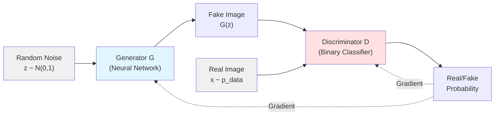

# Chapter 12: Generative Adversarial Networks (GANs)

## 🎯 Learning Objectives
By the end of this chapter, you will be able to:
1. Understand GAN architecture and the adversarial training framework
2. Implement generator and discriminator networks
3. Master GAN training dynamics and loss functions
4. Apply techniques to stabilize GAN training and prevent mode collapse
5. Implement DCGAN, WGAN, and conditional GANs
6. Understand advanced GAN variants (StyleGAN, CycleGAN, Pix2Pix)
7. Deploy GANs for image generation, style transfer, and data augmentation

## 📚 Key Concepts

### 1. GAN Fundamentals

**Generative Adversarial Networks** consist of two neural networks competing in a zero-sum game:



**Two Players**:
1. **Generator (G)**: Creates fake samples from random noise
   - Input: Random noise $z \sim p_z(z)$ (typically $\mathcal{N}(0, I)$)
   - Output: Fake sample $G(z)$
   - Goal: Fool discriminator ($\max \log D(G(z))$)

2. **Discriminator (D)**: Distinguishes real from fake
   - Input: Real sample $x$ or fake sample $G(z)$
   - Output: Probability that input is real $D(x) \in [0, 1]$
   - Goal: Correctly classify real/fake ($\max \log D(x) + \log(1 - D(G(z)))$)

**Minimax Objective**:

$$\min_G \max_D V(D, G) = \mathbb{E}_{x \sim p_{data}}[\log D(x)] + \mathbb{E}_{z \sim p_z}[\log(1 - D(G(z)))]$$

**Training Process**:
1. Train D to maximize classification accuracy
2. Train G to minimize D's accuracy (maximize D's mistakes)
3. Alternate between steps until convergence

### 2. GAN Training Algorithm

**Standard GAN Training Loop**:

```python
for epoch in range(num_epochs):
    for real_batch in dataloader:
        # ============================================
        # Train Discriminator
        # ============================================
        # Sample noise
        noise = torch.randn(batch_size, latent_dim)
        fake_images = generator(noise)

        # Real images
        real_labels = torch.ones(batch_size, 1)
        fake_labels = torch.zeros(batch_size, 1)

        # Discriminator loss
        real_loss = criterion(discriminator(real_images), real_labels)
        fake_loss = criterion(discriminator(fake_images.detach()), fake_labels)
        d_loss = real_loss + fake_loss

        # Update discriminator
        optimizer_D.zero_grad()
        d_loss.backward()
        optimizer_D.step()

        # ============================================
        # Train Generator
        # ============================================
        noise = torch.randn(batch_size, latent_dim)
        fake_images = generator(noise)

        # Generator loss (fool discriminator)
        g_loss = criterion(discriminator(fake_images), real_labels)

        # Update generator
        optimizer_G.zero_grad()
        g_loss.backward()
        optimizer_G.step()
```

**Key Training Principles**:
- Train D more than G initially (k steps of D per 1 step of G)
- Use label smoothing (0.9 instead of 1.0 for real labels)
- Add noise to inputs (optional, for stability)

### 3. DCGAN (Deep Convolutional GAN)

**Architecture Guidelines** (Radford et al., 2015):

1. Replace pooling layers with strided convolutions (D) and fractional-strided convolutions (G)
2. Use batch normalization in both G and D
3. Remove fully connected hidden layers
4. Use ReLU in G (except output: Tanh)
5. Use LeakyReLU in D

**Generator Architecture**:

```python
class DCGANGenerator(nn.Module):
    def __init__(self, latent_dim=100, channels=3):
        super(DCGANGenerator, self).__init__()

        self.model = nn.Sequential(
            # Input: latent_dim x 1 x 1
            nn.ConvTranspose2d(latent_dim, 512, 4, 1, 0, bias=False),
            nn.BatchNorm2d(512),
            nn.ReLU(True),
            # State: 512 x 4 x 4

            nn.ConvTranspose2d(512, 256, 4, 2, 1, bias=False),
            nn.BatchNorm2d(256),
            nn.ReLU(True),
            # State: 256 x 8 x 8

            nn.ConvTranspose2d(256, 128, 4, 2, 1, bias=False),
            nn.BatchNorm2d(128),
            nn.ReLU(True),
            # State: 128 x 16 x 16

            nn.ConvTranspose2d(128, 64, 4, 2, 1, bias=False),
            nn.BatchNorm2d(64),
            nn.ReLU(True),
            # State: 64 x 32 x 32

            nn.ConvTranspose2d(64, channels, 4, 2, 1, bias=False),
            nn.Tanh()
            # Output: channels x 64 x 64
        )

    def forward(self, z):
        z = z.view(z.size(0), z.size(1), 1, 1)
        return self.model(z)
```

**Discriminator Architecture**:

```python
class DCGANDiscriminator(nn.Module):
    def __init__(self, channels=3):
        super(DCGANDiscriminator, self).__init__()

        self.model = nn.Sequential(
            # Input: channels x 64 x 64
            nn.Conv2d(channels, 64, 4, 2, 1, bias=False),
            nn.LeakyReLU(0.2, inplace=True),
            # State: 64 x 32 x 32

            nn.Conv2d(64, 128, 4, 2, 1, bias=False),
            nn.BatchNorm2d(128),
            nn.LeakyReLU(0.2, inplace=True),
            # State: 128 x 16 x 16

            nn.Conv2d(128, 256, 4, 2, 1, bias=False),
            nn.BatchNorm2d(256),
            nn.LeakyReLU(0.2, inplace=True),
            # State: 256 x 8 x 8

            nn.Conv2d(256, 512, 4, 2, 1, bias=False),
            nn.BatchNorm2d(512),
            nn.LeakyReLU(0.2, inplace=True),
            # State: 512 x 4 x 4

            nn.Conv2d(512, 1, 4, 1, 0, bias=False),
            nn.Sigmoid()
            # Output: 1 x 1 x 1
        )

    def forward(self, img):
        validity = self.model(img)
        return validity.view(-1, 1)
```

### 4. Training Challenges and Solutions

**Common Issues**:

1. **Mode Collapse**: G produces limited variety of samples
2. **Non-convergence**: Loss oscillates without stabilizing
3. **Vanishing Gradients**: G stops learning when D is too strong
4. **Training Instability**: Sensitive to hyperparameters

**Solutions**:

**Feature Matching**: Match statistics of real and fake samples
$$\mathcal{L}_G = \|E_{x \sim p_{data}}[f(x)] - E_{z \sim p_z}[f(G(z))]\|_2^2$$

**Minibatch Discrimination**: Let D see multiple samples simultaneously

**Historical Averaging**: Add penalty for rapid parameter changes
$$\mathcal{L}_i = \|\theta_i - \frac{1}{t}\sum_{j=1}^{t}\theta_{i,j}\|^2$$

**Label Smoothing**: Use 0.9 instead of 1.0 for real labels

**Noisy Labels**: Occasionally flip labels (5% of time)

### 5. Wasserstein GAN (WGAN)

**Key Innovation**: Use Wasserstein distance (Earth-Mover distance) instead of JS divergence

**Wasserstein Distance**:
$$W(p_r, p_g) = \inf_{\gamma \sim \Pi(p_r, p_g)} \mathbb{E}_{(x,y) \sim \gamma}[\|x - y\|]$$

**WGAN Objective**:
$$\min_G \max_{D \in \mathcal{D}} \mathbb{E}_{x \sim p_{data}}[D(x)] - \mathbb{E}_{z \sim p_z}[D(G(z))]$$

**Key Differences from Standard GAN**:
- D (now called "critic") outputs unbounded score (no sigmoid)
- No log in loss function
- Enforce Lipschitz constraint: $\|D\|_L \leq K$

**WGAN-GP (Gradient Penalty)**:

Instead of weight clipping, add gradient penalty:

$$\mathcal{L}_D = \mathbb{E}_{\tilde{x}}[D(\tilde{x})] - \mathbb{E}_{x}[D(x)] + \lambda \mathbb{E}_{\hat{x}}[(\|\nabla_{\hat{x}} D(\hat{x})\|_2 - 1)^2]$$

Where $\hat{x} = \epsilon x + (1-\epsilon)\tilde{x}$ (random interpolation)

**Implementation**:

```python
# WGAN-GP Training Loop
for real_images in dataloader:
    # Train Critic
    for _ in range(n_critic):  # Usually 5
        noise = torch.randn(batch_size, latent_dim)
        fake_images = generator(noise)

        # Critic scores
        real_validity = critic(real_images)
        fake_validity = critic(fake_images)

        # Gradient penalty
        alpha = torch.rand(batch_size, 1, 1, 1)
        interpolates = (alpha * real_images + (1 - alpha) * fake_images).requires_grad_(True)
        d_interpolates = critic(interpolates)

        gradients = torch.autograd.grad(
            outputs=d_interpolates,
            inputs=interpolates,
            grad_outputs=torch.ones_like(d_interpolates),
            create_graph=True
        )[0]

        gradient_penalty = ((gradients.norm(2, dim=1) - 1) ** 2).mean()

        # Critic loss
        c_loss = fake_validity.mean() - real_validity.mean() + lambda_gp * gradient_penalty

        optimizer_C.zero_grad()
        c_loss.backward()
        optimizer_C.step()

    # Train Generator
    noise = torch.randn(batch_size, latent_dim)
    fake_images = generator(noise)
    g_loss = -critic(fake_images).mean()

    optimizer_G.zero_grad()
    g_loss.backward()
    optimizer_G.step()
```

### 6. Conditional GAN (cGAN)

**Idea**: Condition generation on additional information (labels, text, images)

**Modified Objective**:
$$\min_G \max_D \mathbb{E}_{x \sim p_{data}}[\log D(x|y)] + \mathbb{E}_{z \sim p_z}[\log(1 - D(G(z|y)))]$$

**Implementation**:

```python
class ConditionalGenerator(nn.Module):
    def __init__(self, latent_dim, num_classes, img_shape):
        super(ConditionalGenerator, self).__init__()

        self.label_emb = nn.Embedding(num_classes, num_classes)

        self.model = nn.Sequential(
            nn.Linear(latent_dim + num_classes, 128),
            nn.LeakyReLU(0.2),
            nn.Linear(128, 256),
            nn.BatchNorm1d(256),
            nn.LeakyReLU(0.2),
            nn.Linear(256, 512),
            nn.BatchNorm1d(512),
            nn.LeakyReLU(0.2),
            nn.Linear(512, int(np.prod(img_shape))),
            nn.Tanh()
        )

    def forward(self, noise, labels):
        # Concatenate noise and label embedding
        gen_input = torch.cat([noise, self.label_emb(labels)], -1)
        img = self.model(gen_input)
        return img.view(img.size(0), *img_shape)

class ConditionalDiscriminator(nn.Module):
    def __init__(self, num_classes, img_shape):
        super(ConditionalDiscriminator, self).__init__()

        self.label_emb = nn.Embedding(num_classes, num_classes)

        self.model = nn.Sequential(
            nn.Linear(num_classes + int(np.prod(img_shape)), 512),
            nn.LeakyReLU(0.2),
            nn.Linear(512, 256),
            nn.LeakyReLU(0.2),
            nn.Linear(256, 1),
            nn.Sigmoid()
        )

    def forward(self, img, labels):
        d_input = torch.cat([img.view(img.size(0), -1), self.label_emb(labels)], -1)
        return self.model(d_input)
```

### 7. Advanced GAN Variants

**CycleGAN** (Unpaired Image-to-Image Translation):
- Two generators: $G: X \to Y$, $F: Y \to X$
- Two discriminators: $D_X$, $D_Y$
- Cycle consistency loss: $\|F(G(x)) - x\| + \|G(F(y)) - y\|$
- Applications: Style transfer, season transfer, photo enhancement

**Pix2Pix** (Paired Image-to-Image Translation):
- Generator: U-Net architecture with skip connections
- Discriminator: PatchGAN (classifies image patches)
- Loss: $\mathcal{L}_{GAN} + \lambda \mathcal{L}_{L1}$ (adversarial + L1 reconstruction)
- Applications: Edges→photo, map→satellite, day→night

**StyleGAN** (High-Quality Image Synthesis):
- Progressive growing (4×4 → 1024×1024)
- Style-based generator (AdaIN for style injection)
- Mapping network: $z \to w$ (disentangled latent space)
- Noise injection at each layer (stochastic variation)

**ProGAN** (Progressive Growing):
- Start with 4×4 images, gradually add layers
- Stabilizes training, faster convergence
- Achieves high resolution (1024×1024)

### 8. Evaluation Metrics

**Inception Score (IS)**:
$$IS = \exp(\mathbb{E}_x[D_{KL}(p(y|x) \| p(y))])$$
- Measures quality and diversity
- Higher is better (typical: 2-10)

**Fréchet Inception Distance (FID)**:
$$FID = \|\mu_r - \mu_g\|^2 + Tr(\Sigma_r + \Sigma_g - 2(\Sigma_r \Sigma_g)^{1/2})$$
- Compares distributions of real and generated images
- Lower is better (typical: 10-100)

**Precision and Recall**:
- Precision: Quality (fake images look real)
- Recall: Diversity (coverage of real distribution)

## 🎤 Interview Questions and Answers

### Q1: Explain the GAN training objective. Why is it called a minimax game?

**Answer**:

GANs frame generation as a **two-player minimax game**:

**Objective**:
$$\min_G \max_D V(D, G) = \mathbb{E}_{x \sim p_{data}}[\log D(x)] + \mathbb{E}_{z \sim p_z}[\log(1 - D(G(z)))]$$

**Two Players**:

1. **Discriminator (D)** maximizes $V(D, G)$:
   - $\log D(x)$: High when correctly identifying real images
   - $\log(1 - D(G(z)))$: High when correctly identifying fakes
   - Goal: Maximize classification accuracy

2. **Generator (G)** minimizes $V(D, G)$:
   - Wants $D(G(z)) \to 1$ (fool discriminator)
   - Minimizes $\log(1 - D(G(z)))$ = Maximizes $\log D(G(z))$
   - Goal: Generate realistic samples

**Why Minimax?**
- D tries to **maximize** objective (be good classifier)
- G tries to **minimize** objective (fool classifier)
- Competing objectives → game theory framework

**Equilibrium**: When $p_g = p_{data}$ (generator matches real distribution), optimal discriminator is $D^*(x) = 1/2$ (can't distinguish real/fake).

**Practical Training**: Alternate between:
1. Fix G, update D to maximize $V(D, G)$
2. Fix D, update G to minimize $V(D, G)$

### Q2: What is mode collapse and how do you detect/prevent it?

**Answer**:

**Mode Collapse**: Generator produces limited variety of outputs, ignoring diversity of training data.

**Types**:
1. **Complete collapse**: G produces single output regardless of $z$
2. **Partial collapse**: G produces few modes (e.g., only 3 of 10 MNIST digits)

**Detection**:

1. **Visual Inspection**: Generated samples lack diversity
2. **Low Birthday Paradox Test**: Duplicate samples appear frequently
3. **Inception Score Drop**: IS decreases over training
4. **High FID**: Distribution mismatch increases

**Why It Happens**:

- G finds single sample that fools D
- D updates to reject that sample
- G shifts to different single sample
- Cycle continues without covering full distribution

**Prevention Techniques**:

**1. Minibatch Discrimination**:
```python
def minibatch_std(x):
    """Append minibatch std to each sample"""
    batch_stats = torch.std(x, dim=0, keepdim=True)
    batch_stats = batch_stats.expand(x.size(0), -1, -1, -1)
    return torch.cat([x, batch_stats], dim=1)
```

**2. Feature Matching**:
```python
# Instead of maximizing D(G(z)), match feature statistics
real_features = discriminator.extract_features(real_images)
fake_features = discriminator.extract_features(fake_images)
g_loss = F.mse_loss(fake_features.mean(0), real_features.mean(0))
```

**3. Unrolled GAN**: Update G considering k future steps of D

**4. Wasserstein GAN**: More stable gradient signal

**5. Multiple GANs**: Train ensemble, sample from different generators

**6. Experience Replay**: Train D on historical generated samples

### Q3: Why does WGAN use Wasserstein distance instead of JS divergence? What are the practical benefits?

**Answer**:

**Problem with JS Divergence** (used in vanilla GAN):

When distributions don't overlap:
$$JS(p_r \| p_g) = \log 2$$
Gradient: $\nabla_\theta JS(p_r \| p_g) = 0$

**Example**: Real data on manifold $M_r$, fake data on $M_g$
- If $M_r \cap M_g = \emptyset$ (common in high dimensions)
- $JS(p_r \| p_g)$ is constant → no gradient for G

**Wasserstein Distance** (Earth-Mover):
$$W(p_r, p_g) = \inf_{\gamma \sim \Pi(p_r, p_g)} \mathbb{E}_{(x,y) \sim \gamma}[\|x - y\|]$$

**Benefits**:

**1. Continuous and Differentiable**:
- Provides gradient even when distributions don't overlap
- $W(p_r, p_g)$ decreases smoothly as $p_g \to p_r$

**2. Meaningful Loss**:
- Correlates with sample quality
- Can be used for early stopping
- Lower W = better generation

**3. Training Stability**:
- Less sensitive to architecture choices
- No mode collapse in early training
- Can train critic to optimality

**Practical Implementation**:

```python
# Standard GAN: Binary cross-entropy
d_loss = -torch.mean(torch.log(D(real)) + torch.log(1 - D(fake)))

# WGAN: Wasserstein loss
critic_loss = -torch.mean(critic(real)) + torch.mean(critic(fake))

# WGAN-GP: Add gradient penalty
gradient_penalty = compute_gradient_penalty(critic, real, fake)
critic_loss = critic_loss + lambda_gp * gradient_penalty
```

**Lipschitz Constraint**:
- WGAN requires $\|D\|_L \leq K$ (Lipschitz continuity)
- Original: Weight clipping (clamp weights to [-0.01, 0.01])
- WGAN-GP: Gradient penalty (better performance)

### Q4: How does conditional GAN (cGAN) work? Provide use cases.

**Answer**:

**cGAN** extends GAN to **conditional generation** by providing additional information $y$.

**Modified Objective**:
$$\min_G \max_D \mathbb{E}_{x,y}[\log D(x|y)] + \mathbb{E}_{z,y}[\log(1 - D(G(z|y)))]$$

**Both G and D receive condition $y$**:
- $G(z, y)$: Generate sample given noise $z$ and condition $y$
- $D(x, y)$: Discriminate real/fake given sample $x$ and condition $y$

**Implementation Methods**:

**1. Concatenation** (simple):
```python
# Generator
gen_input = torch.cat([noise, label_embedding], dim=1)
fake_image = generator(gen_input)

# Discriminator
disc_input = torch.cat([image, label_embedding], dim=1)
validity = discriminator(disc_input)
```

**2. Conditional Batch Normalization**:
```python
class ConditionalBatchNorm(nn.Module):
    def __init__(self, num_features, num_classes):
        super().__init__()
        self.bn = nn.BatchNorm2d(num_features, affine=False)
        self.gamma_embed = nn.Embedding(num_classes, num_features)
        self.beta_embed = nn.Embedding(num_classes, num_features)

    def forward(self, x, y):
        out = self.bn(x)
        gamma = self.gamma_embed(y).unsqueeze(-1).unsqueeze(-1)
        beta = self.beta_embed(y).unsqueeze(-1).unsqueeze(-1)
        return gamma * out + beta
```

**Use Cases**:

1. **Class-Conditional Image Generation**:
   - MNIST: Generate specific digit (0-9)
   - ImageNet: Generate "dog", "cat", etc.

2. **Text-to-Image**:
   - Condition: Text description
   - Output: Corresponding image
   - Example: StackGAN, AttnGAN

3. **Image-to-Image Translation**:
   - Pix2Pix: Edges → Photo, Map → Satellite
   - Condition: Input image
   - Output: Transformed image

4. **Super-Resolution**:
   - Condition: Low-resolution image
   - Output: High-resolution image

5. **Semantic Segmentation to Photo**:
   - Condition: Segmentation map
   - Output: Realistic image

### Q5: Explain DCGAN architecture guidelines. Why are they important?

**Answer**:

**DCGAN Guidelines** (Radford et al., 2015) stabilize GAN training:

**1. Replace Pooling with Strided Convolutions**:
```python
# Bad: Pooling loses information
x = nn.MaxPool2d(2)(x)

# Good: Learnable downsampling
x = nn.Conv2d(in_ch, out_ch, kernel_size=4, stride=2, padding=1)(x)
```

**Why**: Pooling is fixed; strided conv is learnable (better gradients).

**2. Use Batch Normalization**:
```python
# In both G and D
x = nn.Conv2d(...)(x)
x = nn.BatchNorm2d(...)(x)
x = nn.ReLU()(x)
```

**Why**: Stabilizes training, prevents mode collapse, allows higher learning rates.

**Exception**: Don't use BN in G's output layer or D's input layer.

**3. Remove Fully Connected Layers**:
```python
# Bad: FC layers
x = x.view(batch_size, -1)
x = nn.Linear(7*7*512, latent_dim)(x)

# Good: Global pooling or direct convolutions
x = nn.AdaptiveAvgPool2d(1)(x)  # Or convolutions all the way
```

**Why**: Reduce parameters, better spatial preservation, less overfitting.

**4. Use ReLU in Generator (Tanh at Output)**:
```python
# Hidden layers
x = nn.ReLU()(x)

# Output layer
x = nn.Tanh()(x)  # Output range [-1, 1]
```

**Why**: ReLU for sparsity; Tanh bounds output (matches normalized images).

**5. Use LeakyReLU in Discriminator**:
```python
x = nn.LeakyReLU(0.2)(x)
```

**Why**: LeakyReLU allows small negative gradients, improving gradient flow.

**Impact**:
- Pre-DCGAN: Unstable training, mode collapse common
- Post-DCGAN: Stable training baseline, foundation for advanced GANs

### Q6: How do you evaluate GAN quality? Compare IS and FID metrics.

**Answer**:

**Evaluation Challenges**:
- No ground truth for generated images
- Need to measure both quality and diversity

**Inception Score (IS)**:

$$IS = \exp\left(\mathbb{E}_x[D_{KL}(p(y|x) \| p(y))]\right)$$

Where:
- $p(y|x)$: Conditional class distribution (from Inception network)
- $p(y) = \int p(y|x)p(x)dx$: Marginal class distribution

**Interpretation**:
- High $p(y|x)$: Images are recognizable (quality)
- High $H(p(y))$: Diverse classes generated (diversity)

**Range**: 1 (worst) to ~10 (excellent for ImageNet)

**Code**:
```python
def inception_score(images, splits=10):
    preds = inception_model(images)
    split_scores = []

    for k in range(splits):
        part = preds[k * (N // splits): (k+1) * (N // splits), :]
        py = np.mean(part, axis=0)
        scores = []
        for i in range(part.shape[0]):
            pyx = part[i, :]
            scores.append(entropy(pyx, py))
        split_scores.append(np.exp(np.mean(scores)))

    return np.mean(split_scores), np.std(split_scores)
```

**Fréchet Inception Distance (FID)**:

$$FID = \|\mu_r - \mu_g\|^2 + Tr(\Sigma_r + \Sigma_g - 2(\Sigma_r \Sigma_g)^{1/2})$$

Where:
- $\mu_r, \Sigma_r$: Mean and covariance of real image features
- $\mu_g, \Sigma_g$: Mean and covariance of generated image features
- Features from Inception network (pool3 layer)

**Range**: 0 (identical distributions) to ∞ (different)

**Code**:
```python
def calculate_fid(real_images, fake_images):
    # Extract features
    real_features = inception_model.extract_features(real_images)
    fake_features = inception_model.extract_features(fake_images)

    # Calculate statistics
    mu_real, sigma_real = real_features.mean(axis=0), np.cov(real_features, rowvar=False)
    mu_fake, sigma_fake = fake_features.mean(axis=0), np.cov(fake_features, rowvar=False)

    # FID formula
    diff = mu_real - mu_fake
    covmean = sqrtm(sigma_real.dot(sigma_fake))

    if np.iscomplexobj(covmean):
        covmean = covmean.real

    fid = diff.dot(diff) + np.trace(sigma_real + sigma_fake - 2*covmean)
    return fid
```

**Comparison**:

| Metric | Measures | Pros | Cons |
|--------|----------|------|------|
| **IS** | Quality + Diversity | Simple, single number | Biased to ImageNet classes, ignores intra-class diversity |
| **FID** | Distribution distance | Robust, detects mode collapse | Needs many samples (>10k), computationally expensive |

**Best Practice**: Use **FID** (more reliable) + visual inspection.

### Q7: What techniques stabilize GAN training?

**Answer**:

**1. Architecture Choices**:
```python
# Use spectral normalization
class SpectralNorm(nn.Module):
    def __init__(self, module):
        super().__init__()
        self.module = spectral_norm(module)

# Use self-attention (SAGAN)
class SelfAttention(nn.Module):
    def __init__(self, in_dim):
        super().__init__()
        self.query = nn.Conv2d(in_dim, in_dim // 8, 1)
        self.key = nn.Conv2d(in_dim, in_dim // 8, 1)
        self.value = nn.Conv2d(in_dim, in_dim, 1)
        self.gamma = nn.Parameter(torch.zeros(1))

    def forward(self, x):
        batch, C, H, W = x.size()
        q = self.query(x).view(batch, -1, H * W).permute(0, 2, 1)
        k = self.key(x).view(batch, -1, H * W)
        v = self.value(x).view(batch, -1, H * W)

        attention = F.softmax(torch.bmm(q, k), dim=-1)
        out = torch.bmm(v, attention.permute(0, 2, 1))
        out = out.view(batch, C, H, W)

        return self.gamma * out + x
```

**2. Training Tricks**:

```python
# Label smoothing
real_labels = torch.ones(batch_size, 1) * 0.9  # Not 1.0
fake_labels = torch.zeros(batch_size, 1) + 0.1  # Not 0.0

# Noisy labels (occasional flip)
if random.random() < 0.05:
    real_labels, fake_labels = fake_labels, real_labels

# Add noise to inputs (anneal over time)
noisy_real = real_images + noise_factor * torch.randn_like(real_images)
noise_factor *= 0.995  # Decay
```

**3. Loss Functions**:

```python
# Non-saturating loss for G
g_loss = -torch.log(discriminator(fake_images)).mean()

# Hinge loss
d_loss_real = torch.relu(1 - discriminator(real_images)).mean()
d_loss_fake = torch.relu(1 + discriminator(fake_images)).mean()
d_loss = d_loss_real + d_loss_fake

# R1 regularization (gradient penalty on real data)
real_images.requires_grad = True
real_validity = discriminator(real_images)
r1_penalty = torch.autograd.grad(
    outputs=real_validity.sum(),
    inputs=real_images,
    create_graph=True
)[0].pow(2).view(batch_size, -1).sum(1).mean()
d_loss += 10 * r1_penalty
```

**4. Optimizer Settings**:

```python
# Two Time-Scale Update Rule (TTUR)
lr_g = 0.0001
lr_d = 0.0004  # D learns faster

# Adam with specific betas
optimizer_G = torch.optim.Adam(generator.parameters(), lr=lr_g, betas=(0.0, 0.9))
optimizer_D = torch.optim.Adam(discriminator.parameters(), lr=lr_d, betas=(0.0, 0.9))
```

**5. Training Schedule**:
- Train D more frequently early (5:1 ratio)
- Gradually reduce to 1:1
- Monitor D and G losses (should be relatively balanced)

### Q8: Compare CycleGAN and Pix2Pix for image-to-image translation.

**Answer**:

| Aspect | Pix2Pix | CycleGAN |
|--------|---------|----------|
| **Data** | Paired (input-output pairs) | Unpaired (two domains) |
| **Mapping** | One-way $X \to Y$ | Bidirectional $X \leftrightarrow Y$ |
| **Loss** | cGAN + L1 reconstruction | cGAN + cycle consistency |
| **Use Case** | Edges→photo, map→satellite | Style transfer, season change |

**Pix2Pix**:

**Architecture**:
- Generator: U-Net (encoder-decoder with skip connections)
- Discriminator: PatchGAN (classifies N×N patches)

**Loss**:
$$\mathcal{L} = \mathcal{L}_{cGAN}(G, D) + \lambda \mathcal{L}_{L1}(G)$$

Where L1: $\mathbb{E}_{x,y}[\|y - G(x)\|_1]$

**Training**: Requires paired data (hard to obtain)

**CycleGAN**:

**Architecture**:
- Two generators: $G: X \to Y$, $F: Y \to X$
- Two discriminators: $D_X$, $D_Y$

**Cycle Consistency Loss**:
$$\mathcal{L}_{cyc} = \mathbb{E}_x[\|F(G(x)) - x\|_1] + \mathbb{E}_y[\|G(F(y)) - y\|_1]$$

**Total Loss**:
$$\mathcal{L} = \mathcal{L}_{GAN}(G, D_Y) + \mathcal{L}_{GAN}(F, D_X) + \lambda \mathcal{L}_{cyc}$$

**Training**: Unpaired data (much easier to obtain)

**When to Use**:
- **Pix2Pix**: Have paired data, need precise mapping
- **CycleGAN**: No paired data, semantic-level translation

## 🔑 Key Takeaways

1. **GAN Framework**: Two-player minimax game with generator creating samples and discriminator distinguishing real from fake
2. **Training Objective**: $\min_G \max_D \mathbb{E}[\log D(x)] + \mathbb{E}[\log(1 - D(G(z)))]$
3. **DCGAN Guidelines**: Strided convs, batch normalization, no FC layers, ReLU in G, LeakyReLU in D
4. **Mode Collapse**: Generator produces limited variety; prevent with minibatch discrimination, feature matching, WGAN
5. **WGAN**: Uses Wasserstein distance for stable training; requires Lipschitz constraint via gradient penalty
6. **Conditional GAN**: Generate samples conditioned on labels/images by providing condition to both G and D
7. **Evaluation**: Use FID (distribution distance) and IS (quality + diversity); visual inspection is critical
8. **Training Stability**: Label smoothing, spectral normalization, two-timescale updates, balanced D/G training
9. **Advanced Variants**: CycleGAN (unpaired), Pix2Pix (paired), StyleGAN (high quality), ProGAN (progressive)
10. **Applications**: Image generation, style transfer, data augmentation, super-resolution, image-to-image translation

## ⚠️ Common Mistakes to Avoid

1. **Training G and D with same learning rate**: Use two-timescale update (TTUR); D should learn faster initially
2. **Not monitoring both losses**: D loss → 0 means D is too strong (G can't learn); G loss → ∞ means mode collapse
3. **Using BatchNorm everywhere**: Don't use BN in G's output layer or D's input layer; causes artifacts
4. **Wrong activation functions**: Must use Tanh in G's output (range [-1, 1]) and normalize real images to [-1, 1]
5. **Training D to optimality**: Over-trained D causes vanishing gradients for G; balance is critical
6. **Ignoring mode collapse**: Detect early with diversity metrics; don't wait for complete collapse
7. **Small batch size**: GANs need larger batches (≥32) for stable BatchNorm statistics and minibatch discrimination
8. **Not using gradient penalty in WGAN**: Weight clipping is inferior; always use WGAN-GP
9. **Evaluating only with loss**: GAN loss doesn't correlate with quality; use FID/IS and visual inspection
10. **Forgetting cycle consistency weight**: In CycleGAN, typical $\lambda = 10$; too low causes semantic changes

## 📝 Quick Revision Points

### GAN Variants Comparison

| Variant | Key Feature | Loss Function | Stability | Use Case |
|---------|-------------|---------------|-----------|----------|
| **Vanilla GAN** | Original | JS divergence | Low | Baseline |
| **DCGAN** | Conv architecture | JS divergence | Medium | Image generation |
| **WGAN** | Wasserstein distance | EM distance | High | Stable training |
| **WGAN-GP** | Gradient penalty | EM + GP | Very high | Production |
| **cGAN** | Conditional | JS + condition | Medium | Class-specific generation |
| **CycleGAN** | Cycle consistency | GAN + cycle | Medium | Unpaired translation |
| **StyleGAN** | Style injection | Progressive + AdaIN | High | High-quality faces |

### Training Checklist

```python
# 1. Architecture
✓ DCGAN guidelines (strided conv, BN, ReLU/LeakyReLU)
✓ Spectral normalization in D
✓ No BN in G output / D input

# 2. Loss
✓ Non-saturating G loss: -log(D(G(z)))
✓ Optional: R1 penalty, gradient penalty

# 3. Optimization
✓ Adam with β1=0.0, β2=0.9
✓ Learning rates: lr_D = 4 * lr_G
✓ Batch size ≥ 32

# 4. Data
✓ Normalize images to [-1, 1]
✓ Use Tanh in G output
✓ Data augmentation

# 5. Training
✓ Label smoothing (0.9 for real)
✓ Train D more initially (5:1)
✓ Monitor FID every N iterations

# 6. Debugging
✓ Visualize samples every epoch
✓ Check gradient norms
✓ Watch for mode collapse
```

### Key Formulas

**Vanilla GAN**:
$$\min_G \max_D V = \mathbb{E}_{x}[\log D(x)] + \mathbb{E}_{z}[\log(1 - D(G(z)))]$$

**Wasserstein Distance**:
$$W(p_r, p_g) = \inf_{\gamma} \mathbb{E}_{(x,y) \sim \gamma}[\|x - y\|]$$

**WGAN-GP**:
$$\mathcal{L}_D = \mathbb{E}[D(\tilde{x})] - \mathbb{E}[D(x)] + \lambda \mathbb{E}[(\|\nabla_{\hat{x}} D(\hat{x})\|_2 - 1)^2]$$

**Cycle Consistency**:
$$\mathcal{L}_{cyc} = \mathbb{E}[\|F(G(x)) - x\|_1] + \mathbb{E}[\|G(F(y)) - y\|_1]$$

**FID**:
$$FID = \|\mu_r - \mu_g\|^2 + Tr(\Sigma_r + \Sigma_g - 2(\Sigma_r \Sigma_g)^{1/2})$$

---

**Next Chapter Preview**: Chapter 13 will cover Transformers and Attention Mechanisms - self-attention, multi-head attention, and transformer architecture.
