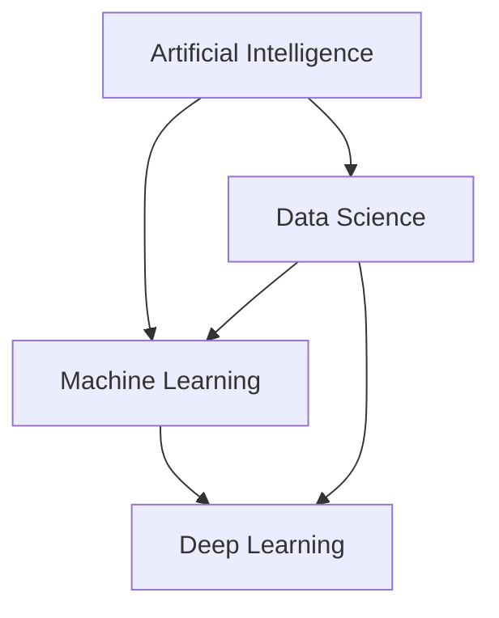
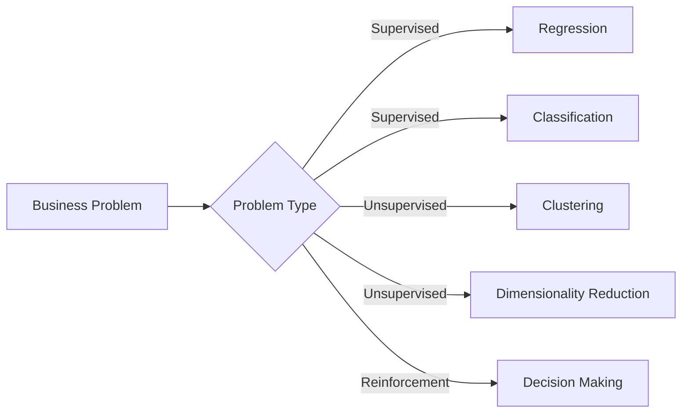

# Chapter 1: Machine Learning Introduction

## 🎯 Learning Objectives
- Understand the relationship between AI, ML, DL, and Data Science
- Learn the purpose of ML in interviews and real-world applications
- Identify different types of ML problems

## 📚 Key Concepts

### 1.1 AI vs ML vs Deep Learning vs Data Science

**Artificial Intelligence (AI)**
- **Definition**: Creating applications that can perform tasks without human intervention
- **Goal**: Make decisions and perform tasks automatically
- **Real-world Examples**:
  - Netflix recommendation system (understands viewing behavior)
  - Amazon product recommendations
  - YouTube ad recommendations
  - Tesla self-driving cars

**Machine Learning (ML)**
- **Definition**: Subset of AI that provides statistical tools to analyze, visualize data and make predictions
- **Core Components**: Statistics, algorithms, data analysis
- **Key Purpose**: Learn patterns from data to make predictions

**Deep Learning (DL)**
- **Definition**: Subset of ML that mimics human brain using multi-layered neural networks
- **Origin**: 1950s-60s scientists wanted machines to learn like humans
- **Strength**: Solves complex use cases that traditional ML can't handle

**Data Science**
- **Definition**: Field that combines all technologies to solve business problems
- **Scope**: Data analysis, visualization, ML, DL, business understanding
- **Goal**: Create AI applications to solve real business problems

### 1.2 ML Learning Pathway

## 🚀 Interview Focus

**Why ML knowledge is crucial for interviews:**
- Candidates who understand algorithms well explain them better to recruiters
- Proper algorithm understanding leads to better hiring chances
- Focus on practical implementation, not just theory

## 💡 Key Takeaways

1. **AI is the broadest field** - encompasses all intelligent applications
2. **ML is a subset of AI** - focuses on statistical learning from data
3. **DL is a subset of ML** - uses neural networks to mimic human brain
4. **Data Science integrates everything** - combines all approaches for business solutions

## ❓ Interview Questions & Answers

### Q1: What's the difference between AI, ML, and Deep Learning?
**Answer**:
- **AI**: Creating applications that work without human intervention (Netflix recommendations, self-driving cars)
- **ML**: Subset of AI using statistical tools to learn from data and make predictions
- **DL**: Subset of ML using multi-layer neural networks to mimic human brain, solves complex problems

### Q2: Is Data Science the same as Machine Learning?
**Answer**: No. Data Science is broader - it includes ML, DL, data analysis, visualization, and business understanding. A data scientist might use Power BI for visualization one day, work on ML projects the next, and handle DL projects later.

### Q3: Why do we need Deep Learning when we have Machine Learning?
**Answer**: Deep learning can solve complex problems that traditional ML struggles with, like image recognition, natural language processing, and complex pattern recognition. It mimics the human brain's structure using multi-layered neural networks.

### Q4: What's a real-world AI application you use daily?
**Answer**: Netflix/YouTube recommendations - the system learns your viewing behavior and suggests content automatically without asking you anything, making decisions based on patterns it has learned.

### Q5: Can you work in AI without knowing Machine Learning?
**Answer**: No, because most AI applications are built using ML algorithms. Whether you're an ML engineer, deep learning developer, or data scientist, you're ultimately creating AI applications using ML/DL techniques.

## 🔍 Common Misconceptions

**Misconception 1**: "AI and ML are the same thing"
- **Reality**: ML is a subset of AI. AI includes any intelligent application, while ML specifically focuses on learning from data.

**Misconception 2**: "Data scientists only do machine learning"
- **Reality**: Data scientists do everything - data analysis, visualization, ML, DL, and business problem-solving.

**Misconception 3**: "Deep learning is replacing machine learning"
- **Reality**: DL is used for complex problems. Many business problems are still better solved with traditional ML algorithms.

## 🎯 Real-world Applications Table

| Domain | AI Application | ML Technique Used |
|--------|----------------|-------------------|
| Entertainment | Netflix Recommendations | Collaborative Filtering |
| E-commerce | Amazon Product Suggestions | Association Rules |
| Automotive | Tesla Self-Driving | Computer Vision, DL |
| Social Media | YouTube Ad Recommendations | Behavioral Analysis |
| Healthcare | Disease Diagnosis | Classification Algorithms |

## 📝 Quick Revision Points

- **AI**: Human intelligence simulation in machines
- **ML**: Learning from data to make predictions
- **DL**: Multi-layer neural networks mimicking brain
- **Data Science**: Integration of all for business solutions
- **Interview Focus**: Algorithm understanding + practical implementation