# Chapter 2: Regression and Classification

## 🎯 Learning Objectives
- Distinguish between independent and dependent features
- Understand regression vs classification problems
- Learn supervised vs unsupervised learning
- Identify when to use clustering and dimensionality reduction

## 📚 Key Concepts

### 2.1 Independent vs Dependent Features


**Independent Features (Input Variables)**
- **Definition**: Features used to train the model
- **Examples**: Age, Study Hours, Experience, Play Hours
- **Can be**: Any number of features
- **Also called**: Input variables, predictors, X variables

**Dependent Feature (Output Variable)**
- **Definition**: What we want to predict
- **Characteristics**: Completely dependent on input values
- **Examples**: Weight, Salary, Pass/Fail
- **Also called**: Target variable, Y variable, output

### 2.2 Regression Problems

**Definition**: Predicting continuous numerical values

**Key Characteristics**:
- Output is a continuous variable
- Example: Predicting weight based on age
- Data points: Age (24) → Weight (62), Age (25) → Weight (63)

```mermaid
graph TD
    A[Input: Age] --> B[Linear Regression Model]
    B --> C[Output: Weight<br/>(Continuous Value)]
    D[Age: 24] --> B
    E[Age: 25] --> B
    B --> F[Weight: 62.5]
    B --> G[Weight: 63.2]
```

**Real-world Examples**:
- House price prediction
- Stock price forecasting
- Temperature prediction
- Sales prediction

### 2.3 Classification Problems

**Definition**: Predicting categorical values or classes

**Key Characteristics**:
- Output has fixed number of categories
- Two main types:
  - **Binary Classification**: 2 categories (Pass/Fail, Yes/No)
  - **Multiclass Classification**: More than 2 categories (A/B/C/D, Cat/Dog/Bird)

```mermaid
graph TD
    A[Input Features<br/>Study Hours, Play Hours, Sleep Hours] --> B[Classification Model]
    B --> C[Output: Pass/Fail<br/>(Categorical)]

    D[Study: 8h<br/>Play: 2h<br/>Sleep: 8h] --> B
    E[Study: 2h<br/>Play: 6h<br/>Sleep: 6h] --> B

    B --> F[Result: PASS]
    B --> G[Result: FAIL]
```

**Real-world Examples**:
- Email spam detection
- Disease diagnosis
- Customer churn prediction
- Image classification

### 2.4 Supervised vs Unsupervised Learning

```mermaid
graph TD
    A[Machine Learning] --> B[Supervised Learning]
    A --> C[Unsupervised Learning]

    B --> D[Regression]
    B --> E[Classification]

    C --> F[Clustering]
    C --> G[Dimensionality Reduction]

    H[Data with Labels<br/>Age → Weight] --> D
    I[Data with Labels<br/>Features → Pass/Fail] --> E

    J[Data without Labels<br/>Salary, Age] --> F
    K[Data with Many Features<br/>1000+ Features] --> G
```



**Supervised Learning**
- **Definition**: Learning from labeled data (input-output pairs)
- **Types**: Regression, Classification
- **Requirements**: Both independent and dependent features
- **Goal**: Learn mapping function from input to output

**Unsupervised Learning**
- **Definition**: Learning from unlabeled data
- **Types**: Clustering, Dimensionality Reduction
- **Requirements**: Only independent features (no labels)
- **Goal**: Find patterns and structure in data

### 2.5 Clustering

**Definition**: Grouping similar data points together

**Example: Customer Segmentation**
- **Data**: Salary and Age (no output labels)
- **Goal**: Group customers with similar characteristics
- **Business Use**: Target specific marketing campaigns


**Key Points**:
- **No output feature/dependent variable**
- **Grouping algorithm**, not classification
- **Business Application**: Ad targeting, customer segmentation

### 2.6 Dimensionality Reduction

**Definition**: Reducing number of features while preserving important information

**Example**: Converting 1000 features to 100 features
- **Algorithms**: PCA (Principal Component Analysis), LDA
- **Purpose**: Simplify data, reduce computational complexity
- **Use Cases**: Image processing, text analysis

## 🔍 Algorithm Roadmap

### Supervised Learning Algorithms (in order):
1. Linear Regression
2. Ridge and Lasso Regression
3. Logistic Regression
4. Decision Trees (Classification & Regression)
5. AdaBoost
6. Random Forest
7. Gradient Boosting
8. XGBoost
9. Naive Bayes
10. SVM (Support Vector Machines)
11. KNN (K-Nearest Neighbors)

### Unsupervised Learning Algorithms:
1. K-Means Clustering
2. DBSCAN Clustering
3. Hierarchical Clustering
4. KNN Clustering
5. PCA (Principal Component Analysis)
6. LDA (Linear Discriminant Analysis)

## ❓ Interview Questions & Answers

### Q1: How do you decide whether to use regression or classification for a problem?
**Answer**: Look at your target variable:
- **Regression**: If output is continuous (price, temperature, weight, salary)
- **Classification**: If output is categorical (pass/fail, spam/not spam, dog/cat/bird)

### Q2: What's the difference between clustering and classification?
**Answer**:
- **Classification**: Supervised learning with labeled data, predicts predefined categories
- **Clustering**: Unsupervised learning without labels, discovers natural groups in data
- **Example**: Classification → Predict if email is spam (using labeled data), Clustering → Group similar customers (no labels)

### Q3: Can you have multiple dependent features in supervised learning?
**Answer**: Traditional supervised learning problems usually have one dependent feature (what you're predicting). However, you can have multiple independent features (inputs). If you need to predict multiple outputs, that's called multi-output learning.

### Q4: Why would you use dimensionality reduction?
**Answer**:
- Reduce computational complexity
- Remove redundant features
- Handle multicollinearity
- Improve model performance
- Visualize high-dimensional data

### Q5: A dataset has 1000 features but only 100 samples. What approach would you take?
**Answer**: Use dimensionality reduction (PCA) to reduce features before modeling. This is a "curse of dimensionality" problem where you have more features than samples, which can lead to overfitting.

### Q6: Is customer segmentation a classification or clustering problem?
**Answer**: Clustering problem. You're grouping customers based on their behavior/demographics without predefined labels. The groups emerge from the data itself.

## 💡 Key Takeaways

1. **Dependent Feature**: What you want to predict (output)
2. **Independent Features**: What you use to predict (inputs)
3. **Regression**: Continuous output prediction
4. **Classification**: Categorical output prediction
5. **Supervised**: Needs labeled data (input-output pairs)
6. **Unsupervised**: Works with unlabeled data
7. **Clustering**: Grouping similar items, not classification
8. **Dimensionality Reduction**: Feature reduction without losing information

## 🚨 Common Mistakes

**Mistake 1**: Treating clustering as classification
- **Reality**: Clustering has no predefined classes, groups emerge from data

**Mistake 2**: Using regression for categorical outcomes
- **Reality**: Use classification for categorical, regression for continuous

**Mistake 3**: Not checking if output is continuous or categorical
- **Reality**: This fundamental check determines your entire approach

## 📝 Quick Revision Points

- **Supervised**: Input → Output mapping, needs labels
- **Unsupervised**: Find patterns, no labels needed
- **Regression**: Predict numbers (price, weight, temperature)
- **Classification**: Predict categories (spam/not spam, pass/fail)
- **Clustering**: Group similar items together
- **Dimensionality Reduction**: Reduce number of features