# Chapter 3: Linear Regression Algorithm

## 🎯 Learning Objectives
- Understand the mathematical foundation of linear regression
- Learn hypothesis function and cost function
- Master gradient descent optimization
- Understand R-squared and adjusted R-squared metrics

## 📚 Key Concepts

### 3.1 What is Linear Regression?

**Definition**: Finding the best fit line through data points to predict continuous values

**Core Idea**: Y is a linear function of X


### 3.2 Hypothesis Function

The equation of the best fit line can be written in multiple notations:

- **Traditional**: $$y = mx + c$$
- **Statistical**: $$y = \beta_0 + \beta_1 x$$
- **Machine Learning**: $$h_\theta(x) = \theta_0 + \theta_1 x$$

**Parameters**:
- **$\theta_0$ (Intercept)**: Value when X = 0 (where line meets Y-axis)
- **$\theta_1$ (Slope/Coefficient)**: Change in Y for 1 unit change in X

```mermaid
flowchart LR
    A["Input: Age"] --> B["Hypothesis Function<br/>h(x) = θ₀ + θ₁x"]
    B --> C["Output: Predicted Weight"]

    D["θ₀: Intercept"] --> B
    E["θ₁: Slope"] --> B
```



### 3.3 Cost Function (Mean Squared Error)

**Purpose**: Measure how well the model fits the data

**Formula**:
$$J(\theta_0, \theta_1) = \frac{1}{2m} \sum_{i=1}^{m} [h(x_i) - y_i]^2$$

**Components**:
- **m**: Number of data points
- **$h(x_i)$**: Predicted value
- **$y_i$**: Actual value
- **$\frac{1}{2m}$**: Average + simplifies derivation

**Why Square?**
- Removes negative values
- Penalizes larger errors more
- Simplifies differentiation

### 3.4 Gradient Descent Optimization

**Goal**: Find the values of θ₀ and θ₁ that minimize the cost function

```mermaid
flowchart TD
    A["Initialize θ₀, θ₁"] --> B["Calculate Cost"]
    B --> C["Update Parameters"]
    C --> D{"Converged?"}
    D -->|No| B
    D -->|Yes| E["Optimal Parameters"]

    F["Learning Rate α"] --> C
```



**Update Rules**:
$$\theta_0 = \theta_0 - \alpha \cdot \frac{1}{m} \sum_{i=1}^{m} [h(x_i) - y_i]$$
$$\theta_1 = \theta_1 - \alpha \cdot \frac{1}{m} \sum_{i=1}^{m} [h(x_i) - y_i] \cdot x_i$$

**Learning Rate ($\alpha$)**:
- **Small $\alpha$**: Takes tiny steps, slow convergence
- **Large $\alpha$**: May overshoot, never converge
- **Typical values**: 0.01, 0.1, 0.001

**Gradient Descent Visualization**:

```mermaid
flowchart TD
    A["Cost Function<br/>J(θ₀, θ₁)"] --> B["Bowl Shape"]
    B --> C["Global Minimum"]

    D["High Cost"] --> E["Medium Cost"] --> F["Low Cost"]

    G["Start Point"] --> H["Move Downhill"] --> I["Reach Minimum"]
```



### 3.5 Mathematical Example

**Dataset**: (1,1), (2,2), (3,3)

**When θ₁ = 1, θ₀ = 0**:
- h(1) = 1, h(2) = 2, h(3) = 3
- J(θ₁) = 0 (perfect fit)

**When θ₁ = 0.5, θ₀ = 0**:
- h(1) = 0.5, h(2) = 1, h(3) = 1.5
- J(θ₁) ≈ 0.58

**Cost Function Graph**:
- θ₁ = 1 → J = 0 (Global Minimum)
- θ₁ = 0.5 → J = 0.58
- θ₁ = 0 → J = 2.3

### 3.6 Model Evaluation Metrics

#### R-Squared (R²)

**Formula**:
$$R^2 = 1 - \frac{SSR}{SST}$$

Where:
- **SSR** = $\sum_{i=1}^{n} (y_i - \hat{y}_i)^2$ (Sum of Squared Residuals)
- **SST** = $\sum_{i=1}^{n} (y_i - \bar{y})^2$ (Total Sum of Squares)

**Interpretation**:
- **$R^2 = 1$**: Perfect fit
- **$R^2 = 0$**: Model is as good as predicting mean
- **$R^2 < 0$**: Model is worse than predicting mean

**Key Point**: SSR should be less than SST for good models

#### Adjusted R-Squared

**Problem with R²**: Always increases with more features, even useless ones

**Formula**:
$$\text{Adjusted } R^2 = 1 - \frac{(1 - R^2) \cdot (n - 1)}{n - p - 1}$$

Where:
- **n**: Number of samples
- **p**: Number of features

**Advantage**: Penalyzes adding useless features

**Example**:
- 2 features: $R^2 = 90\%$, Adjusted $R^2 = 86\%$
- 3 features (with useless feature): $R^2 = 91\%$, Adjusted $R^2 = 82\%$

#### 🎯 Keynote: R² vs Adjusted R² Behavior with Features

**Why R² Always Increases with More Features**:
$$R^2 = 1 - \frac{\text{Unexplained Variance}}{\text{Total Variance}}$$

- **Mathematical Reason**: Adding any feature (even random noise) will always reduce unexplained variance or keep it the same
- **Never Decreases**: $R^2_{new} \geq R^2_{old}$ always holds true
- **Problem**: Cannot distinguish between useful and useless features

**Four Possible Scenarios**:

| Scenario | R² Trend | Adjusted R² Trend | Interpretation |
|----------|----------|-------------------|----------------|
| **🟢 Good** | ↑ | ↑ | **Adding useful features** - Both metrics improve |
| **🟡 Warning** | ↑ | → | **Adding neutral features** - Features add no real value |
| **🔴 Bad** | ↑ | ↓ | **Adding useless features** - Overfitting with noise |
| **🔴 Critical** | → | ↓ | **Severe overfitting** - Model complexity hurts performance |

**Decision Rules**:
- **Both ↑**: Keep adding similar features
- **R² ↑, Adjusted R² →**: Stop adding features, current set is optimal
- **R² ↑, Adjusted R² ↓**: Remove recently added features (overfitting)
- **Both ↓**: Model is deteriorating, review entire approach

**Real-World Example**:
```python
# House price prediction example
features = ["sqft", "bedrooms", "age", "location"]

# Adding good features
features.append("garage_size")     # R²: 0.85 → 0.87, Adjusted R²: 0.83 → 0.85  ✅

# Adding neutral features
features.append("has_mailbox")     # R²: 0.87 → 0.87, Adjusted R²: 0.85 → 0.85  ⚠️

# Adding bad features
features.append("random_noise_1")  # R²: 0.87 → 0.88, Adjusted R²: 0.85 → 0.84  ❌
```

### 3.7 Model Parameters vs Hyperparameters

#### 📋 Model Parameters (θ)
**Definition**: Parameters learned from data during training

**Characteristics**:
- **Learned**: Automatically optimized during training
- **Internal**: Part of the model itself
- **Data-driven**: Values depend on training data
- **Goal**: Minimize cost function

**Examples in Linear Regression**:
- **$\theta_0$ (Intercept)**: Baseline prediction when all features = 0
- **$\theta_1, \theta_2, ...$ (Coefficients)**: Feature weights
- **Final values**: $\theta_0 = 25.4$, $\theta_1 = 0.8$, $\theta_2 = -1.2$

#### ⚙️ Hyperparameters
**Definition**: Configuration settings set before training

**Characteristics**:
- **Pre-set**: Chosen by human/data scientist
- **External**: Control the learning process
- **Manual**: Require tuning and experimentation
- **Goal**: Optimize model performance

**Examples in Linear Regression**:
- **$\alpha$ (Learning Rate)**: Step size for gradient descent (0.001, 0.01, 0.1)
- **Iterations**: Number of training cycles (100, 1000, 10000)
- **Tolerance**: Convergence threshold (0.0001, 0.001)

```mermaid
flowchart TD
    A["Hyperparameters<br/>Set Before Training"] --> B["Training Process"]
    B --> C["Model Parameters<br/>Learned During Training"]

    D["α = 0.01<br/>Iterations = 1000"] --> A
    E["θ₀ = 25.4<br/>θ₁ = 0.8"] --> C

    F["Human/Data Scientist"] --> A
    G["Algorithm/Optimization"] --> C
```



#### 🎯 Tuning Process
**Hyperparameter Tuning Strategies**:
1. **Grid Search**: Test all combinations systematically
2. **Random Search**: Test random combinations
3. **Bayesian Optimization**: Intelligent search based on results
4. **Manual Tuning**: Based on experience and intuition

### 3.8 Gradient Descent: Partial Derivative General Equation

#### 📐 General Gradient Descent Formula
For any parameter $\theta_j$ in the cost function $J(\theta)$:

$$\theta_j = \theta_j - \alpha \cdot \frac{\partial J(\theta)}{\partial \theta_j}$$

Where:
- **$\theta_j$**: j-th parameter being updated
- **$\alpha$**: Learning rate (step size)
- **$\frac{\partial J(\theta)}{\partial \theta_j}$**: Partial derivative of cost w.r.t. $\theta_j$
- **Goal**: Find minimum of $J(\theta)$

#### 🔢 Applying to Linear Regression Cost Function

**Cost Function**:
$$J(\theta_0, \theta_1) = \frac{1}{2m} \sum_{i=1}^{m} [h_\theta(x_i) - y_i]^2$$

**Where**: $h_\theta(x_i) = \theta_0 + \theta_1 x_i$

#### Step 1: Partial Derivative for $\theta_0$

$$\frac{\partial J(\theta_0, \theta_1)}{\partial \theta_0} = \frac{\partial}{\partial \theta_0} \left[ \frac{1}{2m} \sum_{i=1}^{m} [\theta_0 + \theta_1 x_i - y_i]^2 \right]$$

**Using Chain Rule**:
$$\frac{\partial J}{\partial \theta_0} = \frac{1}{2m} \sum_{i=1}^{m} 2 \cdot [\theta_0 + \theta_1 x_i - y_i] \cdot \frac{\partial}{\partial \theta_0}[\theta_0 + \theta_1 x_i - y_i]$$

**Simplifying**:
$$\frac{\partial J}{\partial \theta_0} = \frac{1}{m} \sum_{i=1}^{m} [h_\theta(x_i) - y_i] \cdot 1$$

$$\frac{\partial J}{\partial \theta_0} = \frac{1}{m} \sum_{i=1}^{m} [h_\theta(x_i) - y_i]$$

**Update Rule for $\theta_0$**:
$$\theta_0 = \theta_0 - \alpha \cdot \frac{1}{m} \sum_{i=1}^{m} [h_\theta(x_i) - y_i]$$

#### Step 2: Partial Derivative for $\theta_1$

$$\frac{\partial J(\theta_0, \theta_1)}{\partial \theta_1} = \frac{\partial}{\partial \theta_1} \left[ \frac{1}{2m} \sum_{i=1}^{m} [\theta_0 + \theta_1 x_i - y_i]^2 \right]$$

**Using Chain Rule**:
$$\frac{\partial J}{\partial \theta_1} = \frac{1}{2m} \sum_{i=1}^{m} 2 \cdot [\theta_0 + \theta_1 x_i - y_i] \cdot \frac{\partial}{\partial \theta_1}[\theta_0 + \theta_1 x_i - y_i]$$

**Simplifying**:
$$\frac{\partial J}{\partial \theta_1} = \frac{1}{m} \sum_{i=1}^{m} [h_\theta(x_i) - y_i] \cdot x_i$$

**Update Rule for $\theta_1$**:
$$\theta_1 = \theta_1 - \alpha \cdot \frac{1}{m} \sum_{i=1}^{m} [h_\theta(x_i) - y_i] \cdot x_i$$

#### 🧮 General Pattern for Multiple Features

For $n$ features $(\theta_0, \theta_1, \theta_2, ..., \theta_n)$:

$$\theta_j = \theta_j - \alpha \cdot \frac{1}{m} \sum_{i=1}^{m} [h_\theta(x_i) - y_i] \cdot x_{ij}$$

Where:
- **$j = 0$**: $x_{ij} = 1$ (for intercept term)
- **$j > 0$**: $x_{ij}$ = value of j-th feature for i-th example

#### 💡 Intuition Behind Partial Derivatives

**Geometric Meaning**:
- **Partial derivative**: Rate of change of cost function in one direction
- **$\frac{\partial J}{\partial \theta_0}$**: How cost changes when we nudge the intercept
- **$\frac{\partial J}{\partial \theta_1}$**: How cost changes when we nudge the slope

**Sign Interpretation**:
- **Positive derivative**: Cost increases if we increase parameter → Decrease parameter
- **Negative derivative**: Cost decreases if we increase parameter → Increase parameter
- **Zero derivative**: We're at minimum in this direction → Stop changing parameter

### 3.9 Complete Algorithm Flow



```mermaid
flowchart TD
    A["Data: Age, Weight"] --> B["Initialize θ₀, θ₁ randomly"]
    B --> C["Calculate Predictions: h(x)"]
    C --> D["Calculate Cost: J(θ₀, θ₁)"]
    D --> E["Update θ₀, θ₁ using Gradient Descent"]
    E --> F{"Cost Decreased?"}
    F -->|Yes| C
    F -->|No| G["Convergence Reached"]
    G --> H["Final Model Ready"]
    H --> I["Predict New Values"]
```

## ❓ Interview Questions & Answers

### Q1: Why do we use squared error in the cost function instead of absolute error?
**Answer**:
- Squared error is differentiable everywhere (absolute error isn't)
- Squares penalize larger errors more heavily
- Makes the math cleaner (the 1/2 term cancels with derivative)
- Leads to convex optimization with guaranteed global minimum

### Q2: What happens if the learning rate is too high or too low?
**Answer**:
- **Too high**: Algorithm may overshoot the minimum and diverge
- **Too low**: Convergence is very slow, takes forever to reach minimum
- **Just right**: Steady convergence to optimal parameters

### Q3: Can gradient descent get stuck in local minima for linear regression?
**Answer**: No, linear regression cost function is always convex (bowl-shaped), so there's only one global minimum. Local minima are not a problem in linear regression, but they can be in deep learning.

### Q4: Why does R² always increase when you add more features?
**Answer**: R² measures the proportion of variance explained. Adding any feature (even random ones) will explain some additional variance, even if it's just noise. This is why we use Adjusted R².

### Q5: What's the difference between theta0 and theta1 in the hypothesis function?
**Answer**:
- **theta0 (intercept)**: Baseline prediction when all features are zero
- **theta1 (coefficient/slope)**: Change in output for 1 unit change in input
- **Example**: In weight = theta0 + theta1 × age, theta1 shows how much weight increases per year

### Q6: How do you know when gradient descent has converged?
**Answer**: When the cost function stops decreasing significantly between iterations, or when the parameter updates become very small. Practical approach: stop when cost change < threshold (e.g., 0.001) or after maximum iterations.

### Q7: What's the purpose of the 1/2m term in the cost function?
**Answer**: The 1/m gives us the average error, and 1/2 is there to cancel out the 2 that comes from differentiation when we compute gradients. It's purely for mathematical convenience.

### Q8: Explain gradient descent with an analogy.
**Answer**: Imagine you're standing on a mountain in fog and want to reach the lowest point. You feel the slope beneath your feet and take a small step in the steepest downward direction. Repeat until you can't go lower. The "learning rate" is the size of your steps.

### Q9: What's the difference between model parameters and hyperparameters?
**Answer**:
- **Model Parameters (θ)**: Learned during training from data (intercept, coefficients)
- **Hyperparameters**: Set before training by humans (learning rate, iterations)
- **Example**: θ₀, θ₁ are parameters; α = 0.01 is a hyperparameter
- **Key**: Parameters are optimized by algorithm, hyperparameters are tuned by humans

### Q10: How do you interpret different combinations of R² and Adjusted R² changes?
**Answer**:
- **Both ↑**: Adding useful features → Keep adding similar features
- **R² ↑, Adjusted R² →**: Neutral features → Stop adding features
- **R² ↑, Adjusted R² ↓**: Useless features → Remove recent additions (overfitting)
- **Both ↓**: Model deterioration → Review entire approach

### Q11: Why does R² never decrease when adding features?
**Answer**: Mathematically, $R^2 = 1 - \frac{\text{Unexplained Variance}}{\text{Total Variance}}$. Adding any feature (even random noise) will either reduce unexplained variance or keep it the same, never increase it. Therefore $R^2_{new} \geq R^2_{old}$ always holds true.

### Q12: How do partial derivatives work in gradient descent?
**Answer**:
- **Purpose**: Measure rate of change of cost function w.r.t each parameter
- **For θ₀**: $\frac{\partial J}{\partial \theta_0} = \frac{1}{m} \sum [h(x_i) - y_i]$ (error direction)
- **For θ₁**: $\frac{\partial J}{\partial \theta_1} = \frac{1}{m} \sum [h(x_i) - y_i] \cdot x_i$ (weighted error)
- **Update**: $\theta_j = \theta_j - \alpha \cdot \frac{\partial J}{\partial \theta_j}$

### Q13: What does the sign of partial derivative tell us?
**Answer**:
- **Positive derivative**: Cost increases if we increase parameter → Decrease parameter
- **Negative derivative**: Cost decreases if we increase parameter → Increase parameter
- **Zero derivative**: At minimum in this direction → Stop changing parameter
- **Intuition**: Gradient points "uphill", we move "downhill" by subtracting it

## 💡 Key Takeaways

1. **Linear regression finds best fit line** through data points
2. **Cost function measures prediction error** using mean squared error
3. **Gradient descent updates parameters** to minimize cost using partial derivatives
4. **Learning rate controls step size** in parameter updates
5. **R² measures model fit**, Adjusted R² accounts for number of features
6. **Model parameters (θ) are learned**, hyperparameters (α) are set by humans
7. **R² never decreases with features**, Adjusted R² helps detect overfitting
8. **Convex cost function guarantees global minimum**
9. **Partial derivatives guide parameter updates** by showing direction of steepest ascent
10. **Feature selection guided by R² vs Adjusted R² behavior**

## 🚨 Common Mistakes

**Mistake 1**: Using R² to compare models with different numbers of features
- **Reality**: Use Adjusted R² for fair comparison

**Mistake 2**: Setting learning rate too high
- **Reality**: Start with small values (0.01, 0.001) and adjust

**Mistake 3**: Forgetting to normalize features
- **Reality**: Feature scaling helps gradient descent converge faster

**Mistake 4**: Assuming linear regression works for all relationships
- **Reality**: Only works for linear relationships, check scatter plots first

**Mistake 5**: Adding features based only on R² increase
- **Reality**: Use Adjusted R² to detect if features are actually useful

**Mistake 6**: Confusing parameters and hyperparameters
- **Reality**: Parameters (θ) are learned, hyperparameters (α) are set before training

**Mistake 7**: Not understanding partial derivative signs
- **Reality**: Positive derivative means decrease parameter, negative means increase

**Mistake 8**: Using the same learning rate for all problems
- **Reality**: Learning rate (α) is a hyperparameter that needs tuning per problem

## 📝 Quick Revision Points

- **Hypothesis**: $h(x) = \theta_0 + \theta_1 x$
- **Cost**: $J(\theta_0, \theta_1) = \frac{1}{2m} \sum_{i=1}^{m} [h(x_i) - y_i]^2$
- **Gradient Descent**: $\theta_j = \theta_j - \alpha \cdot \frac{\partial J}{\partial \theta_j}$
- **Partial Derivatives**: $\frac{\partial J}{\partial \theta_0} = \frac{1}{m} \sum [h(x_i) - y_i]$
- **R² vs Adjusted R²**: R² always ↑, Adjusted R² detects overfitting
- **Parameters vs Hyperparameters**: θ learned, α set by humans
- **Learning Rate**: Controls optimization step size
- **Convergence**: Stop when cost stops decreasing
- **Feature Selection**: Use R² ↑ + Adjusted R² ↑ = good feature