# Chapter 3: Linear Regression Algorithm

## 🎯 Learning Objectives
- Understand the mathematical foundation of linear regression
- Learn hypothesis function and cost function
- Master gradient descent optimization
- Understand R-squared and adjusted R-squared metrics

## 📚 Key Concepts

### 3.1 What is Linear Regression?

**Definition**: Finding the best fit line through data points to predict continuous values

**Core Idea**: Y is a linear function of X

### 3.2 Hypothesis Function

The equation of the best fit line can be written in multiple notations:

- **Traditional**: y = mx + c
- **Statistical**: y = β₀ + β₁x
- **Machine Learning**: h(x) = θ₀ + θ₁x

**Parameters**:
- **θ₀ (Intercept)**: Value when X = 0 (where line meets Y-axis)
- **θ₁ (Slope/Coefficient)**: Change in Y for 1 unit change in X

```mermaid
flowchart LR
    A["Input: Age"] --> B["Hypothesis Function<br/>h(x) = θ₀ + θ₁x"]
    B --> C["Output: Predicted Weight"]

    D["θ₀: Intercept"] --> B
    E["θ₁: Slope"] --> B
```

### 3.3 Cost Function (Mean Squared Error)

**Purpose**: Measure how well the model fits the data

**Formula**:

J(θ₀, θ₁) = (1/2m) × Σ[h(xᵢ) - yᵢ]²

**Components**:
- **m**: Number of data points
- **h(xᵢ)**: Predicted value
- **yᵢ**: Actual value
- **1/2m**: Average + simplifies derivation

**Why Square?**
- Removes negative values
- Penalizes larger errors more
- Simplifies differentiation

### 3.4 Gradient Descent Optimization

**Goal**: Find the values of θ₀ and θ₁ that minimize the cost function

```mermaid
flowchart TD
    A["Initialize θ₀, θ₁"] --> B["Calculate Cost"]
    B --> C["Update Parameters"]
    C --> D{"Converged?"}
    D -->|No| B
    D -->|Yes| E["Optimal Parameters"]

    F["Learning Rate α"] --> C
```

**Update Rules**:

θ₀ = θ₀ - α × (1/m) × Σ[h(xᵢ) - yᵢ]

θ₁ = θ₁ - α × (1/m) × Σ[h(xᵢ) - yᵢ] × xᵢ

**Learning Rate (α)**:
- **Small α**: Takes tiny steps, slow convergence
- **Large α**: May overshoot, never converge
- **Typical values**: 0.01, 0.1, 0.001

**Gradient Descent Visualization**:

```mermaid
flowchart TD
    A["Cost Function<br/>J(θ₀, θ₁)"] --> B["Bowl Shape"]
    B --> C["Global Minimum"]

    D["High Cost"] --> E["Medium Cost"] --> F["Low Cost"]

    G["Start Point"] --> H["Move Downhill"] --> I["Reach Minimum"]
```

### 3.5 Mathematical Example

**Dataset**: (1,1), (2,2), (3,3)

**When θ₁ = 1, θ₀ = 0**:
- h(1) = 1, h(2) = 2, h(3) = 3
- J(θ₁) = 0 (perfect fit)

**When θ₁ = 0.5, θ₀ = 0**:
- h(1) = 0.5, h(2) = 1, h(3) = 1.5
- J(θ₁) ≈ 0.58

**Cost Function Graph**:
- θ₁ = 1 → J = 0 (Global Minimum)
- θ₁ = 0.5 → J = 0.58
- θ₁ = 0 → J = 2.3

### 3.6 Model Evaluation Metrics

#### R-Squared (R²)

**Formula**:

R² = 1 - (SSR / SST)

Where:
- **SSR** = Σ(yᵢ - ŷᵢ)² (Sum of Squared Residuals)
- **SST** = Σ(yᵢ - ȳ)² (Total Sum of Squares)

**Interpretation**:
- **R² = 1**: Perfect fit
- **R² = 0**: Model is as good as predicting mean
- **R² < 0**: Model is worse than predicting mean

**Key Point**: SSR should be less than SST for good models

#### Adjusted R-Squared

**Problem with R²**: Always increases with more features, even useless ones

**Formula**:

Adjusted R² = 1 - [(1 - R²) × (n - 1)] / (n - p - 1)

Where:
- **n**: Number of samples
- **p**: Number of features

**Advantage**: Penalyzes adding useless features

**Example**:
- 2 features: R² = 90%, Adjusted R² = 86%
- 3 features (with useless feature): R² = 91%, Adjusted R² = 82%

### 3.7 Complete Algorithm Flow

```mermaid
flowchart TD
    A["Data: Age, Weight"] --> B["Initialize θ₀, θ₁ randomly"]
    B --> C["Calculate Predictions: h(x)"]
    C --> D["Calculate Cost: J(θ₀, θ₁)"]
    D --> E["Update θ₀, θ₁ using Gradient Descent"]
    E --> F{"Cost Decreased?"}
    F -->|Yes| C
    F -->|No| G["Convergence Reached"]
    G --> H["Final Model Ready"]
    H --> I["Predict New Values"]
```

## ❓ Interview Questions & Answers

### Q1: Why do we use squared error in the cost function instead of absolute error?
**Answer**:
- Squared error is differentiable everywhere (absolute error isn't)
- Squares penalize larger errors more heavily
- Makes the math cleaner (the 1/2 term cancels with derivative)
- Leads to convex optimization with guaranteed global minimum

### Q2: What happens if the learning rate is too high or too low?
**Answer**:
- **Too high**: Algorithm may overshoot the minimum and diverge
- **Too low**: Convergence is very slow, takes forever to reach minimum
- **Just right**: Steady convergence to optimal parameters

### Q3: Can gradient descent get stuck in local minima for linear regression?
**Answer**: No, linear regression cost function is always convex (bowl-shaped), so there's only one global minimum. Local minima are not a problem in linear regression, but they can be in deep learning.

### Q4: Why does R² always increase when you add more features?
**Answer**: R² measures the proportion of variance explained. Adding any feature (even random ones) will explain some additional variance, even if it's just noise. This is why we use Adjusted R².

### Q5: What's the difference between theta0 and theta1 in the hypothesis function?
**Answer**:
- **theta0 (intercept)**: Baseline prediction when all features are zero
- **theta1 (coefficient/slope)**: Change in output for 1 unit change in input
- **Example**: In weight = theta0 + theta1 × age, theta1 shows how much weight increases per year

### Q6: How do you know when gradient descent has converged?
**Answer**: When the cost function stops decreasing significantly between iterations, or when the parameter updates become very small. Practical approach: stop when cost change < threshold (e.g., 0.001) or after maximum iterations.

### Q7: What's the purpose of the 1/2m term in the cost function?
**Answer**: The 1/m gives us the average error, and 1/2 is there to cancel out the 2 that comes from differentiation when we compute gradients. It's purely for mathematical convenience.

### Q8: Explain gradient descent with an analogy.
**Answer**: Imagine you're standing on a mountain in fog and want to reach the lowest point. You feel the slope beneath your feet and take a small step in the steepest downward direction. Repeat until you can't go lower. The "learning rate" is the size of your steps.

## 💡 Key Takeaways

1. **Linear regression finds best fit line** through data points
2. **Cost function measures prediction error** using mean squared error
3. **Gradient descent updates parameters** to minimize cost
4. **Learning rate controls step size** in parameter updates
5. **R² measures model fit**, Adjusted R² accounts for number of features
6. **Convex cost function guarantees global minimum**

## 🚨 Common Mistakes

**Mistake 1**: Using R² to compare models with different numbers of features
- **Reality**: Use Adjusted R² for fair comparison

**Mistake 2**: Setting learning rate too high
- **Reality**: Start with small values (0.01, 0.001) and adjust

**Mistake 3**: Forgetting to normalize features
- **Reality**: Feature scaling helps gradient descent converge faster

**Mistake 4**: Assuming linear regression works for all relationships
- **Reality**: Only works for linear relationships, check scatter plots first

## 📝 Quick Revision Points

- **Hypothesis**: h(x) = θ₀ + θ₁x
- **Cost**: J(θ₀, θ₁) = (1/2m) × Σ[h(xᵢ) - yᵢ]²
- **Gradient Descent**: θⱼ = θⱼ - α × (∂J/∂θⱼ)
- **R²**: Measures variance explained by model
- **Adjusted R²**: Penalizes useless features
- **Learning Rate**: Controls optimization step size
- **Convergence**: Stop when cost stops decreasing