# Chapter 4: Ridge and Lasso Regression

## 🎯 Learning Objectives
- Understand overfitting and underfitting in regression
- Learn Ridge (L2) and Lasso (L1) regularization
- Master bias-variance tradeoff
- Understand feature selection with Lasso regression

## 📚 Key Concepts

### 4.1 The Problem of Overfitting

**Scenario**: Model fits training data perfectly but fails on test data


**Bias-Variance Definitions**:
- **Bias**: Error related to training data performance
- **Variance**: Error related to test data performance

**Model Performance Comparison**:
- **Overfitting**: Training Accuracy = 90%, Test Accuracy = 80% (Low Bias, High Variance)
- **Good Model**: Training Accuracy = 92%, Test Accuracy = 91% (Low Bias, Low Variance)
- **Underfitting**: Training Accuracy = 70%, Test Accuracy = 65% (High Bias, High Variance)

### 4.2 Ridge Regression (L2 Regularization)

**Purpose**: Prevent overfitting by adding penalty for large coefficients

**Modified Cost Function**:
$$J(\theta) = \frac{1}{2m} \sum_{i=1}^{m} [h(x_i) - y_i]^2 + \lambda \sum_{j=1}^{n} \theta_j^2$$

**Components**:
- **First term**: Original MSE cost function
- **$\lambda \sum_{j=1}^{n} \theta_j^2$**: L2 regularization penalty
- **$\lambda$ (Lambda)**: Hyperparameter controlling regularization strength

**How Ridge Works**:


**Effect on Coefficients**:
- Shrinks coefficients towards zero but never exactly zero
- Reduces model complexity
- Handles multicollinearity well

### 4.3 Lasso Regression (L1 Regularization)

**Purpose**: Prevent overfitting AND perform feature selection

**Modified Cost Function**:
$$J(\theta) = \frac{1}{2m} \sum_{i=1}^{m} [h(x_i) - y_i]^2 + \lambda \sum_{j=1}^{n} |\theta_j|$$

**Key Difference**: Uses absolute value instead of square

**Feature Selection Mechanism**:
- Some coefficients become exactly zero
- Unimportant features are completely eliminated
- Creates sparse models

```mermaid
flowchart LR
    A["Many Features"] --> B["Lasso Regularization"]
    B --> C["Unimportant Features → Coefficient = 0"]
    C --> D["Feature Selection"]
    D --> E["Simpler Model"]

    F["Feature 1: θ₁ = 0.8"] --> G["Kept"]
    H["Feature 2: θ₂ = 0.0"] --> I["Removed"]
    J["Feature 3: θ₃ = 1.2"] --> K["Kept"]
```



### 4.4 Ridge vs Lasso Comparison

| Aspect | Ridge (L2) | Lasso (L1) |
|--------|------------|------------|
| **Penalty** | $\sum_{j=1}^{n} \theta_j^2$ | $\sum_{j=1}^{n} |\theta_j|$ |
| **Feature Selection** | No (coefficients → 0, not = 0) | Yes (coefficients = 0) |
| **Best When** | Many small/medium effects | Few large effects, many zero |
| **Multicollinearity** | Handles well | May select one feature randomly |
| **Model Type** | Dense | Sparse |

#### 🎯 Keynote: Mathematical Behavior of L1 vs L2 on Coefficients

### Why L2 Never Reaches Zero vs L1 Can Reach Zero

#### 🔢 L2 Regularization (Ridge) - "Smooth Shrinkage"

**Mathematical Behavior**:
- **Penalty Term**: $\lambda \sum_{j=1}^{n} \theta_j^2$
- **Gradient**: $\frac{\partial}{\partial \theta_j} (\lambda \theta_j^2) = 2\lambda \theta_j$
- **Update Rule**: $\theta_j \leftarrow \theta_j - \alpha \cdot \text{gradient} - \alpha \cdot 2\lambda \theta_j$

**Why L2 Never Reaches Zero**:
1. **Continuous Gradient**: The penalty gradient $2\lambda \theta_j$ becomes very small as $\theta_j$ approaches 0
2. **No "Sharp Corner"**: No discontinuity in the optimization landscape
3. **Asymptotic Approach**: Coefficients get smaller and smaller but never exactly zero

**Visualization**:
```
Coefficient Value    →    5.0    2.0    0.5    0.1    0.01    0.001
L2 Gradient          →    10λ    4λ     1λ     0.2λ   0.02λ   0.002λ
Result               →    Keeps   going   smaller   but   never   zero
```

#### 🔢 L1 Regularization (Lasso) - "Sharp Thresholding"

**Mathematical Behavior**:
- **Penalty Term**: $\lambda \sum_{j=1}^{n} |\theta_j|$
- **Sub-gradient**: $\frac{\partial}{\partial \theta_j} (\lambda |\theta_j|) = \begin{cases} \lambda & \text{if } \theta_j > 0 \\ -\lambda & \text{if } \theta_j < 0 \\ \text{[-λ, λ]} & \text{if } \theta_j = 0 \end{cases}$
- **Update Rule**: $\theta_j \leftarrow \theta_j - \alpha \cdot \text{gradient} - \alpha \cdot \lambda \cdot \text{sign}(\theta_j)$

**Why L1 Can Reach Zero**:
1. **Constant Penalty**: The sub-gradient magnitude is always $\lambda$ (constant!)
2. **Sharp Corner**: Creates discontinuity at $\theta_j = 0$
3. **Threshold Effect**: If data gradient < λ, coefficient gets pushed to exactly zero

**Visualization**:
```
Coefficient Value    →    5.0    2.0    0.5    0.1    0.05    0.0
L1 Sub-gradient      →    λ      λ      λ      λ      λ      [-λ, λ]
Data Gradient        →    8λ     3λ     0.8λ   0.2λ   0.05λ  0.01λ
Result               →    5-αλ   2-αλ   0.5-αλ → Push to 0 → Stay at 0
```

### 🧮 Feature Selection Mechanism Explained

#### The Optimization Problem:

**L2 (Ridge)**:
$$\min_\theta \frac{1}{2m} \sum_{i=1}^{m} [h(x_i) - y_i]^2 + \lambda \sum_{j=1}^{n} \theta_j^2$$

**L1 (Lasso)**:
$$\min_\theta \frac{1}{2m} \sum_{i=1}^{m} [h(x_i) - y_i]^2 + \lambda \sum_{j=1}^{n} |\theta_j|$$

#### 🎯 Geometric Intuition

```mermaid
flowchart TD
    A["Optimization Problem"] --> B["Balance Two Terms"]
    B --> C["Data Fitting Term<br/>(MSE)"]
    B --> D["Regularization Term<br/>(L1/L2 Penalty)"]

    E["L2: Circle Constraint<br/>θ₁² + θ₂² ≤ c"] --> F["Smooth boundary<br/>Never hits axis"]
    G["L1: Diamond Constraint<br/>|θ₁| + |θ₂| ≤ c"] --> H["Sharp corners<br/>Hits axes at exact points"]

    F --> I["Coefficients approach 0<br/>but never equal 0"]
    H --> J["Coefficients become exactly 0<br/>at corner points"]
```



#### 📊 Decision Boundary Analysis

**For 2 coefficients (θ₁, θ₂)**:

**L2 Constraint**: $\theta_1^2 + \theta_2^2 \leq c$
- **Shape**: Circle
- **Boundary**: Smooth, curved
- **Intersection with axes**: Never touches axes exactly

**L1 Constraint**: $|\theta_1| + |\theta_2| \leq c$
- **Shape**: Diamond (rotated square)
- **Boundary**: Sharp corners at axes
- **Intersection with axes**: Hits axes at exact points (θ₁=0, θ₂=±c) and (θ₁=±c, θ₂=0)

#### 🔍 Step-by-Step Feature Selection Process

**L1 Regularization Steps**:

1. **Calculate Data Gradient**:
   $$\text{Data Gradient}_j = \frac{1}{m} \sum_{i=1}^{m} [h(x_i) - y_i] \cdot x_{ij}$$

2. **Apply L1 Penalty**:
   $$\text{Total Gradient}_j = \text{Data Gradient}_j + \lambda \cdot \text{sign}(\theta_j)$$

3. **Update Decision**:
   - If $|\text{Data Gradient}_j| > \lambda$: Update coefficient
   - If $|\text{Data Gradient}_j| \leq \lambda$: Set coefficient to 0

**Feature Elimination Criteria**:
- **Coefficient becomes 0 when**: Predictive power < regularization strength
- **Mathematical condition**: $|\frac{1}{m} \sum_{i=1}^{m} [h(x_i) - y_i] \cdot x_{ij}| \leq \lambda$

#### 📈 Practical Example

**House Price Prediction**:
```python
# Original coefficients (no regularization)
θ_sqrft = 150      # Strong predictor
θ_bedrooms = 50    # Medium predictor
θ_age = -30        # Weak predictor
θ_mailbox = 2      # Very weak predictor

# After L1 regularization (λ = 25)
θ_sqrft = 140      # Reduced but kept (150 > 25)
θ_bedrooms = 35     # Reduced but kept (50 > 25)
θ_age = -10        # Reduced but kept (30 > 25)
θ_mailbox = 0      # ELIMINATED (2 < 25) ← Feature selection!
```

**After L2 regularization (λ = 25)**:
```python
θ_sqrft = 120      # Reduced but not zero
θ_bedrooms = 40    # Reduced but not zero
θ_age = -20        # Reduced but not zero
θ_mailbox = 1.8    # Reduced but not zero ← All features kept
```

#### 🎛️ Controlling Feature Selection with λ

**λ Effects on Feature Selection**:

| λ Value | L1 Behavior | Features Kept | L2 Behavior |
|---------|-------------|----------------|-------------|
| **λ = 0** | No regularization | All features | No regularization |
| **λ small** | Mild feature selection | Most features | Small coefficient shrinkage |
| **λ medium** | Aggressive feature selection | Important features only | Significant shrinkage |
| **λ large** | Very aggressive selection | Few/one feature | Heavy shrinkage |
| **λ very large** | All coefficients → 0 | No features | All coefficients ≈ 0 |

#### 💡 Key Insights

**L1 (Lasso) Feature Selection Works Because**:
1. **Constant penalty force** doesn't diminish as coefficients get small
2. **Sharp optimization boundaries** create exact zero solutions
3. **Threshold mechanism** eliminates weak predictors
4. **Sparsity-inducing** property creates interpretable models

**L2 (Ridge) No Feature Selection Because**:
1. **Diminishing penalty force** as coefficients approach zero
2. **Smooth optimization boundaries** never hit axes exactly
3. **Continuous shrinkage** keeps all features
4. **Better for multicollinearity** but no sparsity

### 4.5 Lambda (λ) Hyperparameter

**Purpose**: Controls regularization strength

**Effect of λ Values**:

```mermaid
flowchart TD
    A["λ = 0"] --> B["No regularization<br/>Original linear regression"]
    C["λ small"] --> D["Weak regularization<br/>Slight coefficient shrinkage"]
    E["λ large"] --> F["Strong regularization<br/>Major coefficient shrinkage"]
    G["λ very large"] --> H["Underfitting<br/>All coefficients → 0"]
```


**Selecting Optimal λ**:
- Use cross-validation
- Test multiple λ values
- Choose λ with best validation performance

### 4.6 Linear Regression Assumptions

1. **Normal Distribution**: Features should follow Gaussian distribution
2. **Standardization**: Scale features (mean = 0, std = 1)
3. **Linearity**: Relationship should be linear
4. **No Multicollinearity**: Features shouldn't be highly correlated

**Multicollinearity Check**:
- Correlation > 95% between features
- Use Variation Inflation Factor (VIF)
- Drop one of the highly correlated features

## ❓ Interview Questions & Answers

### Q1: What is the difference between Ridge and Lasso regression?
**Answer**:
- **Ridge (L2)**: Adds squared coefficient penalty, shrinks coefficients but never zero, good for multicollinearity
- **Lasso (L1)**: Adds absolute coefficient penalty, can make coefficients exactly zero, performs feature selection

### Q2: When would you use Ridge vs Lasso?
**Answer**:
- **Use Ridge**: When you have many small/medium effect features, multicollinearity present
- **Use Lasso**: When you believe few features are important and want automatic feature selection

### Q3: What happens if lambda is too high in Ridge regression?
**Answer**: The model becomes too simple, coefficients shrink towards zero, leading to underfitting. The model may become too flat and fail to capture important patterns.

### Q4: How does Lasso perform feature selection?
**Answer**: Lasso's L1 penalty creates a "diamond" constraint region. During optimization, some coefficients hit the constraint boundary exactly at zero, effectively removing those features from the model.

### Q5: Explain overfitting with an example.
**Answer**: Consider a model that perfectly fits 2 training points with a line passing exactly through both (cost = 0). When new test data arrives, predictions are far off because the model memorized training data instead of learning the general pattern.

### Q6: What is bias-variance tradeoff?
**Answer**:
- **High Bias**: Model too simple, underfits both training and test data
- **High Variance**: Model too complex, overfits training data, poor on test data
- **Goal**: Find sweet spot with low bias and low variance

### Q7: Why do we need to standardize features before regularization?
**Answer**: Regularization penalizes large coefficients. If features are on different scales, the penalty unfairly affects features with larger scales. Standardization ensures all features are treated equally.

### Q8: Can Lasso and Ridge be combined?
**Answer**: Yes, Elastic Net combines both L1 and L2 penalties:
$$J(\theta) = \frac{1}{2m} \sum_{i=1}^{m} [h(x_i) - y_i]^2 + \alpha \cdot \sum_{j=1}^{n} |\theta_j| + (1-\alpha) \cdot \sum_{j=1}^{n} \theta_j^2$$

Where:
- **α** controls the mix between L1 (Lasso) and L2 (Ridge) penalties
- **α = 1**: Pure Lasso (L1 only)
- **α = 0**: Pure Ridge (L2 only)
- **0 < α < 1**: Combination of both

This gives benefits of both regularization techniques.

### Q9: Why does L2 regularization never make coefficients exactly zero, while L1 can?
**Answer**:
- **L2 Gradient**: $2\lambda \theta_j$ becomes very small as $\theta_j$ approaches 0, creating diminishing force
- **L1 Sub-gradient**: Always $\lambda$ (constant), creating threshold effect
- **L2**: Smooth optimization, coefficients asymptotically approach zero but never reach it
- **L1**: Sharp optimization corners, coefficients can hit exactly zero when data gradient < λ

### Q10: Explain the geometric difference between L1 and L2 constraint regions.
**Answer**:
- **L2 Constraint**: $\theta_1^2 + \theta_2^2 \leq c$ forms a circle with smooth boundary
- **L1 Constraint**: $|\theta_1| + |\theta_2| \leq c$ forms a diamond with sharp corners
- **L2**: Smooth boundary never touches axes → no exact zeros
- **L1**: Sharp corners hit axes at exact points → coefficients become zero

### Q11: How does the mathematical condition for feature selection work in Lasso?
**Answer**:
A coefficient becomes zero when: $|\text{Data Gradient}_j| \leq \lambda$
- **Data Gradient**: $\frac{1}{m} \sum_{i=1}^{m} [h(x_i) - y_i] \cdot x_{ij}$
- **Interpretation**: If predictive power (data gradient) is less than regularization strength (λ), feature is eliminated
- **Result**: Automatic feature selection based on mathematical threshold

### Q12: What happens to feature selection as you increase λ in Lasso?
**Answer**:
- **λ = 0**: No regularization, all features kept
- **λ small**: Mild selection, only weakest features eliminated
- **λ medium**: Aggressive selection, only important features kept
- **λ large**: Very aggressive selection, few/one feature kept
- **λ very large**: All coefficients → 0, no features kept (underfitting)

### Q13: When would you prefer Ridge over Lasso despite Lasso's feature selection?
**Answer**:
- **Many correlated features**: Ridge handles multicollinearity better
- **All features potentially useful**: When you don't want to eliminate any features
- **Stable coefficients needed**: Ridge provides more stable coefficient estimates
- **Small dataset**: Lasso may be too aggressive with limited data
- **Continuous relationships**: When all features have small but meaningful effects

## 💡 Key Takeaways

1. **Overfitting**: Good training performance, poor test performance (low bias, high variance)
2. **Ridge Regression**: L2 regularization, prevents overfitting, handles multicollinearity
3. **Lasso Regression**: L1 regularization, prevents overfitting, performs feature selection
4. **Lambda ($\lambda$)**: Controls regularization strength, chosen via cross-validation
5. **Standardization**: Essential before regularization for fair feature treatment
6. **Feature Selection**: Lasso can automatically select important features
7. **L2 vs L1 Behavior**: L2 shrinks coefficients asymptotically, L1 creates exact zeros
8. **Mathematical Intuition**: L1 has constant penalty force, L2 has diminishing force near zero
9. **Geometric Constraint**: L2 creates circles, L1 creates diamonds with sharp corners
10. **Feature Selection Threshold**: Coefficients become zero when $|\text{Data Gradient}| \leq \lambda$

## 🚨 Common Mistakes

**Mistake 1**: Using same λ for all problems
- **Reality**: λ should be tuned using cross-validation for each dataset

**Mistake 2**: Not standardizing features before regularization
- **Reality**: Features on different scales get unfair penalty treatment

**Mistake 3**: Using Lasso when you have many correlated features
- **Reality**: Lasso may arbitrarily select one feature, Ridge handles multicollinearity better

**Mistake 4**: Setting λ too high
- **Reality**: Too much regularization leads to underfitting

## 📝 Quick Revision Points

- **Overfitting**: Low bias, high variance
- **Ridge Cost**: MSE + $\lambda \sum_{j=1}^{n} \theta_j^2$
- **Lasso Cost**: MSE + $\lambda \sum_{j=1}^{n} |\theta_j|$
- **Lambda ($\lambda$)**: Regularization strength, hyperparameter
- **Feature Selection**: Lasso can zero out coefficients
- **Standardization**: Mean = 0, std = 1 before regularization
- **Cross-Validation**: Method to select optimal $\lambda$
- **L2 Gradient**: $2\lambda \theta_j$ (diminishing force)
- **L1 Sub-gradient**: $\lambda$ (constant force)
- **Feature Selection Condition**: $|\text{Data Gradient}_j| \leq \lambda$
- **Geometric**: L2 = circles, L1 = diamonds with corners