# Chapter 4: Ridge and Lasso Regression

## 🎯 Learning Objectives
- Understand overfitting and underfitting in regression
- Learn Ridge (L2) and Lasso (L1) regularization
- Master bias-variance tradeoff
- Understand feature selection with Lasso regression

## 📚 Key Concepts

### 4.1 The Problem of Overfitting

**Scenario**: Model fits training data perfectly but fails on test data


**Bias-Variance Definitions**:
- **Bias**: Error related to training data performance
- **Variance**: Error related to test data performance

**Model Performance Comparison**:
- **Overfitting**: Training Accuracy = 90%, Test Accuracy = 80% (Low Bias, High Variance)
- **Good Model**: Training Accuracy = 92%, Test Accuracy = 91% (Low Bias, Low Variance)
- **Underfitting**: Training Accuracy = 70%, Test Accuracy = 65% (High Bias, High Variance)

### 4.2 Ridge Regression (L2 Regularization)

**Purpose**: Prevent overfitting by adding penalty for large coefficients

**Modified Cost Function**:
```
J(θ) = (1/2m) * Σ[hθ(xᵢ) - yᵢ]² + λ * Σ[θⱼ²]
```

**Components**:
- **First term**: Original MSE cost function
- **λ * Σ[θⱼ²]**: L2 regularization penalty
- **λ (Lambda)**: Hyperparameter controlling regularization strength

**How Ridge Works**:

```mermaid
graph TD
    A[Original Cost Function] --> B[Add λ * slope² penalty]
    B --> C[Prevents coefficients from becoming too large]
    C --> D[Creates less steep line]
    D --> E[Generalized model with better test performance]

    F[High λ] --> G[Strong regularization<br/>Flatter line]
    H[Low λ] --> I[Weak regularization<br/>Steeper line]
```



**Effect on Coefficients**:
- Shrinks coefficients towards zero but never exactly zero
- Reduces model complexity
- Handles multicollinearity well

### 4.3 Lasso Regression (L1 Regularization)

**Purpose**: Prevent overfitting AND perform feature selection

**Modified Cost Function**:
```
J(θ) = (1/2m) * Σ[hθ(xᵢ) - yᵢ]² + λ * Σ[|θⱼ|
```

**Key Difference**: Uses absolute value instead of square

**Feature Selection Mechanism**:
- Some coefficients become exactly zero
- Unimportant features are completely eliminated
- Creates sparse models

```mermaid
flowchart LR
    A["Many Features"] --> B["Lasso Regularization"]
    B --> C["Unimportant Features → Coefficient = 0"]
    C --> D["Feature Selection"]
    D --> E["Simpler Model"]

    F["Feature 1: θ₁ = 0.8"] --> G["Kept"]
    H["Feature 2: θ₂ = 0.0"] --> I["Removed"]
    J["Feature 3: θ₃ = 1.2"] --> K["Kept"]
```



### 4.4 Ridge vs Lasso Comparison

| Aspect | Ridge (L2) | Lasso (L1) |
|--------|------------|------------|
| **Penalty** | Σ[θⱼ²] | Σ[|θⱼ|] |
| **Feature Selection** | No (coefficients → 0, not = 0) | Yes (coefficients = 0) |
| **Best When** | Many small/medium effects | Few large effects, many zero |
| **Multicollinearity** | Handles well | May select one feature randomly |
| **Model Type** | Dense | Sparse |

### 4.5 Lambda (λ) Hyperparameter

**Purpose**: Controls regularization strength

**Effect of λ Values**:

```mermaid
flowchart TD
    A["λ = 0"] --> B["No regularization<br/>Original linear regression"]
    C["λ small"] --> D["Weak regularization<br/>Slight coefficient shrinkage"]
    E["λ large"] --> F["Strong regularization<br/>Major coefficient shrinkage"]
    G["λ very large"] --> H["Underfitting<br/>All coefficients → 0"]
```


**Selecting Optimal λ**:
- Use cross-validation
- Test multiple λ values
- Choose λ with best validation performance

### 4.6 Linear Regression Assumptions

1. **Normal Distribution**: Features should follow Gaussian distribution
2. **Standardization**: Scale features (mean = 0, std = 1)
3. **Linearity**: Relationship should be linear
4. **No Multicollinearity**: Features shouldn't be highly correlated

**Multicollinearity Check**:
- Correlation > 95% between features
- Use Variation Inflation Factor (VIF)
- Drop one of the highly correlated features

## ❓ Interview Questions & Answers

### Q1: What is the difference between Ridge and Lasso regression?
**Answer**:
- **Ridge (L2)**: Adds squared coefficient penalty, shrinks coefficients but never zero, good for multicollinearity
- **Lasso (L1)**: Adds absolute coefficient penalty, can make coefficients exactly zero, performs feature selection

### Q2: When would you use Ridge vs Lasso?
**Answer**:
- **Use Ridge**: When you have many small/medium effect features, multicollinearity present
- **Use Lasso**: When you believe few features are important and want automatic feature selection

### Q3: What happens if lambda is too high in Ridge regression?
**Answer**: The model becomes too simple, coefficients shrink towards zero, leading to underfitting. The model may become too flat and fail to capture important patterns.

### Q4: How does Lasso perform feature selection?
**Answer**: Lasso's L1 penalty creates a "diamond" constraint region. During optimization, some coefficients hit the constraint boundary exactly at zero, effectively removing those features from the model.

### Q5: Explain overfitting with an example.
**Answer**: Consider a model that perfectly fits 2 training points with a line passing exactly through both (cost = 0). When new test data arrives, predictions are far off because the model memorized training data instead of learning the general pattern.

### Q6: What is bias-variance tradeoff?
**Answer**:
- **High Bias**: Model too simple, underfits both training and test data
- **High Variance**: Model too complex, overfits training data, poor on test data
- **Goal**: Find sweet spot with low bias and low variance

### Q7: Why do we need to standardize features before regularization?
**Answer**: Regularization penalizes large coefficients. If features are on different scales, the penalty unfairly affects features with larger scales. Standardization ensures all features are treated equally.

### Q8: Can Lasso and Ridge be combined?
**Answer**: Yes, Elastic Net combines both L1 and L2 penalties:
```
α * L1_penalty + (1-α) * L2_penalty
```
This gives benefits of both regularization techniques.

## 💡 Key Takeaways

1. **Overfitting**: Good training performance, poor test performance (low bias, high variance)
2. **Ridge Regression**: L2 regularization, prevents overfitting, handles multicollinearity
3. **Lasso Regression**: L1 regularization, prevents overfitting, performs feature selection
4. **Lambda (λ)**: Controls regularization strength, chosen via cross-validation
5. **Standardization**: Essential before regularization for fair feature treatment
6. **Feature Selection**: Lasso can automatically select important features

## 🚨 Common Mistakes

**Mistake 1**: Using same lambda for all problems
- **Reality**: Lambda should be tuned using cross-validation for each dataset

**Mistake 2**: Not standardizing features before regularization
- **Reality**: Features on different scales get unfair penalty treatment

**Mistake 3**: Using Lasso when you have many correlated features
- **Reality**: Lasso may arbitrarily select one feature, Ridge handles multicollinearity better

**Mistake 4**: Setting lambda too high
- **Reality**: Too much regularization leads to underfitting

## 📝 Quick Revision Points

- **Overfitting**: Low bias, high variance
- **Ridge Cost**: MSE + λ * Σ[θⱼ²]
- **Lasso Cost**: MSE + λ * Σ[|θⱼ|]
- **Lambda (λ)**: Regularization strength, hyperparameter
- **Feature Selection**: Lasso can zero out coefficients
- **Standardization**: Mean = 0, std = 1 before regularization
- **Cross-Validation**: Method to select optimal lambda