# Chapter 5: Logistic Regression Algorithm

## 🎯 Learning Objectives
- Understand why linear regression fails for classification
- Master sigmoid function and its properties
- Learn logistic regression cost function and optimization
- Understand confusion matrix and classification metrics

## 📚 Key Concepts

### 5.1 Why Not Linear Regression for Classification?

**Problems with Linear Regression**:
1. **Outlier Sensitivity**: Single outlier can shift the entire decision boundary
2. **Output Range**: Can produce values < 0 or > 1, but classification needs 0-1
3. **Non-Convex Cost Function**: Creates local minima problems


**Example Scenario**:
- Study hours vs Pass/Fail
- Linear regression line: 0.5 threshold for pass/fail
- **Outlier**: Student studies 9 hours (should pass)
- **Problem**: Line shifts, 5 hours now predicts fail (wrong)

### 5.2 Sigmoid Function

**Purpose**: Squash output to range ["0,1"]

**Formula**:
```
σ(z) = 1 / (1 + e^(-z))
```
Where: `z = theta0 + theta1x₁ + θ₂x₂ + ... + θₙxₙ`

**Properties**:
- **Range**: ["0,1"]
- **S-shaped curve**
- **Decision Boundary**: σ(z) ≥ 0.5 when z ≥ 0
- **Monotonically increasing**

```mermaid
flowchart TD
    A["Input: z"] --> B["Sigmoid Function<br/>σ(z) = 1/(1+e^(-z))"]
    B --> C["Output: [0,1]"]

    D["z ≥ 0"] --> E["σ(z) ≥ 0.5<br/>Class 1"]
    F["z < 0"] --> G["σ(z) < 0.5<br/>Class 0"]

    H["-∞"] --> I["σ(z) → 0"]
    J["+∞"] --> K["σ(z) → 1"]
    L["z = 0"] --> M["σ(z) = 0.5"]
```



**Decision Rule**:
- If σ(z) ≥ 0.5 → Predict Class 1
- If σ(z) < 0.5 → Predict Class 0

### 5.3 Logistic Regression Cost Function

**Problem**: Linear regression cost function creates non-convex function with sigmoid

**Solution**: Log Loss (Binary Cross-Entropy)

**Cost Function**:
```
Cost(h(x), y) = {
    -log(h(x))     if y = 1
    -log(1 - h(x)) if y = 0
}
```

**Combined Formula**:
```
J(θ) = -(1/m) * Σ["y * log(h(x)) + (1-y) * log(1 - h(x))"]
```

**Why This Works**:
- Creates convex cost function (single global minimum)
- Heavy penalty for confident wrong predictions
- Zero cost for confident correct predictions


### 5.4 Gradient Descent for Logistic Regression

**Update Rule**:
```
θⱼ = θⱼ - alpha * ∂J(θ)/∂θⱼ
```

**Gradient**:
```
∂J(θ)/∂θⱼ = (1/m) * Σ["h(xᵢ) - yᵢ"] * xᵢⱼ
```

**Algorithm Flow**:


### 5.5 Confusion Matrix

**Definition**: Table showing actual vs predicted classifications

**Structure**:
```
                Predicted
              0     1
Actual   0  TN    FP
         1  FN    TP
```

**Components**:
- **True Positive (TP)**: Actual=1, Predicted=1
- **True Negative (TN)**: Actual=0, Predicted=0
- **False Positive (FP)**: Actual=0, Predicted=1 (Type I Error)
- **False Negative (FN)**: Actual=1, Predicted=0 (Type II Error)

**Example Calculation**:
```
Actual:    ["0, 1, 0, 1, 1, 0, 1"]
Predicted: ["1, 1, 0, 1, 1, 1, 0"]

Confusion Matrix:
          Pred 0  Pred 1
Actual 0     1       2
Actual 1     1       3

TP = 3, TN = 1, FP = 2, FN = 1
```

### 5.6 Classification Metrics

#### 1. Accuracy
```
Accuracy = (TP + TN) / (TP + TN + FP + FN)
```
**Problem**: Misleading for imbalanced datasets

#### 2. Precision
```
Precision = TP / (TP + FP)
```
**Question**: Of all predicted positives, how many are actually positive?
**Use Case**: Spam detection (minimize false positives)

#### 3. Recall (Sensitivity/True Positive Rate)
```
Recall = TP / (TP + FN)
```
**Question**: Of all actual positives, how many were predicted positive?
**Use Case**: Medical diagnosis (minimize false negatives)

#### 4. F1-Score
```
F1 = 2 * (Precision * Recall) / (Precision + Recall)
```
**Purpose**: Harmonic mean of precision and recall
**Use Case**: When both FP and FN are important

#### 5. Fβ-Score
```
Fβ = (1 + β²) * (Precision * Recall) / (β² * Precision + Recall)
```
- **β = 1**: Equal weight to precision and recall (F1)
- **β < 1**: More weight to precision
- **β > 1**: More weight to recall

### 5.7 When to Use Precision vs Recall

**Use Precision When**:
- False positives are costly
- **Example**: Spam detection (don't want important emails marked as spam)
- **Example**: Legal guilty verdicts (don't want to wrongly convict)

**Use Recall When**:
- False negatives are costly
- **Example**: Medical diagnosis (don't want to miss diseases)
- **Example**: Fraud detection (don't want to miss fraudulent transactions)

**Use F1-Score When**:
- Both false positives and false negatives are important
- **Example**: General classification with balanced concerns

### 5.8 Handling Imbalanced Datasets

**Problem**: 90% accuracy with 900 zeros and 100 ones by always predicting zero

**Solutions**:
1. **Use appropriate metrics** (precision, recall, F1)
2. **Resampling techniques** (oversampling minority class)
3. **Different classification thresholds**
4. **Cost-sensitive learning**

## ❓ Interview Questions & Answers

### Q1: Why can't we use linear regression for classification?
**Answer**:
- Outliers can dramatically shift the decision boundary
- Output can be outside ["0,1"] range
- Creates non-convex cost function with local minima
- Cannot handle categorical outcomes appropriately

### Q2: What is the sigmoid function and why is it used?
**Answer**:
- **Formula**: σ(z) = 1/(1 + e^(-z))
- **Purpose**: Squashes any real number to ["0,1"] range
- **Properties**: S-shaped, differentiable, monotonic
- **Use**: Converts linear combination to probability

### Q3: Explain the logistic regression cost function.
**Answer**:
- **Formula**: -(1/m) * Σ["y*log(h(x)) + (1-y)*log(1-h(x))"]
- **Intuition**:
  - If y=1: Cost = -log(prediction) → penalizes low predictions
  - If y=0: Cost = -log(1-prediction) → penalizes high predictions
- **Advantage**: Creates convex function with single global minimum

### Q4: What's the difference between precision and recall?
**Answer**:
- **Precision**: TP/(TP+FP) → Of predicted positives, how many are correct?
- **Recall**: TP/(TP+FN) → Of actual positives, how many were found?
- **Trade-off**: Improving one often reduces the other

### Q5: When would you use precision vs recall vs F1-score?
**Answer**:
- **Precision**: When false positives are costly (spam detection)
- **Recall**: When false negatives are costly (medical diagnosis)
- **F1-score**: When both are equally important (balanced concerns)

### Q6: How does logistic regression handle multi-class classification?
**Answer**:
- **One-vs-Rest (OvR)**: Train one classifier per class
- **One-vs-One (OvO)**: Train classifier for each pair of classes
- **Softmax Regression**: Direct multi-class extension using softmax function

### Q7: What is the decision boundary in logistic regression?
**Answer**:
- The line/surface where probability = 0.5
- For sigmoid: Decision boundary is where θᵀx = 0
- Linear decision boundary for linear features
- Non-linear boundary with feature transformations

### Q8: Why is feature scaling important for logistic regression?
**Answer**:
- Helps gradient descent converge faster
- Prevents features with large scales from dominating
- Makes regularization penalties fair across features
- Improves numerical stability

## 💡 Key Takeaways

1. **Sigmoid Function**: Maps any real number to ["0,1"] probability range
2. **Log Loss**: Creates convex cost function suitable for gradient descent
3. **Decision Boundary**: Where probability = 0.5 (z = 0)
4. **Confusion Matrix**: Foundation for classification metrics
5. **Precision**: Focus on minimizing false positives
6. **Recall**: Focus on minimizing false negatives
7. **F1-Score**: Balance between precision and recall

## 🚨 Common Mistakes

**Mistake 1**: Using accuracy for imbalanced datasets
- **Reality**: Use precision, recall, or F1-score instead

**Mistake 2**: Not scaling features before training
- **Reality**: Feature scaling improves convergence and regularization

**Mistake 3**: Ignoring threshold tuning
- **Reality**: 0.5 threshold may not be optimal for all problems

**Mistake 4**: Assuming linear relationship
- **Reality**: May need feature engineering for complex relationships

## 📝 Quick Revision Points

- **Sigmoid**: σ(z) = 1/(1+e^(-z)), range ["0,1"]
- **Cost Function**: Log Loss, creates convex optimization
- **Decision Rule**: σ(z) ≥ 0.5 → Class 1
- **Precision**: TP/(TP+FP), minimize false positives
- **Recall**: TP/(TP+FN), minimize false negatives
- **F1-Score**: 2PR/(P+R), balance both metrics
- **Imbalanced Data**: Don't rely on accuracy alone
