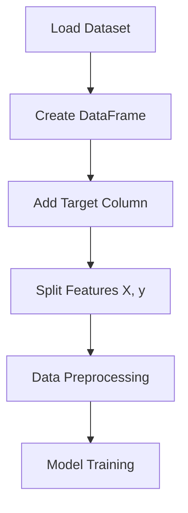
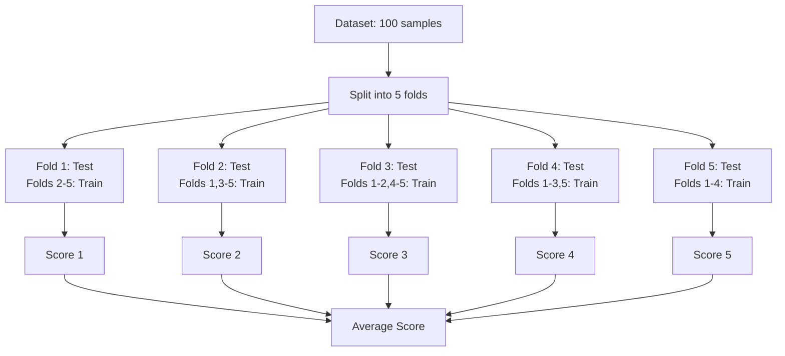

# Chapter 6: Linear Regression Practical Implementation

## 🎯 Learning Objectives
- Learn practical implementation using scikit-learn
- Understand data preprocessing and feature engineering
- Master cross-validation techniques
- Learn evaluation metrics for regression

## 📚 Key Concepts

### 6.1 Dataset Preparation

**Boston House Pricing Dataset**:
- **Target**: House prices (in thousands)
- **Features**: 13 independent variables
- **Samples**: 506 houses
- **Type**: Regression problem

**Feature Descriptions**:
- **CRIM**: Per capita crime rate by town
- **ZN**: Proportion of residential land zoned for lots over 25,000 sq ft
- **INDUS**: Proportion of non-retail business acres per town
- **CHAS**: Charles River dummy variable (1 if tract bounds river; 0 otherwise)
- **NOX**: Nitric oxides concentration (parts per 10 million)
- **RM**: Average number of rooms per dwelling
- **AGE**: Proportion of owner-occupied units built prior to 1940
- **DIS**: Weighted distances to five Boston employment centers
- **RAD**: Index of accessibility to radial highways
- **TAX**: Full-value property-tax rate per $10,000
- **PTRATIO**: Pupil-teacher ratio by town
- **B**: 1000(Bk - 0.63)² where Bk is the proportion of blacks by town
- **LSTAT**: % lower status of the population



### 6.2 Implementation Steps

#### Step 1: Import Required Libraries
```python
import numpy as np
import pandas as pd
import seaborn as sns
import matplotlib.pyplot as plt
from sklearn.datasets import load_boston
from sklearn.linear_model import LinearRegression
from sklearn.model_selection import cross_val_score
```

#### Step 2: Load and Prepare Data
```python
# Load dataset
boston = load_boston()
df = pd.DataFrame(boston.data, columns=boston.feature_names)

# Add target variable
df["'PRICE'"] = boston.target

# Split into features and target
X = df.iloc[":, :-1"]  # All columns except last
y = df.iloc[":, -1"]   # Last column only
```

#### Step 3: Initialize and Train Model
```python
# Initialize Linear Regression
lin_reg = LinearRegression()

# Perform cross-validation
mse_scores = cross_val_score(lin_reg, X, y,
                           scoring='neg_mean_squared_error',
                           cv=5)
```

### 6.3 Cross-Validation

**Purpose**: Evaluate model performance on multiple train-test splits

**How 5-Fold Cross-Validation Works**:



**Benefits of Cross-Validation**:
- More reliable performance estimate
- Reduces overfitting risk
- Uses all data for both training and testing
- Better model selection

### 6.4 Evaluation Metrics

#### Mean Squared Error (MSE)
```python
# Negative MSE from cross_val_score (sklearn convention)
mse_scores = ["-37.13, -35.42, -36.87, -38.91, -36.45"]
avg_mse = np.mean(mse_scores)  # 36.96
```

#### R-Squared (R²)
```python
# R² scores from cross-validation
r2_scores = cross_val_score(lin_reg, X, y,
                          scoring='r2',
                          cv=5)
avg_r2 = np.mean(r2_scores)  # Example: 0.71
```

### 6.5 Model Interpretation

#### Coefficient Analysis
```python
# After fitting the model
lin_reg.fit(X, y)

# Get coefficients
coefficients = pd.DataFrame({
    'Feature': X.columns,
    'Coefficient': lin_reg.coef_
}).sort_values('Coefficient', ascending=False)
```

**Typical Important Features**:
- **RM** (rooms): Positive coefficient - more rooms = higher price
- **LSTAT** (lower status): Negative coefficient - higher status = higher price
- **DIS** (distance): Positive coefficient - closer to employment = higher price

#### Intercept (Bias Term)
```python
intercept = lin_reg.intercept_
# Example: 36.49 (base house price when all features = 0)
```

### 6.6 Making Predictions

```python
# Train model on full dataset
lin_reg.fit(X, y)

# Make predictions
predictions = lin_reg.predict(X_test)

# Example prediction
sample_house = ["[0.02, 0, 7, 0, 0.5, 6, 78, 4, 1, 296, 15, 396, 5"]]
predicted_price = lin_reg.predict(sample_house)
# Output: ["24.5"] = $24,500
```

### 6.7 Practical Tips

#### Data Quality Checks
```python
# Check for missing values
print(df.isnull().sum())

# Check data types
print(df.info())

# Check basic statistics
print(df.describe())
```

#### Feature Scaling (Important for Regularization)
```python
from sklearn.preprocessing import StandardScaler

scaler = StandardScaler()
X_scaled = scaler.fit_transform(X)
```

#### Train-Test Split (Alternative to Cross-Validation)
```python
from sklearn.model_selection import train_test_split

X_train, X_test, y_train, y_test = train_test_split(
    X, y, test_size=0.2, random_state=42
)
```

## ❓ Interview Questions & Answers

### Q1: What's the difference between train_test_split and cross-validation?
**Answer**:
- **train_test_split**: Single split into training and testing
- **Cross-validation**: Multiple splits, each sample used for both training and testing
- **Advantage of CV**: More reliable performance estimate, reduces variance

### Q2: Why do we use negative mean squared error in scikit-learn?
**Answer**: Scikit-learn follows the convention that higher scores are better. Since MSE is a loss function (lower is better), they return negative MSE so that higher scores indicate better performance.

### Q3: How do you interpret linear regression coefficients?
**Answer**:
- **Positive coefficient**: Increasing the feature increases the target
- **Negative coefficient**: Increasing the feature decreases the target
- **Magnitude**: Larger absolute values indicate stronger relationships
- **Example**: RM coefficient of 3.8 means each additional room adds $3,800 to house price

### Q4: What does the intercept represent in linear regression?
**Answer**: The predicted value when all features are zero. In house pricing, it represents the base price of a house with all feature values at zero (may not have practical meaning but is mathematically necessary).

### Q5: How do you check if your linear regression model is overfitting?
**Answer**:
- Compare training vs cross-validation scores
- Large gap indicates overfitting
- Use regularization (Ridge/Lasso) to reduce overfitting
- Check if R² is unrealistically high (close to 1.0)

### Q6: Why is feature scaling important for linear regression?
**Answer**:
- Helps gradient descent converge faster
- Makes coefficient interpretation more meaningful
- Essential for regularization (features on different scales get unfair penalties)
- Improves numerical stability

### Q7: How many features is too many for linear regression?
**Answer**:
- Rule of thumb: At least 10 samples per feature
- When features > samples, use regularization
- Consider feature selection or dimensionality reduction
- Domain knowledge is more important than fixed rules

## 💡 Key Takeaways

1. **Data Preparation**: Proper feature-target separation and understanding
2. **Cross-Validation**: More reliable than single train-test split
3. **Model Evaluation**: Use multiple metrics (MSE, R²)
4. **Interpretation**: Coefficients show feature importance and direction
5. **Feature Scaling**: Essential for regularization and convergence
6. **Overfitting**: Check training vs validation performance gap

## 🚨 Common Mistakes

**Mistake 1**: Not checking data quality before modeling
- **Reality**: Always check missing values, outliers, data types

**Mistake 2**: Using test data for feature engineering
- **Reality**: Fit scalers/transformers on training data only

**Mistake 3**: Ignoring feature scaling
- **Reality**: Essential for regularization and fair coefficient comparison

**Mistake 4**: Only looking at R², not considering MSE
- **Reality**: Multiple metrics give complete performance picture

**Mistake 5**: Not validating assumptions
- **Reality**: Check linearity, normality, homoscedasticity of residuals

## 📝 Quick Revision Points

- **Dataset**: Boston housing, 13 features, 506 samples
- **Cross-Validation**: 5-fold, more reliable than single split
- **MSE**: Average squared difference between predicted and actual
- **R²**: Proportion of variance explained by model
- **Coefficients**: Feature importance and relationship direction
- **Intercept**: Base prediction when all features = 0
- **Feature Scaling**: StandardScaler for preprocessing