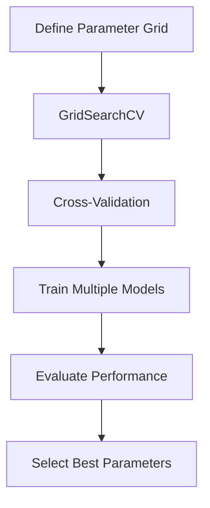
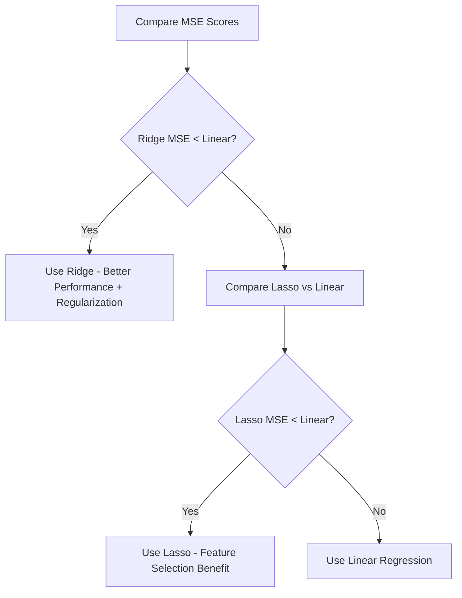

# Chapter 7: Ridge and Lasso Regression Practical Implementation

## 🎯 Learning Objectives
- Master hyperparameter tuning for regularization
- Learn GridSearchCV for parameter optimization
- Understand Ridge vs Lasso practical implementation
- Compare model performance metrics

## 📚 Key Concepts

### 7.1 Hyperparameter Tuning

**Definition**: Process of finding optimal model parameters to improve performance

**Why Hyperparameter Tuning?**:
- Different λ values create different model complexities
- No universal best λ value - depends on dataset
- Automated process better than manual trial and error



### 7.2 Ridge Regression Implementation

#### Import Libraries
```python
from sklearn.linear_model import Ridge
from sklearn.model_selection import GridSearchCV
from sklearn.model_selection import cross_val_score
```

#### Define Parameter Grid
```python
# Alpha values to test (logarithmic scale)
parameters = {
    'alpha': [1e-10, 1e-8, 1e-5, 1e-3, 1e-2, 1, 5, 10, 20, 30, 35, 40, 45, 100]
}
```

#### GridSearchCV Setup
```python
# Initialize Ridge model
ridge = Ridge()

# Setup GridSearchCV
ridge_regressor = GridSearchCV(
    ridge,                    # Model
    parameters,              # Parameter grid
    scoring='neg_mean_squared_error',  # Evaluation metric
    cv=5                      # Cross-validation folds
)

# Fit to training data
ridge_regressor.fit(X_train, y_train)
```

#### Results Interpretation
```python
# Best parameters found
print(f"Best alpha: {ridge_regressor.best_params_}")
# Output: {'alpha': 100}

# Best score achieved
print(f"Best score: {ridge_regressor.best_score_}")
# Output: -29.34 (lower MSE is better)
```

### 7.3 Lasso Regression Implementation

#### Similar Process with Lasso
```python
from sklearn.linear_model import Lasso

# Initialize Lasso
lasso = Lasso()

# GridSearchCV (same parameters)
lasso_regressor = GridSearchCV(
    lasso,
    parameters,
    scoring='neg_mean_squared_error',
    cv=5
)

# Fit model
lasso_regressor.fit(X_train, y_train)

# Results
print(f"Best alpha: {lasso_regressor.best_params_}")
# Output: {'alpha': 1}

print(f"Best score: {lasso_regressor.best_score_}")
# Output: -35.67
```

### 7.4 Model Comparison

#### Performance Comparison
```python
# Linear Regression baseline
lin_reg = LinearRegression()
lin_mse = cross_val_score(lin_reg, X_train, y_train,
                          scoring='neg_mean_squared_error', cv=5)
print(f"Linear Regression MSE: {np.mean(lin_mse):.2f}")
# Output: -37.13

# Ridge Regression
print(f"Ridge Regression MSE: {ridge_regressor.best_score_:.2f}")
# Output: -29.34

# Lasso Regression
print(f"Lasso Regression MSE: {lasso_regressor.best_score_:.2f}")
# Output: -35.67
```

#### Decision Making Process



### 7.5 Train-Test Split vs Cross-Validation

#### Train-Test Split Approach
```python
from sklearn.model_selection import train_test_split

X_train, X_test, y_train, y_test = train_test_split(
    X, y, test_size=0.33, random_state=42
)

# Train on training data only
ridge_regressor.fit(X_train, y_train)
```

#### Why Both Approaches?
- **Cross-Validation**: Better parameter selection, uses all data
- **Train-Test Split**: Final unbiased performance evaluation

### 7.6 Making Predictions and Evaluation

#### Final Model Training
```python
# Train best model on full training data
best_ridge = ridge_regressor.best_estimator_
best_ridge.fit(X_train, y_train)

# Make predictions
y_pred = best_ridge.predict(X_test)
```

#### R² Score Evaluation
```python
from sklearn.metrics import r2_score

r2 = r2_score(y_test, y_pred)
print(f"R² Score: {r2:.4f}")
# Output: 0.7684 (76.84% variance explained)
```

### 7.7 Logistic Regression Hyperparameter Tuning

#### Breast Cancer Dataset Example
```python
from sklearn.datasets import load_breast_cancer
from sklearn.linear_model import LogisticRegression

# Load dataset
cancer = load_breast_cancer()
X = pd.DataFrame(cancer.data, columns=cancer.feature_names)
y = pd.Series(cancer.target)

# Check class balance
print(y.value_counts())
# Output: 1    357, 0    212 (balanced dataset)
```

#### Logistic Regression Parameters
```python
# Parameter grid for logistic regression
log_params = {
    'C': [1, 10, 20],           # Inverse of regularization strength
    'max_iter': [100, 150, 200]  # Maximum iterations
}

# Initialize and fit
log_reg = LogisticRegression()
log_regressor = GridSearchCV(
    log_reg,
    log_params,
    scoring='f1',              # F1 score for classification
    cv=5
)

log_regressor.fit(X_train, y_train)
```

#### Classification Metrics
```python
from sklearn.metrics import confusion_matrix, classification_report, accuracy_score

# Predictions
y_pred = log_regressor.predict(X_test)

# Confusion Matrix
cm = confusion_matrix(y_test, y_pred)
print("Confusion Matrix:")
print(cm)
# Output: [[63  3]
#          [ 4 118]]

# Classification Report
print("\nClassification Report:")
print(classification_report(y_test, y_pred))

# Accuracy Score
accuracy = accuracy_score(y_test, y_pred)
print(f"Accuracy: {accuracy:.4f}")
# Output: 0.9615 (96.15% accuracy)
```

### 7.8 Practical Tips

#### Parameter Selection Strategy
```python
# Start with wide range, then narrow down
# First pass:
alphas_wide = [1e-10, 1e-5, 1e-3, 1e-1, 1, 10, 100]

# Second pass (around best value):
alphas_narrow = [50, 75, 100, 125, 150]
```

#### Cross-Validation Folds
```python
# More folds = more reliable but slower
cv_folds = 5  # Standard choice
cv_folds = 10 # For smaller datasets
cv_folds = 3  # For faster iteration
```

#### Scoring Metrics
```python
# Regression metrics
scoring_regression = ['neg_mean_squared_error', 'r2', 'neg_mean_absolute_error']

# Classification metrics
scoring_classification = ['f1', 'accuracy', 'precision', 'recall']
```

## ❓ Interview Questions & Answers

### Q1: What's the difference between GridSearchCV and RandomizedSearchCV?
**Answer**:
- **GridSearchCV**: Tests all parameter combinations systematically
- **RandomizedSearchCV**: Tests random combinations, faster for large parameter spaces
- **GridSearchCV**: Guarantees finding best within defined grid
- **RandomizedSearchCV**: Good for large parameter spaces with time constraints

### Q2: Why do we use negative MSE in GridSearchCV?
**Answer**: Scikit-learn follows the convention that higher scores are better. Since MSE is a loss function (lower is better), they use negative MSE so higher scores indicate better performance.

### Q3: How do you choose the range of alpha values for Ridge/Lasso?
**Answer**:
- Start with logarithmic scale: [1e-10, 1e-5, 1e-3, 1e-1, 1, 10, 100]
- Wider range initially, then narrow around best value
- Consider dataset size and feature scaling
- Domain knowledge about expected regularization strength

### Q4: Should you use GridSearchCV on the full dataset or training data only?
**Answer**: Always use training data only. Split data first, then use GridSearchCV on training data. Test data should only be used for final evaluation to avoid data leakage.

### Q5: What if GridSearchCV selects the highest alpha value in your range?
**Answer**: It means the optimal alpha might be outside your defined range. Expand the range to include higher values and rerun the search.

### Q6: How do you compare models with different hyperparameters?
**Answer**:
- Use same cross-validation strategy
- Compare multiple metrics (MSE, R², MAE)
- Consider model complexity vs performance tradeoff
- Use statistical tests if differences are small

### Q7: Why might Ridge perform better than Linear Regression?
**Answer**:
- Reduces overfitting by penalizing large coefficients
- Handles multicollinearity better
- More stable coefficients with correlated features
- Better generalization to unseen data

## 💡 Key Takeaways

1. **Hyperparameter Tuning**: Automated process to find optimal model parameters
2. **GridSearchCV**: Systematic search through parameter combinations
3. **Alpha Selection**: Logarithmic scale is usually best for regularization parameters
4. **Cross-Validation**: Essential for reliable parameter selection
5. **Model Comparison**: Always compare with baseline (Linear Regression)
6. **Train-Test Split**: Final evaluation on held-out test data
7. **Multiple Metrics**: Use different evaluation metrics for complete picture

## 🚨 Common Mistakes

**Mistake 1**: Using test data in GridSearchCV
- **Reality**: Split data first, use only training data for parameter tuning

**Mistake 2**: Not scaling features before regularization
- **Reality**: Feature scaling essential for fair regularization penalties

**Mistake 3**: Using too narrow parameter ranges
- **Reality**: Start wide, then narrow down around best values

**Mistake 4**: Only looking at one evaluation metric
- **Reality**: Consider multiple metrics (MSE, R², business impact)

**Mistake 5**: Not refitting on full training data after finding best parameters
- **Reality**: Refit best model on all training data before final evaluation

## 📝 Quick Revision Points

- **GridSearchCV**: Automated hyperparameter tuning with cross-validation
- **Alpha Range**: Logarithmic scale from very small to large values
- **Scoring**: Use negative MSE for regression, F1/accuracy for classification
- **CV Folds**: 5-fold standard, adjust based on dataset size
- **Model Selection**: Compare with baseline, consider regularization benefits
- **Final Evaluation**: Use held-out test set for unbiased performance estimate