# Chapter 8: Naive Bayes Algorithm

## 🎯 Learning Objectives
- Understand Bayes' Theorem and conditional probability
- Learn Naive Bayes classification algorithm
- Master probability calculations with examples
- Understand the "naive" assumption and its implications

## 📚 Key Concepts

### 8.1 Bayes' Theorem Foundation

**Independent vs Dependent Events**:
- **Independent Events**: Outcome doesn't affect other events (rolling dice)
- **Dependent Events**: Outcome affects subsequent events (drawing marbles without replacement)

**Marble Example**:
- **Initial**: 3 red, 2 green marbles (total = 5)
- **First draw**: P(Red) = 3/5
- **Second draw** (after removing red): P(Green) = 2/4 = 1/2

**Conditional Probability Formula**:
```
P(A and B) = P(A) × P(B|A)
```

### 8.2 Bayes' Theorem Derivation

```mermaid
flowchart TD
    A["P(A and B) = P(A) × P(B|A)"] --> B["P(A and B) = P(B) × P(A|B)"]
    B --> C["P(A) × P(B|A) = P(B) × P(A|B)"]
    C --> D["P(A|B) = P(B|A) × P(A) / P(B)"]
    D --> E["Bayes' Theorem"]
```



**Bayes' Theorem Formula**:
```
P(A|B) = P(B|A) × P(A) / P(B)
```

Where:
- **P(A|B)**: Posterior probability (what we want to find)
- **P(B|A)**: Likelihood
- **P(A)**: Prior probability
- **P(B)**: Evidence (normalizing constant)

### 8.3 Naive Bayes for Classification

**Problem Setup**:
- Features: X₁, X₂, X₃, ..., Xₙ
- Target: Y (can be binary or multiclass)
- Goal: Find P(Y|X₁, X₂, ..., Xₙ)

**Applying Bayes' Theorem**:
```
P(Y|X₁, X₂, ..., Xₙ) = P(Y) × P(X₁, X₂, ..., Xₙ|Y) / P(X₁, X₂, ..., Xₙ)
```

**The "Naive" Assumption**:
- Features are conditionally independent given the class
- This allows us to simplify the likelihood term:
```
P(X₁, X₂, ..., Xₙ|Y) = P(X₁|Y) × P(X₂|Y) × ... × P(Xₙ|Y)
```

**Final Naive Bayes Formula**:
```
P(Y|X) ∝ P(Y) × ∏["i=1 to n"] P(Xᵢ|Y)
```

### 8.4 Tennis Dataset Example

**Dataset Features**:
- **Outlook**: Sunny, Overcast, Rain
- **Temperature**: Hot, Mild, Cool
- **Humidity**: High, Normal
- **Wind**: Weak, Strong
- **Target**: Play Tennis (Yes/No)


#### Step 1: Calculate Prior Probabilities
```
Total samples = 14
Yes = 9, No = 5

P(Yes) = 9/14 = 0.643
P(No) = 5/14 = 0.357
```

#### Step 2: Calculate Conditional Probabilities

**Outlook Probabilities**:
```
P(Sunny|Yes) = 2/9 = 0.222
P(Sunny|No) = 3/5 = 0.600

P(Overcast|Yes) = 4/9 = 0.444
P(Overcast|No) = 0/5 = 0.000

P(Rain|Yes) = 3/9 = 0.333
P(Rain|No) = 2/5 = 0.400
```

**Temperature Probabilities**:
```
P(Hot|Yes) = 2/9 = 0.222
P(Hot|No) = 2/5 = 0.400

P(Mild|Yes) = 4/9 = 0.444
P(Mild|No) = 2/5 = 0.400

P(Cool|Yes) = 3/9 = 0.333
P(Cool|No) = 1/5 = 0.200
```

#### Step 3: Calculate Posterior Probabilities

**For "Sunny, Hot" → Yes**:
```
P(Yes|Sunny, Hot) ∝ P(Yes) × P(Sunny|Yes) × P(Hot|Yes)
∝ 0.643 × 0.222 × 0.222 = 0.0317
```

**For "Sunny, Hot" → No**:
```
P(No|Sunny, Hot) ∝ P(No) × P(Sunny|No) × P(Hot|No)
∝ 0.357 × 0.600 × 0.400 = 0.0857
```

#### Step 4: Normalize
```
P(Yes|Sunny, Hot) = 0.0317 / (0.0317 + 0.0857) = 0.27 = 27%
P(No|Sunny, Hot) = 0.0857 / (0.0317 + 0.0857) = 0.73 = 73%
```

**Prediction**: No (don't play tennis)

### 8.5 Types of Naive Bayes

#### 1. Gaussian Naive Bayes
- **Use Case**: Continuous features (age, height, temperature)
- **Assumption**: Features follow Gaussian (normal) distribution
- **Formula**: P(Xᵢ|Y) calculated using normal distribution

#### 2. Multinomial Naive Bayes
- **Use Case**: Discrete counts (word frequencies in text classification)
- **Applications**: Text classification, spam detection
- **Formula**: Based on multinomial distribution

#### 3. Bernoulli Naive Bayes
- **Use Case**: Binary features (word present/absent)
- **Applications**: Document classification with binary features
- **Formula**: Based on Bernoulli distribution

### 8.6 Advantages and Disadvantages

#### Advantages:
- **Fast**: Both training and prediction are very fast
- **Simple**: Easy to understand and implement
- **Works well** with high-dimensional data
- **Requires less training data** than other algorithms

#### Disadvantages:
- **Strong independence assumption** often unrealistic
- **Zero frequency problem**: Unknown words/features get zero probability
- **Cannot capture feature interactions**
- **Sensitive to correlated features**

### 8.7 Laplace Smoothing

**Problem**: If a feature value never occurs with a class, probability = 0

**Solution**: Add small constant to all counts
```
P(Xᵢ|Y) = (count(Xᵢ, Y) + alpha) / (count(Y) + alpha × n)
```

Where:
- **alpha** = 1 (Laplace smoothing)
- **n** = number of possible values for Xᵢ

### 8.8 Practical Implementation Steps

```python
from sklearn.naive_bayes import GaussianNB, MultinomialNB
from sklearn.model_selection import train_test_split
from sklearn.metrics import accuracy_score, classification_report

# For continuous features
gnb = GaussianNB()
gnb.fit(X_train, y_train)
y_pred = gnb.predict(X_test)

# For text/discrete features
mnb = MultinomialNB()
mnb.fit(X_train, y_train)
y_pred = mnb.predict(X_test)

# Evaluation
print(f"Accuracy: {"accuracy_score(y_test, y_pred)"}")
print(classification_report(y_test, y_pred))
```

## ❓ Interview Questions & Answers

### Q1: Why is it called "Naive" Bayes?
**Answer**: Because it makes the "naive" assumption that all features are conditionally independent given the class. In reality, features are often correlated, but this simplification makes the algorithm computationally feasible and often works well in practice.

### Q2: Explain the zero frequency problem and how to solve it.
**Answer**: When a feature value never appears with a class in training data, its conditional probability becomes zero, making the entire product zero. Solution: Use Laplace smoothing by adding 1 to all counts.

### Q3: When would you use Gaussian vs Multinomial Naive Bayes?
**Answer**:
- **Gaussian**: For continuous features that follow normal distribution (age, height, temperature)
- **Multinomial**: For discrete count data (word frequencies in documents)
- **Bernoulli**: For binary features (word present/absent in documents)

### Q4: Does Naive Bayes work well with correlated features?
**Answer**: Not ideally. The independence assumption is violated when features are correlated, which can lead to overconfident predictions. However, in practice, Naive Bayes often still performs surprisingly well even with some feature correlation.

### Q5: Why is Naive Bayes fast compared to other algorithms?
**Answer**:
- No iterative training process (no gradient descent)
- Simple probability calculations
- Linear time complexity in both training and prediction
- No need for complex optimization

### Q6: How do you handle continuous features in Naive Bayes?
**Answer**: Use Gaussian Naive Bayes, which assumes features follow a normal distribution. Calculate mean and standard deviation for each feature-class combination, then use the normal distribution formula to calculate probabilities.

### Q7: What is the main advantage of Naive Bayes for text classification?
**Answer**: It handles high-dimensional data well (thousands of word features), requires relatively little training data, and is very fast to train and predict. It's also robust to irrelevant features.

## 💡 Key Takeaways

1. **Bayes' Theorem**: Foundation for calculating posterior probabilities
2. **Naive Assumption**: Features are conditionally independent given class
3. **Fast Algorithm**: Simple probability calculations, no iteration needed
4. **Multiple Variants**: Gaussian, Multinomial, Bernoulli for different data types
5. **Laplace Smoothing**: Solves zero frequency problem
6. **Text Classification**: Excellent for spam detection, document categorization
7. **Independence Assumption**: Main limitation but often works well in practice

## 🚨 Common Mistakes

**Mistake 1**: Using Naive Bayes with highly correlated features
- **Reality**: Independence assumption is violated, consider removing correlations

**Mistake 2**: Not applying Laplace smoothing
- **Reality**: Zero frequency problem can cause complete failure

**Mistake 3**: Using wrong Naive Bayes variant for data type
- **Reality**: Match variant to data (Gaussian for continuous, Multinomial for counts)

**Mistake 4**: Ignoring prior probabilities
- **Reality**: Priors can significantly impact predictions, especially with small datasets

**Mistake 5**: Expecting probability calibration
- **Reality**: Naive Bayes often produces poorly calibrated probabilities

## 📝 Quick Revision Points

- **Bayes' Theorem**: P(A|B) = P(B|A) × P(A) / P(B)
- **Naive Assumption**: Features independent given class
- **Gaussian NB**: For continuous features (normal distribution)
- **Multinomial NB**: For count data (text classification)
- **Laplace Smoothing**: Add 1 to prevent zero probabilities
- **Fast Training**: No iterative optimization needed
- **High-Dimensional**: Works well with many features
- **Text Applications**: Spam detection, document classification