# Chapter 9: KNN Algorithm Intuition

## 🎯 Learning Objectives
- Understand K-Nearest Neighbors algorithm intuition
- Learn Euclidean vs Manhattan distance metrics
- Master KNN for both classification and regression
- Understand hyperparameter K selection and limitations

## 📚 Key Concepts

### 9.1 KNN Algorithm Overview

**KNN (K-Nearest Neighbors)**: Simple, non-parametric algorithm that can be used for both classification and regression

**Core Idea**: "Birds of a feather flock together" - similar things exist near each other


### 9.2 KNN Classification

**How it Works**:
1. Calculate distance from new point to all training points
2. Find K closest neighbors
3. Take majority vote among neighbors
4. Assign most common class

**Example with K=5**:


### 9.3 KNN Regression

**How it Works**:
1. Calculate distance from new point to all training points
2. Find K closest neighbors
3. Take average of neighbor values
4. Predict the average

**Example with K=5**:


### 9.4 Distance Metrics

#### 1. Euclidean Distance
**Formula**:
```
d = √["(x₂ - x₁)² + (y₂ - y₁)²"]
```
**Characteristics**: Straight-line distance (hypotenuse)

```mermaid
flowchart TD
    A["Point 1<br/>(x₁, y₁)"] --> B["Point 2<br/>(x₂, y₂)"]
    B --> C["Euclidean Distance"]
    C --> D["Direct Line<br/>√[(x₂-x₁)² + (y₂-y₁)²"]]
```

#### 2. Manhattan Distance
**Formula**:
```
d = |x₂ - x₁| + |y₂ - y₁|
```
**Characteristics**: City block distance (grid movement)

```mermaid
flowchart TD
    A["Point 1<br/>(x₁, y₁)"] --> B["Point 2<br/>(x₂, y₂)"]
    B --> C["Manhattan Distance"]
    C --> D["Grid Path<br/>|x₂-x₁| + |y₂-y₁|"]
```



**Distance Comparison**:
- **Euclidean**: Actual straight-line distance
- **Manhattan**: Distance if you can only move horizontally/vertically

### 9.5 Choosing K Value

**K is a hyperparameter** that needs to be tuned

#### Effects of Different K Values:


#### How to Choose K:
1. **Cross-validation**: Test different K values
2. **Rule of thumb**: K = √n (where n = number of samples)
3. **Avoid**: K = 1 (too sensitive) and K = n (just predicts majority class)
4. **Odd numbers**: For classification to avoid ties

### 9.6 KNN Algorithm Steps

#### Training Phase:
```python
# KNN has no "training" phase
# Just store the training data
X_train, y_train = load_data()
```

#### Prediction Phase:
```python
def knn_predict(new_point, X_train, y_train, K=5):
    # 1. Calculate distances
    distances = [""]
    for i, train_point in enumerate(X_train):
        dist = euclidean_distance(new_point, train_point)
        distances.append((dist, y_train["i"]))

    # 2. Sort by distance
    distances.sort()

    # 3. Get K nearest neighbors
    k_nearest = distances[":K"]

    # 4. Predict
    if classification:
        # Majority vote
        classes = ["label for _, label in k_nearest"]
        return most_common(classes)
    else:
        # Average
        values = ["value for _, value in k_nearest"]
        return sum(values) / len(values)
```

### 9.7 Advantages and Disadvantages

#### Advantages:
- **Simple**: Easy to understand and implement
- **No training phase**: Ready to predict immediately
- **Non-parametric**: No assumptions about data distribution
- **Versatile**: Works for classification and regression
- **Adaptive**: Can capture complex decision boundaries

#### Disadvantages:
- **Computationally expensive**: O(n) prediction time
- **Memory intensive**: Needs to store all training data
- **Sensitive to outliers**: Single outlier can affect prediction
- **Curse of dimensionality**: Performance degrades with many features
- **Feature scaling required**: Different scales affect distance calculations

### 9.8 Practical Considerations

#### Feature Scaling
```python
from sklearn.preprocessing import StandardScaler

# Important for KNN
scaler = StandardScaler()
X_train_scaled = scaler.fit_transform(X_train)
X_test_scaled = scaler.transform(X_test)
```

#### Handling High-Dimensional Data


#### Choosing Distance Metric
- **Euclidean**: Best for continuous, low-dimensional data
- **Manhattan**: Better for high-dimensional data with outliers
- **Custom**: Domain-specific distance functions

### 9.9 Practical Implementation

```python
from sklearn.neighbors import KNeighborsClassifier, KNeighborsRegressor
from sklearn.model_selection import GridSearchCV
from sklearn.preprocessing import StandardScaler

# For Classification
knn_clf = KNeighborsClassifier()

# Hyperparameter tuning
parameters = {
    'n_neighbors': ["3, 5, 7, 9, 11"],
    'weights': ["'uniform', 'distance'"],
    'metric': ["'euclidean', 'manhattan'"]
}

grid_search = GridSearchCV(knn_clf, parameters, cv=5)
grid_search.fit(X_train_scaled, y_train)

# Best model
best_knn = grid_search.best_estimator_
predictions = best_knn.predict(X_test_scaled)

# For Regression
knn_reg = KNeighborsRegressor(n_neighbors=5)
knn_reg.fit(X_train_scaled, y_train)
reg_predictions = knn_reg.predict(X_test_scaled)
```

## ❓ Interview Questions & Answers

### Q1: Why does KNN not have a training phase?
**Answer**: KNN is a lazy learning algorithm. It doesn't learn a model during training - it simply stores the training data. All the "learning" happens during prediction when it finds the nearest neighbors.

### Q2: What happens when you use K=1 in KNN?
**Answer**: The prediction becomes very sensitive to noise and outliers. Each test point is classified by its single nearest neighbor, which can lead to overfitting and poor generalization.

### Q3: How does the curse of dimensionality affect KNN?
**Answer**: In high-dimensional spaces, the concept of "nearest" becomes less meaningful because distances between points tend to become similar. This makes KNN less effective as the number of features increases.

### Q4: Why is feature scaling important for KNN?
**Answer**: KNN relies on distance calculations, so features with larger scales dominate the distance computation. Scaling ensures all features contribute equally to the distance metric.

### Q5: When would you prefer Manhattan distance over Euclidean distance?
**Answer**: Manhattan distance is preferred when:
- Data has many outliers (less sensitive than Euclidean)
- Features are independent
- Working with grid-like data (city block distance)
- High-dimensional data

### Q6: How do you handle ties in KNN classification?
**Answer**:
- Use odd K values to avoid ties
- If tie occurs, randomly select one class
- Use weighted voting (closer neighbors get more weight)
- Reduce K by 1 until tie is resolved

### Q7: What is the computational complexity of KNN?
**Answer**:
- **Training**: O(1) - just storing data
- **Prediction**: O(n × d) where n = training samples, d = dimensions
- **Space**: O(n × d) to store all training data

## 💡 Key Takeaways

1. **Simple Concept**: Predict based on nearest neighbors
2. **No Training**: Lazy learning algorithm
3. **Distance-Based**: Relies on distance metrics
4. **K Selection**: Crucial hyperparameter, needs tuning
5. **Feature Scaling**: Essential for good performance
6. **Computational Cost**: Expensive for large datasets
7. **Versatile**: Works for both classification and regression

## 🚨 Common Mistakes

**Mistake 1**: Not scaling features before applying KNN
- **Reality**: Feature scaling is essential as KNN uses distance calculations

**Mistake 2**: Using K=1 for final model
- **Reality**: K=1 is too sensitive to noise, typically use odd K ≥ 3

**Mistake 3**: Using KNN with very high-dimensional data
- **Reality**: Consider dimensionality reduction or different algorithms

**Mistake 4**: Ignoring computational costs for large datasets
- **Reality**: KNN prediction time grows with dataset size

**Mistake 5**: Not trying different distance metrics
- **Reality**: Different metrics work better for different data types

## 📝 Quick Revision Points

- **KNN**: K-Nearest Neighbors, simple distance-based algorithm
- **Classification**: Majority vote of K nearest neighbors
- **Regression**: Average of K nearest neighbor values
- **Distance Metrics**: Euclidean (straight line), Manhattan (grid distance)
- **K Selection**: Hyperparameter, typically odd numbers 3-11
- **Feature Scaling**: Essential, use StandardScaler
- **No Training**: Lazy learning, stores all training data
- **Curse of Dimensionality**: Performance degrades with many features