# Chapter 10: Decision Tree Classification Algorithms

## 🎯 Learning Objectives
- Understand decision tree structure and intuition
- Master entropy and Gini impurity calculations
- Learn information gain for feature selection
- Handle both categorical and continuous features

## 📚 Key Concepts

### 10.1 Decision Tree Intuition

**Core Concept**: Decision trees are a visual representation of nested if-else conditions that help solve classification and regression problems

**Example**: Age-based decision making
```python
if age <= 18:
    print("Go to college")
elif age <= 35:
    print("Work")
else:
    print("Retire")
```

**Visual Representation**:


### 10.2 Tennis Dataset Example

**Problem**: Predict whether someone will play tennis based on weather conditions

**Features**:
- **Outlook**: Sunny, Overcast, Rain
- **Temperature**: Hot, Mild, Cool
- **Humidity**: High, Normal
- **Wind**: Weak, Strong
- **Target**: Play Tennis (Yes/No)

**Dataset Sample**:
```
Outlook  Temperature Humidity Wind Play Tennis
Sunny    Hot         High    Weak No
Sunny    Hot         High    Strong No
Overcast Hot         High    Weak Yes
Rain     Mild        High    Weak Yes
...
```

### 10.3 Tree Building Process

#### Step 1: Root Node Selection


#### Step 2: Pure vs Impure Splits
- **Pure Split**: All samples belong to one class (entropy = 0)
- **Impure Split**: Mixed classes (entropy > 0, needs further splitting)

### 10.4 Entropy Calculation

**Purpose**: Measure impurity/purity of a node

**Formula**:
```
H(S) = -p₊ log₂(p₊) - p₋ log₂(p₋)
```

Where:
- **p₊**: Probability of Yes class
- **p₋**: Probability of No class

**Entropy Properties**:
- **H(S) = 0**: Pure split (all samples same class)
- **H(S) = 1**: Maximum impurity (50-50 split)
- **Range**: ["0, 1"]


#### Example Calculations:

**Pure Node (4 Yes, 0 No)**:
```
p₊ = 4/4 = 1.0, p₋ = 0/4 = 0
H(S) = -1.0 × log₂(1.0) - 0 × log₂(0) = 0
```

**Impure Node (3 Yes, 3 No)**:
```
p₊ = 3/6 = 0.5, p₋ = 3/6 = 0.5
H(S) = -0.5 × log₂(0.5) - 0.5 × log₂(0.5) = 1
```

**Mixed Node (6 Yes, 2 No)**:
```
p₊ = 6/8 = 0.75, p₋ = 2/8 = 0.25
H(S) = -0.75 × log₂(0.75) - 0.25 × log₂(0.25) = 0.81
```

### 10.5 Gini Impurity

**Purpose**: Alternative to entropy for measuring impurity

**Formula**:
```
Gini = 1 - Σ(pᵢ)²
```
For binary classification:
```
Gini = 1 - (p₊² + p₋²)
```

**Gini vs Entropy**:
| Property | Entropy | Gini |
|----------|---------|------|
| **Range** | ["0, 1"] | ["0, 0.5"] |
| **Max Impurity** | H(S) = 1 at p = 0.5 | Gini = 0.5 at p = 0.5 |
| **Computation** | Slower (log functions) | Faster (simple math) |
| **Default in sklearn** | No | Yes |

#### Gini Example (2 Yes, 2 No):
```
p₊ = 2/4 = 0.5, p₋ = 2/4 = 0.5
Gini = 1 - (0.5² + 0.5²) = 1 - (0.25 + 0.25) = 0.5
```

### 10.6 Information Gain

**Purpose**: Select the best feature for splitting

**Formula**:
```
IG(S, F) = H(S) - Σ(|Sᵥ|/|S|) × H(Sᵥ)
```

Where:
- **H(S)**: Entropy of parent node
- **Sᵥ**: Subset for feature value v
- **|Sᵥ|/|S|**: Weight of each subset

**Information Gain Calculation Example**:

**Root Node**: 9 Yes, 5 No (Total = 14)
```
H(S) = -9/14 × log₂(9/14) - 5/14 × log₂(5/14) = 0.94
```

**Feature 1 Split**:
- Category 1: 6 Yes, 2 No (8 samples) → H(Sᵥ) = 0.81
- Category 2: 3 Yes, 3 No (6 samples) → H(Sᵥ) = 1.0

**Information Gain**:
```
IG = 0.94 - (8/14 × 0.81 + 6/14 × 1.0) = 0.041
```

**Feature Selection**: Choose feature with highest Information Gain

### 10.7 Continuous Features

**Challenge**: How to split continuous variables?

**Solution**: Test all possible split points

```mermaid
flowchart TD
    A["Continuous Feature: 1.3, 2.3, 3, 4, 5, 6"] --> B["Sort Values"]
    B --> C["Test Split ≤ 1.3"]
    C --> D["Calculate Information Gain"]
    B --> E["Test Split ≤ 2.3"]
    E --> F["Calculate Information Gain"]
    B --> G["Test Split ≤ 3"]
    G --> H["Calculate Information Gain"]
    B --> I["Continue for All Values"]
    I --> J["Select Best Split Point"]
```



**Process**:
1. Sort continuous feature values
2. For each unique value, create split (≤ value vs > value)
3. Calculate Information Gain for each split
4. Select split with maximum Information Gain

### 10.8 Decision Tree Algorithm

```python
def build_decision_tree(data, features, target):
    # Check if stopping conditions met
    if all_samples_same_class(data):
        return LeafNode(majority_class)

    if no_features_left(features):
        return LeafNode(majority_class)

    # Select best feature
    best_feature = None
    best_gain = 0
    best_splits = {""}

    for feature in features:
        gain, splits = calculate_information_gain(data, feature, target)
        if gain > best_gain:
            best_feature = feature
            best_gain = gain
            best_splits = splits

    # Create decision node
    if best_gain > 0:
        node = DecisionNode(best_feature)
        remaining_features = ["f for f in features if f != best_feature"]

        for value, subset in best_splits.items():
            child = build_decision_tree(subset, remaining_features, target)
            node.add_child(value, child)

        return node
    else:
        return LeafNode(majority_class)
```

### 10.9 Stopping Conditions

**When to Stop Splitting**:
1. **Pure Node**: All samples belong to same class
2. **No Features Left**: No more features to split on
3. **Minimum Samples**: Node has fewer than minimum samples
4. **Maximum Depth**: Tree reached maximum allowed depth
5. **No Information Gain**: Split doesn't improve purity

### 10.10 Practical Implementation

```python
from sklearn.tree import DecisionTreeClassifier
from sklearn.model_selection import train_test_split
from sklearn.metrics import accuracy_score, classification_report

# Initialize Decision Tree
dt_clf = DecisionTreeClassifier(
    criterion='gini',           # 'gini' or 'entropy'
    max_depth=5,               # Maximum tree depth
    min_samples_split=2,       # Minimum samples to split
    min_samples_leaf=1,        # Minimum samples per leaf
    random_state=42
)

# Train model
dt_clf.fit(X_train, y_train)

# Make predictions
y_pred = dt_clf.predict(X_test)

# Evaluate
print(f"Accuracy: {"accuracy_score(y_test, y_pred)"}")
print(classification_report(y_test, y_pred))

# Feature importance
feature_importance = pd.DataFrame({
    'feature': X_train.columns,
    'importance': dt_clf.feature_importances_
}).sort_values('importance', ascending=False)
```

### 10.11 Advantages and Disadvantages

#### Advantages:
- **Interpretable**: Easy to understand and visualize
- **No Feature Scaling**: Works with raw features
- **Handles Mixed Data**: Both categorical and numerical
- **Non-parametric**: No assumptions about data distribution
- **Feature Importance**: Built-in feature selection

#### Disadvantages:
- **Overfitting**: Can create overly complex trees
- **Unstable**: Small data changes can create different trees
- **Bias to Features with More Levels**: Categorical features bias
- **Greedy Algorithm**: Not guaranteed to find optimal tree

## ❓ Interview Questions & Answers

### Q1: What's the difference between entropy and Gini impurity?
**Answer**:
- **Entropy**: Range ["0,1"], uses logarithmic calculations, theoretically sound
- **Gini**: Range ["0,0.5"], computationally faster (no logs), sklearn default
- **Both**: Measure impurity, maximum at 50-50 split, zero for pure splits

### Q2: How does decision tree handle continuous features?
**Answer**: By testing all possible split points. The algorithm sorts the continuous feature, then for each unique value creates a split (≤ value vs > value), calculates Information Gain for each, and selects the split with maximum gain.

### Q3: What is Information Gain and how is it calculated?
**Answer**: Information Gain measures how much a feature reduces impurity. Formula: IG(S,F) = H(S) - Σ(weighted entropy of child nodes). Higher Information Gain means the feature creates purer splits.

### Q4: When does a decision tree stop growing?
**Answer**: When any stopping condition is met:
- Node is pure (all samples same class)
- No features left to split
- Minimum samples threshold reached
- Maximum depth reached
- No Information Gain from further splits

### Q5: Why is feature scaling not required for decision trees?
**Answer**: Decision trees make decisions based on threshold comparisons, not distance calculations. The relative ordering of values matters, not their absolute scale.

### Q6: What is overfitting in decision trees and how to prevent it?
**Answer**: Overfitting occurs when trees become too complex and memorize training data. Prevention methods:
- Limit maximum depth
- Set minimum samples per leaf
- Prune the tree
- Use ensemble methods (Random Forest)

### Q7: How do you select the root node in a decision tree?
**Answer**: Calculate Information Gain for all features and select the one with highest Information Gain as the root node. This ensures the first split creates the most pure child nodes.

### Q8: What are the advantages of decision trees over neural networks?
**Answer**:
- More interpretable and explainable
- No need for feature scaling
- Works with smaller datasets
- Handles mixed data types naturally
- Less computational resources required

## 💡 Key Takeaways

1. **Tree Structure**: Visual representation of if-else conditions
2. **Splitting Criteria**: Entropy or Gini impurity to measure node purity
3. **Feature Selection**: Information Gain chooses best splitting feature
4. **Stopping Conditions**: Prevent overfitting with various criteria
5. **Continuous Features**: Test all possible split points
6. **Interpretability**: Easy to understand and visualize
7. **No Scaling**: Works with raw features without preprocessing

## 🚨 Common Mistakes

**Mistake 1**: Letting trees grow too deep
- **Reality**: Use max_depth, min_samples_leaf to prevent overfitting

**Mistake 2**: Only using accuracy to evaluate
- **Reality**: Consider precision, recall, F1 for imbalanced datasets

**Mistake 3**: Ignoring feature importance
- **Reality**: Feature importance helps understand model and reduce features

**Mistake 4**: Using small datasets for complex problems
- **Reality**: Decision trees need sufficient data to find meaningful splits

**Mistake 5**: Not pruning trees
- **Reality**: Pruning can improve generalization by removing unnecessary branches

## 📝 Quick Revision Points

- **Entropy**: H(S) = -p₊log₂(p₊) - p₋log₂(p₋), measures impurity
- **Gini**: 1 - Σ(pᵢ)², faster alternative to entropy
- **Information Gain**: IG = H(parent) - Σ(weighted H(children)), selects best feature
- **Pure Node**: Entropy = 0, all samples same class
- **Continuous Features**: Test all possible split points
- **Stopping Conditions**: Pure nodes, max depth, min samples, no gain
- **Overfitting Prevention**: Depth limits, pruning, minimum samples
- **Interpretability**: Decision trees are white-box models