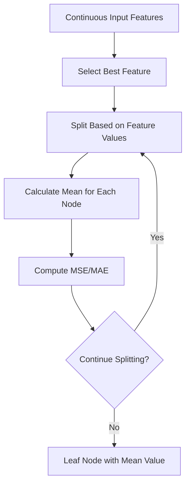
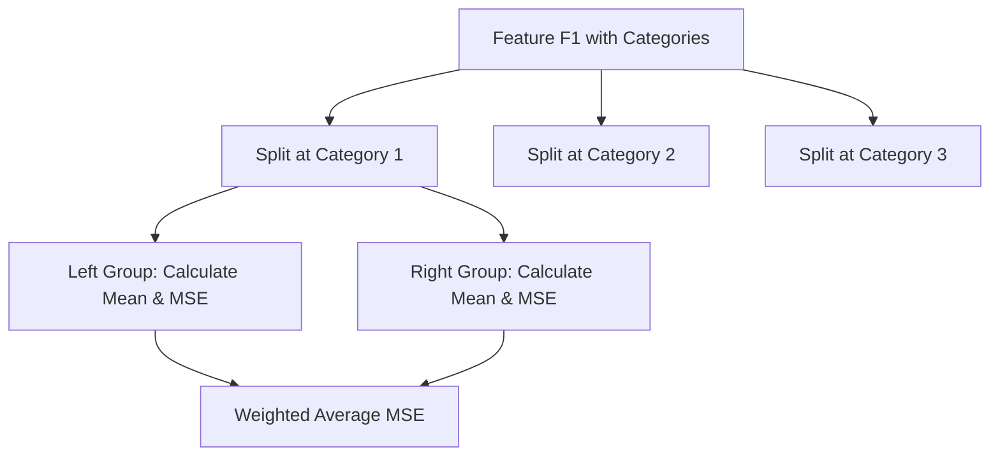
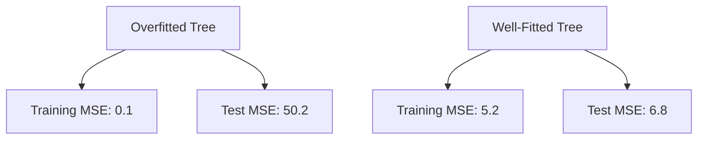
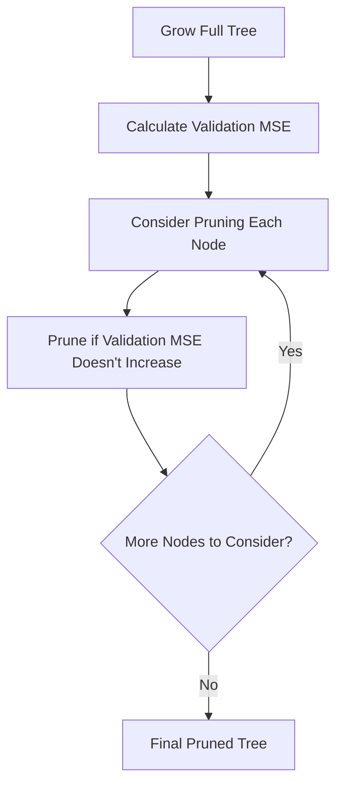

# Chapter 11: Decision Tree Regression Algorithms

## 🎯 Learning Objectives
- Understand decision tree regression for continuous targets
- Learn MSE and MAE as splitting criteria
- Master hyperparameter tuning for regression trees
- Understand overfitting and pruning techniques

## 📚 Key Concepts

### 11.1 Decision Tree Regression Overview

**Key Difference**: Unlike classification where we predict categories, regression predicts continuous values

**Core Concept**: Instead of using entropy/Gini, we use **Mean Squared Error (MSE)** or **Mean Absolute Error (MAE)** as the splitting criterion



### 11.2 Regression vs Classification Trees

| Aspect | Classification | Regression |
|--------|---------------|------------|
| **Target Variable** | Categorical (Yes/No, Class A/B/C) | Continuous (20.5, 30.2, 45.7) |
| **Splitting Criterion** | Entropy/Gini Impurity | MSE/MAE |
| **Leaf Node Value** | Majority Class | Mean of Target Values |
| **Prediction** | Class with highest probability | Mean value of samples in leaf |

### 11.3 Mean Squared Error (MSE) in Regression Trees

**Purpose**: Measure how far predicted values are from actual values

**Formula**:
```
MSE = (1/n) × Σ(yᵢ - ŷᵢ)²
```

Where:
- **yᵢ**: Actual target value
- **ŷᵢ**: Predicted value (mean of samples in node)
- **n**: Number of samples in node

**In Decision Trees**: ŷᵢ is the mean of all target values in that node

### 11.4 Regression Tree Building Process

#### Step 1: Calculate Initial Mean
```python
# Example: Target values ["20, 24, 26, 28, 30"]
initial_mean = (20 + 24 + 26 + 28 + 30) / 5 = 25.6
```

#### Step 2: Calculate Initial MSE
```python
mse_initial = ((20-25.6)² + (24-25.6)² + (26-25.6)² + (28-25.6)² + (30-25.6)²) / 5
mse_initial = 13.84
```

#### Step 3: Test All Possible Splits


#### Step 4: Calculate Information Gain for Regression
**Formula**:
```
IG = MSE(parent) - Weighted Average MSE(children)
```

#### Step 5: Select Best Split
Choose split that gives maximum reduction in MSE

### 11.5 Example: Decision Tree Regression

**Dataset**:
```
Feature F1 | Target
-----------|--------
  Category1 | 20
  Category1 | 24
  Category2 | 26
  Category3 | 28
  Category3 | 30
```

**Initial Mean**: 25.6, **Initial MSE**: 13.84

**Split by Category1 vs Others**:
- **Group 1** (Category1): ["20, 24"] → Mean = 22, MSE = 8
- **Group 2** (Category2,3): ["26, 28, 30"] → Mean = 28, MSE = 2.67
- **Weighted MSE**: (2/5) × 8 + (3/5) × 2.67 = 4.4
- **Information Gain**: 13.84 - 4.4 = 9.44

**Split by Category3 vs Others**:
- **Group 1** (Category3): ["28, 30"] → Mean = 29, MSE = 2
- **Group 2** (Category1,2): ["20, 24, 26"] → Mean = 23.33, MSE = 8.89
- **Weighted MSE**: (2/5) × 2 + (3/5) × 8.89 = 5.93
- **Information Gain**: 13.84 - 5.93 = 7.91

**Best Split**: Category1 vs Others (IG = 9.44)

### 11.6 Handling Continuous Features

**Process**: Similar to classification but evaluate splits based on MSE reduction

```mermaid
flowchart TD
    A["Continuous Feature: [1.2, 2.3, 3.1, 4.5, 5.8"]] --> B["Test Split ≤ 1.2"]
    B --> C["Calculate MSE Reduction"]
    A --> D["Test Split ≤ 2.3"]
    D --> E["Calculate MSE Reduction"]
    A --> F["Test Split ≤ 3.1"]
    F --> G["Calculate MSE Reduction"]
    A --> H["Continue for All Values"]
    H --> I["Select Split with Max MSE Reduction"]
```

### 11.7 Hyperparameters for Regression Trees

#### Important Hyperparameters:

1. **max_depth**: Maximum depth of tree
2. **min_samples_split**: Minimum samples required to split a node
3. **min_samples_leaf**: Minimum samples required in leaf node
4. **max_leaf_nodes**: Maximum number of leaf nodes
5. **min_impurity_decrease**: Minimum MSE reduction required for split

#### Hyperparameter Tuning Example:
```python
from sklearn.tree import DecisionTreeRegressor
from sklearn.model_selection import GridSearchCV

# Define parameter grid
parameters = {
    'max_depth': ["3, 5, 7, 10, None"],
    'min_samples_split': ["2, 5, 10"],
    'min_samples_leaf': ["1, 2, 4"],
    'max_leaf_nodes': ["None, 10, 20, 30"]
}

# Initialize regressor
dt_reg = DecisionTreeRegressor(random_state=42)

# Grid search
grid_search = GridSearchCV(dt_reg, parameters, cv=5, scoring='neg_mean_squared_error')
grid_search.fit(X_train, y_train)

# Best parameters
best_params = grid_search.best_params_
```

### 11.8 Overfitting in Regression Trees

**Problem**: Trees can grow too deep and memorize training data

**Symptoms of Overfitting**:
- Very deep trees (max_depth too high)
- Training MSE ≈ 0, Test MSE very high
- Complex tree structure with many branches
- Poor generalization to new data



### 11.9 Pruning Techniques

#### 1. Pre-Pruning (Early Stopping)
Stop tree growth during construction based on hyperparameters

**Pre-Pruning Criteria**:
- Stop when max_depth reached
- Stop when min_samples_leaf reached
- Stop when MSE reduction < threshold
- Stop when number of samples < threshold

#### 2. Post-Pruning (Reduced Error Pruning)
Grow full tree, then remove branches that don't improve validation performance

**Post-Pruning Process**:


### 11.10 Practical Implementation

```python
from sklearn.tree import DecisionTreeRegressor
from sklearn.model_selection import train_test_split
from sklearn.metrics import mean_squared_error, r2_score
import numpy as np

# Split data
X_train, X_test, y_train, y_test = train_test_split(X, y, test_size=0.2, random_state=42)

# Initialize regressor with hyperparameters
dt_reg = DecisionTreeRegressor(
    max_depth=5,
    min_samples_split=5,
    min_samples_leaf=2,
    random_state=42
)

# Train model
dt_reg.fit(X_train, y_train)

# Make predictions
y_pred_train = dt_reg.predict(X_train)
y_pred_test = dt_reg.predict(X_test)

# Evaluate
train_mse = mean_squared_error(y_train, y_pred_train)
test_mse = mean_squared_error(y_test, y_pred_test)
train_r2 = r2_score(y_train, y_pred_train)
test_r2 = r2_score(y_test, y_pred_test)

print(f"Train MSE: {"train_mse:.2f"}, Test MSE: {"test_mse:.2f"}")
print(f"Train R²: {"train_r2:.4f"}, Test R²: {"test_r2:.4f"}")

# Feature importance
feature_importance = pd.DataFrame({
    'feature': X.columns,
    'importance': dt_reg.feature_importances_
}).sort_values('importance', ascending=False)
```

### 11.11 Advantages and Disadvantages

#### Advantages:
- **Non-parametric**: No assumptions about data distribution
- **Handles Non-linearity**: Can capture complex relationships
- **Interpretable**: Easy to understand decision rules
- **No Feature Scaling**: Works with raw features
- **Mixed Data Types**: Handles categorical and continuous features

#### Disadvantages:
- **Overfitting Prone**: Can memorize training data
- **Unstable**: Small data changes can create different trees
- **Limited Extrapolation**: Cannot predict outside training range
- **Greedy Algorithm**: May not find optimal tree

## ❓ Interview Questions & Answers

### Q1: How does decision tree regression differ from classification?
**Answer**:
- **Target**: Continuous values vs categorical classes
- **Splitting Criterion**: MSE/MAE vs Entropy/Gini
- **Leaf Prediction**: Mean of values vs majority class
- **Evaluation**: MSE/R² vs Accuracy/Precision/Recall

### Q2: What is the splitting criterion used in decision tree regression?
**Answer**: Mean Squared Error (MSE) or Mean Absolute Error (MAE). The algorithm selects splits that maximize the reduction in MSE, similar to how classification maximizes Information Gain.

### Q3: How do you prevent overfitting in regression trees?
**Answer**:
- **Pre-pruning**: Limit max_depth, set min_samples_leaf, use min_impurity_decrease
- **Post-pruning**: Grow full tree, then remove branches that don't improve validation performance
- **Cross-validation**: Use CV to find optimal hyperparameters

### Q4: What is the main limitation of decision tree regression?
**Answer**: Limited extrapolation capability. Decision trees cannot predict values outside the range seen in training data since predictions are always averages of existing target values.

### Q5: How do you choose between MSE and MAE in regression trees?
**Answer**:
- **MSE**: More sensitive to outliers, differentiable (better for optimization)
- **MAE**: Less sensitive to outliers, more robust to extreme values
- **Default**: Most libraries use MSE as the default criterion

### Q6: Why is feature scaling not required for decision trees?
**Answer**: Decision trees make splitting decisions based on threshold comparisons, not distance calculations. The relative ordering of values matters, not their absolute scale.

### Q7: How do regression trees handle categorical features?
**Answer**: They treat each category as a separate group and calculate the mean target value for each category. The split is made based on which categorical grouping provides the greatest MSE reduction.

### Q8: What does the feature importance in regression trees represent?
**Answer**: Feature importance represents how much each feature contributes to reducing the overall MSE across all splits where that feature is used. Higher importance means the feature is more effective at creating pure predictions.

## 💡 Key Takeaways

1. **Continuous Targets**: Predict numerical values using mean of leaf nodes
2. **Splitting Criterion**: Use MSE/MAE instead of entropy/Gini
3. **Information Gain**: Measure MSE reduction from parent to children
4. **Hyperparameters**: max_depth, min_samples_leaf prevent overfitting
5. **Pruning**: Pre-pruning (early stopping) and post-pruning techniques
6. **Limitations**: Cannot extrapolate beyond training data range
7. **Evaluation**: Use MSE, MAE, R² for performance assessment

## 🚨 Common Mistakes

**Mistake 1**: Letting trees grow too deep without constraints
- **Reality**: Use max_depth and min_samples_leaf to prevent overfitting

**Mistake 2**: Ignoring the difference between training and test performance
- **Reality**: Large gap indicates overfitting, need pruning

**Mistake 3**: Using regression trees for extrapolation
- **Reality**: Trees cannot predict outside training data range

**Mistake 4**: Not tuning hyperparameters
- **Reality**: Use GridSearchCV to find optimal tree parameters

**Mistake 5**: Relying on a single tree for complex problems
- **Reality**: Consider ensemble methods (Random Forest, Gradient Boosting)

## 📝 Quick Revision Points

- **Regression Trees**: Predict continuous values using leaf node means
- **Splitting Criterion**: MSE or MAE to measure impurity
- **Information Gain**: MSE(parent) - Weighted MSE(children)
- **Overfitting Prevention**: max_depth, min_samples_leaf, pruning
- **Hyperparameter Tuning**: GridSearchCV with cross-validation
- **Evaluation Metrics**: MSE, MAE, R² scores
- **Limitation**: Cannot extrapolate beyond training range
- **Pruning**: Pre-pruning (early stop) and post-pruning (cut branches)