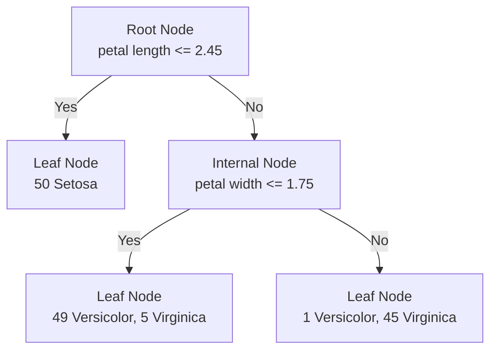
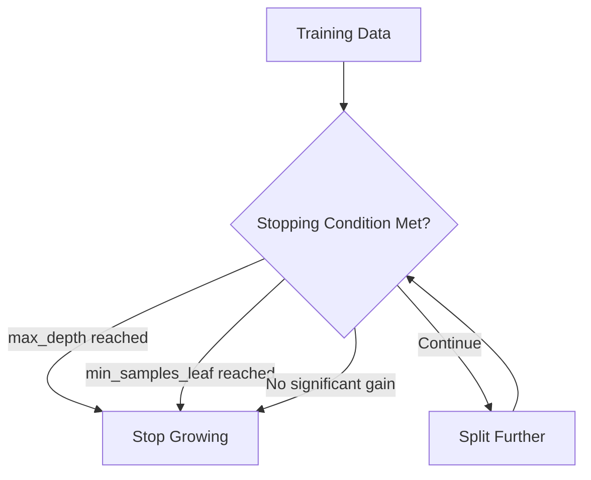
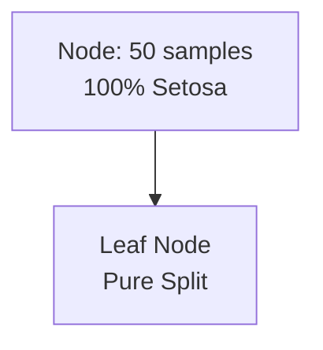
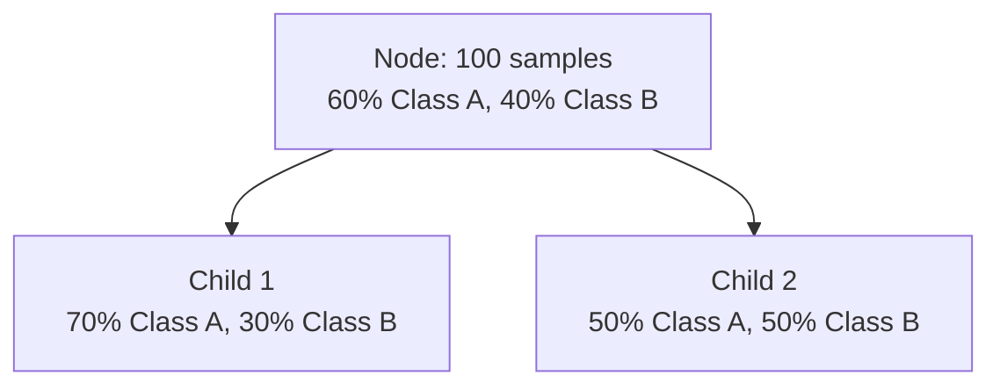

# Chapter 12: Practical Implementation of Decision Tree Classifier

## 🎯 Learning Objectives
- Learn practical implementation of Decision Tree Classifier
- Understand hyperparameter tuning and visualization
- Master pre-pruning and post-pruning techniques
- Implement decision trees on real datasets

## 📚 Key Concepts

### 12.1 Decision Tree Classifier Implementation

**Core Process**: Load data → Train model → Visualize tree → Evaluate performance

**Key Libraries**:
```python
import pandas as pd
import matplotlib.pyplot as plt
from sklearn.datasets import load_iris
from sklearn.tree import DecisionTreeClassifier, plot_tree
from sklearn.model_selection import train_test_split
from sklearn.metrics import accuracy_score, classification_report
```

### 12.2 Iris Dataset Example

**Dataset Features**:
- **Sepal Length** (cm)
- **Sepal Width** (cm)
- **Petal Length** (cm)
- **Petal Width** (cm)

**Target Classes**:
- **Setosa** (Class 0)
- **Versicolor** (Class 1)
- **Virginica** (Class 2)

### 12.3 Basic Implementation

```python
# Load dataset
iris = load_iris()
X = iris.data  # Features: 4 columns
y = iris.target  # Target: 3 classes

# Initialize classifier
dt_classifier = DecisionTreeClassifier(
    criterion='gini',        # 'gini' or 'entropy'
    splitter='best',         # 'best' or 'random'
    random_state=42
)

# Train model
dt_classifier.fit(X, y)

# Make predictions
y_pred = dt_classifier.predict(X)
```

### 12.4 Decision Tree Visualization

**Visualizing the Trained Tree**:
```python
import matplotlib.pyplot as plt
from sklearn import tree

# Set figure size
plt.figure(figsize=(15, 10))

# Plot tree
tree.plot_tree(
    dt_classifier,
    feature_names=iris.feature_names,
    class_names=iris.target_names,
    filled=True,              # Color nodes by class
    rounded=True,            # Rounded node corners
    fontsize=10
)

plt.title("Decision Tree for Iris Classification")
plt.show()
```

**Understanding the Tree Structure**:



### 12.5 Decision Tree Hyperparameters

#### Key Hyperparameters:

1. **criterion**: 'gini' (default) or 'entropy'
2. **splitter**: 'best' (default) or 'random'
3. **max_depth**: Maximum depth of tree
4. **min_samples_split**: Minimum samples required to split
5. **min_samples_leaf**: Minimum samples in leaf node
6. **max_features**: Number of features to consider
7. **random_state**: Random seed for reproducibility

```python
# Example with hyperparameters
dt_classifier = DecisionTreeClassifier(
    criterion='gini',
    splitter='best',
    max_depth=3,
    min_samples_split=4,
    min_samples_leaf=2,
    max_features=None,
    random_state=42
)
```

### 12.6 Pre-Pruning (Hyperparameter Tuning)

**Purpose**: Prevent overfitting by limiting tree growth during training

**Pre-Pruning Strategies**:



**Hyperparameter Tuning Example**:
```python
from sklearn.model_selection import GridSearchCV

# Define parameter grid
param_grid = {
    'criterion': ['gini', 'entropy'],
    'max_depth': [3, 5, 7, 10, None],
    'min_samples_split': [2, 5, 10],
    'min_samples_leaf': [1, 2, 4],
    'max_features': [None, 'sqrt', 'log2', 2, 3, 4]
}

# Initialize GridSearchCV
grid_search = GridSearchCV(
    DecisionTreeClassifier(random_state=42),
    param_grid,
    cv=5,
    scoring='accuracy',
    n_jobs=-1
)

# Fit to find best parameters
grid_search.fit(X_train, y_train)

# Best parameters
print(f"Best parameters: {grid_search.best_params_}")
print(f"Best cross-validation accuracy: {grid_search.best_score_:.4f}")

# Use best model
best_dt = grid_search.best_estimator_
```

### 12.7 Post-Pruning (Cost Complexity Pruning)

**Purpose**: Grow full tree, then remove branches that don't improve validation performance

**Cost Complexity Pruning Parameter**: α (alpha)
- **α = 0**: No pruning (full tree)
- **α > 0**: More pruning as α increases

```python
# Get effective alphas for pruning
path = dt_classifier.cost_complexity_pruning_path(X_train, y_train)
ccp_alphas = path.ccp_alphas
impurities = path.impurities

# Train trees with different alphas
clfs = []
for ccp_alpha in ccp_alphas:
    clf = DecisionTreeClassifier(
        random_state=42,
        ccp_alpha=ccp_alpha
    )
    clf.fit(X_train, y_train)
    clfs.append(clf)

# Find optimal alpha using cross-validation
from sklearn.model_selection import cross_val_score

alpha_scores = []
for clf in clfs:
    scores = cross_val_score(clf, X_train, y_train, cv=5)
    alpha_scores.append(scores.mean())

# Find best alpha
best_alpha_index = alpha_scores.index(max(alpha_scores))
best_alpha = ccp_alphas[best_alpha_index]
best_pruned_tree = clfs[best_alpha_index]
```

### 12.8 Train-Test Split and Evaluation

```python
# Split data
X_train, X_test, y_train, y_test = train_test_split(
    X, y, test_size=0.3, random_state=42, stratify=y
)

# Train best model
best_dt.fit(X_train, y_train)

# Make predictions
y_train_pred = best_dt.predict(X_train)
y_test_pred = best_dt.predict(X_test)

# Evaluate
train_accuracy = accuracy_score(y_train, y_train_pred)
test_accuracy = accuracy_score(y_test, y_test_pred)

print(f"Training Accuracy: {train_accuracy:.4f}")
print(f"Test Accuracy: {test_accuracy:.4f}")
print(f"Overfitting Gap: {train_accuracy - test_accuracy:.4f}")

# Detailed classification report
print("\nTest Set Classification Report:")
print(classification_report(y_test, y_test_pred, target_names=iris.target_names))
```

### 12.9 Feature Importance Analysis

```python
# Get feature importance
feature_importance = pd.DataFrame({
    'feature': iris.feature_names,
    'importance': best_dt.feature_importances_
}).sort_values('importance', ascending=False)

print("Feature Importance:")
print(feature_importance)

# Plot feature importance
plt.figure(figsize=(10, 6))
plt.bar(feature_importance['feature'], feature_importance['importance'])
plt.title('Feature Importance in Decision Tree')
plt.xlabel('Features')
plt.ylabel('Importance')
plt.xticks(rotation=45)
plt.tight_layout()
plt.show()
```

### 12.10 Practical Implementation Checklist

#### Data Preparation:
- [ ] Load and explore dataset
- [ ] Check for missing values
- [ ] Handle categorical features (if any)
- [ ] Split features and target
- [ ] Train-test split

#### Model Training:
- [ ] Initialize DecisionTreeClassifier
- [ ] Fit model on training data
- [ ] Visualize the decision tree
- [ ] Analyze tree structure

#### Hyperparameter Tuning:
- [ ] Define parameter grid
- [ ] Use GridSearchCV for optimization
- [ ] Select best parameters
- [ ] Train final model

#### Evaluation:
- [ ] Make predictions on test set
- [ ] Calculate accuracy metrics
- [ ] Generate classification report
- [ ] Analyze confusion matrix
- [ ] Check for overfitting

#### Analysis:
- [ ] Examine feature importance
- [ ] Visualize decision boundaries
- [ ] Interpret tree rules
- [ ] Document findings

### 12.11 Common Decision Tree Patterns

#### Perfect Split:


#### Mixed Split:


#### Overfitting Indicators:
- Very deep trees (depth > 10-15)
- Training accuracy ≈ 100%, test accuracy much lower
- Many leaf nodes with 1-2 samples
- Complex branching patterns

## ❓ Interview Questions & Answers

### Q1: How do you interpret a decision tree visualization?
**Answer**:
- **Root node**: First splitting condition
- **Internal nodes**: Decision points with conditions
- **Leaf nodes**: Final predictions
- **Colors**: Different classes
- **Numbers**: Sample counts, class distribution

### Q2: What's the difference between pre-pruning and post-pruning?
**Answer**:
- **Pre-pruning**: Stop tree growth during training using hyperparameters (max_depth, min_samples_leaf)
- **Post-pruning**: Grow full tree, then remove branches using cost complexity pruning

### Q3: How do you choose between Gini and Entropy?
**Answer**:
- **Gini**: Faster computation, sklearn default
- **Entropy**: More theoretically sound, slightly slower
- **Performance**: Usually similar, test both if unsure

### Q4: What does feature importance tell you in decision trees?
**Answer**: How much each feature contributes to reducing impurity across all splits. Higher importance means the feature is more effective at creating pure classifications.

### Q5: How do you detect overfitting in decision trees?
**Answer**:
- Large gap between training and test accuracy
- Very deep tree structure
- Many leaf nodes with very few samples
- Complex, hard-to-interpret decision rules

### Q6: Why might you choose a random splitter over best splitter?
**Answer**: Random splitter can sometimes prevent overfitting by introducing randomness in feature selection, though 'best' usually performs better.

### Q7: How does max_features work in decision trees?
**Answer**: Limits the number of features considered when looking for best split. Options: None (all features), sqrt, log2, or specific integer.

### Q8: What is stratified sampling in train_test_split?
**Answer**: Ensures the class distribution in train and test sets is similar to the original dataset, important for imbalanced datasets.

## 💡 Key Takeaways

1. **Visualization**: Decision trees are interpretable and can be visualized
2. **Hyperparameter Tuning**: Use GridSearchCV to find optimal parameters
3. **Pruning**: Both pre-pruning (early stopping) and post-pruning techniques
4. **Overfitting**: Monitor train-test accuracy gap
5. **Feature Importance**: Understand which features drive decisions
6. **Evaluation**: Use multiple metrics (accuracy, precision, recall, F1)
7. **Practical Tips**: Start with default parameters, then tune based on performance

## 🚨 Common Mistakes

**Mistake 1**: Not using train_test_split
- **Reality**: Always split data to evaluate generalization performance

**Mistake 2**: Letting trees grow too deep without constraints
- **Reality**: Use max_depth and min_samples_leaf to prevent overfitting

**Mistake 3**: Only looking at accuracy
- **Reality**: Use precision, recall, F1, especially for imbalanced datasets

**Mistake 4**: Ignoring feature importance
- **Reality**: Feature importance helps understand model and reduce features

**Mistake 5**: Not tuning hyperparameters
- **Reality**: Default parameters rarely optimal, use GridSearchCV

## 📝 Quick Revision Points

- **Implementation**: Load data → Train → Visualize → Evaluate
- **Visualization**: tree.plot_tree() for interpretability
- **Hyperparameters**: criterion, max_depth, min_samples_leaf
- **Pre-pruning**: Stop growth using hyperparameters
- **Post-pruning**: Cost complexity pruning with alpha parameter
- **Evaluation**: accuracy, classification_report, confusion matrix
- **Feature Importance**: Understand model decisions
- **Overfitting**: Monitor train-test performance gap