# Chapter 13: Ensemble Bagging and Boosting Techniques

## 🎯 Learning Objectives
- Understand ensemble learning concepts
- Master bagging vs boosting techniques
- Learn bootstrap aggregation and weak learners
- Understand when to use ensemble methods

## 📚 Key Concepts

### 13.1 What is Ensemble Learning?

**Definition**: Using multiple algorithms/models to solve a single problem, then combining their predictions

**Core Idea**: "Wisdom of crowds" - combining multiple models often gives better performance than any single model

### 13.2 Ensemble vs Single Model

| Aspect | Single Model | Ensemble Method |
|--------|---------------|------------------|
| **Approach** | One algorithm | Multiple algorithms |
| **Performance** | Limited by single model | Usually better |
| **Robustness** | Prone to overfitting | More robust |
| **Complexity** | Simple to implement | More complex |
| **Training Time** | Fast | Slower (multiple models) |
| **Interpretability** | Easy | More difficult |

### 13.3 Bagging (Bootstrap Aggregating)

**Concept**: Train multiple models in parallel on different subsets of data, then aggregate predictions

#### How Bagging Works:

```mermaid
flowchart TD
    A["Original Dataset D<br/>10,000 samples"] --> B["Bootstrap Sample D'₁<br/>6,000 samples<br/>Row Sampling"]
    A --> C["Bootstrap Sample D'₂<br/>6,000 samples<br/>Row Sampling"]
    A --> D["Bootstrap Sample D'₃<br/>6,000 samples<br/>Row Sampling"]
    A --> E["Bootstrap Sample D'₄<br/>6,000 samples<br/>Row Sampling"]

    B --> F["Model 1<br/>Logistic Regression"]
    C --> G["Model 2<br/>Decision Tree"]
    D --> H["Model 3<br/>KNN"]
    E --> I["Model 4<br/>Decision Tree"]

    F --> J["Prediction 1: 0"]
    G --> K["Prediction 2: 1"]
    H --> L["Prediction 3: 1"]
    I --> M["Prediction 4: 1"]

    J --> N["Majority Voting<br/>Output: 1"]
    K --> N
    L --> N
    M --> N
```

#### Key Characteristics of Bagging:

1. **Parallel Training**: Models train independently
2. **Bootstrap Sampling**: Random sampling with replacement
3. **Row Sampling**: Different subsets of training data
4. **Aggregation**: Majority vote (classification) or average (regression)

#### Example Calculation:

**Classification**:
- Model 1: Predicts 0
- Model 2: Predicts 1
- Model 3: Predicts 1
- Model 4: Predicts 1
- **Final Prediction**: 1 (majority vote)

**Regression**:
- Model 1: Predicts 120
- Model 2: Predicts 140
- Model 3: Predicts 122
- Model 4: Predicts 148
- **Final Prediction**: (120+140+122+148)/4 = 132.5

### 13.4 Boosting

**Concept**: Train models sequentially, where each model focuses on correcting errors made by previous models

#### How Boosting Works:

#### Key Characteristics of Boosting:

1. **Sequential Training**: Models train one after another
2. **Error Focus**: Each model focuses on previous errors
3. **Weight Updates**: Misclassified samples get higher weights
4. **Weak Learners**: Individual models are simple (often just slightly better than random)
5. **Strong Learner**: Combined model achieves high performance

#### Weak Learners to Strong Learner:

**Weak Learner Examples**:
- Decision stump (1-level decision tree)
- Simple logistic regression
- Very shallow decision trees

**Example**:
- **Model 1**: 60% accuracy (weak learner)
- **Model 2**: 65% accuracy (corrects some errors of Model 1)
- **Model 3**: 68% accuracy (corrects remaining errors)
- **Combined Model**: 85% accuracy (strong learner)

### 13.5 Bagging vs Boosting Comparison

| Aspect | Bagging | Boosting |
|--------|---------|----------|
| **Training** | Parallel | Sequential |
| **Model Type** | Any type | Usually weak learners |
| **Data Usage** | Bootstrap samples | Full dataset with weights |
| **Error Handling** | Reduces variance | Reduces bias |
| **Overfitting** | Less prone | More prone |
| **Performance** | Consistent improvement | Can achieve very high performance |
| **Example Algorithms** | Random Forest | AdaBoost, Gradient Boosting, XGBoost |

### 13.6 When to Use Ensemble Methods

#### Use Bagging When:
- High variance models (like deep decision trees)
- Want to reduce overfitting
- Have sufficient computational resources
- Want stable, consistent performance

#### Use Boosting When:
- High bias models (underfitting)
- Want maximum performance
- Have time for sequential training
- Can handle potential overfitting with proper tuning

### 13.7 Bias-Variance Tradeoff in Ensembles

**Effect on Bias-Variance**:
- **Bagging**: Reduces variance, keeps bias similar
- **Boosting**: Reduces bias, may increase variance

### 13.8 Popular Ensemble Algorithms

#### Bagging Algorithms:
- **Random Forest**: Bagging with decision trees
- **Bagged Decision Trees**: Simple bagging with trees
- **Bagged KNN**: Bagging with KNN algorithm

#### Boosting Algorithms:
- **AdaBoost**: Adaptive Boosting
- **Gradient Boosting**: Gradient-based boosting
- **XGBoost**: Extreme Gradient Boosting
- **LightGBM**: Light Gradient Boosting Machine

### 13.9 Practical Implementation Considerations

#### Number of Models:

#### Computational Requirements:
- **Bagging**: Can be parallelized, faster training
- **Boosting**: Sequential, slower training
- **Memory**: Store multiple models
- **Prediction**: Multiple model evaluations

### 13.10 Real-World Applications

#### Kaggle Competitions:
- Most winning solutions use ensemble methods
- XGBoost and LightGBM are extremely popular
- Ensemble of different algorithms often performs best

#### Industry Applications:
- **Fraud Detection**: Boosting algorithms
- **Recommendation Systems**: Random Forest
- **Medical Diagnosis**: Ensemble of multiple algorithms
- **Financial Risk Assessment**: Gradient Boosting

## ❓ Interview Questions & Answers

### Q1: What is the difference between bagging and boosting?
**Answer**:
- **Bagging**: Parallel training of independent models on bootstrap samples, reduces variance
- **Boosting**: Sequential training where each model corrects previous errors, reduces bias

### Q2: Why does bagging reduce variance but not bias?
**Answer**: Bagging creates multiple diverse models through bootstrap sampling. When averaging predictions, individual model errors cancel out, reducing variance. But since each model sees similar data patterns, the overall bias remains similar.

### Q3: What are weak learners in boosting?
**Answer**: Weak learners are simple models that perform slightly better than random guessing (e.g., decision stumps, shallow trees). In boosting, multiple weak learners combine to create a strong learner with high performance.

### Q4: How does boosting handle misclassified samples?
**Answer**: Boosting increases the weights of misclassified samples, making subsequent models focus more on getting these difficult cases right. This adaptive focus helps improve overall performance.

### Q5: Can ensemble methods overfit?
**Answer**: Yes, especially boosting algorithms. Bagging is less prone to overfitting, but boosting can overfit if too many models are used or if weak learners are too complex.

### Q6: What is bootstrap sampling?
**Answer**: Bootstrap sampling is random sampling with replacement from the original dataset. Each bootstrap sample has the same size as the original but contains some duplicate and some missing samples.

### Q7: How do ensemble methods handle ties in classification?
**Answer**: With many models (typically 100+), ties are rare. If a tie occurs, common solutions include:
- Random selection among tied classes
- Using weighted voting
- Adding one more model to break the tie

### Q8: Why are Random Forests popular?
**Answer**: Random Forests combine bagging with decision trees, creating robust models that:
- Reduce overfitting compared to single trees
- Handle both regression and classification
- Provide feature importance
- Work well with minimal hyperparameter tuning

## 💡 Key Takeaways

1. **Ensemble Learning**: Multiple models combined for better performance
2. **Bagging**: Parallel training, reduces variance, bootstrap sampling
3. **Boosting**: Sequential training, reduces bias, error-focused
4. **Weak Learners**: Simple models that improve when combined
5. **Strong Learners**: Combined weak learners achieving high performance
6. **Aggregation**: Majority vote (classification) or averaging (regression)
7. **Trade-offs**: Bias-variance, computation vs performance

## 🚨 Common Mistakes

**Mistake 1**: Using ensembles for very small datasets
- **Reality**: Ensembles need sufficient data to benefit from multiple models

**Mistake 2**: Not tuning ensemble hyperparameters
- **Reality**: Number of models, depth, learning rates need optimization

**Mistake 3**: Using boosting without monitoring overfitting
- **Reality**: Boosting can overfit, need validation monitoring

**Mistake 4**: Ignoring computational costs
- **Reality**: Ensembles require more memory and computation time

**Mistake 5**: Using same model type in all ensemble members
- **Reality**: Diversity in models often leads to better ensembles

## 📝 Quick Revision Points

- **Ensemble**: Multiple models combined for better predictions
- **Bagging**: Parallel training, bootstrap samples, reduces variance
- **Boosting**: Sequential training, error focus, reduces bias
- **Weak Learners**: Simple models (slightly better than random)
- **Strong Learner**: Combined weak learners with high performance
- **Aggregation**: Majority vote (classification) or average (regression)
- **Random Forest**: Bagging with decision trees
- **AdaBoost/XGBoost**: Popular boosting algorithms