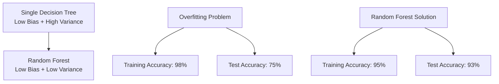
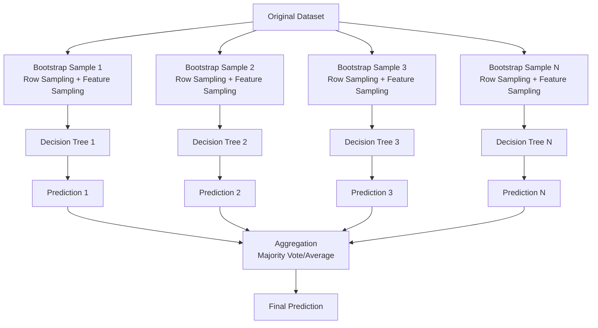

# Chapter 14: Random Forest Classifier and Regressor

## 🎯 Learning Objectives
- Understand Random Forest algorithm and its advantages
- Learn row and feature sampling in Random Forest
- Master Random Forest for both classification and regression
- Understand when to use Random Forest vs Decision Trees

## 📚 Key Concepts

### 14.1 What is Random Forest?

**Definition**: An ensemble learning method that combines multiple decision trees using bagging technique with additional random feature selection

**Core Problem Solved**: Addresses overfitting in decision trees by reducing variance while maintaining low bias



### 14.2 How Random Forest Works

#### Step-by-Step Process:



### 14.3 Key Components of Random Forest

#### 1. Bootstrap Sampling (Row Sampling)
- Random sampling with replacement
- Each sample is same size as original dataset
- Some samples may be repeated, others may be missing
- Creates diversity among trees

#### 2. Random Feature Selection
- At each split, only considers random subset of features
- Typically: √(total_features) for classification
- Typically: total_features/3 for regression
- Further increases tree diversity

#### 3. Multiple Decision Trees
- All trees are decision trees
- Each tree trained on different data subset
- Trees can grow deep without overfitting concerns

#### 4. Aggregation
- **Classification**: Majority voting
- **Regression**: Average of all predictions

### 14.4 Random Forest Example

#### Dataset with 4 Features: ["F1, F2, F3, F4"]

**Tree 1**: Gets 60% rows + features ["F1, F3"]
**Tree 2**: Gets 60% rows + features ["F2, F4"]
**Tree 3**: Gets 60% rows + features ["F1, F2, F4"]
**Tree 4**: Gets 60% rows + features ["F1, F3, F4"]

**Prediction Process**:
- New data point → All trees
- Tree 1 predicts: Class 0
- Tree 2 predicts: Class 1
- Tree 3 predicts: Class 0
- Tree 4 predicts: Class 0
- **Final Prediction**: Class 0 (majority vote)

### 14.5 Random Forest vs Decision Tree

| Aspect | Decision Tree | Random Forest |
|--------|---------------|----------------|
| **Overfitting** | High risk | Low risk |
| **Bias** | Low | Low |
| **Variance** | High | Low |
| **Training Time** | Fast | Slower |
| **Prediction Time** | Fast | Slower |
| **Interpretability** | High | Low |
| **Performance** | Good | Usually Better |
| **Robustness** | Sensitive to data | More robust |

### 14.6 Random Forest Hyperparameters

#### Important Parameters:

1. **n_estimators**: Number of trees in forest (default: 100)
2. **max_depth**: Maximum depth of trees
3. **min_samples_split**: Minimum samples to split node
4. **min_samples_leaf**: Minimum samples in leaf node
5. **max_features**: Number of features to consider
   - Classification: √(n_features) or "sqrt"
   - Regression: n_features/3 or "auto"
6. **bootstrap**: Whether to use bootstrap sampling (default: True)
7. **random_state**: Random seed for reproducibility

```python
# Example Random Forest with hyperparameters
rf_classifier = RandomForestClassifier(
    n_estimators=100,
    max_depth=10,
    min_samples_split=5,
    min_samples_leaf=2,
    max_features='sqrt',
    bootstrap=True,
    random_state=42
)
```

### 14.7 Random Forest Classifier Implementation

```python
from sklearn.ensemble import RandomForestClassifier
from sklearn.model_selection import train_test_split
from sklearn.metrics import accuracy_score, classification_report
import pandas as pd

# Split data
X_train, X_test, y_train, y_test = train_test_split(
    X, y, test_size=0.3, random_state=42, stratify=y
)

# Initialize Random Forest
rf_classifier = RandomForestClassifier(
    n_estimators=100,
    max_depth=10,
    random_state=42
)

# Train model
rf_classifier.fit(X_train, y_train)

# Make predictions
y_train_pred = rf_classifier.predict(X_train)
y_test_pred = rf_classifier.predict(X_test)

# Evaluate
train_accuracy = accuracy_score(y_train, y_train_pred)
test_accuracy = accuracy_score(y_test, y_test_pred)

print(f"Training Accuracy: {"train_accuracy:.4f"}")
print(f"Test Accuracy: {"test_accuracy:.4f"}")
print(f"Overfitting Gap: {"train_accuracy - test_accuracy:.4f"}")

# Feature importance
feature_importance = pd.DataFrame({
    'feature': X.columns,
    'importance': rf_classifier.feature_importances_
}).sort_values('importance', ascending=False)

print("\nFeature Importance:")
print(feature_importance)
```

### 14.8 Random Forest Regressor Implementation

```python
from sklearn.ensemble import RandomForestRegressor
from sklearn.metrics import mean_squared_error, r2_score

# Initialize Random Forest Regressor
rf_regressor = RandomForestRegressor(
    n_estimators=100,
    max_depth=10,
    random_state=42
)

# Train model
rf_regressor.fit(X_train, y_train)

# Make predictions
y_train_pred = rf_regressor.predict(X_train)
y_test_pred = rf_regressor.predict(X_test)

# Evaluate
train_mse = mean_squared_error(y_train, y_train_pred)
test_mse = mean_squared_error(y_test, y_test_pred)
train_r2 = r2_score(y_train, y_train_pred)
test_r2 = r2_score(y_test, y_test_pred)

print(f"Train MSE: {"train_mse:.4f"}, Test MSE: {"test_mse:.4f"}")
print(f"Train R²: {"train_r2:.4f"}, Test R²: {"test_r2:.4f"}")
```

### 14.9 Feature Importance in Random Forest

**How it's calculated**:
1. For each tree, measure how much each feature reduces impurity
2. Average across all trees
3. Normalize to sum to 1

**Interpretation**:
- Higher importance = more important for predictions
- Sum of all importances = 1
- Can be used for feature selection

### 14.10 Advantages and Disadvantages

#### Advantages:
- **Reduces Overfitting**: Averaging multiple trees
- **Handles High Dimensionality**: Feature selection built-in
- **Robust to Outliers**: Majority voting reduces outlier impact
- **Works with Missing Values**: Can handle missing data
- **No Feature Scaling**: Works with raw features
- **Provides Feature Importance**: Built-in feature selection
- **Parallelizable**: Trees can be trained in parallel

#### Disadvantages:
- **Less Interpretable**: Hard to understand individual decisions
- **Computationally Expensive**: Many trees to train
- **Memory Intensive**: Stores multiple complete trees
- **Prediction Slower**: Need to evaluate all trees
- **Black Box**: Hard to explain predictions

### 14.11 Random Forest Properties

#### Out of Bag (OOB) Error:
- Each tree sees ~63% of training data
- Remaining ~37% is "out-of-bag" samples
- Can be used for validation without separate test set

```python
# Enable OOB scoring
rf_classifier = RandomForestClassifier(
    n_estimators=100,
    oob_score=True,
    random_state=42
)
rf_classifier.fit(X_train, y_train)
print(f"OOB Score: {"rf_classifier.oob_score_:.4f"}")
```

### 14.12 Common Interview Questions

#### Q1: Is normalization required for Random Forest?
**Answer**: No. Random Forest makes decisions based on feature thresholds, not distances. The relative ordering matters, not absolute scales.

#### Q2: Is Random Forest affected by outliers?
**Answer**: No, Random Forest is robust to outliers. Majority voting averages out the impact of individual outliers across multiple trees.

#### Q3: How does Random Forest prevent overfitting?
**Answer**: Through bagging (bootstrap sampling) and feature randomness. Each tree sees different data subsets, and averaging predictions reduces variance.

#### Q4: What happens to bias and variance in Random Forest?
**Answer**: Maintains low bias (like decision trees) but reduces high variance through ensemble averaging.

#### Q5: How many features should Random Forest consider?
**Answer**:
- Classification: √(n_features) by default
- Regression: n_features/3 by default
- Can be tuned based on performance

## ❓ Interview Questions & Answers

### Q1: Why use Random Forest instead of a single Decision Tree?
**Answer**: Random Forest reduces overfitting by combining multiple trees. Single trees have high variance and are prone to overfitting, while Random Forest averages predictions to achieve low bias and low variance.

### Q2: Explain the role of bootstrap sampling in Random Forest.
**Answer**: Bootstrap sampling creates diversity among trees by training each tree on different random subsets of data. This diversity is key to reducing variance when predictions are aggregated.

### Q3: How does Random Forest handle feature selection?
**Answer**: At each split, Random Forest considers only a random subset of features (typically √n for classification). This prevents dominant features from always being selected and creates more diverse trees.

### Q4: What is the ideal number of trees in Random Forest?
**Answer**: Typically 100-500 trees. More trees provide better performance but with diminishing returns. The optimal number depends on dataset size and computational resources.

### Q5: Can Random Forest be used for both classification and regression?
**Answer**: Yes. RandomForestClassifier for classification (majority voting) and RandomForestRegressor for regression (averaging predictions).

### Q6: How do you interpret Random Forest feature importance?
**Answer**: Feature importance measures how much each feature contributes to reducing impurity across all trees. Higher importance means the feature is more effective at making accurate predictions.

### Q7: What is Out-of-Bag (OOB) error in Random Forest?
**Answer**: OOB error is validation error calculated using samples not seen by each tree during training. Each tree is tested on ~37% of data it didn't see, providing built-in cross-validation.

### Q8: Why is Random Forest robust to outliers?
**Answer**: Because individual outliers affect only some trees, and majority voting/averaging reduces their impact on final prediction.

## 💡 Key Takeaways

1. **Ensemble Method**: Combines multiple decision trees
2. **Reduces Overfitting**: Addresses high variance of single trees
3. **Bootstrap Sampling**: Random row sampling with replacement
4. **Feature Randomness**: Random feature selection at each split
5. **Aggregation**: Majority vote (classification) or average (regression)
6. **Feature Importance**: Built-in feature selection capability
7. **Robustness**: Handles outliers and missing values well

## 🚨 Common Mistakes

**Mistake 1**: Using Random Forest for very small datasets
- **Reality**: Needs sufficient data for bootstrap sampling to be effective

**Mistake 2**: Not tuning n_estimators
- **Reality**: Too few trees = underfitting, too many = unnecessary computation

**Mistake 3**: Ignoring feature importance
- **Reality**: Feature importance can help reduce dimensionality and improve interpretability

**Mistake 4**: Using max_features = None for high-dimensional data
- **Reality**: Consider subset of features for better generalization

**Mistake 5**: Not checking OOB score
- **Reality**: OOB score provides free cross-validation estimate

## 📝 Quick Revision Points

- **Random Forest**: Ensemble of decision trees with bagging
- **Bootstrap**: Random sampling with replacement
- **Feature Randomness**: Random feature subset at each split
- **Aggregation**: Majority vote (classification) or average (regression)
- **Hyperparameters**: n_estimators, max_depth, max_features
- **Overfitting**: Reduced compared to single decision trees
- **Feature Importance**: Built-in mechanism for feature selection
- **OOB Error**: Built-in cross-validation using out-of-bag samples
- **Robustness**: Handles outliers and missing values well