# Chapter 15: Boosting AdaBoost Machine Learning Algorithms

## 🎯 Learning Objectives
- Understand AdaBoost algorithm and its sequential learning approach
- Learn weak learners (stumps) and weight updating mechanism
- Master mathematical foundations of AdaBoost
- Understand how AdaBoost combines weak learners into strong learners

## 📚 Key Concepts

### 15.1 What is AdaBoost?

**Definition**: Adaptive Boosting (AdaBoost) is a boosting algorithm that combines multiple weak learners (typically decision stumps) sequentially to create a strong classifier

**Core Concept**: "Many weak minds make one strong mind" - combine simple models that are slightly better than random


### 15.2 Weak Learners (Decision Stumps)

**Definition**: Decision stumps are decision trees with only one level (one root node and two leaf nodes)

**Characteristics**:
- Simple models with low complexity
- Performance slightly better than random guessing
- Fast to train and predict
- Focus on single most important feature

```mermaid
flowchart TD
    A["Feature F1 ≤ threshold"] -->|Yes| B["Leaf: Class A"]
    A -->|No| C["Leaf: Class B"]
```



### 15.3 AdaBoost Step-by-Step Process

#### Step 1: Initialize Sample Weights

**Dataset**: 7 samples with features ["F1, F2, F3, F4"] and target ["Yes/No"]

**Initial Weights**: Equal weights for all samples
```
Total samples = 7
Initial weight = 1/7 ≈ 0.143 for each sample
```

#### Step 2: Train First Weak Learner

1. **Select Best Feature**: Using Information Gain/Entropy
2. **Create Decision Stump**: One-level decision tree
3. **Make Predictions**: Classify all samples
4. **Calculate Errors**: Count misclassifications

**Example**:
- Total samples: 7
- Misclassified samples: 1
- **Total Error (TE)** = 1/7 ≈ 0.143

#### Step 3: Calculate Performance of Stump

**Formula**:
```
Performance = 0.5 * log((1 - TE) / TE)
```

**Calculation**:
```
Performance = 0.5 * log((1 - 0.143) / 0.143)
Performance = 0.5 * log(0.857 / 0.143)
Performance = 0.5 * log(5.99)
Performance = 0.5 * 1.79 = 0.895
```

#### Step 4: Update Sample Weights

**Purpose**: Increase weights for misclassified samples, decrease for correctly classified

**Weight Update Formulas**:
```
For Correct Samples: New Weight = Old Weight × e^(-Performance)
For Incorrect Samples: New Weight = Old Weight × e^(+Performance)
```

**Calculations**:
- **Correct Samples**: (1/7) × e^(-0.895) = 0.05
- **Incorrect Sample**: (1/7) × e^(0.895) = 0.349

**Updated Weights**: ["0.05, 0.05, 0.05, 0.349, 0.05, 0.05, 0.05"]

#### Step 5: Normalize Weights

**Purpose**: Ensure sum of all weights = 1

**Calculation**:
```
Sum of weights = 0.05 × 6 + 0.349 = 0.649
Normalized weights = Original weights / 0.649
```

**Normalized Weights**: ["0.077, 0.077, 0.077, 0.537, 0.077, 0.077, 0.077"]

#### Step 6: Create Buckets for Next Learner

**Purpose**: Probability-based selection of samples for next weak learner


**Selection Process**:
- Generate random numbers between 0-1
- Larger weight = larger bucket = higher selection probability
- Misclassified samples more likely to be selected

#### Step 7: Sequential Training Process

Repeat Steps 2-6 for multiple weak learners (typically 50-500)


### 15.4 Final Prediction

**Classification**: Weighted majority vote
- Each weak learner has weight based on its performance
- Better performers get more voting power

**Regression**: Weighted average of predictions

**Example**:
```
Stump 1 (Performance: 0.895) → Predicts: 1
Stump 2 (Performance: 0.642) → Predicts: 0
Stump 3 (Performance: 0.501) → Predicts: 1

Final Prediction = Weighted vote = 1
```

### 15.5 Mathematical Foundation

#### Total Error (TE):
```
TE = (Sum of weights of misclassified samples) / (Total weight)
```

#### Alpha (Performance):
```
alpha = 0.5 × log((1 - TE) / TE)
```

#### Weight Update:
```
For correct classification: w_new = w_old × e^(-alpha)
For incorrect classification: w_new = w_old × e^(alpha)
```

#### Normalization:
```
w_normalized = w_new / Σ(w_new)
```

### 15.6 AdaBoost Algorithm Summary

```python
def adaboost_algorithm(X, y, n_estimators):
    # Step 1: Initialize weights
    n_samples = len(X)
    weights = np.ones(n_samples) / n_samples

    weak_learners = [""]
    alphas = [""]

    for estimator in range(n_estimators):
        # Step 2: Train weak learner
        stump = DecisionTreeClassifier(max_depth=1)
        stump.fit(X, y, sample_weight=weights)

        # Step 3: Make predictions
        predictions = stump.predict(X)

        # Step 4: Calculate total error
        incorrect = (predictions != y)
        total_error = np.sum(weights["incorrect"])

        # Step 5: Calculate alpha (performance)
        alpha = 0.5 * np.log((1 - total_error) / total_error)

        # Step 6: Update weights
        weights["incorrect"] *= np.exp(alpha)
        weights["~incorrect"] *= np.exp(-alpha)

        # Step 7: Normalize weights
        weights /= np.sum(weights)

        # Store results
        weak_learners.append(stump)
        alphas.append(alpha)

    return weak_learners, alphas
```

### 15.7 Practical Implementation

```python
from sklearn.ensemble import AdaBoostClassifier
from sklearn.tree import DecisionTreeClassifier
from sklearn.model_selection import train_test_split
from sklearn.metrics import accuracy_score, classification_report

# Split data
X_train, X_test, y_train, y_test = train_test_split(
    X, y, test_size=0.3, random_state=42, stratify=y
)

# Initialize AdaBoost
ada_classifier = AdaBoostClassifier(
    base_estimator=DecisionTreeClassifier(max_depth=1),  # Stumps
    n_estimators=50,           # Number of weak learners
    learning_rate=1.0,         # Shrinkage for alpha values
    random_state=42
)

# Train model
ada_classifier.fit(X_train, y_train)

# Make predictions
y_train_pred = ada_classifier.predict(X_train)
y_test_pred = ada_classifier.predict(X_test)

# Evaluate
train_accuracy = accuracy_score(y_train, y_train_pred)
test_accuracy = accuracy_score(y_test, y_test_pred)

print(f"Training Accuracy: {"train_accuracy:.4f"}")
print(f"Test Accuracy: {"test_accuracy:.4f"}")

# Feature importance
feature_importance = pd.DataFrame({
    'feature': X.columns,
    'importance': ada_classifier.feature_importances_
}).sort_values('importance', ascending=False)

print("\nFeature Importance:")
print(feature_importance)
```

### 15.8 AdaBoost Hyperparameters

#### Key Parameters:
1. **base_estimator**: Weak learner (default: DecisionTreeClassifier(max_depth=1))
2. **n_estimators**: Number of weak learners (default: 50)
3. **learning_rate**: Shrinks contribution of each classifier (default: 1.0)
4. **algorithm**: 'SAMME' or 'SAMME.R' (default: 'SAMME.R')
5. **random_state**: Random seed for reproducibility

#### Learning Rate Effect:
- **High learning rate**: Faster learning, risk of overfitting
- **Low learning rate**: Slower learning, better generalization
- **Trade-off**: Often need more estimators with lower learning rate

### 15.9 Advantages and Disadvantages

#### Advantages:
- **High Accuracy**: Often achieves excellent performance
- **Feature Selection**: Built-in feature importance
- **Simple Implementation**: Easy to understand and implement
- **Versatile**: Works with various base learners
- **No Feature Scaling**: Works with raw features

#### Disadvantages:
- **Sensitive to Outliers**: Outliers get high weights
- **Sequential Training**: Cannot be parallelized
- **Overfitting Risk**: Can overfit with too many estimators
- **Noisy Data**: Performance degrades with noisy data
- **Computationally Expensive**: Sequential process is slow

### 15.10 AdaBoost vs Other Algorithms

| Aspect | AdaBoost | Random Forest | Gradient Boosting |
|--------|----------|---------------|-------------------|
| **Training** | Sequential | Parallel | Sequential |
| **Weak Learners** | Stumps | Full trees | Shallow trees |
| **Weight Update** | Sample weights | No weights | Residual errors |
| **Overfitting** | High risk | Low risk | Medium risk |
| **Outliers** | Sensitive | Robust | Sensitive |
| **Speed** | Slow | Fast | Medium |

### 15.11 Real-World Applications

#### Use Cases:
- **Face Detection**: Viola-Jones algorithm uses AdaBoost
- **Text Classification**: Document categorization
- **Medical Diagnosis**: Disease prediction
- **Financial Risk**: Credit scoring
- **Customer Churn**: Customer retention analysis

#### Viola-Jones Face Detection:
- Uses Haar-like features as weak learners
- AdaBoost selects best features
- Real-time face detection capability

## ❓ Interview Questions & Answers

### Q1: What is a weak learner in AdaBoost?
**Answer**: A weak learner is a model that performs slightly better than random guessing. In AdaBoost, we typically use decision stumps (one-level decision trees) as weak learners because they're simple and fast to train.

### Q2: How does AdaBoost handle misclassified samples?
**Answer**: AdaBoost increases the weights of misclassified samples, making them more likely to be selected for training the next weak learner. This forces subsequent models to focus on difficult cases.

### Q3: Why does AdaBoost use decision stumps instead of full decision trees?
**Answer**: Decision stumps are weak learners that provide high bias but low variance. By combining many weak learners sequentially, AdaBoost reduces bias while controlling variance. Using full trees would be too strong and may lead to overfitting.

### Q4: What is the role of the learning rate in AdaBoost?
**Answer**: The learning rate shrinks the contribution of each weak learner. A lower learning rate requires more estimators but often leads to better generalization by preventing overfitting.

### Q5: How does AdaBoost prevent overfitting?
**Answer**: AdaBoost can overfit if there are too many estimators or if data is noisy. Techniques to prevent overfitting include:
- Using fewer estimators
- Lower learning rate
- Early stopping
- Cross-validation

### Q6: Why is AdaBoost sensitive to outliers?
**Answer**: Outliers are consistently misclassified, causing their weights to increase exponentially. This makes subsequent weak learners focus excessively on outliers, potentially degrading overall performance.

### Q7: What is the difference between SAMME and SAMME.R?
**Answer**: SAMME.R uses probability estimates and typically performs better than SAMME, which only uses class predictions. SAMME.R can provide better performance when the base estimator supports probability predictions.

### Q8: How is the final prediction made in AdaBoost?
**Answer**: For classification, it's a weighted majority vote where each weak learner's vote is weighted by its performance (alpha value). For regression, it's a weighted average of all weak learner predictions.

## 💡 Key Takeaways

1. **Sequential Learning**: Models train one after another, each focusing on previous errors
2. **Weak Learners**: Simple models (stumps) that are slightly better than random
3. **Weight Updates**: Misclassified samples get higher weights for next iteration
4. **Strong Learner**: Combined weak learners achieve high performance
5. **Adaptive**: Automatically focuses on difficult cases
6. **Performance**: Often achieves state-of-the-art results
7. **Sensitivity**: Can be sensitive to outliers and noise

## 🚨 Common Mistakes

**Mistake 1**: Using too many estimators without monitoring performance
- **Reality**: More estimators can lead to overfitting, monitor validation performance

**Mistake 2**: Using complex base estimators
- **Reality**: AdaBoost works best with simple weak learners like decision stumps

**Mistake 3**: Not handling outliers before AdaBoost
- **Reality**: Outliers can dominate the learning process

**Mistake 4**: Setting learning rate too high
- **Reality**: High learning rates can cause overfitting and instability

**Mistake 5**: Ignoring feature importance
- **Reality**: Feature importance can provide valuable insights and help with feature selection

## 📝 Quick Revision Points

- **AdaBoost**: Adaptive Boosting, sequential weak learner combination
- **Weak Learners**: Decision stumps (one-level trees)
- **Weight Update**: Increase weights for misclassified samples
- **Alpha**: Performance measure of each weak learner
- **Normalization**: Ensure weights sum to 1 after updates
- **Buckets**: Probability-based selection for next iteration
- **Final Prediction**: Weighted majority vote or average
- **Hyperparameters**: n_estimators, learning_rate, base_estimator
- **Applications**: Face detection, text classification, risk assessment