# Chapter 16: K-Means Clustering Algorithm

## 🎯 Learning Objectives
- Understand unsupervised learning and clustering concepts
- Master K-means algorithm and its working mechanism
- Learn elbow method for optimal K value selection
- Understand WCSS (Within Cluster Sum of Squares) and centroid updates

## 📚 Key Concepts

### 16.1 What is K-Means Clustering?

**Definition**: K-means is an unsupervised machine learning algorithm that groups similar data points into K clusters

**Key Characteristics**:
- **Unsupervised**: No output/target variable needed
- **Centroid-based**: Each cluster has a center point
- **Iterative**: Continuously updates until convergence
- **Distance-based**: Uses Euclidean distance to group points


### 16.2 K-Means Algorithm Step-by-Step

#### Step 1: Choose K Value
- **K**: Number of clusters to create
- **K = 2**: Two groups/clusters
- **K = 3**: Three groups/clusters
- Selection method: Elbow method (explained later)

#### Step 2: Initialize K Centroids
- Randomly place K centroids in the data space
- Centroids are starting points for clusters
- Random initialization affects final clustering


#### Step 3: Assign Points to Nearest Centroid
- Calculate Euclidean distance from each point to all centroids
- Assign each point to the nearest centroid
- Creates initial cluster assignments

**Distance Calculation**:
```
d = √["(x₁ - x₂)² + (y₁ - y₂)²"]
```

#### Step 4: Update Centroids
- Calculate the mean (average) of all points in each cluster
- Move centroid to the new mean position
- New centroids represent cluster centers better

#### Step 5: Repeat Until Convergence
- Reassign points to nearest centroids
- Update centroids based on new assignments
- Continue until no points change clusters

### 16.3 Visual K-Means Example

#### Iteration 1:


#### Iteration 2:


### 16.4 Mathematical Foundation

#### Within Cluster Sum of Squares (WCSS)

**Definition**: Sum of squared distances between points and their cluster centroid

**Formula**:
```
WCSS = Σ Σ (point - centroid)²
```

Where:
- **Outer Σ**: Sum over all clusters
- **Inner Σ**: Sum over all points in cluster
- **point**: Individual data point
- **centroid**: Cluster center

#### Centroid Update Formula

**For each cluster**:
```
new_centroid = (Σ all_points_in_cluster) / (number_of_points)
```

### 16.5 Elbow Method for Optimal K

**Purpose**: Find the optimal number of clusters (K value)

#### How Elbow Method Works:

1. **Try different K values**: K = 1, 2, 3, 4, 5, ...
2. **Calculate WCSS for each K**
3. **Plot K vs WCSS graph**
4. **Find the "elbow" point**


#### Elbow Curve Interpretation:

```mermaid
flowchart TD
    A["WCSS<br/>↑"] --> B["K=1<br/>High Distance"]
    B --> C["K=2<br/>↓ Large Drop"]
    C --> D["K=3<br/>↓ Medium Drop"]
    D --> E["K=4<br/>← Elbow Point"]
    E --> F["K=5<br/>→ Small Drop"]
    F --> G["K=6<br/>→ Minimal Drop"]
    G --> H["K values →"]
```



**Optimal K**: Point where WCSS improvement slows significantly (the "elbow")

### 16.6 K-Means Algorithm Pseudocode

```python
def kmeans_clustering(data, K, max_iterations=100):
    # Step 1: Initialize K centroids randomly
    centroids = initialize_centroids(data, K)

    for iteration in range(max_iterations):
        # Step 2: Assign points to nearest centroid
        clusters = assign_points_to_clusters(data, centroids)

        # Step 3: Update centroids
        new_centroids = update_centroids(clusters)

        # Step 4: Check convergence
        if centroids == new_centroids:
            break

        centroids = new_centroids

    return clusters, centroids
```

### 16.7 Practical Implementation

```python
from sklearn.cluster import KMeans
from sklearn.preprocessing import StandardScaler
import matplotlib.pyplot as plt
import numpy as np

# Generate sample data
np.random.seed(42)
X = np.random.randn(100, 2)  # 100 points, 2 features

# Standardize features
scaler = StandardScaler()
X_scaled = scaler.fit_transform(X)

# Try different K values and calculate WCSS
wcss = [""]
k_values = range(1, 11)

for k in k_values:
    kmeans = KMeans(n_clusters=k, random_state=42)
    kmeans.fit(X_scaled)
    wcss.append(kmeans.inertia_)  # inertia_ is WCSS

# Plot elbow curve
plt.figure(figsize=(10, 6))
plt.plot(k_values, wcss, 'bo-')
plt.xlabel('Number of Clusters (K)')
plt.ylabel('WCSS')
plt.title('Elbow Method for Optimal K')
plt.grid(True)
plt.show()

# Fit K-means with optimal K
optimal_k = 3  # Based on elbow curve
kmeans = KMeans(n_clusters=optimal_k, random_state=42)
clusters = kmeans.fit_predict(X_scaled)

# Get centroids
centroids = kmeans.cluster_centers_

print(f"Optimal K: {"optimal_k"}")
print(f"Cluster centers:\n{"centroids"}")
print(f"Inertia (WCSS): {"kmeans.inertia_"}")
```

### 16.8 Advantages and Disadvantages

#### Advantages:
- **Simple**: Easy to understand and implement
- **Fast**: Computationally efficient
- **Scalable**: Works well with large datasets
- **Guaranteed Convergence**: Always converges to local minimum
- **Interpretable**: Easy to understand cluster assignments

#### Disadvantages:
- **K Selection**: Need to specify K beforehand
- **Random Initialization**: Different runs may give different results
- **Sensitive to Outliers**: Outliers can significantly affect centroids
- **Assumes Spherical Clusters**: Works best with circular/elliptical clusters
- **Local Minimum**: May not find global optimum

### 16.9 Real-World Applications

#### Customer Segmentation:
- **Input**: Customer data (age, income, spending patterns)
- **Output**: Customer groups (premium, regular, budget customers)
- **Use Case**: Targeted marketing campaigns

#### Image Compression:
- **Input**: Image pixels (RGB values)
- **Output**: Color groups (dominant colors)
- **Use Case**: Reduce image size while maintaining quality

#### Document Clustering:
- **Input**: Document features (word frequencies)
- **Output**: Document groups (topics, categories)
- **Use Case**: Content organization and recommendation

#### Anomaly Detection:
- **Input**: Network traffic patterns
- **Output**: Normal vs. Anomalous behavior
- **Use Case**: Fraud detection, system monitoring

### 16.10 K-Means Variations

#### K-Means++ Initialization:
- Smart initialization instead of random
- Improves convergence and final clustering quality
- Reduces dependence on initial centroid positions

#### Mini-Batch K-Means:
- Uses random subsets of data for updates
- Faster for very large datasets
- Slightly less accurate but much faster

## ❓ Interview Questions & Answers

### Q1: How does K-means work in simple terms?
**Answer**: K-means groups similar data points by:
1. Placing K random centroids
2. Assigning each point to nearest centroid
3. Moving centroids to center of their assigned points
4. Repeating until points stop changing clusters

### Q2: What is WCSS and why is it important?
**Answer**: WCSS (Within Cluster Sum of Squares) measures how tight the clusters are. Lower WCSS means points are closer to their centroids, indicating better clustering. We use it in the elbow method to find optimal K.

### Q3: How do you choose the right K value?
**Answer**: Use the elbow method:
1. Run K-means with different K values (1 to 10)
2. Calculate WCSS for each K
3. Plot K vs WCSS
4. Look for the "elbow" point where improvement slows significantly
5. That K is typically optimal

### Q4: What are the main limitations of K-means?
**Answer**:
- Need to specify K beforehand
- Random initialization affects results
- Sensitive to outliers
- Assumes spherical clusters
- Can get stuck in local minima
- Doesn't work well with non-convex clusters

### Q5: How can you improve K-means performance?
**Answer**:
- Use K-means++ for better initialization
- Scale features before clustering
- Remove outliers
- Try multiple initializations
- Use domain knowledge to set K
- Consider other algorithms for non-spherical clusters

### Q6: What is the difference between supervised and unsupervised learning?
**Answer**:
- **Supervised**: Has labeled data with input-output pairs (classification, regression)
- **Unsupervised**: No labels, finds patterns in data (clustering, dimensionality reduction)
- **K-means**: Unsupervised clustering algorithm

### Q7: How do you know when K-means has converged?
**Answer**: K-means has converged when:
- No data points change cluster assignments between iterations
- Centroids stop moving significantly
- Maximum number of iterations is reached
- WCSS change becomes very small

### Q8: Can K-means handle categorical data?
**Answer**: Standard K-means works with numerical data only. For categorical data, you need:
- One-hot encoding of categorical variables
- Or use algorithms like K-modes (for categorical data)
- Or use hierarchical clustering with distance metrics for categorical data

## 💡 Key Takeaways

1. **Unsupervised Learning**: No labels needed, finds patterns automatically
2. **Centroid-based**: Each cluster has a center point
3. **Iterative Process**: Continuously updates until convergence
4. **K Selection**: Use elbow method to find optimal number of clusters
5. **WCSS**: Measures cluster tightness, lower is better
6. **Convergence**: Stops when points no longer change clusters
7. **Applications**: Customer segmentation, image compression, anomaly detection

## 🚨 Common Mistakes

**Mistake 1**: Not scaling features before K-means
- **Reality**: Feature scaling is essential as K-means uses distance calculations

**Mistake 2**: Using K-means on categorical data
- **Reality**: Standard K-means only works with numerical data

**Mistake 3**: Not handling outliers
- **Reality**: Outliers can significantly affect centroid positions

**Mistake 4**: Running K-means only once
- **Reality**: Multiple runs with different initializations can give better results

**Mistake 5**: Choosing K without elbow method
- **Reality**: Elbow method provides systematic way to select optimal K

## 📝 Quick Revision Points

- **K-means**: Unsupervised clustering algorithm
- **K**: Number of clusters, need to specify beforehand
- **Centroids**: Center points of clusters, updated iteratively
- **WCSS**: Within Cluster Sum of Squares, measures cluster quality
- **Elbow Method**: Technique to find optimal K value
- **Convergence**: When points stop changing clusters
- **Distance**: Euclidean distance for cluster assignment
- **Iterations**: Repeat until convergence
- **Applications**: Customer segmentation, image compression, anomaly detection