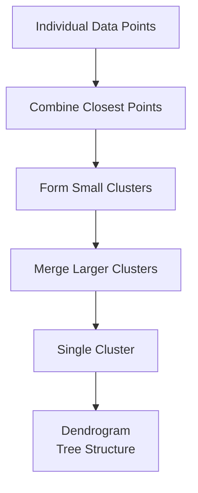
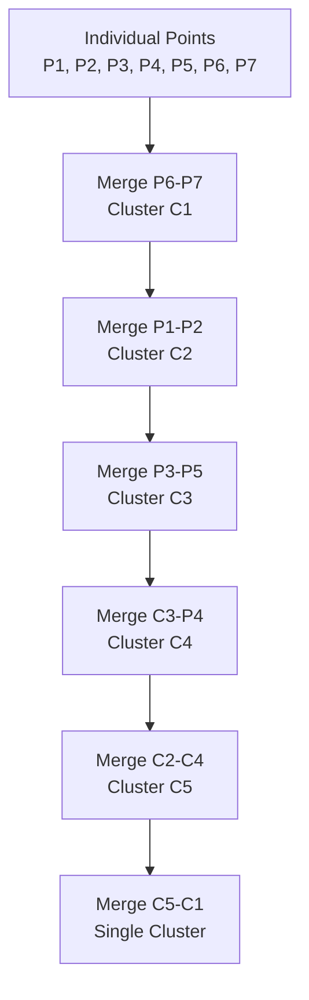
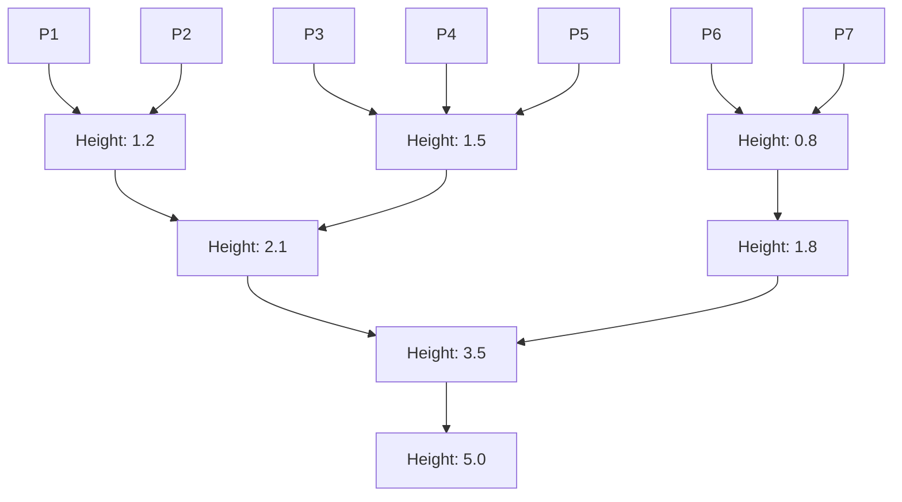
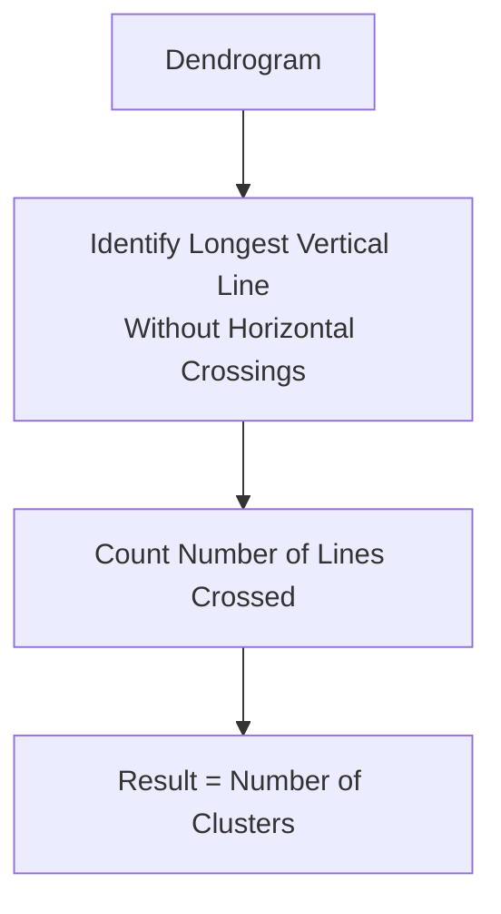
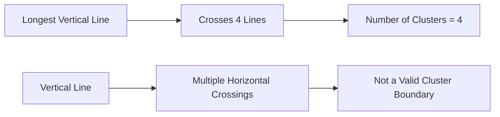

# Chapter 17: Hierarchical Clustering Algorithm

## 🎯 Learning Objectives
- Understand hierarchical clustering and dendrograms
- Learn agglomerative clustering step-by-step process
- Master how to determine number of clusters from dendrogram
- Compare hierarchical clustering with K-means

## 📚 Key Concepts

### 17.1 What is Hierarchical Clustering?

**Definition**: An unsupervised clustering algorithm that builds a hierarchy of clusters either by merging (agglomerative) or splitting (divisive) existing clusters

**Key Characteristics**:
- **No K value required**: Doesn't need to specify number of clusters beforehand
- **Hierarchical structure**: Creates a tree-like structure (dendrogram)
- **Distance-based**: Uses distance metrics to merge/split clusters
- **Step-by-step**: Builds clusters incrementally



### 17.2 Types of Hierarchical Clustering

#### Agglomerative (Bottom-up):
- Start with each point as its own cluster
- Merge closest clusters iteratively
- End with single cluster containing all points
- Most commonly used approach

#### Divisive (Top-down):
- Start with all points in one cluster
- Split clusters iteratively
- End with individual points as clusters
- Less commonly used due to computational complexity

### 17.3 Agglomerative Clustering Step-by-Step

#### Dataset Example:
Points: P1, P2, P3, P4, P5, P6, P7

#### Step 1: Calculate All Pairwise Distances
- Compute distance between every pair of points
- Use Euclidean distance or other distance metrics
- Create distance matrix

```
Distance Matrix:
     P1   P2   P3   P4   P5   P6   P7
P1   0   1.2  3.4  2.1  4.5  5.6  6.2
P2  1.2   0   2.8  1.9  3.9  4.8  5.4
P3  3.4  2.8   0   1.5  2.2  3.1  3.8
P4  2.1  1.9  1.5   0   1.8  2.7  3.4
P5  4.5  3.9  2.2  1.8   0   1.2  1.9
P6  5.6  4.8  3.1  2.7  1.2   0   0.8
P7  6.2  5.4  3.8  3.4  1.9  0.8   0
```

#### Step 2: Find and Merge Closest Points
- Find smallest distance in distance matrix
- Merge those two points into one cluster
- Update distance matrix

**Example**: P6 and P7 are closest (distance = 0.8)
- Merge into Cluster C1 = {P6, P7}

#### Step 3: Continue Merging Process


#### Step 4: Build Dendrogram
- Each merge becomes a horizontal line
- Height of line represents distance
- Creates tree-like structure

### 17.4 Dendrogram Visualization



**Dendrogram Interpretation**:
- **X-axis**: Data points
- **Y-axis**: Distance at which clusters merge
- **Vertical lines**: Distance between clusters
- **Horizontal lines**: Cluster merges

### 17.5 Determining Number of Clusters

**Method**: Find the longest vertical line that no horizontal line passes through



**Example**:


### 17.6 Distance Metrics in Hierarchical Clustering

#### Common Distance Metrics:
1. **Euclidean Distance**: Standard straight-line distance
2. **Manhattan Distance**: City block distance
3. **Cosine Distance**: For text/document clustering
4. **Correlation Distance**: For time series data

#### Linkage Methods:
1. **Single Linkage**: Minimum distance between clusters
2. **Complete Linkage**: Maximum distance between clusters
3. **Average Linkage**: Average distance between clusters
4. **Ward's Method**: Minimize within-cluster variance

### 17.7 Linkage Methods Comparison

| Method | Distance Definition | Pros | Cons |
|--------|-------------------|------|------|
| **Single** | Min distance between any points | Good for non-elliptical shapes | Chaining effect |
| **Complete** | Max distance between any points | Compact clusters | Sensitive to outliers |
| **Average** | Average distance between all points | Balanced | Computationally expensive |
| **Ward's** | Minimize variance increase | Compact clusters | Requires numerical data |

### 17.8 Practical Implementation

```python
import numpy as np
import matplotlib.pyplot as plt
from scipy.cluster.hierarchy import dendrogram, linkage
from sklearn.cluster import AgglomerativeClustering
from sklearn.preprocessing import StandardScaler

# Generate sample data
np.random.seed(42)
data = np.random.multivariate_normal([0, 0], [[1, 0.5], [0.5, 1]], 30)
data = np.vstack([data, np.random.multivariate_normal([5, 5], [[1, -0.2], [-0.2, 1]], 30)])

# Standardize features
scaler = StandardScaler()
data_scaled = scaler.fit_transform(data)

# Perform hierarchical clustering
linkage_matrix = linkage(data_scaled, method='ward', metric='euclidean')

# Plot dendrogram
plt.figure(figsize=(12, 8))
dendrogram(linkage_matrix)
plt.title('Hierarchical Clustering Dendrogram')
plt.xlabel('Sample Index')
plt.ylabel('Distance')
plt.axhline(y=10, color='r', linestyle='--')  # Example threshold
plt.show()

# Determine optimal number of clusters from dendrogram
optimal_clusters = 4  # Based on dendrogram analysis

# Fit Agglomerative Clustering
agg_clustering = AgglomerativeClustering(n_clusters=optimal_clusters)
cluster_labels = agg_clustering.fit_predict(data_scaled)

print(f"Optimal number of clusters: {optimal_clusters}")
print(f"Cluster labels: {np.unique(cluster_labels)}")
```

### 17.9 Advantages and Disadvantages

#### Advantages:
- **No K requirement**: Doesn't need to specify number of clusters
- **Hierarchical Structure**: Provides complete clustering hierarchy
- **Interpretable**: Dendrogram shows relationships between clusters
- **No Random Initialization**: Deterministic results
- **Flexible**: Various distance and linkage methods available

#### Disadvantages:
- **Computationally Expensive**: O(n³) time complexity
- **Memory Intensive**: Stores full distance matrix
- **Not Scalable**: Poor performance with large datasets
- **Sensitive to Outliers**: Can significantly affect clustering
- **Irreversible**: Once merged, cannot unmerge clusters

### 17.10 When to Use Hierarchical Clustering

#### Use When:
- Dataset is small to medium sized (< 10,000 points)
- Need hierarchical structure of clusters
- Don't know optimal number of clusters beforehand
- Want to understand relationships between clusters
- Need interpretable clustering results

#### Avoid When:
- Dataset is very large
- Need fast clustering
- Have time constraints
- Working with high-dimensional data
- Memory is limited

### 17.11 Comparison with K-Means

| Aspect | Hierarchical Clustering | K-Means |
|--------|-------------------------|----------|
| **K Requirement** | No | Yes |
| **Time Complexity** | O(n³) | O(n × k × i) |
| **Memory Usage** | High (O(n²)) | Low (O(n × k)) |
| **Scalability** | Poor | Good |
| **Hierarchical Structure** | Yes | No |
| **Random Initialization** | No | Yes |
| **Dendrogram** | Yes | No |
| **Optimal for Small Data** | Yes | No |

## ❓ Interview Questions & Answers

### Q1: How does hierarchical clustering work step by step?
**Answer**: Hierarchical clustering works by:
1. Starting with each data point as its own cluster
2. Finding the two closest clusters and merging them
3. Recalculating distances between new cluster and others
4. Repeating until all points are in one cluster
5. Creating a dendrogram to visualize the hierarchy

### Q2: How do you determine the number of clusters in hierarchical clustering?
**Answer**: By analyzing the dendrogram:
1. Look for the longest vertical line
2. Check that no horizontal line crosses through it
3. Count how many horizontal lines it intersects
4. That number indicates the optimal number of clusters

### Q3: What is a dendrogram?
**Answer**: A dendrogram is a tree-like diagram that shows how clusters are merged in hierarchical clustering. The x-axis shows individual data points or clusters, and the y-axis shows the distance at which clusters were merged.

### Q4: What are the different linkage methods in hierarchical clustering?
**Answer**: Four main linkage methods:
- **Single Linkage**: Uses minimum distance between clusters
- **Complete Linkage**: Uses maximum distance between clusters
- **Average Linkage**: Uses average distance between all point pairs
- **Ward's Method**: Minimizes within-cluster variance when merging

### Q5: When would you prefer hierarchical clustering over K-means?
**Answer**: When:
- Dataset is small to medium sized
- You don't know the optimal number of clusters
- You need hierarchical relationships between clusters
- You want interpretable clustering with dendrogram
- You need deterministic results (no random initialization)

### Q6: Why is hierarchical clustering computationally expensive?
**Answer**: Because it needs to:
- Calculate all pairwise distances (O(n²))
- Update distance matrix after each merge
- Store and process the complete distance matrix
- Perform O(n) merges, each requiring O(n) calculations

### Q7: What is the "chaining effect" in hierarchical clustering?
**Answer**: The chaining effect occurs with single linkage clustering where clusters can become elongated as distant points are connected through a chain of intermediate points. This can result in poorly separated clusters.

### Q8: How do you handle categorical data in hierarchical clustering?
**Answer**: For categorical data, you can:
- Use appropriate distance metrics (Hamming distance, Jaccard distance)
- Use one-hot encoding and then hierarchical clustering
- Use Gower's distance for mixed data types
- Consider other clustering algorithms designed for categorical data

## 💡 Key Takeaways

1. **Hierarchical Structure**: Creates tree-like clustering structure
2. **No K Required**: Doesn't need to specify number of clusters beforehand
3. **Dendrogram**: Visual representation of clustering hierarchy
4. **Distance-Based**: Uses distance metrics to determine cluster merges
5. **Agglomerative**: Bottom-up approach (most common)
6. **Cluster Selection**: Use longest vertical line without crossings
7. **Not Scalable**: Poor performance with large datasets

## 🚨 Common Mistakes

**Mistake 1**: Using hierarchical clustering on large datasets
- **Reality**: Time complexity O(n³) makes it impractical for large datasets

**Mistake 2**: Not considering different linkage methods
- **Reality**: Different linkage methods can give very different results

**Mistake 3**: Ignoring data preprocessing
- **Reality**: Feature scaling and outlier removal are important

**Mistake 4**: Misinterpreting dendrogram
- **Reality**: Look for longest vertical line without horizontal crossings

**Mistake 5**: Using wrong distance metric for data type
- **Reality**: Choose distance metric based on data characteristics

## 📝 Quick Revision Points

- **Hierarchical Clustering**: Builds tree-like cluster structure
- **Agglomerative**: Bottom-up approach (most common)
- **Dendrogram**: Visual representation of cluster hierarchy
- **Linkage Methods**: Single, complete, average, Ward's
- **Distance Metrics**: Euclidean, Manhattan, cosine, correlation
- **Number of Clusters**: Determined from dendrogram analysis
- **Time Complexity**: O(n³), not suitable for large datasets
- **Applications**: Gene expression analysis, document clustering, customer segmentation