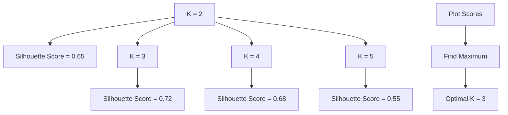
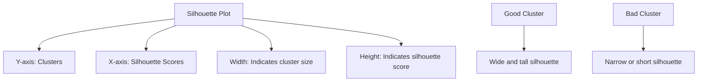

# Chapter 18: Silhouette Clustering - Validating Clusters

## 🎯 Learning Objectives
- Understand Silhouette score for cluster validation
- Master a(i) and b(i) calculations
- Learn Silhouette coefficient interpretation
- Validate clustering model performance

## 📚 Key Concepts

### 18.1 What is Silhouette Clustering?

**Definition**: A validation technique that measures how well-separated the resulting clusters are, providing a quantitative evaluation of clustering quality

**Purpose**: Validate clustering models and determine optimal number of clusters

**Key Concept**: For each data point, Silhouette score measures:
- **Cohesion**: How close the point is to other points in its own cluster
- **Separation**: How far the point is from points in other clusters

```mermaid
graph TD
    A[Data Point I] --> B[Calculate a(i)<br/>Average distance within cluster]
    A --> C[Calculate b(i)<br/>Average distance to nearest cluster]
    B --> D[Silhouette Coefficient]
    C --> D
    D --> E[s(i) = (b(i) - a(i)) / max(a(i), b(i))]
    E --> F[Range: -1 to +1]
```

### 18.2 Silhouette Score Calculation Step-by-Step

#### For Each Data Point I:

**Step 1: Calculate a(i) - Cohesion**
- Compute average distance from point I to all other points in its own cluster
- Measures how well point I fits within its cluster

**Formula**:
```
a(i) = (1/|Cᵢ| - 1) × Σ d(i, j) for all j in Cᵢ, j ≠ i
```

Where:
- **Cᵢ**: Cluster containing point I
- **d(i, j)**: Distance between point I and point J
- **|Cᵢ|**: Number of points in cluster Cᵢ

**Visual Representation**:
```mermaid
graph TD
    A[Point I] --> B[Cluster C₁]
    B --> C[Points in C₁<br/>P₁, P₂, P₃, P₄, P₅]
    A --> D[Distances]
    D --> E[d(I,P₁), d(I,P₂), d(I,P₃), d(I,P₄), d(I,P₅)]
    E --> F[a(i) = Average of all distances]
```

**Step 2: Calculate b(i) - Separation**
- For each other cluster, compute average distance from point I to all points in that cluster
- Find the minimum average distance (nearest cluster)
- Measures how well point I is separated from other clusters

**Formula**:
```
b(i) = min (1/|Cₖ|) × Σ d(i, j) for all j in Cₖ, for all clusters Cₖ ≠ Cᵢ
```

**Visual Representation**:
```mermaid
graph TD
    A[Point I] --> B[Cluster C₁<br/>Own Cluster]
    A --> C[Cluster C₂<br/>Nearest Other Cluster]
    A --> D[Cluster C₃]
    A --> E[Cluster C₄]

    C --> F[Distances to all points in C₂]
    F --> G[Average distance = avg₂]

    D --> H[Distances to all points in C₃]
    H --> I[Average distance = avg₃]

    E --> J[Distances to all points in C₄]
    J --> K[Average distance = avg₄]

    L[b(i) = min(avg₂, avg₃, avg₄)]
```

**Step 3: Calculate Silhouette Coefficient s(i)**

**Formula**:
```
s(i) = (b(i) - a(i)) / max(a(i), b(i))
```

**Range**: [-1, +1]

### 18.3 Silhouette Score Interpretation

| Score Range | Interpretation | Quality |
|-------------|---------------|---------|
| **+0.71 to +1.0** | Strong structure | Excellent |
| **+0.51 to +0.70** | Reasonable structure | Good |
| **+0.26 to +0.50** | Weak structure | Fair |
| **≤ +0.25** | No substantial structure | Poor |
| **< 0** | Points assigned to wrong clusters | Bad |

**Score Meaning**:
- **+1**: Perfect clustering (a(i) << b(i))
- **0**: Point is on border between two clusters
- **-1**: Point is assigned to wrong cluster (a(i) > b(i))

### 18.4 Visual Understanding of Silhouette Score

```mermaid
graph TD
    A[Good Clustering] --> B[Point in Cluster A]
    B --> C[a(i) = 2<br/>Small within-cluster distance]
    B --> D[b(i) = 10<br/>Large between-cluster distance]
    D --> E[s(i) = (10-2)/max(2,10) = 8/10 = 0.8<br/>Excellent]

    F[Bad Clustering] --> G[Point in Cluster A]
    G --> H[a(i) = 10<br/>Large within-cluster distance]
    G --> I[b(i) = 2<br/>Small between-cluster distance]
    I --> J[s(i) = (2-10)/max(10,2) = -8/10 = -0.8<br/>Poor]
```

### 18.5 Average Silhouette Score

**Purpose**: Evaluate overall clustering quality by averaging silhouette scores for all points

**Formula**:
```
Average Silhouette Score = (1/n) × Σ s(i) for all points i
```

**Interpretation**:
- **Higher average score**: Better overall clustering
- **Optimal K**: Look for K with highest average silhouette score

### 18.6 Silhouette Analysis for Optimal K

#### Process:
1. **Run clustering for different K values** (K = 2, 3, 4, 5, ...)
2. **Calculate silhouette score for each K**
3. **Plot K vs silhouette score**
4. **Select K with highest silhouette score**



### 18.7 Silhouette Plot Visualization



### 18.8 Practical Implementation

```python
import numpy as np
import matplotlib.pyplot as plt
from sklearn.cluster import KMeans
from sklearn.metrics import silhouette_score, silhouette_samples
from sklearn.preprocessing import StandardScaler

# Generate sample data
np.random.seed(42)
X = np.random.multivariate_normal([0, 0], [[1, 0.5], [0.5, 1]], 50)
X = np.vstack([X, np.random.multivariate_normal([5, 5], [[1, -0.2], [-0.2, 1]], 50)])

# Standardize features
scaler = StandardScaler()
X_scaled = scaler.fit_transform(X)

# Try different K values
silhouette_scores = []
k_values = range(2, 11)

for k in k_values:
    kmeans = KMeans(n_clusters=k, random_state=42)
    cluster_labels = kmeans.fit_predict(X_scaled)
    score = silhouette_score(X_scaled, cluster_labels)
    silhouette_scores.append(score)
    print(f"K={k}, Silhouette Score={score:.3f}")

# Plot silhouette scores
plt.figure(figsize=(10, 6))
plt.plot(k_values, silhouette_scores, 'bo-')
plt.xlabel('Number of Clusters (K)')
plt.ylabel('Silhouette Score')
plt.title('Silhouette Analysis for Optimal K')
plt.grid(True)
plt.show()

# Find optimal K
optimal_k = k_values[np.argmax(silhouette_scores)]
print(f"\nOptimal number of clusters: {optimal_k}")

# Detailed silhouette analysis for optimal K
kmeans = KMeans(n_clusters=optimal_k, random_state=42)
cluster_labels = kmeans.fit_predict(X_scaled)

# Calculate silhouette values for each point
silhouette_values = silhouette_samples(X_scaled, cluster_labels)

# Create silhouette plot
plt.figure(figsize=(10, 6))
y_lower = 10

for i in range(optimal_k):
    # Aggregate silhouette scores for samples belonging to cluster i
    cluster_silhouette_values = silhouette_values[cluster_labels == i]
    cluster_silhouette_values.sort()

    size_cluster_i = cluster_silhouette_values.shape[0]
    y_upper = y_lower + size_cluster_i

    plt.fill_betweenx(np.arange(y_lower, y_upper),
                      0, cluster_silhouette_values,
                      alpha=0.7)

    # Label the silhouette plots with their cluster numbers
    plt.text(-0.05, y_lower + 0.5 * size_cluster_i, str(i))

    y_lower = y_upper + 10  # 10 for spacing between clusters

plt.title(f"Silhouette Plot for K={optimal_k}")
plt.xlabel("Silhouette coefficient values")
plt.ylabel("Cluster label")
plt.axvline(x=silhouette_scores[k_values.index(optimal_k)], color="red", linestyle="--")
plt.show()
```

### 18.9 Advantages and Disadvantages

#### Advantages:
- **No Ground Truth Required**: Works without labeled data
- **Visual Interpretation**: Easy to understand scores
- **Cluster Quality**: Measures both cohesion and separation
- **Optimal K Selection**: Helps find best number of clusters
- **Identifies Bad Clusters**: Points with negative scores indicate problems

#### Disadvantages:
- **Computationally Expensive**: O(n²) time complexity
- **Distance-Based**: Requires meaningful distance metrics
- **Sensitive to Outliers**: Outliers can affect scores
- ** Assumes Convex Clusters**: Works best with spherical clusters
- **Not Suitable for Large Datasets**: Performance issues with big data

### 18.10 When to Use Silhouette Score

#### Use When:
- Validating clustering results
- Comparing different clustering algorithms
- Selecting optimal number of clusters
- Evaluating cluster quality
- Dataset is small to medium sized

#### Use with:
- K-means clustering
- Hierarchical clustering
- DBSCAN clustering
- Most distance-based clustering algorithms

#### Avoid When:
- Dataset is very large (> 10,000 points)
- Clusters have complex shapes
- Distance metrics are not meaningful
- Need fast evaluation

### 18.11 Silhouette Score vs Other Metrics

| Metric | Purpose | Ground Truth Required | Range |
|--------|---------|----------------------|-------|
| **Silhouette Score** | Internal validation | No | [-1, 1] |
| **Davies-Bouldin Index** | Internal validation | No | Lower is better |
| **Calinski-Harabasz** | Internal validation | No | Higher is better |
| **Adjusted Rand Index** | External validation | Yes | [-1, 1] |
| **Mutual Information** | External validation | Yes | [0, 1] |

## ❓ Interview Questions & Answers

### Q1: What does a silhouette score of -0.5 indicate?
**Answer**: A negative silhouette score means the point is probably assigned to the wrong cluster. A score of -0.5 indicates poor clustering where the average distance to points in other clusters is less than the average distance to points in its own cluster.

### Q2: How is the silhouette coefficient calculated?
**Answer**: s(i) = (b(i) - a(i)) / max(a(i), b(i))
- a(i): Average distance to all other points in the same cluster
- b(i): Minimum average distance to points in other clusters
- Range: [-1, +1]

### Q3: What does a silhouette score close to +1 mean?
**Answer**: A score close to +1 indicates excellent clustering. It means the point is much closer to points in its own cluster than to points in other clusters, indicating strong cohesion and good separation.

### Q4: How do you use silhouette analysis to find the optimal K?
**Answer**:
1. Run clustering for different K values (2, 3, 4, 5, ...)
2. Calculate average silhouette score for each K
3. Plot K vs silhouette scores
4. Select the K with the highest silhouette score

### Q5: What are a(i) and b(i) in silhouette calculation?
**Answer**:
- **a(i)**: Average distance from point i to all other points in its own cluster (cohesion)
- **b(i)**: Minimum average distance from point i to points in any other cluster (separation)

### Q6: Why might you get a negative silhouette score?
**Answer**: Negative scores indicate that a point is closer to points in other clusters than to points in its own cluster. This happens when:
- Point is assigned to wrong cluster
- Number of clusters is incorrect
- Clusters overlap significantly
- Outliers are present

### Q7: What are the limitations of silhouette score?
**Answer**:
- Computationally expensive O(n²)
- Sensitive to outliers
- Assumes convex, equally sized clusters
- Requires meaningful distance metrics
- Not suitable for very large datasets

### Q8: When is silhouette score most useful?
**Answer**: Silhouette score is most useful for:
- Validating clustering results when no ground truth is available
- Comparing different clustering algorithms
- Selecting optimal number of clusters
- Identifying poorly clustered points
- Medium-sized datasets (< 10,000 points)

## 💡 Key Takeaways

1. **Validation Metric**: Measures clustering quality without ground truth
2. **Cohesion and Separation**: Evaluates both within-cluster and between-cluster distances
3. **Score Range**: [-1, +1], higher is better
4. **Optimal K**: Select K with highest average silhouette score
5. **Visual Analysis**: Silhouette plots help identify cluster quality
6. **Point-level Analysis**: Individual scores identify problematic points
7. **Algorithm Comparison**: Can compare different clustering methods

## 🚨 Common Mistakes

**Mistake 1**: Using silhouette score on very large datasets
- **Reality**: O(n²) complexity makes it impractical for large datasets

**Mistake 2**: Ignoring negative scores
- **Reality**: Negative scores indicate clustering problems that need investigation

**Mistake 3**: Using silhouette score with inappropriate distance metrics
- **Reality**: Distance metrics must reflect actual similarity in the data

**Mistake 4**: Relying only on silhouette score for cluster validation
- **Reality**: Use multiple validation methods for comprehensive evaluation

**Mistake 5**: Not scaling features before clustering
- **Reality**: Feature scaling is essential for meaningful distance calculations

## 📝 Quick Revision Points

- **Silhouette Score**: (b(i) - a(i)) / max(a(i), b(i))
- **a(i)**: Average within-cluster distance (cohesion)
- **b(i)**: Minimum average between-cluster distance (separation)
- **Score Range**: [-1, +1], closer to +1 is better
- **Optimal K**: Highest average silhouette score
- **Negative Score**: Point assigned to wrong cluster
- **Silhouette Plot**: Visual representation of cluster quality
- **Validation**: Internal metric, no ground truth needed
- **Applications**: K-means, hierarchical clustering, cluster evaluation