# Chapter 19: DBSCAN Clustering Algorithms

## 🎯 Learning Objectives
- Understand DBSCAN (Density-Based Spatial Clustering)
- Master core points, border points, and noise points
- Learn epsilon and MinPts parameters
- Understand DBSCAN advantages over K-means and hierarchical clustering

## 📚 Key Concepts

### 19.1 What is DBSCAN?

**Definition**: Density-Based Spatial Clustering of Applications with Noise is an unsupervised clustering algorithm that groups together points that are closely packed together, marking as outliers points that lie alone in low-density regions

**Core Advantage**: Can identify arbitrarily shaped clusters and automatically handle outliers


### 19.2 Key DBSCAN Components

#### 1. Epsilon (ε) - Radius
- **Definition**: Maximum distance between two points for them to be considered neighbors
- **Purpose**: Defines neighborhood around each point
- **Units**: Same as distance metric used (usually Euclidean)

#### 2. MinPts - Minimum Points
- **Definition**: Minimum number of points required to form a dense region
- **Purpose**: Determines what constitutes a "dense" region
- **Typical Values**: 4 for 2D data, 2 × dimensions as general rule

#### 3. Point Types:
- **Core Point**: Has at least MinPts points within epsilon distance
- **Border Point**: Has fewer than MinPts points within epsilon but is reachable from a core point
- **Noise Point**: Not a core point and not reachable from any core point

### 19.3 DBSCAN Algorithm Step-by-Step

#### Step 1: For Each Point, Find Neighbors
- Calculate distance to all other points
- Count points within epsilon distance
- Categorize each point based on neighbor count

```mermaid
flowchart TD
    A["Point P"] --> B["Draw Circle with radius ε"]
    B --> C["Count points within circle"]
    C --> D{"Count ≥ MinPts?"}
    D -->|Yes| E["Core Point"]
    D -->|No| F{"Reachable from core point?"}
    F -->|Yes| G["Border Point"]
    F -->|No| H["Noise Point"]
```



#### Step 2: Identify Core Points
- Points with ≥ MinPts neighbors
- Form the backbone of clusters
- Can reach other points through epsilon

#### Step 3: Find Border Points
- Points within epsilon of core points
- Have < MinPts neighbors themselves
- Connected to clusters through core points

#### Step 4: Identify Noise Points
- Points that are neither core nor border
- Treated as outliers
- Not assigned to any cluster

#### Step 5: Form Clusters
- Start from arbitrary core point
- Include all reachable points (core and border)
- Repeat with unvisited core points

### 19.4 DBSCAN Point Classification Examples

#### Example 1: Core Point


#### Example 2: Border Point


#### Example 3: Noise Point


### 19.5 Reachability and Connectivity

#### Directly Density-Reachable:
- Point A is directly density-reachable from point B if:
  - A is within epsilon distance of B
  - B is a core point

#### Density-Reachable:
- Point A is density-reachable from point B if there exists a path of directly density-reachable points

#### Density-Connected:
- Points A and B are density-connected if there exists point C such that both A and B are density-reachable from C


### 19.6 DBSCAN vs Traditional Clustering

| Aspect | DBSCAN | K-Means | Hierarchical |
|--------|---------|---------|--------------|
| **Shape** | Arbitrary shapes | Spherical | Hierarchical |
| **Outliers** | Handles automatically | Includes in clusters | Includes in clusters |
| **K Required** | No | Yes | No |
| **Density-based** | Yes | No | No |
| **Complexity** | O(n²) | O(n × k × i) | O(n³) |
| **Parameters** | ε, MinPts | K | Linkage method |

### 19.7 DBSCAN Parameter Selection

#### Choosing Epsilon (ε):
1. **K-distance graph**: Plot distance to k-th nearest neighbor
2. **Elbow method**: Look for knee in the graph
3. **Domain knowledge**: Use business understanding
4. **Experimentation**: Try different values and evaluate

```mermaid
flowchart TD
    A["Calculate k-distance for all points"] --> B["Sort distances in descending order"]
    B --> C["Plot k-distance graph"]
    C --> D["Find elbow point"]
    D --> E["Set ε to elbow value"]
```



#### Choosing MinPts:
- **2D data**: MinPts = 4
- **General rule**: MinPts = 2 × dimensions
- **Noisy data**: Higher MinPts
- **Small datasets**: Lower MinPts

### 19.8 Practical Implementation

```python
import numpy as np
import matplotlib.pyplot as plt
from sklearn.cluster import DBSCAN
from sklearn.preprocessing import StandardScaler
from sklearn.neighbors import NearestNeighbors

# Generate sample data with noise
np.random.seed(42)
# Create two moons
from sklearn.datasets import make_moons
X, _ = make_moons(n_samples=300, noise=0.05, random_state=42)

# Add some noise points
noise = np.random.uniform(low=-2, high=3, size=(50, 2))
X = np.vstack(["X, noise"])

# Standardize features
scaler = StandardScaler()
X_scaled = scaler.fit_transform(X)

# Find optimal epsilon using k-distance graph
def find_optimal_epsilon(X, min_pts):
    k = min_pts
    nbrs = NearestNeighbors(n_neighbors=k).fit(X)
    distances, _ = nbrs.kneighbors(X)
    k_distances = distances[":, k-1"]
    k_distances = np.sort(k_distances)["::-1"]

    plt.figure(figsize=(10, 6))
    plt.plot(k_distances)
    plt.xlabel('Points sorted by distance')
    plt.ylabel(f'{"k"}-th nearest neighbor distance')
    plt.title('K-Distance Graph for Optimal Epsilon')
    plt.grid(True)
    plt.show()

    return k_distances

# Find optimal epsilon
min_pts = 4  # Typically 2 × dimensions for 2D data
k_distances = find_optimal_epsilon(X_scaled, min_pts)

# Based on the k-distance graph, choose epsilon
optimal_epsilon = 0.3  # Based on elbow in k-distance graph

# Apply DBSCAN
dbscan = DBSCAN(eps=optimal_epsilon, min_samples=min_pts)
cluster_labels = dbscan.fit_predict(X_scaled)

# Analyze results
n_clusters = len(set(cluster_labels)) - (1 if -1 in cluster_labels else 0)
n_noise = list(cluster_labels).count(-1)

print(f"Number of clusters: {"n_clusters"}")
print(f"Number of noise points: {"n_noise"}")
print(f"Silhouette score: {"np.mean(cluster_labels != -1)"}")

# Visualize results
plt.figure(figsize=(12, 5))

# Original data
plt.subplot(1, 2, 1)
plt.scatter(X_scaled[":, 0"], X_scaled[":, 1"], c='gray', s=10)
plt.title('Original Data')
plt.xlabel('Feature 1')
plt.ylabel('Feature 2')

# DBSCAN clustering
plt.subplot(1, 2, 2)
unique_labels = set(cluster_labels)
colors = ["'red', 'blue', 'green', 'purple', 'orange'"]

for k in unique_labels:
    if k == -1:
        # Noise points
        plt.scatter(X_scaled["cluster_labels == k, 0"],
                   X_scaled["cluster_labels == k, 1"],
                   c='black', s=10, label='Noise')
    else:
        plt.scatter(X_scaled["cluster_labels == k, 0"],
                   X_scaled["cluster_labels == k, 1"],
                   c=colors["k % len(colors)"], s=10, label=f'Cluster {"k"}')

plt.title(f'DBSCAN Clustering (ε={"optimal_epsilon"}, MinPts={"min_pts"})')
plt.xlabel('Feature 1')
plt.ylabel('Feature 2')
plt.legend()
plt.show()
```

### 19.9 Advantages and Disadvantages

#### Advantages:
- **Arbitrary Shapes**: Can find non-spherical clusters
- **Outlier Detection**: Automatically identifies and handles outliers
- **No K Required**: Doesn't need to specify number of clusters
- **Density-based**: Can find clusters of different densities
- **Robust**: Handles noise and outliers well

#### Disadvantages:
- **Parameter Sensitive**: Performance highly dependent on ε and MinPts
- **Density Issues**: Struggles with varying cluster densities
- **High-dimensional**: Performance degrades in high dimensions
- **Border Cases**: Can create unconnected clusters in some situations
- **Memory Intensive**: Stores distance matrix for large datasets

### 19.10 When to Use DBSCAN

#### Use When:
- Dataset has arbitrary shaped clusters
- Presence of outliers/noise is expected
- Number of clusters is unknown
- Clusters have similar density
- Dataset is 2D or 3D (lower dimensions)

#### Avoid When:
- Clusters have very different densities
- Dataset is very high-dimensional (> 50 features)
- Need very fast clustering
- Clusters are well-separated and spherical
- Memory is limited

### 19.11 DBSCAN Applications

#### Real-world Use Cases:
- **Anomaly Detection**: Network security, fraud detection
- **Image Segmentation**: Medical imaging, satellite imagery
- **Geographic Analysis**: Location-based clustering
- **Genomics**: Gene expression clustering
- **Social Network Analysis**: Community detection
- **Customer Segmentation**: Based on behavior patterns

## ❓ Interview Questions & Answers

### Q1: What are the main parameters in DBSCAN?
**Answer**:
- **Epsilon (ε)**: Maximum distance between two points to be considered neighbors
- **MinPts**: Minimum number of points required to form a dense region
These parameters determine what constitutes a cluster and how outliers are handled.

### Q2: How does DBSCAN handle outliers differently from K-means?
**Answer**: DBSCAN automatically identifies and separates outliers as noise points, which are not assigned to any cluster. K-means forces every point into a cluster, including outliers, which can distort cluster centroids.

### Q3: What is the difference between core points and border points?
**Answer**:
- **Core Point**: Has at least MinPts points within epsilon distance
- **Border Point**: Has fewer than MinPts neighbors but is within epsilon distance of a core point
- **Noise Point**: Neither core nor border point

### Q4: How do you choose the optimal epsilon value?
**Answer**: Use the k-distance graph method:
1. Calculate distance to k-th nearest neighbor for all points (k = MinPts)
2. Sort distances in descending order
3. Plot the k-distance graph
4. Look for the "elbow" point where distance increases sharply
5. Set epsilon to the distance at the elbow point

### Q5: What happens if epsilon is too large or too small?
**Answer**:
- **Too small**: Many points become noise, clusters become fragmented
- **Too large**: All points merge into one cluster, outliers included
- **Optimal**: Balanced clustering with meaningful noise separation

### Q6: Why is DBSCAN called a density-based clustering algorithm?
**Answer**: Because it defines clusters as dense regions separated by regions of lower density. It groups points based on local density rather than distance to centroids.

### Q7: What are the main advantages of DBSCAN over K-means?
**Answer**:
- Can handle arbitrary shaped clusters (not just spherical)
- Automatically detects and handles outliers
- Doesn't require specifying number of clusters
- Works well with noise in the data
- More robust to initialization

### Q8: When would DBSCAN perform poorly?
**Answer**:
- When clusters have very different densities
- In very high-dimensional spaces
- When data has overlapping clusters
- With inappropriate parameter values
- When clusters are well-separated and spherical (K-means may be better)

## 💡 Key Takeaways

1. **Density-Based**: Groups based on local point density
2. **Automatic Outlier Detection**: Separates noise points automatically
3. **Arbitrary Shapes**: Can find non-spherical clusters
4. **Two Parameters**: Epsilon (radius) and MinPts (minimum points)
5. **Point Types**: Core, border, and noise points
6. **No K Required**: Doesn't need to specify number of clusters
7. **Robust**: Handles outliers and noise well

## 🚨 Common Mistakes

**Mistake 1**: Using same MinPts for all datasets
- **Reality**: MinPts should be adjusted based on data dimensionality and noise level

**Mistake 2**: Not standardizing features before DBSCAN
- **Reality**: Feature scaling is essential for meaningful distance calculations

**Mistake 3**: Choosing epsilon without k-distance analysis
- **Reality**: Use k-distance graph to find optimal epsilon systematically

**Mistake 4**: Using DBSCAN on very high-dimensional data
- **Reality**: Performance degrades in high dimensions due to distance concentration

**Mistake 5**: Ignoring noise points in analysis
- **Reality**: Noise points can be valuable for anomaly detection and data quality assessment

## 📝 Quick Revision Points

- **DBSCAN**: Density-Based Spatial Clustering of Applications with Noise
- **Epsilon (ε)**: Radius for neighborhood definition
- **MinPts**: Minimum points for dense region
- **Core Points**: ≥ MinPts neighbors within epsilon
- **Border Points**: < MinPts neighbors but reachable from core points
- **Noise Points**: Neither core nor border points
- **Arbitrary Shapes**: Can cluster non-spherical patterns
- **Outlier Detection**: Automatically separates noise points
- **Parameters**: Choose epsilon using k-distance graph
- **Applications**: Anomaly detection, image segmentation, geographic analysis