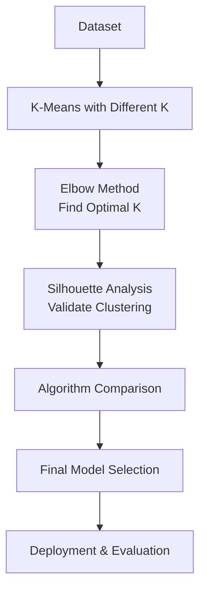

# Chapter 20: Clustering Practical Examples

## 🎯 Learning Objectives
- Master practical implementation of clustering algorithms
- Learn comprehensive model validation techniques
- Understand WCSS, elbow method, and silhouette score
- Compare different clustering algorithms in practice

## 📚 Key Concepts

### 20.1 Clustering Model Validation Workflow

**Complete Validation Process**:
1. **Data Generation/Loading**: Prepare dataset for clustering
2. **K-Means Clustering**: Apply with different K values
3. **Elbow Method**: Find optimal K using WCSS
4. **Silhouette Analysis**: Validate clustering quality
5. **Algorithm Comparison**: Compare K-means, hierarchical, DBSCAN
6. **Final Selection**: Choose best parameters and algorithm



### 20.2 Practical Implementation Steps

#### Step 1: Data Preparation
```python
import numpy as np
import matplotlib.pyplot as plt
from sklearn.datasets import make_blobs
from sklearn.preprocessing import StandardScaler

# Generate sample data
np.random.seed(42)
X, y = make_blobs(
    n_samples=300,           # Total samples
    centers=4,               # True number of clusters
    n_features=2,            # Number of features
    cluster_std=1.0,          # Standard deviation
    random_state=42
)

# Standardize features (important for distance-based algorithms)
scaler = StandardScaler()
X_scaled = scaler.fit_transform(X)
```

#### Step 2: K-Means Clustering with Elbow Method

```python
from sklearn.cluster import KMeans

# Find optimal K using Elbow Method
wcss = []
k_values = range(1, 11)

for k in k_values:
    kmeans = KMeans(
        n_clusters=k,
        init='k-means++',    # Better initialization
        random_state=42,
        n_init=10            # Number of initializations
    )
    kmeans.fit(X_scaled)
    wcss.append(kmeans.inertia_)  # inertia_ is WCSS

# Plot Elbow Curve
plt.figure(figsize=(12, 5))
plt.subplot(1, 2, 1)
plt.plot(k_values, wcss, 'bo-')
plt.xlabel('Number of Clusters (K)')
plt.ylabel('WCSS (Within Cluster Sum of Squares)')
plt.title('Elbow Method for Optimal K')
plt.grid(True)

# Visualize data points
plt.subplot(1, 2, 2)
plt.scatter(X_scaled[:, 0], X_scaled[:, 1], c=y, cmap='viridis', alpha=0.6)
plt.title('Original Data (True Clusters)')
plt.xlabel('Feature 1')
plt.ylabel('Feature 2')
plt.colorbar(label='True Cluster')
plt.tight_layout()
plt.show()

# Find optimal K (elbow point)
optimal_k = 4  # Based on elbow curve observation
print(f"Optimal K from Elbow Method: {optimal_k}")
```

#### Step 3: Silhouette Analysis

```python
from sklearn.metrics import silhouette_score, silhouette_samples

# Calculate silhouette scores for different K values
silhouette_scores = []

for k in range(2, 11):
    kmeans = KMeans(n_clusters=k, random_state=42)
    cluster_labels = kmeans.fit_predict(X_scaled)
    score = silhouette_score(X_scaled, cluster_labels)
    silhouette_scores.append(score)

# Plot silhouette scores
plt.figure(figsize=(10, 6))
plt.plot(range(2, 11), silhouette_scores, 'bo-')
plt.xlabel('Number of Clusters (K)')
plt.ylabel('Silhouette Score')
plt.title('Silhouette Analysis')
plt.grid(True)
plt.axvline(x=optimal_k, color='red', linestyle='--',
            label=f'Optimal K = {optimal_k}')
plt.legend()
plt.show()

# Detailed silhouette analysis for optimal K
kmeans_optimal = KMeans(n_clusters=optimal_k, random_state=42)
cluster_labels = kmeans_optimal.fit_predict(X_scaled)
silhouette_values = silhouette_samples(X_scaled, cluster_labels)

# Create silhouette plot
plt.figure(figsize=(12, 8))
y_lower = 10

for i in range(optimal_k):
    # Aggregate silhouette scores for samples belonging to cluster i
    cluster_silhouette_values = silhouette_values[cluster_labels == i]
    cluster_silhouette_values.sort()

    size_cluster_i = cluster_silhouette_values.shape[0]
    y_upper = y_lower + size_cluster_i

    plt.fill_betweenx(np.arange(y_lower, y_upper),
                      0, cluster_silhouette_values,
                      alpha=0.7)

    # Label the silhouette plots with their cluster numbers
    plt.text(-0.05, y_lower + 0.5 * size_cluster_i, str(i))

    y_lower = y_upper + 10  # 10 for spacing between clusters

plt.title(f'Silhouette Plot for K={optimal_k}')
plt.xlabel("Silhouette coefficient values")
plt.ylabel("Cluster label")
plt.axvline(x=silhouette_scores[optimal_k-2], color="red", linestyle="--")
plt.show()

print(f"Silhouette Scores:")
for i, score in enumerate(silhouette_scores, start=2):
    print(f"K={i}: {score:.3f}")
```

#### Step 4: Algorithm Comparison

```python
from sklearn.cluster import AgglomerativeClustering
from sklearn.cluster import DBSCAN
import numpy as np
from scipy.cluster.hierarchy import dendrogram, linkage

# K-Means
kmeans = KMeans(n_clusters=optimal_k, random_state=42)
kmeans_labels = kmeans.fit_predict(X_scaled)

# Hierarchical Clustering
hierarchical = AgglomerativeClustering(n_clusters=optimal_k)
hierarchical_labels = hierarchical.fit_predict(X_scaled)

# DBSCAN (need to find optimal parameters)
# Find optimal epsilon using k-distance graph
from sklearn.neighbors import NearestNeighbors

def find_optimal_epsilon(X, min_pts):
    nbrs = NearestNeighbors(n_neighbors=min_pts).fit(X)
    distances, _ = nbrs.kneighbors(X)
    k_distances = distances[:, min_pts-1]
    k_distances = np.sort(k_distances)[::-1]
    return k_distances

min_pts = 4  # 2 * dimensions for 2D data
k_distances = find_optimal_epsilon(X_scaled, min_pts)

# Based on k-distance graph, choose epsilon
optimal_epsilon = 0.5  # Adjust based on your k-distance graph

dbscan = DBSCAN(eps=optimal_epsilon, min_samples=min_pts)
dbscan_labels = dbscan.fit_predict(X_scaled)

# Compare algorithms
algorithms = ['K-Means', 'Hierarchical', 'DBSCAN']
labels_list = [kmeans_labels, hierarchical_labels, dbscan_labels]

# Calculate silhouette scores (only for non-noise points)
scores = []
for i, labels in enumerate(labels_list):
    if np.sum(labels != -1) > 1:  # Ensure we have at least 2 non-noise points
        mask = labels != -1
        score = silhouette_score(X_scaled[mask], labels[mask])
        scores.append(score)
    else:
        scores.append(0)  # Poor score if all points are noise

print("Algorithm Comparison:")
for algorithm, score in zip(algorithms, scores):
    print(f"{algorithm}: Silhouette Score = {score:.3f}")

# Visualize all algorithms
fig, axes = plt.subplots(2, 2, figsize=(15, 12))

# Original data
axes[0, 0].scatter(X_scaled[:, 0], X_scaled[:, 1], c=y, cmap='viridis', alpha=0.6)
axes[0, 0].set_title('Original Data (True Clusters)')

# K-Means
axes[0, 1].scatter(X_scaled[:, 0], X_scaled[:, 1], c=kmeans_labels, cmap='viridis', alpha=0.6)
axes[0, 1].set_title(f'K-Means (Score: {scores[0]:.3f})')

# Hierarchical
axes[1, 0].scatter(X_scaled[:, 0], X_scaled[:, 1], c=hierarchical_labels, cmap='viridis', alpha=0.6)
axes[1, 0].set_title(f'Hierarchical (Score: {scores[1]:.3f})')

# DBSCAN
colors = ['red', 'blue', 'green', 'purple', 'orange']
unique_labels = set(dbscan_labels)
for k in unique_labels:
    if k == -1:
        # Noise points
        axes[1, 1].scatter(X_scaled[dbscan_labels == k, 0],
                          X_scaled[dbscan_labels == k, 1],
                          c='black', s=10, alpha=0.6, label='Noise')
    else:
        axes[1, 1].scatter(X_scaled[dbscan_labels == k, 0],
                          X_scaled[dbscan_labels == k, 1],
                          c=colors[k % len(colors)], s=10, alpha=0.6, label=f'Cluster {k}')

axes[1, 1].set_title(f'DBSCAN (Score: {scores[2]:.3f})')
axes[1, 1].legend()

plt.tight_layout()
plt.show()
```

### 20.3 Complete Practical Example

#### Customer Segmentation Example

```python
import pandas as pd

# Load customer data (example)
# In real scenario, you would load your actual customer data
np.random.seed(42)

# Simulate customer data
n_customers = 500
age = np.random.normal(35, 10, n_customers)
income = np.random.normal(50000, 15000, n_customers)
spending = np.random.normal(2000, 800, n_customers)
frequency = np.random.poisson(5, n_customers)

# Create different customer segments
segment1 = (age > 40) & (income > 60000) & (spending > 2500)  # High-value customers
segment2 = (age < 30) & (income < 40000) & (frequency < 3)  # Young budget customers
segment3 = (~segment1) & (~segment2)  # Regular customers

# Create customer data
customer_data = pd.DataFrame({
    'age': age,
    'income': income,
    'annual_spending': spending,
    'visit_frequency': frequency
})

# Preprocess data
X_customers = customer_data.values
scaler_customers = StandardScaler()
X_customers_scaled = scaler_customers.fit_transform(X_customers)

# Apply clustering analysis
# 1. Elbow method for K
wcss_customers = []
k_range = range(1, 11)

for k in k_range:
    kmeans = KMeans(n_clusters=k, random_state=42)
    kmeans.fit(X_customers_scaled)
    wcss_customers.append(kmeans.inertia_)

# 2. Silhouette analysis
silhouette_scores_customers = []
for k in range(2, 11):
    kmeans = KMeans(n_clusters=k, random_state=42)
    labels = kmeans.fit_predict(X_customers_scaled)
    score = silhouette_score(X_customers_scaled, labels)
    silhouette_scores_customers.append(score)

# 3. Find optimal K
optimal_k_customers = silhouette_scores_customers.index(max(silhouette_scores_customers)) + 2

# 4. Final clustering
final_kmeans = KMeans(n_clusters=optimal_k_customers, random_state=42)
customer_segments = final_kmeans.fit_predict(X_customers_scaled)

# 5. Analyze segments
customer_data['segment'] = customer_segments
segment_analysis = customer_data.groupby('segment').agg({
    'age': 'mean',
    'income': 'mean',
    'annual_spending': 'mean',
    'visit_frequency': 'mean',
    'count': 'count'
}).round(2)

print(f"Optimal number of customer segments: {optimal_k_customers}")
print("\nSegment Analysis:")
print(segment_analysis)

# 6. Visualize segments
plt.figure(figsize=(15, 10))

# Age vs Income
plt.subplot(2, 2, 1)
scatter = plt.scatter(customer_data['age'], customer_data['income'],
                     c=customer_segments, cmap='viridis', alpha=0.6)
plt.xlabel('Age')
plt.ylabel('Income')
plt.title('Customer Segments: Age vs Income')
plt.colorbar(scatter)

# Income vs Spending
plt.subplot(2, 2, 2)
plt.scatter(customer_data['income'], customer_data['annual_spending'],
                     c=customer_segments, cmap='viridis', alpha=0.6)
plt.xlabel('Income')
plt.ylabel('Annual Spending')
plt.title('Customer Segments: Income vs Spending')

# Age vs Frequency
plt.subplot(2, 2, 3)
plt.scatter(customer_data['age'], customer_data['visit_frequency'],
                     c=customer_segments, cmap='viridis', alpha=0.6)
plt.xlabel('Age')
plt.ylabel('Visit Frequency')
plt.title('Customer Segments: Age vs Frequency')

# Spending vs Frequency
plt.subplot(2, 2, 4)
plt.scatter(customer_data['annual_spending'], customer_data['visit_frequency'],
                     c=customer_segments, cmap='viridis', 0.6)
plt.xlabel('Annual Spending')
plt.ylabel('Visit Frequency')
plt.title('Customer Segments: Spending vs Frequency')

plt.tight_layout()
plt.show()
```

### 20.4 Model Evaluation Metrics

#### Comprehensive Evaluation Framework:

```python
from sklearn.metrics import adjusted_rand_score, normalized_mutual_info_score

def evaluate_clustering(true_labels, predicted_labels):
    """Comprehensive clustering evaluation"""

    metrics = {}

    # Silhouette Score (internal validation)
    mask = predicted_labels != -1  # Remove noise points
    if np.sum(mask) > 1:
        metrics['silhouette_score'] = silhouette_score(
            X_scaled[mask], predicted_labels[mask]
        )

    # If true labels available (external validation)
    if true_labels is not None:
        metrics['adjusted_rand_index'] = adjusted_rand_score(true_labels, predicted_labels)
        metrics['normalized_mutual_info'] = normalized_mutual_info_score(
            true_labels, predicted_labels
        )

    return metrics

# Example evaluation
print("Clustering Evaluation Metrics:")
print(f"K-Means: {evaluate_clustering(y, kmeans_labels)}")
print(f"Hierarchical: {evaluate_clustering(y, hierarchical_labels)}")
# Note: DBSCAN doesn't have true labels comparison due to noise points
```

### 20.5 Best Practices and Tips

#### Data Preparation:
```python
# 1. Always scale features
scaler = StandardScaler()
X_scaled = scaler.fit_transform(X)

# 2. Handle missing values
from sklearn.impute import SimpleImputer
imputer = SimpleImputer(strategy='mean')
X_imputed = imputer.fit_transform(X)

# 3. Remove outliers (if necessary)
from sklearn.ensemble import IsolationForest
iso = IsolationForest(contamination=0.1)
outlier_mask = iso.fit_predict(X) == 1
X_clean = X[outlier_mask]
```

#### Parameter Selection:
```python
# For K-Means:
# - Use k-means++ for better initialization
# - Try multiple initializations (n_init)
# - Set random_state for reproducibility

# For DBSCAN:
# - Use k-distance graph for epsilon
# - MinPts = 2 * dimensions (general rule)
# - Consider data density characteristics

# For Hierarchical:
# - Choose appropriate linkage method
# - Consider computational complexity for large datasets
```

#### Visualization Techniques:
```python
# 1. Pair plots for feature relationships
import seaborn as sns
sns.pairplot(customer_data, hue='segment')

# 2. 3D scatter plots for multi-dimensional data
from mpl_toolkits.mplot3d import Axes3D

fig = plt.figure(figsize=(10, 8))
ax = fig.add_subplot(111, projection='3d')
scatter = ax.scatter(customer_data['age'],
                    customer_data['income'],
                    customer_data['annual_spending'],
                    c=customer_segments, cmap='viridis')
ax.set_xlabel('Age')
ax.set_ylabel('Income')
ax.set_zlabel('Annual Spending')
plt.title('3D Customer Segmentation')
```

## ❓ Interview Questions & Answers

### Q1: How do you validate clustering models without ground truth?
**Answer**: Use internal validation metrics:
- **Silhouette Score**: Measures cohesion and separation
- **Davies-Bouldin Index**: Ratio of within-cluster to between-cluster distance
- **Calinski-Harabasz Index**: Ratio of between-cluster to within-cluster dispersion
- **Visual Inspection**: Cluster plots and dendrograms

### Q2: What's the difference between WCSS and silhouette score?
**Answer**:
- **WCSS**: Measures within-cluster compactness only, used in elbow method
- **Silhouette Score**: Measures both cohesion (within-cluster) and separation (between-cluster), provides more comprehensive evaluation

### Q3: Why is feature scaling important for clustering?
**Answer**: Because clustering algorithms use distance calculations:
- Different feature scales can dominate distance calculations
- Ensures all features contribute equally to clustering
- Improves algorithm convergence and performance

### Q4: How do you choose between K-means, hierarchical, and DBSCAN?
**Answer**:
- **K-means**: When clusters are spherical, similar size, large dataset
- **Hierarchical**: When you need cluster hierarchy, small to medium dataset
- **DBSCAN**: When clusters have arbitrary shapes, presence of outliers

### Q5: What does it mean if silhouette scores are all negative?
**Answer**: Negative scores indicate poor clustering where points are closer to other clusters than to their own cluster. This suggests:
- Wrong number of clusters
- Poor parameter choices
- Data may not have clear cluster structure
- Consider different algorithm or preprocessing

### Q6: How do you determine if your clustering results are meaningful?
**Answer**:
- Check silhouette scores (should be positive)
- Visualize clusters to see logical separation
- Evaluate business relevance of segments
- Test stability across multiple runs
- Consider domain knowledge interpretation

### Q7: What is the "curse of dimensionality" in clustering?
**Answer**: In high-dimensional spaces:
- Distance between points becomes less meaningful
- All points become approximately equidistant
- Density-based methods (like DBSCAN) become less effective
- Feature reduction or selection becomes necessary

### Q8: How do you handle outliers in clustering?
**Answer**:
- **DBSCAN**: Automatically identifies and separates outliers
- **K-means**: Outliers can distort centroids, consider preprocessing
- **Manual removal**: Use statistical methods before clustering
- **Robust algorithms**: Use algorithms less sensitive to outliers

## 💡 Key Takeaways

1. **Validation is Essential**: Always validate clustering results
2. **Multiple Metrics**: Use both internal and external validation metrics
3. **Visualization**: Visual inspection is crucial for understanding
4. **Preprocessing**: Feature scaling and outlier handling are important
5. **Parameter Tuning**: Systematic approach using elbow and silhouette methods
6. **Algorithm Selection**: Choose based on data characteristics
7. **Business Context**: Ensure clusters make business sense

## 🚨 Common Mistakes

**Mistake 1**: Not scaling features before clustering
- **Reality**: Different scales can dominate distance calculations

**Mistake 2**: Relying only on elbow method for K selection
- **Reality**: Combine with silhouette analysis for validation

**Mistake 3**: Ignoring negative silhouette scores
- **Reality**: Negative scores indicate clustering problems

**Mistake 4**: Using clustering on very high-dimensional data
- **Reality**: Dimensionality reduction often needed first

**Mistake 5**: Not considering business context in interpretation
- **Reality**: Clusters should make practical sense

## 📝 Quick Revision Points

- **Validation**: Use silhouette scores, WCSS, external metrics
- **Elbow Method**: Plot K vs WCSS to find optimal K
- **Silhouette Analysis**: Measure cohesion and separation
- **Feature Scaling**: Essential for distance-based algorithms
- **Algorithm Comparison**: Compare K-means, hierarchical, DBSCAN
- **Outlier Handling**: DBSCAN automatically, preprocessing for others
- **Visualization**: Essential for understanding and communication
- **Business Context**: Ensure practical relevance of clusters