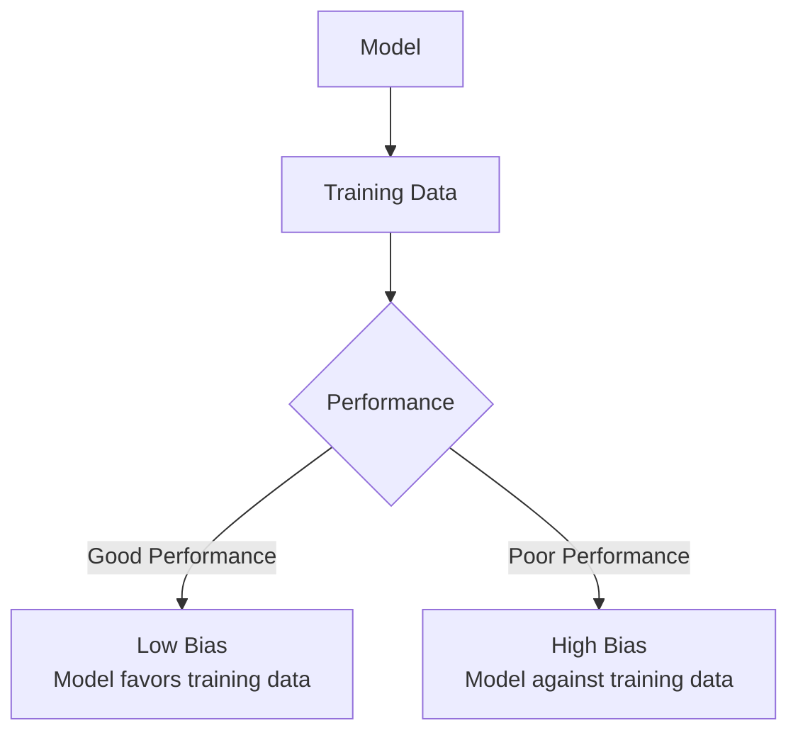
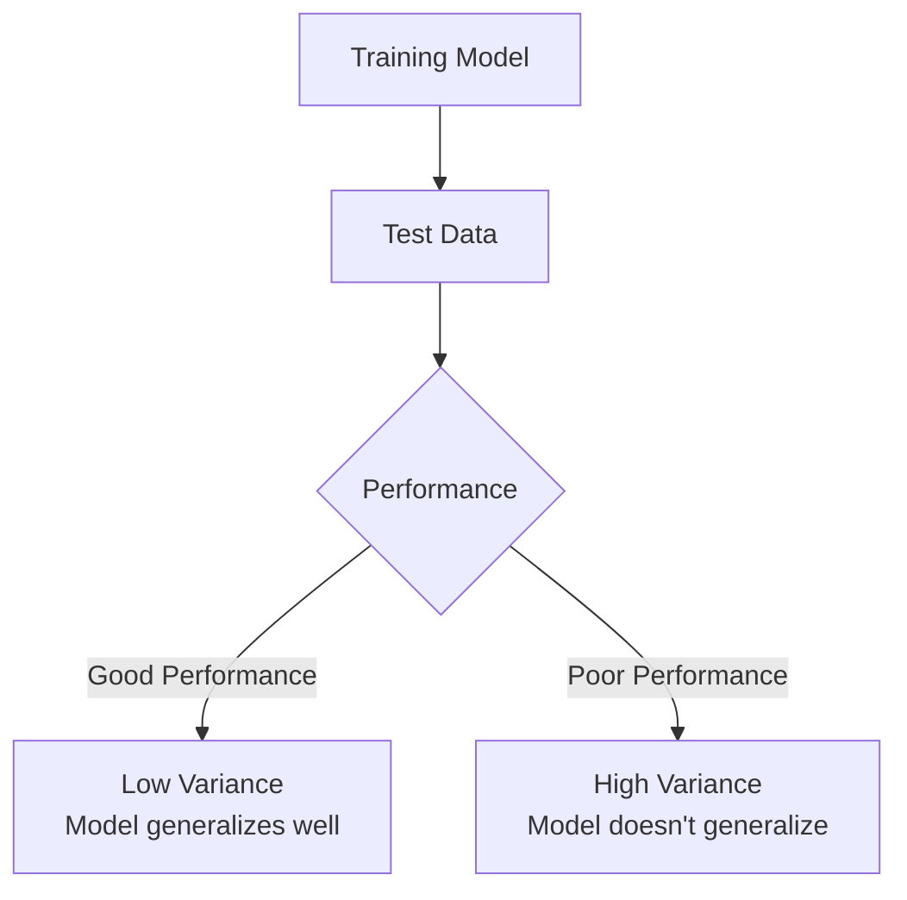
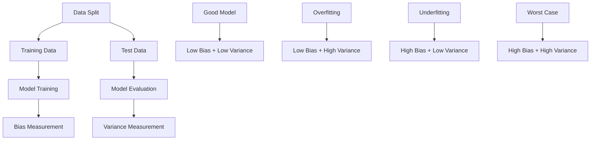
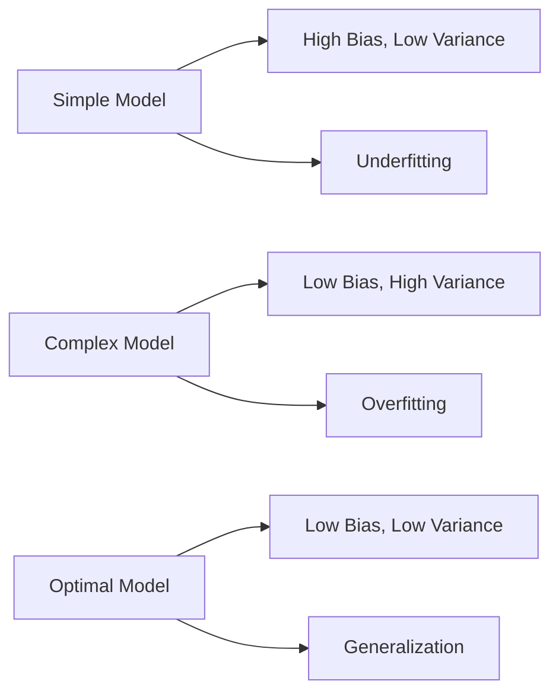

# Chapter 21: Bias and Variance Algorithms

## 🎯 Learning Objectives
- Understand the fundamental concepts of bias and variance
- Master the bias-variance tradeoff in machine learning
- Learn to identify overfitting and underfitting scenarios
- Understand what constitutes a good machine learning model

## 📚 Key Concepts

### 21.1 What is Bias?

**Definition**: Bias is a phenomenon that skews the result of an algorithm in favor or against an idea (or training dataset)

**Core Concept**: Bias measures how well a model performs on training data



#### High Bias vs Low Bias:

**Low Bias**:
- Model performs well on training data
- High training accuracy (e.g., 90%+)
- Model has learned patterns from training data
- Model "favors" the training data

**High Bias**:
- Model performs poorly on training data
- Low training accuracy (e.g., 60%)
- Model fails to learn from training data
- Model is "against" the training data

### 21.2 What is Variance?

**Definition**: Variance refers to the changes in the model when using different portions of the training or test data

**Core Concept**: Variance measures how well a model generalizes to new/unseen data



#### High Variance vs Low Variance:

**Low Variance**:
- Model performs well on test data
- High test accuracy (close to training accuracy)
- Model generalizes well to new data
- Consistent performance across different data subsets

**High Variance**:
- Model performs poorly on test data
- Low test accuracy (much lower than training accuracy)
- Model doesn't generalize to new data
- Inconsistent performance across different data subsets

### 21.3 Bias-Variance Scenarios

#### Scenario 1: Low Bias + High Variance (Overfitting)
```
Training Accuracy: 90%
Test Accuracy: 75%
```
- Model performs well on training data (low bias)
- Model performs poorly on test data (high variance)
- **Result**: Overfitting model

#### Scenario 2: High Bias + High Variance (Worst Case)
```
Training Accuracy: 60%
Test Accuracy: 55%
```
- Model performs poorly on training data (high bias)
- Model performs poorly on test data (high variance)
- **Result**: Bad model that doesn't learn or generalize

#### Scenario 3: Low Bias + Low Variance (Ideal)
```
Training Accuracy: 90%
Test Accuracy: 92%
```
- Model performs well on training data (low bias)
- Model performs well on test data (low variance)
- **Result**: Good, generalized model

#### Scenario 4: High Bias + Low Variance (Underfitting)
```
Training Accuracy: 65%
Test Accuracy: 63%
```
- Model performs poorly on training data (high bias)
- Model performs consistently on test data (low variance)
- **Result**: Underfitting model

### 21.4 Visual Understanding of Bias-Variance



### 21.5 Bias-Variance Tradeoff

**The Tradeoff**: In machine learning, we often face a tradeoff between bias and variance



**Key Insight**:
- **Too simple** → High bias, underfitting
- **Too complex** → Low bias, overfitting
- **Just right** → Balance between bias and variance

### 21.6 Bias-Variance in Different Algorithms

| Algorithm | Bias | Variance | Typical Behavior |
|------------|-------|----------|------------------|
| **Linear Regression** | High | Low | Underfits with complex data |
| **Decision Trees** | Low | High | Overfits easily |
| **Random Forest** | Low | Low | Good balance |
| **Neural Networks** | Low | High | Prone to overfitting |
| **K-Nearest Neighbors** | Low | High | Sensitive to noise |
| **Ridge/Lasso** | Medium | Low | Reduces overfitting |

### 21.7 Identifying Bias-Variance Problems

#### How to Detect Bias-Variance Issues:

**1. Compare Training vs Test Performance**:
```python
train_score = model.score(X_train, y_train)
test_score = model.score(X_test, y_test)

if train_score > test_score:
    print(f"Overfitting: Train={"train_score:.3f"}, Test={"test_score:.3f"}")
elif train_score < 0.7:  # Low training accuracy
    print(f"Underfitting: Train={"train_score:.3f"}")
else:
    print(f"Good Model: Train={"train_score:.3f"}, Test={"test_score:.3f"}")
```

**2. Cross-Validation Analysis**:
```python
from sklearn.model_selection import cross_val_score

cv_scores = cross_val_score(model, X, y, cv=5)
mean_cv_score = np.mean(cv_scores)
std_cv_score = np.std(cv_scores)

if std_cv_score > 0.1:  # High variance across folds
    print("High variance: Model performance varies significantly")
```

**3. Learning Curves**:
```python
from sklearn.model_selection import learning_curve

train_sizes, train_scores, test_scores = learning_curve(
    model, X, y, cv=5, train_sizes=np.linspace(0.1, 1.0, 10)
)

# Plot learning curves to visualize bias-variance
```

### 21.8 Solving Bias-Variance Problems

#### Reducing Bias (Underfitting):
1. **Increase Model Complexity**:
   - Use more complex algorithm
   - Add more features
   - Increase depth (for trees)
   - Add more neurons (for neural networks)

2. **Better Feature Engineering**:
   - Add informative features
   - Remove irrelevant features
   - Use feature transformations

3. **Increase Training Time**:
   - More iterations
   - Better optimization
   - Reduce regularization

#### Reducing Variance (Overfitting):
1. **Get More Training Data**:
   - Collect more samples
   - Data augmentation
   - Cross-validation

2. **Regularization**:
   - L1/L2 regularization (Ridge/Lasso)
   - Dropout (for neural networks)
   - Early stopping

3. **Simplify Model**:
   - Reduce model complexity
   - Reduce number of features
   - Increase bias to reduce variance

4. **Ensemble Methods**:
   - Bagging (Random Forest)
   - Boosting (AdaBoost, Gradient Boosting)

### 21.9 Real-World Examples

#### Example 1: House Price Prediction
- **High Bias**: Model too simple, doesn't capture important factors
- **High Variance**: Model too complex, overfits to specific neighborhoods
- **Solution**: Use regularized regression or ensemble methods

#### Example 2: Image Classification
- **High Bias**: Model can't distinguish between different objects
- **High Variance**: Model memorizes training images but fails on new images
- **Solution**: Deep learning with dropout and data augmentation

#### Example 3: Customer Churn Prediction
- **High Bias**: Model can't identify customer patterns
- **High Variance**: Model identifies patterns that don't generalize
- **Solution**: Ensemble methods with proper cross-validation

## ❓ Interview Questions & Answers

### Q1: What is the difference between bias and variance?
**Answer**:
- **Bias**: Error from overly simplistic assumptions in the learning algorithm. High bias causes underfitting.
- **Variance**: Error from sensitivity to small fluctuations in the training set. High variance causes overfitting.

### Q2: What does low bias and high variance indicate?
**Answer**: This indicates **overfitting**. The model performs very well on training data (low bias) but poorly on test data (high variance). The model has memorized the training data instead of learning general patterns.

### Q3: How do you identify if a model has high bias?
**Answer**: Check training accuracy:
- Low training accuracy (e.g., < 70%) indicates high bias
- Model fails to capture underlying patterns
- The model is too simple for the complexity of the data

### Q4: What is the bias-variance tradeoff?
**Answer**: It's the balance between underfitting (high bias) and overfitting (high variance). We want to find the sweet spot where both bias and variance are low, creating a model that generalizes well to new data.

### Q5: How can you reduce high variance?
**Answer**:
- Get more training data
- Use regularization (L1/L2, dropout)
- Simplify the model
- Use ensemble methods (Random Forest, bagging)
- Use cross-validation

### Q6: When would you prefer a model with slightly higher bias?
**Answer**: When dealing with:
- Limited training data
- Noisy data
- Need interpretability over accuracy
- Real-time prediction requirements
- Resource constraints

### Q7: What does a good bias-variance balance look like?
**Answer**: A good model has:
- High training accuracy (low bias)
- High test accuracy (low variance)
- Similar performance across different data subsets
- Generalization to new, unseen data

### Q8: How does ensemble learning help with bias-variance?
**Answer**: Ensemble methods like Random Forest combine multiple models to reduce variance while maintaining low bias. By averaging predictions, individual model errors cancel out, creating a more stable and accurate model.

## 💡 Key Takeaways

1. **Bias**: Performance on training data (learning)
2. **Variance**: Generalization to test data (adaptation)
3. **Low Bias + Low Variance**: Ideal generalized model
4. **Low Bias + High Variance**: Overfitting
5. **High Bias + Low Variance**: Underfitting
6. **High Bias + High Variance**: Worst case scenario
7. **Tradeoff**: Balance complexity to achieve good generalization

## 🚨 Common Mistakes

**Mistake 1**: Confusing bias with bias term in linear regression
- **Reality**: Statistical bias vs ML bias are different concepts

**Mistake 2**: Thinking all high accuracy models are good
- **Reality**: Need to check both training and test accuracy

**Mistake 3**: Only looking at training accuracy
- **Reality**: Must compare training vs test performance

**Mistake 4**: Assuming complex models are always better
- **Reality**: Complexity can lead to overfitting

**Mistake 5**: Ignoring bias-variance when selecting models
- **Reality**: Should be a key consideration in model selection

## 📝 Quick Revision Points

- **Bias**: Training performance, how well model learns
- **Variance**: Test performance, how well model generalizes
- **Low Bias**: High training accuracy
- **Low Variance**: High test accuracy
- **Overfitting**: Low bias + high variance
- **Underfitting**: High bias + low variance
- **Ideal Model**: Low bias + low variance
- **Tradeoff**: Balance complexity for generalization
- **Solution**: Regularization, ensemble methods, more data