# Chapter 22: XGBoost Classifier Algorithms

## 🎯 Learning Objectives
- Understand XGBoost (Extreme Gradient Boosting) fundamentals
- Master XGBoost decision tree construction process
- Learn similarity weight and information gain calculations
- Understand the complete XGBoost inference mechanism

## 📚 Key Concepts

### 22.1 What is XGBoost?

**Definition**: Extreme Gradient Boosting is an advanced boosting algorithm that uses gradient boosting framework with decision trees as base learners

**Core Concept**: Sequential ensemble learning where each new tree corrects errors made by previous trees

**Full Form**: Extreme Gradient Boosting


### 22.2 XGBoost Dataset Example

**Sample Dataset**: Loan Approval Prediction

**Features**:
- **Salary**: ≤ 50K or > 50K
- **Credit**: Bad, Normal, Good
- **Target**: Approval (0 or 1)

**Rules**:
```
IF Salary ≤ 50K AND Credit = Bad → Approval = 0
IF Salary ≤ 50K AND Credit = Good → Approval = 1
IF Salary ≤ 50K AND Credit = Normal → Approval = 0
IF Salary > 50K AND Credit = Bad → Approval = 0
IF Salary > 50K AND Credit = Good → Approval = 1
IF Salary > 50K AND Credit = Normal → Approval = 1
```

### 22.3 XGBoost Step-by-Step Process

#### Step 1: Create Base Model
- Base model always outputs probability = 0.5
- Acts as starting point for boosting
- Used to calculate initial residuals

#### Step 2: Calculate Residuals
```
Residual = Actual - Predicted
Residual = Approval - 0.5
```

**Example**:
```
Approval: 0, Predicted: 0.5 → Residual: -0.5
Approval: 1, Predicted: 0.5 → Residual: 0.5
Approval: 1, Predicted: 0.5 → Residual: 0.5
```

#### Step 3: Build Binary Decision Tree
- Create binary splits using features
- Calculate similarity weight for each node
- Use information gain for feature selection
- Trees are binary (splits into two branches)

### 22.4 Similarity Weight Calculation

**Formula**:
```
Similarity Weight = (Σ Residual²) / (Σ ["Probability × (1 - Probability)"] + lambda)
```

Where:
- **lambda (Lambda)**: Regularization parameter to prevent overfitting
- **Probability**: Output from previous model
- **Residual**: Error from previous model

#### Example Calculation:

**For a node with residuals ["-0.5, 0.5, 0.5"]**:
```
Numerator = (-0.5)² + (0.5)² + (0.5)² = 0.25 + 0.25 + 0.25 = 0.75

Denominator = Σ["P(1-P)"] + lambda
           = (0.5×0.5) + (0.5×0.5) + (0.5×0.5) + 0
           = 0.25 + 0.25 + 0.25 = 0.75

Similarity Weight = 0.75 / 0.75 = 1.0
```

### 22.5 Information Gain Calculation

**Formula**:
```
Information Gain = (Similarity Weight of Split) - (Sum of Similarity Weights of Children)
```

**Example with Salary Split**:

**Root Node**: All samples
```
Similarity Weight = 1.75
```

**Left Node** (Salary ≤ 50K): 4 samples
```
Similarity Weight = 0.33
```

**Right Node** (Salary > 50K): 3 samples
```
Similarity Weight = 0.33
```

**Information Gain**:
```
IG = 1.75 - (0.33 + 0.33) = 1.75 - 0.66 = 1.09
```

### 22.6 Binary Splitting for Categorical Features

**Challenge**: Credit has 3 categories (Bad, Normal, Good)

**Solution**: Group categories to create binary split


**Decision Tree Structure**:
1. **First Split**: Bad vs (Good + Normal)
2. **Second Split**: Good vs Normal

### 22.7 XGBoost Inference Process

**Final Prediction Formula**:
```
Final Prediction = Base Model + Σ(alphaᵢ × Treeᵢ Output)
```

**Where**:
- **Base Model**: 0.5 (constant)
- **alphaᵢ**: Learning rate for tree t
- **Treeᵢ Output**: Output from decision tree t

#### Inference Steps:

```mermaid
flowchart TD
    A["New Record"] --> B["Base Model<br/>Output: 0.5"]
    B --> C["Log Transformation<br/>log(0.5/(1-0.5)) = 0"]
    C --> D["Tree 1 Path"]
    D --> E["Similarity Weight: 1.0"]
    E --> F["alpha₁ × 1.0"]
    F --> G["Sigmoid Function"]
    G --> H["Add to Base Model"]
    H --> I["Continue to Tree 2"]
    I --> J["Final Prediction"]
```



**Mathematical Steps**:
1. **Base Model**: 0.5
2. **Tree 1 Contribution**: alpha₁ × similarity_weight
3. **Apply Sigmoid**: Convert to probability
4. **Aggregate**: Sum contributions from all trees
5. **Final**: Sigmoid of final value

### 22.8 Complete XGBoost Algorithm


**Algorithm Summary**:
1. Initialize base model (p = 0.5)
2. For each iteration t = 1 to N:
   - Calculate residuals from current model
   - Build decision tree to predict residuals
   - Update model: new_model = old_model + alpha × tree_t
3. Final model is strong learner

### 22.9 Key XGBoost Hyperparameters

#### Core Parameters:
- **n_estimators**: Number of trees (boosting rounds)
- **max_depth**: Maximum depth of decision trees
- **learning_rate (alpha)**: Step size shrinkage (0.01 to 0.3)
- **lambda (lambda)**: L2 regularization term
- **subsample**: Fraction of samples used for each tree
- **colsample_bytree**: Fraction of features used for each tree

#### Regularization Parameters:
- **gamma**: Minimum loss reduction for split
- **min_child_weight**: Minimum sum of instance weight needed in child
- **max_delta_step**: Maximum delta step if desired

### 22.10 Practical Implementation

```python
import xgboost as xgb
from sklearn.model_selection import train_test_split
from sklearn.metrics import accuracy_score, classification_report
import numpy as np

# Create sample data
np.random.seed(42)
X = np.random.rand(1000, 5)  # 1000 samples, 5 features
y = (X[":, 0"] > 0.5).astype(int)  # Binary target

# Split data
X_train, X_test, y_train, y_test = train_test_split(X, y, test_size=0.2, random_state=42)

# Initialize XGBoost Classifier
xgb_classifier = xgb.XGBClassifier(
    n_estimators=100,           # Number of trees
    max_depth=3,                # Maximum tree depth
    learning_rate=0.1,           # Learning rate
    random_state=42,
    use_label_encoder=False,
    eval_metric='logloss'
)

# Train model
xgb_classifier.fit(X_train, y_train)

# Make predictions
y_pred = xgb_classifier.predict(X_test)
y_pred_proba = xgb_classifier.predict_proba(X_test)

# Evaluate
accuracy = accuracy_score(y_test, y_pred)
print(f"Accuracy: {"accuracy:.4f"}")
print("\nClassification Report:")
print(classification_report(y_test, y_pred))

# Feature importance
feature_importance = pd.DataFrame({
    'feature': ["f'feature_{"i"}' for i in range(X.shape[1"])],
    'importance': xgb_classifier.feature_importances_
}).sort_values('importance', ascending=False)

print("\nFeature Importance:")
print(feature_importance)
```

### 22.11 XGBoost vs Other Algorithms

| Aspect | XGBoost | Random Forest | AdaBoost | LightGBM |
|--------|-----------|---------------|----------|----------|
| **Speed** | Fast | Medium | Slow | Very Fast |
| **Performance** | Excellent | Good | Good | Excellent |
| **Memory** | Medium | High | Low | Low |
| **Handling** | Missing Values | No | No | Some |
| **Regularization** | Strong | None | Weak | Strong |
| **Interpretability** | Poor | Medium | Poor | Poor |

### 22.12 Advantages and Disadvantages

#### Advantages:
- **High Performance**: State-of-the-art accuracy
- **Speed**: Optimized for training and prediction
- **Regularization**: Built-in L1/L2 regularization
- **Missing Values**: Handles missing data automatically
- **Feature Importance**: Provides feature importance scores
- **Flexibility**: Works with classification and regression

#### Disadvantages:
- **Complex**: More complex than traditional algorithms
- **Black Box**: Hard to interpret individual decisions
- **Sensitive**: Requires careful hyperparameter tuning
- **Overfitting**: Can overfit with too many trees
- **Memory Usage**: Can be memory-intensive with large datasets

## ❓ Interview Questions & Answers

### Q1: What is XGBoost and how does it differ from Random Forest?
**Answer**: XGBoost is Extreme Gradient Boosting that builds trees sequentially to correct previous errors, while Random Forest builds trees independently and averages their predictions. XGBoost focuses on error correction, Random Forest focuses on reducing variance.

### Q2: How does XGBoost handle categorical variables?
**Answer**: XGBoost automatically handles categorical variables by finding optimal binary splits. For example, a feature with categories ["A, B, C"] might be split as ["A"] vs ["B,C"], then ["B"] vs ["C"], creating the best binary partition.

### Q3: What is the role of lambda (lambda) in XGBoost?
**Answer**: Lambda is the L2 regularization parameter that prevents overfitting by adding penalty for large weights in the model. It appears in the similarity weight calculation denominator: Σ["P(1-P)"] + lambda.

### Q4: How does XGBoost make predictions during inference?
**Answer**: During inference, XGBoost makes predictions by starting with the base model (0.5) and sequentially adding the weighted outputs of each decision tree. The final prediction is the sigmoid of the sum of all contributions.

### Q5: What is information gain in XGBoost?
**Answer**: Information gain measures how much a split improves the similarity weight. It's calculated as the similarity weight of the parent node minus the sum of similarity weights of the child nodes. Higher information gain indicates a better split.

### Q6: Why is XGBoost called "Extreme" Gradient Boosting?
**Answer**: It's called "Extreme" because it uses advanced optimization techniques including:
- Regularization (L1, L2)
- Tree complexity control
- Parallel processing
- Optimized gradient algorithms
- Cache-aware computing

### Q7: How does learning rate affect XGBoost performance?
**Answer**: Learning rate (alpha) controls the contribution of each tree:
- **Low learning rate**: Slower learning, but potentially better generalization
- **High learning rate**: Faster learning, but risk of overfitting
- **Typical range**: 0.01 to 0.3

### Q8: What happens if similarity weight becomes zero?
**Answer**: If similarity weight is zero, it means the residuals perfectly cancel out with the denominator, and the node provides no additional information gain. This can happen when the model has already perfectly fit the data in that region.

## 💡 Key Takeaways

1. **Extreme Gradient Boosting**: Advanced ensemble with sequential error correction
2. **Base Model**: Always starts with 0.5 probability
3. **Residuals**: Errors that each tree tries to correct
4. **Similarity Weight**: Measures how well a node captures residuals
5. **Information Gain**: Used to select optimal splits
6. **Learning Rate**: Controls contribution of each tree
7. **Binary Trees**: All splits are binary, even for categorical variables
8. **Regularization**: Lambda parameter prevents overfitting

## 🚨 Common Mistakes

**Mistake 1**: Using XGBoost for very small datasets
- **Reality**: XGBoost works best with sufficient data (> 1000 samples)

**Mistake 2**: Not tuning hyperparameters
- **Reality**: Grid search for optimal parameters is essential

**Mistake 3**: Ignoring learning rate
- **Reality**: Learning rate significantly impacts performance

**Mistake 4**: Not monitoring for overfitting
- **Reality**: Use cross-validation and early stopping

**Mistake 5**: Using XGBoost when interpretability is crucial
- **Reality**: Consider simpler models when interpretability is required

## 📝 Quick Revision Points

- **XGBoost**: Extreme Gradient Boosting, sequential ensemble
- **Base Model**: Always outputs 0.5 probability
- **Residuals**: Actual - Predicted, errors to be corrected
- **Binary Trees**: All splits are binary in XGBoost
- **Similarity Weight**: Σ(Residual²) / (Σ["P(1-P)"] + lambda)
- **Information Gain**: Parent weight - child weights sum
- **Learning Rate**: Controls tree contribution, prevents overfitting
- **Regularization**: Lambda parameter for L2 regularization
- **Inference**: Sum of weighted tree outputs plus base model