# Chapter 23: XGBoost Regressor Algorithms

## 🎯 Learning Objectives
- Understand XGBoost for regression tasks
- Master regression tree construction and splitting criteria
- Learn residual calculation and objective function optimization
- Understand XGBoost regressor hyperparameters and tuning

## 📚 Key Concepts

### 23.1 What is XGBoost Regressor?

**Definition**: Extreme Gradient Boosting for regression tasks that builds an ensemble of decision trees to predict continuous values

**Core Concept**: Sequential ensemble learning where each new tree corrects the residual errors made by previous trees

**Key Difference from Classifier**: Instead of predicting classes, it predicts continuous numerical values


### 23.2 XGBoost Regression Dataset Example

**Sample Dataset**: House Price Prediction

**Features**:
- **Size**: Square footage (continuous)
- **Bedrooms**: Number of bedrooms (integer)
- **Location**: Distance from city center (continuous)
- **Age**: House age in years (integer)

**Target**: House Price (continuous)

**Sample Data**:
```
Size: 1500, Bedrooms: 3, Location: 5.2, Age: 10 → Price: $250,000
Size: 2000, Bedrooms: 4, Location: 3.1, Age: 5  → Price: $350,000
Size: 1200, Bedrooms: 2, Location: 8.5, Age: 15 → Price: $180,000
```

### 23.3 XGBoost Regression Step-by-Step Process

#### Step 1: Create Base Model
- Base model outputs the mean of all target values
- Acts as starting point for boosting
- Used to calculate initial residuals

**Formula**:
```
Base Prediction = Mean(Y₁, Y₂, Y₃, ..., Yₙ)
```

#### Step 2: Calculate Residuals
```
Residual = Actual - Predicted
Residual = House Price - Base Prediction
```

**Example**:
```
Actual Price: $250,000, Predicted: $260,000 → Residual: -$10,000
Actual Price: $350,000, Predicted: $260,000 → Residual: +$90,000
Actual Price: $180,000, Predicted: $260,000 → Residual: -$80,000
```

#### Step 3: Build Regression Trees
- Create splits using features
- Calculate similarity weight for each node
- Use gradient-based splitting criteria
- Trees predict residual values, not actual values

### 23.4 Objective Function for Regression

**XGBoost Objective Function**:
```
Obj = Σ L(yᵢ, ŷᵢ) + Σ Ω(fₖ)
```

Where:
- **L**: Loss function (typically squared error for regression)
- **Ω**: Regularization term
- **yᵢ**: Actual value
- **ŷᵢ**: Predicted value
- **fₖ**: k-th tree function

#### Loss Function for Regression:
**Squared Error Loss**:
```
L(y, ŷ) = (y - ŷ)²
```

**Alternative Loss Functions**:
- **Absolute Error**: L(y, ŷ) = |y - ŷ|
- **Huber Loss**: Combines squared and absolute error
- **Log-Cosh Loss**: Smooth approximation to absolute error

### 23.5 Gradient and Hessian Calculation

**Gradient (First Derivative)**:
```
gᵢ = ∂L(yᵢ, ŷᵢ) / ∂ŷᵢ
```

For squared error loss:
```
gᵢ = ∂(yᵢ - ŷᵢ)² / ∂ŷᵢ = -2(yᵢ - ŷᵢ)
```

**Hessian (Second Derivative)**:
```
hᵢ = ∂²L(yᵢ, ŷᵢ) / ∂ŷᵢ²
```

For squared error loss:
```
hᵢ = ∂²(yᵢ - ŷᵢ)² / ∂ŷᵢ² = 2
```

### 23.6 Split Finding Algorithm

**Gain Calculation for Regression**:
```
Gain = ½ [GL²/(HL + λ) + GR²/(HR + λ) - (GL + GR)²/(HL + HR + λ)] - γ
```

Where:
- **GL, GR**: Sum of gradients in left and right nodes
- **HL, HR**: Sum of hessians in left and right nodes
- **λ**: L2 regularization parameter
- **γ**: Minimum loss reduction for split

#### Example Calculation:

**Node Split Decision**:

```mermaid
graph TD
    A[Parent Node<br/>GL = -50, HL = 6] --> B{Split on Size}
    B --> C[Left Node: Size < 1500<br/>GL = -80, HL = 4]
    B --> D[Right Node: Size ≥ 1500<br/>GL = 30, HL = 2]

    E[Calculate Gain] --> F[Compare with Threshold]
    F --> G{Gain > γ?}
    G -->|Yes| H[Make Split]
    G -->|No| I[Don't Split]
```


### 23.7 Tree Structure and Leaf Values

**Leaf Value Calculation**:
```
Leaf Value = -Σ Gradient / (Σ Hessian + λ)
```

**Example**:
```
For a leaf node:
Gradients: [-10, 20, -15, 25, -20] → Σ = 0
Hessians: [2, 2, 2, 2, 2] → Σ = 10

Leaf Value = -0 / (10 + 0.1) = 0
```

**Interpretation**: This leaf doesn't improve the prediction (sum of residuals = 0)

### 23.8 XGBoost Regression Inference

**Final Prediction Formula**:
```
Final Prediction = Base Model + Σ(α × Tree Output)
```

**Where**:
- **Base Model**: Mean of target values
- **α**: Learning rate
- **Tree Output**: Leaf values from regression trees

#### Inference Steps:

```mermaid
graph TD
    A[New House Features] --> B[Base Model<br/>Mean Price = $260,000]
    B --> C[Tree 1 Path]
    C --> D[Leaf Value = +$5,000]
    D --> E[Learning Rate × Leaf Value]
    E --> F[Update Prediction]
    F --> G[Tree 2 Path]
    G --> H[Leaf Value = -$2,000]
    H --> I[Continue to All Trees]
    I --> J[Final Prediction]
```



**Mathematical Steps**:
1. **Base Model**: $260,000
2. **Tree 1 Contribution**: 0.1 × $5,000 = +$500
3. **Tree 2 Contribution**: 0.1 × (-$2,000) = -$200
4. **Final**: $260,000 + $500 - $200 + ... = $261,800

### 23.9 XGBoost Regressor Hyperparameters

#### Core Parameters:
- **n_estimators**: Number of trees (boosting rounds)
- **max_depth**: Maximum depth of regression trees
- **learning_rate (α)**: Step size shrinkage (0.01 to 0.3)
- **lambda (λ)**: L2 regularization term
- **alpha (α)**: L1 regularization term
- **subsample**: Fraction of samples used for each tree

#### Regression-Specific Parameters:
- **objective**: 'reg:squarederror' (default), 'reg:absoluteerror', 'reg:huber'
- **gamma**: Minimum loss reduction for split
- **min_child_weight**: Minimum sum of instance weight needed in child

### 23.10 Practical Implementation

```python
import xgboost as xgb
from sklearn.model_selection import train_test_split
from sklearn.metrics import mean_squared_error, mean_absolute_error, r2_score
import numpy as np
import pandas as pd

# Generate sample house price data
np.random.seed(42)
n_samples = 1000

# Features
size = np.random.normal(1800, 500, n_samples)
bedrooms = np.random.poisson(3, n_samples)
location = np.random.exponential(5, n_samples)
age = np.random.normal(10, 5, n_samples)

# Target (house price)
base_price = 100000
price = (base_price +
         size * 100 +
         bedrooms * 25000 +
         location * 10000 -
         age * 2000 +
         np.random.normal(0, 25000, n_samples))

# Create DataFrame
X = pd.DataFrame({
    'size': size,
    'bedrooms': bedrooms,
    'location': location,
    'age': age
})
y = price

# Split data
X_train, X_test, y_train, y_test = train_test_split(X, y, test_size=0.2, random_state=42)

# Initialize XGBoost Regressor
xgb_regressor = xgb.XGBRegressor(
    n_estimators=100,              # Number of trees
    max_depth=4,                   # Maximum tree depth
    learning_rate=0.1,             # Learning rate
    objective='reg:squarederror',  # Squared error loss
    random_state=42,
    reg_lambda=1,                  # L2 regularization
    reg_alpha=0.1                  # L1 regularization
)

# Train model
xgb_regressor.fit(X_train, y_train)

# Make predictions
y_pred = xgb_regressor.predict(X_test)

# Evaluate performance
mse = mean_squared_error(y_test, y_pred)
rmse = np.sqrt(mse)
mae = mean_absolute_error(y_test, y_pred)
r2 = r2_score(y_test, y_pred)

print(f"Model Performance:")
print(f"RMSE: ${rmse:,.2f}")
print(f"MAE: ${mae:,.2f}")
print(f"R² Score: {r2:.4f}")

# Feature importance
feature_importance = pd.DataFrame({
    'feature': X.columns,
    'importance': xgb_regressor.feature_importances_
}).sort_values('importance', ascending=False)

print("\nFeature Importance:")
print(feature_importance)

# Cross-validation for hyperparameter tuning
from sklearn.model_selection import GridSearchCV

param_grid = {
    'n_estimators': [50, 100, 200],
    'max_depth': [3, 4, 6],
    'learning_rate': [0.01, 0.1, 0.2],
    'reg_lambda': [0.1, 1, 10]
}

grid_search = GridSearchCV(
    xgb.XGBRegressor(random_state=42),
    param_grid,
    cv=3,
    scoring='neg_mean_squared_error',
    n_jobs=-1
)

grid_search.fit(X_train, y_train)

print(f"\nBest Parameters: {grid_search.best_params_}")
print(f"Best RMSE: ${np.sqrt(-grid_search.best_score_):,.2f}")

# Visualize predictions vs actual
import matplotlib.pyplot as plt

plt.figure(figsize=(10, 6))
plt.scatter(y_test, y_pred, alpha=0.6)
plt.plot([y_test.min(), y_test.max()], [y_test.min(), y_test.max()], 'r--', lw=2)
plt.xlabel('Actual Price')
plt.ylabel('Predicted Price')
plt.title('XGBoost Regression: Actual vs Predicted')
plt.grid(True)
plt.show()

# Residual analysis
residuals = y_test - y_pred

plt.figure(figsize=(12, 4))

plt.subplot(1, 2, 1)
plt.scatter(y_pred, residuals, alpha=0.6)
plt.axhline(y=0, color='r', linestyle='--')
plt.xlabel('Predicted Price')
plt.ylabel('Residuals')
plt.title('Residual Plot')

plt.subplot(1, 2, 2)
plt.hist(residuals, bins=30, alpha=0.7)
plt.xlabel('Residuals')
plt.ylabel('Frequency')
plt.title('Residual Distribution')

plt.tight_layout()
plt.show()
```

### 23.11 Advanced XGBoost Regression Techniques

#### Early Stopping:
```python
# Use validation set for early stopping
X_train_split, X_val, y_train_split, y_val = train_test_split(
    X_train, y_train, test_size=0.2, random_state=42
)

eval_set = [(X_val, y_val)]
xgb_regressor = xgb.XGBRegressor(
    n_estimators=1000,  # Large number, early stopping will find optimal
    learning_rate=0.05,
    early_stopping_rounds=10,  # Stop if no improvement in 10 rounds
    eval_metric='rmse'
)

xgb_regressor.fit(
    X_train_split, y_train_split,
    eval_set=eval_set,
    verbose=False
)

print(f"Optimal number of trees: {xgb_regressor.best_iteration}")
```

#### Custom Loss Functions:
```python
# Huber loss for robust regression
xgb_huber = xgb.XGBRegressor(
    objective='reg:huber',
    huber_slope=1.0,  # Delta parameter for Huber loss
    n_estimators=100,
    learning_rate=0.1
)

# Pseudo-Huber loss
xgb_pseudo_huber = xgb.XGBRegressor(
    objective='reg:pseudohubererror',
    n_estimators=100,
    learning_rate=0.1
)
```

### 23.12 XGBoost Regressor vs Other Algorithms

| Aspect | XGBoost Regressor | Linear Regression | Random Forest | SVR |
|--------|-------------------|-------------------|---------------|-----|
| **Performance** | Excellent | Good | Good | Good |
| **Speed** | Fast | Very Fast | Medium | Slow |
| **Interpretability** | Poor | Excellent | Medium | Poor |
| **Non-linearity** | Excellent | Poor | Excellent | Good |
| **Regularization** | Strong | Limited | Limited | Good |
| **Feature Importance** | Yes | Limited | Yes | Limited |

### 23.13 Advantages and Disadvantages

#### Advantages:
- **High Accuracy**: State-of-the-art performance on regression tasks
- **Speed**: Optimized for training and prediction
- **Regularization**: Built-in L1/L2 regularization prevents overfitting
- **Feature Importance**: Provides clear feature importance scores
- **Handling Missing Values**: Automatically handles missing data
- **Flexibility**: Multiple loss functions available

#### Disadvantages:
- **Complex**: More complex than traditional regression
- **Black Box**: Hard to interpret individual predictions
- **Sensitive**: Requires careful hyperparameter tuning
- **Memory Usage**: Can be memory-intensive with large datasets
- **Training Time**: Slower than linear models

## ❓ Interview Questions & Answers

### Q1: How does XGBoost Regressor differ from XGBoost Classifier?
**Answer**: The main differences are:
- **Output**: Regressor predicts continuous values, Classifier predicts classes
- **Loss Function**: Regressor uses squared error, Classifier uses log loss
- **Objective**: Minimize error in continuous predictions vs. maximize classification accuracy
- **Leaf Values**: Regressor leaves contain residual values, Classifier leaves contain probabilities

### Q2: What is the role of gradient and hessian in XGBoost regression?
**Answer**:
- **Gradient**: First derivative of loss function, indicates direction of improvement
- **Hessian**: Second derivative, indicates curvature/steepness of loss function
- **Usage**: Both are used in the gain calculation to find optimal splits and compute leaf values efficiently

### Q3: How does XGBoost handle missing values in regression?
**Answer**: XGBoost automatically handles missing values during tree construction:
1. When calculating splits, missing values are sent to both left and right branches
2. The branch that gives better improvement is chosen for missing values
3. During prediction, missing values follow the learned path

### Q4: What are the main hyperparameters to tune in XGBoost Regressor?
**Answer**: Key hyperparameters include:
- **n_estimators**: Number of trees (typically 100-1000)
- **max_depth**: Tree depth (3-10 for most problems)
- **learning_rate**: Step size (0.01-0.3)
- **reg_lambda**: L2 regularization (0.1-10)
- **subsample**: Data sampling fraction (0.6-1.0)
- **colsample_bytree**: Feature sampling fraction (0.6-1.0)

### Q5: How do you prevent overfitting in XGBoost regression?
**Answer**:
- **Regularization**: Use L1/L2 regularization parameters
- **Early Stopping**: Monitor validation error and stop when it stops improving
- **Subsampling**: Use row and column subsampling
- **Learning Rate**: Use smaller learning rate with more trees
- **Tree Constraints**: Limit max_depth and min_child_weight

### Q6: What different loss functions can be used in XGBoost regression?
**Answer**: Common loss functions include:
- **reg:squarederror**: Standard squared error loss (default)
- **reg:absoluteerror**: Absolute error loss (more robust to outliers)
- **reg:huber**: Huber loss (combines squared and absolute error)
- **reg:logistic**: Logistic regression for probabilities
- **reg:pseudohubererror**: Pseudo-Huber loss (smooth approximation)

### Q7: How does XGBoost calculate feature importance for regression?
**Answer**: XGBoost provides three types of feature importance:
- **Gain**: Average improvement in loss function when feature is used for splitting
- **Frequency**: Number of times a feature is used in splits
- **Cover**: Number of samples affected by splits using the feature

### Q8: When would you choose XGBoost Regressor over Linear Regression?
**Answer**: Choose XGBoost when:
- Relationships between features and target are non-linear
- You have complex interactions between features
- High predictive accuracy is crucial
- You have sufficient data (> 1000 samples)
- Feature importance analysis is needed
- Choose Linear Regression when interpretability is crucial or relationships are linear

## 💡 Key Takeaways

1. **Sequential Learning**: Each tree corrects errors from previous trees
2. **Gradient-Based**: Uses gradient and hessian for optimal splitting
3. **Regularization**: Built-in L1/L2 regularization prevents overfitting
4. **Base Model**: Starts with mean of target values for regression
5. **Leaf Values**: Trees predict residual corrections, not final values
6. **Hyperparameter Tuning**: Essential for optimal performance
7. **Multiple Loss Functions**: Choose based on problem characteristics
8. **Feature Importance**: Provides insights into predictive factors

## 🚨 Common Mistakes

**Mistake 1**: Using classification metrics for regression evaluation
- **Reality**: Use RMSE, MAE, R² for regression tasks

**Mistake 2**: Not scaling features for XGBoost
- **Reality**: While XGBoost is less sensitive to scaling, it can still benefit from it

**Mistake 3**: Ignoring early stopping
- **Reality**: Early stopping prevents overfitting and saves training time

**Mistake 4**: Using too large learning rate
- **Reality**: Smaller learning rates with more trees often perform better

**Mistake 5**: Not checking residual plots
- **Reality**: Residual analysis helps identify model assumptions violations

## 📝 Quick Revision Points

- **XGBoost Regressor**: Sequential ensemble for continuous prediction
- **Base Model**: Mean of target values
- **Residuals**: Actual - Predicted, errors to be corrected
- **Gradient**: First derivative of loss function
- **Hessian**: Second derivative of loss function
- **Gain Calculation**: Uses gradients and hessians for optimal splits
- **Leaf Values**: -Σ Gradient / (Σ Hessian + λ)
- **Regularization**: L1 and L2 regularization available
- **Loss Functions**: Squared error, absolute error, Huber loss
- **Hyperparameters**: n_estimators, max_depth, learning_rate, reg_lambda
- **Evaluation**: RMSE, MAE, R², residual analysis