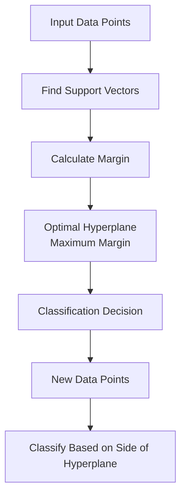
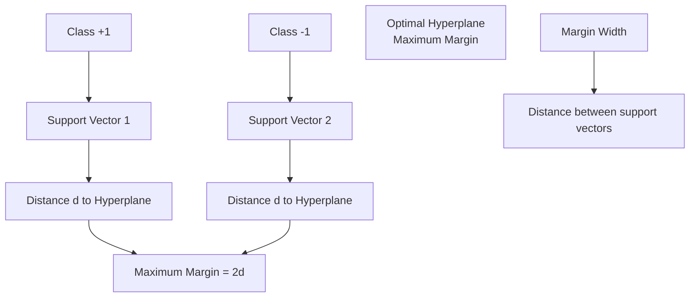
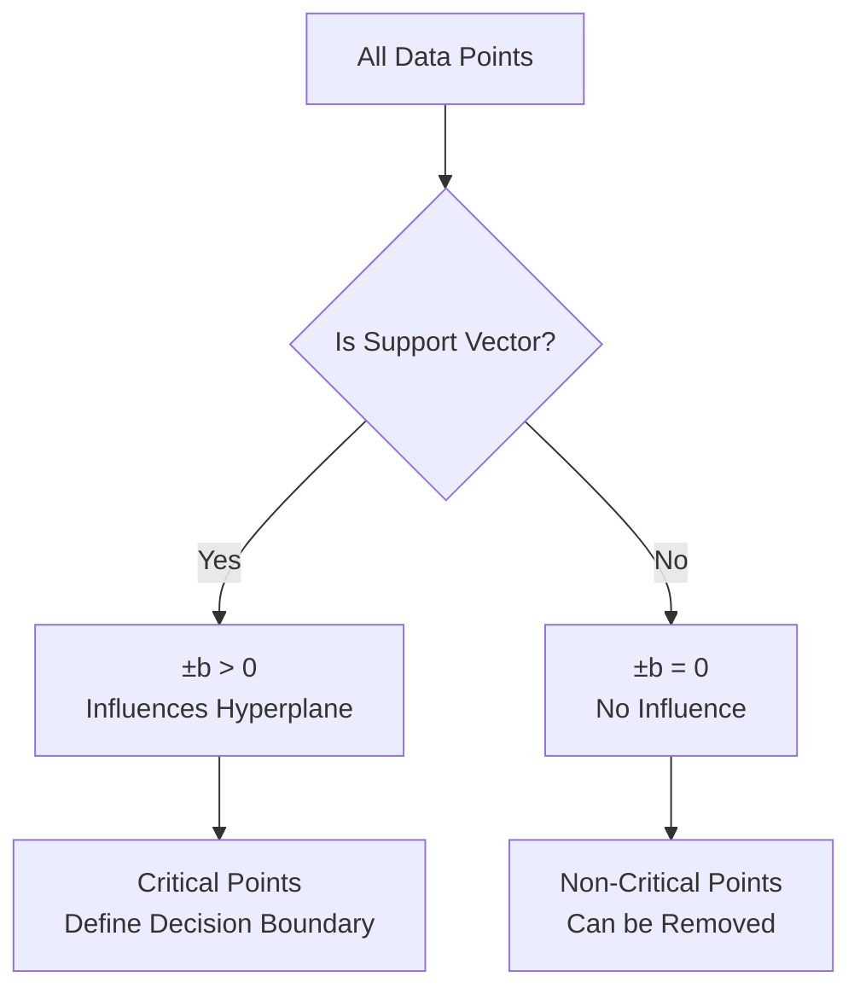
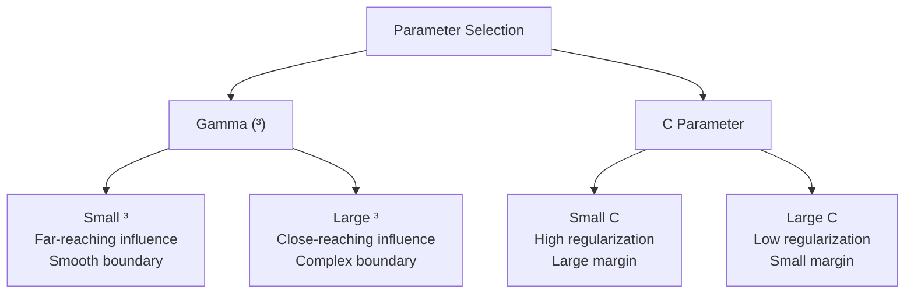

# Chapter 24: Support Vector Machine (SVM) Algorithm

## <¯ Learning Objectives
- Understand Support Vector Machine fundamentals and geometric intuition
- Master margin maximization and optimal hyperplane concept
- Learn kernel functions and non-linear transformations
- Understand SVM parameters (C, gamma) and practical implementation

## =Ú Key Concepts

### 24.1 What is Support Vector Machine?

**Definition**: A supervised machine learning algorithm that finds the optimal hyperplane to separate data points of different classes in high-dimensional space

**Core Concept**: Find the decision boundary with maximum margin between classes

**Full Form**: Support Vector Machine

**Key Innovation**: Uses only support vectors (critical points) to define the decision boundary



### 24.2 SVM Geometric Intuition

#### The Basic Idea:
- Find a line/plane that separates two classes
- Choose the line/plane with maximum distance (margin) from nearest points
- These nearest points are called **support vectors**

#### Visual Understanding:


### 24.3 Mathematical Foundation

#### Hyperplane Equation:
**2D Case (Line)**:
```
w�x� + w‚x‚ + b = 0
```

**General Case**:
```
w@x + b = 0
```

Where:
- **w**: Weight vector (normal to hyperplane)
- **x**: Feature vector
- **b**: Bias term

#### Margin Calculation:
**Distance from point to hyperplane**:
```
Distance = |w@x + b| / ||w||
```

**Margin Width**:
```
Margin = 2 / ||w||
```

### 24.4 SVM Optimization Problem

#### Primal Problem:
```
Minimize: ½ ||w||²
Subject to: yb(w@xb + b) e 1 for all i
```

Where:
- **yb**: Class label (+1 or -1)
- **xb**: Feature vector of point i
- **1**: Minimum margin requirement

#### Dual Problem:
```
Maximize: £ ±b - ½ £ £ ±b±|yby|xb@x|
Subject to: £ ±byb = 0, ±b e 0
```

Where:
- **±b**: Lagrange multipliers
- **±b > 0** only for support vectors

### 24.5 Support Vectors

**Definition**: Data points that lie closest to the hyperplane and influence its position

**Characteristics**:
- Lie on or within the margin boundary
- Critical for determining the optimal hyperplane
- Non-support vectors have ±b = 0



### 24.6 Soft Margin SVM

**Problem**: What if data is not perfectly separable?

**Solution**: Allow some misclassification with penalty

#### Soft Margin Formulation:
```
Minimize: ½ ||w||² + C £ ¾b
Subject to: yb(w@xb + b) e 1 - ¾b, ¾b e 0
```

Where:
- **C**: Regularization parameter (controls trade-off)
- **¾b**: Slack variables (allow violations)

#### C Parameter Impact:
- **Small C**: Large margin, allows more misclassification (high bias, low variance)
- **Large C**: Small margin, penalizes misclassification (low bias, high variance)

### 24.7 Kernel Functions

**Problem**: Linear separation often not possible in original feature space

**Solution**: Transform data to higher dimensional space using kernel functions

#### Kernel Trick:
Instead of explicitly transforming data, use kernel function to compute dot products in high-dimensional space

#### Common Kernels:

**1. Linear Kernel**:
```
K(x, z) = x@z
```
- Use when data is linearly separable

**2. Polynomial Kernel**:
```
K(x, z) = (³x@z + r)H
```
- **³**: Gamma parameter
- **r**: Coefficient (usually 0)
- **d**: Degree of polynomial

**3. RBF (Radial Basis Function) Kernel**:
```
K(x, z) = exp(-³||x - z||²)
```
- Most popular kernel
- **³**: Controls influence of each training example
- Creates infinite-dimensional feature space

**4. Sigmoid Kernel**:
```
K(x, z) = tanh(³x@z + r)
```
- Similar to neural network activation

### 24.8 Kernel Selection and Parameters

#### RBF Kernel Parameters:
**Gamma (³)**:
- **Small ³**: Large influence radius, smoother decision boundary
- **Large ³**: Small influence radius, more complex decision boundary

**C Parameter**:
- **Small C**: More regularization, smoother boundary
- **Large C**: Less regularization, fits training data better



### 24.9 SVM Step-by-Step Process

#### Step 1: Data Preparation
- Scale features (important for SVM)
- Handle categorical variables
- Split data into train/test sets

#### Step 2: Choose Kernel and Parameters
- Select kernel based on data characteristics
- Tune hyperparameters (C, gamma, degree)

#### Step 3: Train SVM
- Solve optimization problem
- Find support vectors
- Determine optimal hyperplane

#### Step 4: Make Predictions
```
Decision: sign(w@x + b)
Probability: Use Platt scaling or similar methods
```

### 24.10 Practical Implementation

```python
import numpy as np
import matplotlib.pyplot as plt
from sklearn import svm, datasets
from sklearn.model_selection import train_test_split, GridSearchCV
from sklearn.preprocessing import StandardScaler
from sklearn.metrics import classification_report, confusion_matrix, accuracy_score
import seaborn as sns

# Generate sample data
np.random.seed(42)
X, y = datasets.make_classification(
    n_samples=1000,
    n_features=2,
    n_informative=2,
    n_redundant=0,
    n_clusters_per_class=1,
    class_sep=1.5,
    random_state=42
)

# Split data
X_train, X_test, y_train, y_test = train_test_split(X, y, test_size=0.2, random_state=42)

# Scale features (important for SVM)
scaler = StandardScaler()
X_train_scaled = scaler.fit_transform(X_train)
X_test_scaled = scaler.transform(X_test)

# Create SVM classifiers with different kernels
kernels = ["'linear', 'poly', 'rbf', 'sigmoid'"]
models = {""}

for kernel in kernels:
    if kernel == 'poly':
        model = svm.SVC(kernel=kernel, degree=3, random_state=42)
    else:
        model = svm.SVC(kernel=kernel, random_state=42)

    model.fit(X_train_scaled, y_train)
    models["kernel"] = model
    y_pred = model.predict(X_test_scaled)

    print(f"\n{"kernel.upper()"} Kernel Results:")
    print(f"Accuracy: {"accuracy_score(y_test, y_pred):.4f"}")
    print(f"Number of Support Vectors: {"len(model.support_vectors_)"}")

# Hyperparameter tuning for RBF kernel
param_grid = {
    'C': ["0.1, 1, 10, 100"],
    'gamma': ["'scale', 'auto', 0.001, 0.01, 0.1, 1"]
}

grid_search = GridSearchCV(
    svm.SVC(kernel='rbf', random_state=42),
    param_grid,
    cv=5,
    scoring='accuracy',
    n_jobs=-1
)

grid_search.fit(X_train_scaled, y_train)

print(f"\nBest Parameters for RBF Kernel: {"grid_search.best_params_"}")
print(f"Best Cross-Validation Accuracy: {"grid_search.best_score_:.4f"}")

# Use best model
best_model = grid_search.best_estimator_
y_pred_best = best_model.predict(X_test_scaled)

print(f"\nBest Model Test Accuracy: {"accuracy_score(y_test, y_pred_best):.4f"}")
print("\nClassification Report:")
print(classification_report(y_test, y_pred_best))

# Visualize decision boundaries
def plot_decision_boundary(model, X, y, title):
    h = 0.02
    x_min, x_max = X[":, 0"].min() - 1, X[":, 0"].max() + 1
    y_min, y_max = X[":, 1"].min() - 1, X[":, 1"].max() + 1
    xx, yy = np.meshgrid(np.arange(x_min, x_max, h),
                         np.arange(y_min, y_max, h))

    Z = model.predict(np.c_["xx.ravel(), yy.ravel()"])
    Z = Z.reshape(xx.shape)

    plt.figure(figsize=(10, 8))
    plt.contourf(xx, yy, Z, alpha=0.8, cmap=plt.cm.RdYlBu)
    plt.scatter(X[":, 0"], X[":, 1"], c=y, edgecolors='black', cmap=plt.cm.RdYlBu)
    plt.title(title)
    plt.xlabel('Feature 1')
    plt.ylabel('Feature 2')

    # Highlight support vectors
    plt.scatter(model.support_vectors_[":, 0"],
                model.support_vectors_[":, 1"],
                s=100, facecolors='none', edgecolors='yellow',
                linewidths=2, label='Support Vectors')
    plt.legend()
    plt.show()

# Plot decision boundaries for different kernels
for kernel, model in models.items():
    plot_decision_boundary(
        model,
        X_train_scaled,
        y_train,
        f'SVM with {"kernel.upper()"} Kernel'
    )

# Plot confusion matrix for best model
cm = confusion_matrix(y_test, y_pred_best)
plt.figure(figsize=(8, 6))
sns.heatmap(cm, annot=True, fmt='d', cmap='Blues')
plt.title('Confusion Matrix - Best SVM Model')
plt.xlabel('Predicted')
plt.ylabel('Actual')
plt.show()

# Multi-class SVM example
X_multi, y_multi = datasets.make_classification(
    n_samples=1000,
    n_features=2,
    n_informative=2,
    n_redundant=0,
    n_classes=3,
    n_clusters_per_class=1,
    random_state=42
)

X_train_m, X_test_m, y_train_m, y_test_m = train_test_split(
    X_multi, y_multi, test_size=0.2, random_state=42
)

# Scale features
scaler_m = StandardScaler()
X_train_m_scaled = scaler_m.fit_transform(X_train_m)
X_test_m_scaled = scaler_m.transform(X_test_m)

# Multi-class SVM
svm_multi = svm.SVC(kernel='rbf', C=10, gamma=0.1, decision_function_shape='ovo', random_state=42)
svm_multi.fit(X_train_m_scaled, y_train_m)

y_pred_m = svm_multi.predict(X_test_m_scaled)
print(f"\nMulti-class SVM Accuracy: {"accuracy_score(y_test_m, y_pred_m):.4f"}")
print("Multi-class Classification Report:")
print(classification_report(y_test_m, y_pred_m))
```

### 24.11 SVM vs Other Algorithms

| Aspect | SVM | Logistic Regression | Decision Trees | Neural Networks |
|--------|-----|---------------------|----------------|-----------------|
| **Decision Boundary** | Linear/Non-linear | Linear | Non-linear | Non-linear |
| **Margin** | Maximized | No margin | No margin | No margin |
| **Support Vectors** | Critical points | All points | All points | All points |
| **Overfitting** | Controlled by C | Regularization | Pruning | Regularization |
| **Feature Scaling** | Essential | Important | Not needed | Important |
| **Interpretability** | Poor | Good | Excellent | Poor |
| **High Dimensions** | Excellent | Poor | Poor | Good |

### 24.12 Advantages and Disadvantages

#### Advantages:
- **Effective in High Dimensions**: Works well with many features
- **Memory Efficient**: Uses only support vectors
- **Versatile**: Different kernels for different problems
- **Robust**: Maximum margin provides good generalization
- **Global Optimum**: Convex optimization ensures global solution

#### Disadvantages:
- **Computationally Intensive**: O(n³) complexity for training
- **Parameter Sensitive**: Requires careful tuning of C and kernel parameters
- **Black Box**: Hard to interpret model decisions
- **Feature Scaling**: Requires proper feature scaling
- **Large Datasets**: Training can be slow for large datasets

### 24.13 SVM Applications

#### Real-world Use Cases:
- **Text Classification**: Email spam detection, document categorization
- **Image Classification**: Face detection, object recognition
- **Bioinformatics**: Protein classification, gene expression analysis
- **Handwriting Recognition**: Digit recognition, signature verification
- **Medical Diagnosis**: Disease prediction, medical image analysis

## S Interview Questions & Answers

### Q1: What is the main intuition behind SVM?
**Answer**: SVM finds the optimal hyperplane that maximizes the margin between different classes. It focuses on the points closest to the decision boundary (support vectors) to create the most robust classifier possible.

### Q2: What are support vectors and why are they important?
**Answer**: Support vectors are the data points that lie closest to the hyperplane and define the margin. They are critical because:
- They determine the position and orientation of the optimal hyperplane
- Only these points are needed to make predictions
- Removing non-support vectors doesn't change the model

### Q3: How does the C parameter affect SVM performance?
**Answer**: The C parameter controls the trade-off between maximizing the margin and minimizing classification error:
- **Small C**: Large margin, allows misclassification (high bias, low variance)
- **Large C**: Small margin, penalizes misclassification heavily (low bias, high variance)

### Q4: What is the kernel trick in SVM?
**Answer**: The kernel trick allows SVM to operate in high-dimensional spaces without explicitly transforming the data. Instead of computing coordinates in the new space, it computes dot products directly using kernel functions, making computations much more efficient.

### Q5: When would you use different kernel functions?
**Answer**:
- **Linear Kernel**: When data is linearly separable or has many features
- **Polynomial Kernel**: When relationship between features is polynomial
- **RBF Kernel**: Default choice for non-linear problems, most versatile
- **Sigmoid Kernel**: Similar to neural networks, rarely used in practice

### Q6: How does SVM handle multi-class classification?
**Answer**: SVM inherently handles binary classification. For multi-class problems, it uses:
- **One-vs-Rest (OvR)**: Train one classifier per class against all others
- **One-vs-One (OvO)**: Train one classifier for each pair of classes

### Q7: Why is feature scaling important for SVM?
**Answer**: Because SVM uses distance calculations and margin optimization:
- Features with large scales can dominate the decision boundary
- The kernel function computations are scale-dependent
- Proper scaling ensures all features contribute equally

### Q8: What are the main advantages of SVM over other algorithms?
**Answer**:
- **Maximum Margin**: Provides good generalization
- **High-dimensional Performance**: Works well with many features
- **Memory Efficiency**: Only stores support vectors
- **Versatility**: Different kernels for different data types
- **Global Optimum**: Convex optimization ensures best solution

## =¡ Key Takeaways

1. **Maximum Margin**: SVM finds hyperplane with maximum distance to nearest points
2. **Support Vectors**: Only critical points determine the decision boundary
3. **Kernel Trick**: Enables non-linear classification without explicit transformation
4. **C Parameter**: Controls trade-off between margin size and classification error
5. **Feature Scaling**: Essential for optimal SVM performance
6. **Multiple Kernels**: Linear, polynomial, RBF, sigmoid for different data patterns
7. **Convex Optimization**: Guarantees global optimum solution
8. **High-dimensional**: Performs well when number of features > number of samples

## =¨ Common Mistakes

**Mistake 1**: Not scaling features before SVM
- **Reality**: SVM is sensitive to feature scales, always scale first

**Mistake 2**: Using RBF kernel for linearly separable data
- **Reality**: Start with linear kernel, only use complex kernels when needed

**Mistake 3**: Ignoring the C parameter
- **Reality**: C significantly impacts model performance and must be tuned

**Mistake 4**: Using SVM on very large datasets without sampling
- **Reality**: SVM training is O(n³), consider sampling for large datasets

**Mistake 5**: Not cross-validating kernel parameters
- **Reality**: Different problems require different kernel parameters

## =Ý Quick Revision Points

- **SVM**: Maximum margin classifier for binary and multi-class problems
- **Support Vectors**: Critical points that define decision boundary
- **Margin**: Distance between hyperplane and nearest points
- **C Parameter**: Trade-off between margin size and misclassification penalty
- **Kernels**: Linear, polynomial, RBF, sigmoid for non-linear transformations
- **Kernel Trick**: Compute high-dimensional relationships without explicit transformation
- **Gamma**: RBF kernel parameter controlling influence radius
- **Feature Scaling**: Essential preprocessing step for SVM
- **Multi-class**: Use One-vs-Rest or One-vs-One strategies
- **Advantages**: Maximum margin, high-dimensional performance, global optimum