# Chapter 25: Gradient Boosting Machines (GBM)

## 🎯 Learning Objectives
- Understand the fundamentals of Gradient Boosting
- Master the sequential learning approach
- Learn how GBM differs from AdaBoost and Random Forests
- Understand residual-based learning
- Learn hyperparameter tuning for GBM
- Apply GBM for both classification and regression

## 📚 Key Concepts

### 25.1 What is Gradient Boosting?

**Definition**: Gradient Boosting is an ensemble technique that builds models sequentially, where each new model corrects the errors (residuals) made by the previous models.

**Key Principle**: Instead of fitting data directly, each new tree fits the **residual errors** of the previous predictions.

**Core Difference from Other Ensembles**:
- **Bagging** (Random Forest): Models train in parallel, independently
- **Boosting** (AdaBoost): Sequential training, focuses on misclassified samples by adjusting weights
- **Gradient Boosting**: Sequential training, fits residuals using gradient descent

```mermaid
flowchart TD
    A["Training Data<br/>(X, y)"] --> B["Model 1<br/>Decision Tree"]
    B --> C["Predictions: ŷ₁<br/>Residuals: r₁ = y - ŷ₁"]
    C --> D["Model 2<br/>Fits r₁"]
    D --> E["Predictions: ŷ₂<br/>Residuals: r₂ = r₁ - ŷ₂"]
    E --> F["Model 3<br/>Fits r₂"]
    F --> G["Continue until<br/>n_estimators"]
    G --> H["Final Prediction<br/>ŷ = ŷ₁ + ŷ₂ + ŷ₃ + ..."]
```



### 25.2 How Gradient Boosting Works (Regression)

**Step-by-Step Process:**

#### Example Dataset:
| X (Hours Studied) | y (Actual Score) |
|-------------------|------------------|
| 2 | 50 |
| 4 | 70 |
| 6 | 85 |
| 8 | 95 |

#### Step 1: Initialize with Mean
First prediction for all samples:
$$\hat{y}_0 = \text{mean}(y) = \frac{50 + 70 + 85 + 95}{4} = 75$$

#### Step 2: Calculate Residuals
$$r_1 = y - \hat{y}_0$$

| X | y | ŷ₀ | Residual (r₁ = y - ŷ₀) |
|---|---|----|-----------------------|
| 2 | 50 | 75 | -25 |
| 4 | 70 | 75 | -5 |
| 6 | 85 | 75 | +10 |
| 8 | 95 | 75 | +20 |

#### Step 3: Fit Tree to Residuals
Train a decision tree to predict residuals: $h_1(X) \rightarrow r_1$

Let's say tree predicts: $h_1(2)=-20, h_1(4)=-8, h_1(6)=12, h_1(8)=18$

#### Step 4: Update Predictions with Learning Rate
$$\hat{y}_1 = \hat{y}_0 + \eta \cdot h_1(X)$$

Where $\eta$ = learning rate (e.g., 0.1)

For $X=2$:
$$\hat{y}_1(2) = 75 + 0.1 \times (-20) = 75 - 2 = 73$$

#### Step 5: Calculate New Residuals
$$r_2 = y - \hat{y}_1$$

For $X=2$:
$$r_2(2) = 50 - 73 = -23$$

#### Step 6: Repeat
Continue fitting trees to residuals until convergence or max iterations.

**Final Prediction Formula:**
$$\hat{y}(X) = \hat{y}_0 + \eta \sum_{m=1}^{M} h_m(X)$$

Where:
- $\hat{y}_0$ = initial prediction (mean)
- $\eta$ = learning rate
- $M$ = number of trees (n_estimators)
- $h_m(X)$ = prediction from tree $m$

### 25.3 Gradient Boosting for Classification

For binary classification, use **log-loss** (cross-entropy):

**Loss Function:**
$$L(y, p) = -[y \log(p) + (1-y) \log(1-p)]$$

**Gradient:**
$$\frac{\partial L}{\partial p} = \frac{p - y}{p(1-p)}$$

**Process:**
1. Initialize with log-odds: $F_0(x) = \log\left(\frac{p}{1-p}\right)$ where $p = \frac{\sum y}{n}$
2. For each iteration:
   - Calculate pseudo-residuals (negative gradient)
   - Fit tree to pseudo-residuals
   - Update predictions using learning rate
3. Convert final prediction to probability using sigmoid

### 25.4 Key Hyperparameters


#### Important Hyperparameters:

| Parameter | Description | Typical Range | Effect |
|-----------|-------------|---------------|--------|
| **n_estimators** | Number of boosting stages | 50-500 | More trees → better fit, slower |
| **learning_rate** | Shrinkage factor (η) | 0.01-0.3 | Lower → more trees needed, better generalization |
| **max_depth** | Maximum tree depth | 3-8 | Higher → more complex, overfitting risk |
| **min_samples_split** | Min samples to split | 2-20 | Higher → simpler trees |
| **subsample** | Fraction of samples per tree | 0.5-1.0 | <1.0 → stochastic gradient boosting |
| **loss** | Loss function | 'deviance', 'exponential' | Depends on problem |

**Trade-off**: Learning Rate vs. Number of Estimators
- **High learning rate** (0.3) + **Fewer trees** (50) = Fast but may underfit
- **Low learning rate** (0.01) + **More trees** (500) = Slow but better performance

### 25.5 GBM vs Other Algorithms

| Aspect | Random Forest | AdaBoost | Gradient Boosting |
|--------|---------------|----------|-------------------|
| **Training** | Parallel | Sequential | Sequential |
| **Focus** | Variance reduction | Misclassified samples | Residual errors |
| **Weak Learner** | Deep trees | Shallow stumps | Shallow trees (3-8 depth) |
| **Learning** | Bootstrap + feature sampling | Sample weight adjustment | Gradient descent on residuals |
| **Overfitting** | Less prone | Moderate | More prone (needs tuning) |
| **Speed** | Fast (parallel) | Moderate | Slow (sequential) |
| **Accuracy** | Good | Good | Excellent (with tuning) |

### 25.6 Advantages and Disadvantages

**Advantages:**
- ✅ Excellent predictive accuracy
- ✅ Handles mixed data types (numerical, categorical)
- ✅ Captures complex non-linear relationships
- ✅ Feature importance available
- ✅ Robust to outliers (with proper loss function)
- ✅ No need for feature scaling

**Disadvantages:**
- ❌ Prone to overfitting if not tuned properly
- ❌ Sequential training → cannot parallelize
- ❌ Slower than Random Forest
- ❌ Requires careful hyperparameter tuning
- ❌ Less interpretable than single trees
- ❌ Sensitive to noisy data

### 25.7 Practical Implementation (Scikit-learn)

**Regression Example:**
```python
from sklearn.ensemble import GradientBoostingRegressor
from sklearn.model_selection import train_test_split
from sklearn.metrics import mean_squared_error, r2_score

# Split data
X_train, X_test, y_train, y_test = train_test_split(X, y, test_size=0.2)

# Create GBM model
gbm = GradientBoostingRegressor(
    n_estimators=100,        # Number of trees
    learning_rate=0.1,       # Shrinkage
    max_depth=3,             # Tree depth
    min_samples_split=2,     # Min samples to split
    subsample=0.8,           # 80% row sampling
    random_state=42
)

# Train
gbm.fit(X_train, y_train)

# Predict
y_pred = gbm.predict(X_test)

# Evaluate
mse = mean_squared_error(y_test, y_pred)
r2 = r2_score(y_test, y_pred)
print(f"MSE: {mse:.2f}, R²: {r2:.2f}")

# Feature importance
importance = gbm.feature_importances_
```

**Classification Example:**
```python
from sklearn.ensemble import GradientBoostingClassifier

# Create GBM classifier
gbm_clf = GradientBoostingClassifier(
    n_estimators=100,
    learning_rate=0.1,
    max_depth=3,
    loss='deviance',         # Log-loss for classification
    random_state=42
)

# Train
gbm_clf.fit(X_train, y_train)

# Predict probabilities
y_pred_proba = gbm_clf.predict_proba(X_test)[:, 1]

# Predict classes
y_pred = gbm_clf.predict(X_test)
```

### 25.8 Feature Importance in GBM

**How it's calculated:**
- Based on how much each feature decreases impurity across all trees
- Weighted by number of samples reaching each split

**Interpretation:**
- Higher value → more important feature
- Sum of all importances = 1.0

### 25.9 Early Stopping

**Concept**: Stop training when validation error stops improving

```python
from sklearn.ensemble import GradientBoostingClassifier

gbm = GradientBoostingClassifier(
    n_estimators=1000,
    learning_rate=0.01,
    validation_fraction=0.1,  # Use 10% for validation
    n_iter_no_change=10,       # Stop if no improvement for 10 iterations
    random_state=42
)

gbm.fit(X_train, y_train)
print(f"Stopped at iteration: {gbm.n_estimators_}")
```

## 🎤 Interview Questions and Answers

**Q1: What is the main difference between Gradient Boosting and AdaBoost?**

**Answer**:
- **AdaBoost** adjusts sample weights - increases weights for misclassified samples and decreases for correctly classified ones
- **Gradient Boosting** fits new models to the residual errors (pseudo-residuals) using gradient descent
- AdaBoost uses exponential loss, GBM can use various loss functions (MSE, log-loss, etc.)
- GBM is more flexible and generally achieves better performance

**Q2: Why is the learning rate important in Gradient Boosting?**

**Answer**:
The learning rate (shrinkage parameter η) controls how much each tree contributes to the final prediction:
- **High learning rate** (0.3): Faster convergence but may overfit, needs fewer trees
- **Low learning rate** (0.01): Better generalization, smoother learning curve, needs more trees
- Trade-off: `learning_rate × n_estimators` should be balanced
- Best practice: Use low learning rate (0.01-0.1) with more trees for better performance

**Q3: How does Gradient Boosting handle overfitting?**

**Answer**:
Several techniques:
1. **Learning rate**: Lower values reduce overfitting
2. **max_depth**: Limit tree complexity (typically 3-8)
3. **min_samples_split**: Require minimum samples for splitting
4. **subsample**: Use fraction of data per tree (<1.0 for stochastic GBM)
5. **Early stopping**: Stop when validation error stops improving
6. **Regularization**: L1/L2 penalties on tree complexity

**Q4: Explain the concept of residual fitting in Gradient Boosting.**

**Answer**:
Instead of predicting the target directly, each new tree predicts the **residual error** of previous predictions:
- Tree 1 predicts: $\hat{y}_1$, residual: $r_1 = y - \hat{y}_1$
- Tree 2 fits $r_1$, predicts: $\hat{y}_2$, residual: $r_2 = r_1 - \hat{y}_2$
- Final prediction: $\hat{y} = \hat{y}_1 + \hat{y}_2 + \hat{y}_3 + ...$
- This focuses learning on the errors, progressively improving predictions

**Q5: Why is Gradient Boosting called "Gradient" Boosting?**

**Answer**:
It uses **gradient descent** in function space:
- For each iteration, calculates the negative gradient of the loss function
- This gradient represents the direction of steepest descent
- New tree fits these pseudo-residuals (negative gradients)
- Updates predictions by moving in the direction of negative gradient
- Learning rate controls step size in gradient descent

**Q6: When would you choose Gradient Boosting over Random Forest?**

**Answer**:
Choose **Gradient Boosting** when:
- Need highest possible accuracy (willing to tune extensively)
- Have clean data with minimal noise
- Can afford longer training time
- Feature interactions are important
- Working on competitions (Kaggle)

Choose **Random Forest** when:
- Need faster training (parallel processing)
- Have noisy data
- Want less hyperparameter tuning
- Need quick baseline model
- Interpretability is important

**Q7: What is the subsample parameter and how does it help?**

**Answer**:
- **subsample**: Fraction of training samples used for each tree (e.g., 0.8 = 80%)
- Creates **Stochastic Gradient Boosting**
- Benefits:
  - Reduces overfitting (introduces randomness)
  - Faster training (smaller data per tree)
  - Improves generalization
  - Similar to bootstrap in Random Forest
- Typical values: 0.5 to 1.0
- Values <1.0 recommended for large datasets

**Q8: How do you tune Gradient Boosting hyperparameters?**

**Answer**:
**Step-by-step tuning strategy:**
1. **Fix high learning_rate (0.1)** and tune **n_estimators** using early stopping
2. **Tune tree parameters**: max_depth (3-8), min_samples_split (2-20)
3. **Tune subsample** (0.6-0.9) and **max_features** (sqrt or log2)
4. **Lower learning_rate** (0.01-0.05) and **increase n_estimators** proportionally
5. Use **GridSearchCV** or **RandomizedSearchCV** for systematic tuning

**Example:**
```python
param_grid = {
    'n_estimators': [100, 200, 500],
    'learning_rate': [0.01, 0.05, 0.1],
    'max_depth': [3, 5, 7],
    'subsample': [0.8, 0.9, 1.0]
}
```

**Q9: What are the different loss functions in Gradient Boosting?**

**Answer**:
**For Regression:**
- **'ls'** (Least Squares): Standard MSE, sensitive to outliers
- **'lad'** (Least Absolute Deviation): MAE, robust to outliers
- **'huber'**: Combination of MSE and MAE, balanced approach
- **'quantile'**: Predicts quantiles instead of mean

**For Classification:**
- **'deviance'** (Log-loss): Default, provides probability estimates
- **'exponential'**: Similar to AdaBoost, more sensitive to outliers

**Q10: Explain the initialization step in Gradient Boosting.**

**Answer**:
**For Regression:**
- Initialize with mean: $F_0(x) = \bar{y} = \frac{1}{n}\sum_{i=1}^{n} y_i$
- All samples get same initial prediction

**For Binary Classification:**
- Initialize with log-odds: $F_0(x) = \log\left(\frac{p}{1-p}\right)$
- Where $p = \frac{\text{number of 1s}}{\text{total samples}}$
- This gives the prior probability before seeing features

**Q11: What is the role of max_depth in Gradient Boosting?**

**Answer**:
- **max_depth**: Maximum depth of individual trees (weak learners)
- Typical values: 3-8 (shallow trees)
- **Why shallow?**
  - GBM combines many trees, don't need each to be complex
  - Prevents overfitting
  - Faster training
  - max_depth=1 (stumps) → only main effects
  - max_depth=3-5 → captures 2-3 way interactions
  - max_depth>8 → rarely needed, overfitting risk

**Q12: How does Gradient Boosting handle categorical features?**

**Answer**:
Standard GBM in scikit-learn requires encoding:
1. **One-Hot Encoding**: For low cardinality (<10 categories)
2. **Label Encoding**: For tree-based models (captures ordinality in splits)
3. **Target Encoding**: Mean of target for each category
4. **Frequency Encoding**: Count of each category

**Note**: Modern implementations (CatBoost, LightGBM) handle categorical features natively.

**Q13: What is early stopping and why is it useful?**

**Answer**:
**Early Stopping**: Terminate training when validation error stops improving

**Benefits:**
- Prevents overfitting
- Saves computation time
- Automatically finds optimal n_estimators
- No need to manually tune n_estimators

**Implementation:**
```python
gbm = GradientBoostingClassifier(
    n_estimators=1000,
    validation_fraction=0.1,   # 10% for validation
    n_iter_no_change=10,        # Patience
    tol=0.0001                  # Minimum improvement
)
```

**Q14: Compare the computational complexity of GBM and Random Forest.**

**Answer**:

| Aspect | Random Forest | Gradient Boosting |
|--------|---------------|-------------------|
| **Training** | O(n × m × log(n) × T) parallelized | O(n × m × log(n) × T) sequential |
| **Prediction** | O(T × depth) | O(T × depth) |
| **Parallelization** | Fully parallel (trees independent) | Limited (only within tree) |
| **Wall-clock time** | Fast (uses all cores) | Slow (one tree at a time) |

Where: n=samples, m=features, T=trees

**Q15: What is the difference between GBM and XGBoost?**

**Answer**:
**Gradient Boosting (sklearn)**: Basic implementation
- Standard gradient boosting
- Sequential tree building
- No built-in regularization
- No parallel processing

**XGBoost**: Optimized and enhanced GBM
- Regularization (L1, L2) built-in
- Parallel tree construction
- Tree pruning (max_depth from leaves, not nodes)
- Handles missing values natively
- Column sub-sampling
- Cache-aware optimization
- Faster and more accurate

## 🔑 Key Takeaways

1. **Sequential Learning**: GBM builds trees sequentially, each correcting previous errors
2. **Residual Fitting**: Each new tree fits the residual errors, not the original target
3. **Learning Rate**: Controls contribution of each tree; lower is better but needs more trees
4. **Gradient Descent**: Uses gradient descent in function space to minimize loss
5. **Hyperparameter Tuning**: Requires careful tuning for best performance
6. **High Accuracy**: One of the best performing algorithms for structured data
7. **Overfitting Risk**: More prone than Random Forest; needs regularization
8. **Flexible Loss Functions**: Can optimize different objectives (MSE, log-loss, MAE)
9. **Early Stopping**: Essential technique to prevent overfitting and save time
10. **Trade-offs**: Accuracy vs. training time; needs balance between learning rate and n_estimators

## ⚠️ Common Mistakes to Avoid

1. ❌ **Using high learning rate with few trees** → Underfitting
   - ✅ Use low learning rate (0.01-0.1) with more trees

2. ❌ **Making trees too deep** (max_depth > 10) → Overfitting
   - ✅ Keep trees shallow (3-8 depth)

3. ❌ **Not using early stopping** → Wasted computation
   - ✅ Always use validation_fraction and n_iter_no_change

4. ❌ **Ignoring subsample parameter** → Missing regularization opportunity
   - ✅ Use subsample=0.8 for stochastic boosting

5. ❌ **Not scaling learning_rate with n_estimators** → Poor performance
   - ✅ If doubling trees, can halve learning rate

6. ❌ **Using GBM on noisy data without preprocessing** → Overfits noise
   - ✅ Clean data, handle outliers, or use robust loss functions

7. ❌ **Not monitoring validation error during training** → Miss overfitting
   - ✅ Plot training vs. validation error curves

8. ❌ **Forgetting to tune min_samples_split** → Overly complex trees
   - ✅ Increase for smaller, simpler trees

9. ❌ **Using default parameters without tuning** → Suboptimal performance
   - ✅ Always tune hyperparameters for your specific dataset

10. ❌ **Comparing GBM with Random Forest on small datasets** → Unfair comparison
    - ✅ GBM shines on larger datasets; RF better for small, noisy data

## 📝 Quick Revision Points

### Core Concepts
- **Sequential boosting**: Trees built one after another
- **Residual learning**: Fit errors of previous predictions
- **Gradient descent**: Minimizes loss by following negative gradient
- **Weak learners**: Shallow decision trees (typically depth 3-8)

### Key Formula
$$\hat{y}(X) = \hat{y}_0 + \eta \sum_{m=1}^{M} h_m(X)$$
- $\hat{y}_0$: Initial prediction (mean for regression)
- $\eta$: Learning rate (0.01-0.3)
- $h_m(X)$: Prediction from tree m
- $M$: Number of trees

### Important Hyperparameters
1. **n_estimators**: 50-500 (more with low learning rate)
2. **learning_rate**: 0.01-0.1 (lower is better)
3. **max_depth**: 3-8 (shallow trees)
4. **subsample**: 0.5-1.0 (0.8 recommended)
5. **min_samples_split**: 2-20

### Algorithm Steps
1. Initialize with mean (regression) or log-odds (classification)
2. For m=1 to M:
   - Calculate residuals/pseudo-residuals
   - Fit tree to residuals
   - Update predictions with learning_rate × tree_prediction
3. Final prediction = sum of all contributions

### When to Use
✅ **Use GBM when:**
- Need highest accuracy
- Have clean, structured data
- Can afford tuning time
- Working on competitions

❌ **Avoid GBM when:**
- Data is very noisy
- Need fast training
- Limited tuning resources
- Real-time predictions required

### GBM vs Others
- **vs Random Forest**: Higher accuracy, slower, needs more tuning
- **vs AdaBoost**: More flexible loss functions, better performance
- **vs XGBoost**: XGBoost is optimized GBM with regularization
- **vs LightGBM**: LightGBM is faster, better for large datasets

### Loss Functions
- **Regression**: MSE (ls), MAE (lad), Huber
- **Classification**: Log-loss (deviance), Exponential

### Best Practices
1. Start with learning_rate=0.1, tune n_estimators
2. Tune tree parameters (max_depth, min_samples_split)
3. Add subsample for regularization
4. Lower learning_rate and increase n_estimators
5. Use early stopping
6. Monitor validation curves
7. Compare with Random Forest baseline
