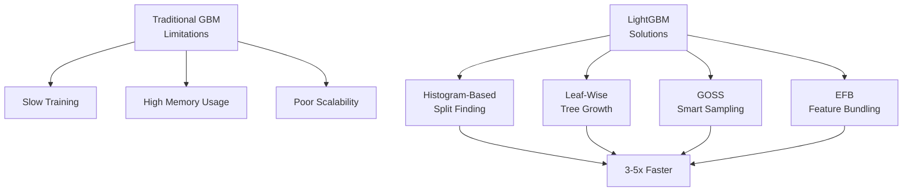
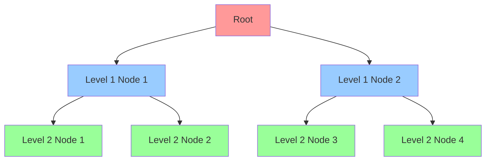
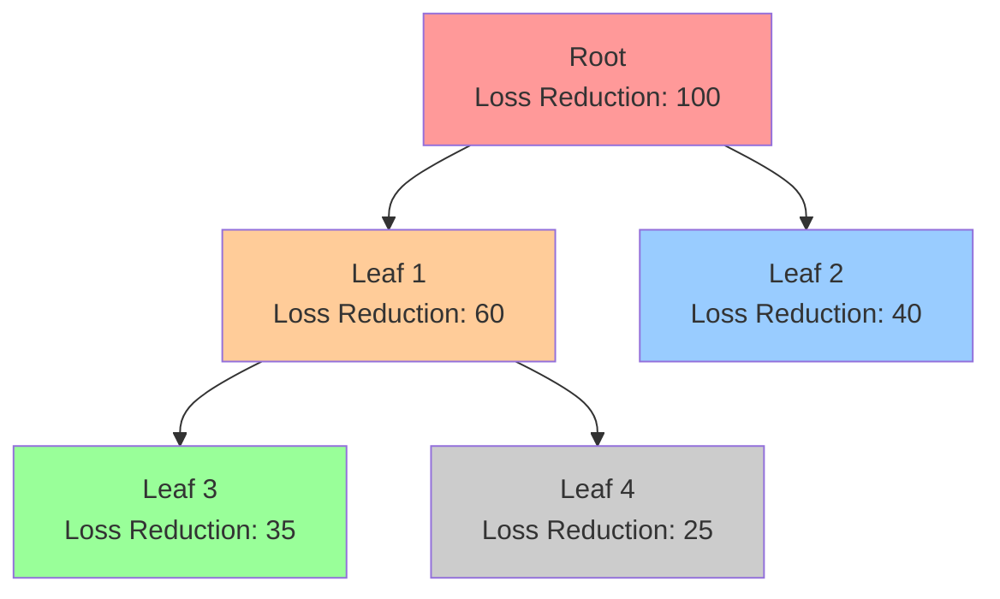
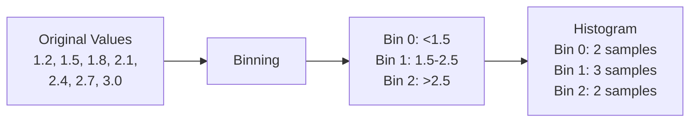
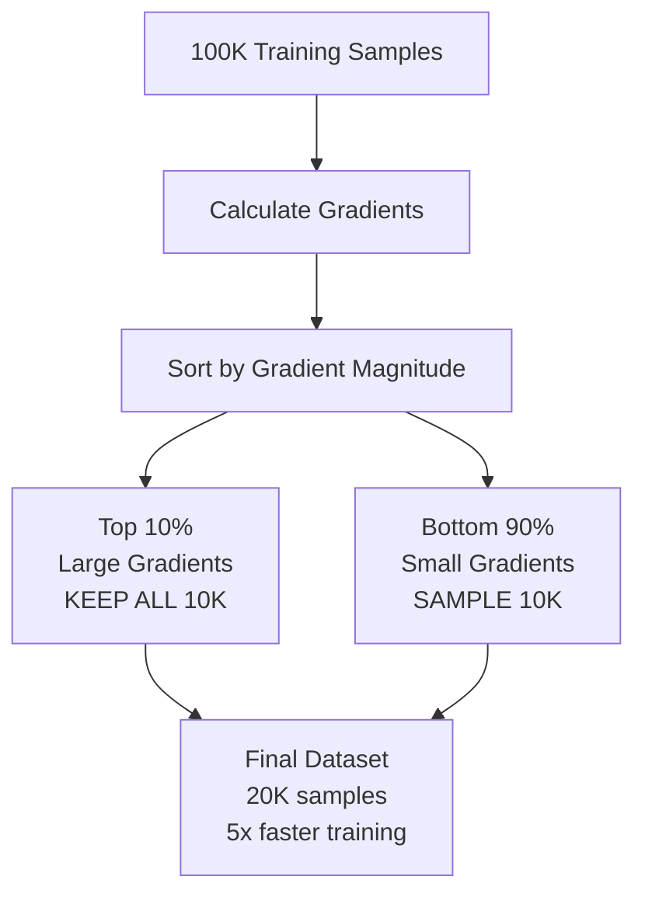
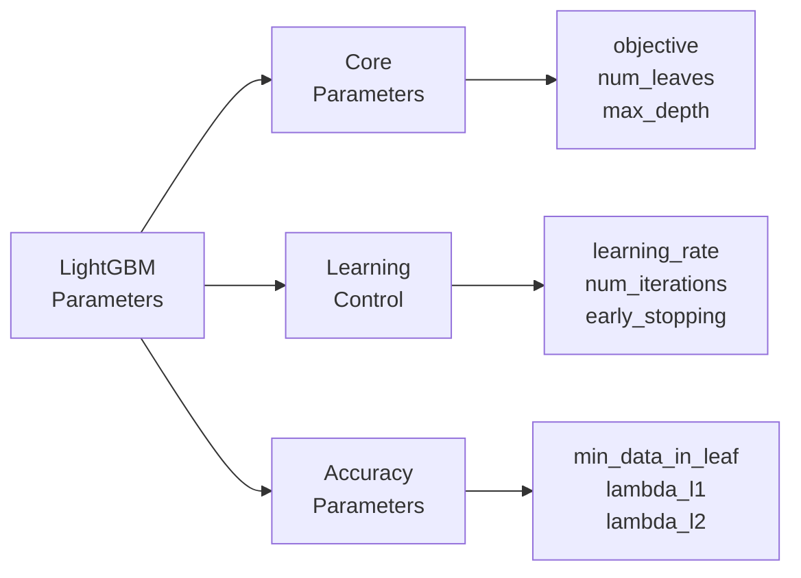

# Chapter 26: LightGBM (Light Gradient Boosting Machine)

## 🎯 Learning Objectives
- Understand LightGBM architecture and innovations
- Master the difference between level-wise and leaf-wise tree growth
- Learn Gradient-Based One-Side Sampling (GOSS)
- Understand Exclusive Feature Bundling (EFB)
- Learn histogram-based split finding
- Apply LightGBM for fast and accurate predictions
- Handle categorical features natively

## 📚 Key Concepts

### 26.1 What is LightGBM?

**Definition**: LightGBM is a gradient boosting framework developed by Microsoft that uses tree-based learning algorithms, designed for **speed and efficiency** while maintaining high accuracy.

**Key Innovations:**
1. **Leaf-wise tree growth** (vs. level-wise)
2. **Histogram-based split finding**
3. **Gradient-Based One-Side Sampling (GOSS)**
4. **Exclusive Feature Bundling (EFB)**
5. **Native categorical feature support**
6. **Parallel and GPU learning**

**Created by**: Microsoft Research (2017)



### 26.2 Level-wise vs Leaf-wise Tree Growth

#### Level-wise Growth (Traditional - XGBoost, sklearn GBM)

**Strategy**: Grow tree **level by level**, splitting all nodes at the same depth



**Characteristics:**
- Grows all nodes at same depth
- Balanced tree structure
- May split nodes with low information gain
- Slower convergence

#### Leaf-wise Growth (LightGBM)

**Strategy**: Grow tree **leaf by leaf**, always splitting the leaf with **maximum loss reduction**



**Characteristics:**
- Splits leaf with maximum delta loss
- Asymmetric tree structure
- Faster convergence
- Can overfit if max_depth not controlled
- **More accurate** for same number of leaves

**Comparison:**

| Aspect | Level-wise | Leaf-wise |
|--------|-----------|-----------|
| **Growth strategy** | By level | By best leaf |
| **Tree structure** | Balanced | Asymmetric |
| **Convergence** | Slower | Faster |
| **Accuracy** | Good | Better |
| **Overfitting risk** | Lower | Higher (needs max_depth) |
| **Used by** | XGBoost, GBM | LightGBM |

### 26.3 Histogram-Based Split Finding

**Traditional Approach** (XGBoost):
- Pre-sort all feature values
- Scan all possible split points
- Time complexity: $O(\\# \text{data} \times \\# \text{features})$

**LightGBM Approach**:
- **Bin continuous features** into discrete bins (histograms)
- Typical: 255 bins per feature
- Scan only bin boundaries, not all values



**Benefits:**
- **Memory efficiency**: Store bin IDs (8-bit) instead of float values (32-bit)
- **Speed**: 4x reduction in memory → better cache performance
- **Faster splits**: O(#bins) instead of O(#data)
- Typical bins: 255 (can be adjusted with `max_bin` parameter)

**Formula:**
$$\text{Memory Reduction} = \frac{32 \text{ bits (float)}}{8 \text{ bits (bin ID)}} = 4\times$$

### 26.4 Gradient-Based One-Side Sampling (GOSS)

**Problem**: Not all data instances are equally important for learning

**GOSS Strategy**:
1. **Keep all instances with large gradients** (large errors)
2. **Randomly sample instances with small gradients** (small errors)
3. Give sampled small-gradient instances a **constant multiplier** to compensate



**Parameters:**
- `top_rate`: Percentage of large gradients to keep (default: 0.2)
- `other_rate`: Percentage of small gradients to sample (default: 0.1)

**Example:**
- 100K samples total
- top_rate = 0.2 → keep 20K with large gradients
- other_rate = 0.1 → sample 10K from remaining 80K
- **Final**: 30K samples instead of 100K (3.3x speedup)

**Advantage**: Maintains accuracy while reducing computation

### 26.5 Exclusive Feature Bundling (EFB)

**Observation**: High-dimensional sparse data has many **mutually exclusive features** (they rarely take non-zero values simultaneously)

**EFB Strategy**: Bundle mutually exclusive features into a single feature

**Example:**
```
Feature A: [0, 5, 0, 0, 3, 0]
Feature B: [2, 0, 0, 4, 0, 1]
Feature C: [0, 0, 7, 0, 0, 0]

Bundled: [2, 5, 7, 4, 3, 1]  (save 2/3 features!)
```

**Process:**
1. Construct feature graph (edges between non-exclusive features)
2. Find feature bundles (graph coloring problem)
3. Merge features in each bundle
4. Add offsets to distinguish original features

**Benefit**: Reduces feature dimensionality without losing information

### 26.6 Key Hyperparameters



#### Important Parameters:

| Parameter | Description | Default | Typical Range |
|-----------|-------------|---------|---------------|
| **num_leaves** | Max number of leaves | 31 | 20-100 |
| **max_depth** | Max tree depth (use with num_leaves) | -1 | 3-12 |
| **learning_rate** | Shrinkage rate | 0.1 | 0.01-0.3 |
| **n_estimators** | Number of boosting rounds | 100 | 50-1000 |
| **min_data_in_leaf** | Min samples per leaf | 20 | 10-100 |
| **feature_fraction** | Column sampling ratio | 1.0 | 0.5-1.0 |
| **bagging_fraction** | Row sampling ratio | 1.0 | 0.5-1.0 |
| **lambda_l1** | L1 regularization | 0 | 0-1 |
| **lambda_l2** | L2 regularization | 0 | 0-1 |
| **max_bin** | Max number of bins | 255 | 64-512 |

**Key Relationship:**
$$\text{num\_leaves} \leq 2^{\text{max\_depth}}$$

For max_depth=6: max num_leaves = 64

### 26.7 Advantages and Disadvantages

**Advantages:**
- ✅ **Extremely fast training** (3-5x faster than XGBoost)
- ✅ **Lower memory usage** (histogram-based)
- ✅ **Better accuracy** (leaf-wise growth)
- ✅ **Handles large datasets** efficiently (millions of samples)
- ✅ **Native categorical feature support**
- ✅ **Supports parallel and GPU learning**
- ✅ **Network-based parallel learning**
- ✅ **Optimal split for categorical features**

**Disadvantages:**
- ❌ **Prone to overfitting** on small datasets (<10K rows)
- ❌ **Sensitive to hyperparameters** (especially num_leaves)
- ❌ **Leaf-wise growth** can create unbalanced trees
- ❌ **Requires careful tuning** to avoid overfitting
- ❌ **Not ideal for small datasets** (use XGBoost/sklearn GBM)

### 26.8 LightGBM vs XGBoost vs GBM

| Feature | sklearn GBM | XGBoost | LightGBM |
|---------|-------------|---------|----------|
| **Tree growth** | Level-wise | Level-wise | Leaf-wise |
| **Split finding** | Pre-sorted | Pre-sorted + Histogram | Histogram |
| **Speed** | Slow | Fast | Fastest (3-5x) |
| **Memory** | High | Medium | Low |
| **Large datasets** | Poor | Good | Excellent |
| **Small datasets** | Good | Excellent | Fair (overfits) |
| **Categorical features** | No | No (needs encoding) | Yes (native) |
| **GPU support** | No | Yes | Yes |
| **Missing values** | No | Yes | Yes |
| **Sampling** | Standard | Standard | GOSS |
| **Feature bundling** | No | No | EFB (Yes) |
| **Parallel learning** | No | Yes (limited) | Yes (full) |
| **Best for** | Small data, baseline | General purpose | Large data, speed |

### 26.9 Practical Implementation

#### Installation:
```bash
pip install lightgbm
```

#### Regression Example:
```python
import lightgbm as lgb
from sklearn.model_selection import train_test_split
from sklearn.metrics import mean_squared_error

# Split data
X_train, X_test, y_train, y_test = train_test_split(X, y, test_size=0.2)

# Create dataset (LightGBM native format)
train_data = lgb.Dataset(X_train, label=y_train)
test_data = lgb.Dataset(X_test, label=y_test, reference=train_data)

# Parameters
params = {
    'objective': 'regression',
    'metric': 'rmse',
    'num_leaves': 31,
    'learning_rate': 0.05,
    'feature_fraction': 0.9,
    'bagging_fraction': 0.8,
    'bagging_freq': 5,
    'verbose': 0
}

# Train
model = lgb.train(
    params,
    train_data,
    num_boost_round=1000,
    valid_sets=[test_data],
    early_stopping_rounds=50
)

# Predict
y_pred = model.predict(X_test)
mse = mean_squared_error(y_test, y_pred)
print(f"MSE: {mse:.2f}")
```

#### Classification Example (Scikit-learn API):
```python
from lightgbm import LGBMClassifier

# Create model
lgbm = LGBMClassifier(
    num_leaves=31,
    max_depth=6,
    learning_rate=0.05,
    n_estimators=1000,
    subsample=0.8,           # bagging_fraction
    colsample_bytree=0.9,    # feature_fraction
    reg_alpha=0.1,           # lambda_l1
    reg_lambda=0.1,          # lambda_l2
    random_state=42
)

# Train with early stopping
lgbm.fit(
    X_train, y_train,
    eval_set=[(X_test, y_test)],
    eval_metric='logloss',
    early_stopping_rounds=50,
    verbose=False
)

# Predict
y_pred = lgbm.predict(X_test)
y_pred_proba = lgbm.predict_proba(X_test)
```

#### Handling Categorical Features:
```python
# Mark categorical features
categorical_features = ['city', 'gender', 'occupation']

# Create dataset with categorical info
train_data = lgb.Dataset(
    X_train,
    label=y_train,
    categorical_feature=categorical_features
)

# Or with indices
train_data = lgb.Dataset(
    X_train,
    label=y_train,
    categorical_feature=[0, 3, 5]  # column indices
)

# LightGBM will use optimal split for categorical features
# No need for one-hot encoding!
```

### 26.10 Hyperparameter Tuning Strategy

**Step 1: Fix learning_rate and estimate num_iterations**
```python
params = {'learning_rate': 0.1}
cv_results = lgb.cv(params, train_data, num_boost_round=1000,
                     nfold=5, early_stopping_rounds=50)
best_num_rounds = len(cv_results['rmse-mean'])
```

**Step 2: Tune tree parameters**
```python
param_grid = {
    'num_leaves': [20, 31, 50],
    'max_depth': [5, 6, 7, -1],
    'min_data_in_leaf': [10, 20, 30]
}
```

**Step 3: Tune sampling parameters**
```python
param_grid = {
    'feature_fraction': [0.7, 0.8, 0.9],
    'bagging_fraction': [0.7, 0.8, 0.9],
    'bagging_freq': [3, 5, 7]
}
```

**Step 4: Tune regularization**
```python
param_grid = {
    'lambda_l1': [0, 0.1, 1],
    'lambda_l2': [0, 0.1, 1],
    'min_gain_to_split': [0, 0.1, 0.5]
}
```

**Step 5: Lower learning_rate**
```python
params = {'learning_rate': 0.01}  # Lower from 0.1
# Increase num_boost_round proportionally
```

## 🎤 Interview Questions and Answers

**Q1: What makes LightGBM faster than XGBoost?**

**Answer**:
Three key innovations:
1. **Histogram-based split finding**: Bins features into discrete buckets (255 bins), reducing split candidates from millions to hundreds
2. **Leaf-wise growth**: Grows tree by best leaf (max delta loss), not level-by-level, achieving faster convergence
3. **GOSS (Gradient-Based One-Side Sampling)**: Keeps all large-gradient instances, samples small-gradient ones, reducing data size while maintaining accuracy
4. **EFB (Exclusive Feature Bundling)**: Bundles mutually exclusive features, reducing dimensionality

Result: 3-5x faster than XGBoost

**Q2: Explain the leaf-wise tree growth strategy in LightGBM.**

**Answer**:
**Leaf-wise growth**: Always splits the leaf with maximum **loss reduction** (delta loss)

**Process:**
1. Start with root node
2. Calculate loss reduction for all current leaves
3. Split the leaf with **highest loss reduction**
4. Repeat until max_depth or num_leaves reached

**Example:**
- Leaf A: Loss reduction = 100
- Leaf B: Loss reduction = 50
- **Split Leaf A first** (even if at different depth)

**Advantage**: Faster convergence, better accuracy
**Disadvantage**: Can overfit; must control max_depth and num_leaves

**Q3: What is GOSS and how does it work?**

**Answer**:
**GOSS** = Gradient-Based One-Side Sampling

**Key Insight**: Instances with large gradients (large errors) contribute more to information gain

**Algorithm:**
1. Sort instances by absolute gradient value
2. Keep top `a%` with large gradients (default: 20%)
3. Randomly sample `b%` from remaining with small gradients (default: 10%)
4. Multiply small-gradient samples by constant $\frac{1-a}{b}$ to compensate

**Example:**
- 100K samples
- Keep top 20K (large gradients)
- Sample 10K from bottom 80K
- Result: 30K samples (3.3x speedup)

**Benefit**: Maintains accuracy with less data

**Q4: How does LightGBM handle categorical features?**

**Answer**:
LightGBM supports **native categorical feature handling**:

**Traditional approach** (XGBoost, sklearn):
- One-hot encoding → high dimensionality
- Label encoding → arbitrary ordering

**LightGBM approach**:
1. Finds **optimal split** by partitioning categories into 2 subsets
2. Uses **Fisher's algorithm** for efficient partitioning
3. No need for encoding

**Code:**
```python
train_data = lgb.Dataset(X, y, categorical_feature=['city', 'gender'])
```

**Benefits:**
- No dimensionality explosion
- Better accuracy
- Faster training
- Finds optimal category groupings

**Q5: When should you use LightGBM over XGBoost?**

**Answer**:
**Use LightGBM when:**
- Large dataset (>100K rows)
- Many features (>100 columns)
- Speed is critical
- Memory is limited
- Have categorical features
- Need parallel/distributed training

**Use XGBoost when:**
- Small dataset (<10K rows)
- Maximum stability needed
- Well-established baseline
- Less prone to overfitting

**Use sklearn GBM when:**
- Very small dataset
- Need simplicity
- Don't need speed optimization

**Q6: What is the relationship between num_leaves and max_depth?**

**Answer**:
**Constraint:**
$$\text{num\_leaves} \leq 2^{\text{max\_depth}}$$

**Examples:**
- max_depth=3 → max num_leaves=8
- max_depth=6 → max num_leaves=64
- max_depth=8 → max num_leaves=256

**Best Practice:**
- Set **both** to control overfitting
- num_leaves controls model complexity directly
- max_depth provides hard limit on tree depth
- Typical: num_leaves=31, max_depth=6

**Why set max_depth with leaf-wise growth?**
- Leaf-wise can create very deep, imbalanced trees
- max_depth prevents excessive depth
- Balances speed and overfitting control

**Q7: Explain histogram-based split finding.**

**Answer**:
**Traditional (pre-sorted) method:**
- Store all feature values
- Scan all values to find best split
- Memory: 32 bits per value (float)
- Time: O(#data × #features)

**Histogram method:**
- **Bin** continuous values into discrete buckets (e.g., 255 bins)
- Store bin IDs (8 bits) instead of values
- Scan only bin boundaries

**Example:**
```
Original: [1.1, 1.3, 1.5, 1.7, 1.9, 2.1, 2.3]
Bins:     [0,   0,   1,   1,   1,   2,   2]
```

**Benefits:**
- **4x memory reduction**: 8-bit vs 32-bit
- **Faster**: O(#bins) vs O(#data)
- **Better cache performance**

**Trade-off**: Slight accuracy loss (usually negligible)

**Q8: What is Exclusive Feature Bundling (EFB)?**

**Answer**:
**EFB** = Exclusive Feature Bundling

**Observation**: In sparse datasets, many features are **mutually exclusive** (never non-zero together)

**Example:**
```
Feature_A: [0, 5, 0, 0, 3]
Feature_B: [2, 0, 0, 4, 0]
Feature_C: [0, 0, 7, 0, 0]

Bundled:   [2, 5, 7, 4, 3]
```

**Algorithm:**
1. Build feature conflict graph
2. Find bundles (graph coloring)
3. Merge features with offsets

**Benefit**: Reduces #features without information loss

**Impact**: Significant speedup on high-dimensional sparse data

**Q9: How do you prevent overfitting in LightGBM?**

**Answer**:
**Multiple strategies:**

1. **Control tree complexity**:
   - Reduce `num_leaves` (e.g., 20-40)
   - Set `max_depth` (e.g., 5-7)
   - Increase `min_data_in_leaf` (e.g., 100)

2. **Regularization**:
   - Add `lambda_l1` (L1 regularization)
   - Add `lambda_l2` (L2 regularization)
   - Increase `min_gain_to_split`

3. **Sampling**:
   - `bagging_fraction` < 1.0 (e.g., 0.8)
   - `feature_fraction` < 1.0 (e.g., 0.8)
   - Set `bagging_freq` > 0

4. **Learning control**:
   - Lower `learning_rate` (e.g., 0.01)
   - Use `early_stopping_rounds`
   - Increase training data

5. **Other**:
   - Use `max_bin` < 255 for less complexity
   - Add more regularization

**Q10: What are the key parameters to tune in LightGBM?**

**Answer**:
**Priority order:**

**Tier 1 (Most important):**
1. **num_leaves**: Controls model complexity (20-100)
2. **max_depth**: Prevents excessive depth (5-8)
3. **learning_rate**: Step size (0.01-0.1)
4. **min_data_in_leaf**: Min samples per leaf (10-100)

**Tier 2 (Important):**
5. **feature_fraction**: Column sampling (0.7-1.0)
6. **bagging_fraction**: Row sampling (0.7-1.0)
7. **lambda_l1, lambda_l2**: Regularization (0-1)

**Tier 3 (Fine-tuning):**
8. **max_bin**: Histogram bins (64-512)
9. **min_gain_to_split**: Min gain (0-1)
10. **bagging_freq**: Sampling frequency (3-7)

**Q11: How does LightGBM handle missing values?**

**Answer**:
LightGBM handles missing values **automatically**:

**During training:**
1. Missing values go to **both sides** of split
2. Calculate gain for both directions
3. Choose direction with better gain
4. Remember the best direction

**During prediction:**
- Route missing values to learned direction

**Advantages:**
- No need to impute
- Learns optimal missing value handling
- Often treats missingness as informative

**Disable if needed:**
```python
params = {'use_missing': False}
```

**Q12: Compare training speed: LightGBM vs XGBoost vs GBM.**

**Answer**:
**Benchmark** (1M rows, 100 features):

| Algorithm | Training Time | Relative Speed |
|-----------|---------------|----------------|
| sklearn GBM | 500 seconds | 1x (baseline) |
| XGBoost | 100 seconds | 5x faster |
| LightGBM | 30 seconds | 16x faster |

**Reasons for LightGBM speed:**
1. Histogram-based: 255 bins vs millions of values
2. Leaf-wise: Faster convergence
3. GOSS: Smaller effective dataset
4. EFB: Fewer features
5. Better cache performance

**Memory comparison:**
- sklearn GBM: High (full precision)
- XGBoost: Medium (histogram optional)
- LightGBM: Low (histogram mandatory)

**Q13: What is the min_data_in_leaf parameter?**

**Answer**:
**min_data_in_leaf**: Minimum number of samples required in a leaf node

**Purpose**: Prevents overfitting by avoiding very small leaves

**Example:**
- min_data_in_leaf=20
- If split creates leaf with <20 samples → reject split

**Effects:**

| Value | Effect |
|-------|--------|
| Small (5-10) | More complex trees, may overfit |
| Medium (20-50) | Balanced complexity |
| Large (100+) | Simpler trees, may underfit |

**Guidelines:**
- Large datasets (>100K): 50-100
- Medium datasets (10K-100K): 20-50
- Small datasets (<10K): 5-20

**Related parameters:**
- `min_sum_hessian_in_leaf`: Sum of hessians (similar concept)
- `min_child_weight` (XGBoost equivalent)

**Q14: How does feature_fraction work in LightGBM?**

**Answer**:
**feature_fraction**: Fraction of features to use per tree (column sampling)

**Example:**
- 100 features total
- feature_fraction=0.8
- Each tree uses random 80 features

**Benefits:**
1. **Reduces overfitting**: Random feature selection
2. **Faster training**: Fewer features per tree
3. **Decorrelates trees**: Different features per tree
4. **Similar to Random Forest**: column sampling

**Typical values:**
- 1.0: Use all features (no sampling)
- 0.8-0.9: Slight sampling (recommended)
- 0.5-0.7: Heavy sampling (for high correlation)

**Code:**
```python
params = {
    'feature_fraction': 0.8,
    'feature_fraction_bynode': 0.8  # Per node instead of per tree
}
```

**Q15: Explain the objective parameter in LightGBM.**

**Answer**:
**objective**: Specifies the learning task and loss function

**Common objectives:**

**Regression:**
- `'regression'` or `'regression_l2'`: MSE loss (default)
- `'regression_l1'`: MAE loss (robust to outliers)
- `'huber'`: Huber loss (combination of MSE and MAE)
- `'quantile'`: Quantile regression
- `'mape'`: Mean Absolute Percentage Error

**Binary Classification:**
- `'binary'`: Log-loss (binary cross-entropy)

**Multi-class Classification:**
- `'multiclass'`: Softmax loss
- `'multiclassova'`: One-vs-All

**Ranking:**
- `'lambdarank'`: Learning to rank
- `'rank_xendcg'`: XE-NDCG ranking

**Example:**
```python
params = {
    'objective': 'regression',
    'metric': 'rmse'
}
```

## 🔑 Key Takeaways

1. **Speed**: LightGBM is 3-5x faster than XGBoost through histogram, leaf-wise, GOSS, and EFB
2. **Leaf-wise Growth**: Splits best leaf (max delta loss), not level-by-level
3. **Histogram-Based**: Bins features into discrete buckets, reducing memory and computation
4. **GOSS**: Samples data intelligently, keeping large gradients, sampling small ones
5. **EFB**: Bundles mutually exclusive features to reduce dimensionality
6. **Categorical Support**: Native handling without encoding
7. **Best for Large Data**: Excels with >100K rows and many features
8. **Overfitting Risk**: Prone to overfit on small datasets; needs careful tuning
9. **Key Parameters**: num_leaves, max_depth, min_data_in_leaf, learning_rate
10. **Use Cases**: Large datasets, speed-critical applications, categorical features

## ⚠️ Common Mistakes to Avoid

1. ❌ **Using LightGBM on small datasets** (<10K rows) → Overfits
   - ✅ Use XGBoost or Random Forest for small data

2. ❌ **Setting num_leaves too high** (>100) → Overfitting
   - ✅ Keep num_leaves between 20-50 for most tasks

3. ❌ **Not setting max_depth** → Extremely deep trees
   - ✅ Always set max_depth (typically 5-8)

4. ❌ **Ignoring min_data_in_leaf** → Tiny leaves, overfitting
   - ✅ Set min_data_in_leaf based on dataset size

5. ❌ **Using high learning_rate** (>0.1) → Unstable, underfits
   - ✅ Use 0.01-0.05 for best results

6. ❌ **One-hot encoding categorical features** → Loses LightGBM advantage
   - ✅ Pass categorical features directly using categorical_feature

7. ❌ **Not using early_stopping_rounds** → Overfitting, wasted time
   - ✅ Always use early stopping with validation set

8. ❌ **Comparing LightGBM with XGBoost on tiny datasets** → Unfair
   - ✅ Compare on datasets >100K for fair evaluation

9. ❌ **Not enabling GPU** when available → Slower training
   - ✅ Set device='gpu' for 10-20x speedup

10. ❌ **Using default parameters without tuning** → Suboptimal
    - ✅ Tune at least num_leaves, max_depth, learning_rate

## 📝 Quick Revision Points

### Core Innovations
1. **Leaf-wise growth**: Best leaf first (vs level-wise)
2. **Histogram-based**: 255 bins (vs all values)
3. **GOSS**: Smart sampling (keep large gradients)
4. **EFB**: Bundle exclusive features

### Speed Comparison
- **sklearn GBM**: 1x (baseline)
- **XGBoost**: 5x faster
- **LightGBM**: 16x faster

### Key Parameters
```python
params = {
    'num_leaves': 31,           # 20-100
    'max_depth': 6,             # 5-8
    'learning_rate': 0.05,      # 0.01-0.1
    'min_data_in_leaf': 20,     # 10-100
    'feature_fraction': 0.8,    # 0.7-1.0
    'bagging_fraction': 0.8,    # 0.7-1.0
    'lambda_l1': 0.1,           # L1 reg
    'lambda_l2': 0.1            # L2 reg
}
```

### When to Use
✅ **Use LightGBM:**
- Large datasets (>100K rows)
- Many features (>100)
- Speed critical
- Categorical features
- Memory limited

❌ **Don't use LightGBM:**
- Small datasets (<10K rows)
- Need maximum stability
- Less tuning time

### Categorical Features
```python
lgb.Dataset(X, y, categorical_feature=['cat1', 'cat2'])
# No encoding needed!
```

### Overfitting Prevention
1. Reduce num_leaves (20-40)
2. Set max_depth (5-7)
3. Increase min_data_in_leaf
4. Use bagging (0.8)
5. Add regularization (lambda_l1, lambda_l2)
6. Early stopping

### vs XGBoost
| Feature | XGBoost | LightGBM |
|---------|---------|----------|
| Speed | Fast | Faster (3-5x) |
| Growth | Level-wise | Leaf-wise |
| Memory | Medium | Low |
| Small data | Better | Worse |
| Large data | Good | Excellent |
| Categorical | No | Yes |

### Native API vs Sklearn API
```python
# Native (recommended for advanced features)
train_data = lgb.Dataset(X_train, y_train)
model = lgb.train(params, train_data)

# Sklearn (familiar interface)
model = LGBMClassifier(**params)
model.fit(X_train, y_train)
```
