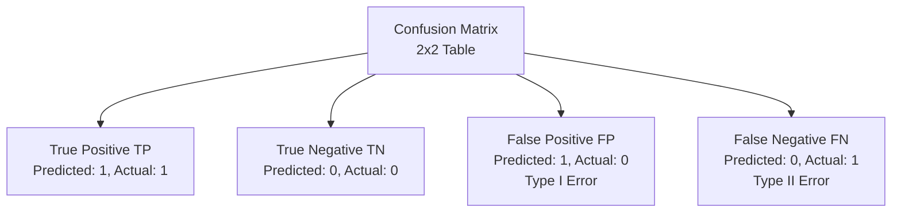
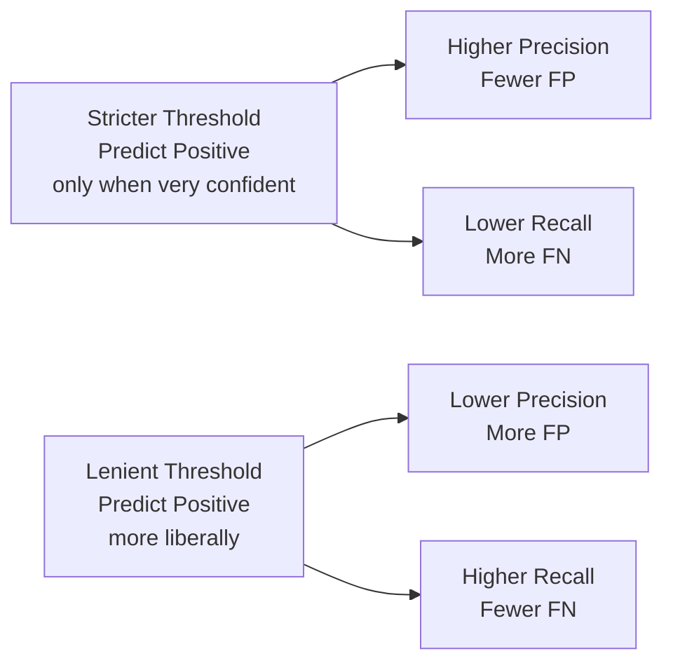
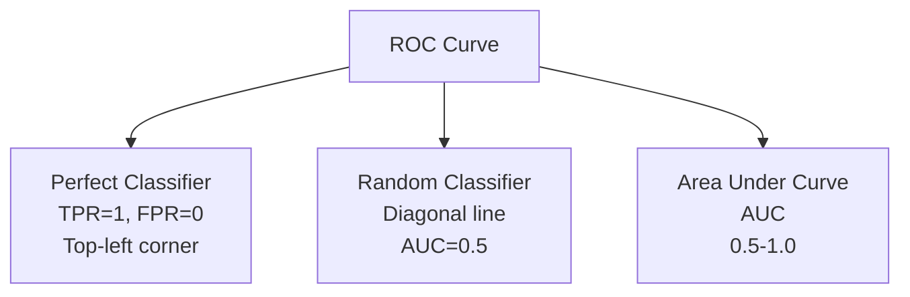

# Chapter 27: Evaluation Metrics - Comprehensive Guide

## 🎯 Learning Objectives
- Master all classification metrics (Accuracy, Precision, Recall, F1-Score, TPR, FPR, Specificity)
- Understand confusion matrix components
- Learn regression metrics (MSE, RMSE, MAE, R², MAPE)
- Master ROC-AUC and PR curves
- Understand when to use which metric
- Learn about multi-class and ranking metrics

## 📚 Key Concepts

### 27.1 Confusion Matrix

**Definition**: A table showing the performance of a classification model



**Confusion Matrix Structure:**

|  | **Predicted Positive** | **Predicted Negative** |
|---|---|---|
| **Actual Positive** | True Positive (TP) | False Negative (FN) |
| **Actual Negative** | False Positive (FP) | True Negative (TN) |

**Example: Cancer Detection**

100 patients tested:
- 40 have cancer (Positive)
- 60 don't have cancer (Negative)

Results:
- TP = 35 (correctly identified cancer)
- FN = 5 (missed cancer - **dangerous!**)
- TN = 55 (correctly identified no cancer)
- FP = 5 (false alarm)

|  | **Predicted Cancer** | **Predicted No Cancer** |
|---|---|---|
| **Has Cancer** | 35 (TP) | 5 (FN) |
| **No Cancer** | 5 (FP) | 55 (TN) |

### 27.2 Classification Metrics

#### Accuracy
**Definition**: Percentage of correct predictions

$$\text{Accuracy} = \frac{TP + TN}{TP + TN + FP + FN}$$

**Example**: $\frac{35 + 55}{100} = 0.90 = 90\%$

**When to use**: Balanced datasets
**When NOT to use**: Imbalanced datasets (e.g., 99% class 0, 1% class 1)

#### Precision (Positive Predictive Value)
**Definition**: Of all predicted positives, how many are actually positive?

$$\text{Precision} = \frac{TP}{TP + FP}$$

**Example**: $\frac{35}{35 + 5} = 0.875 = 87.5\%$

**Interpretation**: "When I predict cancer, I'm correct 87.5% of the time"

**When to use**: When **False Positives are costly** (spam detection, drug testing)

#### Recall (Sensitivity, True Positive Rate, Hit Rate)
**Definition**: Of all actual positives, how many did we correctly identify?

$$\text{Recall} = \frac{TP}{TP + FN} = \text{TPR} = \text{Sensitivity}$$

**Example**: $\frac{35}{35 + 5} = 0.875 = 87.5\%$

**Interpretation**: "Of all cancer patients, I detected 87.5%"

**When to use**: When **False Negatives are costly** (disease detection, fraud detection)

#### Specificity (True Negative Rate)
**Definition**: Of all actual negatives, how many did we correctly identify?

$$\text{Specificity} = \frac{TN}{TN + FP} = \text{TNR}$$

**Example**: $\frac{55}{55 + 5} = 0.917 = 91.7\%$

**Interpretation**: "Of all healthy people, I correctly identified 91.7%"

#### False Positive Rate (FPR)
**Definition**: Of all actual negatives, how many did we incorrectly classify as positive?

$$\text{FPR} = \frac{FP}{FP + TN} = 1 - \text{Specificity}$$

**Example**: $\frac{5}{5 + 55} = 0.083 = 8.3\%$

**Relationship**: $\text{FPR} + \text{Specificity} = 1$

#### F1-Score
**Definition**: Harmonic mean of Precision and Recall

$$F1 = 2 \times \frac{\text{Precision} \times \text{Recall}}{\text{Precision} + \text{Recall}} = \frac{2TP}{2TP + FP + FN}$$

**Example**: $2 \times \frac{0.875 \times 0.875}{0.875 + 0.875} = 0.875$

**Why harmonic mean?**: Penalizes extreme values (low precision OR low recall)

**When to use**: Imbalanced datasets, need balance between Precision and Recall

#### F-Beta Score
**Definition**: Weighted harmonic mean of Precision and Recall

$$F_\beta = (1 + \beta^2) \times \frac{\text{Precision} \times \text{Recall}}{\beta^2 \times \text{Precision} + \text{Recall}}$$

**Parameters:**
- $\beta = 1$: F1-Score (equal weight)
- $\beta = 2$: F2-Score (recall weighted 2x more)
- $\beta = 0.5$: F0.5-Score (precision weighted 2x more)

**Use F2 when**: Recall more important (disease detection)
**Use F0.5 when**: Precision more important (spam detection)

### 27.3 Metrics Comparison Table

| Metric | Formula | Range | Best Value | When to Use |
|--------|---------|-------|------------|-------------|
| **Accuracy** | $\frac{TP+TN}{Total}$ | 0-1 | 1 | Balanced datasets |
| **Precision** | $\frac{TP}{TP+FP}$ | 0-1 | 1 | Minimize False Positives |
| **Recall** | $\frac{TP}{TP+FN}$ | 0-1 | 1 | Minimize False Negatives |
| **F1-Score** | $\frac{2TP}{2TP+FP+FN}$ | 0-1 | 1 | Imbalanced data |
| **Specificity** | $\frac{TN}{TN+FP}$ | 0-1 | 1 | Focus on negatives |
| **FPR** | $\frac{FP}{FP+TN}$ | 0-1 | 0 | Minimize false alarms |

### 27.4 Precision-Recall Trade-off

**Relationship**: Increasing precision typically decreases recall, and vice versa



**Example**: Cancer Detection Threshold

| Threshold | TP | FP | FN | TN | Precision | Recall |
|-----------|----|----|----|----|-----------|--------|
| 0.9 (strict) | 25 | 1 | 15 | 59 | 96% | 62.5% |
| 0.5 (balanced) | 35 | 5 | 5 | 55 | 87.5% | 87.5% |
| 0.1 (lenient) | 39 | 15 | 1 | 45 | 72% | 97.5% |

### 27.5 ROC Curve and AUC

#### ROC Curve (Receiver Operating Characteristic)
**Definition**: Plot of **TPR (Recall)** vs **FPR** at various threshold settings

**Axes:**
- X-axis: False Positive Rate (FPR)
- Y-axis: True Positive Rate (TPR / Recall)



**AUC (Area Under the ROC Curve)**:
- **AUC = 1.0**: Perfect classifier
- **AUC = 0.9-1.0**: Excellent
- **AUC = 0.8-0.9**: Good
- **AUC = 0.7-0.8**: Fair
- **AUC = 0.5-0.7**: Poor
- **AUC = 0.5**: Random guessing
- **AUC < 0.5**: Worse than random (predictions inverted)

**Interpretation**: AUC = 0.85 means "85% chance the model ranks a random positive example higher than a random negative example"

**When to use**: Comparing models on imbalanced datasets

#### PR Curve (Precision-Recall Curve)
**Definition**: Plot of **Precision** vs **Recall** at various thresholds

**When to use PR over ROC**:
- **Highly imbalanced datasets** (e.g., 1% positive class)
- ROC can be misleadingly optimistic on imbalanced data
- PR curve shows clearer picture

**Average Precision (AP)**: Area under PR curve

### 27.6 Multi-Class Classification Metrics

#### Micro-Average
**Definition**: Calculate metrics globally by counting total TP, FP, FN

$$\text{Precision}_{\text{micro}} = \frac{\sum TP_i}{\sum (TP_i + FP_i)}$$

**Use when**: All classes equally important, imbalanced classes

#### Macro-Average
**Definition**: Calculate metrics for each class, then average

$$\text{Precision}_{\text{macro}} = \frac{1}{n} \sum_{i=1}^{n} \text{Precision}_i$$

**Use when**: All classes equally important, even if imbalanced

#### Weighted-Average
**Definition**: Calculate metrics for each class, weighted by support (number of samples)

$$\text{Precision}_{\text{weighted}} = \sum_{i=1}^{n} w_i \times \text{Precision}_i$$

Where $w_i = \frac{\text{samples in class } i}{\text{total samples}}$

**Use when**: Want to account for class imbalance

### 27.7 Regression Metrics

#### Mean Squared Error (MSE)
**Formula:**
$$MSE = \frac{1}{n} \sum_{i=1}^{n} (y_i - \hat{y}_i)^2$$

**Properties:**
- **Range**: 0 to ∞ (lower is better)
- **Units**: Squared units of target
- **Sensitivity**: Penalizes large errors heavily (squared term)

**When to use**: When large errors are particularly bad

#### Root Mean Squared Error (RMSE)
**Formula:**
$$RMSE = \sqrt{MSE} = \sqrt{\frac{1}{n} \sum_{i=1}^{n} (y_i - \hat{y}_i)^2}$$

**Properties:**
- **Range**: 0 to ∞ (lower is better)
- **Units**: Same as target variable
- **Interpretability**: Better than MSE (same units as target)

**Example**: If predicting house prices in dollars, RMSE is in dollars

#### Mean Absolute Error (MAE)
**Formula:**
$$MAE = \frac{1}{n} \sum_{i=1}^{n} |y_i - \hat{y}_i|$$

**Properties:**
- **Range**: 0 to ∞ (lower is better)
- **Units**: Same as target
- **Robustness**: Less sensitive to outliers than MSE/RMSE

**When to use**: When outliers should not heavily influence metric

#### R² Score (Coefficient of Determination)
**Formula:**
$$R^2 = 1 - \frac{SS_{res}}{SS_{tot}} = 1 - \frac{\sum (y_i - \hat{y}_i)^2}{\sum (y_i - \bar{y})^2}$$

Where:
- $SS_{res}$ = Residual sum of squares
- $SS_{tot}$ = Total sum of squares
- $\bar{y}$ = Mean of actual values

**Properties:**
- **Range**: -∞ to 1 (1 is best)
- **R² = 1**: Perfect predictions
- **R² = 0**: Model performs as well as mean
- **R² < 0**: Model performs worse than mean

**Interpretation**: R² = 0.85 means "model explains 85% of variance in target"

#### Adjusted R²
**Formula:**
$$R^2_{adj} = 1 - \frac{(1-R^2)(n-1)}{n-p-1}$$

Where:
- $n$ = number of samples
- $p$ = number of features

**Purpose**: Penalizes adding irrelevant features (unlike R²)

**When to use**: Comparing models with different number of features

#### Mean Absolute Percentage Error (MAPE)
**Formula:**
$$MAPE = \frac{100\%}{n} \sum_{i=1}^{n} \left| \frac{y_i - \hat{y}_i}{y_i} \right|$$

**Properties:**
- **Range**: 0% to ∞ (lower is better)
- **Interpretation**: Easy to understand (percentage error)
- **Problem**: Undefined when $y_i = 0$, penalizes under-predictions more

**When to use**: When relative error matters more than absolute

### 27.8 Metrics for Imbalanced Classification

**Problem**: With 99% class 0 and 1% class 1, always predicting 0 gives 99% accuracy!

**Better Metrics for Imbalanced Data:**

1. **Precision and Recall** (not accuracy)
2. **F1-Score** or **F-Beta Score**
3. **ROC-AUC** (though can be misleading)
4. **PR-AUC** (Precision-Recall AUC) - **Best for imbalanced**
5. **Balanced Accuracy**: $\frac{1}{2}\left(\frac{TP}{TP+FN} + \frac{TN}{TN+FP}\right)$
6. **Matthews Correlation Coefficient (MCC)**

#### Matthews Correlation Coefficient (MCC)
**Formula:**
$$MCC = \frac{TP \times TN - FP \times FN}{\sqrt{(TP+FP)(TP+FN)(TN+FP)(TN+FN)}}$$

**Properties:**
- **Range**: -1 to +1
- **MCC = +1**: Perfect prediction
- **MCC = 0**: Random prediction
- **MCC = -1**: Total disagreement
- **Advantage**: Works well even with very imbalanced datasets

### 27.9 Ranking Metrics

#### Mean Reciprocal Rank (MRR)
**Formula:**
$$MRR = \frac{1}{|Q|} \sum_{i=1}^{|Q|} \frac{1}{\text{rank}_i}$$

**Use case**: Search engines, recommendation systems

**Example**: If first relevant result is at position 3, reciprocal rank = 1/3

#### Normalized Discounted Cumulative Gain (NDCG)
**Formula:**
$$DCG_k = \sum_{i=1}^{k} \frac{2^{rel_i} - 1}{\log_2(i+1)}$$

$$NDCG_k = \frac{DCG_k}{IDCG_k}$$

**Use case**: Ranking tasks where relevance is graded (not binary)

### 27.10 Scikit-learn Implementation

**Classification Metrics:**
```python
from sklearn.metrics import (
    accuracy_score, precision_score, recall_score, f1_score,
    confusion_matrix, classification_report, roc_auc_score, roc_curve
)

# Basic metrics
accuracy = accuracy_score(y_true, y_pred)
precision = precision_score(y_true, y_pred)
recall = recall_score(y_true, y_pred)
f1 = f1_score(y_true, y_pred)

# Confusion matrix
cm = confusion_matrix(y_true, y_pred)
# cm = [[TN, FP],
#       [FN, TP]]

# Classification report (all metrics together)
print(classification_report(y_true, y_pred))

# ROC-AUC (needs probabilities)
auc = roc_auc_score(y_true, y_pred_proba)

# ROC curve points
fpr, tpr, thresholds = roc_curve(y_true, y_pred_proba)
```

**Multi-class Classification:**
```python
# Macro average (equal weight to all classes)
precision_macro = precision_score(y_true, y_pred, average='macro')

# Micro average (weight by support)
precision_micro = precision_score(y_true, y_pred, average='micro')

# Weighted average
precision_weighted = precision_score(y_true, y_pred, average='weighted')

# Per-class metrics
precision_per_class = precision_score(y_true, y_pred, average=None)
```

**Regression Metrics:**
```python
from sklearn.metrics import (
    mean_squared_error, mean_absolute_error,
    r2_score, mean_absolute_percentage_error
)

mse = mean_squared_error(y_true, y_pred)
rmse = mean_squared_error(y_true, y_pred, squared=False)  # RMSE directly
mae = mean_absolute_error(y_true, y_pred)
r2 = r2_score(y_true, y_pred)
mape = mean_absolute_percentage_error(y_true, y_pred)
```

## 🎤 Interview Questions and Answers

**Q1: Explain the difference between Precision and Recall.**

**Answer**:
**Precision**: "Of all predicted positives, how many are correct?"
- Formula: $\frac{TP}{TP + FP}$
- Focuses on **False Positives**
- Use when: Cost of false alarm is high (spam detection, recommendation systems)

**Recall**: "Of all actual positives, how many did we find?"
- Formula: $\frac{TP}{TP + FN}$
- Focuses on **False Negatives**
- Use when: Cost of missing positive is high (disease detection, fraud detection)

**Example**: Cancer detection
- **High Recall needed**: Don't want to miss cancer patients (minimize FN)
- Precision less critical: False alarms (FP) can be verified with more tests

**Q2: Why can't we use Accuracy for imbalanced datasets?**

**Answer**:
**Problem**: Accuracy can be misleading on imbalanced data

**Example**:
- Dataset: 99% class 0 (no fraud), 1% class 1 (fraud)
- Model that always predicts "no fraud" → 99% accuracy!
- But completely useless (misses all fraud)

**Better metrics**:
- **Precision**: Of predicted fraud, how many are real?
- **Recall**: Of real fraud, how many did we catch?
- **F1-Score**: Balance between precision and recall
- **ROC-AUC** or **PR-AUC**: Threshold-independent

**Q3: What is the F1-Score and why use harmonic mean?**

**Answer**:
**F1-Score**: Harmonic mean of Precision and Recall

$$F1 = 2 \times \frac{Precision \times Recall}{Precision + Recall}$$

**Why harmonic mean (not arithmetic)?**

Arithmetic mean: $\frac{Precision + Recall}{2}$
- Problem: High precision OR high recall gives high score
- Example: Precision=1.0, Recall=0.1 → Arithmetic mean = 0.55 (misleadingly high)

Harmonic mean: $2 \times \frac{P \times R}{P + R}$
- Penalizes extreme values
- Example: Precision=1.0, Recall=0.1 → Harmonic mean = 0.18 (more realistic)
- Forces balance between both metrics

**Q4: When would you use ROC-AUC vs PR-AUC?**

**Answer**:
**ROC-AUC** (TPR vs FPR):
- ✅ Use for: Balanced datasets
- ✅ Good when: Both classes matter equally
- ❌ Problem: Can be misleadingly optimistic on imbalanced data

**PR-AUC** (Precision vs Recall):
- ✅ Use for: **Imbalanced datasets**
- ✅ Good when: Positive class is rare and important
- ✅ Better reflects: Real-world performance on minority class

**Example**: Fraud detection (1% fraud)
- ROC-AUC might show 0.95 (looks great!)
- PR-AUC shows 0.60 (more realistic)

**Rule**: If dataset is imbalanced (>10:1 ratio), prefer PR-AUC

**Q5: Explain the confusion matrix components.**

**Answer**:
Four outcomes for binary classification:

|  | Predicted Positive | Predicted Negative |
|---|---|---|
| **Actual Positive** | **TP** (True Positive) | **FN** (False Negative) |
| **Actual Negative** | **FP** (False Positive) | **TN** (True Negative) |

**TP (True Positive)**: Correctly predicted positive
- Example: Predicted cancer, patient has cancer ✓

**TN (True Negative)**: Correctly predicted negative
- Example: Predicted no cancer, patient healthy ✓

**FP (False Positive)**: Incorrectly predicted positive (Type I Error)
- Example: Predicted cancer, patient healthy ✗ (false alarm)

**FN (False Negative)**: Incorrectly predicted negative (Type II Error)
- Example: Predicted no cancer, patient has cancer ✗ (missed detection)

**Q6: What is Specificity and how does it relate to FPR?**

**Answer**:
**Specificity (True Negative Rate)**:
$$Specificity = \frac{TN}{TN + FP}$$

"Of all actual negatives, how many did we correctly identify as negative?"

**False Positive Rate (FPR)**:
$$FPR = \frac{FP}{FP + TN}$$

"Of all actual negatives, how many did we incorrectly call positive?"

**Relationship**:
$$FPR + Specificity = 1$$
$$FPR = 1 - Specificity$$

**Example**: Medical test
- Specificity = 0.95 → 95% of healthy people correctly identified
- FPR = 0.05 → 5% of healthy people wrongly flagged as sick

**Q7: Compare MSE, RMSE, and MAE for regression.**

**Answer**:

**MSE** (Mean Squared Error):
- Formula: $\frac{1}{n}\sum(y - \hat{y})^2$
- **Pros**: Penalizes large errors heavily (squared)
- **Cons**: Units are squared (hard to interpret), sensitive to outliers

**RMSE** (Root Mean Squared Error):
- Formula: $\sqrt{MSE}$
- **Pros**: Same units as target (interpretable), penalizes large errors
- **Cons**: Still sensitive to outliers

**MAE** (Mean Absolute Error):
- Formula: $\frac{1}{n}\sum|y - \hat{y}|$
- **Pros**: Same units, robust to outliers, easy to interpret
- **Cons**: Doesn't penalize large errors as heavily

**Comparison**:
| Metric | Outlier Sensitivity | Interpretability | Large Error Penalty |
|--------|---------------------|------------------|---------------------|
| MSE | High | Low (squared units) | Very High |
| RMSE | High | High (same units) | High |
| MAE | Low | High (same units) | Linear |

**Q8: What does R² score represent?**

**Answer**:
**R²** (Coefficient of Determination):
$$R^2 = 1 - \frac{\sum(y - \hat{y})^2}{\sum(y - \bar{y})^2}$$

**Interpretation**: "Percentage of variance in target explained by the model"

**Values**:
- **R² = 1.0**: Perfect predictions
- **R² = 0.8**: Model explains 80% of variance
- **R² = 0.0**: Model performs as well as predicting mean
- **R² < 0**: Model worse than predicting mean!

**Example**: House price prediction
- R² = 0.75 → Model explains 75% of price variations
- Remaining 25% due to factors not in model or noise

**Limitation**: Always increases with more features (use Adjusted R² for feature comparison)

**Q9: When would you use Recall over Precision?**

**Answer**:
**Use Recall when False Negatives are more costly than False Positives**

**High Recall scenarios**:
1. **Disease screening**: Missing a sick person (FN) is worse than false alarm (FP)
2. **Fraud detection**: Missing fraud (FN) costs money; investigating false alarms (FP) is acceptable
3. **Security screening**: Missing threat (FN) is catastrophic
4. **Anomaly detection**: Missing anomalies (FN) can cause system failures

**Use Precision when False Positives are more costly**:
1. **Spam filtering**: Marking legitimate email as spam (FP) is bad
2. **Recommendation systems**: Recommending bad items (FP) hurts user experience
3. **Drug testing athletes**: False positive (FP) ruins reputation

**Q10: What is Matthews Correlation Coefficient (MCC)?**

**Answer**:
**MCC**: Correlation coefficient between observed and predicted classifications

$$MCC = \frac{TP \times TN - FP \times FN}{\sqrt{(TP+FP)(TP+FN)(TN+FP)(TN+FN)}}$$

**Range**: -1 to +1
- **+1**: Perfect prediction
- **0**: Random prediction
- **-1**: Total disagreement

**Advantages**:
- ✅ Works well with imbalanced datasets
- ✅ Takes all four confusion matrix values into account
- ✅ Symmetric (treats both classes fairly)
- ✅ Returns meaningful value even if class sizes are different

**When to use**: Imbalanced binary classification

**Q11: Explain Micro vs Macro vs Weighted averaging in multi-class classification.**

**Answer**:
**Scenario**: 3 classes (A, B, C)

**Micro-average**:
- Aggregate all TP, FP, FN across classes
- Calculate single metric
- Formula: $\frac{\sum TP}{\sum TP + \sum FP}$
- **Advantage**: Accounts for class imbalance naturally
- **Use**: When larger classes should influence metric more

**Macro-average**:
- Calculate metric for each class separately
- Average the metrics
- Formula: $\frac{Precision_A + Precision_B + Precision_C}{3}$
- **Advantage**: All classes treated equally
- **Use**: When all classes are equally important

**Weighted-average**:
- Calculate metric for each class
- Weight by number of samples in each class
- Formula: $w_A \times P_A + w_B \times P_B + w_C \times P_C$
- **Use**: Accounts for imbalance but weights by support

**Example**:
- Class A: 100 samples, Precision = 0.9
- Class B: 50 samples, Precision = 0.8
- Class C: 10 samples, Precision = 0.5

- Macro: $(0.9 + 0.8 + 0.5)/3 = 0.73$
- Weighted: $(100×0.9 + 50×0.8 + 10×0.5)/(100+50+10) = 0.84$

**Q12: How do you choose classification threshold?**

**Answer**:
**Default**: 0.5 (predict 1 if probability > 0.5)

**Custom threshold selection**:

1. **Business constraints**:
   - Minimize cost function
   - Example: Cost of FN = \$1000, Cost of FP = \$100
   - Choose threshold that minimizes total cost

2. **ROC curve**:
   - Find point closest to (0,1) - top-left corner
   - Maximizes TPR while minimizing FPR

3. **PR curve**:
   - For imbalanced data
   - Choose threshold with best F1-Score

4. **Domain requirements**:
   - Security: Lower threshold (catch more threats, accept false alarms)
   - Medical screening: Lower threshold (don't miss diseases)
   - Spam: Higher threshold (don't mark legitimate emails)

**Code**:
```python
from sklearn.metrics import precision_recall_curve

precision, recall, thresholds = precision_recall_curve(y_true, y_pred_proba)
f1_scores = 2 * (precision * recall) / (precision + recall)
best_threshold = thresholds[np.argmax(f1_scores)]
```

**Q13: What is the difference between Type I and Type II errors?**

**Answer**:
**Type I Error** = False Positive (FP)
- Rejecting a true null hypothesis
- Predicting positive when actually negative
- **Example**: Declaring innocent person guilty

**Type II Error** = False Negative (FN)
- Failing to reject a false null hypothesis
- Predicting negative when actually positive
- **Example**: Declaring guilty person innocent

**Hypothesis testing context**:
- **α (alpha)**: Probability of Type I error (significance level)
- **β (beta)**: Probability of Type II error
- **Power** = 1 - β: Probability of correctly rejecting null hypothesis

| Error | Statistical | ML | Example |
|-------|-------------|-----|---------|
| Type I | Reject true H₀ | False Positive | Healthy person diagnosed sick |
| Type II | Fail to reject false H₀ | False Negative | Sick person diagnosed healthy |

**Q14: How do you handle evaluation metrics for multi-label classification?**

**Answer**:
**Multi-label**: Each sample can have multiple labels simultaneously
- Example: Movie genres - [Action, Comedy, Drama]

**Metrics**:

1. **Hamming Loss**: Fraction of wrong labels
   $$Hamming = \frac{1}{n \times L} \sum_{i=1}^{n} \sum_{j=1}^{L} \mathbb{1}(y_{ij} \neq \hat{y}_{ij})$$

2. **Subset Accuracy**: Percentage of samples with exact label match
   - Strict: All labels must match

3. **Micro/Macro F1**: Treat each label as binary problem
   - Macro: Average F1 across labels
   - Micro: Pool all predictions and calculate

4. **Label-based metrics**: Calculate metric per label, then average

**Code**:
```python
from sklearn.metrics import hamming_loss, jaccard_score

hamming = hamming_loss(y_true, y_pred)
jaccard = jaccard_score(y_true, y_pred, average='samples')
```

**Q15: What evaluation metrics would you use for a ranking problem?**

**Answer**:
**Ranking problems**: Order matters (e.g., search results, recommendations)

**Key Metrics**:

1. **Mean Reciprocal Rank (MRR)**:
   - Reciprocal of rank of first relevant item
   - Formula: $MRR = \frac{1}{|Q|} \sum_{i=1}^{|Q|} \frac{1}{rank_i}$
   - Example: First relevant at position 3 → MRR = 1/3

2. **Mean Average Precision (MAP)**:
   - Average of precision at each relevant item
   - Considers all relevant items, not just first

3. **Normalized Discounted Cumulative Gain (NDCG)**:
   - Considers graded relevance (not just binary)
   - Discounts relevance by position (log)
   - Range: 0-1 (1 is perfect)

4. **Precision@K**:
   - Precision in top K results
   - Example: Precision@10 for first 10 search results

5. **Recall@K**:
   - Recall in top K results

**Use cases**:
- Search engines: NDCG, MAP
- Recommendation: Precision@K, Recall@K
- Information retrieval: MRR

## 🔑 Key Takeaways

1. **Confusion Matrix**: Foundation for all classification metrics (TP, TN, FP, FN)
2. **Accuracy**: Good for balanced data, misleading for imbalanced
3. **Precision**: Minimize false positives (spam detection)
4. **Recall**: Minimize false negatives (disease detection)
5. **F1-Score**: Balance between precision and recall (imbalanced data)
6. **ROC-AUC**: Threshold-independent, good for balanced data
7. **PR-AUC**: Better for imbalanced datasets
8. **MSE/RMSE**: Penalize large errors, sensitive to outliers
9. **MAE**: Robust to outliers, linear penalty
10. **R²**: Explains variance, 0-1 range (higher is better)

## ⚠️ Common Mistakes to Avoid

1. ❌ **Using accuracy on imbalanced data** → Misleading results
   - ✅ Use F1-Score, Precision, Recall, or AUC

2. ❌ **Ignoring business context when choosing metric** → Wrong optimization
   - ✅ Understand cost of FP vs FN

3. ❌ **Using ROC-AUC on highly imbalanced data** → Over-optimistic
   - ✅ Use PR-AUC instead

4. ❌ **Not considering threshold selection** → Suboptimal performance
   - ✅ Tune threshold based on business needs

5. ❌ **Comparing R² across different datasets** → Meaningless
   - ✅ R² only meaningful within same dataset

6. ❌ **Using MSE when outliers present** → Metric dominated by outliers
   - ✅ Use MAE for robustness

7. ❌ **Forgetting to use macro/micro averaging for multi-class** → Incomplete picture
   - ✅ Report both macro and weighted averages

8. ❌ **Only looking at one metric** → Missing important trade-offs
   - ✅ Examine multiple metrics (confusion matrix, precision, recall, F1)

9. ❌ **Using default threshold (0.5) blindly** → May not be optimal
   - ✅ Optimize threshold using validation data

10. ❌ **Not stratifying train/test split on imbalanced data** → Biased evaluation
    - ✅ Use stratified split to maintain class distribution

## 📝 Quick Revision Points

### Classification Metrics Formulas
- **Accuracy**: $\frac{TP+TN}{Total}$
- **Precision**: $\frac{TP}{TP+FP}$
- **Recall**: $\frac{TP}{TP+FN}$
- **F1-Score**: $\frac{2TP}{2TP+FP+FN}$
- **Specificity**: $\frac{TN}{TN+FP}$
- **FPR**: $\frac{FP}{FP+TN} = 1 - Specificity$

### Regression Metrics Formulas
- **MSE**: $\frac{1}{n}\sum(y-\hat{y})^2$
- **RMSE**: $\sqrt{MSE}$
- **MAE**: $\frac{1}{n}\sum|y-\hat{y}|$
- **R²**: $1 - \frac{SS_{res}}{SS_{tot}}$

### When to Use Which Metric

| Problem | Best Metrics |
|---------|-------------|
| Balanced classification | Accuracy, F1, ROC-AUC |
| Imbalanced classification | F1, Precision, Recall, PR-AUC, MCC |
| Minimize false alarms | Precision |
| Minimize missed positives | Recall |
| Regression (general) | RMSE, MAE, R² |
| Regression (outliers) | MAE (robust) |
| Regression (large errors bad) | MSE/RMSE |
| Multi-class | Macro/Micro/Weighted averages |
| Ranking | NDCG, MAP, MRR |

### Confusion Matrix Components
```
              Predicted
           Positive | Negative
Actual P | TP       | FN
Actual N | FP       | TN
```

### ROC Curve
- X-axis: FPR
- Y-axis: TPR (Recall)
- AUC = 0.5: Random
- AUC = 1.0: Perfect

### PR Curve
- X-axis: Recall
- Y-axis: Precision
- Better for imbalanced data

### Multi-Class Averaging
- **Micro**: Pool all samples, then calculate
- **Macro**: Calculate per class, then average
- **Weighted**: Average weighted by support
