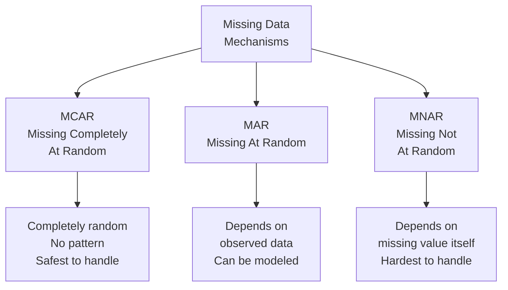
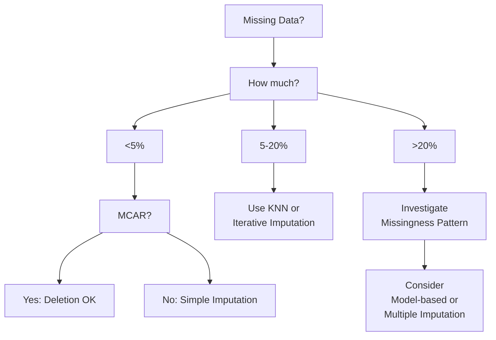

# Chapter 28: Missing Data Imputation Techniques

## 🎯 Learning Objectives
- Understand types of missing data (MCAR, MAR, MNAR)
- Master deletion methods (listwise, pairwise)
- Learn imputation techniques (mean, median, mode, KNN, iterative)
- Understand indicator variables for missingness
- Apply multiple imputation methods
- Learn model-based imputation techniques
- Handle missing data in different scenarios

## 📚 Key Concepts

### 28.1 Types of Missing Data

**Three main categories based on mechanism:**



#### MCAR (Missing Completely At Random)
**Definition**: Probability of missingness is the same for all observations

**Example**: Survey responses lost due to random computer error

**Characteristics:**
- No relationship between missing data and any values
- Missing data is a truly random subset
- Can safely delete or impute

**Test**: Little's MCAR test

#### MAR (Missing At Random)
**Definition**: Probability of missingness depends on observed data, not missing value itself

**Example**: Women less likely to report age, but conditional on gender, age is random

**Characteristics:**
- Missingness related to other variables in dataset
- Can be predicted from observed data
- Can handle with proper imputation

**Common scenario**: Most real-world missing data

#### MNAR (Missing Not At Random)
**Definition**: Probability of missingness depends on the missing value itself

**Example**: High-income people refuse to report income

**Characteristics:**
- Missingness related to the would-be value
- Hardest to handle
- May need domain knowledge or sensitivity analysis

**Solutions**: Modeling missingness mechanism, domain expertise

###

 28.2 Missing Data Patterns

| Pattern | Description | Example |
|---------|-------------|---------|
| **Univariate** | Missing in single variable | Only Age column has missing values |
| **Monotone** | Hierarchical missingness | If B is missing, then C, D, E also missing |
| **Arbitrary** | No clear pattern | Random missingness across multiple variables |

### 28.3 Deletion Methods

#### Listwise Deletion (Complete Case Analysis)
**Definition**: Remove all rows with any missing values

**Formula**: Keep row only if no missing values

**Advantages:**
- ✅ Simple to implement
- ✅ No bias if MCAR
- ✅ Preserves variable relationships

**Disadvantages:**
- ❌ Loses data (can lose 50%+ of dataset)
- ❌ Reduces statistical power
- ❌ Biased if not MCAR
- ❌ Wasteful

**When to use**:
- <5% missing data
- Data is MCAR
- Large dataset

**Code:**
```python
df_complete = df.dropna()  # Remove rows with any NaN
```

#### Pairwise Deletion (Available Case Analysis)
**Definition**: Use all available data for each analysis

**Example**:
- Calculating correlation between A and B: use all rows where both A and B are present
- Different sample size for each pair

**Advantages:**
- ✅ Uses more data than listwise
- ✅ Better statistical power

**Disadvantages:**
- ❌ Different sample sizes for different analyses
- ❌ Can produce inconsistent results
- ❌ Not straightforward in ML

**When to use**: Statistical analysis, correlation matrices

### 28.4 Simple Imputation Methods

#### Mean/Median/Mode Imputation
**Definition**: Replace missing values with mean (numerical) or mode (categorical)

**Mean Imputation:**
$$x_{missing} = \frac{1}{n} \sum_{i=1}^{n} x_i \text{ (where } x_i \text{ is observed)}$$

**Advantages:**
- ✅ Easy to implement
- ✅ Preserves sample size
- ✅ Fast

**Disadvantages:**
- ❌ Reduces variance
- ❌ Distorts distribution
- ❌ Underestimates standard error
- ❌ Ignores relationships with other variables

**When to use**:
- Baseline/quick solution
- <5% missing data
- MCAR assumption holds

**Code:**
```python
from sklearn.impute import SimpleImputer

# Mean imputation
imputer_mean = SimpleImputer(strategy='mean')
df_imputed = imputer_mean.fit_transform(df)

# Median imputation (robust to outliers)
imputer_median = SimpleImputer(strategy='median')

# Most frequent (mode) for categorical
imputer_mode = SimpleImputer(strategy='most_frequent')
```

**Median vs Mean:**
- Use **median** when data has outliers
- Use **mean** for normal distributions

#### Constant Value Imputation
**Definition**: Fill with a constant (e.g., 0, -1, "Missing")

**Use cases:**
- Domain-specific defaults (e.g., 0 for no purchase)
- Creating "missing" category for categorical variables
- Tree-based models (can treat as separate category)

**Code:**
```python
# Fill with constant
imputer_constant = SimpleImputer(strategy='constant', fill_value=0)

# For pandas
df['col'].fillna(0, inplace=True)
df['col'].fillna('Unknown', inplace=True)
```

#### Forward Fill / Backward Fill
**Definition**: Fill with previous/next value (time series)

**Forward Fill**: Use last known value
**Backward Fill**: Use next known value

**When to use**: Time series data, sequential data

**Code:**
```python
# Forward fill
df.fillna(method='ffill')

# Backward fill
df.fillna(method='bfill')

# Limit number of consecutive fills
df.fillna(method='ffill', limit=2)
```

### 28.5 Advanced Imputation Methods

#### KNN Imputation
**Definition**: Fill missing value with mean of K nearest neighbors

**Algorithm:**
1. For each missing value:
2. Find K nearest neighbors (based on other features)
3. Use Euclidean distance or other metric
4. Impute with mean of K neighbors' values

**Formula:**
$$x_{missing} = \frac{1}{K} \sum_{i=1}^{K} x_i^{(neighbor)}$$

**Advantages:**
- ✅ Considers feature relationships
- ✅ More accurate than mean imputation
- ✅ Can capture local patterns

**Disadvantages:**
- ❌ Computationally expensive
- ❌ Sensitive to K value
- ❌ Requires feature scaling
- ❌ Doesn't work well with high-dimensional data

**Hyperparameters:**
- `n_neighbors`: Number of neighbors (default: 5)
- `weights`: 'uniform' or 'distance' (distance weights closer neighbors more)

**Code:**
```python
from sklearn.impute import KNNImputer

# KNN imputation with 5 neighbors
imputer_knn = KNNImputer(n_neighbors=5, weights='uniform')
df_imputed = imputer_knn.fit_transform(df)

# Distance-weighted KNN
imputer_knn_dist = KNNImputer(n_neighbors=5, weights='distance')
```

**Choosing K:**
- Small K (3-5): Captures local patterns, sensitive to noise
- Large K (10-15): Smoother, more robust

#### Iterative Imputation (MICE)
**Definition**: Multiple Imputation by Chained Equations - iteratively model each feature

**Algorithm:**
1. Initialize missing values (e.g., mean imputation)
2. For each feature with missing values:
   - Use other features as predictors
   - Fit regression model
   - Predict missing values
3. Repeat steps 2-3 for multiple iterations until convergence

**Advantages:**
- ✅ Captures complex relationships
- ✅ Multiple imputation (uncertainty estimates)
- ✅ Flexible (can use different models)
- ✅ Handles MAR well

**Disadvantages:**
- ❌ Computationally expensive
- ❌ Can overfit with small data
- ❌ Requires careful tuning

**Code:**
```python
from sklearn.experimental import enable_iterative_imputer
from sklearn.impute import IterativeImputer

# Basic iterative imputation
imputer_iter = IterativeImputer(random_state=42, max_iter=10)
df_imputed = imputer_iter.fit_transform(df)

# With specific estimator (Random Forest)
from sklearn.ensemble import RandomForestRegressor
imputer_rf = IterativeImputer(
    estimator=RandomForestRegressor(n_estimators=10, random_state=42),
    max_iter=10,
    random_state=42
)
```

**Parameters:**
- `max_iter`: Number of iterations (default: 10)
- `estimator`: Model to use (default: BayesianRidge)
- `initial_strategy`: How to initialize ('mean', 'median', 'most_frequent')

### 28.6 Missingness Indicator

**Concept**: Create binary indicator for whether value was missing

**Why useful:**
- Missingness itself may be informative
- Helps model learn patterns related to missingness

**Code:**
```python
from sklearn.impute import SimpleImputer

# Add missing indicator
imputer = SimpleImputer(strategy='mean', add_indicator=True)
# Returns: [imputed_values, is_missing_indicator]
X_imputed = imputer.fit_transform(X)

# Manual creation
df['age_missing'] = df['age'].isna().astype(int)
```

**Example:**
```
Original:
Age: [25, NaN, 30, NaN, 35]

After imputation with indicator:
Age: [25, 30, 30, 30, 35]  # Mean imputed
Age_missing: [0, 1, 0, 1, 0]  # Indicator
```

### 28.7 Model-Based Imputation

#### Regression Imputation
**Method**: Predict missing values using regression on other features

**Steps:**
1. For feature with missing values:
2. Train regression model using rows where feature is present
3. Predict missing values using trained model

**Advantage**: Preserves relationships
**Disadvantage**: Can underestimate variance (predictions are too perfect)

**Solution**: Add random noise (stochastic regression imputation)

#### Random Forest Imputation
**Method**: Use Random Forest to predict missing values

**Advantages:**
- Handles non-linear relationships
- Robust to outliers
- Can handle mixed data types

**Code:**
```python
# Using IterativeImputer with RandomForest
from sklearn.ensemble import RandomForestRegressor

imputer = IterativeImputer(
    estimator=RandomForestRegressor(n_estimators=10),
    max_iter=10
)
```

#### Deep Learning Imputation
**Method**: Use autoencoders or other neural networks

**Use cases**: Complex, high-dimensional data

**Libraries**: DataWig, MIDAS

### 28.8 Multiple Imputation

**Concept**: Create multiple imputed datasets, analyze each, pool results

**Process:**
1. Generate M imputed datasets (e.g., M=5)
2. Analyze each dataset separately
3. Pool results using Rubin's rules

**Advantages:**
- ✅ Accounts for uncertainty due to missing data
- ✅ Proper statistical inference
- ✅ Standard errors are correct

**Code:**
```python
# Using IterativeImputer M times with different seeds
imputed_datasets = []
for i in range(5):
    imputer = IterativeImputer(random_state=i)
    imputed = imputer.fit_transform(X)
    imputed_datasets.append(imputed)

# Pool results (for regression coefficients, etc.)
```

### 28.9 Handling Missing Data by Algorithm

Different ML algorithms handle missing data differently:

| Algorithm | Native Support | Best Strategy |
|-----------|----------------|---------------|
| **Linear Regression** | No | Mean/Median imputation |
| **Logistic Regression** | No | Mean/Median imputation |
| **Decision Trees** | Some (XGBoost, LightGBM) | Indicator + Imputation or native |
| **Random Forest** | Some | KNN or Iterative imputation |
| **SVM** | No | KNN or Iterative imputation |
| **K-NN** | No | Cannot use (needs complete data) |
| **Neural Networks** | No | Mean or Advanced imputation |
| **XGBoost** | Yes | Use native handling |
| **LightGBM** | Yes | Use native handling |
| **CatBoost** | Yes | Use native handling |

**XGBoost/LightGBM/CatBoost:**
- Learn optimal direction for missing values
- No need to impute
- Often performs better than imputation

### 28.10 Practical Recommendations

#### Decision Framework:


#### Best Practices:

1. **Analyze missingness first**:
   - Check percentage missing per variable
   - Identify patterns (MCAR, MAR, MNAR)
   - Visualize missingness (missingno library)

2. **Choose method based on**:
   - Amount of missing data
   - Missingness mechanism
   - Computational resources
   - Model requirements

3. **Always**:
   - Split data BEFORE imputation (prevent data leakage)
   - Fit imputer on training data only
   - Transform both train and test

4. **Consider**:
   - Adding missingness indicators
   - Domain knowledge
   - Multiple imputation for inference

### 28.11 Visualization of Missing Data

**Using missingno library:**
```python
import missingno as msno

# Matrix plot (visualize missing data patterns)
msno.matrix(df)

# Bar chart (count of missing values)
msno.bar(df)

# Heatmap (correlation of missingness)
msno.heatmap(df)

# Dendrogram (hierarchical clustering of missingness)
msno.dendrogram(df)
```

## 🎤 Interview Questions and Answers

**Q1: What are the three types of missing data mechanisms?**

**Answer**:
1. **MCAR** (Missing Completely At Random):
   - Missingness is completely random
   - No relationship with any variables
   - Example: Random equipment failure
   - Safe to delete or use any imputation

2. **MAR** (Missing At Random):
   - Missingness depends on observed data, not missing value
   - Example: Younger people less likely to report income (age is observed, so can model)
   - Can handle with proper imputation

3. **MNAR** (Missing Not At Random):
   - Missingness depends on the missing value itself
   - Example: High earners refuse to report income
   - Hardest to handle, may introduce bias

**Q2: What's wrong with mean imputation?**

**Answer**:
**Problems:**
1. **Reduces variance**: All missing values get same mean value, artificially reduces spread
2. **Distorts distribution**: Creates spike at mean value
3. **Underestimates correlations**: Doesn't preserve relationships with other variables
4. **Biased estimates**: Standard errors are too small (overconfident)

**Example:**
```
Original: [10, 20, NaN, 40, 50] → Variance = high
Mean imputed: [10, 20, 30, 40, 50] → Variance = reduced (artificially)
```

**When acceptable**: <5% missing data, quick baseline

**Q3: How does KNN imputation work?**

**Answer**:
**Algorithm:**
1. For each missing value in row i:
2. Calculate distance (usually Euclidean) to all other rows using available features
3. Find K nearest neighbors (K rows with smallest distance)
4. Impute missing value with **mean of K neighbors' values** for that feature

**Example** (K=3):
```
Row with missing Age:
Features: [Income=50K, Education=Bachelor]

Find 3 nearest rows by Income & Education:
Neighbor 1: Age=25, Income=48K, Education=Bachelor
Neighbor 2: Age=30, Income=52K, Education=Bachelor
Neighbor 3: Age=28, Income=51K, Education=Master

Impute Age = (25 + 30 + 28) / 3 = 27.67
```

**Advantages**: Considers feature relationships
**Disadvantages**: Computationally expensive, requires scaling

**Q4: Explain Iterative Imputation (MICE).**

**Answer**:
**MICE** = Multiple Imputation by Chained Equations

**Process:**
1. **Initialize**: Fill missing values with simple imputation (e.g., mean)
2. **Iterate** through features with missing values:
   - For feature A with missing values:
     - Use other features (B, C, D) as predictors
     - Fit regression model on rows where A is present
     - Predict and fill missing values in A
3. **Repeat** step 2 for all features, multiple rounds until convergence

**Example:**
```
Dataset: [Age, Income, Education]
- Age missing in rows 1, 5
- Income missing in rows 2, 4

Round 1:
- Predict Age using Income + Education
- Predict Income using Age + Education

Round 2:
- Re-predict Age using updated Income + Education
- Re-predict Income using updated Age + Education

Continue for 10 rounds or until changes are minimal
```

**Advantages**: Captures complex relationships, multiple imputation
**Disadvantages**: Slow, can overfit

**Q5: What is the difference between listwise and pairwise deletion?**

**Answer**:
**Listwise Deletion**:
- Remove entire row if any value is missing
- Same sample size for all analyses
- Example:
  ```
  Original: 1000 rows, 3 columns with 10% missing each
  After: ~729 rows (0.9³ × 1000) - lost 27% of data!
  ```

**Pairwise Deletion**:
- Use all available data for each pairwise analysis
- Different sample size for each analysis
- Example:
  ```
  Correlation(A, B): Use all rows where both A and B present
  Correlation(A, C): Use all rows where both A and C present
  → Different sample sizes
  ```

| Aspect | Listwise | Pairwise |
|--------|----------|----------|
| Data loss | High | Lower |
| Consistency | Same N for all | Different N |
| Use in ML | Common | Rare |
| Statistical analysis | Standard | Complex |

**Q6: How do XGBoost and LightGBM handle missing values natively?**

**Answer**:
**Native handling in tree-based boosting:**

**Algorithm:**
1. During training, for each split:
   - Missing values are sent to **both left and right** child
   - Calculate gain for each direction
   - Choose direction with higher gain
   - Remember this default direction

2. During prediction:
   - Missing values automatically go to learned default direction

**Advantages:**
- ✅ No need to impute
- ✅ Learns optimal handling per split
- ✅ Can discover patterns in missingness
- ✅ Often outperforms imputation

**Code:**
```python
import xgboost as xgb

# XGBoost handles NaN automatically
dtrain = xgb.DMatrix(X_train, label=y_train)  # X_train can have NaN
model = xgb.train(params, dtrain)
```

**Q7: When should you add a missing indicator variable?**

**Answer**:
**Add missing indicator when:**
1. **Missingness is informative**: Pattern to missingness that's predictive
2. **MNAR suspected**: Missing value related to its magnitude
3. **Large % missing**: >20% missing in important feature

**Example:**
- Income missing → might indicate high income (people hide wealth)
- Create `income_missing` binary feature
- Model can learn: "if income_missing=1, likely high earner"

**Implementation:**
```python
# Add indicator before imputation
df['age_missing'] = df['age'].isna().astype(int)
df['age'].fillna(df['age'].median(), inplace=True)

# Or using sklearn
from sklearn.impute import SimpleImputer
imputer = SimpleImputer(add_indicator=True)
```

**When NOT to add:**
- MCAR data (missingness is random)
- Very low % missing (<5%)
- High-dimensional data (avoid adding many features)

**Q8: How do you prevent data leakage when imputing missing values?**

**Answer**:
**Data leakage**: Using information from test set to impute training set

**Correct approach:**
```python
from sklearn.model_selection import train_test_split
from sklearn.impute import SimpleImputer

# 1. Split FIRST
X_train, X_test, y_train, y_test = train_test_split(X, y)

# 2. Fit imputer on training data ONLY
imputer = SimpleImputer(strategy='mean')
imputer.fit(X_train)  # Learn mean from training data

# 3. Transform both train and test
X_train_imputed = imputer.transform(X_train)
X_test_imputed = imputer.transform(X_test)  # Use training mean
```

**Wrong approach:**
```python
# WRONG: Impute before split
imputer.fit_transform(X)  # Uses information from test set!
X_train, X_test = train_test_split(X_imputed)
```

**Why it matters:**
- Test mean leaks into training
- Overly optimistic performance
- Model won't generalize to new data

**Q9: How would you handle missing data if >50% of values are missing in a column?**

**Answer**:
**Options:**

1. **Drop the column**:
   - >50% missing often not informative
   - Cost of imputation > benefit
   - Exception: If missingness itself is informative

2. **Create binary indicator**:
   - Keep as "present" vs "missing" (binary feature)
   - Discard actual values

3. **Use as categorical**:
   - Treat "missing" as separate category
   - Works well with tree-based models

4. **Domain knowledge**:
   - Investigate WHY so much is missing
   - Might be MNAR (informative)
   - Could need special handling

5. **Collect more data**:
   - If possible, get more complete data

**Decision tree:**
```
> 50% missing →
  Is missingness informative?
    Yes → Keep as indicator or category
    No → Drop column (usually best)
```

**Q10: What is multiple imputation and when should you use it?**

**Answer**:
**Multiple Imputation**: Create M imputed datasets (e.g., M=5), analyze each, combine results

**Process:**
1. Generate 5 complete datasets using imputation with randomness
2. Run analysis (e.g., regression) on each dataset separately
3. Pool results using Rubin's rules to get final estimates

**Example:**
```
Dataset 1: Age filled with [27, 32, 28]
Dataset 2: Age filled with [26, 31, 30]
Dataset 3: Age filled with [28, 33, 27]
...

Run regression on each → 5 sets of coefficients
Pool → Final coefficient with proper standard error
```

**When to use:**
- **Statistical inference**: Need correct standard errors and p-values
- **Research/Academia**: Publishing results
- **Small datasets**: Every data point matters

**When NOT to use:**
- **Prediction focus**: Single imputation often sufficient
- **Large datasets**: Computationally expensive
- **ML competitions**: Single imputation + good validation

**Advantages**: Proper uncertainty quantification
**Disadvantages**: Complex, computationally expensive

**Q11: How do you choose between mean and median imputation?**

**Answer**:
**Use Median when:**
- ✅ Data has **outliers**
- ✅ Data is **skewed** (not normal)
- ✅ Robust estimate needed

**Use Mean when:**
- ✅ Data is **normally distributed**
- ✅ No significant outliers
- ✅ Want to preserve total sum

**Example:**
```
Incomes: [30K, 35K, 40K, 45K, 1M]  # One outlier

Mean = 230K (pulled up by outlier!)
Median = 40K (robust)

For imputation: Median (40K) is more sensible
```

**Statistical properties:**
- **Mean**: Minimizes squared errors (L2)
- **Median**: Minimizes absolute errors (L1), robust

**In practice**: **Median is safer default** for real-world data

**Q12: Explain forward fill and backward fill. When are they appropriate?**

**Answer**:
**Forward Fill (ffill)**: Propagate last valid value forward
**Backward Fill (bfill)**: Propagate next valid value backward

**Example:**
```
Original:    [10, NaN, NaN, 20, NaN, 30]
Forward fill: [10, 10, 10, 20, 20, 30]
Backward fill:[10, 20, 20, 20, 30, 30]
```

**When appropriate:**
- **Time series data**: Measurements over time
- **Sequential data**: Order matters
- **Slowly changing values**: Stock prices, temperatures

**Assumptions:**
- Value doesn't change between measurements
- Temporal relationship exists

**When NOT to use:**
- Cross-sectional data (no time component)
- Random samples
- Causes future leakage (bfill)

**Best practices:**
- Limit consecutive fills: `fillna(method='ffill', limit=2)`
- Check if data is sorted by time first
- Consider interpolation for smoother transitions

**Q13: What are the pros and cons of using a constant value (like -999) for missing data?**

**Answer**:
**Approach**: Fill missing values with constant (e.g., -999, -1, "Missing")

**Advantages:**
- ✅ **Preserves missingness**: Model can learn patterns
- ✅ **Works with tree-based models**: Can split on this value
- ✅ **Simple**: Easy to implement
- ✅ **Reversible**: Can identify imputed values later

**Disadvantages:**
- ❌ **Creates artificial patterns**: -999 may be far from real values
- ❌ **Breaks linear models**: Coefficient meaningless for impossible value
- ❌ **Outlier effects**: Can distort distance-based algorithms (KNN, SVM)
- ❌ **Requires scaling care**: StandardScaler will treat -999 as real value

**When to use:**
- Tree-based models (RF, XGBoost, LightGBM)
- Domain-specific defaults (0 for "no purchase")
- Categorical data ("Unknown", "Missing")

**When NOT to use:**
- Linear/Logistic Regression
- Distance-based models (KNN, SVM)
- Neural Networks (without embedding)

**Best practice**: Combine with missing indicator for non-tree models

**Q14: How do you evaluate the quality of your imputation?**

**Answer**:
**Evaluation strategies:**

1. **Artificial missingness**:
   - Remove values from complete data randomly
   - Impute
   - Compare imputed vs. actual values
   - Metric: RMSE, MAE between imputed and actual

```python
# Create artificial missingness
X_complete = X.copy()
mask = np.random.random(X.shape) < 0.2  # 20% missing
X_with_missing = X_complete.copy()
X_with_missing[mask] = np.nan

# Impute
imputer = KNNImputer()
X_imputed = imputer.fit_transform(X_with_missing)

# Evaluate
from sklearn.metrics import mean_squared_error
mse = mean_squared_error(X_complete[mask], X_imputed[mask])
```

2. **Cross-validation**:
   - Compare model performance with different imputation methods
   - Best imputation = best downstream model performance

3. **Distribution comparison**:
   - Compare distributions before/after imputation
   - Should be similar (except reduced variance for mean imputation)

4. **Expert review**:
   - Check if imputed values make domain sense

**Q15: What is the best practice for handling missing data in a production ML pipeline?**

**Answer**:
**Production best practices:**

1. **Separate imputation from model**:
   ```python
   from sklearn.pipeline import Pipeline

   pipeline = Pipeline([
       ('imputer', SimpleImputer(strategy='median')),
       ('scaler', StandardScaler()),
       ('model', RandomForestClassifier())
   ])

   # Saves imputer with model
   pipeline.fit(X_train, y_train)
   pipeline.predict(X_new)  # Auto-imputes new data
   ```

2. **Save imputation parameters**:
   - Save mean/median values used
   - Ensures consistent imputation in production

3. **Monitor missingness**:
   - Track % missing over time
   - Alert if suddenly increases (data pipeline issue)

4. **Handle unseen missing patterns**:
   - What if feature that was never missing is now missing?
   - Have fallback strategy

5. **Document decisions**:
   - Why this imputation method?
   - What assumptions were made?

6. **Version control**:
   - Track imputation strategy changes
   - A/B test different methods

## 🔑 Key Takeaways

1. **Analyze first**: Understand missingness mechanism (MCAR, MAR, MNAR) before choosing method
2. **Deletion**: Only safe if <5% missing and MCAR
3. **Simple imputation**: Mean/median is baseline, fast but reduces variance
4. **KNN**: Considers relationships, good for small-medium datasets
5. **Iterative**: Best for complex relationships, computationally expensive
6. **Missing indicator**: Add when missingness is informative
7. **Tree models**: XGBoost/LightGBM handle missing natively, often best approach
8. **No leakage**: Always fit imputer on training data only
9. **Production**: Use pipelines to ensure consistency
10. **Multiple imputation**: For statistical inference, not usually for prediction

## ⚠️ Common Mistakes to Avoid

1. ❌ **Imputing before train/test split** → Data leakage
   - ✅ Split first, fit imputer on training data only

2. ❌ **Using mean imputation on skewed data** → Biased imputations
   - ✅ Use median for skewed distributions

3. ❌ **Not checking missingness percentage** → Wasted effort
   - ✅ Drop columns with >50% missing (usually)

4. ❌ **Assuming MCAR without testing** → Wrong method choice
   - ✅ Analyze missingness patterns first

5. ❌ **Using KNN without scaling** → Distance metric broken
   - ✅ Scale features before KNN imputation

6. ❌ **Ignoring domain knowledge** → Miss important patterns
   - ✅ Understand why data is missing

7. ❌ **Not adding missing indicators** → Lose information
   - ✅ Add indicators when missingness is informative

8. ❌ **Over-complicating with small % missing** → Unnecessary
   - ✅ Simple methods (median) often sufficient for <10% missing

9. ❌ **Using forward fill on shuffled data** → Nonsensical
   - ✅ Forward fill only for time series

10. ❌ **Not validating imputation quality** → Unknown impact
    - ✅ Test imputation with artificial missingness

## 📝 Quick Revision Points

### Missingness Types
- **MCAR**: Completely random (5% of cases)
- **MAR**: Depends on observed data (common)
- **MNAR**: Depends on missing value (hardest)

### Quick Decision Guide
- **<5% missing + MCAR**: Deletion OK
- **5-20% missing**: KNN or Iterative
- **>20% missing**: Investigate, consider dropping column
- **Time series**: Forward/Backward fill
- **Tree models**: Use native handling (XGBoost, LightGBM)

### Imputation Methods Hierarchy
1. **Simplest**: Mean/Median/Mode
2. **Better**: KNN (considers relationships)
3. **Best**: Iterative/MICE (models each feature)
4. **Research**: Multiple Imputation (proper inference)

### Code Template
```python
from sklearn.impute import SimpleImputer, KNNImputer
from sklearn.experimental import enable_iterative_imputer
from sklearn.impute import IterativeImputer

# Simple
imputer = SimpleImputer(strategy='median', add_indicator=True)

# KNN
imputer = KNNImputer(n_neighbors=5, weights='distance')

# Iterative
imputer = IterativeImputer(max_iter=10, random_state=42)

# Always:
imputer.fit(X_train)
X_train = imputer.transform(X_train)
X_test = imputer.transform(X_test)  # Same parameters
```

### By Algorithm
- **Linear models**: Mean/Median
- **Tree models**: Native handling or constant
- **KNN/SVM**: KNN or Iterative imputation
- **Neural Networks**: Any method + scaling
- **Statistical inference**: Multiple Imputation
