# Chapter 29: Matrix Factorization - PCA, SVD, NMF

## 🎯 Learning Objectives
- Understand matrix factorization fundamentals
- Master Principal Component Analysis (PCA)
- Learn Singular Value Decomposition (SVD)
- Understand Non-negative Matrix Factorization (NMF)
- Apply dimensionality reduction techniques
- Learn truncated SVD for sparse matrices
- Understand eigenvalues and eigenvectors
- Apply these techniques for feature extraction and compression

## 📚 Key Concepts

### 29.1 What is Matrix Factorization?

**Definition**: Decomposing a matrix into a product of matrices

**General Form:**
$$X = AB$$

Where:
- $X$: Original matrix (m × n)
- $A$: First factor matrix (m × k)
- $B$: Second factor matrix (k × n)
- $k$: Reduced dimensionality (k < min(m, n))

**Purpose:**
- Dimensionality reduction
- Feature extraction
- Data compression
- Noise reduction
- Latent factor discovery

```mermaid
flowchart LR
    A["Original Matrix X<br/>1000 × 500<br/>(samples × features)"] --> B["Factorization"]
    B --> C["Matrix A<br/>1000 × 50<br/>(samples × components)"]
    B --> D["Matrix B<br/>50 × 500<br/>(components × features)"]
    C --> E["Reduced<br/>Representation"]
    D --> E
```



### 29.2 Principal Component Analysis (PCA)

**Definition**: Linear dimensionality reduction using orthogonal transformation to convert correlated features into linearly uncorrelated principal components

**Key Idea**: Find directions (principal components) of maximum variance


#### Mathematical Foundation

**Step 1: Center the data**
$$X_{centered} = X - \mu$$

Where $\mu$ is the mean of each feature

**Step 2: Compute covariance matrix**
$$\Sigma = \frac{1}{n-1} X_{centered}^T X_{centered}$$

**Step 3: Find eigenvectors and eigenvalues**
$$\Sigma v_i = \lambda_i v_i$$

Where:
- $v_i$: Eigenvector (principal component direction)
- $\lambda_i$: Eigenvalue (variance along that direction)

**Step 4: Sort eigenvectors by eigenvalues**
- Largest eigenvalue → 1st principal component (PC1)
- 2nd largest → PC2
- And so on...

**Step 5: Project data**
$$X_{reduced} = X_{centered} \cdot V_k$$

Where $V_k$ contains top k eigenvectors

#### Variance Explained

**Formula:**
$$\text{Variance Explained by PC}_i = \frac{\lambda_i}{\sum_{j=1}^{n} \lambda_j}$$

**Cumulative Variance:**
$$\text{Cumulative Variance} = \frac{\sum_{i=1}^{k} \lambda_i}{\sum_{j=1}^{n} \lambda_j}$$

**Example:**
```
10 features → 10 principal components
PC1: 40% variance
PC2: 25% variance
PC3: 15% variance
...

Keep PC1 + PC2 → 65% of variance with 2 components instead of 10!
```

#### Advantages and Disadvantages

**Advantages:**
- ✅ Reduces dimensionality while preserving variance
- ✅ Removes correlated features
- ✅ Speeds up ML algorithms
- ✅ Helps visualization (reduce to 2D/3D)
- ✅ Reduces overfitting
- ✅ Removes noise (small variance components)

**Disadvantages:**
- ❌ Components are linear combinations (hard to interpret)
- ❌ Sensitive to feature scaling (must standardize)
- ❌ Assumes linear relationships
- ❌ Can lose information (if k too small)
- ❌ Sensitive to outliers

#### Scikit-learn Implementation

```python
from sklearn.decomposition import PCA
from sklearn.preprocessing import StandardScaler

# Step 1: Standardize (IMPORTANT!)
scaler = StandardScaler()
X_scaled = scaler.fit_transform(X)

# Step 2: Apply PCA
pca = PCA(n_components=2)  # Reduce to 2 dimensions
X_pca = pca.fit_transform(X_scaled)

# Check variance explained
print(f"Variance explained: {pca.explained_variance_ratio_}")
print(f"Cumulative variance: {pca.explained_variance_ratio_.sum()}")

# Get principal components (loadings)
components = pca.components_  # Shape: (n_components, n_features)

# Access eigenvalues
eigenvalues = pca.explained_variance_
```

#### Choosing Number of Components

**Method 1: Explained Variance Threshold**
```python
# Keep 95% of variance
pca = PCA(n_components=0.95)
X_pca = pca.fit_transform(X_scaled)
print(f"Number of components: {pca.n_components_}")
```

**Method 2: Scree Plot**
```python
import matplotlib.pyplot as plt

pca_full = PCA()
pca_full.fit(X_scaled)

plt.plot(range(1, len(pca_full.explained_variance_ratio_) + 1),
         pca_full.explained_variance_ratio_)
plt.xlabel('Principal Component')
plt.ylabel('Variance Explained')
plt.title('Scree Plot')
# Look for "elbow" where variance drops sharply
```

**Method 3: Kaiser Criterion**
- Keep components with eigenvalue > 1
- Only for standardized data

### 29.3 Singular Value Decomposition (SVD)

**Definition**: Factorization of any matrix into three matrices

**Formula:**
$$X = U \Sigma V^T$$

Where:
- $X$: Original matrix (m × n)
- $U$: Left singular vectors (m × m) - orthonormal
- $\Sigma$: Diagonal matrix of singular values (m × n)
- $V^T$: Right singular vectors (n × n) - orthonormal

```mermaid
flowchart LR
    A["Matrix X<br/>m × n"] --> B["SVD"]
    B --> C["U<br/>m × m<br/>Left singular<br/>vectors"]
    B --> D["Σ<br/>m × n<br/>Singular values<br/>(diagonal)"]
    B --> E["V^T<br/>n × n<br/>Right singular<br/>vectors"]
```



#### Relationship to PCA

**Key Connection:**
- PCA eigenvectors = SVD right singular vectors (V)
- PCA eigenvalues = SVD singular values squared / (n-1)

**For centered data:**
$$X = U \Sigma V^T$$
- Principal components = columns of $V$
- Projected data = $U \Sigma$ (same as $XV$)

#### SVD vs PCA

| Aspect | PCA | SVD |
|--------|-----|-----|
| **Input** | Covariance matrix | Data matrix directly |
| **Computation** | Eigendecomposition | Singular value decomposition |
| **Centering** | Requires centering | Can work without centering |
| **Efficiency** | Slower for large n | Faster |
| **Use case** | Dimensionality reduction | Recommender systems, LSA |

#### Truncated SVD

**For sparse matrices** (common in text data):
- Standard PCA requires dense matrix (memory intensive)
- Truncated SVD works directly on sparse matrix

**Formula:**
$$X \approx U_k \Sigma_k V_k^T$$

Keep only top k singular values

```python
from sklearn.decomposition import TruncatedSVD

# Works on sparse matrices
svd = TruncatedSVD(n_components=100)
X_reduced = svd.fit_transform(X_sparse)  # X_sparse can be scipy.sparse

# Variance explained
print(svd.explained_variance_ratio_)
```

**Use cases:**
- Text data (TF-IDF matrices)
- Recommender systems (user-item matrices)
- Latent Semantic Analysis (LSA)

#### SVD Applications

1. **Dimensionality Reduction**: Same as PCA
2. **Recommender Systems**:
   - Matrix: users × items
   - SVD finds latent factors
   - Predict missing ratings

3. **Image Compression**:
   - Keep top k singular values
   - Reconstruct approximate image
   - Compression ratio: k(m+n+1) / (m×n)

4. **Latent Semantic Analysis (LSA)**:
   - Text data: documents × terms
   - Find latent topics

### 29.4 Non-negative Matrix Factorization (NMF)

**Definition**: Factorize matrix into two non-negative matrices

**Formula:**
$$X \approx WH$$

Where:
- $X$: Original matrix (m × n), **non-negative**
- $W$: Basis matrix (m × k), **non-negative**
- $H$: Coefficient matrix (k × n), **non-negative**
- All elements ≥ 0

```mermaid
flowchart LR
    A["Matrix X<br/>m × n<br/>(all ≥ 0)"] --> B["NMF"]
    B --> C["W<br/>m × k<br/>Basis<br/>(all ≥ 0)"]
    B --> D["H<br/>k × n<br/>Coefficients<br/>(all ≥ 0)"]
```



#### Key Difference from PCA/SVD

**PCA/SVD:**
- Components can be negative
- Hard to interpret (what does negative loading mean?)

**NMF:**
- **All values non-negative**
- **Parts-based representation** (additive only)
- **More interpretable**

**Example: Image of Face**
- PCA: Might have component = "average face ± something"
- NMF: Components = nose, eyes, mouth (parts)
- Reconstruction = add parts together

#### Advantages and Disadvantages

**Advantages:**
- ✅ **Highly interpretable**: Parts-based representation
- ✅ Non-negative (meaningful for counts, frequencies)
- ✅ Sparse representation (many zeros)
- ✅ Good for topic modeling
- ✅ Works well with non-negative data (images, text)

**Disadvantages:**
- ❌ **Requires non-negative data** (all values ≥ 0)
- ❌ Non-unique solution (multiple local minima)
- ❌ Computationally expensive
- ❌ Requires choosing k (number of components)
- ❌ Iterative algorithm (not exact like SVD)

#### Scikit-learn Implementation

```python
from sklearn.decomposition import NMF

# Data must be non-negative
# Good for: TF-IDF, images, audio

nmf = NMF(n_components=10, init='random', random_state=42, max_iter=200)
W = nmf.fit_transform(X)  # Basis coefficients (m × k)
H = nmf.components_        # Basis vectors (k × n)

# Reconstruction
X_reconstructed = W @ H

# Reconstruction error
reconstruction_error = nmf.reconstruction_err_
```

#### Applications of NMF

1. **Topic Modeling**:
   - Documents × words matrix
   - W: documents × topics
   - H: topics × words
   - Each topic is a distribution over words

2. **Image Processing**:
   - Learn parts (facial features, object parts)
   - Each image = combination of parts

3. **Audio Source Separation**:
   - Separate mixed audio into sources

4. **Recommender Systems**:
   - Users × items (ratings)
   - Find latent preferences

### 29.5 Comparison: PCA vs SVD vs NMF

| Feature | PCA | SVD | NMF |
|---------|-----|-----|-----|
| **Factorization** | $X = VDV^T$ | $X = U\Sigma V^T$ | $X = WH$ |
| **Sign** | Any | Any | Non-negative only |
| **Input** | Covariance matrix | Data matrix | Non-negative matrix |
| **Interpretation** | Variance directions | Singular vectors | Parts-based |
| **Uniqueness** | Unique | Unique | Non-unique |
| **Computation** | Eigendecomposition | SVD algorithm | Iterative optimization |
| **Speed** | Medium | Fast | Slow |
| **Use for** | Dimensionality reduction | Text, recommenders | Topic modeling, images |
| **Sparse data** | No (use Truncated SVD) | Yes (Truncated SVD) | Yes |
| **Orthogonal** | Yes | Yes | No |

### 29.6 Kernel PCA

**Problem**: PCA is linear - can't capture non-linear patterns

**Solution**: Kernel PCA - apply PCA in higher-dimensional space

**Kernel Trick**: Compute inner products in high-dimensional space without explicitly transforming

**Common Kernels:**

1. **RBF (Radial Basis Function)**:
   $$k(x, y) = \exp\left(-\frac{\|x - y\|^2}{2\sigma^2}\right)$$

2. **Polynomial**:
   $$k(x, y) = (x^T y + c)^d$$

3. **Sigmoid**:
   $$k(x, y) = \tanh(\alpha x^T y + c)$$

```python
from sklearn.decomposition import KernelPCA

# RBF kernel
kpca = KernelPCA(n_components=2, kernel='rbf', gamma=0.1)
X_kpca = kpca.fit_transform(X)

# Polynomial kernel
kpca_poly = KernelPCA(n_components=2, kernel='poly', degree=3)
```

**When to use:**
- Data has non-linear structure (e.g., spirals, concentric circles)
- Standard PCA doesn't separate classes well
- Need non-linear dimensionality reduction

### 29.7 Incremental PCA

**Problem**: Standard PCA requires all data in memory

**Solution**: Incremental PCA - process data in mini-batches

**Use when:**
- Dataset too large for memory
- Streaming data
- Out-of-core learning

```python
from sklearn.decomposition import IncrementalPCA

# Process in batches
ipca = IncrementalPCA(n_components=10, batch_size=100)

for batch in data_batches:
    ipca.partial_fit(batch)

# Transform new data
X_transformed = ipca.transform(X_test)
```

### 29.8 Practical Considerations

#### When to Use Each Method

**Use PCA when:**
- Need dimensionality reduction
- Data is continuous and can be negative
- Want to preserve maximum variance
- Need fast, deterministic results

**Use SVD when:**
- Working with sparse matrices (use Truncated SVD)
- Text data, recommender systems
- Need all three matrix factors (U, Σ, V)
- Want computational efficiency

**Use NMF when:**
- Data is non-negative (counts, frequencies, images)
- Need interpretable parts-based representation
- Topic modeling
- All-positive constraint is meaningful

#### Feature Scaling

**CRITICAL for PCA:**
```python
from sklearn.preprocessing import StandardScaler

# ALWAYS scale before PCA
scaler = StandardScaler()
X_scaled = scaler.fit_transform(X)
pca = PCA(n_components=0.95)
X_pca = pca.fit_transform(X_scaled)
```

**Why?** Features with larger scales dominate principal components

**Example:**
- Feature 1 (age): 20-80 (range ~60)
- Feature 2 (income): 20K-200K (range ~180K)
- Without scaling: Income dominates PC1

#### Inverse Transform

**Reconstruction from reduced dimensions:**
```python
# Reduce dimensions
X_pca = pca.fit_transform(X_scaled)

# Reconstruct (lossy if k < original dimensions)
X_reconstructed_scaled = pca.inverse_transform(X_pca)

# Unscale
X_reconstructed = scaler.inverse_transform(X_reconstructed_scaled)
```

**Reconstruction error:**
```python
mse = np.mean((X - X_reconstructed) ** 2)
```

## 🎤 Interview Questions and Answers

**Q1: Explain PCA in simple terms.**

**Answer**:
PCA finds the directions (axes) along which data varies the most, then projects data onto these new axes.

**Analogy**: Imagine 3D data shaped like a pancake:
- The pancake lies mostly in a plane (2D)
- PCA finds this plane (direction of max variance)
- Projects 3D data to 2D plane with minimal information loss

**Steps:**
1. Center data (subtract mean)
2. Find directions of maximum variance (eigenvectors)
3. Sort by variance (eigenvalues)
4. Keep top k directions
5. Project data onto these k directions

**Result**: n features → k principal components (k < n)

**Q2: What is the difference between PCA and SVD?**

**Answer**:

**PCA:**
- Eigendecomposition of **covariance matrix**
- Requires centered data
- Returns eigenvectors (principal components) and eigenvalues
- Formula: $Cov(X) = V \Lambda V^T$

**SVD:**
- Decomposition of **data matrix** directly
- Works without centering
- Returns U, Σ, V
- Formula: $X = U \Sigma V^T$

**Relationship:**
- For centered data, PCA and SVD give same principal components
- $V$ (from SVD) = eigenvectors (from PCA)
- $\sigma^2 / (n-1)$ (from SVD) = eigenvalues (from PCA)

**Practical:**
- PCA: Used for dimensionality reduction
- SVD: Used for recommender systems, LSA, works on sparse data

**Q3: Why must we standardize features before PCA?**

**Answer**:
**Problem**: PCA is sensitive to feature scales

**Example:**
```
Age: 20-80 (variance ~400)
Income: 20K-200K (variance ~3,240,000,000)
```

**Without standardization:**
- PC1 will be dominated by Income (larger variance)
- Age's contribution is negligible
- First component ≈ "direction of income variation"

**With standardization:**
- All features have mean=0, variance=1
- Equal opportunity to contribute
- PCA finds true patterns, not just scale effects

**Code:**
```python
from sklearn.preprocessing import StandardScaler

scaler = StandardScaler()
X_scaled = scaler.fit_transform(X)  # Mean=0, Std=1
pca = PCA().fit(X_scaled)
```

**Exception**: When features are already on same scale (e.g., all pixel values 0-255)

**Q4: What is explained variance in PCA?**

**Answer**:
**Explained variance**: Amount of information (variance) captured by each principal component

**Formula:**
$$\text{Explained Variance Ratio}_i = \frac{\lambda_i}{\sum_{j=1}^{n} \lambda_j}$$

Where $\lambda_i$ is the eigenvalue of PC $i$

**Interpretation:**
```python
explained_variance_ratio_ = [0.40, 0.25, 0.15, 0.10, 0.05, 0.03, 0.02]

# PC1 explains 40% of total variance
# PC1 + PC2 explain 65% (cumulative)
# PC1 + PC2 + PC3 explain 80%
```

**Choosing k:**
- Keep components until cumulative variance ≥ 95%
- Or use scree plot (elbow method)

**Q5: What are the disadvantages of PCA?**

**Answer**:

1. **Loss of interpretability**:
   - Principal components are linear combinations
   - PC1 = 0.5×age + 0.3×income + 0.2×score...
   - Hard to explain to stakeholders

2. **Linear assumption**:
   - PCA only captures linear relationships
   - Misses non-linear patterns (use Kernel PCA)

3. **Sensitive to outliers**:
   - Outliers can skew principal components
   - Consider robust PCA or remove outliers first

4. **Requires scaling**:
   - Sensitive to feature scales
   - Must standardize (extra preprocessing)

5. **Information loss**:
   - If k too small, lose important information
   - No guarantees preserved variance is useful for your task

6. **All or nothing**:
   - Projects ALL features into new space
   - Can't select individual original features (use feature selection instead)

**Q6: Explain how SVD is used in recommender systems.**

**Answer**:
**Matrix Factorization for Recommendations:**

**Setup:**
```
User-Item Rating Matrix (m × n):
        Item1  Item2  Item3  Item4
User1    5      ?      3      ?
User2    4      2      ?      5
User3    ?      3      4      1
```

**SVD Factorization:**
$$R \approx U \Sigma V^T$$

- $U$ (m × k): User latent factors
  - Each user represented by k features (e.g., "likes action", "likes comedy")

- $V^T$ (k × n): Item latent factors
  - Each item represented by k features

**Prediction:**
$$\hat{r}_{ui} = U_u \cdot V_i^T$$

Predict User u's rating for Item i

**Advantages:**
- Handles missing ratings
- Finds latent factors (genres, themes)
- Scales well with truncated SVD

**Example:**
- k=2 factors: [Action preference, Comedy preference]
- User1: [0.9, 0.1] → likes action
- Movie A: [0.8, 0.2] → action movie
- Predicted rating: high (similar preferences)

**Q7: What is Non-negative Matrix Factorization (NMF)?**

**Answer**:
**NMF**: Factorize non-negative matrix into two non-negative matrices

$$X \approx WH$$

**Key constraint**: All elements ≥ 0 (W ≥ 0, H ≥ 0)

**Why useful?**
- **Parts-based representation**: Can only add, not subtract
- **Interpretable**: Each component is a "part"
- **Sparse**: Many zeros (natural for real data)

**Example: Topic Modeling**
```
Documents × Words = (Documents × Topics) × (Topics × Words)

Document 1 = 0.7×Topic1 + 0.3×Topic2
Topic 1 = 0.5×"sports" + 0.3×"game" + 0.2×"player"
```

**Contrast with PCA:**
- PCA: Components can be negative (hard to interpret)
- NMF: Components are non-negative (additive parts)

**Applications:**
- Topic modeling
- Image parts (face = eyes + nose + mouth)
- Audio source separation

**Q8: How do you choose the number of components in PCA?**

**Answer**:
**Method 1: Variance Threshold (Most Common)**
```python
pca = PCA(n_components=0.95)  # Keep 95% variance
pca.fit(X)
print(f"Chose {pca.n_components_} components")
```

**Method 2: Scree Plot (Visual)**
- Plot eigenvalues vs. component number
- Look for "elbow" where eigenvalues drop sharply
- Keep components before elbow

**Method 3: Kaiser Criterion**
- Keep components with eigenvalue > 1
- Only for standardized data
- Rule of thumb, not always reliable

**Method 4: Cross-Validation**
- Try different k values
- Evaluate downstream model performance
- Choose k with best validation performance

**Method 5: Domain Knowledge**
- Fix k based on visualization needs (2 or 3)
- Or computational constraints

**Recommendation**: Start with 95% variance, then tune based on model performance

**Q9: What is Truncated SVD and when do you use it?**

**Answer**:
**Truncated SVD**: Keep only top k singular values instead of all

**Formula:**
$$X \approx U_k \Sigma_k V_k^T$$

**Key Advantage**: Works directly on **sparse matrices**

**Comparison with PCA:**

| Aspect | PCA | Truncated SVD |
|--------|-----|---------------|
| Input | Dense (requires covariance) | Sparse or dense |
| Centering | Required | Optional |
| Memory | High (for sparse data) | Low (preserves sparsity) |
| Speed | Slower | Faster |

**When to use:**
- **Text data**: TF-IDF matrices are sparse (99%+ zeros)
- **Large datasets**: Sparse representation saves memory
- **Latent Semantic Analysis**: Document-term matrices

**Code:**
```python
from sklearn.decomposition import TruncatedSVD

# TF-IDF sparse matrix (10K docs × 50K words)
svd = TruncatedSVD(n_components=100)
X_reduced = svd.fit_transform(X_sparse)  # No densification!

# Variance explained
print(svd.explained_variance_ratio_)
```

**Q10: Explain eigenvalues and eigenvectors in context of PCA.**

**Answer**:
**Eigenvector**: Direction (axis) in feature space
**Eigenvalue**: Magnitude of variance along that direction

**Mathematical:**
$$\Sigma v = \lambda v$$

- $\Sigma$: Covariance matrix
- $v$: Eigenvector (direction)
- $\lambda$: Eigenvalue (variance along $v$)

**Intuition:**
- **Eigenvector**: "Which direction?"
- **Eigenvalue**: "How important is this direction?"

**In PCA:**
- Each eigenvector = one principal component
- Corresponding eigenvalue = variance explained by that PC
- Larger eigenvalue = more important direction

**Example:**
```
Eigenvalue 1 = 500 → PC1 explains high variance
Eigenvalue 2 = 200 → PC2 explains medium variance
Eigenvalue 3 = 10  → PC3 explains low variance (noise)

Keep PC1, PC2; drop PC3
```

**Sorting**: Always sort eigenvectors by eigenvalues (descending)

**Q11: What is the curse of dimensionality and how does PCA help?**

**Answer**:
**Curse of Dimensionality**: Problems that arise in high-dimensional spaces

**Issues:**
1. **Sparsity**: Data becomes sparse (points far apart)
2. **Distance meaningless**: All distances become similar
3. **Overfitting**: More features than needed
4. **Computational cost**: Training time increases

**How PCA helps:**

1. **Reduces dimensions**: 1000 features → 50 components
   - Removes redundancy (correlated features)
   - Keeps most information (95%+ variance)

2. **Speeds up training**:
   - Fewer features → faster algorithms
   - Less memory

3. **Reduces overfitting**:
   - Removes noisy features (small variance PCs)
   - Regularization effect

4. **Enables visualization**:
   - Reduce to 2D/3D for plotting

**Example:**
```
Original: 784 features (28×28 pixel images)
PCA to 50 components (95% variance)
→ 15× fewer features
→ Faster training, similar accuracy
```

**Q12: How is PCA related to Linear Regression?**

**Answer**:
**Similarity**: Both use projection

**Difference:**

**Linear Regression:**
- Minimizes vertical distance to line (y-axis errors)
- Supervised: Uses y labels
- Goal: Predict y from X

**PCA:**
- Minimizes perpendicular distance to line (total distance)
- Unsupervised: No y labels
- Goal: Maximize variance (information retention)

**Geometric:**
```
Linear Regression: Minimize Σ(y - ŷ)²
PCA: Maximize Var(projected data)
```

**When both give similar results:**
- Strong linear relationship
- Single dominant pattern

**Use case overlap:**
- PCA for preprocessing → Linear Regression
- Reduces multicollinearity

**Q13: What is reconstruction error in PCA?**

**Answer**:
**Reconstruction Error**: Difference between original and reconstructed data

**Process:**
1. Reduce: $X_{reduced} = X \cdot V_k$ (project to k dimensions)
2. Reconstruct: $X_{reconstructed} = X_{reduced} \cdot V_k^T$ (project back)
3. Error: $E = \|X - X_{reconstructed}\|^2$

**Formula:**
$$\text{Reconstruction Error} = \sum_{i=1}^{n} \|x_i - \hat{x}_i\|^2$$

**Interpretation:**
- **Low error**: k components capture data well
- **High error**: Too much information lost, need more components

**Relationship to variance:**
- Variance explained + Reconstruction error = Total variance
- More components → lower reconstruction error

**Code:**
```python
pca = PCA(n_components=10)
X_reduced = pca.fit_transform(X)
X_reconstructed = pca.inverse_transform(X_reduced)

mse = np.mean((X - X_reconstructed) ** 2)
print(f"Reconstruction error: {mse}")
```

**Q14: Compare PCA for supervised vs unsupervised learning.**

**Answer**:

**Unsupervised (Standard PCA):**
- Uses only X (features)
- Maximizes variance
- No consideration of target y
- **Risk**: Important features for prediction might have low variance

**Example Problem:**
```
Feature 1 (noise): High variance (σ² = 100)
Feature 2 (predictive): Low variance (σ² = 1)

PCA picks Feature 1 → Bad for prediction!
```

**Supervised Alternative: LDA**
- Linear Discriminant Analysis
- Maximizes class separation
- Uses both X and y
- Better for classification

**Best Practice:**
- **Exploratory analysis**: Use PCA
- **Before classification**: Consider LDA
- **Before regression**: Use PCA but validate performance
- **Always**: Check model performance with/without PCA

**Q15: How does Kernel PCA differ from standard PCA?**

**Answer**:

**Standard PCA:**
- Linear transformation
- Finds linear combinations of features
- Can't capture non-linear patterns

**Kernel PCA:**
- Non-linear transformation
- Uses kernel trick to compute in high-dimensional space
- Can capture non-linear patterns

**Process:**
1. Implicitly map data to high-dimensional space using kernel
2. Apply PCA in that space
3. Project back to lower dimensions

**Example:**
```
Data: Concentric circles (non-linear)

Standard PCA: Can't separate circles (linear)
Kernel PCA (RBF): Separates circles (non-linear)
```

**Common Kernels:**
- **RBF**: $k(x,y) = \exp(-\gamma\|x-y\|^2)$ → Good default
- **Polynomial**: $k(x,y) = (x^Ty + c)^d$ → Specific degree interactions
- **Sigmoid**: $k(x,y) = \tanh(\alpha x^Ty + c)$ → Neural network-like

**Trade-offs:**
- More powerful (non-linear)
- More expensive (compute kernel matrix)
- Harder to interpret
- More hyperparameters to tune

**Code:**
```python
from sklearn.decomposition import KernelPCA

kpca = KernelPCA(n_components=2, kernel='rbf', gamma=0.1)
X_kpca = kpca.fit_transform(X)
```

## 🔑 Key Takeaways

1. **PCA**: Linear dimensionality reduction by maximizing variance
2. **SVD**: Matrix factorization, same results as PCA for centered data
3. **NMF**: Non-negative factorization, parts-based, interpretable
4. **Standardization**: MUST standardize features before PCA
5. **Variance Explained**: Choose components to keep 95%+ variance
6. **Truncated SVD**: Use for sparse matrices (text data)
7. **Interpretability**: PCA/SVD hard to interpret, NMF easier
8. **Kernel PCA**: For non-linear dimensionality reduction
9. **Reconstruction Error**: Measure of information loss
10. **Applications**: Dimensionality reduction, visualization, noise reduction, compression

## ⚠️ Common Mistakes to Avoid

1. ❌ **Not standardizing before PCA** → Features with large scale dominate
   - ✅ Always use StandardScaler before PCA

2. ❌ **Using PCA on sparse data directly** → Loses sparsity, memory issues
   - ✅ Use TruncatedSVD instead

3. ❌ **Applying PCA before train/test split** → Data leakage
   - ✅ Fit PCA on training data only, transform both train and test

4. ❌ **Choosing arbitrary number of components** → Lose information or keep noise
   - ✅ Use variance threshold (95%) or scree plot

5. ❌ **Forgetting PCA is unsupervised** → May remove predictive features
   - ✅ Always validate downstream model performance

6. ❌ **Using NMF on data with negative values** → Won't work
   - ✅ Ensure all values ≥ 0 or use PCA/SVD

7. ❌ **Interpreting principal components as original features** → They're combinations
   - ✅ Remember: PC = weighted combination of all features

8. ❌ **Not centering data for PCA** → First PC may just be the mean
   - ✅ StandardScaler handles both centering and scaling

9. ❌ **Using all components** → No dimensionality reduction
   - ✅ Select k < n components

10. ❌ **Assuming linear relationships** → PCA misses non-linear patterns
    - ✅ Try Kernel PCA or other non-linear methods (t-SNE, UMAP)

## 📝 Quick Revision Points

### PCA Workflow
```python
from sklearn.preprocessing import StandardScaler
from sklearn.decomposition import PCA

# 1. Standardize
scaler = StandardScaler()
X_scaled = scaler.fit_transform(X_train)

# 2. Apply PCA
pca = PCA(n_components=0.95)  # Keep 95% variance
X_pca = pca.fit_transform(X_scaled)

# 3. Transform test data
X_test_scaled = scaler.transform(X_test)
X_test_pca = pca.transform(X_test_scaled)

# Check components kept
print(pca.n_components_)
```

### Key Formulas

**PCA:**
- Principal component: $PC = X \cdot v$ (v = eigenvector)
- Variance explained: $\frac{\lambda_i}{\sum \lambda_j}$

**SVD:**
- $X = U \Sigma V^T$
- Dimensionality reduction: $X \approx U_k \Sigma_k V_k^T$

**NMF:**
- $X \approx WH$ (all ≥ 0)

### When to Use What

| Method | Best For | Requirement |
|--------|----------|-------------|
| **PCA** | General dimensionality reduction | Any continuous data |
| **TruncatedSVD** | Sparse matrices, text | Sparse data |
| **NMF** | Topic modeling, images | Non-negative data |
| **Kernel PCA** | Non-linear patterns | Non-linear data |
| **Incremental PCA** | Large datasets | Out-of-core |

### Component Selection

**Scree Plot:** Look for elbow
**Variance:** Keep until 95%
**Kaiser:** Eigenvalue > 1
**Cross-validation:** Best model performance

### Applications
- **Visualization**: Reduce to 2D/3D
- **Speed up training**: Fewer features
- **Remove noise**: Drop low-variance components
- **Multicollinearity**: Decorrelate features
- **Compression**: Images, data storage
- **Recommender systems**: SVD for matrix completion
- **Topic modeling**: NMF for text
