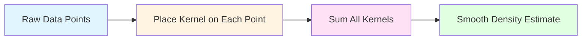
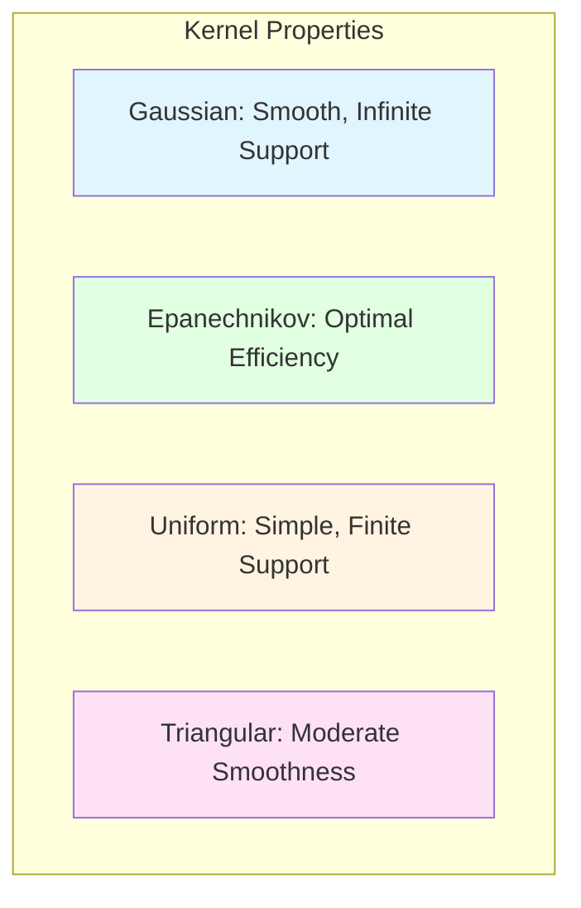
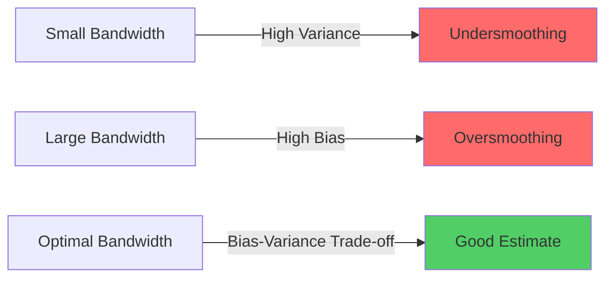
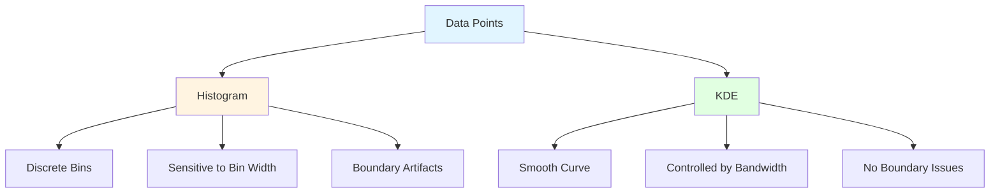
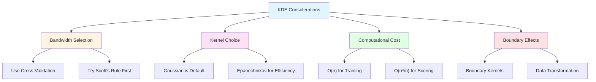
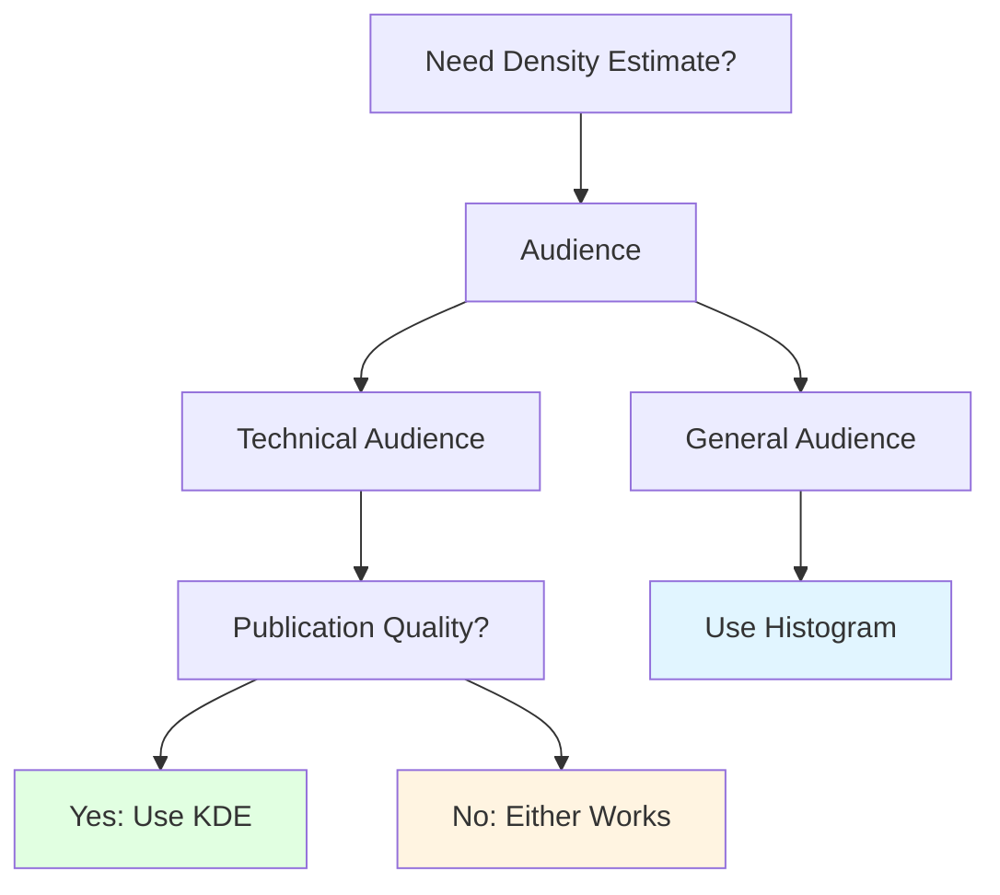
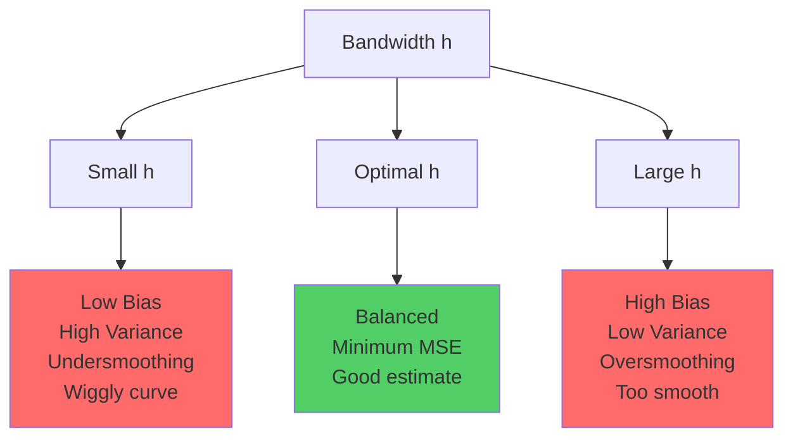
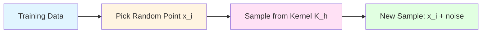
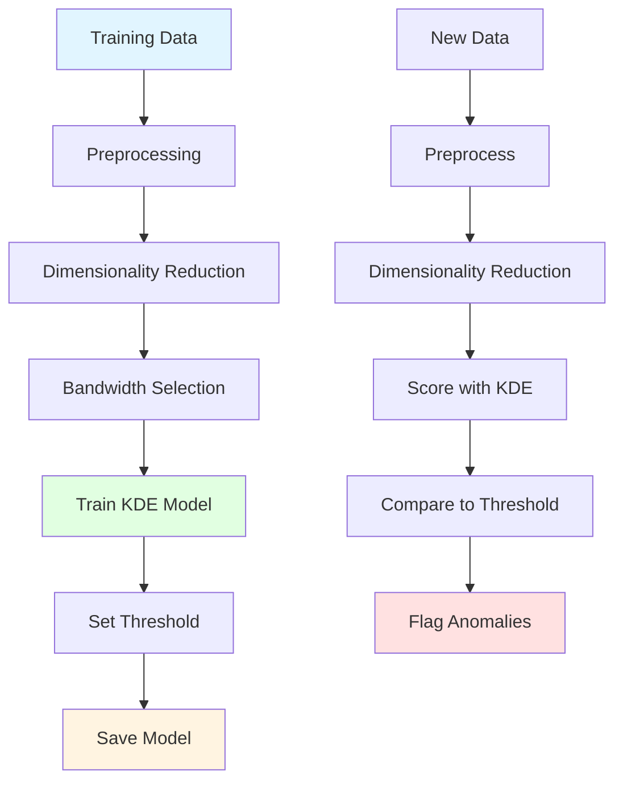

# Kernel Density Estimation (KDE)

## 🎯 Learning Objectives

By the end of this chapter, you will understand:
- What kernel density estimation is and why it's used
- Different kernel functions and their properties
- Bandwidth selection methods and their impact
- How KDE compares to histograms and parametric methods
- Applications of KDE in anomaly detection and probability estimation
- Implementation using scikit-learn and scipy
- Common pitfalls and best practices

---

## 📚 Key Concepts

### What is Kernel Density Estimation?

**Kernel Density Estimation (KDE)** is a non-parametric method to estimate the probability density function (PDF) of a random variable. Unlike parametric methods that assume a specific distribution (like Gaussian), KDE makes no assumptions about the underlying distribution.



**Mathematical Formulation:**

$$
\hat{f}_h(x) = \frac{1}{n \cdot h} \sum_{i=1}^{n} K\left(\frac{x - x_i}{h}\right)
$$

Where:
- $\hat{f}_h(x)$ = estimated density at point $x$
- $n$ = number of data points
- $h$ = bandwidth (smoothing parameter)
- $K$ = kernel function
- $x_i$ = individual data points

### Kernel Functions

A **kernel function** $K$ must satisfy:
1. $\int_{-\infty}^{\infty} K(u) \, du = 1$ (integrates to 1)
2. $K(u) \geq 0$ for all $u$ (non-negative)
3. Usually symmetric: $K(-u) = K(u)$

**Common Kernel Functions:**

| Kernel | Formula | Support | Efficiency |
|--------|---------|---------|------------|
| **Gaussian** | $K(u) = \frac{1}{\sqrt{2\pi}} e^{-\frac{u^2}{2}}$ | $(-\infty, \infty)$ | 1.0 |
| **Epanechnikov** | $K(u) = \frac{3}{4}(1 - u^2)$ for $\|u\| \leq 1$ | $[-1, 1]$ | 1.0 (optimal) |
| **Uniform** | $K(u) = \frac{1}{2}$ for $\|u\| \leq 1$ | $[-1, 1]$ | 0.93 |
| **Triangular** | $K(u) = 1 - \|u\|$ for $\|u\| \leq 1$ | $[-1, 1]$ | 0.98 |
| **Tophat** | $K(u) = \frac{1}{2}$ for $\|u\| \leq 1$ | $[-1, 1]$ | 0.93 |

**Visual Comparison:**



**Kernel Choice Impact:**
- **Gaussian**: Most common, smooth, but slower computation
- **Epanechnikov**: Theoretically optimal (minimizes MISE - Mean Integrated Squared Error)
- Choice of kernel has **less impact** than bandwidth selection

### Bandwidth Selection

The **bandwidth** $h$ controls the smoothness of the density estimate:
- **Small $h$**: Undersmoothing → wiggly, noisy estimate
- **Large $h$**: Oversmoothing → overly smooth, loses detail
- **Optimal $h$**: Balances bias and variance



#### Bandwidth Selection Methods

**1. Scott's Rule (Rule of Thumb):**

$$
h_{\text{Scott}} = n^{-1/(d+4)} \cdot \sigma
$$

Where:
- $n$ = number of samples
- $d$ = number of dimensions
- $\sigma$ = standard deviation of data

For univariate data ($d=1$):

$$
h_{\text{Scott}} = 1.06 \cdot \sigma \cdot n^{-1/5}
$$

**2. Silverman's Rule:**

$$
h_{\text{Silverman}} = 0.9 \cdot \min\left(\sigma, \frac{IQR}{1.34}\right) \cdot n^{-1/5}
$$

Where:
- $IQR$ = interquartile range
- More robust to outliers than Scott's rule

**3. Cross-Validation:**

Minimize the Leave-One-Out Cross-Validation (LOOCV) score:

$$
\text{CV}(h) = \int \hat{f}_h^2(x) \, dx - \frac{2}{n} \sum_{i=1}^{n} \hat{f}_{h,-i}(x_i)
$$

Where $\hat{f}_{h,-i}$ is the density estimate leaving out point $i$.

**4. Grid Search:**

Try different bandwidth values and select based on likelihood or cross-validation score.

### KDE vs Histograms

| Aspect | Histogram | KDE |
|--------|-----------|-----|
| **Smoothness** | Discrete bins | Continuous curve |
| **Boundary Effects** | Bin edges create artifacts | Smooth across domain |
| **Bin Dependency** | Depends on bin width/placement | Depends on bandwidth |
| **Interpretability** | Easy to understand | Requires understanding of kernels |
| **Computation** | Fast | Slower (evaluating kernels) |
| **Parametric** | No | No (both non-parametric) |

**Visual Comparison:**



**When to Use:**
- **Histogram**: Quick exploratory analysis, easy interpretation
- **KDE**: Publication-quality figures, probability estimation, smoother representation

### Multivariate KDE

For $d$-dimensional data:

$$
\hat{f}_H(x) = \frac{1}{n} \sum_{i=1}^{n} K_H(x - x_i)
$$

Where $H$ is the bandwidth matrix (often diagonal):

$$
K_H(x) = |H|^{-1/2} K(H^{-1/2}x)
$$

**Challenges:**
- **Curse of Dimensionality**: Requires exponentially more data as dimensions increase
- **Bandwidth Selection**: More complex in high dimensions
- **Computational Cost**: Grows with $n \times d$

**Rule of Thumb for High Dimensions:**
- KDE works well for $d \leq 3$
- For $d > 3$, consider dimensionality reduction first

### Applications of KDE

**1. Probability Density Estimation:**
```python
from sklearn.neighbors import KernelDensity
import numpy as np

# Estimate PDF
kde = KernelDensity(bandwidth=0.5, kernel='gaussian')
kde.fit(X_train.reshape(-1, 1))

# Evaluate density at new points
log_density = kde.score_samples(X_test.reshape(-1, 1))
density = np.exp(log_density)
```

**2. Anomaly Detection:**
- Points with low density are anomalies
- Threshold: $\text{density} < \text{percentile}(5)$

**3. Data Visualization:**
- Smooth alternative to histograms
- Better for publications

**4. Sampling:**
- Generate new samples from estimated distribution

**5. Mode Finding:**
- Find local maxima (modes) of distribution
- Mean-shift algorithm uses KDE

### Implementation with Scikit-learn

```python
from sklearn.neighbors import KernelDensity
import numpy as np
import matplotlib.pyplot as plt

# Generate sample data
np.random.seed(42)
X = np.concatenate([
    np.random.normal(0, 1, 300),
    np.random.normal(5, 1.5, 700)
]).reshape(-1, 1)

# Create KDE model
kde = KernelDensity(bandwidth=0.5, kernel='gaussian')
kde.fit(X)

# Evaluate on a grid
X_plot = np.linspace(-5, 10, 1000).reshape(-1, 1)
log_dens = kde.score_samples(X_plot)
density = np.exp(log_dens)

# Plot
plt.fill_between(X_plot[:, 0], density, alpha=0.5)
plt.plot(X[:, 0], np.full_like(X[:, 0], -0.01), '|k', markeredgewidth=1)
plt.xlabel('x')
plt.ylabel('Density')
plt.title('Kernel Density Estimation')
plt.show()
```

### Bandwidth Selection with Cross-Validation

```python
from sklearn.model_selection import GridSearchCV
from sklearn.neighbors import KernelDensity

# Grid search for best bandwidth
bandwidths = np.logspace(-1, 1, 20)
grid = GridSearchCV(
    KernelDensity(kernel='gaussian'),
    {'bandwidth': bandwidths},
    cv=5,
    scoring='neg_mean_squared_error'  # Can also use log-likelihood
)

grid.fit(X)

best_bandwidth = grid.best_params_['bandwidth']
print(f"Best bandwidth: {best_bandwidth:.3f}")

# Use best model
kde_best = grid.best_estimator_
```

### Anomaly Detection with KDE

```python
from sklearn.neighbors import KernelDensity
import numpy as np

# Fit KDE
kde = KernelDensity(bandwidth=0.5, kernel='gaussian')
kde.fit(X_train)

# Score test samples
log_density = kde.score_samples(X_test)
density = np.exp(log_density)

# Identify anomalies (bottom 5%)
threshold = np.percentile(density, 5)
anomalies = X_test[density < threshold]

print(f"Found {len(anomalies)} anomalies out of {len(X_test)} samples")
```

### Comparison with Parametric Methods

```python
from sklearn.neighbors import KernelDensity
from scipy.stats import norm
import numpy as np

# Generate data from mixture of Gaussians
X = np.concatenate([
    np.random.normal(0, 1, 300),
    np.random.normal(5, 1.5, 700)
]).reshape(-1, 1)

# 1. KDE (non-parametric)
kde = KernelDensity(bandwidth=0.5, kernel='gaussian')
kde.fit(X)

# 2. Single Gaussian fit (parametric)
mu, sigma = X.mean(), X.std()

# Evaluate both
X_plot = np.linspace(-5, 10, 1000).reshape(-1, 1)
kde_density = np.exp(kde.score_samples(X_plot))
gaussian_density = norm.pdf(X_plot, mu, sigma)

# KDE captures bimodal structure, Gaussian doesn't
```

### Practical Considerations



---

## 🎤 Interview Questions and Answers

### Q1: What is Kernel Density Estimation and when would you use it?

**Answer:**

Kernel Density Estimation (KDE) is a **non-parametric method** to estimate the probability density function (PDF) of a random variable without assuming any specific distribution.

**How it works:**
1. Place a kernel (small probability distribution) on each data point
2. Sum all kernels to create smooth density estimate
3. Normalize so total area = 1

**When to use KDE:**
- **Unknown distribution**: Don't want to assume Gaussian/exponential/etc.
- **Multimodal data**: Data has multiple peaks
- **Anomaly detection**: Identify low-density regions
- **Data visualization**: Smoother alternative to histograms
- **Sampling**: Generate new samples from estimated distribution

**Example use case:**
```python
from sklearn.neighbors import KernelDensity

# Fit KDE to training data
kde = KernelDensity(bandwidth=0.5, kernel='gaussian')
kde.fit(X_train)

# Detect anomalies (low density points)
log_density = kde.score_samples(X_test)
anomalies = X_test[log_density < threshold]
```

---

### Q2: Explain the role of bandwidth in KDE and how to select it.

**Answer:**

**Bandwidth ($h$)** is the smoothing parameter that controls how wide each kernel is:

**Impact:**
- **Small bandwidth**: Undersmoothing → wiggly, high variance, overfits noise
- **Large bandwidth**: Oversmoothing → too smooth, high bias, misses structure
- **Optimal bandwidth**: Balances bias-variance trade-off

**Selection Methods:**

**1. Scott's Rule (Fast):**
$$
h = 1.06 \cdot \sigma \cdot n^{-1/5}
$$
- Quick rule of thumb
- Assumes data is approximately Gaussian

**2. Silverman's Rule (Robust):**
$$
h = 0.9 \cdot \min(\sigma, IQR/1.34) \cdot n^{-1/5}
$$
- More robust to outliers
- Uses IQR instead of just std

**3. Cross-Validation (Best):**
```python
from sklearn.model_selection import GridSearchCV

bandwidths = np.logspace(-1, 1, 20)
grid = GridSearchCV(
    KernelDensity(),
    {'bandwidth': bandwidths},
    cv=5
)
grid.fit(X)
best_h = grid.best_params_['bandwidth']
```
- Most accurate but computationally expensive
- Optimizes prediction on held-out data

**Recommendation:**
- Start with Scott's rule for quick estimate
- Use cross-validation for final model

---

### Q3: What are the common kernel functions and does the choice matter?

**Answer:**

**Common Kernel Functions:**

1. **Gaussian** (most common):
   - $K(u) = \frac{1}{\sqrt{2\pi}} e^{-u^2/2}$
   - Smooth, infinite support
   - Default in most libraries

2. **Epanechnikov** (optimal):
   - $K(u) = \frac{3}{4}(1-u^2)$ for $|u| \leq 1$
   - Minimizes Mean Integrated Squared Error (MISE)
   - Compact support (faster computation)

3. **Uniform/Tophat**:
   - $K(u) = 0.5$ for $|u| \leq 1$
   - Simple, box-shaped
   - Less smooth

4. **Triangular**:
   - $K(u) = 1 - |u|$ for $|u| \leq 1$
   - Moderate smoothness

**Does choice matter?**

**Generally NO** - bandwidth matters much more than kernel choice:
- All reasonable kernels give similar results with proper bandwidth
- Difference in efficiency is typically <10%
- Epanechnikov is theoretically optimal but practically similar to Gaussian

**When kernel choice matters:**
- **Computational efficiency**: Compact support kernels (Epanechnikov) faster for large datasets
- **Smoothness requirements**: Gaussian gives smoother estimates
- **Boundary problems**: Some kernels handle boundaries better

**Practical advice:**
```python
# Default: Gaussian (safe choice)
kde = KernelDensity(kernel='gaussian', bandwidth=0.5)

# For speed: Epanechnikov
kde = KernelDensity(kernel='epanechnikov', bandwidth=0.5)
```

Focus on **bandwidth tuning**, not kernel selection.

---

### Q4: How does KDE compare to histograms for density estimation?

**Answer:**

| Aspect | Histogram | KDE |
|--------|-----------|-----|
| **Smoothness** | Discrete, blocky | Smooth, continuous |
| **Boundaries** | Artifacts at bin edges | No boundary issues |
| **Parameters** | Bin width + bin placement | Bandwidth only |
| **Interpretation** | Very intuitive | Less intuitive |
| **Computation** | Very fast | Slower (O(n×m)) |
| **Probability** | Requires normalization | Directly gives PDF |
| **Flexibility** | Limited by bins | Continuous evaluation |

**Advantages of KDE over Histograms:**

1. **No binning artifacts**: Histograms depend on arbitrary bin placement
2. **Smooth curves**: Better for publications and presentations
3. **Probability estimation**: Directly estimates PDF at any point
4. **Derivative-friendly**: Can compute derivatives for optimization

**Advantages of Histograms over KDE:**

1. **Simplicity**: Everyone understands histograms
2. **Speed**: Much faster for large datasets
3. **No hyperparameter tuning**: Just choose bin width

**Example:**
```python
import matplotlib.pyplot as plt
from sklearn.neighbors import KernelDensity

# Histogram
plt.hist(X, bins=30, density=True, alpha=0.5, label='Histogram')

# KDE
kde = KernelDensity(bandwidth=0.5)
kde.fit(X.reshape(-1, 1))
X_plot = np.linspace(X.min(), X.max(), 1000)
density = np.exp(kde.score_samples(X_plot.reshape(-1, 1)))
plt.plot(X_plot, density, label='KDE')
plt.legend()
```

**Recommendation:**
- **Exploration**: Use histograms
- **Publication/Analysis**: Use KDE

---

### Q5: Explain how to use KDE for anomaly detection.

**Answer:**

**Concept:**
Anomalies are data points in **low-density regions** of the feature space. KDE estimates density, so points with very low density are anomalous.

**Step-by-Step Process:**

**1. Fit KDE on Normal Data:**
```python
from sklearn.neighbors import KernelDensity

# Fit on training data (assumed normal)
kde = KernelDensity(bandwidth=0.5, kernel='gaussian')
kde.fit(X_train)
```

**2. Score Test Points:**
```python
# Get log-density for test points
log_density = kde.score_samples(X_test)

# Convert to actual density
density = np.exp(log_density)
```

**3. Set Anomaly Threshold:**
```python
# Method 1: Percentile (e.g., bottom 5%)
threshold = np.percentile(log_density, 5)
anomalies = X_test[log_density < threshold]

# Method 2: Standard deviations from mean
mean_log_dens = log_density.mean()
std_log_dens = log_density.std()
threshold = mean_log_dens - 2 * std_log_dens
```

**4. Classify Anomalies:**
```python
is_anomaly = log_density < threshold
print(f"Found {is_anomaly.sum()} anomalies")
```

**Complete Example:**
```python
from sklearn.neighbors import KernelDensity
from sklearn.model_selection import GridSearchCV
import numpy as np

# 1. Optimize bandwidth via cross-validation
bandwidths = np.logspace(-1, 1, 20)
grid = GridSearchCV(
    KernelDensity(),
    {'bandwidth': bandwidths},
    cv=5
)
grid.fit(X_train)

# 2. Use best model
kde = grid.best_estimator_

# 3. Score and detect
log_density = kde.score_samples(X_test)
threshold = np.percentile(log_density, 5)
anomalies = X_test[log_density < threshold]

# 4. Visualize
plt.scatter(X_test[:, 0], X_test[:, 1], c=log_density, cmap='viridis')
plt.scatter(anomalies[:, 0], anomalies[:, 1], color='red', marker='x')
plt.colorbar(label='Log Density')
plt.title('KDE Anomaly Detection')
```

**Advantages:**
- No assumption about anomaly distribution
- Works for multimodal data
- Provides anomaly score (not just binary)

**Limitations:**
- Computationally expensive for large datasets
- Struggles in high dimensions (curse of dimensionality)
- Sensitive to bandwidth choice

---

### Q6: What is the curse of dimensionality in KDE?

**Answer:**

The **curse of dimensionality** means KDE performance degrades rapidly as the number of features increases.

**Problems in High Dimensions:**

**1. Data Sparsity:**
- In $d$ dimensions, volume grows as $r^d$
- Need exponentially more data to maintain density
- With fixed $n$ samples, density estimates become unreliable

**Mathematical Example:**
- 100 points in 1D: 100 points per unit length
- 100 points in 2D: 10 points per unit area
- 100 points in 3D: 4.6 points per unit volume
- 100 points in 10D: Almost empty space!

**2. Distance Concentration:**
- In high dimensions, all points become equidistant
- "Near" and "far" lose meaning
- Kernels can't distinguish between points effectively

**3. Bandwidth Selection Difficulty:**
- Optimal bandwidth depends on dimension: $h \propto n^{-1/(d+4)}$
- As $d$ increases, optimal $h$ changes slowly with $n$
- Need massive samples for good estimates

**4. Computational Cost:**
- Evaluating density: $O(n \cdot m \cdot d)$ operations
- Becomes prohibitive for $d > 10$

**Solutions:**

**1. Dimensionality Reduction:**
```python
from sklearn.decomposition import PCA
from sklearn.neighbors import KernelDensity

# Reduce to 2-3 dimensions first
pca = PCA(n_components=3)
X_reduced = pca.fit_transform(X)

# Then apply KDE
kde = KernelDensity(bandwidth=0.5)
kde.fit(X_reduced)
```

**2. Feature Selection:**
- Use only most important features
- Domain knowledge to select relevant dimensions

**3. Specialized Methods:**
- Use tree-based methods (Isolation Forest) for high-dimensional anomaly detection
- Consider parametric alternatives (Gaussian Mixture Models)

**4. Local Methods:**
- Use k-nearest neighbors instead of global density
- LOF (Local Outlier Factor) algorithm

**Rule of Thumb:**
- **KDE works well**: $d \leq 3$, $n > 100 \times 2^d$
- **KDE struggles**: $d > 5$
- **KDE fails**: $d > 10$ (use other methods)

**Example:**
```python
# Check if KDE is appropriate
n_samples, n_features = X.shape

min_samples_needed = 100 * (2 ** n_features)

if n_samples < min_samples_needed:
    print(f"Warning: Only {n_samples} samples for {n_features} dimensions")
    print(f"Recommend at least {min_samples_needed} samples")
    print("Consider dimensionality reduction or alternative methods")
```

---

### Q7: How do you handle boundary effects in KDE?

**Answer:**

**Boundary Problem:**
When data is bounded (e.g., $x \geq 0$), standard KDE can place probability mass outside the valid range, causing:
- Density estimation errors near boundaries
- Probability "leaking" beyond boundaries
- Biased estimates near edges

**Example:**
- Data: incomes (all positive)
- Standard KDE: might assign probability to negative incomes

**Solutions:**

**1. Reflection Method:**
```python
def kde_with_reflection(X, bandwidth=0.5, boundary=0):
    """
    KDE with reflection at boundary
    """
    from sklearn.neighbors import KernelDensity

    # Reflect data across boundary
    X_reflected = 2 * boundary - X
    X_augmented = np.concatenate([X, X_reflected])

    # Fit KDE on augmented data
    kde = KernelDensity(bandwidth=bandwidth)
    kde.fit(X_augmented.reshape(-1, 1))

    return kde

# Use only for x >= boundary
X_plot = np.linspace(0, X.max(), 1000)
density = np.exp(kde.score_samples(X_plot.reshape(-1, 1)))
```

**2. Data Transformation:**
```python
# For positive data, use log transform
X_log = np.log(X)

# Fit KDE on transformed data
kde = KernelDensity(bandwidth=0.5)
kde.fit(X_log.reshape(-1, 1))

# Transform back when evaluating
# Remember Jacobian correction!
X_plot_log = np.log(X_plot)
log_density = kde.score_samples(X_plot_log.reshape(-1, 1))
density = np.exp(log_density) / X_plot  # Jacobian
```

**3. Boundary Kernels:**
- Use special kernel functions near boundaries
- Kernels that are asymmetric near edges
- Not available in scikit-learn (custom implementation needed)

**4. Truncation:**
```python
# Fit normal KDE
kde = KernelDensity(bandwidth=0.5)
kde.fit(X.reshape(-1, 1))

# Evaluate and truncate
X_plot = np.linspace(0, X.max(), 1000)
density = np.exp(kde.score_samples(X_plot.reshape(-1, 1)))

# Set density to 0 outside valid range
density[X_plot < 0] = 0

# Renormalize
density = density / np.trapz(density, X_plot)
```

**5. Use Bounded Distributions:**
- For bounded data, consider parametric alternatives
- Beta distribution for $[0, 1]$
- Gamma distribution for $[0, \infty)$

**Best Practice:**
```python
def smart_kde(X, lower_bound=None, upper_bound=None):
    """
    KDE with automatic boundary handling
    """
    from sklearn.neighbors import KernelDensity

    # Check if transformation is appropriate
    if lower_bound is not None and lower_bound == 0:
        # Log transform for positive data
        X_trans = np.log(X - lower_bound + 1e-10)
    elif lower_bound is not None or upper_bound is not None:
        # Logit transform for bounded data
        X_trans = apply_logit_transform(X, lower_bound, upper_bound)
    else:
        # No boundaries
        X_trans = X

    kde = KernelDensity(bandwidth='scott')
    kde.fit(X_trans.reshape(-1, 1))

    return kde, X_trans
```

---

### Q8: Compare KDE with Gaussian Mixture Models (GMM) for density estimation.

**Answer:**

Both KDE and GMM estimate probability density functions, but differ fundamentally:

| Aspect | KDE | GMM |
|--------|-----|-----|
| **Type** | Non-parametric | Parametric |
| **Assumption** | None (flexible) | Mixture of Gaussians |
| **Parameters** | Bandwidth only | Means, covariances, weights |
| **Complexity** | O(n) parameters (kernels) | O(k×d²) parameters (k components) |
| **Computation** | O(n×m) for scoring | O(k×m) for scoring |
| **Generative** | Can sample (complex) | Easy to sample |
| **Interpretability** | Less interpretable | Clusters have meaning |
| **Clustering** | No clustering | Provides soft clustering |
| **High Dimensions** | Struggles (curse) | Handles better with structure |

**When to Use KDE:**

✅ **Unknown distribution shape**
✅ **Unusual/complex distributions**
✅ **No assumption about structure**
✅ **Low dimensions** ($d \leq 3$)
✅ **Small to medium datasets**

**When to Use GMM:**

✅ **Data has cluster structure**
✅ **Want clustering + density**
✅ **Need generative model**
✅ **Higher dimensions** (with appropriate k)
✅ **Interpretable components**
✅ **Faster scoring** (after training)

**Example Comparison:**
```python
from sklearn.neighbors import KernelDensity
from sklearn.mixture import GaussianMixture
import numpy as np

# Generate bimodal data
X = np.concatenate([
    np.random.normal(0, 1, 300),
    np.random.normal(5, 1.5, 700)
]).reshape(-1, 1)

# KDE
kde = KernelDensity(bandwidth=0.5)
kde.fit(X)

# GMM
gmm = GaussianMixture(n_components=2, random_state=42)
gmm.fit(X)

# Evaluate on grid
X_plot = np.linspace(-5, 10, 1000).reshape(-1, 1)
kde_scores = np.exp(kde.score_samples(X_plot))
gmm_scores = np.exp(gmm.score_samples(X_plot))

# Plot both
plt.plot(X_plot, kde_scores, label='KDE')
plt.plot(X_plot, gmm_scores, label='GMM')
plt.legend()
```

**Hybrid Approach:**
```python
# Use KDE to determine number of components for GMM
from sklearn.cluster import MeanShift

# 1. Use mean-shift (KDE-based) to find modes
ms = MeanShift(bandwidth=0.5)
ms.fit(X)
n_modes = len(ms.cluster_centers_)

# 2. Use this for GMM components
gmm = GaussianMixture(n_components=n_modes)
gmm.fit(X)
```

**Practical Recommendation:**
- Start with KDE for exploration
- Use GMM if data shows clear cluster structure
- GMM better for production (faster, parametric)
- KDE better for unusual distributions

---

### Q9: How do you implement KDE from scratch?

**Answer:**

**Basic KDE Implementation:**

```python
import numpy as np

def gaussian_kernel(u):
    """
    Gaussian kernel function
    K(u) = (1/sqrt(2*pi)) * exp(-u^2/2)
    """
    return (1.0 / np.sqrt(2 * np.pi)) * np.exp(-0.5 * u**2)

def kde_1d(X_train, X_eval, bandwidth):
    """
    1D Kernel Density Estimation

    Parameters:
    -----------
    X_train : array-like, shape (n_samples,)
        Training data points
    X_eval : array-like, shape (n_eval,)
        Points at which to evaluate density
    bandwidth : float
        Bandwidth parameter (h)

    Returns:
    --------
    density : array-like, shape (n_eval,)
        Estimated density at each evaluation point
    """
    n = len(X_train)
    m = len(X_eval)
    density = np.zeros(m)

    # For each evaluation point
    for i, x in enumerate(X_eval):
        # Sum kernels from all training points
        kernel_sum = 0
        for x_i in X_train:
            u = (x - x_i) / bandwidth
            kernel_sum += gaussian_kernel(u)

        # Normalize
        density[i] = kernel_sum / (n * bandwidth)

    return density

# Example usage
np.random.seed(42)
X_train = np.random.normal(0, 1, 100)
X_eval = np.linspace(-4, 4, 1000)

density = kde_1d(X_train, X_eval, bandwidth=0.5)

# Plot
import matplotlib.pyplot as plt
plt.plot(X_eval, density)
plt.hist(X_train, bins=30, density=True, alpha=0.3)
plt.xlabel('x')
plt.ylabel('Density')
plt.title('KDE from Scratch')
plt.show()
```

**Vectorized Version (Much Faster):**

```python
def kde_1d_vectorized(X_train, X_eval, bandwidth):
    """
    Vectorized 1D KDE for efficiency
    """
    n = len(X_train)

    # Compute pairwise differences
    # Shape: (n_eval, n_train)
    diff = X_eval[:, np.newaxis] - X_train[np.newaxis, :]

    # Apply kernel
    u = diff / bandwidth
    kernels = gaussian_kernel(u)

    # Sum and normalize
    density = kernels.sum(axis=1) / (n * bandwidth)

    return density

# Much faster for large datasets!
```

**Multivariate KDE:**

```python
def kde_multivariate(X_train, X_eval, bandwidth):
    """
    Multivariate KDE with diagonal bandwidth matrix

    Parameters:
    -----------
    X_train : array-like, shape (n_samples, n_features)
    X_eval : array-like, shape (n_eval, n_features)
    bandwidth : float or array-like
        Bandwidth (same for all dimensions or per dimension)
    """
    n, d = X_train.shape
    m = X_eval.shape[0]

    # Convert bandwidth to array
    if np.isscalar(bandwidth):
        bandwidth = np.ones(d) * bandwidth

    density = np.zeros(m)

    # Normalization constant
    norm_const = n * np.prod(bandwidth) * (2 * np.pi) ** (d / 2)

    for i in range(m):
        # Difference from all training points
        diff = (X_eval[i] - X_train) / bandwidth

        # Gaussian kernel for multivariate
        exponent = -0.5 * np.sum(diff**2, axis=1)
        kernel_values = np.exp(exponent)

        density[i] = kernel_values.sum() / norm_const

    return density

# Example with 2D data
X_train_2d = np.random.randn(100, 2)
X_eval_2d = np.random.randn(50, 2)

density_2d = kde_multivariate(X_train_2d, X_eval_2d, bandwidth=0.5)
```

**With Bandwidth Selection (Scott's Rule):**

```python
def kde_auto_bandwidth(X_train, X_eval, method='scott'):
    """
    KDE with automatic bandwidth selection
    """
    n, d = X_train.shape if X_train.ndim > 1 else (len(X_train), 1)

    if method == 'scott':
        # Scott's rule: h = n^(-1/(d+4)) * sigma
        sigma = X_train.std(axis=0) if d > 1 else X_train.std()
        bandwidth = sigma * n ** (-1 / (d + 4))
    elif method == 'silverman':
        # Silverman's rule
        sigma = X_train.std(axis=0) if d > 1 else X_train.std()
        bandwidth = 0.9 * sigma * n ** (-1 / (d + 4))

    if d == 1:
        return kde_1d_vectorized(X_train, X_eval, bandwidth)
    else:
        return kde_multivariate(X_train, X_eval, bandwidth)

# Usage
density = kde_auto_bandwidth(X_train, X_eval, method='scott')
```

**Key Points:**
1. **Vectorization**: Use NumPy broadcasting for speed
2. **Bandwidth**: Critical parameter (use Scott's or Silverman's rule)
3. **Normalization**: Ensure $\int f(x) dx = 1$
4. **Kernel choice**: Gaussian most common, others possible

**Performance Note:**
For production, use scikit-learn's optimized implementation:
```python
from sklearn.neighbors import KernelDensity
kde = KernelDensity(bandwidth=0.5, kernel='gaussian')
# Uses KD-trees for efficiency!
```

---

### Q10: What are the computational complexities of KDE?

**Answer:**

**Time Complexity:**

**1. Training (Fitting):**
- **Naive KDE**: $O(1)$ - Just stores the data
- **Tree-based KDE**: $O(n \log n)$ - Builds KD-tree or Ball tree
  - Used by scikit-learn for efficiency

Where $n$ = number of training samples

**2. Scoring (Density Evaluation):**
- **Naive approach**: $O(n \cdot m \cdot d)$
  - $n$ = training samples
  - $m$ = evaluation points
  - $d$ = dimensions
  - Must evaluate kernel for every training point

- **Tree-based approach**: $O(m \cdot d \cdot \log n)$ (average case)
  - Much faster for large $n$
  - Scikit-learn uses this

**3. Bandwidth Selection (Cross-Validation):**
- **Grid search with k-fold CV**: $O(k \cdot g \cdot n \cdot m \cdot d)$
  - $k$ = number of folds
  - $g$ = number of bandwidth values to try
  - Most expensive operation

**Space Complexity:**

- **Storage**: $O(n \cdot d)$ - Must store all training data (non-parametric)
- **Tree structure**: $O(n \cdot d)$ additional for tree-based methods

**Comparison with Other Methods:**

| Method | Training | Scoring | Space |
|--------|----------|---------|-------|
| **KDE (naive)** | O(1) | O(n×m×d) | O(n×d) |
| **KDE (tree)** | O(n log n) | O(m×d×log n) | O(n×d) |
| **GMM** | O(k×n×d×i) | O(k×m×d) | O(k×d²) |
| **Histogram** | O(n) | O(m) | O(b^d) |

Where:
- $k$ = number of GMM components
- $i$ = EM iterations
- $b$ = number of bins per dimension

**Practical Implications:**

**1. Large Training Sets ($n$ large):**
```python
# Use tree-based algorithm (default in sklearn)
from sklearn.neighbors import KernelDensity

kde = KernelDensity(
    bandwidth=0.5,
    algorithm='auto',  # Chooses best algorithm
    kernel='gaussian'
)
kde.fit(X_train)  # Builds tree: O(n log n)

# Scoring is fast: O(m * log n)
scores = kde.score_samples(X_test)
```

**2. Many Evaluation Points ($m$ large):**
```python
# If possible, use compact-support kernels
kde = KernelDensity(
    bandwidth=0.5,
    kernel='epanechnikov'  # Compact support
)
# Faster because kernel is 0 beyond bandwidth
```

**3. High Dimensions ($d$ large):**
```python
# Reduce dimensions first
from sklearn.decomposition import PCA

pca = PCA(n_components=3)
X_reduced = pca.fit_transform(X)

kde = KernelDensity(bandwidth=0.5)
kde.fit(X_reduced)
# Now scoring is O(m * 3 * log n) instead of O(m * d * log n)
```

**4. Bandwidth Selection (expensive):**
```python
# Option 1: Use rule of thumb (fast)
from scipy.stats import gaussian_kde

# Automatically uses Scott's rule
kde_scipy = gaussian_kde(X_train.T)

# Option 2: Grid search with fewer values
bandwidths = [0.1, 0.5, 1.0]  # Only 3 values
grid = GridSearchCV(KernelDensity(), {'bandwidth': bandwidths}, cv=3)
```

**Optimization Strategies:**

1. **Subsample for large datasets**: Train on sample, score on all
2. **Use tree-based algorithms**: Default in scikit-learn
3. **Reduce dimensions**: PCA before KDE
4. **Compact kernels**: Epanechnikov instead of Gaussian
5. **Approximate methods**: Random Fourier Features for very large scale

**Real-World Example:**
```python
import time
from sklearn.neighbors import KernelDensity

# Generate data
n_train = 10000
n_test = 1000
X_train = np.random.randn(n_train, 5)
X_test = np.random.randn(n_test, 5)

# Measure time
start = time.time()
kde = KernelDensity(bandwidth=0.5, algorithm='kd_tree')
kde.fit(X_train)
fit_time = time.time() - start

start = time.time()
scores = kde.score_samples(X_test)
score_time = time.time() - start

print(f"Fit time: {fit_time:.3f}s")    # ~0.1s
print(f"Score time: {score_time:.3f}s")  # ~0.05s
```

---

### Q11: How do you choose between KDE and histogram for data visualization?

**Answer:**

**Decision Framework:**



**Use Histogram When:**

✅ **Audience is non-technical**
- Everyone understands histograms
- Bars are intuitive

✅ **Exploratory data analysis**
- Quick and dirty visualization
- Fast to compute and plot

✅ **Discrete or categorical data**
- Natural binning
- Counts are meaningful

✅ **Very large datasets**
- Histogram is much faster
- $O(n)$ vs $O(n \log n)$

✅ **Interpretability is critical**
- "30 people in this bin" is clear
- Density values are abstract

**Example:**
```python
import matplotlib.pyplot as plt

# Simple histogram
plt.figure(figsize=(10, 4))
plt.subplot(1, 2, 1)
plt.hist(X, bins=30, edgecolor='black')
plt.title('Histogram')
plt.xlabel('Value')
plt.ylabel('Count')
```

**Use KDE When:**

✅ **Publication or presentation**
- Smooth, professional appearance
- No arbitrary bin edges

✅ **Continuous data**
- Natural for continuous variables
- Better represents underlying distribution

✅ **Probability estimation needed**
- Need actual density values
- Want to evaluate at specific points

✅ **Multimodal detection**
- Better at showing multiple peaks
- Smoother transitions

✅ **Small to medium datasets**
- Can afford computation
- $n < 10,000$ typically fine

**Example:**
```python
from sklearn.neighbors import KernelDensity

# Smooth KDE plot
kde = KernelDensity(bandwidth=0.5)
kde.fit(X.reshape(-1, 1))

X_plot = np.linspace(X.min(), X.max(), 1000)
density = np.exp(kde.score_samples(X_plot.reshape(-1, 1)))

plt.subplot(1, 2, 2)
plt.fill_between(X_plot, density, alpha=0.5)
plt.plot(X_plot, density, linewidth=2)
plt.title('KDE')
plt.xlabel('Value')
plt.ylabel('Density')
```

**Best Practice: Show Both!**

```python
import matplotlib.pyplot as plt
from sklearn.neighbors import KernelDensity
import numpy as np

def plot_distribution(X, title='Distribution'):
    """
    Plot both histogram and KDE for comprehensive view
    """
    fig, ax = plt.subplots(figsize=(10, 6))

    # Histogram (normalized)
    ax.hist(X, bins=30, density=True, alpha=0.5,
            color='skyblue', edgecolor='black', label='Histogram')

    # KDE overlay
    kde = KernelDensity(bandwidth='scott', kernel='gaussian')
    kde.fit(X.reshape(-1, 1))

    X_plot = np.linspace(X.min(), X.max(), 1000)
    log_density = kde.score_samples(X_plot.reshape(-1, 1))
    density = np.exp(log_density)

    ax.plot(X_plot, density, 'r-', linewidth=2, label='KDE')

    # Rug plot (individual points)
    ax.plot(X, np.full_like(X, -0.01), '|k', markeredgewidth=1,
            markersize=10, label='Data points')

    ax.set_xlabel('Value', fontsize=12)
    ax.set_ylabel('Density', fontsize=12)
    ax.set_title(title, fontsize=14)
    ax.legend()
    ax.grid(alpha=0.3)

    return fig, ax

# Usage
plot_distribution(X, 'Income Distribution')
plt.show()
```

**Parameter Equivalence:**

To make them comparable:
```python
# Histogram with n bins covers range R
bin_width = (X.max() - X.min()) / n_bins

# Equivalent KDE bandwidth (rough approximation)
kde_bandwidth = bin_width / 2

# More principled: use same selection method
from scipy.stats import gaussian_kde
kde_scipy = gaussian_kde(X, bw_method='scott')
# Scott's rule for both
```

**Common Mistakes:**

❌ **Don't**: Use default bins for histogram without checking
```python
plt.hist(X)  # Default bins may be terrible
```

✅ **Do**: Choose bins carefully or use KDE
```python
# Sturges' rule
n_bins = int(np.log2(len(X)) + 1)
plt.hist(X, bins=n_bins)
```

❌ **Don't**: Use KDE without considering bandwidth
```python
kde = KernelDensity()  # Default might be bad
```

✅ **Do**: Optimize bandwidth or use rule of thumb
```python
kde = KernelDensity(bandwidth='scott')
```

**Summary Table:**

| Criterion | Histogram | KDE |
|-----------|-----------|-----|
| **Simplicity** | ⭐⭐⭐⭐⭐ | ⭐⭐⭐ |
| **Appearance** | ⭐⭐⭐ | ⭐⭐⭐⭐⭐ |
| **Speed** | ⭐⭐⭐⭐⭐ | ⭐⭐⭐ |
| **Probability** | ⭐⭐ | ⭐⭐⭐⭐⭐ |
| **Large data** | ⭐⭐⭐⭐⭐ | ⭐⭐ |
| **Publication** | ⭐⭐⭐ | ⭐⭐⭐⭐⭐ |

---

### Q12: Explain the bias-variance trade-off in bandwidth selection for KDE.

**Answer:**

The **bandwidth** $h$ in KDE controls the bias-variance trade-off:

**Bias:**
- **Systematic error** in density estimation
- How much the estimate differs from true density on average
- **Large bandwidth** → High bias (oversmoothing)

**Variance:**
- **Random error** due to sampling variability
- How much the estimate varies with different samples
- **Small bandwidth** → High variance (undersmoothing)

**Mathematical Formulation:**

Mean Squared Error (MSE) at a point $x$:

$$
\text{MSE}(x) = \text{Bias}^2(\hat{f}_h(x)) + \text{Var}(\hat{f}_h(x))
$$

For KDE with Gaussian kernel:

**Bias:**
$$
\text{Bias}(\hat{f}_h(x)) \approx \frac{h^2}{2} f''(x) \int u^2 K(u) du
$$
- Proportional to $h^2$
- Large $h$ → large bias

**Variance:**
$$
\text{Var}(\hat{f}_h(x)) \approx \frac{1}{nh} f(x) \int K^2(u) du
$$
- Proportional to $1/(nh)$
- Small $h$ → large variance

**Visual Understanding:**



**Practical Example:**

```python
from sklearn.neighbors import KernelDensity
import numpy as np
import matplotlib.pyplot as plt

# Generate bimodal data
np.random.seed(42)
X = np.concatenate([
    np.random.normal(0, 1, 300),
    np.random.normal(5, 1.5, 700)
]).reshape(-1, 1)

# Try different bandwidths
bandwidths = [0.1, 0.5, 1.0, 2.0]
X_plot = np.linspace(-5, 10, 1000).reshape(-1, 1)

fig, axes = plt.subplots(2, 2, figsize=(12, 8))
axes = axes.ravel()

for i, bw in enumerate(bandwidths):
    kde = KernelDensity(bandwidth=bw, kernel='gaussian')
    kde.fit(X)

    log_dens = kde.score_samples(X_plot)
    density = np.exp(log_dens)

    axes[i].fill_between(X_plot[:, 0], density, alpha=0.5)
    axes[i].plot(X[:, 0], np.full_like(X[:, 0], -0.01), '|k',
                 markeredgewidth=1)
    axes[i].set_title(f'Bandwidth = {bw}')
    axes[i].set_xlabel('x')
    axes[i].set_ylabel('Density')

plt.tight_layout()
plt.show()
```

**Observations:**
- **h = 0.1**: Very wiggly, captures noise (high variance, low bias)
- **h = 0.5**: Smooth, captures two modes (balanced)
- **h = 1.0**: Smoother, modes visible but less distinct
- **h = 2.0**: Too smooth, looks unimodal (high bias, low variance)

**Optimal Bandwidth:**

Minimizes Mean Integrated Squared Error (MISE):

$$
\text{MISE}(h) = \mathbb{E}\left[\int (\hat{f}_h(x) - f(x))^2 dx\right]
$$

**Asymptotically optimal** (as $n \to \infty$):

$$
h_{\text{opt}} \propto n^{-1/(d+4)}
$$

For 1D data ($d=1$): $h_{\text{opt}} \propto n^{-1/5}$

**Practical Bandwidth Selection:**

**1. Cross-Validation (Best):**
```python
from sklearn.model_selection import GridSearchCV

bandwidths = np.logspace(-1, 1, 20)
grid = GridSearchCV(
    KernelDensity(),
    {'bandwidth': bandwidths},
    cv=5  # 5-fold cross-validation
)
grid.fit(X)

h_opt = grid.best_params_['bandwidth']
print(f"Optimal bandwidth: {h_opt:.3f}")

# Plot CV scores
scores = grid.cv_results_['mean_test_score']
plt.plot(bandwidths, scores)
plt.xscale('log')
plt.xlabel('Bandwidth')
plt.ylabel('CV Score')
plt.title('Cross-Validation for Bandwidth Selection')
plt.show()
```

**2. Scott's Rule (Fast):**
```python
def scotts_rule(X):
    n = len(X)
    d = X.shape[1] if X.ndim > 1 else 1
    sigma = X.std()
    h = sigma * n ** (-1 / (d + 4))
    return h

h_scott = scotts_rule(X)
print(f"Scott's rule: {h_scott:.3f}")
```

**3. Silverman's Rule (Robust):**
```python
def silvermans_rule(X):
    n = len(X)
    d = X.shape[1] if X.ndim > 1 else 1
    sigma = X.std()
    IQR = np.percentile(X, 75) - np.percentile(X, 25)
    A = min(sigma, IQR / 1.34)
    h = 0.9 * A * n ** (-1 / (d + 4))
    return h

h_silverman = silvermans_rule(X)
print(f"Silverman's rule: {h_silverman:.3f}")
```

**Comparison:**

```python
# Compare different methods
methods = {
    'Scott': scotts_rule(X),
    'Silverman': silvermans_rule(X),
    'CV': h_opt
}

for method, h in methods.items():
    kde = KernelDensity(bandwidth=h)
    kde.fit(X)
    density = np.exp(kde.score_samples(X_plot))
    plt.plot(X_plot, density, label=f'{method} (h={h:.3f})')

plt.legend()
plt.title('Bandwidth Selection Methods')
plt.show()
```

**Key Takeaways:**

1. **Small h**: Captures fine details but also noise (overfitting)
2. **Large h**: Smooth but misses structure (underfitting)
3. **Optimal h**: Balances capturing true structure vs avoiding noise
4. **Rule of thumb**: Good starting point, CV for final model
5. **Impact**: Bandwidth choice matters MORE than kernel choice

**Real-World Strategy:**

```python
def smart_kde_fit(X, method='auto'):
    """
    Fit KDE with smart bandwidth selection
    """
    from sklearn.neighbors import KernelDensity
    from sklearn.model_selection import GridSearchCV

    if method == 'auto':
        # Use Scott's rule as starting point
        h_scott = scotts_rule(X)

        # Search around Scott's rule
        bandwidths = h_scott * np.array([0.5, 0.75, 1.0, 1.25, 1.5])

        # Quick 3-fold CV
        grid = GridSearchCV(
            KernelDensity(),
            {'bandwidth': bandwidths},
            cv=3
        )
        grid.fit(X)

        return grid.best_estimator_

    elif method == 'scott':
        h = scotts_rule(X)
        return KernelDensity(bandwidth=h).fit(X)

    elif method == 'silverman':
        h = silvermans_rule(X)
        return KernelDensity(bandwidth=h).fit(X)

# Usage
kde = smart_kde_fit(X, method='auto')
```

---

### Q13: How do you use KDE for sampling (generating new data points)?

**Answer:**

KDE can be used as a **generative model** to sample new data points from the estimated distribution. This is useful for:
- Data augmentation
- Simulation
- Bootstrap methods
- Synthetic data generation

**Sampling Algorithm:**

For KDE: $\hat{f}_h(x) = \frac{1}{n} \sum_{i=1}^{n} K_h(x - x_i)$

**Steps:**
1. Randomly select a training point $x_i$ (with equal probability $1/n$)
2. Sample from kernel $K$ centered at $x_i$
3. For Gaussian kernel: $x_{\text{new}} = x_i + h \cdot \epsilon$, where $\epsilon \sim N(0, 1)$



**Implementation from Scratch:**

**1D Sampling:**
```python
import numpy as np

def sample_from_kde_1d(X_train, bandwidth, n_samples=100):
    """
    Sample from 1D KDE with Gaussian kernel

    Parameters:
    -----------
    X_train : array-like, shape (n,)
        Training data
    bandwidth : float
        KDE bandwidth
    n_samples : int
        Number of samples to generate

    Returns:
    --------
    samples : array-like, shape (n_samples,)
        New samples from estimated distribution
    """
    # Step 1: Randomly select training points
    indices = np.random.randint(0, len(X_train), size=n_samples)
    selected_points = X_train[indices]

    # Step 2: Add Gaussian noise with scale = bandwidth
    noise = np.random.normal(0, bandwidth, size=n_samples)

    # Step 3: New samples
    samples = selected_points + noise

    return samples

# Example
np.random.seed(42)
X_train = np.random.normal(0, 1, 100)

# Generate new samples
X_new = sample_from_kde_1d(X_train, bandwidth=0.5, n_samples=500)

# Visualize
import matplotlib.pyplot as plt

plt.figure(figsize=(12, 5))

plt.subplot(1, 2, 1)
plt.hist(X_train, bins=30, density=True, alpha=0.5, label='Original')
plt.title('Original Data')
plt.legend()

plt.subplot(1, 2, 2)
plt.hist(X_new, bins=30, density=True, alpha=0.5,
         color='orange', label='Generated')
plt.title('Generated Samples from KDE')
plt.legend()

plt.tight_layout()
plt.show()
```

**Multivariate Sampling:**
```python
def sample_from_kde_multivariate(X_train, bandwidth, n_samples=100):
    """
    Sample from multivariate KDE with Gaussian kernel

    Parameters:
    -----------
    X_train : array-like, shape (n, d)
        Training data
    bandwidth : float or array-like
        Bandwidth (scalar or per-dimension)
    n_samples : int
        Number of samples to generate

    Returns:
    --------
    samples : array-like, shape (n_samples, d)
        New samples from estimated distribution
    """
    n, d = X_train.shape

    # Convert bandwidth to array if scalar
    if np.isscalar(bandwidth):
        bandwidth = np.ones(d) * bandwidth

    # Step 1: Randomly select training points
    indices = np.random.randint(0, n, size=n_samples)
    selected_points = X_train[indices]

    # Step 2: Add Gaussian noise
    noise = np.random.normal(0, 1, size=(n_samples, d)) * bandwidth

    # Step 3: New samples
    samples = selected_points + noise

    return samples

# Example with 2D data
X_train_2d = np.random.randn(200, 2)
X_new_2d = sample_from_kde_multivariate(
    X_train_2d,
    bandwidth=0.3,
    n_samples=500
)

# Visualize
plt.figure(figsize=(12, 5))

plt.subplot(1, 2, 1)
plt.scatter(X_train_2d[:, 0], X_train_2d[:, 1], alpha=0.5)
plt.title('Original 2D Data')
plt.xlabel('Feature 1')
plt.ylabel('Feature 2')

plt.subplot(1, 2, 2)
plt.scatter(X_new_2d[:, 0], X_new_2d[:, 1],
            alpha=0.5, color='orange')
plt.title('Generated 2D Samples')
plt.xlabel('Feature 1')
plt.ylabel('Feature 2')

plt.tight_layout()
plt.show()
```

**Using Scikit-learn:**

Scikit-learn's `KernelDensity` doesn't have built-in sampling, but we can implement it:

```python
from sklearn.neighbors import KernelDensity

class SamplingKDE(KernelDensity):
    """
    KDE with sampling capability
    """
    def sample(self, n_samples=100, random_state=None):
        """
        Generate samples from fitted KDE
        """
        if random_state is not None:
            np.random.seed(random_state)

        # Get training data from fitted model
        # Note: sklearn stores this in bandwidth_ and tree_
        # For simplicity, we'll pass X during initialization

        if not hasattr(self, 'X_train_'):
            raise ValueError("Must store training data")

        X_train = self.X_train_
        n, d = X_train.shape
        bandwidth = self.bandwidth

        # Sample
        indices = np.random.randint(0, n, size=n_samples)
        selected = X_train[indices]

        if self.kernel == 'gaussian':
            noise = np.random.normal(0, bandwidth, size=(n_samples, d))
        elif self.kernel == 'tophat':
            noise = np.random.uniform(-bandwidth, bandwidth,
                                     size=(n_samples, d))
        else:
            raise NotImplementedError(f"Sampling for {self.kernel} not implemented")

        samples = selected + noise
        return samples

# Usage
X_train = np.random.randn(200, 2)

kde = SamplingKDE(bandwidth=0.5, kernel='gaussian')
kde.X_train_ = X_train  # Store training data
kde.fit(X_train)

# Generate samples
X_new = kde.sample(n_samples=500, random_state=42)

print(f"Generated {len(X_new)} samples")
```

**Alternative: Using scipy.stats.gaussian_kde:**

```python
from scipy.stats import gaussian_kde

# Fit KDE (note: scipy expects shape (d, n))
kde_scipy = gaussian_kde(X_train.T)

# Sample directly
X_new_scipy = kde_scipy.resample(size=500)  # Shape: (d, n_samples)
X_new_scipy = X_new_scipy.T  # Transpose to (n_samples, d)

# Visualize
plt.figure(figsize=(12, 5))

plt.subplot(1, 2, 1)
plt.scatter(X_train[:, 0], X_train[:, 1], alpha=0.5, label='Original')
plt.title('Original Data')
plt.legend()

plt.subplot(1, 2, 2)
plt.scatter(X_new_scipy[:, 0], X_new_scipy[:, 1],
            alpha=0.5, color='orange', label='Generated')
plt.title('Generated via scipy')
plt.legend()

plt.tight_layout()
plt.show()
```

**Applications:**

**1. Data Augmentation:**
```python
# Original dataset is small
X_train_small = np.random.randn(50, 10)
y_train_small = (X_train_small[:, 0] > 0).astype(int)

# Augment with synthetic samples
kde = gaussian_kde(X_train_small.T)
X_synthetic = kde.resample(size=200).T

# Train classifier on augmented data
from sklearn.neighbors import KNeighborsClassifier

# Assign labels based on KNN from original data
knn = KNeighborsClassifier(n_neighbors=5)
knn.fit(X_train_small, y_train_small)
y_synthetic = knn.predict(X_synthetic)

# Combine
X_augmented = np.vstack([X_train_small, X_synthetic])
y_augmented = np.concatenate([y_train_small, y_synthetic])

print(f"Augmented dataset size: {len(X_augmented)}")
```

**2. Bootstrap with KDE:**
```python
def kde_bootstrap(X, n_bootstrap=1000, n_samples=None):
    """
    KDE-based bootstrap for uncertainty estimation
    """
    if n_samples is None:
        n_samples = len(X)

    kde = gaussian_kde(X.T)

    bootstrapped_stats = []
    for _ in range(n_bootstrap):
        # Sample from KDE
        X_boot = kde.resample(size=n_samples).T

        # Compute statistic (e.g., mean)
        stat = X_boot.mean(axis=0)
        bootstrapped_stats.append(stat)

    return np.array(bootstrapped_stats)

# Example
X_data = np.random.randn(100, 2)
bootstrap_means = kde_bootstrap(X_data, n_bootstrap=1000)

# Confidence intervals
ci_lower = np.percentile(bootstrap_means, 2.5, axis=0)
ci_upper = np.percentile(bootstrap_means, 97.5, axis=0)

print(f"95% CI: [{ci_lower}, {ci_upper}]")
```

**Key Points:**
1. Sampling from KDE = Select point + Add kernel noise
2. Preserves distribution shape
3. Useful for augmentation and simulation
4. scipy.stats.gaussian_kde has built-in sampling
5. Bandwidth affects sample diversity

---

### Q14: What are the advantages and limitations of KDE?

**Answer:**

**Advantages of KDE:**

✅ **1. Non-parametric:**
- No assumption about underlying distribution
- Flexible, adapts to data shape
- Works for unimodal, multimodal, skewed distributions

✅ **2. Smooth Continuous Estimates:**
- No arbitrary binning (unlike histograms)
- Smooth probability density function
- Can evaluate at any point

✅ **3. Interpretable:**
- Direct density estimation
- Easy to visualize
- Probability interpretation

✅ **4. Versatile Applications:**
- Density estimation
- Anomaly detection
- Data visualization
- Sampling/generation
- Mode finding (mean-shift)

✅ **5. Theoretically Sound:**
- Well-studied mathematical properties
- Known optimal rates of convergence
- Proven bandwidth selection methods

✅ **6. Simple Implementation:**
- Easy to understand conceptually
- Few hyperparameters (mainly bandwidth)
- Available in standard libraries

**Limitations of KDE:**

❌ **1. Curse of Dimensionality:**
- Performance degrades rapidly in high dimensions
- Needs exponentially more data as dimensions increase
- Practically unusable for $d > 10$

```python
# Example: Data requirement
d_values = [1, 2, 3, 5, 10]
for d in d_values:
    min_samples = 100 * (2 ** d)
    print(f"d={d}: Need ~{min_samples:,} samples")

# Output:
# d=1: Need ~200 samples
# d=2: Need ~400 samples
# d=3: Need ~800 samples
# d=5: Need ~3,200 samples
# d=10: Need ~102,400 samples  # Impractical!
```

❌ **2. Computational Cost:**
- Training: $O(n \log n)$ with trees
- Scoring: $O(n \cdot m \cdot d)$ naive, $O(m \cdot d \cdot \log n)$ with trees
- Slow for large datasets ($n > 100,000$)
- Must store all training data (non-parametric)

❌ **3. Bandwidth Selection Critical:**
- Results very sensitive to bandwidth
- Optimal bandwidth hard to determine
- Cross-validation is expensive
- Rules of thumb may fail for unusual distributions

❌ **4. Boundary Effects:**
- Density "leaks" outside valid range for bounded data
- E.g., assigns probability to negative ages
- Requires special handling (reflection, transformation)

❌ **5. Memory Requirements:**
- Must store all $n$ training points
- Space complexity: $O(n \cdot d)$
- Problematic for very large datasets

❌ **6. Not a Generative Model (by default):**
- No explicit parametric form
- Sampling is possible but requires extra steps
- Unlike GMM which is naturally generative

❌ **7. Uniform Weight to All Points:**
- Outliers have equal influence
- No way to down-weight suspicious points
- Can be problematic with noisy data

**Comparison with Alternatives:**

| Method | Parametric | Speed | High-D | Interpretability |
|--------|------------|-------|--------|------------------|
| **KDE** | No | Medium | ❌ Poor | ✅ Good |
| **GMM** | Yes | Fast | ✅ Better | ✅ Good |
| **Histogram** | No | Very Fast | ❌ Poor | ✅ Excellent |
| **Parametric (Gaussian)** | Yes | Very Fast | ✅ Good | ✅ Excellent |

**When KDE Fails:**

```python
# Example 1: High dimensions
X_high_d = np.random.randn(100, 50)  # 50 dimensions!
kde = KernelDensity(bandwidth=0.5)
kde.fit(X_high_d)
# Result: Poor density estimates, unreliable

# Example 2: Bounded data
ages = np.random.gamma(2, 2, 1000) * 10  # Ages 0-100
kde = KernelDensity(bandwidth=2)
kde.fit(ages.reshape(-1, 1))

# Evaluate at negative age
log_density = kde.score_samples([[-10]])
print(np.exp(log_density))  # Non-zero! Problem!

# Example 3: Large dataset
X_huge = np.random.randn(1000000, 3)  # 1 million samples
# kde.fit(X_huge)  # Very slow! Memory intensive!
```

**Mitigation Strategies:**

**1. For High Dimensions:**
```python
# Reduce dimensions first
from sklearn.decomposition import PCA

pca = PCA(n_components=3)
X_reduced = pca.fit_transform(X_high_d)
kde = KernelDensity(bandwidth=0.5)
kde.fit(X_reduced)
```

**2. For Large Datasets:**
```python
# Subsample for training
n_subsample = 10000
indices = np.random.choice(len(X_huge), n_subsample, replace=False)
X_subsample = X_huge[indices]
kde = KernelDensity(bandwidth=0.5, algorithm='kd_tree')
kde.fit(X_subsample)
```

**3. For Bounded Data:**
```python
# Use transformation
X_positive = ages
X_log = np.log(X_positive + 1)  # Log transform

kde = KernelDensity(bandwidth=0.2)
kde.fit(X_log.reshape(-1, 1))

# Evaluate with Jacobian correction
X_plot_log = np.log(X_plot + 1)
log_density = kde.score_samples(X_plot_log.reshape(-1, 1))
density = np.exp(log_density) / (X_plot + 1)  # Jacobian
```

**4. For Speed:**
```python
# Use compact-support kernels
kde = KernelDensity(
    bandwidth=0.5,
    kernel='epanechnikov',  # Compact support
    algorithm='kd_tree'  # Tree-based
)
```

**Practical Recommendations:**

✅ **Use KDE when:**
- $d \leq 3$ dimensions
- $100 < n < 100,000$ samples
- Distribution shape is unknown
- Need smooth visualization
- Interpretability is important

❌ **Avoid KDE when:**
- $d > 5$ dimensions (curse of dimensionality)
- $n > 1,000,000$ samples (computational cost)
- Real-time prediction needed (slow scoring)
- Have prior knowledge of distribution (use parametric)

---

### Q15: How would you implement KDE-based anomaly detection in a production system?

**Answer:**

**System Design for KDE Anomaly Detection:**



**Step 1: Training Pipeline**

```python
import numpy as np
import pickle
from sklearn.neighbors import KernelDensity
from sklearn.decomposition import PCA
from sklearn.preprocessing import StandardScaler
from sklearn.model_selection import GridSearchCV

class KDEAnomalyDetector:
    """
    Production-ready KDE anomaly detector
    """
    def __init__(self, contamination=0.05, n_components=None):
        """
        Parameters:
        -----------
        contamination : float
            Expected proportion of anomalies (for threshold)
        n_components : int or None
            Number of PCA components (None = no reduction)
        """
        self.contamination = contamination
        self.n_components = n_components

        self.scaler = StandardScaler()
        self.pca = None
        self.kde = None
        self.threshold = None

    def fit(self, X, optimize_bandwidth=True):
        """
        Fit the anomaly detector
        """
        # Step 1: Standardize
        X_scaled = self.scaler.fit_transform(X)

        # Step 2: Dimensionality reduction (if specified)
        if self.n_components is not None:
            self.pca = PCA(n_components=self.n_components)
            X_transformed = self.pca.fit_transform(X_scaled)
            print(f"Reduced from {X.shape[1]} to {self.n_components} dimensions")
            print(f"Explained variance: {self.pca.explained_variance_ratio_.sum():.3f}")
        else:
            X_transformed = X_scaled

        # Step 3: Optimize bandwidth if requested
        if optimize_bandwidth:
            print("Optimizing bandwidth via cross-validation...")
            bandwidths = np.logspace(-1, 1, 10)
            grid = GridSearchCV(
                KernelDensity(kernel='gaussian'),
                {'bandwidth': bandwidths},
                cv=5,
                n_jobs=-1
            )
            grid.fit(X_transformed)
            self.kde = grid.best_estimator_
            print(f"Best bandwidth: {grid.best_params_['bandwidth']:.3f}")
        else:
            # Use Scott's rule
            n, d = X_transformed.shape
            sigma = X_transformed.std()
            bandwidth = sigma * n ** (-1 / (d + 4))
            self.kde = KernelDensity(bandwidth=bandwidth, kernel='gaussian')
            self.kde.fit(X_transformed)
            print(f"Using Scott's rule bandwidth: {bandwidth:.3f}")

        # Step 4: Set threshold based on contamination
        log_density = self.kde.score_samples(X_transformed)
        self.threshold = np.percentile(log_density,
                                       self.contamination * 100)
        print(f"Anomaly threshold: {self.threshold:.3f}")

        return self

    def predict(self, X):
        """
        Predict anomalies (1 = normal, -1 = anomaly)
        """
        log_density = self.score_samples(X)
        predictions = np.where(log_density < self.threshold, -1, 1)
        return predictions

    def score_samples(self, X):
        """
        Compute log-density for samples
        """
        # Transform data
        X_scaled = self.scaler.transform(X)

        if self.pca is not None:
            X_transformed = self.pca.transform(X_scaled)
        else:
            X_transformed = X_scaled

        # Score
        log_density = self.kde.score_samples(X_transformed)
        return log_density

    def anomaly_score(self, X):
        """
        Anomaly score (lower = more anomalous)
        Can be used for ranking
        """
        return -self.score_samples(X)

    def save(self, filepath):
        """
        Save model to disk
        """
        model_data = {
            'scaler': self.scaler,
            'pca': self.pca,
            'kde': self.kde,
            'threshold': self.threshold,
            'contamination': self.contamination,
            'n_components': self.n_components
        }
        with open(filepath, 'wb') as f:
            pickle.dump(model_data, f)
        print(f"Model saved to {filepath}")

    @classmethod
    def load(cls, filepath):
        """
        Load model from disk
        """
        with open(filepath, 'rb') as f:
            model_data = pickle.load(f)

        detector = cls(
            contamination=model_data['contamination'],
            n_components=model_data['n_components']
        )
        detector.scaler = model_data['scaler']
        detector.pca = model_data['pca']
        detector.kde = model_data['kde']
        detector.threshold = model_data['threshold']

        print(f"Model loaded from {filepath}")
        return detector

# Example usage
if __name__ == "__main__":
    # Generate training data
    np.random.seed(42)
    X_train_normal = np.random.randn(1000, 10)

    # Train detector
    detector = KDEAnomalyDetector(
        contamination=0.05,
        n_components=3  # Reduce to 3D
    )
    detector.fit(X_train_normal, optimize_bandwidth=True)

    # Save model
    detector.save('kde_anomaly_model.pkl')

    # Test data (with anomalies)
    X_test_normal = np.random.randn(100, 10)
    X_test_anomalies = np.random.randn(10, 10) * 3 + 5  # Shifted
    X_test = np.vstack([X_test_normal, X_test_anomalies])

    # Predict
    predictions = detector.predict(X_test)
    anomaly_scores = detector.anomaly_score(X_test)

    print(f"\nDetected {(predictions == -1).sum()} anomalies out of {len(X_test)}")
    print(f"True anomalies: 10")

    # Load model later
    detector_loaded = KDEAnomalyDetector.load('kde_anomaly_model.pkl')
    predictions_loaded = detector_loaded.predict(X_test)
    print(f"Loaded model predictions match: {np.array_equal(predictions, predictions_loaded)}")
```

**Step 2: Online Scoring Service**

```python
from flask import Flask, request, jsonify
import numpy as np

app = Flask(__name__)

# Load model at startup
detector = KDEAnomalyDetector.load('kde_anomaly_model.pkl')

@app.route('/health', methods=['GET'])
def health():
    """Health check endpoint"""
    return jsonify({'status': 'healthy'})

@app.route('/predict', methods=['POST'])
def predict():
    """
    Predict anomalies for incoming data

    Example request:
    {
        "data": [[1.2, 3.4, ...], [5.6, 7.8, ...]],
        "return_scores": true
    }
    """
    try:
        # Parse request
        data = request.json
        X = np.array(data['data'])
        return_scores = data.get('return_scores', False)

        # Predict
        predictions = detector.predict(X)

        response = {
            'predictions': predictions.tolist(),
            'n_anomalies': int((predictions == -1).sum())
        }

        if return_scores:
            scores = detector.anomaly_score(X)
            response['anomaly_scores'] = scores.tolist()

        return jsonify(response)

    except Exception as e:
        return jsonify({'error': str(e)}), 400

@app.route('/score', methods=['POST'])
def score():
    """
    Get anomaly scores only (for ranking)
    """
    try:
        data = request.json
        X = np.array(data['data'])

        scores = detector.anomaly_score(X)

        return jsonify({
            'anomaly_scores': scores.tolist()
        })

    except Exception as e:
        return jsonify({'error': str(e)}), 400

if __name__ == '__main__':
    app.run(host='0.0.0.0', port=5000)
```

**Step 3: Batch Processing**

```python
import pandas as pd
from tqdm import tqdm

def batch_anomaly_detection(input_file, output_file,
                            model_path, batch_size=1000):
    """
    Process large files in batches
    """
    # Load model
    detector = KDEAnomalyDetector.load(model_path)

    # Read data in chunks
    chunks = pd.read_csv(input_file, chunksize=batch_size)

    results = []
    for chunk in tqdm(chunks, desc="Processing batches"):
        X = chunk.values

        # Predict
        predictions = detector.predict(X)
        scores = detector.anomaly_score(X)

        # Add to results
        chunk['is_anomaly'] = predictions == -1
        chunk['anomaly_score'] = scores
        results.append(chunk)

    # Combine and save
    df_results = pd.concat(results, ignore_index=True)
    df_results.to_csv(output_file, index=False)

    print(f"Processed {len(df_results)} samples")
    print(f"Found {df_results['is_anomaly'].sum()} anomalies")
    print(f"Results saved to {output_file}")

# Usage
batch_anomaly_detection(
    input_file='data.csv',
    output_file='results_with_anomalies.csv',
    model_path='kde_anomaly_model.pkl',
    batch_size=1000
)
```

**Step 4: Monitoring and Retraining**

```python
class ModelMonitor:
    """
    Monitor model performance and trigger retraining
    """
    def __init__(self, detector, retrain_threshold=0.1):
        self.detector = detector
        self.retrain_threshold = retrain_threshold
        self.recent_scores = []
        self.baseline_mean = None

    def set_baseline(self, X_baseline):
        """
        Establish baseline score distribution
        """
        scores = self.detector.score_samples(X_baseline)
        self.baseline_mean = scores.mean()
        print(f"Baseline mean log-density: {self.baseline_mean:.3f}")

    def check_drift(self, X_new):
        """
        Check if data distribution has drifted
        """
        scores = self.detector.score_samples(X_new)
        current_mean = scores.mean()

        # Check if mean has shifted significantly
        drift = abs(current_mean - self.baseline_mean)

        if drift > self.retrain_threshold:
            print(f"⚠️  Data drift detected! Drift: {drift:.3f}")
            print("Consider retraining the model")
            return True

        return False

    def update(self, X_new):
        """
        Update monitoring with new data
        """
        scores = self.detector.score_samples(X_new)
        self.recent_scores.extend(scores.tolist())

        # Keep only recent scores (e.g., last 1000)
        if len(self.recent_scores) > 1000:
            self.recent_scores = self.recent_scores[-1000:]

# Usage
monitor = ModelMonitor(detector)
monitor.set_baseline(X_train_normal)

# Check new data periodically
if monitor.check_drift(X_new_batch):
    # Retrain model
    detector.fit(X_new_combined)
    detector.save('kde_anomaly_model_v2.pkl')
```

**Key Production Considerations:**

1. **Preprocessing**: Always standardize and apply PCA
2. **Bandwidth**: Optimize via CV, cache result
3. **Threshold**: Set based on business needs (contamination rate)
4. **Monitoring**: Track score distribution drift
5. **Retraining**: Retrain periodically with new normal data
6. **Scalability**: Use batch processing for large datasets
7. **Versioning**: Save models with version numbers
8. **Logging**: Log all predictions and scores for debugging

---

## 🔑 Key Takeaways

1. **KDE is non-parametric**: Makes no assumption about the underlying distribution, very flexible

2. **Bandwidth is critical**: Controls smoothness; more important than kernel choice. Use cross-validation or Scott's rule

3. **Kernel choice less important**: Gaussian, Epanechnikov give similar results; focus on bandwidth

4. **Better than histograms**: Smooth, continuous, no binning artifacts; better for publications

5. **Computationally expensive**: $O(n \cdot m \cdot d)$ for scoring; use tree-based algorithms for efficiency

6. **Curse of dimensionality**: Performance degrades rapidly beyond 3-5 dimensions; use PCA first

7. **Multiple applications**: Density estimation, anomaly detection, visualization, sampling, mode finding

8. **Boundary effects**: Handle bounded data carefully (reflection, transformation, truncation)

9. **Anomaly detection**: Points with low density are anomalies; set threshold based on percentile

10. **Production considerations**: Preprocess, optimize bandwidth, monitor drift, retrain periodically

---

## ⚠️ Common Mistakes to Avoid

1. ❌ **Using default bandwidth without tuning**: Always optimize or use rule of thumb (Scott's/Silverman's)

2. ❌ **Applying KDE to high-dimensional data**: Use PCA to reduce to 2-3 dimensions first

3. ❌ **Forgetting to standardize features**: Different scales lead to poor bandwidth selection

4. ❌ **Ignoring boundary effects**: For bounded data (ages, prices), use transformations or reflection

5. ❌ **Comparing histograms and KDE with different normalizations**: Both should use `density=True`

6. ❌ **Using KDE on very large datasets**: Consider subsampling or use parametric alternatives (GMM)

7. ❌ **Not storing training data**: KDE is non-parametric, needs all data points for scoring

8. ❌ **Misinterpreting density values**: Low density doesn't always mean anomaly in high dimensions

9. ❌ **Forgetting Jacobian for transformations**: When using log/logit transforms, apply Jacobian correction

10. ❌ **Not monitoring model performance**: Distribution drift makes model stale; retrain periodically

---

## 📝 Quick Revision Points

### Mathematical Formula

$$
\hat{f}_h(x) = \frac{1}{n \cdot h} \sum_{i=1}^{n} K\left(\frac{x - x_i}{h}\right)
$$

**Gaussian Kernel:**
$$
K(u) = \frac{1}{\sqrt{2\pi}} e^{-\frac{u^2}{2}}
$$

**Optimal Bandwidth (1D):**
$$
h_{\text{opt}} \propto n^{-1/5}
$$

**Scott's Rule:**
$$
h = 1.06 \cdot \sigma \cdot n^{-1/5}
$$

---

### Code Templates

**Basic KDE:**
```python
from sklearn.neighbors import KernelDensity

kde = KernelDensity(bandwidth=0.5, kernel='gaussian')
kde.fit(X_train.reshape(-1, 1))

log_density = kde.score_samples(X_test.reshape(-1, 1))
density = np.exp(log_density)
```

**Bandwidth Optimization:**
```python
from sklearn.model_selection import GridSearchCV

bandwidths = np.logspace(-1, 1, 20)
grid = GridSearchCV(KernelDensity(), {'bandwidth': bandwidths}, cv=5)
grid.fit(X)

best_kde = grid.best_estimator_
```

**Anomaly Detection:**
```python
kde = KernelDensity(bandwidth=0.5)
kde.fit(X_train)

log_density = kde.score_samples(X_test)
threshold = np.percentile(log_density, 5)  # Bottom 5%
anomalies = X_test[log_density < threshold]
```

**Sampling:**
```python
from scipy.stats import gaussian_kde

kde = gaussian_kde(X_train.T)
X_new = kde.resample(size=500).T
```

---

### Decision Guide

```
Need density estimate?
├─ Yes
│  ├─ Know distribution? → Use parametric (e.g., Gaussian)
│  ├─ Cluster structure? → Use GMM
│  └─ Unknown shape? → Use KDE ✓
│     ├─ d ≤ 3? → KDE works well
│     ├─ 3 < d ≤ 5? → KDE with PCA
│     └─ d > 5? → Use alternative (LOF, Isolation Forest)
└─ No
   └─ Just visualization? → Histogram is fine
```

---

### Bandwidth Selection Cheat Sheet

| Method | Speed | Accuracy | When to Use |
|--------|-------|----------|-------------|
| **Scott's Rule** | ⚡⚡⚡⚡⚡ | ⭐⭐⭐ | Quick estimate |
| **Silverman's Rule** | ⚡⚡⚡⚡⚡ | ⭐⭐⭐⭐ | Robust to outliers |
| **Cross-Validation** | ⚡⚡ | ⭐⭐⭐⭐⭐ | Final model |
| **Grid Search** | ⚡ | ⭐⭐⭐⭐⭐ | Best accuracy |

---

### Kernel Comparison

| Kernel | Formula | Support | Best For |
|--------|---------|---------|----------|
| **Gaussian** | $\frac{1}{\sqrt{2\pi}}e^{-u^2/2}$ | $(-\infty, \infty)$ | Default choice |
| **Epanechnikov** | $\frac{3}{4}(1-u^2)$ | $[-1, 1]$ | Speed (optimal) |
| **Uniform** | $\frac{1}{2}$ | $[-1, 1]$ | Simplicity |

---

### Common Applications

1. **Anomaly Detection**: `density < threshold` → anomaly
2. **Data Visualization**: Smooth alternative to histograms
3. **Sampling**: Generate new synthetic data
4. **Mode Finding**: Find peaks (mean-shift algorithm)
5. **Probability Estimation**: $P(a < x < b) = \int_a^b \hat{f}(x) dx$

---

**Remember**: Bandwidth matters more than kernel choice!
