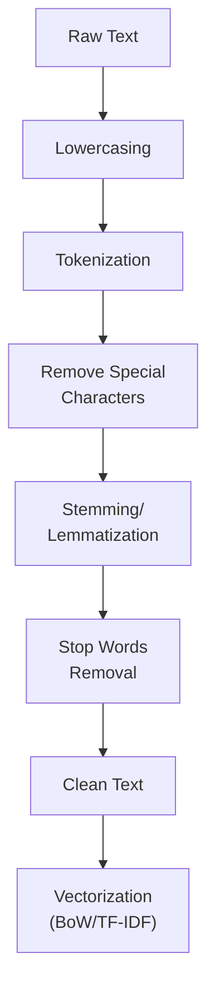

# Chapter 1: NLP Fundamentals and Text Preprocessing

## 🎯 Learning Objectives
- Understand basic NLP terminologies
- Learn text preprocessing techniques
- Master tokenization, stemming, and lemmatization
- Understand stop words removal
- Know when to use each preprocessing technique

## 📚 Key Concepts

### Basic NLP Terminologies

#### 1. Corpus

**Definition**: Collection of all documents (entire dataset)

**Analogy**: Paragraph combining many sentences

**Example:**
```
Document 1: "The food is good"
Document 2: "The food is bad"
Document 3: "Pizza is amazing"
Document 4: "Burger is bad"

Corpus = D1 + D2 + D3 + D4 (all combined)
```

**Key Point**: Corpus = Entire text dataset

#### 2. Documents

**Definition**: Individual sentences or data points

**Analogy**: Sentence in a paragraph

**Example:**
- Document 1: "The food is good" (1 document)
- Document 2: "The food is bad" (1 document)
- Each row in dataset = 1 document

**Key Point**: Document = Single text sample

#### 3. Vocabulary

**Definition**: Set of all unique words in the corpus

**Analogy**: Dictionary with unique words only

**Example:**
```
Corpus:
- "The food is good"
- "The food is bad"
- "Pizza is amazing"

Vocabulary: {the, food, is, good, bad, pizza, amazing}
Total unique words: 7
```

**Key Point**: Vocabulary = Total unique words count

#### 4. Words

**Definition**: Individual tokens from documents

**Example:**
- "The food is good" → Words: ["The", "food", "is", "good"]
- Each word is a separate entity

### Text Preprocessing Pipeline



### 1. Lowercasing

**Purpose**: Convert all text to lowercase

**Why?**
- "Food" and "food" should be treated as same word
- Reduces vocabulary size
- Prevents duplicates

**Example:**
```
Before: "The Food Is GOOD"
After:  "the food is good"
```

**Implementation**: Simple `.lower()` operation

### 2. Tokenization

**Definition**: Breaking text into smaller units (tokens)

#### Types of Tokenization

**A. Sentence Tokenization:**
- Split paragraph into sentences

**Example:**
```
Input: "Hello world. How are you? I am fine."
Output: ["Hello world.", "How are you?", "I am fine."]
```

**B. Word Tokenization:**
- Split sentence into words

**Example:**
```
Input: "The food is good"
Output: ["The", "food", "is", "good"]
```

**Library**: NLTK `sent_tokenize()`, `word_tokenize()`

### 3. Removing Special Characters

**Purpose**: Remove punctuation, numbers, special symbols

**Why?**
- Focus on meaningful words
- Reduce noise
- Clean dataset

**Example:**
```
Before: "Hello! How are you? I'm fine :)"
After:  "Hello How are you I m fine"
```

**Method**: Regular expressions (regex)
- Keep only: a-z, A-Z
- Remove: !, ?, @, #, numbers, etc.

### 4. Stemming

**Definition**: Reduce words to their root/base form by removing suffixes

**How It Works**: Crude chopping of word endings

**Algorithm**: Porter Stemmer (most common)

**Examples:**

| Word | Stem |
|------|------|
| running | run |
| runs | run |
| ran | ran |
| thinking | think |
| thought | thought |
| history | histori |
| historical | histor |

**Advantages:**
- ✓ Fast
- ✓ Simple
- ✓ Reduces vocabulary size

**Disadvantages:**
- ✗ May not produce valid words ("histori")
- ✗ Over-stemming (too aggressive)
- ✗ Under-stemming (too conservative)

**Example:**
```
Input: "I am running and thinking about history"
After Stemming: "I am run and think about histori"
```

### 5. Lemmatization

**Definition**: Reduce words to their dictionary base form (lemma)

**How It Works**: Uses vocabulary and morphological analysis

**Algorithm**: WordNet Lemmatizer

**Examples:**

| Word | Lemma |
|------|-------|
| running | running (without context) / run (with POS) |
| runs | run |
| ran | run |
| better | good |
| am/is/are | be |
| went | go |
| history | history |

**Advantages:**
- ✓ Produces valid dictionary words
- ✓ More accurate than stemming
- ✓ Preserves meaning better

**Disadvantages:**
- ✗ Slower than stemming
- ✗ Requires POS (Part of Speech) tags for best results

**Example:**
```
Input: "I am running and thinking about history"
After Lemmatization: "I be running and thinking about history"
```

### Stemming vs Lemmatization

| Aspect | Stemming | Lemmatization |
|--------|----------|---------------|
| **Speed** | Fast | Slower |
| **Output** | May not be valid word | Always valid word |
| **Accuracy** | Less accurate | More accurate |
| **Method** | Crude chopping | Dictionary lookup |
| **Example** | "caring" → "car" | "caring" → "care" |
| **Use When** | Speed needed | Accuracy needed |

**When to Use:**
- **Stemming**: Search engines, large datasets, speed critical
- **Lemmatization**: Sentiment analysis, chatbots, meaning matters

### 6. Stop Words Removal

**Definition**: Remove common words that don't add much meaning

**Stop Words Examples:**
```
the, is, am, are, a, an, and, or, but, if, in, on, at,
to, for, of, with, from, this, that, these, those, ...
```

**Why Remove?**
- Reduce vocabulary size
- Remove noise
- Focus on meaningful words
- Improve model performance

**Example:**
```
Before: "The food is very good and tasty"
After:  "food very good tasty"
```

**When NOT to Remove:**
- Chatbots (need context: "What is AI?")
- Question-answering systems
- Language translation

**Library**: NLTK has built-in English stop words list

## Vectorization Techniques

### Why Vectorization?

**Problem**: Machine learning models need numerical input

**Solution**: Convert text (words) to numbers (vectors)

### 1. One-Hot Encoding

**Concept**: Binary vector for each word

**Example:**

**Sentence**: "cat eat food"

**Vocabulary**: {cat, eat, food}

**One-Hot Vectors:**
```
cat  → [1, 0, 0]
eat  → [0, 1, 0]
food → [0, 0, 1]
```

**Document Representation:**
```
"cat" → [1, 0, 0]
"eat" → [0, 1, 0]
"food" → [0, 0, 1]
```

**Advantages:**
- ✓ Simple to understand
- ✓ Easy to implement
- ✓ Intuitive

**Disadvantages:**
- ✗ **Sparse Matrix**: Mostly zeros, memory inefficient
- ✗ **Out of Vocabulary (OOV)**: Can't handle new words in test data
- ✗ **No Semantic Meaning**: No relationship captured between words
- ✗ **Variable Size**: Different sentences have different vector sizes

**Example Problem:**
```
Training: "cat eat food" → Can create vectors
Test: "dog eat food" → Can't create vector for "dog" (OOV!)
```

### 2. Bag of Words (BoW)

**Concept**: Count frequency of each word in document

#### Step-by-Step Process

**Step 1: Collect all documents**
```
D1: "He is a good boy"
D2: "She is a good girl"
D3: "Boys and girls are good"
```

**Step 2: Apply preprocessing**
```
After stop words removal:
D1: "good boy"
D2: "good girl"
D3: "boys girls good"
```

**Step 3: Create vocabulary**
```
Vocabulary: {good, boy, girl, boys, girls}
Count: 5 unique words
```

**Step 4: Create feature vectors based on frequency**

| Document | good | boy | girl | boys | girls |
|----------|------|-----|------|------|-------|
| D1 | 1 | 1 | 0 | 0 | 0 |
| D2 | 1 | 0 | 1 | 0 | 0 |
| D3 | 1 | 0 | 0 | 1 | 1 |

**Formula for each cell:**
- Count how many times word appears in document
- If word appears once: 1
- If word appears twice: 2
- If word doesn't appear: 0

**Binary Bag of Words:**
- Instead of counts, use binary (0 or 1)
- If word present: 1
- If word absent: 0

**Advantages:**
- ✓ Simple and intuitive
- ✓ Fixed vector size (based on vocabulary)
- ✓ Easy to implement

**Disadvantages:**
- ✗ **Sparse Matrix**: Still mostly zeros
- ✗ **No Word Order**: "dog bites man" = "man bites dog"
- ✗ **No Semantic Meaning**: No relationship between similar words
- ✗ **OOV Problem**: New words in test data can't be handled
- ✗ **High Dimensionality**: Large vocabulary = large vectors

### 3. N-grams

**Purpose**: Capture word order and context

**Definition**: Sequence of N consecutive words

#### Types of N-grams

**Unigram (N=1):** Single words
```
"I am not feeling well"
Unigrams: ["I", "am", "not", "feeling", "well"]
```

**Bigram (N=2):** Two consecutive words
```
"I am not feeling well"
Bigrams: ["I am", "am not", "not feeling", "feeling well"]
Count: 4 bigrams
```

**Trigram (N=3):** Three consecutive words
```
"I am not feeling well"
Trigrams: ["I am not", "am not feeling", "not feeling well"]
Count: 3 trigrams
```

**Formula:**
For sentence with M words:
- Number of N-grams = M - N + 1

**Example:**
```
Sentence: "Krish eats food" (M=3)

Unigrams (N=1): 3 - 1 + 1 = 3
→ ["Krish", "eats", "food"]

Bigrams (N=2): 3 - 2 + 1 = 2
→ ["Krish eats", "eats food"]

Trigrams (N=3): 3 - 3 + 1 = 1
→ ["Krish eats food"]
```

#### N-grams in Bag of Words

**Example:**

**Sentence**: "good boy"

**Unigrams + Bigrams:**

Features: ["good", "boy", "good boy"]

**Document Vectors:**

| Document | good | boy | good boy |
|----------|------|-----|----------|
| "good boy" | 1 | 1 | 1 |
| "good girl" | 1 | 0 | 0 |

**Advantages of N-grams:**
- ✓ Captures word order partially
- ✓ Preserves some context
- ✓ Better semantic meaning

**Disadvantages:**
- ✗ **Increases dimensionality**: More features
- ✗ **More sparse**: Even more zeros
- ✗ **Computational cost**: Higher memory and time

**When to Use:**
- Sentiment analysis (negation: "not good")
- Named entity recognition
- Text classification

## ❓ Interview Questions & Answers

**Q1: What is the difference between corpus and document?**

- **Corpus**: Entire dataset (collection of all documents/sentences)
- **Document**: Single text sample (one sentence/data point)
- **Example**: In a dataset with 1000 reviews, corpus = all 1000 reviews, each review = 1 document

**Q2: What is vocabulary in NLP?**

The set of all unique words in the corpus. If corpus has 1 million words but only 10,000 unique words, vocabulary size = 10,000.

**Q3: What is the difference between stemming and lemmatization?**

- **Stemming**: Crude chopping of suffixes, may produce invalid words ("history" → "histori")
- **Lemmatization**: Dictionary-based, always produces valid words ("history" → "history")
- **Stemming** is faster, **Lemmatization** is more accurate

**Q4: Why do we remove stop words?**

- Reduce vocabulary size
- Remove noise (common words add little meaning)
- Improve model performance
- Save computational resources

**Q5: What is the Out of Vocabulary (OOV) problem?**

When test data contains words not seen in training data, model can't create vectors for them. Example: Training has "cat", test has "dog" → Can't vectorize "dog".

**Q6: What are the disadvantages of Bag of Words?**

1. Sparse matrix (memory inefficient)
2. No word order ("dog bites man" = "man bites dog")
3. No semantic meaning (can't capture word relationships)
4. OOV problem
5. High dimensionality

**Q7: What is the difference between Bag of Words and Binary Bag of Words?**

- **BoW**: Counts word frequency (0, 1, 2, 3, ...)
- **Binary BoW**: Just presence/absence (0 or 1 only)

**Q8: What are N-grams and why are they useful?**

N-grams are sequences of N consecutive words. They capture word order and context better than individual words. Example: "not good" (bigram) vs separate "not" and "good" (unigrams).

**Q9: How many bigrams can be created from "I am feeling well"?**

Formula: M - N + 1 = 4 - 2 + 1 = 3 bigrams
→ ["I am", "am feeling", "feeling well"]

**Q10: When should you use stemming vs lemmatization?**

- **Stemming**: When speed is critical, large datasets, search engines
- **Lemmatization**: When accuracy matters, sentiment analysis, chatbots

**Q11: Why is One-Hot Encoding not used for NLP?**

- Creates extremely sparse matrices
- Can't handle OOV words
- Variable vector sizes for different sentences
- No semantic meaning captured

**Q12: What is tokenization?**

Breaking text into smaller units (tokens):
- **Sentence tokenization**: Paragraph → Sentences
- **Word tokenization**: Sentence → Words

## 💡 Key Takeaways

- **Corpus** = Entire dataset, **Document** = Single sample
- **Vocabulary** = Unique words count
- **Preprocessing Pipeline**: Lowercase → Tokenize → Remove special chars → Stem/Lemmatize → Remove stop words
- **Stemming** = Fast but crude, **Lemmatization** = Slow but accurate
- **Stop Words** = Common words to remove (the, is, am, ...)
- **One-Hot** = Binary vectors (too sparse for NLP)
- **Bag of Words** = Word frequency vectors (simple but loses word order)
- **N-grams** = Consecutive word sequences (captures context)
- **OOV** = Out of Vocabulary problem (new words in test data)

## ⚠️ Common Mistakes

**Mistake 1**: "Stemming and Lemmatization are the same"
- **Reality**: Stemming is crude chopping, Lemmatization uses dictionary

**Mistake 2**: "Always remove stop words"
- **Reality**: Keep them for chatbots, Q&A systems, translation

**Mistake 3**: "Bag of Words captures word order"
- **Reality**: BoW loses all word order ("dog bites man" = "man bites dog")

**Mistake 4**: "One-Hot Encoding is good for NLP"
- **Reality**: Too sparse, OOV problem, variable sizes - not practical

**Mistake 5**: "More N-grams always better"
- **Reality**: Higher N increases sparsity and dimensionality exponentially

**Mistake 6**: "Lowercase after tokenization"
- **Reality**: Lowercase BEFORE or DURING preprocessing for consistency

## 📝 Quick Revision Points

### Terminologies
- **Corpus**: All documents combined
- **Document**: Single text sample
- **Vocabulary**: Unique words count
- **Words**: Individual tokens

### Preprocessing Steps
1. Lowercase
2. Tokenization (sentence/word)
3. Remove special characters (regex)
4. Stemming/Lemmatization
5. Stop words removal

### Stemming vs Lemmatization
| Aspect | Stemming | Lemmatization |
|--------|----------|---------------|
| Speed | Fast | Slow |
| Output | May be invalid | Always valid |
| Method | Chopping | Dictionary |
| Example | "caring" → "car" | "caring" → "care" |

### Vectorization

**One-Hot:**
- Binary vectors
- Too sparse for NLP
- OOV problem

**Bag of Words:**
- Word frequency
- Fixed vector size
- No word order
- Formula: Count(word in document)

**N-grams:**
- N consecutive words
- Bigram: N=2
- Trigram: N=3
- Count: M - N + 1

### Remember
- **Always preprocess**: Clean → Tokenize → Stem/Lemmatize → Remove stop words
- **BoW loses order**: Use N-grams to capture some context
- **OOV problem**: Major issue for all count-based methods
- **Sparse matrices**: Memory inefficient (mostly zeros)
- **N-grams**: Trade-off between context and dimensionality
