# Chapter 3: Word Embeddings and Word2Vec

## 🎯 Learning Objectives
- Understand word embeddings and feature representation
- Learn limitations of count-based methods (BoW, TF-IDF)
- Master Word2Vec: CBOW and Skip-gram architectures
- Understand training process with neural networks
- Learn cosine similarity for semantic meaning
- Know when to use pre-trained vs custom models

## 📚 Key Concepts

### What are Word Embeddings?

**Definition**: Technique to convert words into dense numerical vectors

**Word Embedding Techniques:**


**Categories:**
1. **Count/Frequency Based**: BoW, TF-IDF, One-Hot
2. **Deep Learning Models**: Word2Vec (CBOW, Skip-gram), GloVe, FastText

### Problems with Count-Based Methods

#### Issues with BoW and TF-IDF

**Problem 1: Sparse Matrix**
- Mostly zeros
- High dimensionality
- Memory inefficient
- Slow computation

**Example:**
```
Vocabulary size: 10,000 words
Vector size: 10,000 dimensions
Mostly zeros → Sparse!
```

**Problem 2: No Semantic Meaning**

```
Sentence 1: "The food is good"
Sentence 2: "The food is not good"

After BoW/TF-IDF:
Both vectors very similar (only 1 value different)
But meanings are OPPOSITE!
```

**Problem 3: Out of Vocabulary (OOV)**
- Test data has new words
- Cannot create vectors for unseen words
- Model fails

**Problem 4: Equal Importance**
- All words get similar weights
- Cannot distinguish important vs common words

### Word Embeddings Solution

**Word2Vec Advantages:**

| Feature | Count-Based (BoW/TF-IDF) | Word2Vec |
|---------|--------------------------|----------|
| **Dimensions** | High (vocabulary size) | **Limited (100-300)** |
| **Sparsity** | High (mostly zeros) | **Low (dense vectors)** |
| **Semantic Meaning** | ✗ Not captured | **✓ Captured** |
| **Similar Words** | Different vectors | **Similar vectors** |
| **Memory** | Inefficient | **Efficient** |

**Key Benefits:**
1. **Limited Dimensions**: 100-300 dimensions (not 10,000!)
2. **Reduced Sparsity**: Dense vectors (no zeros everywhere)
3. **Semantic Meaning**: Similar words → Similar vectors

### Feature Representation in Word2Vec

**Concept**: Each word represented by features

**Example Vocabulary:**

| Word | Gender | Royal | Age | Food |
|------|--------|-------|-----|------|
| boy | -1.0 | 0.01 | 0.03 | 0.0 |
| girl | 1.0 | 0.02 | 0.02 | 0.0 |
| king | -0.93 | 0.95 | 0.7 | 0.0 |
| queen | 0.93 | 0.96 | 0.6 | 0.0 |
| apple | 0.0 | 0.0 | 0.95 | 0.7 |
| mango | 0.1 | 0.0 | 0.96 | 0.75 |

**Observations:**
- **boy & girl**: Opposite gender features (-1 vs 1)
- **king & queen**: Similar royal features (0.95 vs 0.96), similar vectors!
- **apple & mango**: Similar food features (0.7 vs 0.75), similar age (0.95 vs 0.96)

**Key Point**: Similar words have similar feature values → Semantic meaning captured!

### Famous Word2Vec Example

**King - Man + Woman = Queen**

**Vectors (2D example):**
```
king  = [0.96, 0.95]
man   = [0.95, 0.98]
woman = [0.94, -0.96]
queen = [0.93, 0.93]
```

**Calculation:**
```
king - man + woman
= [0.96, 0.95] - [0.95, 0.98] + [0.94, -0.96]
= [0.95, 0.93] (approximately)
≈ queen vector!
```

**How to find closest word?**
- Use **Cosine Similarity**
- Find word with closest vector to result

### Cosine Similarity

**Definition**: Measure of similarity between two vectors

**Formula:**

$$\text{Cosine Similarity} = \cos(\theta) = \frac{A \cdot B}{||A|| \times ||B||}$$

Where $\theta$ is angle between vectors A and B

**Distance:**

$$\text{Distance} = 1 - \cos(\theta)$$

#### Understanding Cosine Similarity

```mermaid
graph TB
    A["Angle θ = 0°"] --> B["cos(0°) = 1<br/>Identical vectors"]
    C["Angle θ = 45°"] --> D["cos(45°) = 0.707<br/>Similar"]
    E["Angle θ = 90°"] --> F["cos(90°) = 0<br/>Orthogonal/Unrelated"]
    G["Angle θ = 180°"] --> H["cos(180°) = -1<br/>Opposite"]
```



**Examples:**

| Angle | cos(θ) | Distance (1-cos) | Interpretation |
|-------|--------|------------------|----------------|
| 0° | 1.0 | 0.0 | **Identical** |
| 45° | 0.707 | 0.293 | **Similar** |
| 90° | 0.0 | 1.0 | **Unrelated** |
| 180° | -1.0 | 2.0 | **Opposite** |

**Use Case:**
- Find similar words: cosine similarity → 1 (similar)
- Find unrelated words: cosine similarity → 0 (unrelated)

## Word2Vec: CBOW (Continuous Bag of Words)

### Training Data Creation

**Example Sentence:**
```
"Krish channel is related to data science"
```

**Step 1: Choose Window Size**

Let window_size = 5

**Step 2: Create Training Data**


**Sliding Window:**

| Context Words (Input) | Target (Output) |
|-----------------------|----------------|
| Krish, channel, related, to | **is** |
| channel, is, to, data | **related** |
| is, related, data, science | **to** |

**Pattern:**
- Take 5 consecutive words
- Center word = **Target** (Output)
- Left 2 + Right 2 words = **Context** (Input)

**Formula for number of context words:**
- Window size = 5
- Center word = 1 (target)
- Context words = 5 - 1 = 4 (2 left + 2 right)

### CBOW Architecture

**Network Structure:**


#### Detailed Architecture

**Given:**
- Vocabulary size = 7 words
- Window size = 5
- Context words = 4 (input)
- Target = 1 word (output)

**Layers:**

1. **Input Layer:**
   - 4 words × 7 dimensions (one-hot encoded)
   - Each word: [1,0,0,0,0,0,0] format
   - Total: 4 groups of 7 neurons

2. **Hidden Layer:**
   - Number of neurons = Window size = 5
   - Weights: 7 × 5 matrix (from each word)

3. **Output Layer:**
   - Number of neurons = Vocabulary size = 7
   - Softmax activation
   - Weights: 5 × 7 matrix

**Weight Matrices:**
- Input → Hidden: 7 × 5 (for each word, total 4 words)
- Hidden → Output: 5 × 7

#### Training Process

**Step 1: Forward Propagation**
```
Context words (one-hot) → Hidden Layer → Softmax → Predicted word
```

**Step 2: Calculate Loss**
$$\text{Loss} = \text{CrossEntropy}(y_{\text{true}}, y_{\text{pred}})$$

**Step 3: Backward Propagation**
- Update all weights using gradient descent
- Minimize loss

**Step 4: Repeat**
- Multiple epochs
- Until loss converges

#### Extracting Word Vectors

**Key Point**: Word vectors come from **Hidden Layer weights**

**Example:**
- Word "Krish" is at position 1 in vocabulary
- Window size = 5
- "Krish" connects to 5 hidden neurons
- **Vector for "Krish" = 5 weights connecting to hidden layer**

**If window size = 300:**
- Each word → 300-dimensional vector
- Same as Google's pre-trained Word2Vec!

### CBOW Summary

**Input**: Context words (surrounding words)
**Output**: Target word (center word)
**Goal**: Predict center word from context

**Formula:**
$$P(w_t | w_{t-2}, w_{t-1}, w_{t+1}, w_{t+2})$$

## Word2Vec: Skip-gram

### Key Difference from CBOW

**CBOW**: Context → Target
**Skip-gram**: **Target → Context** (reversed!)

### Training Data Creation

**Same Sentence:**
```
"Krish channel is related to data science"
```

**Window size = 5**

**Skip-gram Training Data:**

| Input (Target) | Output (Context) |
|----------------|------------------|
| **is** | Krish, channel, related, to |
| **related** | channel, is, to, data |
| **to** | is, related, data, science |

**Difference**: Input and Output swapped!

### Skip-gram Architecture

**Reverse of CBOW:**


**Layers:**

1. **Input Layer:**
   - 1 word (center word)
   - 7 dimensions (one-hot encoded)

2. **Hidden Layer:**
   - Window size neurons (e.g., 5)
   - Weights: 7 × 5 matrix

3. **Output Layer:**
   - Multiple context words
   - Each word: 7 dimensions
   - Total: 4 words × 7 dimensions

### CBOW vs Skip-gram

| Aspect | CBOW | Skip-gram |
|--------|------|-----------|
| **Input** | Context words (4 words) | Target word (1 word) |
| **Output** | Target word (1 word) | Context words (4 words) |
| **Prediction** | Center from context | Context from center |
| **Speed** | Faster | Slower |
| **Small Dataset** | Better | Less effective |
| **Large Dataset** | Good | **Better** |
| **Rare Words** | Less accurate | **More accurate** |

**When to Use:**
- **CBOW**: Small datasets, frequent words, faster training
- **Skip-gram**: Large datasets, rare words, better accuracy

## Pre-trained Word2Vec Models

### Google News Word2Vec

**Specifications:**
- **Training Data**: 3 billion words (Google News articles)
- **Vocabulary**: 3 million words
- **Dimensions**: 300
- **Model Size**: ~1.6 GB

**Usage:**
```python
from gensim.models import KeyedVectors

# Load pre-trained model
model = KeyedVectors.load_word2vec_format('GoogleNews-vectors-negative300.bin', binary=True)

# Get vector for a word
vector = model['king']  # 300-dimensional vector

# Find similar words
similar = model.most_similar('king')
# Output: [('queen', 0.85), ('monarch', 0.82), ...]

# Word analogy
result = model.most_similar(positive=['king', 'woman'], negative=['man'])
# Output: queen (with high similarity)
```

### Applications

**1. Find Similar Words:**
```
Input: "man"
Output: human (0.76), boy (0.68), woman (0.65), ...
```

**2. Word Analogies:**
```
king - man + woman = queen
paris - france + germany = berlin
```

**3. Cosine Similarity:**
```
similarity("king", "queen") = 0.85 (high)
similarity("king", "apple") = 0.02 (low)
```

## ❓ Interview Questions & Answers

**Q1: What are word embeddings?**

Techniques to convert words into dense numerical vectors of limited dimensions (100-300) that capture semantic meaning. Unlike count-based methods (BoW/TF-IDF), embeddings are dense and semantically meaningful.

**Q2: What problems do word embeddings solve?**

1. **Sparse Matrix**: Dense vectors (no zeros everywhere)
2. **High Dimensions**: Limited to 100-300 (not vocabulary size)
3. **No Semantic Meaning**: Similar words → Similar vectors
4. **Memory Efficiency**: Much smaller vector representations

**Q3: What is the difference between CBOW and Skip-gram?**

- **CBOW**: Input = Context words, Output = Target word (predict center from context)
- **Skip-gram**: Input = Target word, Output = Context words (predict context from center)
- **CBOW** faster, **Skip-gram** better for large datasets and rare words

**Q4: How are word vectors created in Word2Vec?**

Vectors come from **hidden layer weights** after training:
- Each word connects to hidden layer neurons
- Window size = vector dimensions
- If window size = 300 → 300-dimensional vectors

**Q5: What is window size in Word2Vec?**

Number of words in sliding window for creating training data:
- Window size = 5 → 1 target + 4 context (2 left + 2 right)
- Larger window → More context → Better semantic meaning
- Typically: 5-10

**Q6: What is cosine similarity and why is it used?**

Measure of angle between two vectors:
$$\cos(\theta) = \frac{A \cdot B}{||A|| \times ||B||}$$

**Used for**: Finding similar words
- cos(θ) = 1 → Identical
- cos(θ) = 0 → Unrelated
- cos(θ) = -1 → Opposite

**Q7: Explain "king - man + woman = queen"**

Vector arithmetic captures semantic relationships:
1. king vector - man vector = "royalty without gender"
2. Add woman vector = "female royalty"
3. Result ≈ queen vector (using cosine similarity)

**Q8: When to use CBOW vs Skip-gram?**

**Use CBOW:**
- Small datasets
- Frequent words
- Need faster training

**Use Skip-gram:**
- Large datasets (Google-scale)
- Rare/infrequent words
- Need higher accuracy

**Q9: What is the architecture of CBOW?**

**Input Layer**: Context words (4 words × vocabulary size, one-hot)
**Hidden Layer**: Window size neurons (e.g., 5-300)
**Output Layer**: Target word (vocabulary size, softmax)

**Weights from input to hidden layer = Word vectors**

**Q10: How do pre-trained models help?**

Google's Word2Vec trained on 3 billion words:
- Ready-to-use 300-dimensional vectors
- Captures rich semantic meaning
- No need to train from scratch
- Better than custom models on small datasets

**Q11: What is feature representation in Word2Vec?**

Each word represented by features (gender, royal, age, etc.):
- Similar words have similar feature values
- Model learns these features automatically during training
- Typically 100-300 features (dimensions)

**Q12: How to handle OOV (Out of Vocabulary) in Word2Vec?**

Word2Vec still has OOV problem:
- Pre-trained model: Fixed vocabulary
- New words → No vector available
- **Solutions**: FastText (subword embeddings), train custom model with your vocabulary

## 💡 Key Takeaways

- **Word Embeddings**: Convert words → Dense vectors (100-300 dim)
- **Solves**: Sparsity, high dimensions, no semantic meaning
- **CBOW**: Context → Target (faster, good for small data)
- **Skip-gram**: Target → Context (better for large data, rare words)
- **Window Size**: Determines vector dimensions (typically 5-10 for training, 100-300 for output)
- **Training**: Neural network with hidden layer weights = word vectors
- **Cosine Similarity**: Find similar words (cos(θ) close to 1)
- **Pre-trained**: Google News 300D (3B words, 3M vocabulary)
- **Famous Example**: king - man + woman = queen

## ⚠️ Common Mistakes

**Mistake 1**: "Window size = Vector dimensions"
- **Reality**: Window size affects training data creation. Vector dimensions = Hidden layer size (can be 300 even with window size 5)

**Mistake 2**: "Word2Vec solves OOV problem"
- **Reality**: Word2Vec also has OOV issue (FastText solves this)

**Mistake 3**: "CBOW and Skip-gram are completely different"
- **Reality**: Same concept, just reversed (input/output swapped)

**Mistake 4**: "Always use pre-trained models"
- **Reality**: Domain-specific vocabulary needs custom training

**Mistake 5**: "Vectors come from output layer"
- **Reality**: Word vectors = **Hidden layer weights** (input → hidden)

**Mistake 6**: "Larger window size always better"
- **Reality**: Too large → Slower, may not capture local context well. Typical: 5-10

## 📝 Quick Revision Points

### Problems Solved by Word Embeddings
1. **Sparse Matrix** → Dense vectors
2. **High Dimensions** → Limited (100-300)
3. **No Semantic Meaning** → Similar words have similar vectors
4. **Memory** → Efficient representation

### CBOW Architecture
```
Input: Context words (4 words × vocab size)
Hidden: Window size neurons
Output: Target word (vocab size, softmax)

Word Vector = Hidden layer weights
```

### Skip-gram Architecture
```
Input: Target word (1 word × vocab size)
Hidden: Window size neurons
Output: Context words (4 words × vocab size)

Same as CBOW but reversed
```

### Training Data Creation

**Sentence:** "Krish channel is related to data science"
**Window size:** 5

| Input (CBOW) | Output (CBOW) | Input (Skip-gram) | Output (Skip-gram) |
|--------------|---------------|-------------------|-------------------|
| Krish, channel, related, to | **is** | **is** | Krish, channel, related, to |

### Cosine Similarity

$$\cos(\theta) = \frac{A \cdot B}{||A|| \times ||B||}$$

- cos(θ) = 1 → Identical
- cos(θ) = 0.7 → Similar
- cos(θ) = 0 → Unrelated
- cos(θ) = -1 → Opposite

### Word Analogy Example

$$\text{king} - \text{man} + \text{woman} = \text{queen}$$

Find word with highest cosine similarity to result vector

### CBOW vs Skip-gram

| Feature | CBOW | Skip-gram |
|---------|------|-----------|
| Input | Context (4 words) | Target (1 word) |
| Output | Target (1 word) | Context (4 words) |
| Speed | Faster | Slower |
| Best For | Small data | Large data, rare words |

### Pre-trained Model (Google News)
- **Dimensions**: 300
- **Vocabulary**: 3 million words
- **Training**: 3 billion words
- **Size**: ~1.6 GB

### Remember
- **Limited Dimensions**: 100-300 (not vocabulary size!)
- **Dense Vectors**: No sparsity
- **Semantic Meaning**: Similar words → Similar vectors
- **Training**: Neural network (Fully connected / ANN)
- **Word Vectors**: From **hidden layer weights**
- **Window Size**: For training data (not final vector size)
- **Final Vector Size**: Hidden layer neurons count
