# Chapter 12: GloVe (Global Vectors for Word Representation)

## 🎯 Learning Objectives

By the end of this chapter, you will:
1. Understand the motivation behind GloVe and how it differs from Word2Vec
2. Master the GloVe objective function and its mathematical foundation
3. Learn how to build and use co-occurrence matrices
4. Understand the weighting function and its role in training
5. Implement GloVe embeddings in practice
6. Compare GloVe with Word2Vec and know when to use each
7. Apply GloVe to real-world NLP tasks

---

## 📚 Key Concepts

### 1. Introduction to GloVe

**GloVe** (Global Vectors for Word Representation) is an unsupervised learning algorithm for obtaining vector representations of words. It was developed by Pennington, Socher, and Manning at Stanford in 2014.

**Key Insight**: GloVe combines the advantages of:
- **Global matrix factorization methods** (like LSA) that capture global statistics
- **Local context window methods** (like Word2Vec) that capture local word-word co-occurrence


**Philosophy**:
- Word2Vec uses **local** context windows (skipgram/CBOW)
- GloVe uses **global** co-occurrence statistics from the entire corpus
- GloVe explicitly models word-word co-occurrence probabilities

---

### 2. Co-occurrence Matrix

The foundation of GloVe is the **word-word co-occurrence matrix** $X$:
- $X_{ij}$ = number of times word $j$ occurs in the context of word $i$
- Context is defined by a window size (e.g., 5 words before and after)

**Example**:
```
Corpus: "I love NLP. I love deep learning. NLP is fun."
Window size = 2

Co-occurrence counts:
       I  love  NLP  deep  learning  is  fun
I      0    2    1    0      0       0    0
love   2    0    2    1      1       0    0
NLP    1    2    0    0      0       1    1
deep   0    1    0    0      1       0    0
learning 0  1    0    1      0       0    0
is     0    0    1    0      0       0    1
fun    0    0    1    0      0       1    0
```

**Building the Matrix**:
```python
import numpy as np
from collections import defaultdict

def build_cooccurrence_matrix(corpus, vocab, window_size=5):
    """Build word-word co-occurrence matrix"""
    vocab_size = len(vocab)
    word_to_id = {word: i for i, word in enumerate(vocab)}

    # Initialize co-occurrence matrix
    cooccur_matrix = np.zeros((vocab_size, vocab_size))

    for sentence in corpus:
        tokens = sentence.split()
        for i, word in enumerate(tokens):
            if word not in word_to_id:
                continue

            word_id = word_to_id[word]

            # Look at context window
            start = max(0, i - window_size)
            end = min(len(tokens), i + window_size + 1)

            for j in range(start, end):
                if i != j and tokens[j] in word_to_id:
                    context_word_id = word_to_id[tokens[j]]
                    # Weight by distance (optional)
                    distance = abs(i - j)
                    cooccur_matrix[word_id, context_word_id] += 1.0 / distance

    return cooccur_matrix

# Example usage
corpus = [
    "I love NLP",
    "I love deep learning",
    "NLP is fun"
]
vocab = set(" ".join(corpus).split())
X = build_cooccurrence_matrix(corpus, vocab, window_size=2)
```

---

### 3. GloVe Objective Function

**Key Observation**: The ratio of co-occurrence probabilities can encode meaning relationships.

Let:
- $P_{ij} = P(j|i) = \frac{X_{ij}}{X_i}$ where $X_i = \sum_k X_{ik}$
- $P_{ij}$ = probability that word $j$ appears in context of word $i$

**Example** (from the original GloVe paper):
```
Consider words: "ice", "steam", "solid", "gas", "water"

P(solid | ice) / P(solid | steam) = high (ice is solid, steam is not)
P(gas | ice) / P(gas | steam) = low (steam is gas, ice is not)
P(water | ice) / P(water | steam) ≈ 1 (both related to water)
```

**GloVe Goal**: Learn word vectors such that their dot product equals the logarithm of co-occurrence probability.

---

### 4. Mathematical Formulation

GloVe learns word vectors by minimizing this objective function:

$$
J = \sum_{i,j=1}^{V} f(X_{ij}) \left( w_i^T \tilde{w}_j + b_i + \tilde{b}_j - \log X_{ij} \right)^2
$$

Where:
- $V$ = vocabulary size
- $w_i$ = word vector for word $i$
- $\tilde{w}_j$ = context word vector for word $j$
- $b_i, \tilde{b}_j$ = bias terms
- $X_{ij}$ = co-occurrence count
- $f(X_{ij})$ = weighting function

**Weighting Function** $f(X_{ij})$:

$$
f(x) = \begin{cases}
(x / x_{max})^\alpha & \text{if } x < x_{max} \\
1 & \text{otherwise}
\end{cases}
$$

Typically: $x_{max} = 100$, $\alpha = 0.75$

```python
def weighting_function(x, x_max=100, alpha=0.75):
    """GloVe weighting function"""
    if x < x_max:
        return (x / x_max) ** alpha
    else:
        return 1.0
```

**Purpose of Weighting**:
- Prevent very rare co-occurrences from being overweighted
- Prevent very frequent co-occurrences from dominating
- Non-decreasing: more frequent pairs get more weight, but saturates

```mermaid
graph TD
    A["Co-occurrence Matrix X"] --> B["Apply weighting f(X_ij)"]
    B --> C["Optimize word vectors"]
    C --> D["w_i^T w_j + b_i + b_j ≈ log(X_ij)"]
    D --> E["Final Word Embeddings"]

    style A fill:#e1f5ff
    style B fill:#fff3cd
    style C fill:#d4edda
    style D fill:#ffe6e6
    style E fill:#e7f3ff
```



---

### 5. Training GloVe

**Algorithm**:

1. **Build co-occurrence matrix** $X$ from corpus
2. **Initialize** word vectors $w_i$ and $\tilde{w}_j$ randomly
3. **Optimize** using stochastic gradient descent:

For each non-zero entry $X_{ij}$:
$$
\text{diff} = w_i^T \tilde{w}_j + b_i + \tilde{b}_j - \log(X_{ij})
$$

$$
\text{weight} = f(X_{ij})
$$

**Gradients**:
$$
\frac{\partial J}{\partial w_i} = 2 \cdot \text{weight} \cdot \text{diff} \cdot \tilde{w}_j
$$

$$
\frac{\partial J}{\partial \tilde{w}_j} = 2 \cdot \text{weight} \cdot \text{diff} \cdot w_i
$$

$$
\frac{\partial J}{\partial b_i} = 2 \cdot \text{weight} \cdot \text{diff}
$$

$$
\frac{\partial J}{\partial \tilde{b}_j} = 2 \cdot \text{weight} \cdot \text{diff}
$$

**Update rules** (with learning rate $\eta$):
$$
w_i \leftarrow w_i - \eta \cdot \frac{\partial J}{\partial w_i}
$$

4. **Final embeddings**: Average $w_i$ and $\tilde{w}_i$ for each word $i$

**Implementation**:
```python
import numpy as np

class GloVe:
    def __init__(self, embedding_dim=100, x_max=100, alpha=0.75, learning_rate=0.05):
        self.embedding_dim = embedding_dim
        self.x_max = x_max
        self.alpha = alpha
        self.learning_rate = learning_rate

    def weighting_func(self, x):
        """Weighting function f(x)"""
        if x < self.x_max:
            return (x / self.x_max) ** self.alpha
        return 1.0

    def fit(self, cooccurrence_matrix, epochs=50):
        """Train GloVe embeddings"""
        vocab_size = cooccurrence_matrix.shape[0]

        # Initialize word vectors and biases
        self.W = np.random.randn(vocab_size, self.embedding_dim) * 0.01
        self.W_tilde = np.random.randn(vocab_size, self.embedding_dim) * 0.01
        self.b = np.random.randn(vocab_size) * 0.01
        self.b_tilde = np.random.randn(vocab_size) * 0.01

        # Get non-zero entries
        nonzero_indices = np.argwhere(cooccurrence_matrix > 0)

        for epoch in range(epochs):
            total_loss = 0.0

            # Shuffle indices
            np.random.shuffle(nonzero_indices)

            for i, j in nonzero_indices:
                x_ij = cooccurrence_matrix[i, j]

                # Compute prediction
                prediction = np.dot(self.W[i], self.W_tilde[j]) + self.b[i] + self.b_tilde[j]

                # Compute loss
                diff = prediction - np.log(x_ij)
                weight = self.weighting_func(x_ij)
                loss = weight * (diff ** 2)
                total_loss += loss

                # Compute gradients
                grad_factor = 2 * weight * diff

                grad_w_i = grad_factor * self.W_tilde[j]
                grad_w_tilde_j = grad_factor * self.W[i]
                grad_b_i = grad_factor
                grad_b_tilde_j = grad_factor

                # Update parameters
                self.W[i] -= self.learning_rate * grad_w_i
                self.W_tilde[j] -= self.learning_rate * grad_w_tilde_j
                self.b[i] -= self.learning_rate * grad_b_i
                self.b_tilde[j] -= self.learning_rate * grad_b_tilde_j

            if (epoch + 1) % 10 == 0:
                print(f"Epoch {epoch+1}/{epochs}, Loss: {total_loss:.4f}")

        # Final embeddings: average word and context vectors
        self.embeddings = (self.W + self.W_tilde) / 2

        return self.embeddings

# Usage
glove = GloVe(embedding_dim=100, epochs=50)
embeddings = glove.fit(X)
```

---

### 6. GloVe vs Word2Vec

| Aspect | Word2Vec | GloVe |
|--------|----------|-------|
| **Training objective** | Predict context from word (Skip-gram) or word from context (CBOW) | Minimize squared error between dot product and log co-occurrence |
| **Statistics used** | Local context windows | Global co-occurrence statistics |
| **Training method** | Online (stochastic, one window at a time) | Batch (uses pre-computed co-occurrence matrix) |
| **Complexity** | Scales with corpus size | Scales with vocabulary size² (co-occurrence matrix) |
| **Weighting** | All contexts weighted equally | Weighted by co-occurrence frequency |
| **Interpretability** | Implicit | Explicit (optimizes for log co-occurrence) |
| **Performance** | Generally similar | Generally similar |
| **Memory** | Lower (no matrix storage) | Higher (stores co-occurrence matrix) |

**When to use GloVe**:
- When you have a smaller vocabulary (matrix is manageable)
- When you want explicit control over co-occurrence statistics
- When you want faster training (matrix is pre-computed)

**When to use Word2Vec**:
- When you have a very large vocabulary
- When you have limited memory
- When you want online/streaming learning

---

### 7. Using Pre-trained GloVe Embeddings

Stanford provides pre-trained GloVe embeddings trained on various corpora:
- Wikipedia + Gigaword (6B tokens)
- Common Crawl (42B, 840B tokens)
- Twitter (2B tweets, 27B tokens)

**Loading Pre-trained GloVe**:
```python
import numpy as np

def load_glove_embeddings(file_path):
    """Load pre-trained GloVe embeddings"""
    embeddings = {}

    with open(file_path, 'r', encoding='utf-8') as f:
        for line in f:
            values = line.split()
            word = values[0]
            vector = np.array(values[1:], dtype='float32')
            embeddings[word] = vector

    return embeddings

# Load 100-dimensional GloVe embeddings
glove_embeddings = load_glove_embeddings('glove.6B.100d.txt')

# Get embedding for a word
word_vec = glove_embeddings['king']
print(f"Embedding for 'king': {word_vec[:5]}...")  # First 5 dims
```

**Creating Embedding Matrix for Neural Networks**:
```python
def create_embedding_matrix(word_to_id, glove_embeddings, embedding_dim=100):
    """Create embedding matrix from GloVe for use in neural networks"""
    vocab_size = len(word_to_id)
    embedding_matrix = np.zeros((vocab_size, embedding_dim))

    for word, idx in word_to_id.items():
        if word in glove_embeddings:
            embedding_matrix[idx] = glove_embeddings[word]
        else:
            # Random initialization for OOV words
            embedding_matrix[idx] = np.random.randn(embedding_dim) * 0.01

    return embedding_matrix

# Usage in Keras/TensorFlow
from tensorflow.keras.layers import Embedding

embedding_matrix = create_embedding_matrix(word_to_id, glove_embeddings, 100)

embedding_layer = Embedding(
    input_dim=vocab_size,
    output_dim=100,
    weights=[embedding_matrix],
    trainable=False  # Freeze pre-trained embeddings
)
```

**Using GloVe with PyTorch**:
```python
import torch
import torch.nn as nn

class TextClassifier(nn.Module):
    def __init__(self, embedding_matrix, num_classes):
        super(TextClassifier, self).__init__()

        vocab_size, embedding_dim = embedding_matrix.shape

        # Create embedding layer from pre-trained GloVe
        self.embedding = nn.Embedding(vocab_size, embedding_dim)
        self.embedding.weight = nn.Parameter(torch.tensor(embedding_matrix, dtype=torch.float32))
        self.embedding.weight.requires_grad = False  # Freeze

        self.fc = nn.Linear(embedding_dim, num_classes)

    def forward(self, x):
        # x: (batch_size, seq_len)
        embedded = self.embedding(x)  # (batch_size, seq_len, embedding_dim)
        pooled = embedded.mean(dim=1)  # Average pooling
        output = self.fc(pooled)
        return output

# Create model
model = TextClassifier(embedding_matrix, num_classes=2)
```

---

### 8. Applications and Examples

**1. Word Similarity**:
```python
from scipy.spatial.distance import cosine

def cosine_similarity(v1, v2):
    """Compute cosine similarity between two vectors"""
    return 1 - cosine(v1, v2)

def most_similar(word, embeddings, top_k=5):
    """Find most similar words to given word"""
    if word not in embeddings:
        return []

    word_vec = embeddings[word]
    similarities = []

    for other_word, other_vec in embeddings.items():
        if other_word != word:
            sim = cosine_similarity(word_vec, other_vec)
            similarities.append((other_word, sim))

    # Sort by similarity (descending)
    similarities.sort(key=lambda x: x[1], reverse=True)

    return similarities[:top_k]

# Example
similar_words = most_similar('king', glove_embeddings, top_k=5)
print("Words most similar to 'king':")
for word, sim in similar_words:
    print(f"  {word}: {sim:.4f}")
```

**2. Word Analogies**:
```python
def analogy(word_a, word_b, word_c, embeddings, top_k=5):
    """
    Solve analogy: word_a is to word_b as word_c is to ?
    Example: king - man + woman ≈ queen
    """
    if word_a not in embeddings or word_b not in embeddings or word_c not in embeddings:
        return []

    # Compute target vector: vec(b) - vec(a) + vec(c)
    target_vec = embeddings[word_b] - embeddings[word_a] + embeddings[word_c]

    # Find most similar words
    similarities = []
    for word, vec in embeddings.items():
        if word not in [word_a, word_b, word_c]:
            sim = cosine_similarity(target_vec, vec)
            similarities.append((word, sim))

    similarities.sort(key=lambda x: x[1], reverse=True)
    return similarities[:top_k]

# Example: king - man + woman = ?
results = analogy('king', 'man', 'woman', glove_embeddings)
print("king - man + woman ≈")
for word, sim in results:
    print(f"  {word}: {sim:.4f}")
```

**3. Text Classification**:
```python
import torch
import torch.nn as nn
from torch.utils.data import Dataset, DataLoader

class TextDataset(Dataset):
    def __init__(self, texts, labels, word_to_id, max_len=100):
        self.texts = texts
        self.labels = labels
        self.word_to_id = word_to_id
        self.max_len = max_len

    def __len__(self):
        return len(self.texts)

    def __getitem__(self, idx):
        text = self.texts[idx]
        label = self.labels[idx]

        # Convert words to indices
        tokens = text.split()[:self.max_len]
        indices = [self.word_to_id.get(word, 0) for word in tokens]

        # Pad to max_len
        if len(indices) < self.max_len:
            indices += [0] * (self.max_len - len(indices))

        return torch.tensor(indices), torch.tensor(label)

# Training
train_dataset = TextDataset(train_texts, train_labels, word_to_id)
train_loader = DataLoader(train_dataset, batch_size=32, shuffle=True)

model = TextClassifier(embedding_matrix, num_classes=2)
criterion = nn.CrossEntropyLoss()
optimizer = torch.optim.Adam(model.parameters(), lr=0.001)

for epoch in range(10):
    for inputs, labels in train_loader:
        optimizer.zero_grad()
        outputs = model(inputs)
        loss = criterion(outputs, labels)
        loss.backward()
        optimizer.step()
```

---

## 🎤 Interview Questions and Answers

### Q1: What is the key difference between GloVe and Word2Vec?

**Answer**:

The fundamental difference lies in **what statistics they use** and **how they train**:

**Word2Vec**:
- Uses **local context windows**
- Trains on individual word-context pairs
- **Online learning**: processes one context window at a time
- Implicit matrix factorization (shown by Levy & Goldberg 2014)
- Objective: maximize probability of context given word (Skip-gram) or word given context (CBOW)

**GloVe**:
- Uses **global co-occurrence statistics**
- Pre-computes word-word co-occurrence matrix from entire corpus
- **Batch learning**: optimizes over all co-occurrence pairs
- Explicit optimization: word vectors' dot product should approximate log co-occurrence
- Objective: $J = \sum_{i,j} f(X_{ij})(w_i^T \tilde{w}_j + b_i + \tilde{b}_j - \log X_{ij})^2$

**Key insight**: GloVe explicitly models the ratios of co-occurrence probabilities, which capture semantic relationships:
$$
\frac{P(k|i)}{P(k|j)} \approx \exp(w_k^T(w_i - w_j))
$$

**Performance**: Empirically, both produce similar quality embeddings. Choice depends on:
- **GloVe**: Better when vocabulary is manageable, want faster training (pre-computed matrix)
- **Word2Vec**: Better for very large vocabularies, streaming data, lower memory

---

### Q2: Explain the GloVe objective function and why it uses a weighting function f(X_ij).

**Answer**:

**GloVe Objective**:
$$
J = \sum_{i,j=1}^{V} f(X_{ij}) \left( w_i^T \tilde{w}_j + b_i + \tilde{b}_j - \log X_{ij} \right)^2
$$

**Components**:
1. **$w_i^T \tilde{w}_j$**: Dot product of word and context vectors
2. **$b_i, \tilde{b}_j$**: Bias terms for each word
3. **$\log X_{ij}$**: Log of co-occurrence count (target)
4. **$f(X_{ij})$**: Weighting function

**Why Weighting Function?**

Without weighting, the objective would be:
$$
J = \sum_{i,j} (w_i^T \tilde{w}_j - \log X_{ij})^2
$$

**Problems**:
1. **Rare co-occurrences**: $X_{ij} = 0$ leads to $\log(0) = -\infty$ (undefined)
2. **Very frequent pairs**: Common words like "the", "a" would dominate the loss
3. **Noisy rare pairs**: Very rare co-occurrences are unreliable

**Solution - Weighting Function**:
$$
f(x) = \begin{cases}
(x / x_{max})^\alpha & \text{if } x < x_{max} \\
1 & \text{otherwise}
\end{cases}
$$

**Properties**:
- $f(0) = 0$: Zero co-occurrences contribute nothing (solves $\log(0)$ problem)
- Non-decreasing: More frequent pairs get more weight (they're more reliable)
- **Saturates** at $x_{max}$: Prevents very frequent pairs from dominating
- $\alpha = 0.75$: Sublinear scaling reduces impact of very frequent words

**Example**:
```
X_ij = 1   → f(X_ij) = 0.01^0.75 ≈ 0.03  (low weight, unreliable)
X_ij = 10  → f(X_ij) = 0.10^0.75 ≈ 0.18  (moderate weight)
X_ij = 100 → f(X_ij) = 1.00              (saturated)
X_ij = 1000 → f(X_ij) = 1.00             (saturated, not over-weighted)
```

This balances all word pairs appropriately during training.

---

### Q3: How do you build the co-occurrence matrix, and what are the memory challenges?

**Answer**:

**Building Co-occurrence Matrix**:

**Algorithm**:
```python
def build_cooccurrence_matrix(corpus, window_size=5):
    """
    1. Create vocabulary from corpus
    2. Initialize V×V matrix (V = vocabulary size)
    3. For each word in corpus:
       - Look at words in window around it
       - Increment co-occurrence counts
    4. Optionally weight by distance
    """
    vocab = build_vocab(corpus)
    V = len(vocab)
    word_to_id = {word: i for i, word in enumerate(vocab)}

    X = np.zeros((V, V))

    for sentence in corpus:
        tokens = sentence.split()
        for i, word in enumerate(tokens):
            word_id = word_to_id[word]

            # Context window
            start = max(0, i - window_size)
            end = min(len(tokens), i + window_size + 1)

            for j in range(start, end):
                if i != j:
                    context_id = word_to_id[tokens[j]]
                    distance = abs(i - j)
                    # Weight by distance (closer words matter more)
                    X[word_id, context_id] += 1.0 / distance

    return X
```

**Memory Challenges**:

**Problem**: For vocabulary size $V$, matrix is $V \times V$
- **V = 10,000**: 10K × 10K × 4 bytes (float32) = **400 MB**
- **V = 100,000**: 100K × 100K × 4 bytes = **40 GB** (huge!)
- **V = 1,000,000**: Would need **4 TB** of memory

**Solutions**:

**1. Sparse Matrix Representation**:
```python
from scipy.sparse import lil_matrix

# Use sparse matrix (stores only non-zero entries)
X = lil_matrix((V, V), dtype=np.float32)

# Most entries are 0 (most word pairs never co-occur)
# Memory: O(number of non-zero entries) instead of O(V²)
```

**2. Only Store Non-Zero Entries**:
```python
from collections import defaultdict

cooccurrences = defaultdict(lambda: defaultdict(int))

for i, word in enumerate(tokens):
    for j in context_window(i):
        cooccurrences[word][tokens[j]] += 1

# Memory: O(unique word pairs), much smaller than V²
```

**3. Vocabulary Pruning**:
- Remove very rare words (occur < min_count)
- Remove very common words (stopwords) if not needed
- Reduces $V$ significantly

**4. Streaming/Incremental Construction**:
- Build matrix in chunks
- Don't load entire corpus into memory at once

**Typical Approach**:
```python
# Use sparse matrix + vocabulary pruning
min_count = 5  # Remove words occurring < 5 times
max_vocab = 100000  # Limit vocabulary to 100K most frequent words
```

**GloVe Training Optimization**:
- During training, only iterate over **non-zero** entries
- Don't compute gradients for $X_{ij} = 0$ (they contribute 0 to loss anyway)

This makes GloVe practical even for large corpora.

---

### Q4: Why does GloVe use both word vectors (w_i) and context vectors (w̃_j)?

**Answer**:

GloVe maintains **two sets of vectors** for each word:
- $w_i$: Word vector (target word)
- $\tilde{w}_j$: Context vector (context word)

**Reasons**:

**1. Mathematical Symmetry**:
- Co-occurrence is symmetric: word $i$ occurring with word $j$ is same as word $j$ occurring with word $i$
- But we want: $w_i^T \tilde{w}_j \approx \log X_{ij}$
- If we used only one set: $w_i^T w_j \neq w_j^T w_i$ (order matters in role)
- Two vectors maintain the distinction between "target" and "context" roles

**2. Flexibility in Learning**:
- Different words have different behaviors as targets vs. contexts
- Example: Prepositions like "of" appear frequently in context but less as targets
- Two vectors allow model to learn these asymmetries

**3. More Parameters**:
- More parameters = more capacity to model complex relationships
- Helps avoid underfitting

**4. Final Embeddings**:
After training, we have two vectors per word. What to use?

**Options**:
```python
# Option 1: Use word vectors only
embeddings = W

# Option 2: Use context vectors only
embeddings = W_tilde

# Option 3: Average (most common, GloVe recommendation)
embeddings = (W + W_tilde) / 2

# Option 4: Concatenate
embeddings = np.concatenate([W, W_tilde], axis=1)  # Double dimension
```

**Empirically**, **averaging** (Option 3) works best:
- Combines information from both roles
- Symmetric representation
- No increase in dimensionality

**Comparison to Word2Vec**:
- Skip-gram also has word and context vectors
- CBOW also has word and context vectors
- Same principle: separate roles during training, combine for final embeddings

---

### Q5: What are the hyperparameters in GloVe and how do they affect performance?

**Answer**:

**Key Hyperparameters**:

**1. Vector Dimensionality** ($d$):
- **Values**: 50, 100, 200, 300
- **Impact**:
  - **Lower** (50-100): Faster training, less memory, may underfit
  - **Higher** (200-300): Better performance on complex tasks, slower, more memory
- **Recommendation**: 100-300 for most tasks

**2. Window Size**:
- **Values**: 5-15
- **Impact**:
  - **Smaller** (5): Captures syntactic relationships (nearby words)
  - **Larger** (10-15): Captures semantic/topical relationships
- **Recommendation**: 10 is good default

**3. x_max** (saturation threshold):
- **Default**: 100
- **Impact**: Co-occurrences > $x_{max}$ get weight 1.0 (saturated)
- **Larger** $x_{max}$: More influence from very frequent pairs
- **Smaller** $x_{max}$: More balanced weighting

**4. α (weighting exponent)**:
- **Default**: 0.75
- **Impact**: Controls how quickly weighting function grows
- **Formula**: $f(x) = (x/x_{max})^\alpha$ for $x < x_{max}$
- **Lower** α: More aggressive down-weighting of rare pairs
- **Higher** α: More linear weighting

**5. Learning Rate**:
- **Values**: 0.01 - 0.1
- **Impact**: Standard gradient descent trade-off
- **Recommendation**: 0.05 (default), with decay

**6. Number of Epochs**:
- **Values**: 15-100
- **Impact**: More epochs = better convergence, but diminishing returns
- **Recommendation**: 50-100 epochs

**7. Minimum Count** (min_count):
- **Values**: 5-100
- **Impact**: Remove words occurring < min_count times
- **Benefits**: Reduces vocabulary size, removes noise
- **Trade-off**: Lose rare words (may be important in domain-specific tasks)

**8. Context Distance Weighting**:
- **Option**: Weight by distance: $\text{weight} = 1 / \text{distance}$
- **Impact**: Closer words in context get higher co-occurrence counts
- **Recommendation**: Use it (captures word proximity importance)

**Example Configuration**:
```python
# General-purpose embeddings
config = {
    'vector_size': 300,
    'window_size': 10,
    'x_max': 100,
    'alpha': 0.75,
    'learning_rate': 0.05,
    'epochs': 50,
    'min_count': 5
}

# Domain-specific (smaller corpus)
config = {
    'vector_size': 100,
    'window_size': 5,
    'x_max': 50,
    'alpha': 0.75,
    'learning_rate': 0.05,
    'epochs': 100,
    'min_count': 2  # Keep more rare words
}
```

**Performance Impact**:
- **Vector size**: Most important for downstream task quality
- **Window size**: Affects type of relationships learned
- **x_max, α**: Fine-tuning; defaults usually work well
- **Epochs**: Ensure convergence (monitor loss)

---

### Q6: How does GloVe handle out-of-vocabulary (OOV) words?

**Answer**:

**Problem**: GloVe (like Word2Vec) trains on a fixed vocabulary. Words not in training vocabulary have no embeddings.

**During Training**:
```python
# Build vocabulary with minimum frequency threshold
vocab = [word for word, count in word_counts.items() if count >= min_count]

# Words with count < min_count are OOV
```

**Handling OOV at Inference**:

**1. Special Token** (Most Common):
```python
# Add <UNK> token to vocabulary during training
vocab = ['<UNK>', '<PAD>'] + actual_vocab

# Replace all rare words with <UNK> during training
def tokenize(text, vocab):
    tokens = text.split()
    return [token if token in vocab else '<UNK>' for token in tokens]

# At inference, OOV words map to <UNK>
embedding_unk = embeddings['<UNK>']
```

**2. Random Initialization**:
```python
def get_embedding(word, embeddings, embedding_dim=100):
    if word in embeddings:
        return embeddings[word]
    else:
        # Random vector for OOV
        return np.random.randn(embedding_dim) * 0.01
```

**3. Average of Character N-grams** (Inspired by FastText):
```python
def get_char_ngrams(word, n=3):
    """Get character n-grams"""
    word = f'<{word}>'  # Add boundaries
    ngrams = [word[i:i+n] for i in range(len(word)-n+1)]
    return ngrams

def oov_embedding(word, embeddings, ngram_embeddings, embedding_dim=100):
    """Approximate OOV word by averaging character n-grams"""
    if word in embeddings:
        return embeddings[word]

    # Get n-grams
    ngrams = get_char_ngrams(word, n=3)

    # Average n-gram embeddings
    vectors = [ngram_embeddings[ng] for ng in ngrams if ng in ngram_embeddings]

    if vectors:
        return np.mean(vectors, axis=0)
    else:
        # Fallback to random
        return np.random.randn(embedding_dim) * 0.01
```

**4. Zero Vector**:
```python
# Simple but often poor performance
oov_vector = np.zeros(embedding_dim)
```

**5. Contextual Embeddings** (Modern Approach):
- Use models like **BERT**, **ELMo** that generate embeddings from context
- Don't rely on fixed vocabulary
- Can handle any word (even misspellings)

**Best Practices**:

**For GloVe**:
1. **During training**: Use `<UNK>` token and replace rare words
2. **At inference**: Map OOV to `<UNK>` embedding
3. **Vocabulary size**: Balance coverage vs. matrix size
   - Larger vocab = fewer OOV but larger matrix
   - Use min_count to control

**Example**:
```python
class GloVeEmbedding:
    def __init__(self, embeddings_dict):
        self.embeddings = embeddings_dict
        self.embedding_dim = len(next(iter(embeddings_dict.values())))
        self.unk_vector = np.random.randn(self.embedding_dim) * 0.01

    def get_vector(self, word):
        """Get embedding, handle OOV"""
        return self.embeddings.get(word, self.unk_vector)

    def embed_sentence(self, sentence):
        """Embed all words in sentence"""
        words = sentence.split()
        return np.array([self.get_vector(word) for word in words])

# Usage
glove = GloVeEmbedding(glove_embeddings)
sentence_vectors = glove.embed_sentence("This is a test")
```

**Comparison**:
- **GloVe/Word2Vec**: Fixed vocabulary, explicit OOV handling needed
- **FastText**: Character n-grams handle OOV naturally
- **BERT**: Subword tokenization, very few true OOV

---

### Q7: What are the advantages and disadvantages of GloVe?

**Answer**:

**Advantages**:

**1. Explicit Global Statistics**:
- Uses entire corpus co-occurrence information
- More stable than local sampling (Word2Vec)
- Reproducible (deterministic given corpus)

**2. Efficient Training**:
- Pre-compute co-occurrence matrix once
- Training iterates over matrix (not full corpus)
- Faster convergence than Word2Vec on same corpus

**3. Interpretability**:
- Objective is explicit: $w_i^T \tilde{w}_j \approx \log X_{ij}$
- Easy to understand what model is optimizing
- Can analyze co-occurrence matrix directly

**4. Weighting Function**:
- Explicitly balances rare and frequent words
- More control over training dynamics

**5. Performance**:
- Comparable or better than Word2Vec on many tasks
- Particularly good on word similarity and analogy tasks

**6. Pre-trained Embeddings**:
- Stanford provides high-quality pre-trained vectors
- Trained on large corpora (Wikipedia, Common Crawl, Twitter)

**Disadvantages**:

**1. Memory Requirements**:
- **Co-occurrence matrix**: $O(V^2)$ space (mitigated by sparse representation)
- Large vocabularies require significant memory
- Word2Vec is more memory-efficient

**2. Fixed Vocabulary**:
- Cannot handle OOV words without special handling
- Must decide vocabulary size in advance

**3. No Character Information**:
- Doesn't use subword information (unlike FastText)
- Poor for morphologically rich languages
- Can't handle typos or rare word forms

**4. Static Embeddings**:
- Each word has one fixed vector (no context)
- "bank" (river) and "bank" (financial) have same vector
- Modern contextual models (BERT) solve this

**5. Batch Training**:
- Requires full corpus upfront (can't stream)
- Can't do online/incremental learning easily

**6. Rare Word Problem**:
- Despite weighting, very rare co-occurrences are noisy
- Must set min_count threshold (loses some words)

**Comparison Table**:

| Aspect | Advantage | Disadvantage |
|--------|-----------|--------------|
| **Statistics** | Global (stable) | Requires pre-computation |
| **Memory** | Only non-zero entries needed | Still $O(V^2)$ worst case |
| **Training** | Fast (matrix iteration) | Batch only (no streaming) |
| **Vocabulary** | Controllable via min_count | Fixed (OOV problem) |
| **Interpretability** | Explicit objective | N/A |
| **Morphology** | N/A | No character info |
| **Polysemy** | N/A | One vector per word |

**When to Use GloVe**:
✅ Word similarity/analogy tasks
✅ Document classification
✅ Semantic search
✅ When you have manageable vocabulary size
✅ When you want pre-trained embeddings

**When to Use Alternatives**:
- **FastText**: Morphologically rich languages, OOV handling
- **BERT/Transformers**: Context-dependent meanings, state-of-the-art performance
- **Word2Vec**: Very large vocabulary, streaming data, lower memory

**Modern Perspective** (2024):
- GloVe still useful for many tasks
- Pre-trained GloVe embeddings are convenient baseline
- For production systems, consider contextual models (BERT)
- For resource-constrained: GloVe is good trade-off

---

### Q8: How would you evaluate the quality of GloVe embeddings?

**Answer**:

**Intrinsic Evaluation** (Direct assessment of embeddings):

**1. Word Similarity Tasks**:
Datasets like **WordSim-353**, **SimLex-999**, **RG-65**
- Human-annotated word pairs with similarity scores
- Compute cosine similarity between embeddings
- Measure correlation (Spearman's ρ) with human judgments

```python
from scipy.stats import spearmanr

def evaluate_similarity(embeddings, similarity_dataset):
    """
    similarity_dataset: [(word1, word2, human_score), ...]
    """
    predicted_scores = []
    human_scores = []

    for word1, word2, human_score in similarity_dataset:
        if word1 in embeddings and word2 in embeddings:
            vec1 = embeddings[word1]
            vec2 = embeddings[word2]
            cos_sim = cosine_similarity(vec1, vec2)
            predicted_scores.append(cos_sim)
            human_scores.append(human_score)

    # Spearman correlation
    correlation, p_value = spearmanr(predicted_scores, human_scores)
    return correlation

# Example
correlation = evaluate_similarity(glove_embeddings, wordsim353)
print(f"Spearman correlation: {correlation:.4f}")
```

**2. Word Analogy Tasks**:
Dataset: **Google Analogy Dataset** (19,544 questions)
- Semantic analogies: "Athens is to Greece as Berlin is to ?"
- Syntactic analogies: "good is to better as bad is to ?"

```python
def evaluate_analogy(embeddings, analogy_dataset):
    """
    analogy_dataset: [(a, b, c, d), ...]
    Example: ('king', 'man', 'queen', 'woman')
    """
    correct = 0
    total = 0

    for a, b, c, d in analogy_dataset:
        if all(word in embeddings for word in [a, b, c, d]):
            # Compute: vec(b) - vec(a) + vec(c)
            target = embeddings[b] - embeddings[a] + embeddings[c]

            # Find nearest word (excluding a, b, c)
            predicted = find_nearest(target, embeddings, exclude=[a, b, c])

            if predicted == d:
                correct += 1
            total += 1

    accuracy = correct / total if total > 0 else 0
    return accuracy

accuracy = evaluate_analogy(glove_embeddings, google_analogy)
print(f"Analogy accuracy: {accuracy:.4f}")
```

**3. Nearest Neighbor Inspection**:
Manual inspection of nearest neighbors

```python
def inspect_neighbors(word, embeddings, k=10):
    """Qualitatively check if neighbors make sense"""
    neighbors = most_similar(word, embeddings, top_k=k)
    print(f"Nearest neighbors of '{word}':")
    for neighbor, sim in neighbors:
        print(f"  {neighbor}: {sim:.4f}")

inspect_neighbors('king', glove_embeddings)
# Expected: queen, prince, monarch, throne, etc.
```

**4. Visualization**:
Use t-SNE or PCA to visualize embedding space

```python
from sklearn.manifold import TSNE
import matplotlib.pyplot as plt

def visualize_embeddings(embeddings, words):
    """Visualize subset of embeddings"""
    vectors = np.array([embeddings[word] for word in words])

    # Reduce to 2D
    tsne = TSNE(n_components=2, random_state=42)
    vectors_2d = tsne.fit_transform(vectors)

    # Plot
    plt.figure(figsize=(12, 8))
    plt.scatter(vectors_2d[:, 0], vectors_2d[:, 1])
    for i, word in enumerate(words):
        plt.annotate(word, xy=(vectors_2d[i, 0], vectors_2d[i, 1]))
    plt.show()

# Visualize word clusters
words = ['king', 'queen', 'man', 'woman', 'prince', 'princess',
         'dog', 'cat', 'puppy', 'kitten']
visualize_embeddings(glove_embeddings, words)
```

**Extrinsic Evaluation** (Performance on downstream tasks):

**1. Text Classification**:
Use embeddings as features in sentiment analysis, topic classification, etc.

```python
from sklearn.linear_model import LogisticRegression
from sklearn.metrics import accuracy_score

def evaluate_classification(embeddings, X_train, y_train, X_test, y_test):
    """Use embeddings for text classification"""

    # Convert texts to average embeddings
    def text_to_vec(text):
        words = text.split()
        vecs = [embeddings[word] for word in words if word in embeddings]
        return np.mean(vecs, axis=0) if vecs else np.zeros(embedding_dim)

    X_train_vec = np.array([text_to_vec(text) for text in X_train])
    X_test_vec = np.array([text_to_vec(text) for text in X_test])

    # Train classifier
    clf = LogisticRegression()
    clf.fit(X_train_vec, y_train)

    # Evaluate
    y_pred = clf.predict(X_test_vec)
    accuracy = accuracy_score(y_test, y_pred)

    return accuracy

# Example: Sentiment analysis
accuracy = evaluate_classification(glove_embeddings,
                                   train_texts, train_labels,
                                   test_texts, test_labels)
print(f"Classification accuracy: {accuracy:.4f}")
```

**2. Named Entity Recognition (NER)**:
Use embeddings in sequence labeling model

**3. Machine Translation**:
Initialize encoder/decoder with embeddings

**Summary of Metrics**:

| Evaluation Type | Metric | Good Score |
|----------------|--------|-----------|
| **Word Similarity** | Spearman ρ | > 0.6 |
| **Word Analogy** | Accuracy | > 0.7 |
| **Nearest Neighbors** | Qualitative | Semantically related |
| **Text Classification** | Accuracy/F1 | Task-dependent |
| **NER** | F1 Score | Task-dependent |

**Best Practices**:
1. **Use multiple evaluations**: Intrinsic + extrinsic
2. **Compare to baselines**: Random embeddings, Word2Vec, FastText
3. **Domain-specific evaluation**: If training on domain corpus, evaluate on domain tasks
4. **Error analysis**: Manually inspect failures

**Example Evaluation Pipeline**:
```python
def comprehensive_evaluation(embeddings):
    """Full evaluation suite"""
    results = {}

    # Intrinsic
    results['similarity_wordsim353'] = evaluate_similarity(embeddings, wordsim353)
    results['similarity_simlex999'] = evaluate_similarity(embeddings, simlex999)
    results['analogy_google'] = evaluate_analogy(embeddings, google_analogy)

    # Extrinsic
    results['sentiment_analysis'] = evaluate_sentiment(embeddings)
    results['topic_classification'] = evaluate_topics(embeddings)

    return results

results = comprehensive_evaluation(glove_embeddings)
for metric, score in results.items():
    print(f"{metric}: {score:.4f}")
```

---

## 🔑 Key Takeaways

1. **GloVe combines global statistics** (co-occurrence matrix) with **local context** information
2. **Objective**: Learn vectors such that $w_i^T \tilde{w}_j + b_i + \tilde{b}_j \approx \log X_{ij}$
3. **Weighting function** $f(X_{ij})$ balances rare and frequent co-occurrences
4. **Two vectors per word**: Word vector $w_i$ and context vector $\tilde{w}_j$; average them for final embeddings
5. **Co-occurrence matrix** is $V \times V$ but sparse; use sparse representation for memory efficiency
6. **GloVe vs Word2Vec**: GloVe uses global statistics (batch), Word2Vec uses local windows (online)
7. **Hyperparameters**: Vector size (100-300), window size (10), $x_{max}$ (100), $\alpha$ (0.75)
8. **Pre-trained embeddings** from Stanford are high-quality and widely used
9. **OOV problem**: Handle with `<UNK>` token or character n-grams (FastText-style)
10. **Evaluation**: Use word similarity, analogy tasks (intrinsic) and downstream tasks (extrinsic)

---

## ⚠️ Common Mistakes to Avoid

1. **Not using sparse matrices** for large vocabularies (memory explosion)
2. **Ignoring the weighting function** (rare and frequent words treated equally)
3. **Not averaging word and context vectors** (worse performance than averaging)
4. **Using too small vector dimensionality** (e.g., 50) for complex tasks
5. **Not handling OOV words** at inference (crashes or poor performance)
6. **Training on too small corpus** (co-occurrence statistics unreliable)
7. **Not normalizing embeddings** for cosine similarity (though usually not critical)
8. **Assuming GloVe handles polysemy** (it doesn't; same vector for all senses)
9. **Using wrong window size** for task (small for syntax, large for semantics)
10. **Not pruning vocabulary** with min_count (rare words add noise)

---

## 📝 Quick Revision Points

**GloVe Objective**:
$$
J = \sum_{i,j=1}^{V} f(X_{ij}) \left( w_i^T \tilde{w}_j + b_i + \tilde{b}_j - \log X_{ij} \right)^2
$$

**Weighting Function**:
$$
f(x) = \begin{cases}
(x / x_{max})^\alpha & \text{if } x < x_{max} \\
1 & \text{otherwise}
\end{cases}
$$
Default: $x_{max} = 100$, $\alpha = 0.75$

**Key Formulas**:
- Co-occurrence probability: $P_{ij} = P(j|i) = X_{ij} / X_i$
- Final embedding: $\text{embedding}_i = (w_i + \tilde{w}_i) / 2$
- Cosine similarity: $\text{sim}(w_1, w_2) = \frac{w_1 \cdot w_2}{||w_1|| \cdot ||w_2||}$

**Training Steps**:
1. Build co-occurrence matrix $X$ (corpus → matrix)
2. Initialize $w_i$, $\tilde{w}_j$, $b_i$, $\tilde{b}_j$ randomly
3. For each $(i, j)$ with $X_{ij} > 0$:
   - Compute loss: $f(X_{ij})(w_i^T \tilde{w}_j + b_i + \tilde{b}_j - \log X_{ij})^2$
   - Update parameters via SGD
4. Average $w_i$ and $\tilde{w}_i$ for final embeddings

**Code Template**:
```python
# Load pre-trained
glove = load_glove('glove.6B.100d.txt')

# Get embedding
vec = glove['word']

# Similarity
sim = cosine_similarity(glove['word1'], glove['word2'])

# Analogy
result = glove['king'] - glove['man'] + glove['woman']  # ≈ queen
```

**Decision Guide**:
- **Use GloVe** if: Manageable vocabulary, want global statistics, pre-trained embeddings
- **Use Word2Vec** if: Very large vocabulary, streaming data, lower memory
- **Use FastText** if: Morphologically rich language, many OOV words
- **Use BERT** if: Need context-dependent embeddings, state-of-the-art performance
