```mermaid
graph TD
    A["Word: 'running'"] --> B["Character n-grams"]
    B --> C["<ru, run, unn, nni, nin, ing, ng>"]
    C --> D["Sum n-gram vectors"]
    D --> E["Word embedding"]

    F["Word: 'runs'"] --> G["Character n-grams"]
    G --> H["<ru, run, uns, ns>"]
    H --> I["Sum n-gram vectors"]
    I --> J["Word embedding"]

    E -.-> K["Shared 'run' n-gram<br/>→ similar embeddings"]
    J -.-> K

    style A fill:#e1f5ff
    style F fill:#e1f5ff
    style K fill:#d4edda
```

# Chapter 13: FastText

## 🎯 Learning Objectives

By the end of this chapter, you will:
1. Understand FastText and how it extends Word2Vec with character n-grams
2. Master the subword representation approach and its advantages
3. Learn how FastText handles out-of-vocabulary (OOV) words
4. Implement FastText for training and inference
5. Compare FastText with Word2Vec and GloVe
6. Apply FastText to morphologically rich languages
7. Use pre-trained FastText embeddings in practice

---

## 📚 Key Concepts

### 1. Introduction to FastText

**FastText** is a word embedding technique developed by Facebook AI Research (FAIR) in 2016. It extends Word2Vec by representing words as **bags of character n-grams** rather than atomic entities.

**Key Innovation**:
- **Word2Vec/GloVe**: Each word is an atomic unit (one vector per word)
- **FastText**: Each word is represented as a sum of its character n-gram vectors

**Motivation**:
```
Problem with Word2Vec:
- "running", "runs", "ran" → completely different vectors
- No shared information despite being forms of "run"
- Cannot handle unseen words (OOV)

FastText Solution:
- "running" = <ru + run + unn + nni + nin + ing + ng>
- "runs" = <ru + run + uns + ns>
- Shared n-gram "run" → similar embeddings
- Can generate embeddings for OOV words from n-grams
```



---

### 2. Character N-grams

**Definition**: Character n-grams are substrings of length $n$ from a word.

**Example**: Word "where" with n=3 (trigrams)
```
Original word: where
Add boundaries: <where>
Character 3-grams:
  <wh, whe, her, ere, re>
```

**Implementation**:
```python
def get_char_ngrams(word, n=3, min_n=3, max_n=6):
    """Extract character n-grams from a word"""
    # Add word boundaries
    word = f'<{word}>'

    ngrams = set()

    # Extract n-grams for all n in [min_n, max_n]
    for n_gram_size in range(min_n, max_n + 1):
        for i in range(len(word) - n_gram_size + 1):
            ngrams.add(word[i:i + n_gram_size])

    # Also include the full word
    ngrams.add(f'<{word[1:-1]}>')

    return list(ngrams)

# Example
ngrams = get_char_ngrams("running", min_n=3, max_n=6)
print(f"N-grams for 'running': {ngrams}")
# Output: ['<ru', '<run', '<runn', '<runni', '<runnin', '<running>',
#          'run', 'runn', 'runni', 'runnin', 'running',
#          'unn', 'unni', 'unnin', 'unning',
#          'nni', 'nnin', 'nning',
#          'nin', 'ning',
#          'ing', 'ing>', 'ng>']
```

**Why Boundaries?**
- Distinguish prefixes and suffixes
- `<run` is prefix, `ing>` is suffix
- Helps capture morphology

**N-gram Size**:
- **min_n**: Minimum n-gram length (usually 3)
- **max_n**: Maximum n-gram length (usually 6)
- **Trade-off**: Larger n captures more context but increases vocabulary

---

### 3. FastText Model Architecture

FastText extends the **Skip-gram** model with subword information.

**Skip-gram Objective** (Word2Vec):
$$
\max \sum_{t=1}^{T} \sum_{-c \leq j \leq c, j \neq 0} \log P(w_{t+j} | w_t)
$$

**FastText Objective** (with subwords):
$$
\max \sum_{t=1}^{T} \sum_{-c \leq j \leq c, j \neq 0} \log P(w_{t+j} | \mathcal{G}_{w_t})
$$

Where:
- $\mathcal{G}_{w_t}$ = set of n-grams for word $w_t$
- $T$ = number of words in corpus
- $c$ = context window size

**Word Representation**:
$$
\mathbf{v}_{w} = \sum_{g \in \mathcal{G}_w} \mathbf{z}_g
$$

Where:
- $\mathbf{v}_w$ = embedding for word $w$
- $\mathbf{z}_g$ = embedding for n-gram $g$
- $\mathcal{G}_w$ = set of n-grams in word $w$ (plus the full word itself)

**Example**:
```python
# Word2Vec
embedding_word = W[word_id]  # Single lookup

# FastText
ngrams = get_char_ngrams(word)
embedding_word = sum([Z[ngram] for ngram in ngrams])
```

**Architecture Diagram**:


---

### 4. Training FastText

**Training Procedure**:

1. **Build vocabulary** of words and n-grams
2. **Initialize** n-gram embeddings randomly
3. **For each training word**:
   - Extract its n-grams
   - Sum n-gram embeddings to get word embedding
   - Use skip-gram objective to update n-gram vectors

**Negative Sampling**:
Similar to Word2Vec, use negative sampling for efficiency:
$$
\log \sigma(\mathbf{v}_w^T \mathbf{v}_{w_c}) + \sum_{i=1}^{k} \mathbb{E}_{w_i \sim P_n(w)} [\log \sigma(-\mathbf{v}_w^T \mathbf{v}_{w_i})]
$$

Where:
- $w_c$ = context word (positive sample)
- $w_i$ = negative samples
- $\sigma(x) = 1 / (1 + e^{-x})$ = sigmoid function

**Implementation**:
```python
import numpy as np
from collections import defaultdict

class FastText:
    def __init__(self, embedding_dim=100, min_n=3, max_n=6, window=5, neg_samples=5):
        self.embedding_dim = embedding_dim
        self.min_n = min_n
        self.max_n = max_n
        self.window = window
        self.neg_samples = neg_samples
        self.ngram_embeddings = {}

    def get_ngrams(self, word):
        """Extract character n-grams"""
        word = f'<{word}>'
        ngrams = set()

        for n in range(self.min_n, self.max_n + 1):
            for i in range(len(word) - n + 1):
                ngrams.add(word[i:i+n])

        # Add full word
        ngrams.add(f'<{word[1:-1]}>')

        return list(ngrams)

    def get_word_vector(self, word):
        """Get word embedding by summing n-gram embeddings"""
        ngrams = self.get_ngrams(word)
        vectors = []

        for ngram in ngrams:
            if ngram in self.ngram_embeddings:
                vectors.append(self.ngram_embeddings[ngram])
            else:
                # Initialize if not seen
                self.ngram_embeddings[ngram] = np.random.randn(self.embedding_dim) * 0.01

        if vectors:
            return np.sum(vectors, axis=0)
        else:
            return np.zeros(self.embedding_dim)

    def train_step(self, center_word, context_word, negative_samples, learning_rate=0.01):
        """Single training step with negative sampling"""

        # Get embeddings
        center_vec = self.get_word_vector(center_word)
        context_vec = self.get_word_vector(context_word)

        # Positive sample loss
        pos_score = np.dot(center_vec, context_vec)
        pos_loss = -np.log(self.sigmoid(pos_score))

        # Positive gradient
        pos_grad = (self.sigmoid(pos_score) - 1) * context_vec

        # Negative samples
        neg_loss = 0
        neg_grad = np.zeros_like(center_vec)

        for neg_word in negative_samples:
            neg_vec = self.get_word_vector(neg_word)
            neg_score = np.dot(center_vec, neg_vec)
            neg_loss -= np.log(self.sigmoid(-neg_score))
            neg_grad += self.sigmoid(neg_score) * neg_vec

        # Total gradient
        total_grad = pos_grad + neg_grad

        # Update n-gram embeddings
        center_ngrams = self.get_ngrams(center_word)
        for ngram in center_ngrams:
            self.ngram_embeddings[ngram] -= learning_rate * total_grad

        return pos_loss + neg_loss

    def sigmoid(self, x):
        """Sigmoid function"""
        return 1 / (1 + np.exp(-np.clip(x, -500, 500)))

    def train(self, corpus, epochs=5):
        """Train FastText on corpus"""
        # Build vocabulary
        words = []
        for sentence in corpus:
            words.extend(sentence.split())

        # Training loop
        for epoch in range(epochs):
            total_loss = 0

            for i, word in enumerate(words):
                # Get context words
                start = max(0, i - self.window)
                end = min(len(words), i + self.window + 1)
                context = [words[j] for j in range(start, end) if j != i]

                for context_word in context:
                    # Sample negative words
                    negative_samples = np.random.choice(words, size=self.neg_samples)

                    # Training step
                    loss = self.train_step(word, context_word, negative_samples)
                    total_loss += loss

            print(f"Epoch {epoch+1}/{epochs}, Loss: {total_loss:.4f}")

# Usage
corpus = [
    "running is fun",
    "running shoes are expensive",
    "I love running"
]

fasttext = FastText(embedding_dim=50, min_n=3, max_n=6)
fasttext.train(corpus, epochs=10)

# Get embedding (even for OOV words!)
vec = fasttext.get_word_vector("runner")  # Not in training corpus!
print(f"Embedding for 'runner': {vec[:5]}...")
```

---

### 5. Out-of-Vocabulary (OOV) Handling

**The Key Advantage of FastText**: Can generate embeddings for words **never seen during training**.

**How?**
1. Extract n-grams from OOV word
2. Look up embeddings for those n-grams
3. Sum them to get word embedding

**Example**:
```python
# Training vocabulary: ["run", "running", "runner"]
# Trained n-grams: <ru, run, unn, nni, ..., ing, ...

# OOV word: "runs" (not in training)
def get_oov_embedding(word, ngram_embeddings):
    """Get embedding for OOV word"""
    ngrams = get_char_ngrams(word, min_n=3, max_n=6)

    vectors = []
    for ngram in ngrams:
        if ngram in ngram_embeddings:
            vectors.append(ngram_embeddings[ngram])

    if vectors:
        return np.mean(vectors, axis=0)  # Or sum
    else:
        # Fallback for completely unknown n-grams
        return np.zeros(embedding_dim)

# "runs" shares n-grams with "running": <ru, run, uns, ns>
embedding_runs = get_oov_embedding("runs", fasttext.ngram_embeddings)

# Will be similar to "running" because of shared "run" n-gram!
```

**Comparison**:

| Scenario | Word2Vec/GloVe | FastText |
|----------|----------------|----------|
| **Word in vocabulary** | Use trained vector | Sum n-gram vectors |
| **OOV word** | Use `<UNK>` or random | Sum n-gram vectors ✅ |
| **Misspelling** | No embedding | Can approximate from n-grams ✅ |
| **Morphological variants** | Different vectors | Similar vectors (shared n-grams) ✅ |

**Example**:
```python
# Word2Vec: Different words = different vectors
vec_run = word2vec["run"]
vec_running = word2vec["running"]
# No shared information

# FastText: Shared n-grams = similar vectors
vec_run_ft = fasttext["run"]        # <ru, run, un, n>
vec_running_ft = fasttext["running"]  # <ru, run, unn, nni, nin, ing, ng>
# Shared: <ru, run> → similar embeddings
```

---

### 6. Advantages Over Word2Vec and GloVe

**Advantages**:

**1. OOV Handling**:
- ✅ FastText: Generate embeddings for any word
- ❌ Word2Vec/GloVe: No embedding for OOV words

**2. Morphology**:
- ✅ FastText: Captures morphological information ("run", "running", "runner" are similar)
- ❌ Word2Vec/GloVe: Treat morphological variants as independent

**3. Rare Words**:
- ✅ FastText: Rare words share n-grams with common words (better representations)
- ❌ Word2Vec/GloVe: Rare words have poorly-trained embeddings

**4. Languages**:
- ✅ FastText: Excellent for morphologically rich languages (German, Turkish, Finnish)
- ⚠️ Word2Vec/GloVe: Work but miss morphological patterns

**5. Robustness**:
- ✅ FastText: Handles typos and misspellings reasonably
- ❌ Word2Vec/GloVe: Typos are completely unknown

**Disadvantages**:

**1. Memory**:
- ❌ FastText: Larger model (stores all n-gram embeddings)
- ✅ Word2Vec/GloVe: Smaller model (only word embeddings)

**2. Speed**:
- ❌ FastText: Slower inference (sum many n-gram vectors)
- ✅ Word2Vec/GloVe: Faster inference (single lookup)

**3. Interpretability**:
- ❌ FastText: Embeddings are sums of many n-grams (less interpretable)
- ✅ GloVe: Explicit co-occurrence objective

**Comparison Table**:

| Aspect | Word2Vec | GloVe | FastText |
|--------|----------|-------|----------|
| **OOV words** | ❌ No | ❌ No | ✅ Yes |
| **Morphology** | ❌ No | ❌ No | ✅ Yes |
| **Rare words** | ⚠️ Poor | ⚠️ Poor | ✅ Better |
| **Memory** | ✅ Low | ✅ Low | ❌ High |
| **Speed** | ✅ Fast | ✅ Fast | ⚠️ Slower |
| **Rich languages** | ⚠️ OK | ⚠️ OK | ✅ Excellent |
| **Training** | ✅ Fast | ✅ Fast | ⚠️ Slower |

---

### 7. Using Pre-trained FastText Embeddings

Facebook provides pre-trained FastText embeddings for 157 languages.

**Loading Pre-trained FastText**:
```python
import gensim.downloader as api
from gensim.models import FastText

# Using Gensim
# Download pre-trained model (this may take time)
fasttext_model = api.load('fasttext-wiki-news-subwords-300')

# Get embedding for in-vocabulary word
vec_word = fasttext_model['running']
print(f"Embedding shape: {vec_word.shape}")  # (300,)

# Get embedding for OOV word!
vec_oov = fasttext_model['runninggggg']  # Misspelled
print(f"OOV embedding shape: {vec_oov.shape}")  # (300,) - still works!

# Similarity
similar = fasttext_model.most_similar('running', topn=5)
print("Most similar to 'running':")
for word, sim in similar:
    print(f"  {word}: {sim:.4f}")
```

**Loading from Facebook's Binary Format**:
```python
from gensim.models.fasttext import load_facebook_model

# Load binary .bin file
model = load_facebook_model('cc.en.300.bin')

# Get vector
vec = model.wv['word']

# OOV word
vec_oov = model.wv['unknownword']
```

**Creating Embedding Matrix for Neural Networks**:
```python
import torch
import torch.nn as nn

def create_fasttext_embedding_matrix(word_to_id, fasttext_model):
    """Create embedding matrix from FastText"""
    vocab_size = len(word_to_id)
    embedding_dim = fasttext_model.vector_size

    embedding_matrix = np.zeros((vocab_size, embedding_dim))

    for word, idx in word_to_id.items():
        # FastText handles OOV automatically
        embedding_matrix[idx] = fasttext_model[word]

    return embedding_matrix

# Usage in PyTorch
embedding_matrix = create_fasttext_embedding_matrix(word_to_id, fasttext_model)

embedding_layer = nn.Embedding.from_pretrained(
    torch.FloatTensor(embedding_matrix),
    freeze=False  # Fine-tune embeddings
)
```

---

### 8. Training Custom FastText Model

**Using Gensim**:
```python
from gensim.models import FastText
from gensim.models.word2vec import LineSentence

# Prepare corpus
corpus = [
    ["I", "love", "running"],
    ["running", "is", "fun"],
    ["I", "love", "swimming"],
]

# Train FastText
model = FastText(
    sentences=corpus,
    vector_size=100,      # Embedding dimension
    window=5,             # Context window
    min_count=1,          # Minimum word frequency
    sg=1,                 # Skip-gram (1) or CBOW (0)
    min_n=3,              # Minimum n-gram length
    max_n=6,              # Maximum n-gram length
    epochs=10,
    workers=4
)

# Save model
model.save("fasttext_model.bin")

# Load model
model = FastText.load("fasttext_model.bin")

# Get embedding
vec = model.wv['running']

# Get OOV embedding
vec_oov = model.wv['runner']  # Even if not in training corpus
```

**Using FastText CLI** (Facebook's original implementation):
```bash
# Train
./fasttext skipgram -input data.txt -output model \
  -dim 100 -epoch 10 -minCount 1 -minn 3 -maxn 6

# This creates:
# - model.bin: binary model file
# - model.vec: text vectors file

# Get word vector
./fasttext print-word-vectors model.bin < query.txt

# Get nearest neighbors
echo "running" | ./fasttext nn model.bin
```

---

### 9. Applications

**1. Morphologically Rich Languages**:
```python
# Example: German compound words
# "Lebensversicherungsgesellschaftsangestellter"
# (life insurance company employee)

# Word2Vec: Unknown word → <UNK>
# FastText: Can generate embedding from subwords

fasttext_german = api.load('fasttext-de')
vec = fasttext_german['Lebensversicherungsgesellschaftsangestellter']
# Works because of n-gram sharing with other words
```

**2. Text Classification with OOV Handling**:
```python
import torch
import torch.nn as nn

class FastTextClassifier(nn.Module):
    def __init__(self, fasttext_model, num_classes):
        super(FastTextClassifier, self).__init__()
        self.fasttext = fasttext_model
        self.embedding_dim = fasttext_model.vector_size

        self.fc = nn.Linear(self.embedding_dim, num_classes)

    def forward(self, texts):
        """
        texts: List of strings
        """
        # Get embeddings (handles OOV automatically)
        embeddings = []
        for text in texts:
            words = text.split()
            word_vecs = [self.fasttext[word] for word in words]
            # Average word embeddings
            text_vec = np.mean(word_vecs, axis=0)
            embeddings.append(text_vec)

        embeddings = torch.FloatTensor(embeddings)
        output = self.fc(embeddings)
        return output

# Usage
model = FastTextClassifier(fasttext_model, num_classes=2)
predictions = model(["This is a test", "Another sentence"])
```

**3. Handling Typos and Misspellings**:
```python
# Original: "beautiful"
# Typo: "beatiful"

# Word2Vec
vec_correct = word2vec["beautiful"]
vec_typo = word2vec.get("beatiful", word2vec["<UNK>"])  # Completely different

# FastText
vec_correct_ft = fasttext["beautiful"]
vec_typo_ft = fasttext["beatiful"]  # Similar because shared n-grams

# Cosine similarity
from scipy.spatial.distance import cosine
sim = 1 - cosine(vec_correct_ft, vec_typo_ft)
print(f"Similarity: {sim:.4f}")  # High similarity despite typo
```

**4. Language Identification**:
FastText can be used for fast language detection (Facebook's fastText lib includes pre-trained models)

```bash
# Using fastText CLI
./fasttext predict-prob lid.176.bin test.txt
# Output: __label__en 0.9999
```

---

## 🎤 Interview Questions and Answers

### Q1: What is the key innovation of FastText compared to Word2Vec?

**Answer**:

The key innovation is **character n-gram based word representations** instead of treating words as atomic units.

**Word2Vec**:
- Each word is a unique token with its own embedding
- "run", "running", "runner" → three independent vectors
- No sharing of information between related words
- Cannot handle OOV words

**FastText**:
- Each word is represented as a **bag of character n-grams**
- "running" = sum of embeddings for: `<run`, `runn`, `unni`, `ning>`, etc.
- Related words share n-grams → share information
- Can handle OOV words by composing from n-grams

**Mathematical Difference**:

Word2Vec:
$$
\mathbf{v}_w = \mathbf{W}[\text{id}(w)]
$$
Single lookup from embedding matrix

FastText:
$$
\mathbf{v}_w = \sum_{g \in \mathcal{G}_w} \mathbf{z}_g
$$
Sum of n-gram embeddings

**Benefits**:
1. **Morphology**: "run", "running", "runner" have similar embeddings (shared "run")
2. **OOV**: Can generate embeddings for unseen words
3. **Rare words**: Benefit from n-gram sharing with common words
4. **Robustness**: Handles typos and misspellings

**Example**:
```python
# Word2Vec: Cannot handle "runner" if not in training
word2vec["runner"]  # KeyError or <UNK>

# FastText: Generates from n-grams
fasttext["runner"]  # Works! Uses <run, run, unne, nner, ner>
```

**Trade-off**:
- FastText is more powerful but requires more memory (all n-gram embeddings) and slower (summing multiple vectors)

---

### Q2: How does FastText handle out-of-vocabulary (OOV) words?

**Answer**:

FastText can generate embeddings for **any word**, even if never seen during training, by leveraging character n-grams.

**Mechanism**:

**1. Training Phase**:
- Learn embeddings for **all n-grams** seen in training corpus
- Each word's embedding = sum of its n-gram embeddings
- N-grams are shared across words

**2. Inference Phase (OOV Word)**:
For an unknown word:
1. Extract character n-grams (length min_n to max_n)
2. Look up embedding for each n-gram
3. Sum (or average) n-gram embeddings
4. Result is the word embedding

**Example**:
```python
# Training corpus: ["run", "running", "jumped"]
# Learned n-grams include: <ru, run, unn, nni, nin, ing, ng>, etc.

# OOV word: "runner" (not in training)
def get_oov_embedding(word, ngram_embeddings, min_n=3, max_n=6):
    ngrams = get_char_ngrams(word, min_n, max_n)
    # ngrams = ["<run", "runn", "unne", "nner", "ner>"]

    vectors = []
    for ngram in ngrams:
        if ngram in ngram_embeddings:
            vectors.append(ngram_embeddings[ngram])
        # If n-gram not in training, skip it

    if vectors:
        return np.sum(vectors, axis=0)  # Or average
    else:
        return np.zeros(embedding_dim)  # Fallback

# "runner" will have embedding composed from:
# <run (learned from "run", "running"),
# runn (from "running"),
# ... potentially some new n-grams
```

**Why It Works**:
- Most n-grams in OOV word are likely seen in other words
- Example: "runner" shares "run" with "run" and "running"
- Embedding captures morphological similarity

**Advantages**:
1. **No <UNK> token needed**: Every word gets a real embedding
2. **Morphological consistency**: "run", "running", "runner" similar
3. **Typo robustness**: "beatiful" similar to "beautiful" (shared n-grams)
4. **Rare words**: Better embeddings than Word2Vec (share n-grams with common words)

**Limitations**:
- If OOV word has completely novel n-grams (very rare), quality degrades
- Example: Made-up word "xyzabc" → few shared n-grams with real words

**Comparison**:

| Approach | OOV Handling | Quality |
|----------|--------------|---------|
| **Word2Vec** | `<UNK>` token | Poor (generic) |
| **GloVe** | `<UNK>` token | Poor (generic) |
| **FastText** | N-gram composition | Good (morphologically aware) ✅ |
| **BERT** | Subword tokenization | Excellent (context-aware) ✅✅ |

---

### Q3: Why are word boundaries (<, >) important in FastText n-grams?

**Answer**:

Word boundaries `<` and `>` are added to distinguish **position-specific n-grams**, which helps FastText capture **prefixes**, **suffixes**, and **word boundaries**.

**Without Boundaries**:
```python
word = "run"
n-grams (n=3): ["run"]

word = "running"
n-grams (n=3): ["run", "unn", "nni", "nin", "ing"]

# Problem: "run" n-gram in "running" is middle, but same as full word "run"
```

**With Boundaries**:
```python
word = "<run>"
n-grams (n=3): ["<ru", "run", "un>"]

word = "<running>"
n-grams (n=3): ["<ru", "run", "unn", "nni", "nin", "ing", "ng>"]

# Now: "run" in "<running>" still exists, but also have <ru (prefix) and ng> (suffix)
```

**Benefits**:

**1. Prefix/Suffix Distinction**:
```python
# "unhappy" vs "happy"
"<unhappy>" → <un, unh, nha, hap, app, ppy, py>
"<happy>" → <ha, hap, app, ppy, py>

# Unique to "unhappy": <un (prefix marker)
# Captures that "un-" is a negation prefix
```

**2. Word Boundary Information**:
```python
# "running" (verb) vs "runn" (not a word)
"<running>" → <ru, run, ..., ing, ng>
"<runn>" → <ru, run, unn, nn>

# "ng>" appears only in real word endings
```

**3. Full Word Representation**:
```python
# FastText includes the full word as a special n-gram
"<run>" → [..., "<run>", ...]
"<running>" → [..., "<running>", ...]

# Full word "<run>" is different from substring "run"
```

**4. Better Morphology**:
```python
# Prefixes
"un-": <un, unh, unl (unhappy, unlikely)
"re-": <re, rea, rep (read, repeat, return)

# Suffixes
"-ing": ing, ng> (running, jumping)
"-ed": ed> (jumped, walked)
"-ly": ly> (quickly, slowly)
```

**Example Implementation**:
```python
def get_ngrams_with_boundaries(word, min_n=3, max_n=6):
    """Extract n-grams with word boundaries"""
    # Add boundaries
    bounded_word = f'<{word}>'

    ngrams = set()

    # Extract character n-grams
    for n in range(min_n, max_n + 1):
        for i in range(len(bounded_word) - n + 1):
            ngram = bounded_word[i:i+n]
            ngrams.add(ngram)

    # Add full word with boundaries
    ngrams.add(f'<{word}>')

    return ngrams

# Example
ngrams = get_ngrams_with_boundaries("running", min_n=3, max_n=4)
print(ngrams)
# {'<ru', '<run', 'run', 'runn', 'unn', 'unni', 'nni', 'nnin', 'nin', 'ning', 'ing', 'ing>', 'ng>', '<running>'}

# Notice:
# - <ru: prefix (starting with 'r')
# - ng>: suffix (ending with 'ng')
# - <running>: full word
```

**Impact on Embeddings**:
- Words with same prefix (unhappy, unlikely, unfair) share `<un` n-gram
- Words with same suffix (running, jumping, swimming) share `ing>` n-gram
- This captures morphological patterns!

**Without boundaries**, FastText would not distinguish prefixes/suffixes from arbitrary substrings, losing morphological information.

---

### Q4: What are the memory and computational trade-offs of FastText?

**Answer**:

FastText provides powerful OOV handling and morphology awareness, but at the cost of **higher memory** and **slower inference**.

**Memory Trade-offs**:

**Word2Vec/GloVe**:
- Memory: $O(V \times d)$ where $V$ = vocabulary size, $d$ = embedding dimension
- Example: $V = 100,000$, $d = 300$ → 100K × 300 × 4 bytes = **120 MB**

**FastText**:
- Memory: $O(N \times d)$ where $N$ = number of unique n-grams, $d$ = embedding dimension
- $N \gg V$ (many more n-grams than words)
- Example: If each word generates ~50 n-grams, and $V = 100,000$
  - Unique n-grams $N \approx 2,000,000$ (with sharing)
  - Memory: 2M × 300 × 4 bytes = **2.4 GB** (20× larger!)

**Memory Optimization**:
1. **Hash trick**: Hash n-grams to fixed-size table (reduces $N$)
2. **N-gram pruning**: Remove very rare n-grams
3. **Quantization**: Use lower precision (float16 instead of float32)

**Computational Trade-offs**:

**Word2Vec/GloVe (Inference)**:
```python
# Single lookup: O(1)
embedding = W[word_id]
```

**FastText (Inference)**:
```python
# Extract n-grams: O(word_length × max_n)
ngrams = get_ngrams(word, min_n=3, max_n=6)  # ~50 n-grams

# Lookup each n-gram: O(|ngrams|)
vectors = [Z[ng] for ng in ngrams]  # 50 lookups

# Sum vectors: O(|ngrams| × d)
embedding = sum(vectors)  # Sum 50 vectors of dimension 300
```

**Time Complexity**:
- Word2Vec: $O(1)$ per word
- FastText: $O(k \times d)$ where $k$ = number of n-grams per word (~50)
- **FastText is ~50× slower** for inference

**Training Trade-offs**:

**Word2Vec**:
- Update one word embedding per training example
- Fast gradient updates

**FastText**:
- Update all n-gram embeddings for a word
- If word has 50 n-grams, update 50 embeddings
- **Slower training** (but more informative updates)

**Comparison Table**:

| Aspect | Word2Vec/GloVe | FastText |
|--------|----------------|----------|
| **Model size** | ~100 MB | ~1-3 GB (10-30× larger) |
| **Inference speed** | Fast (1 lookup) | Slow (50+ lookups + sum) |
| **Training speed** | Fast | Slower |
| **OOV handling** | Poor (<UNK>) | Excellent ✅ |
| **Morphology** | No | Yes ✅ |
| **Memory** | Low | High |

**When to Use**:

**Use FastText** when:
- ✅ OOV words are common (user-generated text, rare domains)
- ✅ Morphologically rich languages (German, Turkish, Finnish)
- ✅ Robustness to typos/misspellings is important
- ✅ Memory is not a constraint

**Use Word2Vec/GloVe** when:
- ✅ Memory is limited
- ✅ Inference speed is critical
- ✅ Vocabulary is well-defined and OOV is rare
- ✅ Language is morphologically simple (English, Chinese)

**Practical Tips**:
1. **Pre-trained FastText**: Use Facebook's pre-trained models (already optimized)
2. **Caching**: Cache embeddings for frequent words
3. **Hybrid approach**: Use FastText only for OOV, Word2Vec for in-vocabulary words

```python
class HybridEmbedding:
    def __init__(self, word2vec_model, fasttext_model):
        self.word2vec = word2vec_model
        self.fasttext = fasttext_model

    def get_embedding(self, word):
        """Use Word2Vec if available, FastText for OOV"""
        if word in self.word2vec:
            return self.word2vec[word]  # Fast
        else:
            return self.fasttext[word]  # Slower but handles OOV
```

---

### Q5: How does FastText compare to subword tokenization approaches like BPE (used in BERT)?

**Answer**:

Both FastText and BPE (Byte-Pair Encoding) use subword information, but in fundamentally different ways.

**FastText**:
- **Character n-grams**: Fixed-length substrings (n=3 to 6)
- **Overlapping**: N-grams overlap heavily
- **Embedding method**: Sum of n-gram embeddings
- **Used in**: Word embeddings (static)

**BPE (BERT, GPT)**:
- **Data-driven subwords**: Learned from corpus statistics
- **Non-overlapping**: Word is split into non-overlapping subwords
- **Embedding method**: Contextual (different in different contexts)
- **Used in**: Transformer models

**Example**:

Word: "unhappiness"

**FastText (character n-grams, n=3-6)**:
```
<un, unh, unha, nhap, happ, appi, ppin, pine, ines, ness, ess>
+ <unhappiness> (full word)

# All n-grams are summed
embedding = z_<un + z_unh + z_unha + ... + z_<unhappiness>
```

**BPE (subword tokenization)**:
```
Learned vocabulary: ["un", "##happ", "##i", "##ness"]
Tokenization: ["un", "##happ", "##i", "##ness"]

# Non-overlapping split
# Each token gets its own contextual embedding (via BERT)
```

**Key Differences**:

| Aspect | FastText | BPE (BERT) |
|--------|----------|------------|
| **Subword units** | Character n-grams (fixed length) | Learned subwords (variable length) |
| **Overlapping** | Yes (heavy overlap) | No (non-overlapping split) |
| **Learning** | Unsupervised (all n-grams) | Unsupervised (learned from data) |
| **Embedding type** | Static (same in all contexts) | Contextual (different per context) |
| **Context** | Uses context during training (skip-gram) | Uses full sentence context (attention) |
| **OOV** | Sum n-gram embeddings | Split into subwords |
| **Model size** | Large (many n-grams) | Moderate (limited subword vocab) |
| **Inference** | Sum many vectors | Transformer inference |

**Example Comparison**:

**FastText**:
```python
# "running" in different contexts has SAME embedding
"I am running" → embedding_running
"The running water" → embedding_running (same)
```

**BERT**:
```python
# "running" in different contexts has DIFFERENT embeddings
"I am running" → embedding_running_verb (contextual)
"The running water" → embedding_running_adjective (contextual, different!)
```

**OOV Handling**:

**FastText**:
```python
# Unknown word: "unknownword"
# Generate from character n-grams
embedding = sum([z_<un, z_unk, z_nkn, ...])
```

**BPE**:
```python
# Unknown word: "unknownword"
# Split into subwords (BPE vocabulary)
tokens = ["un", "##known", "##word"]
# Each token has embedding (no true OOV)
```

**Advantages of Each**:

**FastText**:
- ✅ Simple and fast (just sum vectors)
- ✅ Captures character-level patterns
- ✅ Good for morphologically rich languages
- ❌ No context (static embeddings)
- ❌ Large model size

**BPE (BERT)**:
- ✅ Contextual (handles polysemy)
- ✅ Compact vocabulary (limited subwords)
- ✅ State-of-the-art performance
- ❌ Complex (requires Transformer)
- ❌ Slower inference (full attention)

**When to Use**:

**FastText**:
- Lightweight applications
- Need fast inference
- Good baseline embeddings
- Morphology is important

**BPE (BERT)**:
- State-of-the-art performance needed
- Context is crucial (polysemy, disambiguation)
- Downstream tasks (classification, QA, NER)

**Modern Perspective** (2024):
- For **production systems**: BERT-style models dominate (better performance)
- For **resource-constrained** or **simple tasks**: FastText still useful
- **Hybrid**: Use FastText for initial embeddings, fine-tune with contextual models

---

### Q6: What languages benefit most from FastText, and why?

**Answer**:

FastText provides the most benefit for **morphologically rich languages**, where words have many inflected forms and compounds.

**Languages That Benefit Most**:

**1. Agglutinative Languages**:
Languages that form words by concatenating morphemes.

**Turkish**:
```
Example: "Evlerinizden" = "from your houses"
- Ev (house) + ler (plural) + iniz (your) + den (from)

Word2Vec: Each form is a separate word → massive vocabulary
FastText: Shares n-grams across forms → captures morphology

"ev" → <ev>
"evler" → <ev, evl, vle, ler>  (shares <ev with "ev")
"evlerinizden" → <ev, evl, vle, ...> (shares <ev, evl)
```

**Finnish**:
```
Example: "taloissanikin" = "in my houses too"
- talo (house) + issa (in) + ni (my) + kin (too)

Thousands of forms per root word!
FastText captures the root "talo" across all forms.
```

**2. Compound Languages**:
Languages that form new words by combining existing words.

**German**:
```
Example: "Lebensversicherungsgesellschaft"
= life insurance company

Long compound words are rare (OOV in Word2Vec)
FastText: Composes from subwords
- "Leben" (life), "Versicherung" (insurance), "Gesellschaft" (company)
- Shares n-grams with each component word
```

**3. Highly Inflected Languages**:
Languages with many word forms based on grammatical function.

**Russian**:
```
Example: "книга" (book) has many forms
- книга (nominative)
- книги (genitive)
- книге (dative)
- книгу (accusative)
- книгой (instrumental)
- книге (prepositional)

FastText: All forms share root "книг"
```

**Arabic**:
```
Root-based morphology
Example: Root "k-t-b" (writing)
- كتب (wrote)
- كتاب (book)
- مكتب (office)
- كاتب (writer)

FastText captures root patterns across forms.
```

**4. Languages with Rich Derivational Morphology**:

**Czech**:
```
Many prefixes and suffixes
- běžet (run), běhat (run repeatedly), doběhnout (finish running)
FastText shares "běh" (run) across forms
```

**Why These Languages Benefit**:

**1. Vocabulary Explosion**:
- Morphologically rich languages have **huge vocabularies**
- Each inflected form is a separate word
- Word2Vec needs massive vocabulary → large model, data sparsity

**2. Data Sparsity**:
- Many word forms are rare in training data
- Word2Vec: Rare forms have poor embeddings
- FastText: Rare forms share n-grams with common forms → better embeddings

**3. OOV Problem**:
- New inflected forms constantly appear
- Word2Vec: All OOV
- FastText: Handles naturally via n-grams

**4. Morphological Similarity**:
- Related words should have similar embeddings
- Word2Vec: No sharing
- FastText: Automatic sharing via n-grams

**Performance Comparison**:

| Language | Type | FastText Benefit | Reason |
|----------|------|------------------|--------|
| **Turkish** | Agglutinative | ⭐⭐⭐⭐⭐ | Extreme morphology, long words |
| **Finnish** | Agglutinative | ⭐⭐⭐⭐⭐ | 15 cases, compound words |
| **German** | Compound | ⭐⭐⭐⭐ | Long compounds, derivations |
| **Russian** | Inflected | ⭐⭐⭐⭐ | 6 cases, verb aspects |
| **Arabic** | Root-based | ⭐⭐⭐⭐ | Root + pattern morphology |
| **Czech** | Inflected | ⭐⭐⭐⭐ | 7 cases, rich derivation |
| **English** | Analytic | ⭐⭐ | Simple morphology, some benefit |
| **Chinese** | Isolating | ⭐ | No inflection, minimal benefit |

**English Example** (Moderate Benefit):
```
"run", "running", "runner", "runs", "ran"

Word2Vec: 5 separate vectors, no sharing
FastText: Share "run" → similar embeddings

Benefit is moderate because English has limited morphology
```

**Chinese Example** (Minimal Benefit):
```
Chinese: Mostly single-character or two-character words
No inflection, no rich morphology

FastText still works but advantage over Word2Vec is small
Character n-grams may capture some patterns, but less critical
```

**Practical Recommendations**:

**Strongly Recommend FastText**:
- Turkish, Finnish, Hungarian (agglutinative)
- German, Dutch (compounds)
- Russian, Czech, Polish (highly inflected)
- Arabic, Hebrew (root-based)

**Moderate Benefit from FastText**:
- English, French, Spanish (some morphology)
- Italian, Portuguese

**Minimal Benefit** (but still works):
- Chinese, Vietnamese (isolating languages)
- Thai

**Modern Alternative**: For all languages, **multilingual BERT** (mBERT) or **XLM-RoBERTa** provide even better performance but require more resources.

---

### Q7: How would you debug poor quality FastText embeddings?

**Answer**:

Debugging FastText embeddings involves systematic evaluation and adjustment of hyperparameters and data.

**Debugging Checklist**:

**1. Verify Basic Functionality**:

**Test Word Similarity**:
```python
# Check if similar words have similar embeddings
def test_similarity(model):
    test_pairs = [
        ("king", "queen"),
        ("run", "running"),
        ("happy", "happiness")
    ]

    for word1, word2 in test_pairs:
        vec1 = model[word1]
        vec2 = model[word2]
        sim = cosine_similarity(vec1, vec2)
        print(f"Similarity({word1}, {word2}): {sim:.4f}")

    # Should see high similarity (> 0.5) for related words

test_similarity(fasttext_model)
```

**Test Analogies**:
```python
def test_analogy(model, a, b, c):
    """Test: a is to b as c is to ?"""
    result = model[b] - model[a] + model[c]
    similar = model.most_similar(result, topn=5)
    print(f"{a} : {b} :: {c} : {similar[0][0]}")

# Test
test_analogy(model, "man", "king", "woman")
# Expected: "queen"
```

**2. Check Training Data Quality**:

**Corpus Size**:
```python
# Count words in corpus
word_count = sum(len(sentence.split()) for sentence in corpus)
print(f"Total words: {word_count:,}")

# FastText needs sufficient data (at least 100K-1M words)
# If too small → poor embeddings
```

**Vocabulary Coverage**:
```python
# Check if important words are in vocabulary
vocab = set(model.wv.index_to_key)
print(f"Vocabulary size: {len(vocab):,}")

important_words = ["run", "running", "runner", "runs"]
for word in important_words:
    if word not in vocab:
        print(f"WARNING: '{word}' not in vocabulary")
```

**3. Inspect Hyperparameters**:

**Vector Size**:
```python
# Check embedding dimension
dim = model.vector_size
print(f"Embedding dimension: {dim}")

# Too small (< 50): Underfitting
# Too large (> 300): Overfitting, slow
# Recommended: 100-300
```

**Window Size**:
```python
window = model.window
print(f"Window size: {window}")

# Too small (< 3): Misses context
# Too large (> 10): Too much noise
# Recommended: 5-10
```

**Min Count**:
```python
min_count = model.min_count
print(f"Min count: {min_count}")

# Too high: Loses rare words
# Too low: Too much noise
# Recommended: 5 for large corpus, 1-2 for small
```

**N-gram Range**:
```python
min_n = model.min_n
max_n = model.max_n
print(f"N-gram range: [{min_n}, {max_n}]")

# Default: [3, 6]
# For languages with long words: increase max_n to 8
# For languages with short words: decrease to [2, 5]
```

**4. Evaluate Quantitatively**:

**Word Similarity Task**:
```python
from gensim.test.utils import datapath

# Evaluate on standard datasets
similarity_scores = model.wv.evaluate_word_pairs(
    datapath('wordsim353.tsv')
)
print(f"Word similarity correlation: {similarity_scores[0]:.4f}")

# Good: > 0.6
# Poor: < 0.4
```

**Word Analogy Task**:
```python
analogy_scores = model.wv.evaluate_word_analogies(
    datapath('questions-words.txt')
)
print(f"Analogy accuracy: {analogy_scores[0]:.4f}")

# Good: > 0.5
# Poor: < 0.3
```

**5. Visualize Embeddings**:

**t-SNE Visualization**:
```python
from sklearn.manifold import TSNE
import matplotlib.pyplot as plt

def visualize_embeddings(model, words):
    """Visualize subset of embeddings"""
    vectors = np.array([model[word] for word in words if word in model])
    words = [word for word in words if word in model]

    # Reduce to 2D
    tsne = TSNE(n_components=2, random_state=42)
    vectors_2d = tsne.fit_transform(vectors)

    # Plot
    plt.figure(figsize=(12, 8))
    plt.scatter(vectors_2d[:, 0], vectors_2d[:, 1])
    for i, word in enumerate(words):
        plt.annotate(word, xy=(vectors_2d[i, 0], vectors_2d[i, 1]))
    plt.title("FastText Embeddings (t-SNE)")
    plt.show()

# Test with semantically related words
test_words = [
    'run', 'running', 'runner', 'runs',
    'walk', 'walking', 'walker',
    'jump', 'jumping', 'jumper'
]
visualize_embeddings(model, test_words)
# Should see clusters: (run, running, runner), (walk, walking, walker), etc.
```

**6. Common Issues and Fixes**:

**Issue 1: Poor Similarity Scores**
```python
# Problem: Similar words not close
# Solutions:
1. Increase training epochs (try 10-20)
2. Increase vector size (try 200-300)
3. Check corpus size (need more data?)
4. Adjust window size (try 5-10)
```

**Issue 2: Poor Analogy Performance**
```python
# Problem: Analogies don't work
# Solutions:
1. More training data (analogies need more data)
2. Increase vector size (need more capacity)
3. Clean corpus (remove noise, duplicates)
```

**Issue 3: OOV Words Have Random Embeddings**
```python
# Problem: OOV words not similar to related words
# Check n-gram overlap
def check_ngram_overlap(word1, word2, model):
    ng1 = get_char_ngrams(word1, model.min_n, model.max_n)
    ng2 = get_char_ngrams(word2, model.min_n, model.max_n)
    overlap = set(ng1) & set(ng2)
    print(f"Shared n-grams: {overlap}")

check_ngram_overlap("runner", "running", model)
# Should see shared n-grams

# Solutions:
1. Adjust min_n, max_n (try [3, 6] or [3, 8])
2. Ensure word boundaries are used
```

**Issue 4: Model Too Large**
```python
# Problem: Model size is huge (> 5GB)
# Solutions:
1. Reduce vector size (try 100 instead of 300)
2. Increase min_count (remove rare words)
3. Use hash trick (limit n-gram vocabulary)

# Example: Train with bucket size
model = FastText(
    corpus,
    vector_size=100,
    bucket=2000000  # Limit n-gram hash table size
)
```

**7. Ablation Study**:

Test different configurations:
```python
configs = [
    {'vector_size': 50, 'window': 5, 'min_n': 3, 'max_n': 6},
    {'vector_size': 100, 'window': 5, 'min_n': 3, 'max_n': 6},
    {'vector_size': 100, 'window': 10, 'min_n': 3, 'max_n': 6},
    {'vector_size': 100, 'window': 5, 'min_n': 2, 'max_n': 8},
]

for config in configs:
    model = FastText(corpus, **config, epochs=10)
    score = evaluate(model)
    print(f"Config: {config}, Score: {score:.4f}")
```

**Summary Checklist**:

✅ Test word similarity and analogies
✅ Check corpus size (> 100K words minimum)
✅ Verify important words in vocabulary
✅ Inspect hyperparameters (vector_size, window, min_n, max_n)
✅ Evaluate quantitatively (similarity, analogy tasks)
✅ Visualize embeddings (t-SNE)
✅ Check OOV handling (n-gram overlap)
✅ Compare with baseline (Word2Vec, pre-trained FastText)
✅ Try different configurations (ablation study)

---

## 🔑 Key Takeaways

1. **FastText extends Word2Vec** by representing words as **bags of character n-grams**
2. **Character n-grams** (e.g., 3-6 characters) allow sharing information between morphologically related words
3. **OOV handling**: FastText can generate embeddings for **any word** by summing n-gram embeddings
4. **Word boundaries** (`<`, `>`) help distinguish prefixes, suffixes, and word positions
5. **Advantages**: Handles OOV, captures morphology, robust to typos, excellent for rich languages
6. **Disadvantages**: Larger model size, slower inference (sum many n-gram vectors)
7. **Best for**: Morphologically rich languages (Turkish, Finnish, German, Russian, Arabic)
8. **Hyperparameters**: min_n=3, max_n=6, vector_size=100-300, window=5-10
9. **Pre-trained embeddings**: Facebook provides FastText embeddings for 157 languages
10. **Modern alternative**: BERT-style models with subword tokenization (BPE) for contextual embeddings

---

## ⚠️ Common Mistakes to Avoid

1. **Not using word boundaries** (`<`, `>`) for n-grams (loses prefix/suffix information)
2. **Setting min_n too high** (e.g., 5) → misses short morphemes
3. **Setting max_n too low** (e.g., 4) → misses longer patterns
4. **Ignoring the bucket parameter** for large vocabularies (memory explosion)
5. **Confusing FastText with BPE** (different tokenization approaches)
6. **Assuming FastText handles context** (it's still static embeddings, no polysemy)
7. **Using too small training corpus** (< 100K words) → poor n-gram statistics
8. **Not normalizing embeddings** before cosine similarity (though often works)
9. **Over-relying on pre-trained embeddings** for domain-specific tasks (may need fine-tuning)
10. **Expecting FastText to work as well on isolating languages** (Chinese, Vietnamese) as on morphologically rich languages

---

## 📝 Quick Revision Points

**FastText Formula**:
$$
\mathbf{v}_w = \sum_{g \in \mathcal{G}_w} \mathbf{z}_g
$$
Word embedding = sum of n-gram embeddings

**Character N-grams**:
```python
word = "<running>"  # Add boundaries
n-grams (n=3-6): [<ru, run, runn, runni, runnin, running>,
                   unn, unni, unnin, unning>,
                   nni, nnin, nning>,
                   nin, ning>,
                   ing, ng>]
```

**Training Objective** (Skip-gram with subwords):
$$
\max \sum_{t=1}^{T} \sum_{j \in \text{context}(t)} \log P(w_j | \mathcal{G}_{w_t})
$$

**OOV Handling**:
```python
# Unknown word → extract n-grams → sum embeddings
vec_oov = sum([z_ngram for ngram in get_ngrams(oov_word)])
```

**Code Template**:
```python
from gensim.models import FastText

# Train
model = FastText(corpus, vector_size=100, window=5,
                 min_n=3, max_n=6, epochs=10)

# Get embedding (even OOV!)
vec = model.wv['word']

# Similarity
sim = model.wv.similarity('run', 'running')

# Save/Load
model.save("fasttext.model")
model = FastText.load("fasttext.model")
```

**Decision Guide**:
- **Use FastText** if: OOV words, morphologically rich language, typos/misspellings
- **Use Word2Vec/GloVe** if: Limited memory, fast inference, simple morphology
- **Use BERT** if: Need context-dependent embeddings, state-of-the-art performance
