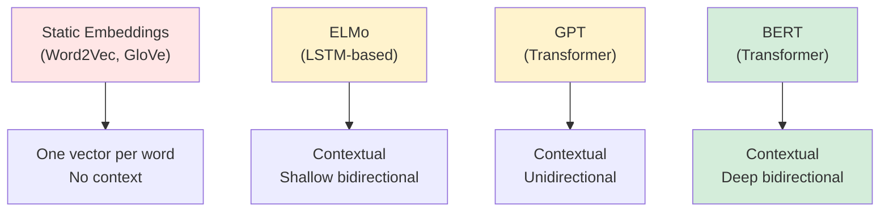
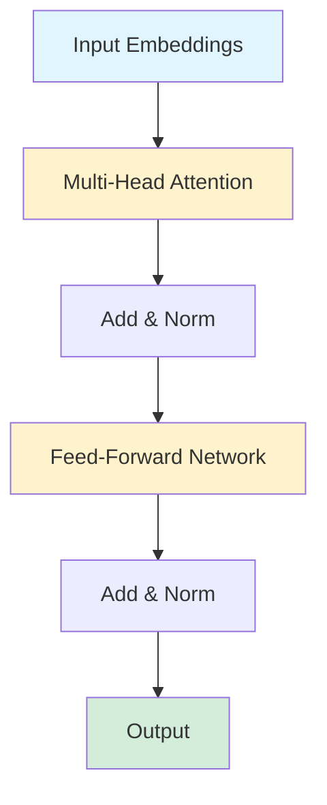
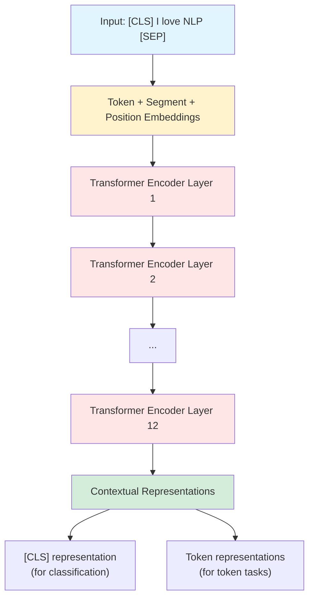

# Chapter 14: BERT (Bidirectional Encoder Representations from Transformers)

## 🎯 Learning Objectives

By the end of this chapter, you will:
1. Understand the Transformer architecture and self-attention mechanism
2. Master BERT's bidirectional pre-training approach
3. Learn the Masked Language Model (MLM) and Next Sentence Prediction (NSP) objectives
4. Implement fine-tuning of BERT for downstream tasks
5. Compare BERT with previous embedding methods (Word2Vec, GloVe, FastText)
6. Use pre-trained BERT models in practice
7. Understand BERT variants and their improvements

---

## 📚 Key Concepts

### 1. Introduction to BERT

**BERT** (Bidirectional Encoder Representations from Transformers) is a revolutionary NLP model developed by Google AI in 2018.

**Key Innovation**: **Bidirectional** pre-training using **Transformers**.

**Previous Approaches**:
- **Word2Vec, GloVe, FastText**: Static embeddings (one vector per word)
- **ELMo**: Contextual but shallow (LSTM-based)
- **GPT**: Contextual but unidirectional (left-to-right)

**BERT**:
- **Contextual**: Different representations in different contexts
- **Bidirectional**: Uses both left and right context
- **Deep**: Multiple Transformer layers (12-24)
- **Pre-trained**: Trained on massive corpus, fine-tuned for tasks



**Example**:
```
Sentence: "I went to the bank to deposit money."

Static Embeddings (Word2Vec):
- "bank" always has the same vector (financial? river? unclear)

BERT:
- "bank" gets contextual embedding based on "deposit money"
- Different vector for "river bank" context
```

---

### 2. Transformer Architecture Basics

BERT is built on the **Transformer** architecture, specifically the **Encoder** component.

**Self-Attention Mechanism**:

Self-attention allows each word to attend to all other words in the sentence.

**Formula**:
$$
\text{Attention}(Q, K, V) = \text{softmax}\left(\frac{QK^T}{\sqrt{d_k}}\right)V
$$

Where:
- $Q$ (Query): What I'm looking for
- $K$ (Key): What each word offers
- $V$ (Value): The actual representation
- $d_k$: Dimension of keys (for scaling)

**Multi-Head Attention**:
$$
\text{MultiHead}(Q, K, V) = \text{Concat}(\text{head}_1, ..., \text{head}_h)W^O
$$

Where:
$$
\text{head}_i = \text{Attention}(QW_i^Q, KW_i^K, VW_i^V)
$$

**Intuition**:
```
Sentence: "The animal didn't cross the street because it was too tired."

Question: What does "it" refer to?

Self-Attention:
- "it" attends to all words
- High attention to "animal" (subject)
- Low attention to "street"
- Conclusion: "it" = "animal"
```

**Transformer Encoder Layer**:


**Implementation (Simplified)**:
```python
import torch
import torch.nn as nn

class MultiHeadAttention(nn.Module):
    def __init__(self, d_model=768, num_heads=12):
        super(MultiHeadAttention, self).__init__()
        self.num_heads = num_heads
        self.d_model = d_model
        self.d_k = d_model // num_heads

        # Linear projections
        self.W_q = nn.Linear(d_model, d_model)
        self.W_k = nn.Linear(d_model, d_model)
        self.W_v = nn.Linear(d_model, d_model)
        self.W_o = nn.Linear(d_model, d_model)

    def forward(self, x, mask=None):
        batch_size, seq_len, d_model = x.size()

        # Linear projections
        Q = self.W_q(x)  # (batch, seq_len, d_model)
        K = self.W_k(x)
        V = self.W_v(x)

        # Reshape for multi-head: (batch, num_heads, seq_len, d_k)
        Q = Q.view(batch_size, seq_len, self.num_heads, self.d_k).transpose(1, 2)
        K = K.view(batch_size, seq_len, self.num_heads, self.d_k).transpose(1, 2)
        V = V.view(batch_size, seq_len, self.num_heads, self.d_k).transpose(1, 2)

        # Scaled dot-product attention
        scores = torch.matmul(Q, K.transpose(-2, -1)) / (self.d_k ** 0.5)
        # scores: (batch, num_heads, seq_len, seq_len)

        if mask is not None:
            scores = scores.masked_fill(mask == 0, -1e9)

        attention_weights = torch.softmax(scores, dim=-1)
        attention_output = torch.matmul(attention_weights, V)
        # (batch, num_heads, seq_len, d_k)

        # Concatenate heads
        attention_output = attention_output.transpose(1, 2).contiguous()
        attention_output = attention_output.view(batch_size, seq_len, d_model)

        # Final linear projection
        output = self.W_o(attention_output)
        return output


class TransformerEncoderLayer(nn.Module):
    def __init__(self, d_model=768, num_heads=12, d_ff=3072, dropout=0.1):
        super(TransformerEncoderLayer, self).__init__()

        self.attention = MultiHeadAttention(d_model, num_heads)
        self.norm1 = nn.LayerNorm(d_model)
        self.norm2 = nn.LayerNorm(d_model)

        # Feed-forward network
        self.ffn = nn.Sequential(
            nn.Linear(d_model, d_ff),
            nn.GELU(),
            nn.Linear(d_ff, d_model)
        )

        self.dropout = nn.Dropout(dropout)

    def forward(self, x, mask=None):
        # Multi-head attention
        attention_output = self.attention(x, mask)
        x = self.norm1(x + self.dropout(attention_output))  # Add & Norm

        # Feed-forward
        ffn_output = self.ffn(x)
        x = self.norm2(x + self.dropout(ffn_output))  # Add & Norm

        return x
```

---

### 3. BERT Architecture

**BERT = Stack of Transformer Encoder Layers**

**Two Variants**:
1. **BERT-Base**: 12 layers, 768 hidden dim, 12 attention heads, 110M parameters
2. **BERT-Large**: 24 layers, 1024 hidden dim, 16 attention heads, 340M parameters

**Input Representation**:

BERT uses three types of embeddings:
1. **Token Embeddings**: WordPiece embeddings (subword tokenization)
2. **Segment Embeddings**: Which sentence (A or B)
3. **Position Embeddings**: Position in sequence

$$
\text{Input} = \text{Token Emb} + \text{Segment Emb} + \text{Position Emb}
$$

**Example**:
```
Input: [CLS] I love NLP [SEP] BERT is amazing [SEP]

Token Embeddings:    [CLS] I   love NLP [SEP] BERT is   amazing [SEP]
Segment Embeddings:   A    A   A    A    A     B    B    B       B
Position Embeddings:  0    1   2    3    4     5    6    7       8

Final Input = sum of all three embeddings
```

**Special Tokens**:
- `[CLS]`: Classification token (first token, used for classification tasks)
- `[SEP]`: Separator token (separates sentences)
- `[MASK]`: Mask token (used in pre-training)
- `[PAD]`: Padding token

**Architecture Diagram**:


---

### 4. Pre-training Objectives

BERT is pre-trained on two unsupervised tasks:

**Task 1: Masked Language Model (MLM)**

**Idea**: Randomly mask 15% of tokens, predict them.

**Example**:
```
Original: "I love natural language processing"
Masked:   "I love [MASK] language processing"
Task:     Predict "[MASK]" = "natural"
```

**Details**:
- 15% of tokens are selected for masking
- Of those 15%:
  - 80% replaced with `[MASK]`
  - 10% replaced with random word
  - 10% kept unchanged

**Why the 10% random/unchanged?**
- Prevents model from only learning to predict `[MASK]` token
- Forces model to maintain representation for all tokens

**Objective**:
$$
\mathcal{L}_{\text{MLM}} = -\sum_{i \in \text{masked}} \log P(w_i | \text{context})
$$

**Task 2: Next Sentence Prediction (NSP)**

**Idea**: Given two sentences A and B, predict if B follows A.

**Example**:
```
Sentence A: "I love NLP."
Sentence B: "BERT is a powerful model."
Label: IsNext (1) or NotNext (0)

Positive example (IsNext):
A: "I went to the store."
B: "I bought some milk."
Label: 1

Negative example (NotNext):
A: "I went to the store."
B: "The sky is blue."
Label: 0
```

**Objective**:
$$
\mathcal{L}_{\text{NSP}} = -\log P(\text{IsNext} | \text{[CLS] representation})
$$

**Total Pre-training Loss**:
$$
\mathcal{L} = \mathcal{L}_{\text{MLM}} + \mathcal{L}_{\text{NSP}}
$$

**Implementation**:
```python
import torch
import torch.nn as nn

class BERTPreTraining(nn.Module):
    def __init__(self, vocab_size, d_model=768, num_layers=12, num_heads=12):
        super(BERTPreTraining, self).__init__()

        # Embeddings
        self.token_embedding = nn.Embedding(vocab_size, d_model)
        self.segment_embedding = nn.Embedding(2, d_model)  # 2 segments: A and B
        self.position_embedding = nn.Embedding(512, d_model)  # Max seq len 512

        # Transformer encoder layers
        self.encoder_layers = nn.ModuleList([
            TransformerEncoderLayer(d_model, num_heads)
            for _ in range(num_layers)
        ])

        # MLM head
        self.mlm_head = nn.Sequential(
            nn.Linear(d_model, d_model),
            nn.GELU(),
            nn.LayerNorm(d_model),
            nn.Linear(d_model, vocab_size)
        )

        # NSP head
        self.nsp_head = nn.Sequential(
            nn.Linear(d_model, d_model),
            nn.Tanh(),
            nn.Linear(d_model, 2)  # Binary: IsNext or NotNext
        )

    def forward(self, input_ids, segment_ids, position_ids, masked_positions=None):
        batch_size, seq_len = input_ids.size()

        # Embeddings
        token_emb = self.token_embedding(input_ids)
        segment_emb = self.segment_embedding(segment_ids)
        position_emb = self.position_embedding(position_ids)

        # Sum embeddings
        x = token_emb + segment_emb + position_emb  # (batch, seq_len, d_model)

        # Transformer encoder
        for layer in self.encoder_layers:
            x = layer(x)

        # MLM predictions (for masked positions)
        if masked_positions is not None:
            masked_output = x[masked_positions]  # Select masked positions
            mlm_logits = self.mlm_head(masked_output)
        else:
            mlm_logits = None

        # NSP prediction (use [CLS] token representation)
        cls_output = x[:, 0, :]  # First token ([CLS])
        nsp_logits = self.nsp_head(cls_output)

        return mlm_logits, nsp_logits


# Training example
def train_step(model, input_ids, segment_ids, position_ids,
               masked_positions, masked_labels, nsp_labels):

    # Forward pass
    mlm_logits, nsp_logits = model(input_ids, segment_ids, position_ids, masked_positions)

    # MLM loss
    mlm_loss = nn.CrossEntropyLoss()(mlm_logits, masked_labels)

    # NSP loss
    nsp_loss = nn.CrossEntropyLoss()(nsp_logits, nsp_labels)

    # Total loss
    total_loss = mlm_loss + nsp_loss

    return total_loss
```

---

### 5. Fine-tuning BERT

After pre-training, BERT can be fine-tuned for **downstream tasks** with minimal architecture changes.

**General Approach**:
1. Start with pre-trained BERT
2. Add task-specific layer on top
3. Fine-tune entire model on task data

**Task 1: Text Classification (Sentiment Analysis)**

Use `[CLS]` representation:

```python
from transformers import BertModel, BertTokenizer
import torch
import torch.nn as nn

class BERTClassifier(nn.Module):
    def __init__(self, num_classes=2, dropout=0.1):
        super(BERTClassifier, self).__init__()

        # Pre-trained BERT
        self.bert = BertModel.from_pretrained('bert-base-uncased')

        # Classification head
        self.dropout = nn.Dropout(dropout)
        self.classifier = nn.Linear(768, num_classes)  # 768 = BERT hidden size

    def forward(self, input_ids, attention_mask):
        # Get BERT outputs
        outputs = self.bert(input_ids=input_ids, attention_mask=attention_mask)

        # Use [CLS] token representation (first token)
        cls_output = outputs.last_hidden_state[:, 0, :]  # (batch, 768)

        # Classification
        cls_output = self.dropout(cls_output)
        logits = self.classifier(cls_output)  # (batch, num_classes)

        return logits


# Usage
tokenizer = BertTokenizer.from_pretrained('bert-base-uncased')
model = BERTClassifier(num_classes=2)

# Tokenize
text = "I love this movie!"
encoded = tokenizer(text, return_tensors='pt', padding=True, truncation=True)

# Forward pass
logits = model(encoded['input_ids'], encoded['attention_mask'])
prediction = torch.argmax(logits, dim=1)
print(f"Prediction: {prediction.item()}")  # 0 or 1
```

**Task 2: Named Entity Recognition (NER)**

Use token-level representations:

```python
class BERTNER(nn.Module):
    def __init__(self, num_labels=9):  # e.g., 9 NER tags
        super(BERTNER, self).__init__()

        self.bert = BertModel.from_pretrained('bert-base-uncased')
        self.dropout = nn.Dropout(0.1)
        self.classifier = nn.Linear(768, num_labels)

    def forward(self, input_ids, attention_mask):
        # Get BERT outputs
        outputs = self.bert(input_ids=input_ids, attention_mask=attention_mask)

        # Use all token representations
        sequence_output = outputs.last_hidden_state  # (batch, seq_len, 768)

        # Classify each token
        sequence_output = self.dropout(sequence_output)
        logits = self.classifier(sequence_output)  # (batch, seq_len, num_labels)

        return logits


# Usage
model = BERTNER(num_labels=9)
text = "Barack Obama was born in Hawaii"
encoded = tokenizer(text, return_tensors='pt', padding=True, truncation=True)

logits = model(encoded['input_ids'], encoded['attention_mask'])
# logits: (1, seq_len, 9)
predictions = torch.argmax(logits, dim=-1)
# predictions: (1, seq_len)
```

**Task 3: Question Answering (SQuAD)**

Predict start and end positions:

```python
class BERTQuestionAnswering(nn.Module):
    def __init__(self):
        super(BERTQuestionAnswering, self).__init__()

        self.bert = BertModel.from_pretrained('bert-base-uncased')
        self.qa_outputs = nn.Linear(768, 2)  # Start and end logits

    def forward(self, input_ids, attention_mask):
        outputs = self.bert(input_ids=input_ids, attention_mask=attention_mask)
        sequence_output = outputs.last_hidden_state  # (batch, seq_len, 768)

        logits = self.qa_outputs(sequence_output)  # (batch, seq_len, 2)

        start_logits = logits[:, :, 0]  # (batch, seq_len)
        end_logits = logits[:, :, 1]    # (batch, seq_len)

        return start_logits, end_logits


# Usage
model = BERTQuestionAnswering()
question = "What is the capital of France?"
context = "The capital of France is Paris."

# Encode question + context
encoded = tokenizer(question, context, return_tensors='pt', padding=True, truncation=True)

start_logits, end_logits = model(encoded['input_ids'], encoded['attention_mask'])

# Get answer span
start_idx = torch.argmax(start_logits, dim=1).item()
end_idx = torch.argmax(end_logits, dim=1).item()

answer_tokens = encoded['input_ids'][0][start_idx:end_idx+1]
answer = tokenizer.decode(answer_tokens)
print(f"Answer: {answer}")
```

**Fine-tuning Training Loop**:
```python
from torch.utils.data import DataLoader
from transformers import AdamW, get_linear_schedule_with_warmup

# Model
model = BERTClassifier(num_classes=2)

# Optimizer (with layer-wise learning rate decay)
optimizer = AdamW(model.parameters(), lr=2e-5, eps=1e-8)

# Learning rate scheduler
total_steps = len(train_dataloader) * epochs
scheduler = get_linear_schedule_with_warmup(
    optimizer,
    num_warmup_steps=0.1 * total_steps,
    num_training_steps=total_steps
)

# Training loop
model.train()
for epoch in range(epochs):
    for batch in train_dataloader:
        input_ids = batch['input_ids']
        attention_mask = batch['attention_mask']
        labels = batch['labels']

        # Forward pass
        logits = model(input_ids, attention_mask)
        loss = nn.CrossEntropyLoss()(logits, labels)

        # Backward pass
        optimizer.zero_grad()
        loss.backward()

        # Gradient clipping
        torch.nn.utils.clip_grad_norm_(model.parameters(), max_norm=1.0)

        optimizer.step()
        scheduler.step()

    print(f"Epoch {epoch+1}, Loss: {loss.item():.4f}")
```

---

### 6. BERT vs Previous Approaches

**Comparison Table**:

| Aspect | Word2Vec/GloVe | FastText | ELMo | GPT | BERT |
|--------|---------------|----------|------|-----|------|
| **Context** | ❌ Static | ❌ Static | ✅ Contextual | ✅ Contextual | ✅ Contextual |
| **Bidirectional** | N/A | N/A | ✅ Shallow | ❌ Unidirectional | ✅ Deep |
| **Architecture** | Count/Skip-gram | Skip-gram | LSTM | Transformer | Transformer |
| **Depth** | Shallow | Shallow | 2 LSTMs | Deep | Deep |
| **OOV** | ❌ Poor | ✅ Good | ✅ Character-based | ✅ Subword | ✅ Subword |
| **Pre-training** | ❌ No | ❌ No | ✅ Yes | ✅ Yes | ✅ Yes |
| **Fine-tuning** | N/A | N/A | ⚠️ Feature-based | ✅ Full model | ✅ Full model |
| **Performance** | Baseline | Baseline | Good | Good | Excellent ✅ |

**Key Differences**:

**1. Contextual vs Static**:
```python
# Word2Vec/GloVe/FastText (Static)
vec_bank1 = embeddings["bank"]  # Same vector
vec_bank2 = embeddings["bank"]  # Same vector

# BERT (Contextual)
sent1 = "I went to the bank to deposit money"
sent2 = "I sat by the river bank"
vec_bank1 = bert(sent1)["bank"]  # Different vectors!
vec_bank2 = bert(sent2)["bank"]  # Context-dependent
```

**2. Unidirectional (GPT) vs Bidirectional (BERT)**:
```python
# GPT: Predicts next word (left-to-right only)
"The cat sat on the ___"
# Uses: "The cat sat on the" (left context only)

# BERT: Uses both directions
"The cat [MASK] on the mat"
# Uses: "The cat" (left) + "on the mat" (right)
# Full context!
```

**3. Feature-based (ELMo) vs Fine-tuning (BERT)**:
```python
# ELMo: Freeze ELMo, use as features
elmo_features = elmo_model(text)  # Fixed
classifier = train_classifier(elmo_features, labels)  # Only train classifier

# BERT: Fine-tune entire model
bert_model = BertModel.from_pretrained('bert-base-uncased')
classifier = BERTClassifier(bert_model)
# Fine-tune both BERT and classifier end-to-end
```

---

### 7. BERT Variants

**RoBERTa** (Robustly Optimized BERT):
- Removes NSP task (not helpful)
- Longer training, larger batches
- Dynamic masking (different masks each epoch)
- Better performance than BERT

**ALBERT** (A Lite BERT):
- Parameter sharing across layers (reduces size)
- Factorized embeddings
- Sentence Order Prediction (SOP) instead of NSP
- Smaller model, similar performance

**DistilBERT**:
- Knowledge distillation from BERT
- 40% smaller, 60% faster
- Retains 97% of BERT's performance
- Good for production/mobile

**ELECTRA**:
- Replaced Token Detection instead of MLM
- More efficient pre-training
- Better performance with less compute

**DeBERTa** (Decoding-enhanced BERT):
- Disentangled attention (separate position and content)
- Enhanced mask decoder
- State-of-the-art on many benchmarks

**Multilingual BERT (mBERT)**:
- Trained on 104 languages
- Cross-lingual transfer learning
- Slightly lower performance than monolingual

**Comparison**:

| Model | Size | Speed | Performance | Use Case |
|-------|------|-------|-------------|----------|
| **BERT-Base** | 110M | Baseline | Good | General |
| **BERT-Large** | 340M | Slow | Better | When accuracy matters |
| **RoBERTa** | 125M-355M | Slow | Better | Better than BERT |
| **ALBERT** | 12M-235M | Fast | Good | Resource-constrained |
| **DistilBERT** | 66M | Fast (60% faster) | Good (97% of BERT) | Production/mobile |
| **ELECTRA** | 14M-335M | Fast | Better | Efficient training |
| **DeBERTa** | 184M-1.5B | Slow | Best | State-of-the-art |

---

### 8. Using Pre-trained BERT (Hugging Face)

**Installation**:
```bash
pip install transformers
```

**Basic Usage**:
```python
from transformers import BertTokenizer, BertModel
import torch

# Load pre-trained model and tokenizer
tokenizer = BertTokenizer.from_pretrained('bert-base-uncased')
model = BertModel.from_pretrained('bert-base-uncased')

# Tokenize
text = "Hello, how are you?"
encoded = tokenizer(text, return_tensors='pt')

print(encoded)
# {'input_ids': tensor([[  101,  7592,  1010,  2129,  2024,  2017,  1029,   102]]),
#  'token_type_ids': tensor([[0, 0, 0, 0, 0, 0, 0, 0]]),
#  'attention_mask': tensor([[1, 1, 1, 1, 1, 1, 1, 1]])}

# Forward pass
with torch.no_grad():
    outputs = model(**encoded)

# Get embeddings
last_hidden_state = outputs.last_hidden_state  # (1, seq_len, 768)
pooler_output = outputs.pooler_output  # (1, 768) - [CLS] representation

print(f"Shape: {last_hidden_state.shape}")
```

**Text Classification Pipeline**:
```python
from transformers import pipeline

# Sentiment analysis
classifier = pipeline('sentiment-analysis')
result = classifier("I love this movie!")
print(result)
# [{'label': 'POSITIVE', 'score': 0.9998}]

# Custom model
classifier = pipeline('text-classification', model='distilbert-base-uncased-finetuned-sst-2-english')
result = classifier("This is terrible!")
print(result)
# [{'label': 'NEGATIVE', 'score': 0.9991}]
```

**Question Answering**:
```python
qa = pipeline('question-answering')
context = "BERT is a transformer-based model developed by Google in 2018."
question = "When was BERT developed?"

result = qa(question=question, context=context)
print(result)
# {'score': 0.98, 'start': 58, 'end': 62, 'answer': '2018'}
```

**Named Entity Recognition**:
```python
ner = pipeline('ner', grouped_entities=True)
text = "Barack Obama was born in Hawaii and became president in 2009."

result = ner(text)
for entity in result:
    print(f"{entity['word']}: {entity['entity_group']}")
# Barack Obama: PER
# Hawaii: LOC
```

**Fill-Mask** (MLM inference):
```python
fill_mask = pipeline('fill-mask')
text = "The capital of France is [MASK]."

results = fill_mask(text)
for result in results[:3]:
    print(f"{result['token_str']}: {result['score']:.4f}")
# Paris: 0.9543
# Lyon: 0.0234
# Marseille: 0.0089
```

**Feature Extraction**:
```python
from transformers import BertTokenizer, BertModel
import numpy as np

tokenizer = BertTokenizer.from_pretrained('bert-base-uncased')
model = BertModel.from_pretrained('bert-base-uncased')

def get_sentence_embedding(text):
    """Get sentence embedding (mean of token embeddings)"""
    encoded = tokenizer(text, return_tensors='pt', padding=True, truncation=True)

    with torch.no_grad():
        outputs = model(**encoded)

    # Mean pooling
    token_embeddings = outputs.last_hidden_state  # (1, seq_len, 768)
    mask = encoded['attention_mask'].unsqueeze(-1)  # (1, seq_len, 1)

    # Masked mean
    sum_embeddings = (token_embeddings * mask).sum(dim=1)  # (1, 768)
    sum_mask = mask.sum(dim=1)  # (1, 1)
    mean_embedding = sum_embeddings / sum_mask  # (1, 768)

    return mean_embedding.squeeze().numpy()

# Usage
emb1 = get_sentence_embedding("I love NLP")
emb2 = get_sentence_embedding("I enjoy natural language processing")

# Cosine similarity
from sklearn.metrics.pairwise import cosine_similarity
sim = cosine_similarity([emb1], [emb2])[0][0]
print(f"Similarity: {sim:.4f}")  # High similarity expected
```

---

### 9. Practical Considerations

**1. Computational Requirements**:
```python
# BERT-Base: 110M parameters
# Memory: ~4GB GPU for inference, ~16GB for training

# DistilBERT: 66M parameters (40% smaller)
# Memory: ~2GB GPU for inference, ~8GB for training

# Use smaller models for resource constraints
from transformers import DistilBertModel
model = DistilBertModel.from_pretrained('distilbert-base-uncased')
```

**2. Input Length Limitations**:
```python
# BERT max sequence length: 512 tokens
# For longer texts, use truncation or sliding window

# Option 1: Truncation
encoded = tokenizer(long_text, max_length=512, truncation=True)

# Option 2: Sliding window (for documents)
def process_long_text(text, max_length=512, stride=256):
    tokens = tokenizer.tokenize(text)
    chunks = []

    for i in range(0, len(tokens), stride):
        chunk = tokens[i:i + max_length]
        chunks.append(tokenizer.convert_tokens_to_ids(chunk))

    return chunks
```

**3. Domain Adaptation**:
```python
# For domain-specific tasks, continue pre-training on domain data

from transformers import BertForMaskedLM, DataCollatorForLanguageModeling

model = BertForMaskedLM.from_pretrained('bert-base-uncased')
data_collator = DataCollatorForLanguageModeling(tokenizer=tokenizer, mlm_probability=0.15)

# Train on domain corpus with MLM objective
# Then fine-tune on downstream task
```

**4. Freezing Layers**:
```python
# For small datasets, freeze early BERT layers

model = BertModel.from_pretrained('bert-base-uncased')

# Freeze embeddings and first 8 layers
for param in model.embeddings.parameters():
    param.requires_grad = False

for layer in model.encoder.layer[:8]:
    for param in layer.parameters():
        param.requires_grad = False

# Only fine-tune last 4 layers + classifier
```

---

## 🎤 Interview Questions and Answers

### Q1: What makes BERT "bidirectional" and why is it important?

**Answer**:

BERT is **bidirectional** because it uses the **entire context** (both left and right) when computing word representations, unlike previous models.

**Previous Approaches**:

**1. Word2Vec/GloVe**: Not applicable (static, no direction)

**2. GPT (Unidirectional)**:
- Uses **left-to-right** Transformer decoder
- Predicts next word: $P(w_t | w_1, ..., w_{t-1})$
- Only sees left context
```python
"The cat [?] on the mat"
GPT sees: "The cat" (only left)
Cannot use "on the mat" (right context)
```

**3. ELMo (Shallow Bidirectional)**:
- Concatenates left-to-right and right-to-left LSTMs
- Shallow: Two separate LSTMs, not deeply bidirectional
```python
Forward LSTM:  → → → → →
Backward LSTM: ← ← ← ← ←
Concatenate outputs
```

**BERT (Deep Bidirectional)**:
- Uses **bidirectional Transformer encoder**
- Self-attention allows each token to attend to **all tokens** simultaneously
- Deeply integrated bidirectional context (all layers)

```python
"The cat [MASK] on the mat"
BERT sees: "The cat" (left) + "on the mat" (right)
Full context in every layer!
```

**Why It Matters**:

**Example 1**: Word Sense Disambiguation
```
Sentence: "I went to the bank to deposit money"

Unidirectional (GPT):
- Processing "bank": only sees "I went to the"
- Ambiguous (river bank? financial bank?)

Bidirectional (BERT):
- Processing "bank": sees "I went to the" + "to deposit money"
- Right context "deposit money" → financial bank!
```

**Example 2**: Coreference Resolution
```
Sentence: "The animal didn't cross the street because it was too tired"

Question: What does "it" refer to?

Unidirectional:
- Processing "it": sees "The animal didn't cross the street because"
- Hard to resolve

Bidirectional:
- Processing "it": sees full sentence + "was too tired"
- "tired" is a property of animals, not streets → "it" = animal
```

**Mathematical Intuition**:

**GPT (Autoregressive)**:
$$
P(w_{1:T}) = \prod_{t=1}^{T} P(w_t | w_{1:t-1})
$$
Each token only depends on previous tokens.

**BERT (Masked LM)**:
$$
P(w_i | w_{\setminus i}) = \text{softmax}(f(w_1, ..., w_{i-1}, [MASK], w_{i+1}, ..., w_T))
$$
Masked token uses **entire context** (except itself).

**Impact on Performance**:
- BERT outperforms GPT on tasks requiring full context understanding:
  - **Question Answering** (SQuAD): Need to understand question + passage
  - **NER**: Entity boundaries require surrounding context
  - **Sentence Classification**: Entire sentence matters

**Trade-off**:
- **BERT**: Better understanding, cannot generate text (no autoregressive)
- **GPT**: Can generate text, but unidirectional understanding

**Modern Solution**: Models like **T5** and **BART** combine both (encoder-decoder architecture).

---

### Q2: Explain the Masked Language Model (MLM) objective and why BERT masks 15% of tokens.

**Answer**:

**Masked Language Model (MLM)** is BERT's primary pre-training objective, where random tokens are masked and the model learns to predict them using bidirectional context.

**How It Works**:

**Step 1: Random Selection**
- Select 15% of tokens randomly
- This percentage balances learning and efficiency

**Step 2: Masking Strategy**
Of the 15% selected tokens:
- **80%** replaced with `[MASK]`
- **10%** replaced with random word
- **10%** kept unchanged

**Example**:
```python
Original: "I love natural language processing"

15% tokens to mask: "natural" (1 out of 5 words ≈ 20%, but typically more tokens)

80% case (most common):
"I love [MASK] language processing"

10% case (random replacement):
"I love apple language processing"  # Random word

10% case (unchanged):
"I love natural language processing"  # Keep original
```

**Why 15%?**

**Too Low (< 10%)**:
- Not enough training signal
- Model learns slowly
- Underfitting

**Too High (> 20%)**:
- Too much missing information
- Context becomes unclear
- Hard to predict (random guessing)

**15% is Sweet Spot**:
- Enough masked tokens to learn from
- Enough context to make informed predictions
- Empirically optimal (from BERT paper experiments)

**Why the 80-10-10 Strategy?**

**Problem with 100% [MASK]**:
```python
# Training: See [MASK] tokens
"I love [MASK] language processing"

# Fine-tuning/Inference: No [MASK] tokens
"I love natural language processing"

# Mismatch! Model never learned to handle real words.
```

**Solution**:

**80% [MASK]**: Primary learning signal
- Model learns to predict masked words
- Learns bidirectional representations

**10% Random Word**: Prevent overfitting to [MASK]
```python
"I love apple language processing"
# Model must learn to detect "apple" doesn't fit
# Forced to understand context deeply
```

**10% Unchanged**: Avoid train-test mismatch
```python
"I love natural language processing"
# Model sees real words during training
# Learns representations for unchanged words too
```

**Objective Function**:

Only compute loss on the 15% selected tokens:
$$
\mathcal{L}_{\text{MLM}} = -\sum_{i \in \text{masked}} \log P(w_i | \mathbf{h}_i)
$$

Where $\mathbf{h}_i$ is the bidirectional context representation.

**Implementation**:
```python
import random

def create_masked_lm_predictions(tokens, vocab, mask_prob=0.15):
    """Create MLM training data"""
    masked_tokens = tokens.copy()
    labels = [-100] * len(tokens)  # -100 = ignore in loss

    for i, token in enumerate(tokens):
        # Skip special tokens
        if token in ['[CLS]', '[SEP]', '[PAD]']:
            continue

        # 15% chance of masking
        if random.random() < mask_prob:
            labels[i] = vocab[token]  # Original token ID for loss

            # 80% -> [MASK]
            if random.random() < 0.8:
                masked_tokens[i] = '[MASK]'

            # 10% -> random word
            elif random.random() < 0.5:  # 10% of the 20% remaining
                masked_tokens[i] = random.choice(vocab)

            # 10% -> keep unchanged
            # (else clause, do nothing)

    return masked_tokens, labels

# Example
tokens = ['[CLS]', 'I', 'love', 'natural', 'language', 'processing', '[SEP]']
masked, labels = create_masked_lm_predictions(tokens, vocab)

# Possible output:
# masked: ['[CLS]', 'I', '[MASK]', 'natural', 'language', 'processing', '[SEP]']
# labels: [-100, -100, 5234, -100, -100, -100, -100]  # Only "love" has label
```

**Why MLM vs. Traditional Language Modeling?**

**Traditional LM (GPT)**:
$$
P(w_t | w_{1:t-1})
$$
- Predict next word (left-to-right)
- Unidirectional

**MLM (BERT)**:
$$
P(w_i | w_{1:i-1}, w_{i+1:T})
$$
- Predict masked word using full context
- Bidirectional ✅

**Benefits**:
1. **Bidirectional context**: Better understanding
2. **Denoising objective**: Learn robust representations
3. **No train-test mismatch**: 10% unchanged tokens

**Limitations**:
1. **Cannot generate text**: Not autoregressive
2. **Independence assumption**: Masked tokens predicted independently
3. **Pre-train/fine-tune discrepancy**: [MASK] only in pre-training

---

### Q3: How does BERT handle subword tokenization and why is it important?

**Answer**:

BERT uses **WordPiece tokenization**, a subword tokenization algorithm that splits words into smaller units.

**WordPiece Algorithm**:

**Idea**: Build vocabulary of frequent subwords (not just words)

**Example**:
```python
Word: "playing"

# Character-level (too granular):
['p', 'l', 'a', 'y', 'i', 'n', 'g']  # 7 tokens, no meaning

# Word-level (too specific):
['playing']  # 1 token, but "played", "player" are separate

# Subword (WordPiece):
['play', '##ing']  # 2 tokens, captures morphology
# '##' indicates continuation
```

**How It Works**:

**Step 1**: Start with character vocabulary + common words

**Step 2**: Iteratively merge frequent pairs
```python
Corpus: "playing", "played", "player"

Iteration 1: Merge 'p' + 'l' → 'pl'
Iteration 2: Merge 'pl' + 'a' → 'pla'
Iteration 3: Merge 'pla' + 'y' → 'play'
Iteration 4: Merge 'ing' as frequent suffix
...

Final vocab: ['play', '##ing', '##ed', '##er', ...]
```

**BERT Tokenization Example**:
```python
from transformers import BertTokenizer

tokenizer = BertTokenizer.from_pretrained('bert-base-uncased')

# Common word (in vocabulary)
tokens = tokenizer.tokenize("playing")
print(tokens)  # ['playing'] - single token

# Rare word (not in vocabulary)
tokens = tokenizer.tokenize("unaffableness")
print(tokens)  # ['una', '##ffa', '##ble', '##ness'] - split into subwords

# Out-of-vocabulary word
tokens = tokenizer.tokenize("covidify")
print(tokens)  # ['co', '##vid', '##ify'] - split into known subwords

# Convert to IDs
ids = tokenizer.convert_tokens_to_ids(tokens)
print(ids)  # [2522, 17258, 6875] - numeric IDs
```

**Why Subword Tokenization?**

**Problem 1: OOV (Out-of-Vocabulary)**

**Word-level tokenization**:
```python
Vocabulary: {"run", "running", "runner"}

New word: "runs"
→ OOV! No representation.
```

**Subword tokenization**:
```python
Vocabulary: {"run", "##ning", "##ner", "##s"}

New word: "runs"
→ ["run", "##s"] ✅ Can represent!
```

**Problem 2: Vocabulary Explosion**

**Word-level**:
- English has ~170,000 words
- Morphological variants: "play", "plays", "played", "playing", "player", "players" = 6 entries
- Requires huge vocabulary

**Subword**:
- Vocabulary: ~30,000 subwords
- "play", "##s", "##ed", "##ing", "##er" = 5 entries
- Covers all variants!

**Problem 3: Rare Words**

**Word-level**:
- Rare words have few training examples → poor embeddings

**Subword**:
- Rare words share subwords with common words
- Example: "biodegradability"
  - Rare as full word
  - But "bio", "##grad", "##able", "##ity" appear in many words
  - Better representation!

**Advantages**:

**1. Fixed Vocabulary Size**:
```python
# BERT vocabulary: ~30,000 subwords
# Covers virtually infinite words through composition
```

**2. Morphological Awareness**:
```python
"unhappiness" → ["un", "##happiness"]
# Captures prefix "un-" (negation)

"happiness" → ["happiness"]
# Shares "happiness" with "unhappiness"
```

**3. Multilingual Support**:
```python
# English: "playing" → ["play", "##ing"]
# German: "spielen" → ["spiel", "##en"]
# Similar suffixes captured across languages
```

**4. Robustness**:
```python
# Typo: "plaaaying"
Word-level: OOV
Subword: ["pl", "##aa", "##ay", "##ing"] - still processable
```

**BERT Vocabulary**:
```python
tokenizer = BertTokenizer.from_pretrained('bert-base-uncased')

print(f"Vocabulary size: {len(tokenizer)}")  # ~30,522

# Special tokens
print(tokenizer.special_tokens_map)
# {'unk_token': '[UNK]', 'sep_token': '[SEP]', 'pad_token': '[PAD]',
#  'cls_token': '[CLS]', 'mask_token': '[MASK]'}

# Sample vocab
print(list(tokenizer.vocab.items())[:10])
# [('[PAD]', 0), ('[unused0]', 1), ('[unused1]', 2), ...]
```

**Implementation Details**:

**Encoding**:
```python
text = "I love NLP"
encoded = tokenizer(text, return_tensors='pt')

print(encoded)
# {
#   'input_ids': tensor([[ 101, 1045, 2293, 17953, 102]]),
#   # 101 = [CLS], 1045 = I, 2293 = love, 17953 = nl ##p, 102 = [SEP]
#   'attention_mask': tensor([[1, 1, 1, 1, 1]]),
#   'token_type_ids': tensor([[0, 0, 0, 0, 0]])
# }
```

**Decoding**:
```python
tokens = tokenizer.tokenize("playing games")
print(tokens)  # ['playing', 'games']

# With IDs
ids = tokenizer.encode("playing games")
print(ids)  # [101, 2652, 2399, 102]  # [CLS] + tokens + [SEP]

decoded = tokenizer.decode(ids)
print(decoded)  # "playing games"
```

**Comparison with Other Tokenization**:

| Method | Vocab Size | OOV Handling | Morphology | Example |
|--------|-----------|--------------|------------|---------|
| **Character** | ~100 | ✅ Perfect | ❌ No | "playing" → [p,l,a,y,i,n,g] |
| **Word** | ~100K | ❌ Poor | ❌ No | "playing" → [playing] |
| **WordPiece (BERT)** | ~30K | ✅ Good | ✅ Yes | "playing" → [play, ##ing] |
| **BPE (GPT)** | ~50K | ✅ Good | ✅ Yes | "playing" → ["play", "ing"] |
| **SentencePiece** | ~30K | ✅ Good | ✅ Yes | "playing" → ["▁play", "ing"] |

**Practical Tips**:

**1. Handling Unknown Tokens**:
```python
# Very rare/foreign words might become [UNK]
token_id = tokenizer.convert_tokens_to_ids('[UNK]')
# Usually ID = 100 in BERT

# Check if word is in vocabulary
if 'playing' in tokenizer.vocab:
    print("In vocabulary")
```

**2. Token Limits**:
```python
# BERT max length: 512 tokens
text = "very long text " * 1000
encoded = tokenizer(text, max_length=512, truncation=True)
# Automatically truncates
```

**3. Custom Vocabulary**:
```python
# For domain-specific tasks, can train custom tokenizer
from tokenizers import BertWordPieceTokenizer

tokenizer = BertWordPieceTokenizer()
tokenizer.train(files=['domain_corpus.txt'], vocab_size=30000)
tokenizer.save_model('custom_tokenizer/')
```

---

### Q4: Why does BERT use [CLS] token and how is it used for classification?

**Answer**:

The **`[CLS]`** (classification) token is a special token prepended to every input sequence in BERT. It serves as an **aggregated representation** of the entire sequence for classification tasks.

**Position and Purpose**:

**Input Format**:
```python
Input: "I love NLP"
BERT input: "[CLS] I love NLP [SEP]"
            ↑
            Classification token
```

**Why [CLS]?**

**1. Aggregation Point**:
- BERT processes the entire sequence with self-attention
- Every token attends to every other token
- `[CLS]` has no linguistic meaning, so it's free to aggregate sequence-level information

**2. No Positional Bias**:
- `[CLS]` is always first position
- Model learns to encode sequence representation at this fixed position
- Easy to extract for downstream tasks

**3. Pre-training for NSP**:
- During pre-training, `[CLS]` is used for Next Sentence Prediction
- Model learns to put sequence-level semantics into `[CLS]`

**How It Works**:

**Self-Attention Aggregation**:
```python
Sequence: [CLS] I love NLP [SEP]

# Each token attends to all tokens
# [CLS] attends to: [CLS], I, love, NLP, [SEP]

# Through multiple layers (12 in BERT-Base):
Layer 1: [CLS] starts aggregating immediate context
Layer 2: [CLS] aggregates from layer 1 representations
...
Layer 12: [CLS] has aggregated entire sequence information

# Final [CLS] representation = sequence representation
```

**Mathematical View**:

After $L$ layers of self-attention:
$$
\mathbf{h}_{\text{[CLS]}} = f_L(f_{L-1}(...f_1(\mathbf{x}_{\text{[CLS]}})))
$$

Where each $f_i$ involves attending to all tokens:
$$
f_i(\mathbf{x}) = \text{Attention}(\mathbf{x}, [\mathbf{x}_{\text{[CLS]}}, \mathbf{x}_1, ..., \mathbf{x}_n])
$$

The final $\mathbf{h}_{\text{[CLS]}}$ encodes the entire sequence.

**Usage in Classification**:

**Sentence Classification**:
```python
from transformers import BertModel
import torch.nn as nn

class BERTClassifier(nn.Module):
    def __init__(self, num_classes=2):
        super().__init__()
        self.bert = BertModel.from_pretrained('bert-base-uncased')
        self.classifier = nn.Linear(768, num_classes)

    def forward(self, input_ids, attention_mask):
        # Get BERT outputs
        outputs = self.bert(input_ids=input_ids, attention_mask=attention_mask)

        # Extract [CLS] representation (first token)
        cls_output = outputs.last_hidden_state[:, 0, :]  # (batch, 768)

        # Classify
        logits = self.classifier(cls_output)  # (batch, num_classes)
        return logits

# Example
text = "I love this movie!"
encoded = tokenizer(text, return_tensors='pt')
# input_ids: [101, 1045, 2293, 2023, 3185, 999, 102]
#            [CLS]  I  love this movie  !  [SEP]

logits = model(encoded['input_ids'], encoded['attention_mask'])
prediction = torch.argmax(logits, dim=1)  # 0 or 1 (negative/positive)
```

**Sentence Pair Classification**:
```python
# Example: Natural Language Inference (NLI)
sentence_a = "The cat is on the mat"
sentence_b = "There is a cat"

# Encode as: [CLS] A [SEP] B [SEP]
encoded = tokenizer(sentence_a, sentence_b, return_tensors='pt')
# [CLS] The cat is on the mat [SEP] There is a cat [SEP]

outputs = model.bert(**encoded)
cls_output = outputs.last_hidden_state[:, 0, :]  # (1, 768)

logits = model.classifier(cls_output)  # (1, 3) for NLI (entailment/neutral/contradiction)
```

**Alternative: pooler_output**

BERT provides a pre-computed `[CLS]` representation:
```python
outputs = model.bert(**encoded)

# Option 1: Extract [CLS] manually
cls_manual = outputs.last_hidden_state[:, 0, :]

# Option 2: Use pooler_output (pre-computed)
cls_pooled = outputs.pooler_output

# pooler_output = Tanh(Linear([CLS]))
# Slightly different from raw [CLS], but often works well
```

**Why Not Average All Tokens?**

**Alternative approach**: Average all token representations
```python
# Average pooling
token_embeddings = outputs.last_hidden_state  # (batch, seq_len, 768)
mask = attention_mask.unsqueeze(-1)  # (batch, seq_len, 1)
sum_embeddings = (token_embeddings * mask).sum(dim=1)
avg_embedding = sum_embeddings / mask.sum(dim=1)
```

**[CLS] vs. Averaging**:

**[CLS] Advantages**:
- ✅ Pre-trained for NSP (learns to aggregate)
- ✅ Fixed position (easy extraction)
- ✅ Learns task-specific aggregation during fine-tuning

**Averaging Advantages**:
- ✅ Uses all token information equally
- ✅ No reliance on single token

**Empirically**: Both work, but `[CLS]` is standard for BERT.

**Analogy to Other Architectures**:

**RNN/LSTM**:
```python
# Use final hidden state for classification
lstm_output, (h_n, c_n) = lstm(input)
classification = classifier(h_n)  # Final hidden state
```

**CNN**:
```python
# Use global max/average pooling
cnn_output = cnn(input)  # (batch, channels, height, width)
pooled = global_avg_pool(cnn_output)  # (batch, channels)
classification = classifier(pooled)
```

**BERT**:
```python
# Use [CLS] token representation
bert_output = bert(input)
cls_rep = bert_output[:, 0, :]  # [CLS] position
classification = classifier(cls_rep)
```

**Common Mistake**:

**❌ Wrong**: Use `[SEP]` token
```python
# [SEP] is for separation, not classification
sep_output = outputs.last_hidden_state[:, -1, :]  # Last token ([SEP])
# This doesn't work well!
```

**✅ Correct**: Use `[CLS]` token
```python
cls_output = outputs.last_hidden_state[:, 0, :]  # First token ([CLS])
```

**Summary**:
- `[CLS]` aggregates sequence-level information through self-attention
- Pre-trained for sequence-level prediction (NSP)
- Standard choice for classification tasks with BERT
- Always the first token in input

---

### Q5: How would you fine-tune BERT for a custom text classification task?

**Answer**:

Fine-tuning BERT for text classification involves several steps: data preparation, model setup, training, and evaluation.

**Complete Pipeline**:

**Step 1: Install Dependencies**
```bash
pip install transformers torch scikit-learn pandas
```

**Step 2: Prepare Data**
```python
import pandas as pd
from sklearn.model_selection import train_test_split

# Sample dataset (sentiment analysis)
data = {
    'text': [
        "I love this product!",
        "Terrible experience, would not recommend.",
        "Great quality, fast shipping.",
        "Waste of money, very disappointed.",
        "Amazing! Exceeded my expectations.",
    ],
    'label': [1, 0, 1, 0, 1]  # 1 = positive, 0 = negative
}

df = pd.DataFrame(data)

# Split data
train_texts, val_texts, train_labels, val_labels = train_test_split(
    df['text'].tolist(),
    df['label'].tolist(),
    test_size=0.2,
    random_state=42
)
```

**Step 3: Tokenization**
```python
from transformers import BertTokenizer

tokenizer = BertTokenizer.from_pretrained('bert-base-uncased')

# Tokenize training data
train_encodings = tokenizer(
    train_texts,
    truncation=True,
    padding=True,
    max_length=128,
    return_tensors='pt'
)

# Tokenize validation data
val_encodings = tokenizer(
    val_texts,
    truncation=True,
    padding=True,
    max_length=128,
    return_tensors='pt'
)
```

**Step 4: Create PyTorch Dataset**
```python
import torch
from torch.utils.data import Dataset, DataLoader

class TextClassificationDataset(Dataset):
    def __init__(self, encodings, labels):
        self.encodings = encodings
        self.labels = labels

    def __len__(self):
        return len(self.labels)

    def __getitem__(self, idx):
        item = {key: val[idx] for key, val in self.encodings.items()}
        item['labels'] = torch.tensor(self.labels[idx])
        return item

# Create datasets
train_dataset = TextClassificationDataset(train_encodings, train_labels)
val_dataset = TextClassificationDataset(val_encodings, val_labels)

# Create dataloaders
train_loader = DataLoader(train_dataset, batch_size=16, shuffle=True)
val_loader = DataLoader(val_dataset, batch_size=16)
```

**Step 5: Define Model**
```python
from transformers import BertForSequenceClassification

# Load pre-trained BERT with classification head
model = BertForSequenceClassification.from_pretrained(
    'bert-base-uncased',
    num_labels=2,  # Binary classification
    output_attentions=False,
    output_hidden_states=False
)

# Move to GPU if available
device = torch.device('cuda' if torch.cuda.is_available() else 'cpu')
model.to(device)
```

**Step 6: Setup Optimizer and Scheduler**
```python
from transformers import AdamW, get_linear_schedule_with_warmup

# Optimizer
optimizer = AdamW(
    model.parameters(),
    lr=2e-5,  # BERT fine-tuning typically uses 2e-5 to 5e-5
    eps=1e-8
)

# Learning rate scheduler
epochs = 3
total_steps = len(train_loader) * epochs

scheduler = get_linear_schedule_with_warmup(
    optimizer,
    num_warmup_steps=int(0.1 * total_steps),  # 10% warmup
    num_training_steps=total_steps
)
```

**Step 7: Training Loop**
```python
from tqdm import tqdm
import numpy as np

def train_epoch(model, dataloader, optimizer, scheduler, device):
    """Train for one epoch"""
    model.train()
    total_loss = 0

    for batch in tqdm(dataloader, desc="Training"):
        # Move batch to device
        input_ids = batch['input_ids'].to(device)
        attention_mask = batch['attention_mask'].to(device)
        labels = batch['labels'].to(device)

        # Forward pass
        outputs = model(
            input_ids=input_ids,
            attention_mask=attention_mask,
            labels=labels
        )

        loss = outputs.loss
        total_loss += loss.item()

        # Backward pass
        optimizer.zero_grad()
        loss.backward()

        # Gradient clipping
        torch.nn.utils.clip_grad_norm_(model.parameters(), max_norm=1.0)

        # Update weights
        optimizer.step()
        scheduler.step()

    avg_loss = total_loss / len(dataloader)
    return avg_loss


def evaluate(model, dataloader, device):
    """Evaluate model"""
    model.eval()
    total_loss = 0
    predictions = []
    true_labels = []

    with torch.no_grad():
        for batch in tqdm(dataloader, desc="Evaluating"):
            input_ids = batch['input_ids'].to(device)
            attention_mask = batch['attention_mask'].to(device)
            labels = batch['labels'].to(device)

            outputs = model(
                input_ids=input_ids,
                attention_mask=attention_mask,
                labels=labels
            )

            loss = outputs.loss
            logits = outputs.logits

            total_loss += loss.item()

            # Get predictions
            preds = torch.argmax(logits, dim=1).cpu().numpy()
            predictions.extend(preds)
            true_labels.extend(labels.cpu().numpy())

    avg_loss = total_loss / len(dataloader)
    accuracy = np.mean(np.array(predictions) == np.array(true_labels))

    return avg_loss, accuracy, predictions, true_labels


# Training
for epoch in range(epochs):
    print(f"\nEpoch {epoch + 1}/{epochs}")

    train_loss = train_epoch(model, train_loader, optimizer, scheduler, device)
    val_loss, val_accuracy, _, _ = evaluate(model, val_loader, device)

    print(f"Train Loss: {train_loss:.4f}")
    print(f"Val Loss: {val_loss:.4f}")
    print(f"Val Accuracy: {val_accuracy:.4f}")
```

**Step 8: Evaluation Metrics**
```python
from sklearn.metrics import classification_report, confusion_matrix

_, _, predictions, true_labels = evaluate(model, val_loader, device)

# Classification report
print("\nClassification Report:")
print(classification_report(true_labels, predictions, target_names=['Negative', 'Positive']))

# Confusion matrix
print("\nConfusion Matrix:")
print(confusion_matrix(true_labels, predictions))
```

**Step 9: Save Model**
```python
# Save fine-tuned model
model.save_pretrained('./fine_tuned_bert')
tokenizer.save_pretrained('./fine_tuned_bert')

# Load later
from transformers import BertForSequenceClassification, BertTokenizer

model = BertForSequenceClassification.from_pretrained('./fine_tuned_bert')
tokenizer = BertTokenizer.from_pretrained('./fine_tuned_bert')
```

**Step 10: Inference**
```python
def predict(text, model, tokenizer, device):
    """Make prediction on new text"""
    model.eval()

    # Tokenize
    encoding = tokenizer(
        text,
        truncation=True,
        padding=True,
        max_length=128,
        return_tensors='pt'
    )

    input_ids = encoding['input_ids'].to(device)
    attention_mask = encoding['attention_mask'].to(device)

    # Predict
    with torch.no_grad():
        outputs = model(input_ids=input_ids, attention_mask=attention_mask)
        logits = outputs.logits

    # Get prediction
    prediction = torch.argmax(logits, dim=1).item()
    probabilities = torch.softmax(logits, dim=1).cpu().numpy()[0]

    return prediction, probabilities


# Test
test_text = "This product is fantastic!"
prediction, probs = predict(test_text, model, tokenizer, device)

print(f"Text: {test_text}")
print(f"Prediction: {'Positive' if prediction == 1 else 'Negative'}")
print(f"Probabilities: Negative={probs[0]:.4f}, Positive={probs[1]:.4f}")
```

**Best Practices**:

**1. Learning Rate**:
```python
# BERT fine-tuning: 2e-5, 3e-5, 5e-5 (smaller than typical)
# Classifier head: can use higher learning rate

# Different learning rates for different layers
optimizer = AdamW([
    {'params': model.bert.parameters(), 'lr': 2e-5},  # BERT layers
    {'params': model.classifier.parameters(), 'lr': 1e-4}  # Classifier
])
```

**2. Gradient Clipping**:
```python
# Prevent exploding gradients
torch.nn.utils.clip_grad_norm_(model.parameters(), max_norm=1.0)
```

**3. Warmup**:
```python
# Gradual learning rate increase
scheduler = get_linear_schedule_with_warmup(
    optimizer,
    num_warmup_steps=int(0.1 * total_steps),  # 10% warmup
    num_training_steps=total_steps
)
```

**4. Batch Size**:
```python
# Smaller batch sizes for BERT (memory constraints)
# Typical: 16, 32
# Use gradient accumulation for larger effective batch size

accumulation_steps = 4
for i, batch in enumerate(train_loader):
    loss = model(**batch).loss
    loss = loss / accumulation_steps
    loss.backward()

    if (i + 1) % accumulation_steps == 0:
        optimizer.step()
        optimizer.zero_grad()
```

**5. Early Stopping**:
```python
best_val_loss = float('inf')
patience = 3
patience_counter = 0

for epoch in range(epochs):
    train_loss = train_epoch(...)
    val_loss, val_acc, _, _ = evaluate(...)

    if val_loss < best_val_loss:
        best_val_loss = val_loss
        patience_counter = 0
        # Save best model
        model.save_pretrained('./best_model')
    else:
        patience_counter += 1
        if patience_counter >= patience:
            print("Early stopping!")
            break
```

---

## 🔑 Key Takeaways

1. **BERT = Bidirectional Encoder Representations from Transformers**: Deep bidirectional pre-training for NLP
2. **Self-attention mechanism** allows each token to attend to all other tokens simultaneously
3. **Pre-training objectives**: Masked Language Model (MLM) + Next Sentence Prediction (NSP)
4. **Contextual embeddings**: Same word gets different representations in different contexts
5. **[CLS] token** aggregates sequence-level information for classification tasks
6. **WordPiece tokenization**: Subword units handle OOV and reduce vocabulary size
7. **Fine-tuning**: Pre-train on large corpus, fine-tune on task-specific data (transfer learning)
8. **Two variants**: BERT-Base (110M params, 12 layers) and BERT-Large (340M params, 24 layers)
9. **BERT vs previous**: Outperforms Word2Vec, GloVe, FastText, ELMo, GPT on most NLP tasks
10. **Practical use**: Hugging Face Transformers library makes BERT accessible and easy to use

---

## ⚠️ Common Mistakes to Avoid

1. **Using too high learning rate** for fine-tuning (use 2e-5 to 5e-5, not 1e-3)
2. **Not using gradient clipping** (BERT can have exploding gradients)
3. **Ignoring max sequence length** (BERT max = 512 tokens, truncate longer texts)
4. **Not using warmup** in learning rate scheduler (causes instability)
5. **Training from scratch** instead of fine-tuning (BERT needs massive compute for pre-training)
6. **Using [SEP] instead of [CLS]** for classification (wrong token!)
7. **Not freezing layers** for small datasets (can overfit; freeze early layers)
8. **Comparing BERT to Word2Vec** directly (different paradigms: contextual vs static)
9. **Not padding/truncating properly** (sequences must be same length in batch)
10. **Using BERT for generation tasks** (BERT is encoder-only; use GPT/T5 for generation)

---

## 📝 Quick Revision Points

**BERT Architecture**:
- **Input**: Token Embedding + Segment Embedding + Position Embedding
- **Encoder**: 12 layers (Base) or 24 layers (Large) of Transformer encoders
- **Output**: Contextual representations for each token

**Self-Attention Formula**:
$$
\text{Attention}(Q, K, V) = \text{softmax}\left(\frac{QK^T}{\sqrt{d_k}}\right)V
$$

**MLM Objective**:
- Mask 15% of tokens: 80% → [MASK], 10% → random, 10% → unchanged
- Predict masked tokens using bidirectional context

**NSP Objective**:
- Predict if sentence B follows sentence A (binary classification)
- Uses [CLS] token representation

**Fine-tuning**:
```python
# 1. Load pre-trained BERT
model = BertForSequenceClassification.from_pretrained('bert-base-uncased', num_labels=2)

# 2. Add task-specific data
train_loader = DataLoader(train_dataset, batch_size=16)

# 3. Fine-tune with small learning rate
optimizer = AdamW(model.parameters(), lr=2e-5)

# 4. Train end-to-end
for batch in train_loader:
    outputs = model(**batch)
    loss = outputs.loss
    loss.backward()
    optimizer.step()
```

**Code Template**:
```python
from transformers import BertTokenizer, BertForSequenceClassification

# Tokenize
tokenizer = BertTokenizer.from_pretrained('bert-base-uncased')
inputs = tokenizer(text, return_tensors='pt', padding=True, truncation=True)

# Model
model = BertForSequenceClassification.from_pretrained('bert-base-uncased', num_labels=2)

# Forward
outputs = model(**inputs, labels=labels)
loss = outputs.loss
logits = outputs.logits
```

**Decision Guide**:
- **Use BERT** for: Classification, NER, QA, context-dependent tasks
- **Use Word2Vec/GloVe** for: Simple baselines, resource constraints
- **Use GPT** for: Text generation, autoregressive tasks
- **Use T5/BART** for: Seq2seq tasks (translation, summarization)
